# Air Quality Dataset analysis
Hsieh Li-Cheng  
2017.03.15  
For the Air quality, we first observe the data plot for all of the 13 attributes of the data, with the prior 
knowledge that for the problem we are interested in, this dataset is 
- Unsupervised 
- Missing value NA are encoded with **-200** 
- Goaled to be used as prediction for the next 7 days of Air Quality condition and attribute prediction 
- The features may, or should be greatly affected by the time spot in which it is observed 
-Air quality index (AQI is composed of function of reference analyzer but with more information. 
First, from the data file, below is the description of each attribute, we made a simple summary of the data. 


## Required packages and downloads

```r
package = c("Amelia", "doParallel", "imputeTS","corrplot","kernlab","ggplot2","dygraphs",
           "ggthemes","forecast","gridExtra","TSA","tseries","xts","GGally", "knitr","plotly")
Already.Installed.Package = package %in% rownames(installed.packages())
if(any(!Already.Installed.Package)) install.packages(package[!Already.Installed.Package])
sapply(package, require, character.only = TRUE)
```

```
##     Amelia doParallel   imputeTS   corrplot    kernlab    ggplot2 
##       TRUE       TRUE       TRUE       TRUE       TRUE       TRUE 
##   dygraphs   ggthemes   forecast  gridExtra        TSA    tseries 
##       TRUE       TRUE       TRUE       TRUE       TRUE       TRUE 
##        xts     GGally      knitr     plotly 
##       TRUE       TRUE       TRUE       TRUE
```

## prerequisite setting

```r
CoreNumber = 4
Cluster = makePSOCKcluster(CoreNumber)
registerDoParallel(Cluster)
getDoParWorkers();
```

```
## [1] 4
```

```r
getDoParRegistered();
```

```
## [1] TRUE
```

```r
gc()
```

```
##           used (Mb) gc trigger  (Mb) max used  (Mb)
## Ncells 1653908 88.4    2637877 140.9  2164898 115.7
## Vcells 2054550 15.7    3851194  29.4  3014732  23.1
```

#Download/Import data

```r
temp = tempfile()
download.file("https://archive.ics.uci.edu/ml/machine-learning-databases/00360/AirQualityUCI.zip",temp)
AirQualityUCI = read.table(unz(temp, "AirQualityUCI.csv"),sep =";",dec = ",",header = TRUE)
unlink(temp)
#######
# PATH = "C:\\AirQualityUCI.csv"
#AirQualityUCI = read.csv(PATH,sep = ";", dec=",", header = TRUE) 
Data = AirQualityUCI[1:9357,1:15]
str(Data)
```

```
## 'data.frame':	9357 obs. of  15 variables:
##  $ Date         : Factor w/ 392 levels "","01/01/2005",..: 116 116 116 116 116 116 129 129 129 129 ...
##  $ Time         : Factor w/ 25 levels "","00.00.00",..: 20 21 22 23 24 25 2 3 4 5 ...
##  $ CO.GT.       : num  2.6 2 2.2 2.2 1.6 1.2 1.2 1 0.9 0.6 ...
##  $ PT08.S1.CO.  : int  1360 1292 1402 1376 1272 1197 1185 1136 1094 1010 ...
##  $ NMHC.GT.     : int  150 112 88 80 51 38 31 31 24 19 ...
##  $ C6H6.GT.     : num  11.9 9.4 9 9.2 6.5 4.7 3.6 3.3 2.3 1.7 ...
##  $ PT08.S2.NMHC.: int  1046 955 939 948 836 750 690 672 609 561 ...
##  $ NOx.GT.      : int  166 103 131 172 131 89 62 62 45 -200 ...
##  $ PT08.S3.NOx. : int  1056 1174 1140 1092 1205 1337 1462 1453 1579 1705 ...
##  $ NO2.GT.      : int  113 92 114 122 116 96 77 76 60 -200 ...
##  $ PT08.S4.NO2. : int  1692 1559 1555 1584 1490 1393 1333 1333 1276 1235 ...
##  $ PT08.S5.O3.  : int  1268 972 1074 1203 1110 949 733 730 620 501 ...
##  $ T            : num  13.6 13.3 11.9 11 11.2 11.2 11.3 10.7 10.7 10.3 ...
##  $ RH           : num  48.9 47.7 54 60 59.6 59.2 56.8 60 59.7 60.2 ...
##  $ AH           : num  0.758 0.726 0.75 0.787 0.789 ...
```

```r
Namelist = names(Data)
attach(Data,warn.conflicts = FALSE)
Timedate = as.POSIXct( strptime( paste(Data$Date,substr(Data$Time,1,2)),"%d/%m/%Y %H"))
Data[Data == -200] = NA
invisible(sapply(3:15,function(col){Data[,col] = as.numeric(Data[,col]);} ))
```
## Plot the time series of data

```r
TS = foreach(col=1:13, .packages=c('ggplot2','ggthemes')) %dopar% {
  ggplot(Data, aes(Timedate, Data[,col+2])) +
    geom_point(na.rm=TRUE, color="slategrey", size=0.4) +
    ggtitle(paste0( Namelist[col+2],"  time series plot")) +
    xlab("Date") + ylab("Value") +theme_stata()
}
grid.arrange(TS[[1]],TS[[2]],TS[[3]],TS[[4]],TS[[5]],TS[[6]],TS[[7]],TS[[8]],
             TS[[9]],TS[[10]],TS[[11]],TS[[12]],TS[[13]], ncol = 1, nrow = 13)
```

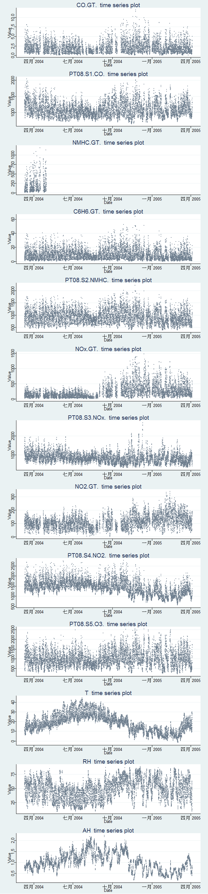<!-- -->

## Plot the missing value of data

```r
missmap(Data[,3:15],col = c("red","forestgreen"),main = "Missingness Map for Air Quality dataset")
```

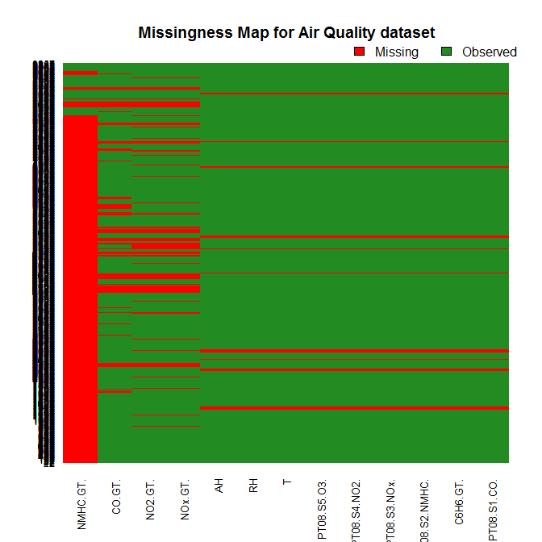<!-- -->

# Delete variable NMHC.GT., for it only has 0.097% data points
From the plot(when zooming in the plot afterward), we can identify that the dataset has a seasonal 
trend of 24 data points per cycle, briefly, has a 1-day cycle trend. By the scatterplot and the Missingness 
Map, we can see that nearly all of the data from the feature ??NMHC.GT.?? (NMHC(GT)) is missing, hence we 
exclude this attribute from the dataset in the further analysis. 


```r
HasData = NULL
for(col in 3:15) HasData[col-2] = length(c(na.exclude(Data[,col])))/dim(Data)[1];
HasData = data.matrix(HasData)
row.names(HasData) = c(Namelist[3:15])
colnames(HasData) = "Non NAs' Percentages"
kable(HasData)
```

                 Non NAs' Percentages
--------------  ---------------------
CO.GT.                      0.8201347
PT08.S1.CO.                 0.9608849
NMHC.GT.                    0.0976809
C6H6.GT.                    0.9608849
PT08.S2.NMHC.               0.9608849
NOx.GT.                     0.8248370
PT08.S3.NOx.                0.9608849
NO2.GT.                     0.8245164
PT08.S4.NO2.                0.9608849
PT08.S5.O3.                 0.9608849
T                           0.9608849
RH                          0.9608849
AH                          0.9608849

```r
AirQualityData = Data[,-5]
```

# Imput missing data by interpolation methods

```r
results = foreach(i=3:14,.packages='imputeTS') %dopar% {
  data.frame(as.matrix(na.seadec(ts(AirQualityData[,i],frequency = 24), algorithm = "interpolation")))}
AirData =  cbind.data.frame(AirQualityData[,1],AirQualityData[,2])
for(i in 1:12) AirData = cbind.data.frame(AirData,data.frame(results[[i]]))
colnames(AirData) = colnames(AirQualityData)
```
#Correlation plot before transformation

```r
corrplot(cor(AirData[,3:14]),hclust.method = "complete", 
         order="hclust", bg="lightblue", method = "square")
```

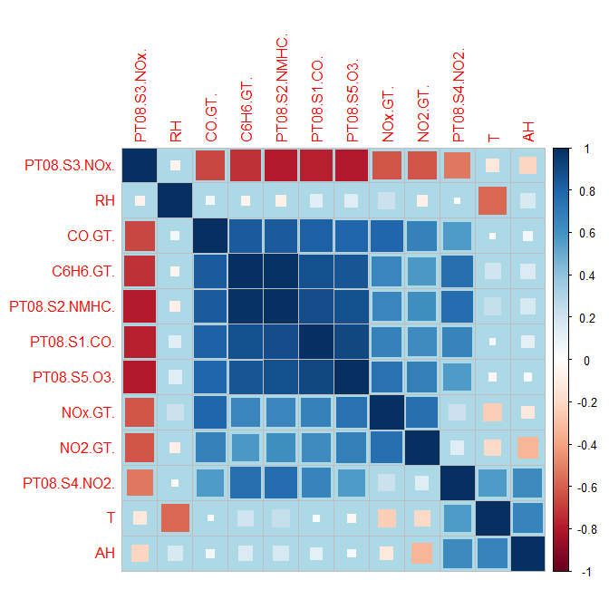<!-- -->

##Transform and rescale the data
$$
PT08.S3.NOx_{new} = \frac{1}{\frac{PT08.S3.NOx_{old}-min(PT08.S3.NOx_{old}+0.1)}{s.d.(min(PT08.S3.NOx_{old})+0.1)}} = \frac{s.d.(min(PT08.S3.NOx_{old}+0.1))}{PT08.S3.NOx_{old}-min(PT08.S3.NOx_{old})+0.1} 
$$
$$RH_{new} = 100-RH_{old} $$
The value 0.1 addition is just for the non-zero correction in scaling, which will alse be used when scaling in Kernel PCA in the next section. 


```r
AirDataOriginal = AirData #Make a copy
AirData$PT08.S3.NOx. = sd(AirData$PT08.S3.NOx.)/(AirData$PT08.S3.NOx.-mean(AirData$PT08.S3.NOx.))
AirData$RH = 100 - AirData$RH
AirData_mean = NULL;AirData_sd = NULL
for(col in 1:12){
  AirData_mean[col] =mean(AirData[,col+2]);
  AirData_sd[col] =var(AirData[,col+2]);
  AirData[,col+2] = (AirData[,col+2]-AirData_mean[col])/AirData_sd[col]
}
```
#Correlation plot after transformation

```r
corrplot(cor(AirData[,3:14]),hclust.method = "complete", 
         order="hclust", bg="lightblue", method = "square")
```

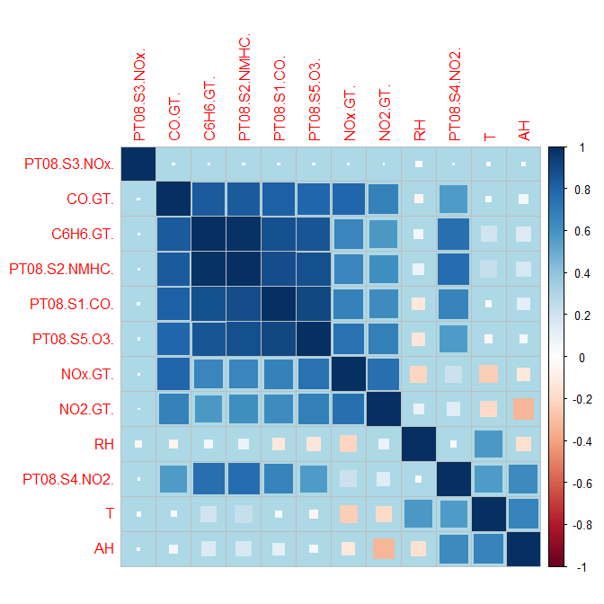<!-- -->

##BoxCox transform

```r
foreach(i=1:12,.packages="forecast") %dopar% {  
  BoxCox.lambda(1:length(AirDataOriginal[,i]));}
```

```
## [[1]]
## [1] 0.9999953
## 
## [[2]]
## [1] 0.9999953
## 
## [[3]]
## [1] 0.9999953
## 
## [[4]]
## [1] 0.9999953
## 
## [[5]]
## [1] 0.9999953
## 
## [[6]]
## [1] 0.9999953
## 
## [[7]]
## [1] 0.9999953
## 
## [[8]]
## [1] 0.9999953
## 
## [[9]]
## [1] 0.9999953
## 
## [[10]]
## [1] 0.9999953
## 
## [[11]]
## [1] 0.9999953
## 
## [[12]]
## [1] 0.9999953
```

# **Time Series Diagnosis Plot**

##ACF plot

```r
ACF = foreach(col=1:12, .packages=c('ggplot2','ggthemes')) %dopar% {
  autoplot(acf(AirDataOriginal[,col+2],lag.max = 30, plot = FALSE)) + 
    ggtitle(colnames(AirDataOriginal)[col+2]) + theme_economist()
}
grid.arrange(ACF[[1]],ACF[[2]],ACF[[3]],ACF[[4]],ACF[[5]],ACF[[6]],ACF[[7]],ACF[[8]],
             ACF[[9]],ACF[[10]],ACF[[11]],ACF[[12]], ncol = 4, nrow = 3)
```

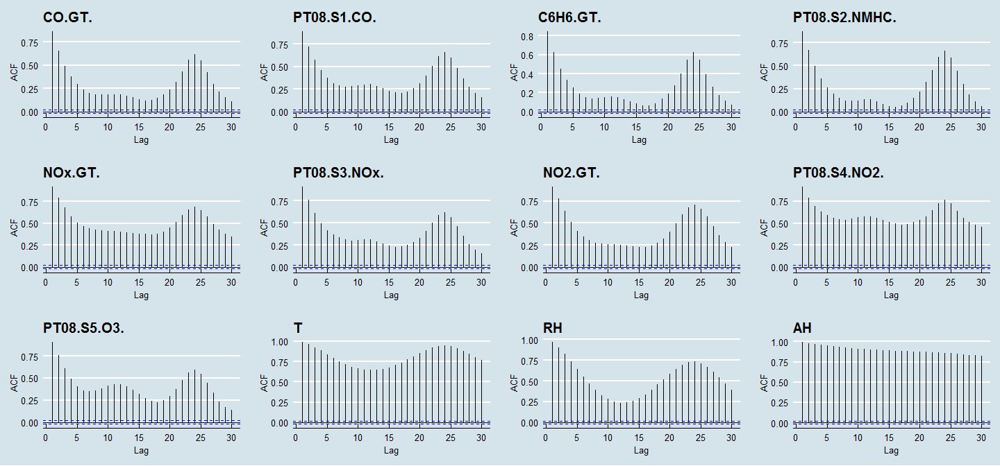<!-- -->

## **PACF plot**

```r
PACF = foreach(col=1:12, .packages=c('ggfortify','ggthemes')) %dopar% {
  autoplot(pacf(AirDataOriginal[,col+2],lag.max = 30, plot = FALSE)) + 
    ggtitle(colnames(AirDataOriginal)[col+2]) + theme_economist()
}
grid.arrange(PACF[[1]],PACF[[2]],PACF[[3]],PACF[[4]],PACF[[5]],PACF[[6]],PACF[[7]],PACF[[8]],
             PACF[[9]],PACF[[10]],PACF[[11]],PACF[[12]], ncol = 4, nrow = 3)
```

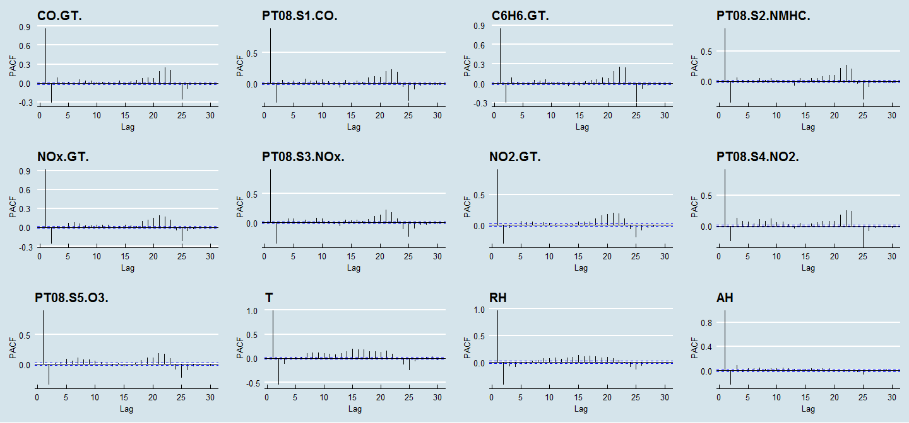<!-- -->

## **ACF plot with lag = 24**

```r
SACF = foreach(col=1:12, .packages=c('ggfortify','ggthemes')) %dopar% {
  autoplot (acf(diff(AirDataOriginal[,col+2],lag = 24),lag.max = 30, plot = FALSE)) + 
    ggtitle(colnames(AirDataOriginal)[col+2]) + theme_economist()
}

grid.arrange(SACF[[1]],SACF[[2]],SACF[[3]],SACF[[4]],SACF[[5]],SACF[[6]],SACF[[7]],SACF[[8]],
             SACF[[9]],SACF[[10]],SACF[[11]],SACF[[12]], ncol = 4, nrow = 3)
```

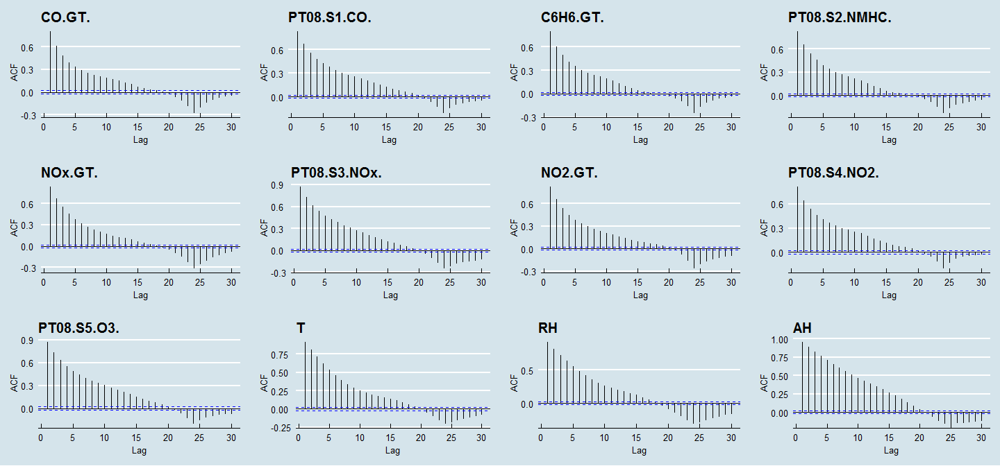<!-- -->

## **PACF plot with lag = 24**

```r
SPACF = foreach(col=1:12, .packages=c('ggfortify','ggthemes')) %dopar% {
  autoplot(pacf(diff(AirDataOriginal[,col+2],lag = 24),lag.max = 30, plot = FALSE)) + 
    ggtitle(colnames(AirDataOriginal)[col+2]) + theme_economist()
}
grid.arrange(SPACF[[1]],SPACF[[2]],SPACF[[3]],SPACF[[4]],SPACF[[5]],SPACF[[6]],SPACF[[7]],SPACF[[8]],
             SPACF[[9]],SPACF[[10]],SPACF[[11]],SPACF[[12]], ncol = 4, nrow = 3)
```

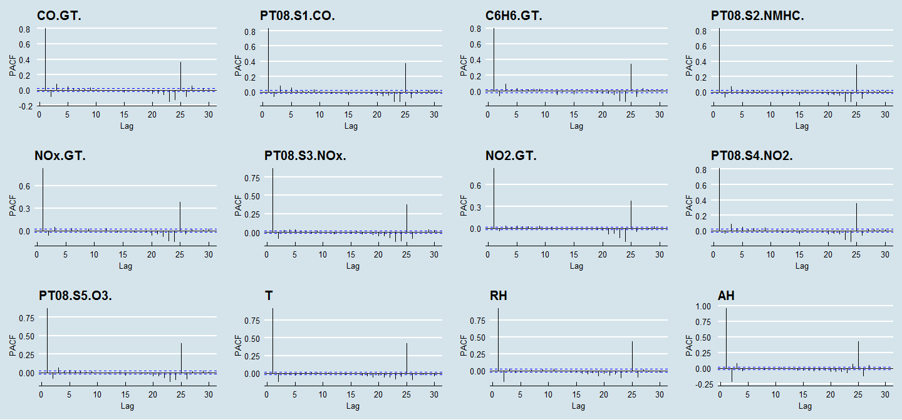<!-- -->

#`Kernel PCA`

```r
RASum = AirData$CO.GT.+ AirData$C6H6.GT. + AirData$NOx.GT. + AirData$NO2.GT.
kpc = kpca(cbind(AirData[,3:14],RASum),features = 1)
PCV_score = as.matrix(cbind(AirData[,3:14],RASum)) %*% pcv(kpc)
ggplot(cbind.data.frame(Timedate,PCV_score), aes(Timedate, PCV_score)) + geom_line(color="slategrey") + geom_point(color="slategrey",size = 0.7) + 
ggtitle("Kernel PCA score Series plot") + xlab("Date") + ylab("Kernel PCA scores")
```

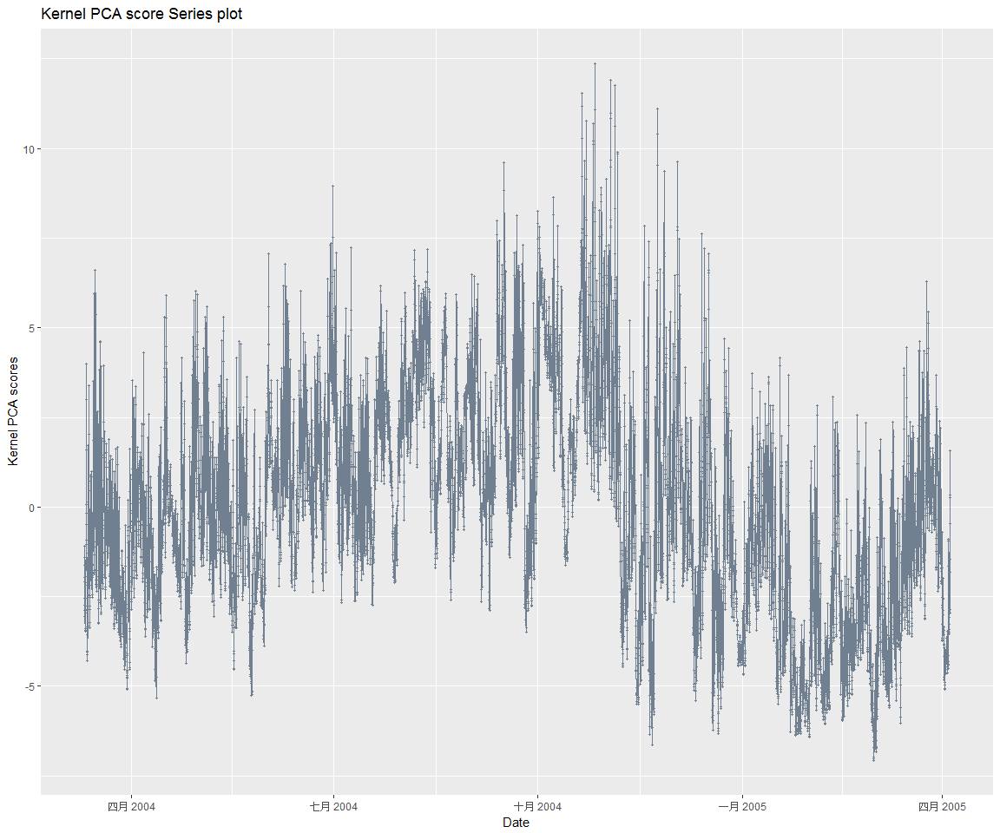<!-- -->


```r
TD = cbind.data.frame(Timedate,PCV_score)
time_kpca = seq(from = as.POSIXct(Timedate[1]), 
                  to = as.POSIXct( Timedate[length(Timedate)]), by = "hour")
Scoredata = xts(PCV_score, order.by = time_kpca)
colnames(Scoredata) = "Score"
dygraph(Scoredata, main = "Kernel PCA score Series plot", ylab = "Kernel PCA score") %>% 
dyOptions(drawPoints = TRUE, colors = RColorBrewer::brewer.pal(7, "Set2")) %>% 
dyRangeSelector()
```

<!--html_preserve--><div id="htmlwidget-911c30e1988b1db4dc1e" style="width:1152px;height:960px;" class="dygraphs html-widget"></div>
<script type="application/json" data-for="htmlwidget-911c30e1988b1db4dc1e">{"x":{"attrs":{"title":"Kernel PCA score Series plot","ylabel":"Kernel PCA score","labels":["hour","Score"],"legend":"auto","retainDateWindow":false,"axes":{"x":{"pixelsPerLabel":60,"drawAxis":true},"y":{"drawAxis":true}},"stackedGraph":false,"fillGraph":false,"fillAlpha":0.15,"stepPlot":false,"drawPoints":true,"pointSize":1,"drawGapEdgePoints":false,"connectSeparatedPoints":false,"strokeWidth":1,"strokeBorderColor":"white","colors":["#66C2A5","#FC8D62","#8DA0CB","#E78AC3","#A6D854","#FFD92F","#E5C494"],"colorValue":0.5,"colorSaturation":1,"includeZero":false,"drawAxesAtZero":false,"logscale":false,"axisTickSize":3,"axisLineColor":"black","axisLineWidth":0.3,"axisLabelColor":"black","axisLabelFontSize":14,"axisLabelWidth":60,"drawGrid":true,"gridLineWidth":0.3,"rightGap":5,"digitsAfterDecimal":2,"labelsKMB":false,"labelsKMG2":false,"labelsUTC":false,"maxNumberWidth":6,"animatedZooms":false,"mobileDisableYTouch":true,"showRangeSelector":true,"rangeSelectorHeight":40,"rangeSelectorPlotFillColor":" #A7B1C4","rangeSelectorPlotStrokeColor":"#808FAB","interactionModel":"Dygraph.Interaction.defaultModel"},"scale":"hourly","annotations":[],"shadings":[],"events":[],"format":"date","data":[["2004-03-10T10:00:00.000Z","2004-03-10T11:00:00.000Z","2004-03-10T12:00:00.000Z","2004-03-10T13:00:00.000Z","2004-03-10T14:00:00.000Z","2004-03-10T15:00:00.000Z","2004-03-10T16:00:00.000Z","2004-03-10T17:00:00.000Z","2004-03-10T18:00:00.000Z","2004-03-10T19:00:00.000Z","2004-03-10T20:00:00.000Z","2004-03-10T21:00:00.000Z","2004-03-10T22:00:00.000Z","2004-03-10T23:00:00.000Z","2004-03-11T00:00:00.000Z","2004-03-11T01:00:00.000Z","2004-03-11T02:00:00.000Z","2004-03-11T03:00:00.000Z","2004-03-11T04:00:00.000Z","2004-03-11T05:00:00.000Z","2004-03-11T06:00:00.000Z","2004-03-11T07:00:00.000Z","2004-03-11T08:00:00.000Z","2004-03-11T09:00:00.000Z","2004-03-11T10:00:00.000Z","2004-03-11T11:00:00.000Z","2004-03-11T12:00:00.000Z","2004-03-11T13:00:00.000Z","2004-03-11T14:00:00.000Z","2004-03-11T15:00:00.000Z","2004-03-11T16:00:00.000Z","2004-03-11T17:00:00.000Z","2004-03-11T18:00:00.000Z","2004-03-11T19:00:00.000Z","2004-03-11T20:00:00.000Z","2004-03-11T21:00:00.000Z","2004-03-11T22:00:00.000Z","2004-03-11T23:00:00.000Z","2004-03-12T00:00:00.000Z","2004-03-12T01:00:00.000Z","2004-03-12T02:00:00.000Z","2004-03-12T03:00:00.000Z","2004-03-12T04:00:00.000Z","2004-03-12T05:00:00.000Z","2004-03-12T06:00:00.000Z","2004-03-12T07:00:00.000Z","2004-03-12T08:00:00.000Z","2004-03-12T09:00:00.000Z","2004-03-12T10:00:00.000Z","2004-03-12T11:00:00.000Z","2004-03-12T12:00:00.000Z","2004-03-12T13:00:00.000Z","2004-03-12T14:00:00.000Z","2004-03-12T15:00:00.000Z","2004-03-12T16:00:00.000Z","2004-03-12T17:00:00.000Z","2004-03-12T18:00:00.000Z","2004-03-12T19:00:00.000Z","2004-03-12T20:00:00.000Z","2004-03-12T21:00:00.000Z","2004-03-12T22:00:00.000Z","2004-03-12T23:00:00.000Z","2004-03-13T00:00:00.000Z","2004-03-13T01:00:00.000Z","2004-03-13T02:00:00.000Z","2004-03-13T03:00:00.000Z","2004-03-13T04:00:00.000Z","2004-03-13T05:00:00.000Z","2004-03-13T06:00:00.000Z","2004-03-13T07:00:00.000Z","2004-03-13T08:00:00.000Z","2004-03-13T09:00:00.000Z","2004-03-13T10:00:00.000Z","2004-03-13T11:00:00.000Z","2004-03-13T12:00:00.000Z","2004-03-13T13:00:00.000Z","2004-03-13T14:00:00.000Z","2004-03-13T15:00:00.000Z","2004-03-13T16:00:00.000Z","2004-03-13T17:00:00.000Z","2004-03-13T18:00:00.000Z","2004-03-13T19:00:00.000Z","2004-03-13T20:00:00.000Z","2004-03-13T21:00:00.000Z","2004-03-13T22:00:00.000Z","2004-03-13T23:00:00.000Z","2004-03-14T00:00:00.000Z","2004-03-14T01:00:00.000Z","2004-03-14T02:00:00.000Z","2004-03-14T03:00:00.000Z","2004-03-14T04:00:00.000Z","2004-03-14T05:00:00.000Z","2004-03-14T06:00:00.000Z","2004-03-14T07:00:00.000Z","2004-03-14T08:00:00.000Z","2004-03-14T09:00:00.000Z","2004-03-14T10:00:00.000Z","2004-03-14T11:00:00.000Z","2004-03-14T12:00:00.000Z","2004-03-14T13:00:00.000Z","2004-03-14T14:00:00.000Z","2004-03-14T15:00:00.000Z","2004-03-14T16:00:00.000Z","2004-03-14T17:00:00.000Z","2004-03-14T18:00:00.000Z","2004-03-14T19:00:00.000Z","2004-03-14T20:00:00.000Z","2004-03-14T21:00:00.000Z","2004-03-14T22:00:00.000Z","2004-03-14T23:00:00.000Z","2004-03-15T00:00:00.000Z","2004-03-15T01:00:00.000Z","2004-03-15T02:00:00.000Z","2004-03-15T03:00:00.000Z","2004-03-15T04:00:00.000Z","2004-03-15T05:00:00.000Z","2004-03-15T06:00:00.000Z","2004-03-15T07:00:00.000Z","2004-03-15T08:00:00.000Z","2004-03-15T09:00:00.000Z","2004-03-15T10:00:00.000Z","2004-03-15T11:00:00.000Z","2004-03-15T12:00:00.000Z","2004-03-15T13:00:00.000Z","2004-03-15T14:00:00.000Z","2004-03-15T15:00:00.000Z","2004-03-15T16:00:00.000Z","2004-03-15T17:00:00.000Z","2004-03-15T18:00:00.000Z","2004-03-15T19:00:00.000Z","2004-03-15T20:00:00.000Z","2004-03-15T21:00:00.000Z","2004-03-15T22:00:00.000Z","2004-03-15T23:00:00.000Z","2004-03-16T00:00:00.000Z","2004-03-16T01:00:00.000Z","2004-03-16T02:00:00.000Z","2004-03-16T03:00:00.000Z","2004-03-16T04:00:00.000Z","2004-03-16T05:00:00.000Z","2004-03-16T06:00:00.000Z","2004-03-16T07:00:00.000Z","2004-03-16T08:00:00.000Z","2004-03-16T09:00:00.000Z","2004-03-16T10:00:00.000Z","2004-03-16T11:00:00.000Z","2004-03-16T12:00:00.000Z","2004-03-16T13:00:00.000Z","2004-03-16T14:00:00.000Z","2004-03-16T15:00:00.000Z","2004-03-16T16:00:00.000Z","2004-03-16T17:00:00.000Z","2004-03-16T18:00:00.000Z","2004-03-16T19:00:00.000Z","2004-03-16T20:00:00.000Z","2004-03-16T21:00:00.000Z","2004-03-16T22:00:00.000Z","2004-03-16T23:00:00.000Z","2004-03-17T00:00:00.000Z","2004-03-17T01:00:00.000Z","2004-03-17T02:00:00.000Z","2004-03-17T03:00:00.000Z","2004-03-17T04:00:00.000Z","2004-03-17T05:00:00.000Z","2004-03-17T06:00:00.000Z","2004-03-17T07:00:00.000Z","2004-03-17T08:00:00.000Z","2004-03-17T09:00:00.000Z","2004-03-17T10:00:00.000Z","2004-03-17T11:00:00.000Z","2004-03-17T12:00:00.000Z","2004-03-17T13:00:00.000Z","2004-03-17T14:00:00.000Z","2004-03-17T15:00:00.000Z","2004-03-17T16:00:00.000Z","2004-03-17T17:00:00.000Z","2004-03-17T18:00:00.000Z","2004-03-17T19:00:00.000Z","2004-03-17T20:00:00.000Z","2004-03-17T21:00:00.000Z","2004-03-17T22:00:00.000Z","2004-03-17T23:00:00.000Z","2004-03-18T00:00:00.000Z","2004-03-18T01:00:00.000Z","2004-03-18T02:00:00.000Z","2004-03-18T03:00:00.000Z","2004-03-18T04:00:00.000Z","2004-03-18T05:00:00.000Z","2004-03-18T06:00:00.000Z","2004-03-18T07:00:00.000Z","2004-03-18T08:00:00.000Z","2004-03-18T09:00:00.000Z","2004-03-18T10:00:00.000Z","2004-03-18T11:00:00.000Z","2004-03-18T12:00:00.000Z","2004-03-18T13:00:00.000Z","2004-03-18T14:00:00.000Z","2004-03-18T15:00:00.000Z","2004-03-18T16:00:00.000Z","2004-03-18T17:00:00.000Z","2004-03-18T18:00:00.000Z","2004-03-18T19:00:00.000Z","2004-03-18T20:00:00.000Z","2004-03-18T21:00:00.000Z","2004-03-18T22:00:00.000Z","2004-03-18T23:00:00.000Z","2004-03-19T00:00:00.000Z","2004-03-19T01:00:00.000Z","2004-03-19T02:00:00.000Z","2004-03-19T03:00:00.000Z","2004-03-19T04:00:00.000Z","2004-03-19T05:00:00.000Z","2004-03-19T06:00:00.000Z","2004-03-19T07:00:00.000Z","2004-03-19T08:00:00.000Z","2004-03-19T09:00:00.000Z","2004-03-19T10:00:00.000Z","2004-03-19T11:00:00.000Z","2004-03-19T12:00:00.000Z","2004-03-19T13:00:00.000Z","2004-03-19T14:00:00.000Z","2004-03-19T15:00:00.000Z","2004-03-19T16:00:00.000Z","2004-03-19T17:00:00.000Z","2004-03-19T18:00:00.000Z","2004-03-19T19:00:00.000Z","2004-03-19T20:00:00.000Z","2004-03-19T21:00:00.000Z","2004-03-19T22:00:00.000Z","2004-03-19T23:00:00.000Z","2004-03-20T00:00:00.000Z","2004-03-20T01:00:00.000Z","2004-03-20T02:00:00.000Z","2004-03-20T03:00:00.000Z","2004-03-20T04:00:00.000Z","2004-03-20T05:00:00.000Z","2004-03-20T06:00:00.000Z","2004-03-20T07:00:00.000Z","2004-03-20T08:00:00.000Z","2004-03-20T09:00:00.000Z","2004-03-20T10:00:00.000Z","2004-03-20T11:00:00.000Z","2004-03-20T12:00:00.000Z","2004-03-20T13:00:00.000Z","2004-03-20T14:00:00.000Z","2004-03-20T15:00:00.000Z","2004-03-20T16:00:00.000Z","2004-03-20T17:00:00.000Z","2004-03-20T18:00:00.000Z","2004-03-20T19:00:00.000Z","2004-03-20T20:00:00.000Z","2004-03-20T21:00:00.000Z","2004-03-20T22:00:00.000Z","2004-03-20T23:00:00.000Z","2004-03-21T00:00:00.000Z","2004-03-21T01:00:00.000Z","2004-03-21T02:00:00.000Z","2004-03-21T03:00:00.000Z","2004-03-21T04:00:00.000Z","2004-03-21T05:00:00.000Z","2004-03-21T06:00:00.000Z","2004-03-21T07:00:00.000Z","2004-03-21T08:00:00.000Z","2004-03-21T09:00:00.000Z","2004-03-21T10:00:00.000Z","2004-03-21T11:00:00.000Z","2004-03-21T12:00:00.000Z","2004-03-21T13:00:00.000Z","2004-03-21T14:00:00.000Z","2004-03-21T15:00:00.000Z","2004-03-21T16:00:00.000Z","2004-03-21T17:00:00.000Z","2004-03-21T18:00:00.000Z","2004-03-21T19:00:00.000Z","2004-03-21T20:00:00.000Z","2004-03-21T21:00:00.000Z","2004-03-21T22:00:00.000Z","2004-03-21T23:00:00.000Z","2004-03-22T00:00:00.000Z","2004-03-22T01:00:00.000Z","2004-03-22T02:00:00.000Z","2004-03-22T03:00:00.000Z","2004-03-22T04:00:00.000Z","2004-03-22T05:00:00.000Z","2004-03-22T06:00:00.000Z","2004-03-22T07:00:00.000Z","2004-03-22T08:00:00.000Z","2004-03-22T09:00:00.000Z","2004-03-22T10:00:00.000Z","2004-03-22T11:00:00.000Z","2004-03-22T12:00:00.000Z","2004-03-22T13:00:00.000Z","2004-03-22T14:00:00.000Z","2004-03-22T15:00:00.000Z","2004-03-22T16:00:00.000Z","2004-03-22T17:00:00.000Z","2004-03-22T18:00:00.000Z","2004-03-22T19:00:00.000Z","2004-03-22T20:00:00.000Z","2004-03-22T21:00:00.000Z","2004-03-22T22:00:00.000Z","2004-03-22T23:00:00.000Z","2004-03-23T00:00:00.000Z","2004-03-23T01:00:00.000Z","2004-03-23T02:00:00.000Z","2004-03-23T03:00:00.000Z","2004-03-23T04:00:00.000Z","2004-03-23T05:00:00.000Z","2004-03-23T06:00:00.000Z","2004-03-23T07:00:00.000Z","2004-03-23T08:00:00.000Z","2004-03-23T09:00:00.000Z","2004-03-23T10:00:00.000Z","2004-03-23T11:00:00.000Z","2004-03-23T12:00:00.000Z","2004-03-23T13:00:00.000Z","2004-03-23T14:00:00.000Z","2004-03-23T15:00:00.000Z","2004-03-23T16:00:00.000Z","2004-03-23T17:00:00.000Z","2004-03-23T18:00:00.000Z","2004-03-23T19:00:00.000Z","2004-03-23T20:00:00.000Z","2004-03-23T21:00:00.000Z","2004-03-23T22:00:00.000Z","2004-03-23T23:00:00.000Z","2004-03-24T00:00:00.000Z","2004-03-24T01:00:00.000Z","2004-03-24T02:00:00.000Z","2004-03-24T03:00:00.000Z","2004-03-24T04:00:00.000Z","2004-03-24T05:00:00.000Z","2004-03-24T06:00:00.000Z","2004-03-24T07:00:00.000Z","2004-03-24T08:00:00.000Z","2004-03-24T09:00:00.000Z","2004-03-24T10:00:00.000Z","2004-03-24T11:00:00.000Z","2004-03-24T12:00:00.000Z","2004-03-24T13:00:00.000Z","2004-03-24T14:00:00.000Z","2004-03-24T15:00:00.000Z","2004-03-24T16:00:00.000Z","2004-03-24T17:00:00.000Z","2004-03-24T18:00:00.000Z","2004-03-24T19:00:00.000Z","2004-03-24T20:00:00.000Z","2004-03-24T21:00:00.000Z","2004-03-24T22:00:00.000Z","2004-03-24T23:00:00.000Z","2004-03-25T00:00:00.000Z","2004-03-25T01:00:00.000Z","2004-03-25T02:00:00.000Z","2004-03-25T03:00:00.000Z","2004-03-25T04:00:00.000Z","2004-03-25T05:00:00.000Z","2004-03-25T06:00:00.000Z","2004-03-25T07:00:00.000Z","2004-03-25T08:00:00.000Z","2004-03-25T09:00:00.000Z","2004-03-25T10:00:00.000Z","2004-03-25T11:00:00.000Z","2004-03-25T12:00:00.000Z","2004-03-25T13:00:00.000Z","2004-03-25T14:00:00.000Z","2004-03-25T15:00:00.000Z","2004-03-25T16:00:00.000Z","2004-03-25T17:00:00.000Z","2004-03-25T18:00:00.000Z","2004-03-25T19:00:00.000Z","2004-03-25T20:00:00.000Z","2004-03-25T21:00:00.000Z","2004-03-25T22:00:00.000Z","2004-03-25T23:00:00.000Z","2004-03-26T00:00:00.000Z","2004-03-26T01:00:00.000Z","2004-03-26T02:00:00.000Z","2004-03-26T03:00:00.000Z","2004-03-26T04:00:00.000Z","2004-03-26T05:00:00.000Z","2004-03-26T06:00:00.000Z","2004-03-26T07:00:00.000Z","2004-03-26T08:00:00.000Z","2004-03-26T09:00:00.000Z","2004-03-26T10:00:00.000Z","2004-03-26T11:00:00.000Z","2004-03-26T12:00:00.000Z","2004-03-26T13:00:00.000Z","2004-03-26T14:00:00.000Z","2004-03-26T15:00:00.000Z","2004-03-26T16:00:00.000Z","2004-03-26T17:00:00.000Z","2004-03-26T18:00:00.000Z","2004-03-26T19:00:00.000Z","2004-03-26T20:00:00.000Z","2004-03-26T21:00:00.000Z","2004-03-26T22:00:00.000Z","2004-03-26T23:00:00.000Z","2004-03-27T00:00:00.000Z","2004-03-27T01:00:00.000Z","2004-03-27T02:00:00.000Z","2004-03-27T03:00:00.000Z","2004-03-27T04:00:00.000Z","2004-03-27T05:00:00.000Z","2004-03-27T06:00:00.000Z","2004-03-27T07:00:00.000Z","2004-03-27T08:00:00.000Z","2004-03-27T09:00:00.000Z","2004-03-27T10:00:00.000Z","2004-03-27T11:00:00.000Z","2004-03-27T12:00:00.000Z","2004-03-27T13:00:00.000Z","2004-03-27T14:00:00.000Z","2004-03-27T15:00:00.000Z","2004-03-27T16:00:00.000Z","2004-03-27T17:00:00.000Z","2004-03-27T18:00:00.000Z","2004-03-27T19:00:00.000Z","2004-03-27T20:00:00.000Z","2004-03-27T21:00:00.000Z","2004-03-27T22:00:00.000Z","2004-03-27T23:00:00.000Z","2004-03-28T00:00:00.000Z","2004-03-28T01:00:00.000Z","2004-03-28T02:00:00.000Z","2004-03-28T03:00:00.000Z","2004-03-28T04:00:00.000Z","2004-03-28T05:00:00.000Z","2004-03-28T06:00:00.000Z","2004-03-28T07:00:00.000Z","2004-03-28T08:00:00.000Z","2004-03-28T09:00:00.000Z","2004-03-28T10:00:00.000Z","2004-03-28T11:00:00.000Z","2004-03-28T12:00:00.000Z","2004-03-28T13:00:00.000Z","2004-03-28T14:00:00.000Z","2004-03-28T15:00:00.000Z","2004-03-28T16:00:00.000Z","2004-03-28T17:00:00.000Z","2004-03-28T18:00:00.000Z","2004-03-28T19:00:00.000Z","2004-03-28T20:00:00.000Z","2004-03-28T21:00:00.000Z","2004-03-28T22:00:00.000Z","2004-03-28T23:00:00.000Z","2004-03-29T00:00:00.000Z","2004-03-29T01:00:00.000Z","2004-03-29T02:00:00.000Z","2004-03-29T03:00:00.000Z","2004-03-29T04:00:00.000Z","2004-03-29T05:00:00.000Z","2004-03-29T06:00:00.000Z","2004-03-29T07:00:00.000Z","2004-03-29T08:00:00.000Z","2004-03-29T09:00:00.000Z","2004-03-29T10:00:00.000Z","2004-03-29T11:00:00.000Z","2004-03-29T12:00:00.000Z","2004-03-29T13:00:00.000Z","2004-03-29T14:00:00.000Z","2004-03-29T15:00:00.000Z","2004-03-29T16:00:00.000Z","2004-03-29T17:00:00.000Z","2004-03-29T18:00:00.000Z","2004-03-29T19:00:00.000Z","2004-03-29T20:00:00.000Z","2004-03-29T21:00:00.000Z","2004-03-29T22:00:00.000Z","2004-03-29T23:00:00.000Z","2004-03-30T00:00:00.000Z","2004-03-30T01:00:00.000Z","2004-03-30T02:00:00.000Z","2004-03-30T03:00:00.000Z","2004-03-30T04:00:00.000Z","2004-03-30T05:00:00.000Z","2004-03-30T06:00:00.000Z","2004-03-30T07:00:00.000Z","2004-03-30T08:00:00.000Z","2004-03-30T09:00:00.000Z","2004-03-30T10:00:00.000Z","2004-03-30T11:00:00.000Z","2004-03-30T12:00:00.000Z","2004-03-30T13:00:00.000Z","2004-03-30T14:00:00.000Z","2004-03-30T15:00:00.000Z","2004-03-30T16:00:00.000Z","2004-03-30T17:00:00.000Z","2004-03-30T18:00:00.000Z","2004-03-30T19:00:00.000Z","2004-03-30T20:00:00.000Z","2004-03-30T21:00:00.000Z","2004-03-30T22:00:00.000Z","2004-03-30T23:00:00.000Z","2004-03-31T00:00:00.000Z","2004-03-31T01:00:00.000Z","2004-03-31T02:00:00.000Z","2004-03-31T03:00:00.000Z","2004-03-31T04:00:00.000Z","2004-03-31T05:00:00.000Z","2004-03-31T06:00:00.000Z","2004-03-31T07:00:00.000Z","2004-03-31T08:00:00.000Z","2004-03-31T09:00:00.000Z","2004-03-31T10:00:00.000Z","2004-03-31T11:00:00.000Z","2004-03-31T12:00:00.000Z","2004-03-31T13:00:00.000Z","2004-03-31T14:00:00.000Z","2004-03-31T15:00:00.000Z","2004-03-31T16:00:00.000Z","2004-03-31T17:00:00.000Z","2004-03-31T18:00:00.000Z","2004-03-31T19:00:00.000Z","2004-03-31T20:00:00.000Z","2004-03-31T21:00:00.000Z","2004-03-31T22:00:00.000Z","2004-03-31T23:00:00.000Z","2004-04-01T00:00:00.000Z","2004-04-01T01:00:00.000Z","2004-04-01T02:00:00.000Z","2004-04-01T03:00:00.000Z","2004-04-01T04:00:00.000Z","2004-04-01T05:00:00.000Z","2004-04-01T06:00:00.000Z","2004-04-01T07:00:00.000Z","2004-04-01T08:00:00.000Z","2004-04-01T09:00:00.000Z","2004-04-01T10:00:00.000Z","2004-04-01T11:00:00.000Z","2004-04-01T12:00:00.000Z","2004-04-01T13:00:00.000Z","2004-04-01T14:00:00.000Z","2004-04-01T15:00:00.000Z","2004-04-01T16:00:00.000Z","2004-04-01T17:00:00.000Z","2004-04-01T18:00:00.000Z","2004-04-01T19:00:00.000Z","2004-04-01T20:00:00.000Z","2004-04-01T21:00:00.000Z","2004-04-01T22:00:00.000Z","2004-04-01T23:00:00.000Z","2004-04-02T00:00:00.000Z","2004-04-02T01:00:00.000Z","2004-04-02T02:00:00.000Z","2004-04-02T03:00:00.000Z","2004-04-02T04:00:00.000Z","2004-04-02T05:00:00.000Z","2004-04-02T06:00:00.000Z","2004-04-02T07:00:00.000Z","2004-04-02T08:00:00.000Z","2004-04-02T09:00:00.000Z","2004-04-02T10:00:00.000Z","2004-04-02T11:00:00.000Z","2004-04-02T12:00:00.000Z","2004-04-02T13:00:00.000Z","2004-04-02T14:00:00.000Z","2004-04-02T15:00:00.000Z","2004-04-02T16:00:00.000Z","2004-04-02T17:00:00.000Z","2004-04-02T18:00:00.000Z","2004-04-02T19:00:00.000Z","2004-04-02T20:00:00.000Z","2004-04-02T21:00:00.000Z","2004-04-02T22:00:00.000Z","2004-04-02T23:00:00.000Z","2004-04-03T00:00:00.000Z","2004-04-03T01:00:00.000Z","2004-04-03T02:00:00.000Z","2004-04-03T03:00:00.000Z","2004-04-03T04:00:00.000Z","2004-04-03T05:00:00.000Z","2004-04-03T06:00:00.000Z","2004-04-03T07:00:00.000Z","2004-04-03T08:00:00.000Z","2004-04-03T09:00:00.000Z","2004-04-03T10:00:00.000Z","2004-04-03T11:00:00.000Z","2004-04-03T12:00:00.000Z","2004-04-03T13:00:00.000Z","2004-04-03T14:00:00.000Z","2004-04-03T15:00:00.000Z","2004-04-03T16:00:00.000Z","2004-04-03T17:00:00.000Z","2004-04-03T18:00:00.000Z","2004-04-03T19:00:00.000Z","2004-04-03T20:00:00.000Z","2004-04-03T21:00:00.000Z","2004-04-03T22:00:00.000Z","2004-04-03T23:00:00.000Z","2004-04-04T00:00:00.000Z","2004-04-04T01:00:00.000Z","2004-04-04T02:00:00.000Z","2004-04-04T03:00:00.000Z","2004-04-04T04:00:00.000Z","2004-04-04T05:00:00.000Z","2004-04-04T06:00:00.000Z","2004-04-04T07:00:00.000Z","2004-04-04T08:00:00.000Z","2004-04-04T09:00:00.000Z","2004-04-04T10:00:00.000Z","2004-04-04T11:00:00.000Z","2004-04-04T12:00:00.000Z","2004-04-04T13:00:00.000Z","2004-04-04T14:00:00.000Z","2004-04-04T15:00:00.000Z","2004-04-04T16:00:00.000Z","2004-04-04T17:00:00.000Z","2004-04-04T18:00:00.000Z","2004-04-04T19:00:00.000Z","2004-04-04T20:00:00.000Z","2004-04-04T21:00:00.000Z","2004-04-04T22:00:00.000Z","2004-04-04T23:00:00.000Z","2004-04-05T00:00:00.000Z","2004-04-05T01:00:00.000Z","2004-04-05T02:00:00.000Z","2004-04-05T03:00:00.000Z","2004-04-05T04:00:00.000Z","2004-04-05T05:00:00.000Z","2004-04-05T06:00:00.000Z","2004-04-05T07:00:00.000Z","2004-04-05T08:00:00.000Z","2004-04-05T09:00:00.000Z","2004-04-05T10:00:00.000Z","2004-04-05T11:00:00.000Z","2004-04-05T12:00:00.000Z","2004-04-05T13:00:00.000Z","2004-04-05T14:00:00.000Z","2004-04-05T15:00:00.000Z","2004-04-05T16:00:00.000Z","2004-04-05T17:00:00.000Z","2004-04-05T18:00:00.000Z","2004-04-05T19:00:00.000Z","2004-04-05T20:00:00.000Z","2004-04-05T21:00:00.000Z","2004-04-05T22:00:00.000Z","2004-04-05T23:00:00.000Z","2004-04-06T00:00:00.000Z","2004-04-06T01:00:00.000Z","2004-04-06T02:00:00.000Z","2004-04-06T03:00:00.000Z","2004-04-06T04:00:00.000Z","2004-04-06T05:00:00.000Z","2004-04-06T06:00:00.000Z","2004-04-06T07:00:00.000Z","2004-04-06T08:00:00.000Z","2004-04-06T09:00:00.000Z","2004-04-06T10:00:00.000Z","2004-04-06T11:00:00.000Z","2004-04-06T12:00:00.000Z","2004-04-06T13:00:00.000Z","2004-04-06T14:00:00.000Z","2004-04-06T15:00:00.000Z","2004-04-06T16:00:00.000Z","2004-04-06T17:00:00.000Z","2004-04-06T18:00:00.000Z","2004-04-06T19:00:00.000Z","2004-04-06T20:00:00.000Z","2004-04-06T21:00:00.000Z","2004-04-06T22:00:00.000Z","2004-04-06T23:00:00.000Z","2004-04-07T00:00:00.000Z","2004-04-07T01:00:00.000Z","2004-04-07T02:00:00.000Z","2004-04-07T03:00:00.000Z","2004-04-07T04:00:00.000Z","2004-04-07T05:00:00.000Z","2004-04-07T06:00:00.000Z","2004-04-07T07:00:00.000Z","2004-04-07T08:00:00.000Z","2004-04-07T09:00:00.000Z","2004-04-07T10:00:00.000Z","2004-04-07T11:00:00.000Z","2004-04-07T12:00:00.000Z","2004-04-07T13:00:00.000Z","2004-04-07T14:00:00.000Z","2004-04-07T15:00:00.000Z","2004-04-07T16:00:00.000Z","2004-04-07T17:00:00.000Z","2004-04-07T18:00:00.000Z","2004-04-07T19:00:00.000Z","2004-04-07T20:00:00.000Z","2004-04-07T21:00:00.000Z","2004-04-07T22:00:00.000Z","2004-04-07T23:00:00.000Z","2004-04-08T00:00:00.000Z","2004-04-08T01:00:00.000Z","2004-04-08T02:00:00.000Z","2004-04-08T03:00:00.000Z","2004-04-08T04:00:00.000Z","2004-04-08T05:00:00.000Z","2004-04-08T06:00:00.000Z","2004-04-08T07:00:00.000Z","2004-04-08T08:00:00.000Z","2004-04-08T09:00:00.000Z","2004-04-08T10:00:00.000Z","2004-04-08T11:00:00.000Z","2004-04-08T12:00:00.000Z","2004-04-08T13:00:00.000Z","2004-04-08T14:00:00.000Z","2004-04-08T15:00:00.000Z","2004-04-08T16:00:00.000Z","2004-04-08T17:00:00.000Z","2004-04-08T18:00:00.000Z","2004-04-08T19:00:00.000Z","2004-04-08T20:00:00.000Z","2004-04-08T21:00:00.000Z","2004-04-08T22:00:00.000Z","2004-04-08T23:00:00.000Z","2004-04-09T00:00:00.000Z","2004-04-09T01:00:00.000Z","2004-04-09T02:00:00.000Z","2004-04-09T03:00:00.000Z","2004-04-09T04:00:00.000Z","2004-04-09T05:00:00.000Z","2004-04-09T06:00:00.000Z","2004-04-09T07:00:00.000Z","2004-04-09T08:00:00.000Z","2004-04-09T09:00:00.000Z","2004-04-09T10:00:00.000Z","2004-04-09T11:00:00.000Z","2004-04-09T12:00:00.000Z","2004-04-09T13:00:00.000Z","2004-04-09T14:00:00.000Z","2004-04-09T15:00:00.000Z","2004-04-09T16:00:00.000Z","2004-04-09T17:00:00.000Z","2004-04-09T18:00:00.000Z","2004-04-09T19:00:00.000Z","2004-04-09T20:00:00.000Z","2004-04-09T21:00:00.000Z","2004-04-09T22:00:00.000Z","2004-04-09T23:00:00.000Z","2004-04-10T00:00:00.000Z","2004-04-10T01:00:00.000Z","2004-04-10T02:00:00.000Z","2004-04-10T03:00:00.000Z","2004-04-10T04:00:00.000Z","2004-04-10T05:00:00.000Z","2004-04-10T06:00:00.000Z","2004-04-10T07:00:00.000Z","2004-04-10T08:00:00.000Z","2004-04-10T09:00:00.000Z","2004-04-10T10:00:00.000Z","2004-04-10T11:00:00.000Z","2004-04-10T12:00:00.000Z","2004-04-10T13:00:00.000Z","2004-04-10T14:00:00.000Z","2004-04-10T15:00:00.000Z","2004-04-10T16:00:00.000Z","2004-04-10T17:00:00.000Z","2004-04-10T18:00:00.000Z","2004-04-10T19:00:00.000Z","2004-04-10T20:00:00.000Z","2004-04-10T21:00:00.000Z","2004-04-10T22:00:00.000Z","2004-04-10T23:00:00.000Z","2004-04-11T00:00:00.000Z","2004-04-11T01:00:00.000Z","2004-04-11T02:00:00.000Z","2004-04-11T03:00:00.000Z","2004-04-11T04:00:00.000Z","2004-04-11T05:00:00.000Z","2004-04-11T06:00:00.000Z","2004-04-11T07:00:00.000Z","2004-04-11T08:00:00.000Z","2004-04-11T09:00:00.000Z","2004-04-11T10:00:00.000Z","2004-04-11T11:00:00.000Z","2004-04-11T12:00:00.000Z","2004-04-11T13:00:00.000Z","2004-04-11T14:00:00.000Z","2004-04-11T15:00:00.000Z","2004-04-11T16:00:00.000Z","2004-04-11T17:00:00.000Z","2004-04-11T18:00:00.000Z","2004-04-11T19:00:00.000Z","2004-04-11T20:00:00.000Z","2004-04-11T21:00:00.000Z","2004-04-11T22:00:00.000Z","2004-04-11T23:00:00.000Z","2004-04-12T00:00:00.000Z","2004-04-12T01:00:00.000Z","2004-04-12T02:00:00.000Z","2004-04-12T03:00:00.000Z","2004-04-12T04:00:00.000Z","2004-04-12T05:00:00.000Z","2004-04-12T06:00:00.000Z","2004-04-12T07:00:00.000Z","2004-04-12T08:00:00.000Z","2004-04-12T09:00:00.000Z","2004-04-12T10:00:00.000Z","2004-04-12T11:00:00.000Z","2004-04-12T12:00:00.000Z","2004-04-12T13:00:00.000Z","2004-04-12T14:00:00.000Z","2004-04-12T15:00:00.000Z","2004-04-12T16:00:00.000Z","2004-04-12T17:00:00.000Z","2004-04-12T18:00:00.000Z","2004-04-12T19:00:00.000Z","2004-04-12T20:00:00.000Z","2004-04-12T21:00:00.000Z","2004-04-12T22:00:00.000Z","2004-04-12T23:00:00.000Z","2004-04-13T00:00:00.000Z","2004-04-13T01:00:00.000Z","2004-04-13T02:00:00.000Z","2004-04-13T03:00:00.000Z","2004-04-13T04:00:00.000Z","2004-04-13T05:00:00.000Z","2004-04-13T06:00:00.000Z","2004-04-13T07:00:00.000Z","2004-04-13T08:00:00.000Z","2004-04-13T09:00:00.000Z","2004-04-13T10:00:00.000Z","2004-04-13T11:00:00.000Z","2004-04-13T12:00:00.000Z","2004-04-13T13:00:00.000Z","2004-04-13T14:00:00.000Z","2004-04-13T15:00:00.000Z","2004-04-13T16:00:00.000Z","2004-04-13T17:00:00.000Z","2004-04-13T18:00:00.000Z","2004-04-13T19:00:00.000Z","2004-04-13T20:00:00.000Z","2004-04-13T21:00:00.000Z","2004-04-13T22:00:00.000Z","2004-04-13T23:00:00.000Z","2004-04-14T00:00:00.000Z","2004-04-14T01:00:00.000Z","2004-04-14T02:00:00.000Z","2004-04-14T03:00:00.000Z","2004-04-14T04:00:00.000Z","2004-04-14T05:00:00.000Z","2004-04-14T06:00:00.000Z","2004-04-14T07:00:00.000Z","2004-04-14T08:00:00.000Z","2004-04-14T09:00:00.000Z","2004-04-14T10:00:00.000Z","2004-04-14T11:00:00.000Z","2004-04-14T12:00:00.000Z","2004-04-14T13:00:00.000Z","2004-04-14T14:00:00.000Z","2004-04-14T15:00:00.000Z","2004-04-14T16:00:00.000Z","2004-04-14T17:00:00.000Z","2004-04-14T18:00:00.000Z","2004-04-14T19:00:00.000Z","2004-04-14T20:00:00.000Z","2004-04-14T21:00:00.000Z","2004-04-14T22:00:00.000Z","2004-04-14T23:00:00.000Z","2004-04-15T00:00:00.000Z","2004-04-15T01:00:00.000Z","2004-04-15T02:00:00.000Z","2004-04-15T03:00:00.000Z","2004-04-15T04:00:00.000Z","2004-04-15T05:00:00.000Z","2004-04-15T06:00:00.000Z","2004-04-15T07:00:00.000Z","2004-04-15T08:00:00.000Z","2004-04-15T09:00:00.000Z","2004-04-15T10:00:00.000Z","2004-04-15T11:00:00.000Z","2004-04-15T12:00:00.000Z","2004-04-15T13:00:00.000Z","2004-04-15T14:00:00.000Z","2004-04-15T15:00:00.000Z","2004-04-15T16:00:00.000Z","2004-04-15T17:00:00.000Z","2004-04-15T18:00:00.000Z","2004-04-15T19:00:00.000Z","2004-04-15T20:00:00.000Z","2004-04-15T21:00:00.000Z","2004-04-15T22:00:00.000Z","2004-04-15T23:00:00.000Z","2004-04-16T00:00:00.000Z","2004-04-16T01:00:00.000Z","2004-04-16T02:00:00.000Z","2004-04-16T03:00:00.000Z","2004-04-16T04:00:00.000Z","2004-04-16T05:00:00.000Z","2004-04-16T06:00:00.000Z","2004-04-16T07:00:00.000Z","2004-04-16T08:00:00.000Z","2004-04-16T09:00:00.000Z","2004-04-16T10:00:00.000Z","2004-04-16T11:00:00.000Z","2004-04-16T12:00:00.000Z","2004-04-16T13:00:00.000Z","2004-04-16T14:00:00.000Z","2004-04-16T15:00:00.000Z","2004-04-16T16:00:00.000Z","2004-04-16T17:00:00.000Z","2004-04-16T18:00:00.000Z","2004-04-16T19:00:00.000Z","2004-04-16T20:00:00.000Z","2004-04-16T21:00:00.000Z","2004-04-16T22:00:00.000Z","2004-04-16T23:00:00.000Z","2004-04-17T00:00:00.000Z","2004-04-17T01:00:00.000Z","2004-04-17T02:00:00.000Z","2004-04-17T03:00:00.000Z","2004-04-17T04:00:00.000Z","2004-04-17T05:00:00.000Z","2004-04-17T06:00:00.000Z","2004-04-17T07:00:00.000Z","2004-04-17T08:00:00.000Z","2004-04-17T09:00:00.000Z","2004-04-17T10:00:00.000Z","2004-04-17T11:00:00.000Z","2004-04-17T12:00:00.000Z","2004-04-17T13:00:00.000Z","2004-04-17T14:00:00.000Z","2004-04-17T15:00:00.000Z","2004-04-17T16:00:00.000Z","2004-04-17T17:00:00.000Z","2004-04-17T18:00:00.000Z","2004-04-17T19:00:00.000Z","2004-04-17T20:00:00.000Z","2004-04-17T21:00:00.000Z","2004-04-17T22:00:00.000Z","2004-04-17T23:00:00.000Z","2004-04-18T00:00:00.000Z","2004-04-18T01:00:00.000Z","2004-04-18T02:00:00.000Z","2004-04-18T03:00:00.000Z","2004-04-18T04:00:00.000Z","2004-04-18T05:00:00.000Z","2004-04-18T06:00:00.000Z","2004-04-18T07:00:00.000Z","2004-04-18T08:00:00.000Z","2004-04-18T09:00:00.000Z","2004-04-18T10:00:00.000Z","2004-04-18T11:00:00.000Z","2004-04-18T12:00:00.000Z","2004-04-18T13:00:00.000Z","2004-04-18T14:00:00.000Z","2004-04-18T15:00:00.000Z","2004-04-18T16:00:00.000Z","2004-04-18T17:00:00.000Z","2004-04-18T18:00:00.000Z","2004-04-18T19:00:00.000Z","2004-04-18T20:00:00.000Z","2004-04-18T21:00:00.000Z","2004-04-18T22:00:00.000Z","2004-04-18T23:00:00.000Z","2004-04-19T00:00:00.000Z","2004-04-19T01:00:00.000Z","2004-04-19T02:00:00.000Z","2004-04-19T03:00:00.000Z","2004-04-19T04:00:00.000Z","2004-04-19T05:00:00.000Z","2004-04-19T06:00:00.000Z","2004-04-19T07:00:00.000Z","2004-04-19T08:00:00.000Z","2004-04-19T09:00:00.000Z","2004-04-19T10:00:00.000Z","2004-04-19T11:00:00.000Z","2004-04-19T12:00:00.000Z","2004-04-19T13:00:00.000Z","2004-04-19T14:00:00.000Z","2004-04-19T15:00:00.000Z","2004-04-19T16:00:00.000Z","2004-04-19T17:00:00.000Z","2004-04-19T18:00:00.000Z","2004-04-19T19:00:00.000Z","2004-04-19T20:00:00.000Z","2004-04-19T21:00:00.000Z","2004-04-19T22:00:00.000Z","2004-04-19T23:00:00.000Z","2004-04-20T00:00:00.000Z","2004-04-20T01:00:00.000Z","2004-04-20T02:00:00.000Z","2004-04-20T03:00:00.000Z","2004-04-20T04:00:00.000Z","2004-04-20T05:00:00.000Z","2004-04-20T06:00:00.000Z","2004-04-20T07:00:00.000Z","2004-04-20T08:00:00.000Z","2004-04-20T09:00:00.000Z","2004-04-20T10:00:00.000Z","2004-04-20T11:00:00.000Z","2004-04-20T12:00:00.000Z","2004-04-20T13:00:00.000Z","2004-04-20T14:00:00.000Z","2004-04-20T15:00:00.000Z","2004-04-20T16:00:00.000Z","2004-04-20T17:00:00.000Z","2004-04-20T18:00:00.000Z","2004-04-20T19:00:00.000Z","2004-04-20T20:00:00.000Z","2004-04-20T21:00:00.000Z","2004-04-20T22:00:00.000Z","2004-04-20T23:00:00.000Z","2004-04-21T00:00:00.000Z","2004-04-21T01:00:00.000Z","2004-04-21T02:00:00.000Z","2004-04-21T03:00:00.000Z","2004-04-21T04:00:00.000Z","2004-04-21T05:00:00.000Z","2004-04-21T06:00:00.000Z","2004-04-21T07:00:00.000Z","2004-04-21T08:00:00.000Z","2004-04-21T09:00:00.000Z","2004-04-21T10:00:00.000Z","2004-04-21T11:00:00.000Z","2004-04-21T12:00:00.000Z","2004-04-21T13:00:00.000Z","2004-04-21T14:00:00.000Z","2004-04-21T15:00:00.000Z","2004-04-21T16:00:00.000Z","2004-04-21T17:00:00.000Z","2004-04-21T18:00:00.000Z","2004-04-21T19:00:00.000Z","2004-04-21T20:00:00.000Z","2004-04-21T21:00:00.000Z","2004-04-21T22:00:00.000Z","2004-04-21T23:00:00.000Z","2004-04-22T00:00:00.000Z","2004-04-22T01:00:00.000Z","2004-04-22T02:00:00.000Z","2004-04-22T03:00:00.000Z","2004-04-22T04:00:00.000Z","2004-04-22T05:00:00.000Z","2004-04-22T06:00:00.000Z","2004-04-22T07:00:00.000Z","2004-04-22T08:00:00.000Z","2004-04-22T09:00:00.000Z","2004-04-22T10:00:00.000Z","2004-04-22T11:00:00.000Z","2004-04-22T12:00:00.000Z","2004-04-22T13:00:00.000Z","2004-04-22T14:00:00.000Z","2004-04-22T15:00:00.000Z","2004-04-22T16:00:00.000Z","2004-04-22T17:00:00.000Z","2004-04-22T18:00:00.000Z","2004-04-22T19:00:00.000Z","2004-04-22T20:00:00.000Z","2004-04-22T21:00:00.000Z","2004-04-22T22:00:00.000Z","2004-04-22T23:00:00.000Z","2004-04-23T00:00:00.000Z","2004-04-23T01:00:00.000Z","2004-04-23T02:00:00.000Z","2004-04-23T03:00:00.000Z","2004-04-23T04:00:00.000Z","2004-04-23T05:00:00.000Z","2004-04-23T06:00:00.000Z","2004-04-23T07:00:00.000Z","2004-04-23T08:00:00.000Z","2004-04-23T09:00:00.000Z","2004-04-23T10:00:00.000Z","2004-04-23T11:00:00.000Z","2004-04-23T12:00:00.000Z","2004-04-23T13:00:00.000Z","2004-04-23T14:00:00.000Z","2004-04-23T15:00:00.000Z","2004-04-23T16:00:00.000Z","2004-04-23T17:00:00.000Z","2004-04-23T18:00:00.000Z","2004-04-23T19:00:00.000Z","2004-04-23T20:00:00.000Z","2004-04-23T21:00:00.000Z","2004-04-23T22:00:00.000Z","2004-04-23T23:00:00.000Z","2004-04-24T00:00:00.000Z","2004-04-24T01:00:00.000Z","2004-04-24T02:00:00.000Z","2004-04-24T03:00:00.000Z","2004-04-24T04:00:00.000Z","2004-04-24T05:00:00.000Z","2004-04-24T06:00:00.000Z","2004-04-24T07:00:00.000Z","2004-04-24T08:00:00.000Z","2004-04-24T09:00:00.000Z","2004-04-24T10:00:00.000Z","2004-04-24T11:00:00.000Z","2004-04-24T12:00:00.000Z","2004-04-24T13:00:00.000Z","2004-04-24T14:00:00.000Z","2004-04-24T15:00:00.000Z","2004-04-24T16:00:00.000Z","2004-04-24T17:00:00.000Z","2004-04-24T18:00:00.000Z","2004-04-24T19:00:00.000Z","2004-04-24T20:00:00.000Z","2004-04-24T21:00:00.000Z","2004-04-24T22:00:00.000Z","2004-04-24T23:00:00.000Z","2004-04-25T00:00:00.000Z","2004-04-25T01:00:00.000Z","2004-04-25T02:00:00.000Z","2004-04-25T03:00:00.000Z","2004-04-25T04:00:00.000Z","2004-04-25T05:00:00.000Z","2004-04-25T06:00:00.000Z","2004-04-25T07:00:00.000Z","2004-04-25T08:00:00.000Z","2004-04-25T09:00:00.000Z","2004-04-25T10:00:00.000Z","2004-04-25T11:00:00.000Z","2004-04-25T12:00:00.000Z","2004-04-25T13:00:00.000Z","2004-04-25T14:00:00.000Z","2004-04-25T15:00:00.000Z","2004-04-25T16:00:00.000Z","2004-04-25T17:00:00.000Z","2004-04-25T18:00:00.000Z","2004-04-25T19:00:00.000Z","2004-04-25T20:00:00.000Z","2004-04-25T21:00:00.000Z","2004-04-25T22:00:00.000Z","2004-04-25T23:00:00.000Z","2004-04-26T00:00:00.000Z","2004-04-26T01:00:00.000Z","2004-04-26T02:00:00.000Z","2004-04-26T03:00:00.000Z","2004-04-26T04:00:00.000Z","2004-04-26T05:00:00.000Z","2004-04-26T06:00:00.000Z","2004-04-26T07:00:00.000Z","2004-04-26T08:00:00.000Z","2004-04-26T09:00:00.000Z","2004-04-26T10:00:00.000Z","2004-04-26T11:00:00.000Z","2004-04-26T12:00:00.000Z","2004-04-26T13:00:00.000Z","2004-04-26T14:00:00.000Z","2004-04-26T15:00:00.000Z","2004-04-26T16:00:00.000Z","2004-04-26T17:00:00.000Z","2004-04-26T18:00:00.000Z","2004-04-26T19:00:00.000Z","2004-04-26T20:00:00.000Z","2004-04-26T21:00:00.000Z","2004-04-26T22:00:00.000Z","2004-04-26T23:00:00.000Z","2004-04-27T00:00:00.000Z","2004-04-27T01:00:00.000Z","2004-04-27T02:00:00.000Z","2004-04-27T03:00:00.000Z","2004-04-27T04:00:00.000Z","2004-04-27T05:00:00.000Z","2004-04-27T06:00:00.000Z","2004-04-27T07:00:00.000Z","2004-04-27T08:00:00.000Z","2004-04-27T09:00:00.000Z","2004-04-27T10:00:00.000Z","2004-04-27T11:00:00.000Z","2004-04-27T12:00:00.000Z","2004-04-27T13:00:00.000Z","2004-04-27T14:00:00.000Z","2004-04-27T15:00:00.000Z","2004-04-27T16:00:00.000Z","2004-04-27T17:00:00.000Z","2004-04-27T18:00:00.000Z","2004-04-27T19:00:00.000Z","2004-04-27T20:00:00.000Z","2004-04-27T21:00:00.000Z","2004-04-27T22:00:00.000Z","2004-04-27T23:00:00.000Z","2004-04-28T00:00:00.000Z","2004-04-28T01:00:00.000Z","2004-04-28T02:00:00.000Z","2004-04-28T03:00:00.000Z","2004-04-28T04:00:00.000Z","2004-04-28T05:00:00.000Z","2004-04-28T06:00:00.000Z","2004-04-28T07:00:00.000Z","2004-04-28T08:00:00.000Z","2004-04-28T09:00:00.000Z","2004-04-28T10:00:00.000Z","2004-04-28T11:00:00.000Z","2004-04-28T12:00:00.000Z","2004-04-28T13:00:00.000Z","2004-04-28T14:00:00.000Z","2004-04-28T15:00:00.000Z","2004-04-28T16:00:00.000Z","2004-04-28T17:00:00.000Z","2004-04-28T18:00:00.000Z","2004-04-28T19:00:00.000Z","2004-04-28T20:00:00.000Z","2004-04-28T21:00:00.000Z","2004-04-28T22:00:00.000Z","2004-04-28T23:00:00.000Z","2004-04-29T00:00:00.000Z","2004-04-29T01:00:00.000Z","2004-04-29T02:00:00.000Z","2004-04-29T03:00:00.000Z","2004-04-29T04:00:00.000Z","2004-04-29T05:00:00.000Z","2004-04-29T06:00:00.000Z","2004-04-29T07:00:00.000Z","2004-04-29T08:00:00.000Z","2004-04-29T09:00:00.000Z","2004-04-29T10:00:00.000Z","2004-04-29T11:00:00.000Z","2004-04-29T12:00:00.000Z","2004-04-29T13:00:00.000Z","2004-04-29T14:00:00.000Z","2004-04-29T15:00:00.000Z","2004-04-29T16:00:00.000Z","2004-04-29T17:00:00.000Z","2004-04-29T18:00:00.000Z","2004-04-29T19:00:00.000Z","2004-04-29T20:00:00.000Z","2004-04-29T21:00:00.000Z","2004-04-29T22:00:00.000Z","2004-04-29T23:00:00.000Z","2004-04-30T00:00:00.000Z","2004-04-30T01:00:00.000Z","2004-04-30T02:00:00.000Z","2004-04-30T03:00:00.000Z","2004-04-30T04:00:00.000Z","2004-04-30T05:00:00.000Z","2004-04-30T06:00:00.000Z","2004-04-30T07:00:00.000Z","2004-04-30T08:00:00.000Z","2004-04-30T09:00:00.000Z","2004-04-30T10:00:00.000Z","2004-04-30T11:00:00.000Z","2004-04-30T12:00:00.000Z","2004-04-30T13:00:00.000Z","2004-04-30T14:00:00.000Z","2004-04-30T15:00:00.000Z","2004-04-30T16:00:00.000Z","2004-04-30T17:00:00.000Z","2004-04-30T18:00:00.000Z","2004-04-30T19:00:00.000Z","2004-04-30T20:00:00.000Z","2004-04-30T21:00:00.000Z","2004-04-30T22:00:00.000Z","2004-04-30T23:00:00.000Z","2004-05-01T00:00:00.000Z","2004-05-01T01:00:00.000Z","2004-05-01T02:00:00.000Z","2004-05-01T03:00:00.000Z","2004-05-01T04:00:00.000Z","2004-05-01T05:00:00.000Z","2004-05-01T06:00:00.000Z","2004-05-01T07:00:00.000Z","2004-05-01T08:00:00.000Z","2004-05-01T09:00:00.000Z","2004-05-01T10:00:00.000Z","2004-05-01T11:00:00.000Z","2004-05-01T12:00:00.000Z","2004-05-01T13:00:00.000Z","2004-05-01T14:00:00.000Z","2004-05-01T15:00:00.000Z","2004-05-01T16:00:00.000Z","2004-05-01T17:00:00.000Z","2004-05-01T18:00:00.000Z","2004-05-01T19:00:00.000Z","2004-05-01T20:00:00.000Z","2004-05-01T21:00:00.000Z","2004-05-01T22:00:00.000Z","2004-05-01T23:00:00.000Z","2004-05-02T00:00:00.000Z","2004-05-02T01:00:00.000Z","2004-05-02T02:00:00.000Z","2004-05-02T03:00:00.000Z","2004-05-02T04:00:00.000Z","2004-05-02T05:00:00.000Z","2004-05-02T06:00:00.000Z","2004-05-02T07:00:00.000Z","2004-05-02T08:00:00.000Z","2004-05-02T09:00:00.000Z","2004-05-02T10:00:00.000Z","2004-05-02T11:00:00.000Z","2004-05-02T12:00:00.000Z","2004-05-02T13:00:00.000Z","2004-05-02T14:00:00.000Z","2004-05-02T15:00:00.000Z","2004-05-02T16:00:00.000Z","2004-05-02T17:00:00.000Z","2004-05-02T18:00:00.000Z","2004-05-02T19:00:00.000Z","2004-05-02T20:00:00.000Z","2004-05-02T21:00:00.000Z","2004-05-02T22:00:00.000Z","2004-05-02T23:00:00.000Z","2004-05-03T00:00:00.000Z","2004-05-03T01:00:00.000Z","2004-05-03T02:00:00.000Z","2004-05-03T03:00:00.000Z","2004-05-03T04:00:00.000Z","2004-05-03T05:00:00.000Z","2004-05-03T06:00:00.000Z","2004-05-03T07:00:00.000Z","2004-05-03T08:00:00.000Z","2004-05-03T09:00:00.000Z","2004-05-03T10:00:00.000Z","2004-05-03T11:00:00.000Z","2004-05-03T12:00:00.000Z","2004-05-03T13:00:00.000Z","2004-05-03T14:00:00.000Z","2004-05-03T15:00:00.000Z","2004-05-03T16:00:00.000Z","2004-05-03T17:00:00.000Z","2004-05-03T18:00:00.000Z","2004-05-03T19:00:00.000Z","2004-05-03T20:00:00.000Z","2004-05-03T21:00:00.000Z","2004-05-03T22:00:00.000Z","2004-05-03T23:00:00.000Z","2004-05-04T00:00:00.000Z","2004-05-04T01:00:00.000Z","2004-05-04T02:00:00.000Z","2004-05-04T03:00:00.000Z","2004-05-04T04:00:00.000Z","2004-05-04T05:00:00.000Z","2004-05-04T06:00:00.000Z","2004-05-04T07:00:00.000Z","2004-05-04T08:00:00.000Z","2004-05-04T09:00:00.000Z","2004-05-04T10:00:00.000Z","2004-05-04T11:00:00.000Z","2004-05-04T12:00:00.000Z","2004-05-04T13:00:00.000Z","2004-05-04T14:00:00.000Z","2004-05-04T15:00:00.000Z","2004-05-04T16:00:00.000Z","2004-05-04T17:00:00.000Z","2004-05-04T18:00:00.000Z","2004-05-04T19:00:00.000Z","2004-05-04T20:00:00.000Z","2004-05-04T21:00:00.000Z","2004-05-04T22:00:00.000Z","2004-05-04T23:00:00.000Z","2004-05-05T00:00:00.000Z","2004-05-05T01:00:00.000Z","2004-05-05T02:00:00.000Z","2004-05-05T03:00:00.000Z","2004-05-05T04:00:00.000Z","2004-05-05T05:00:00.000Z","2004-05-05T06:00:00.000Z","2004-05-05T07:00:00.000Z","2004-05-05T08:00:00.000Z","2004-05-05T09:00:00.000Z","2004-05-05T10:00:00.000Z","2004-05-05T11:00:00.000Z","2004-05-05T12:00:00.000Z","2004-05-05T13:00:00.000Z","2004-05-05T14:00:00.000Z","2004-05-05T15:00:00.000Z","2004-05-05T16:00:00.000Z","2004-05-05T17:00:00.000Z","2004-05-05T18:00:00.000Z","2004-05-05T19:00:00.000Z","2004-05-05T20:00:00.000Z","2004-05-05T21:00:00.000Z","2004-05-05T22:00:00.000Z","2004-05-05T23:00:00.000Z","2004-05-06T00:00:00.000Z","2004-05-06T01:00:00.000Z","2004-05-06T02:00:00.000Z","2004-05-06T03:00:00.000Z","2004-05-06T04:00:00.000Z","2004-05-06T05:00:00.000Z","2004-05-06T06:00:00.000Z","2004-05-06T07:00:00.000Z","2004-05-06T08:00:00.000Z","2004-05-06T09:00:00.000Z","2004-05-06T10:00:00.000Z","2004-05-06T11:00:00.000Z","2004-05-06T12:00:00.000Z","2004-05-06T13:00:00.000Z","2004-05-06T14:00:00.000Z","2004-05-06T15:00:00.000Z","2004-05-06T16:00:00.000Z","2004-05-06T17:00:00.000Z","2004-05-06T18:00:00.000Z","2004-05-06T19:00:00.000Z","2004-05-06T20:00:00.000Z","2004-05-06T21:00:00.000Z","2004-05-06T22:00:00.000Z","2004-05-06T23:00:00.000Z","2004-05-07T00:00:00.000Z","2004-05-07T01:00:00.000Z","2004-05-07T02:00:00.000Z","2004-05-07T03:00:00.000Z","2004-05-07T04:00:00.000Z","2004-05-07T05:00:00.000Z","2004-05-07T06:00:00.000Z","2004-05-07T07:00:00.000Z","2004-05-07T08:00:00.000Z","2004-05-07T09:00:00.000Z","2004-05-07T10:00:00.000Z","2004-05-07T11:00:00.000Z","2004-05-07T12:00:00.000Z","2004-05-07T13:00:00.000Z","2004-05-07T14:00:00.000Z","2004-05-07T15:00:00.000Z","2004-05-07T16:00:00.000Z","2004-05-07T17:00:00.000Z","2004-05-07T18:00:00.000Z","2004-05-07T19:00:00.000Z","2004-05-07T20:00:00.000Z","2004-05-07T21:00:00.000Z","2004-05-07T22:00:00.000Z","2004-05-07T23:00:00.000Z","2004-05-08T00:00:00.000Z","2004-05-08T01:00:00.000Z","2004-05-08T02:00:00.000Z","2004-05-08T03:00:00.000Z","2004-05-08T04:00:00.000Z","2004-05-08T05:00:00.000Z","2004-05-08T06:00:00.000Z","2004-05-08T07:00:00.000Z","2004-05-08T08:00:00.000Z","2004-05-08T09:00:00.000Z","2004-05-08T10:00:00.000Z","2004-05-08T11:00:00.000Z","2004-05-08T12:00:00.000Z","2004-05-08T13:00:00.000Z","2004-05-08T14:00:00.000Z","2004-05-08T15:00:00.000Z","2004-05-08T16:00:00.000Z","2004-05-08T17:00:00.000Z","2004-05-08T18:00:00.000Z","2004-05-08T19:00:00.000Z","2004-05-08T20:00:00.000Z","2004-05-08T21:00:00.000Z","2004-05-08T22:00:00.000Z","2004-05-08T23:00:00.000Z","2004-05-09T00:00:00.000Z","2004-05-09T01:00:00.000Z","2004-05-09T02:00:00.000Z","2004-05-09T03:00:00.000Z","2004-05-09T04:00:00.000Z","2004-05-09T05:00:00.000Z","2004-05-09T06:00:00.000Z","2004-05-09T07:00:00.000Z","2004-05-09T08:00:00.000Z","2004-05-09T09:00:00.000Z","2004-05-09T10:00:00.000Z","2004-05-09T11:00:00.000Z","2004-05-09T12:00:00.000Z","2004-05-09T13:00:00.000Z","2004-05-09T14:00:00.000Z","2004-05-09T15:00:00.000Z","2004-05-09T16:00:00.000Z","2004-05-09T17:00:00.000Z","2004-05-09T18:00:00.000Z","2004-05-09T19:00:00.000Z","2004-05-09T20:00:00.000Z","2004-05-09T21:00:00.000Z","2004-05-09T22:00:00.000Z","2004-05-09T23:00:00.000Z","2004-05-10T00:00:00.000Z","2004-05-10T01:00:00.000Z","2004-05-10T02:00:00.000Z","2004-05-10T03:00:00.000Z","2004-05-10T04:00:00.000Z","2004-05-10T05:00:00.000Z","2004-05-10T06:00:00.000Z","2004-05-10T07:00:00.000Z","2004-05-10T08:00:00.000Z","2004-05-10T09:00:00.000Z","2004-05-10T10:00:00.000Z","2004-05-10T11:00:00.000Z","2004-05-10T12:00:00.000Z","2004-05-10T13:00:00.000Z","2004-05-10T14:00:00.000Z","2004-05-10T15:00:00.000Z","2004-05-10T16:00:00.000Z","2004-05-10T17:00:00.000Z","2004-05-10T18:00:00.000Z","2004-05-10T19:00:00.000Z","2004-05-10T20:00:00.000Z","2004-05-10T21:00:00.000Z","2004-05-10T22:00:00.000Z","2004-05-10T23:00:00.000Z","2004-05-11T00:00:00.000Z","2004-05-11T01:00:00.000Z","2004-05-11T02:00:00.000Z","2004-05-11T03:00:00.000Z","2004-05-11T04:00:00.000Z","2004-05-11T05:00:00.000Z","2004-05-11T06:00:00.000Z","2004-05-11T07:00:00.000Z","2004-05-11T08:00:00.000Z","2004-05-11T09:00:00.000Z","2004-05-11T10:00:00.000Z","2004-05-11T11:00:00.000Z","2004-05-11T12:00:00.000Z","2004-05-11T13:00:00.000Z","2004-05-11T14:00:00.000Z","2004-05-11T15:00:00.000Z","2004-05-11T16:00:00.000Z","2004-05-11T17:00:00.000Z","2004-05-11T18:00:00.000Z","2004-05-11T19:00:00.000Z","2004-05-11T20:00:00.000Z","2004-05-11T21:00:00.000Z","2004-05-11T22:00:00.000Z","2004-05-11T23:00:00.000Z","2004-05-12T00:00:00.000Z","2004-05-12T01:00:00.000Z","2004-05-12T02:00:00.000Z","2004-05-12T03:00:00.000Z","2004-05-12T04:00:00.000Z","2004-05-12T05:00:00.000Z","2004-05-12T06:00:00.000Z","2004-05-12T07:00:00.000Z","2004-05-12T08:00:00.000Z","2004-05-12T09:00:00.000Z","2004-05-12T10:00:00.000Z","2004-05-12T11:00:00.000Z","2004-05-12T12:00:00.000Z","2004-05-12T13:00:00.000Z","2004-05-12T14:00:00.000Z","2004-05-12T15:00:00.000Z","2004-05-12T16:00:00.000Z","2004-05-12T17:00:00.000Z","2004-05-12T18:00:00.000Z","2004-05-12T19:00:00.000Z","2004-05-12T20:00:00.000Z","2004-05-12T21:00:00.000Z","2004-05-12T22:00:00.000Z","2004-05-12T23:00:00.000Z","2004-05-13T00:00:00.000Z","2004-05-13T01:00:00.000Z","2004-05-13T02:00:00.000Z","2004-05-13T03:00:00.000Z","2004-05-13T04:00:00.000Z","2004-05-13T05:00:00.000Z","2004-05-13T06:00:00.000Z","2004-05-13T07:00:00.000Z","2004-05-13T08:00:00.000Z","2004-05-13T09:00:00.000Z","2004-05-13T10:00:00.000Z","2004-05-13T11:00:00.000Z","2004-05-13T12:00:00.000Z","2004-05-13T13:00:00.000Z","2004-05-13T14:00:00.000Z","2004-05-13T15:00:00.000Z","2004-05-13T16:00:00.000Z","2004-05-13T17:00:00.000Z","2004-05-13T18:00:00.000Z","2004-05-13T19:00:00.000Z","2004-05-13T20:00:00.000Z","2004-05-13T21:00:00.000Z","2004-05-13T22:00:00.000Z","2004-05-13T23:00:00.000Z","2004-05-14T00:00:00.000Z","2004-05-14T01:00:00.000Z","2004-05-14T02:00:00.000Z","2004-05-14T03:00:00.000Z","2004-05-14T04:00:00.000Z","2004-05-14T05:00:00.000Z","2004-05-14T06:00:00.000Z","2004-05-14T07:00:00.000Z","2004-05-14T08:00:00.000Z","2004-05-14T09:00:00.000Z","2004-05-14T10:00:00.000Z","2004-05-14T11:00:00.000Z","2004-05-14T12:00:00.000Z","2004-05-14T13:00:00.000Z","2004-05-14T14:00:00.000Z","2004-05-14T15:00:00.000Z","2004-05-14T16:00:00.000Z","2004-05-14T17:00:00.000Z","2004-05-14T18:00:00.000Z","2004-05-14T19:00:00.000Z","2004-05-14T20:00:00.000Z","2004-05-14T21:00:00.000Z","2004-05-14T22:00:00.000Z","2004-05-14T23:00:00.000Z","2004-05-15T00:00:00.000Z","2004-05-15T01:00:00.000Z","2004-05-15T02:00:00.000Z","2004-05-15T03:00:00.000Z","2004-05-15T04:00:00.000Z","2004-05-15T05:00:00.000Z","2004-05-15T06:00:00.000Z","2004-05-15T07:00:00.000Z","2004-05-15T08:00:00.000Z","2004-05-15T09:00:00.000Z","2004-05-15T10:00:00.000Z","2004-05-15T11:00:00.000Z","2004-05-15T12:00:00.000Z","2004-05-15T13:00:00.000Z","2004-05-15T14:00:00.000Z","2004-05-15T15:00:00.000Z","2004-05-15T16:00:00.000Z","2004-05-15T17:00:00.000Z","2004-05-15T18:00:00.000Z","2004-05-15T19:00:00.000Z","2004-05-15T20:00:00.000Z","2004-05-15T21:00:00.000Z","2004-05-15T22:00:00.000Z","2004-05-15T23:00:00.000Z","2004-05-16T00:00:00.000Z","2004-05-16T01:00:00.000Z","2004-05-16T02:00:00.000Z","2004-05-16T03:00:00.000Z","2004-05-16T04:00:00.000Z","2004-05-16T05:00:00.000Z","2004-05-16T06:00:00.000Z","2004-05-16T07:00:00.000Z","2004-05-16T08:00:00.000Z","2004-05-16T09:00:00.000Z","2004-05-16T10:00:00.000Z","2004-05-16T11:00:00.000Z","2004-05-16T12:00:00.000Z","2004-05-16T13:00:00.000Z","2004-05-16T14:00:00.000Z","2004-05-16T15:00:00.000Z","2004-05-16T16:00:00.000Z","2004-05-16T17:00:00.000Z","2004-05-16T18:00:00.000Z","2004-05-16T19:00:00.000Z","2004-05-16T20:00:00.000Z","2004-05-16T21:00:00.000Z","2004-05-16T22:00:00.000Z","2004-05-16T23:00:00.000Z","2004-05-17T00:00:00.000Z","2004-05-17T01:00:00.000Z","2004-05-17T02:00:00.000Z","2004-05-17T03:00:00.000Z","2004-05-17T04:00:00.000Z","2004-05-17T05:00:00.000Z","2004-05-17T06:00:00.000Z","2004-05-17T07:00:00.000Z","2004-05-17T08:00:00.000Z","2004-05-17T09:00:00.000Z","2004-05-17T10:00:00.000Z","2004-05-17T11:00:00.000Z","2004-05-17T12:00:00.000Z","2004-05-17T13:00:00.000Z","2004-05-17T14:00:00.000Z","2004-05-17T15:00:00.000Z","2004-05-17T16:00:00.000Z","2004-05-17T17:00:00.000Z","2004-05-17T18:00:00.000Z","2004-05-17T19:00:00.000Z","2004-05-17T20:00:00.000Z","2004-05-17T21:00:00.000Z","2004-05-17T22:00:00.000Z","2004-05-17T23:00:00.000Z","2004-05-18T00:00:00.000Z","2004-05-18T01:00:00.000Z","2004-05-18T02:00:00.000Z","2004-05-18T03:00:00.000Z","2004-05-18T04:00:00.000Z","2004-05-18T05:00:00.000Z","2004-05-18T06:00:00.000Z","2004-05-18T07:00:00.000Z","2004-05-18T08:00:00.000Z","2004-05-18T09:00:00.000Z","2004-05-18T10:00:00.000Z","2004-05-18T11:00:00.000Z","2004-05-18T12:00:00.000Z","2004-05-18T13:00:00.000Z","2004-05-18T14:00:00.000Z","2004-05-18T15:00:00.000Z","2004-05-18T16:00:00.000Z","2004-05-18T17:00:00.000Z","2004-05-18T18:00:00.000Z","2004-05-18T19:00:00.000Z","2004-05-18T20:00:00.000Z","2004-05-18T21:00:00.000Z","2004-05-18T22:00:00.000Z","2004-05-18T23:00:00.000Z","2004-05-19T00:00:00.000Z","2004-05-19T01:00:00.000Z","2004-05-19T02:00:00.000Z","2004-05-19T03:00:00.000Z","2004-05-19T04:00:00.000Z","2004-05-19T05:00:00.000Z","2004-05-19T06:00:00.000Z","2004-05-19T07:00:00.000Z","2004-05-19T08:00:00.000Z","2004-05-19T09:00:00.000Z","2004-05-19T10:00:00.000Z","2004-05-19T11:00:00.000Z","2004-05-19T12:00:00.000Z","2004-05-19T13:00:00.000Z","2004-05-19T14:00:00.000Z","2004-05-19T15:00:00.000Z","2004-05-19T16:00:00.000Z","2004-05-19T17:00:00.000Z","2004-05-19T18:00:00.000Z","2004-05-19T19:00:00.000Z","2004-05-19T20:00:00.000Z","2004-05-19T21:00:00.000Z","2004-05-19T22:00:00.000Z","2004-05-19T23:00:00.000Z","2004-05-20T00:00:00.000Z","2004-05-20T01:00:00.000Z","2004-05-20T02:00:00.000Z","2004-05-20T03:00:00.000Z","2004-05-20T04:00:00.000Z","2004-05-20T05:00:00.000Z","2004-05-20T06:00:00.000Z","2004-05-20T07:00:00.000Z","2004-05-20T08:00:00.000Z","2004-05-20T09:00:00.000Z","2004-05-20T10:00:00.000Z","2004-05-20T11:00:00.000Z","2004-05-20T12:00:00.000Z","2004-05-20T13:00:00.000Z","2004-05-20T14:00:00.000Z","2004-05-20T15:00:00.000Z","2004-05-20T16:00:00.000Z","2004-05-20T17:00:00.000Z","2004-05-20T18:00:00.000Z","2004-05-20T19:00:00.000Z","2004-05-20T20:00:00.000Z","2004-05-20T21:00:00.000Z","2004-05-20T22:00:00.000Z","2004-05-20T23:00:00.000Z","2004-05-21T00:00:00.000Z","2004-05-21T01:00:00.000Z","2004-05-21T02:00:00.000Z","2004-05-21T03:00:00.000Z","2004-05-21T04:00:00.000Z","2004-05-21T05:00:00.000Z","2004-05-21T06:00:00.000Z","2004-05-21T07:00:00.000Z","2004-05-21T08:00:00.000Z","2004-05-21T09:00:00.000Z","2004-05-21T10:00:00.000Z","2004-05-21T11:00:00.000Z","2004-05-21T12:00:00.000Z","2004-05-21T13:00:00.000Z","2004-05-21T14:00:00.000Z","2004-05-21T15:00:00.000Z","2004-05-21T16:00:00.000Z","2004-05-21T17:00:00.000Z","2004-05-21T18:00:00.000Z","2004-05-21T19:00:00.000Z","2004-05-21T20:00:00.000Z","2004-05-21T21:00:00.000Z","2004-05-21T22:00:00.000Z","2004-05-21T23:00:00.000Z","2004-05-22T00:00:00.000Z","2004-05-22T01:00:00.000Z","2004-05-22T02:00:00.000Z","2004-05-22T03:00:00.000Z","2004-05-22T04:00:00.000Z","2004-05-22T05:00:00.000Z","2004-05-22T06:00:00.000Z","2004-05-22T07:00:00.000Z","2004-05-22T08:00:00.000Z","2004-05-22T09:00:00.000Z","2004-05-22T10:00:00.000Z","2004-05-22T11:00:00.000Z","2004-05-22T12:00:00.000Z","2004-05-22T13:00:00.000Z","2004-05-22T14:00:00.000Z","2004-05-22T15:00:00.000Z","2004-05-22T16:00:00.000Z","2004-05-22T17:00:00.000Z","2004-05-22T18:00:00.000Z","2004-05-22T19:00:00.000Z","2004-05-22T20:00:00.000Z","2004-05-22T21:00:00.000Z","2004-05-22T22:00:00.000Z","2004-05-22T23:00:00.000Z","2004-05-23T00:00:00.000Z","2004-05-23T01:00:00.000Z","2004-05-23T02:00:00.000Z","2004-05-23T03:00:00.000Z","2004-05-23T04:00:00.000Z","2004-05-23T05:00:00.000Z","2004-05-23T06:00:00.000Z","2004-05-23T07:00:00.000Z","2004-05-23T08:00:00.000Z","2004-05-23T09:00:00.000Z","2004-05-23T10:00:00.000Z","2004-05-23T11:00:00.000Z","2004-05-23T12:00:00.000Z","2004-05-23T13:00:00.000Z","2004-05-23T14:00:00.000Z","2004-05-23T15:00:00.000Z","2004-05-23T16:00:00.000Z","2004-05-23T17:00:00.000Z","2004-05-23T18:00:00.000Z","2004-05-23T19:00:00.000Z","2004-05-23T20:00:00.000Z","2004-05-23T21:00:00.000Z","2004-05-23T22:00:00.000Z","2004-05-23T23:00:00.000Z","2004-05-24T00:00:00.000Z","2004-05-24T01:00:00.000Z","2004-05-24T02:00:00.000Z","2004-05-24T03:00:00.000Z","2004-05-24T04:00:00.000Z","2004-05-24T05:00:00.000Z","2004-05-24T06:00:00.000Z","2004-05-24T07:00:00.000Z","2004-05-24T08:00:00.000Z","2004-05-24T09:00:00.000Z","2004-05-24T10:00:00.000Z","2004-05-24T11:00:00.000Z","2004-05-24T12:00:00.000Z","2004-05-24T13:00:00.000Z","2004-05-24T14:00:00.000Z","2004-05-24T15:00:00.000Z","2004-05-24T16:00:00.000Z","2004-05-24T17:00:00.000Z","2004-05-24T18:00:00.000Z","2004-05-24T19:00:00.000Z","2004-05-24T20:00:00.000Z","2004-05-24T21:00:00.000Z","2004-05-24T22:00:00.000Z","2004-05-24T23:00:00.000Z","2004-05-25T00:00:00.000Z","2004-05-25T01:00:00.000Z","2004-05-25T02:00:00.000Z","2004-05-25T03:00:00.000Z","2004-05-25T04:00:00.000Z","2004-05-25T05:00:00.000Z","2004-05-25T06:00:00.000Z","2004-05-25T07:00:00.000Z","2004-05-25T08:00:00.000Z","2004-05-25T09:00:00.000Z","2004-05-25T10:00:00.000Z","2004-05-25T11:00:00.000Z","2004-05-25T12:00:00.000Z","2004-05-25T13:00:00.000Z","2004-05-25T14:00:00.000Z","2004-05-25T15:00:00.000Z","2004-05-25T16:00:00.000Z","2004-05-25T17:00:00.000Z","2004-05-25T18:00:00.000Z","2004-05-25T19:00:00.000Z","2004-05-25T20:00:00.000Z","2004-05-25T21:00:00.000Z","2004-05-25T22:00:00.000Z","2004-05-25T23:00:00.000Z","2004-05-26T00:00:00.000Z","2004-05-26T01:00:00.000Z","2004-05-26T02:00:00.000Z","2004-05-26T03:00:00.000Z","2004-05-26T04:00:00.000Z","2004-05-26T05:00:00.000Z","2004-05-26T06:00:00.000Z","2004-05-26T07:00:00.000Z","2004-05-26T08:00:00.000Z","2004-05-26T09:00:00.000Z","2004-05-26T10:00:00.000Z","2004-05-26T11:00:00.000Z","2004-05-26T12:00:00.000Z","2004-05-26T13:00:00.000Z","2004-05-26T14:00:00.000Z","2004-05-26T15:00:00.000Z","2004-05-26T16:00:00.000Z","2004-05-26T17:00:00.000Z","2004-05-26T18:00:00.000Z","2004-05-26T19:00:00.000Z","2004-05-26T20:00:00.000Z","2004-05-26T21:00:00.000Z","2004-05-26T22:00:00.000Z","2004-05-26T23:00:00.000Z","2004-05-27T00:00:00.000Z","2004-05-27T01:00:00.000Z","2004-05-27T02:00:00.000Z","2004-05-27T03:00:00.000Z","2004-05-27T04:00:00.000Z","2004-05-27T05:00:00.000Z","2004-05-27T06:00:00.000Z","2004-05-27T07:00:00.000Z","2004-05-27T08:00:00.000Z","2004-05-27T09:00:00.000Z","2004-05-27T10:00:00.000Z","2004-05-27T11:00:00.000Z","2004-05-27T12:00:00.000Z","2004-05-27T13:00:00.000Z","2004-05-27T14:00:00.000Z","2004-05-27T15:00:00.000Z","2004-05-27T16:00:00.000Z","2004-05-27T17:00:00.000Z","2004-05-27T18:00:00.000Z","2004-05-27T19:00:00.000Z","2004-05-27T20:00:00.000Z","2004-05-27T21:00:00.000Z","2004-05-27T22:00:00.000Z","2004-05-27T23:00:00.000Z","2004-05-28T00:00:00.000Z","2004-05-28T01:00:00.000Z","2004-05-28T02:00:00.000Z","2004-05-28T03:00:00.000Z","2004-05-28T04:00:00.000Z","2004-05-28T05:00:00.000Z","2004-05-28T06:00:00.000Z","2004-05-28T07:00:00.000Z","2004-05-28T08:00:00.000Z","2004-05-28T09:00:00.000Z","2004-05-28T10:00:00.000Z","2004-05-28T11:00:00.000Z","2004-05-28T12:00:00.000Z","2004-05-28T13:00:00.000Z","2004-05-28T14:00:00.000Z","2004-05-28T15:00:00.000Z","2004-05-28T16:00:00.000Z","2004-05-28T17:00:00.000Z","2004-05-28T18:00:00.000Z","2004-05-28T19:00:00.000Z","2004-05-28T20:00:00.000Z","2004-05-28T21:00:00.000Z","2004-05-28T22:00:00.000Z","2004-05-28T23:00:00.000Z","2004-05-29T00:00:00.000Z","2004-05-29T01:00:00.000Z","2004-05-29T02:00:00.000Z","2004-05-29T03:00:00.000Z","2004-05-29T04:00:00.000Z","2004-05-29T05:00:00.000Z","2004-05-29T06:00:00.000Z","2004-05-29T07:00:00.000Z","2004-05-29T08:00:00.000Z","2004-05-29T09:00:00.000Z","2004-05-29T10:00:00.000Z","2004-05-29T11:00:00.000Z","2004-05-29T12:00:00.000Z","2004-05-29T13:00:00.000Z","2004-05-29T14:00:00.000Z","2004-05-29T15:00:00.000Z","2004-05-29T16:00:00.000Z","2004-05-29T17:00:00.000Z","2004-05-29T18:00:00.000Z","2004-05-29T19:00:00.000Z","2004-05-29T20:00:00.000Z","2004-05-29T21:00:00.000Z","2004-05-29T22:00:00.000Z","2004-05-29T23:00:00.000Z","2004-05-30T00:00:00.000Z","2004-05-30T01:00:00.000Z","2004-05-30T02:00:00.000Z","2004-05-30T03:00:00.000Z","2004-05-30T04:00:00.000Z","2004-05-30T05:00:00.000Z","2004-05-30T06:00:00.000Z","2004-05-30T07:00:00.000Z","2004-05-30T08:00:00.000Z","2004-05-30T09:00:00.000Z","2004-05-30T10:00:00.000Z","2004-05-30T11:00:00.000Z","2004-05-30T12:00:00.000Z","2004-05-30T13:00:00.000Z","2004-05-30T14:00:00.000Z","2004-05-30T15:00:00.000Z","2004-05-30T16:00:00.000Z","2004-05-30T17:00:00.000Z","2004-05-30T18:00:00.000Z","2004-05-30T19:00:00.000Z","2004-05-30T20:00:00.000Z","2004-05-30T21:00:00.000Z","2004-05-30T22:00:00.000Z","2004-05-30T23:00:00.000Z","2004-05-31T00:00:00.000Z","2004-05-31T01:00:00.000Z","2004-05-31T02:00:00.000Z","2004-05-31T03:00:00.000Z","2004-05-31T04:00:00.000Z","2004-05-31T05:00:00.000Z","2004-05-31T06:00:00.000Z","2004-05-31T07:00:00.000Z","2004-05-31T08:00:00.000Z","2004-05-31T09:00:00.000Z","2004-05-31T10:00:00.000Z","2004-05-31T11:00:00.000Z","2004-05-31T12:00:00.000Z","2004-05-31T13:00:00.000Z","2004-05-31T14:00:00.000Z","2004-05-31T15:00:00.000Z","2004-05-31T16:00:00.000Z","2004-05-31T17:00:00.000Z","2004-05-31T18:00:00.000Z","2004-05-31T19:00:00.000Z","2004-05-31T20:00:00.000Z","2004-05-31T21:00:00.000Z","2004-05-31T22:00:00.000Z","2004-05-31T23:00:00.000Z","2004-06-01T00:00:00.000Z","2004-06-01T01:00:00.000Z","2004-06-01T02:00:00.000Z","2004-06-01T03:00:00.000Z","2004-06-01T04:00:00.000Z","2004-06-01T05:00:00.000Z","2004-06-01T06:00:00.000Z","2004-06-01T07:00:00.000Z","2004-06-01T08:00:00.000Z","2004-06-01T09:00:00.000Z","2004-06-01T10:00:00.000Z","2004-06-01T11:00:00.000Z","2004-06-01T12:00:00.000Z","2004-06-01T13:00:00.000Z","2004-06-01T14:00:00.000Z","2004-06-01T15:00:00.000Z","2004-06-01T16:00:00.000Z","2004-06-01T17:00:00.000Z","2004-06-01T18:00:00.000Z","2004-06-01T19:00:00.000Z","2004-06-01T20:00:00.000Z","2004-06-01T21:00:00.000Z","2004-06-01T22:00:00.000Z","2004-06-01T23:00:00.000Z","2004-06-02T00:00:00.000Z","2004-06-02T01:00:00.000Z","2004-06-02T02:00:00.000Z","2004-06-02T03:00:00.000Z","2004-06-02T04:00:00.000Z","2004-06-02T05:00:00.000Z","2004-06-02T06:00:00.000Z","2004-06-02T07:00:00.000Z","2004-06-02T08:00:00.000Z","2004-06-02T09:00:00.000Z","2004-06-02T10:00:00.000Z","2004-06-02T11:00:00.000Z","2004-06-02T12:00:00.000Z","2004-06-02T13:00:00.000Z","2004-06-02T14:00:00.000Z","2004-06-02T15:00:00.000Z","2004-06-02T16:00:00.000Z","2004-06-02T17:00:00.000Z","2004-06-02T18:00:00.000Z","2004-06-02T19:00:00.000Z","2004-06-02T20:00:00.000Z","2004-06-02T21:00:00.000Z","2004-06-02T22:00:00.000Z","2004-06-02T23:00:00.000Z","2004-06-03T00:00:00.000Z","2004-06-03T01:00:00.000Z","2004-06-03T02:00:00.000Z","2004-06-03T03:00:00.000Z","2004-06-03T04:00:00.000Z","2004-06-03T05:00:00.000Z","2004-06-03T06:00:00.000Z","2004-06-03T07:00:00.000Z","2004-06-03T08:00:00.000Z","2004-06-03T09:00:00.000Z","2004-06-03T10:00:00.000Z","2004-06-03T11:00:00.000Z","2004-06-03T12:00:00.000Z","2004-06-03T13:00:00.000Z","2004-06-03T14:00:00.000Z","2004-06-03T15:00:00.000Z","2004-06-03T16:00:00.000Z","2004-06-03T17:00:00.000Z","2004-06-03T18:00:00.000Z","2004-06-03T19:00:00.000Z","2004-06-03T20:00:00.000Z","2004-06-03T21:00:00.000Z","2004-06-03T22:00:00.000Z","2004-06-03T23:00:00.000Z","2004-06-04T00:00:00.000Z","2004-06-04T01:00:00.000Z","2004-06-04T02:00:00.000Z","2004-06-04T03:00:00.000Z","2004-06-04T04:00:00.000Z","2004-06-04T05:00:00.000Z","2004-06-04T06:00:00.000Z","2004-06-04T07:00:00.000Z","2004-06-04T08:00:00.000Z","2004-06-04T09:00:00.000Z","2004-06-04T10:00:00.000Z","2004-06-04T11:00:00.000Z","2004-06-04T12:00:00.000Z","2004-06-04T13:00:00.000Z","2004-06-04T14:00:00.000Z","2004-06-04T15:00:00.000Z","2004-06-04T16:00:00.000Z","2004-06-04T17:00:00.000Z","2004-06-04T18:00:00.000Z","2004-06-04T19:00:00.000Z","2004-06-04T20:00:00.000Z","2004-06-04T21:00:00.000Z","2004-06-04T22:00:00.000Z","2004-06-04T23:00:00.000Z","2004-06-05T00:00:00.000Z","2004-06-05T01:00:00.000Z","2004-06-05T02:00:00.000Z","2004-06-05T03:00:00.000Z","2004-06-05T04:00:00.000Z","2004-06-05T05:00:00.000Z","2004-06-05T06:00:00.000Z","2004-06-05T07:00:00.000Z","2004-06-05T08:00:00.000Z","2004-06-05T09:00:00.000Z","2004-06-05T10:00:00.000Z","2004-06-05T11:00:00.000Z","2004-06-05T12:00:00.000Z","2004-06-05T13:00:00.000Z","2004-06-05T14:00:00.000Z","2004-06-05T15:00:00.000Z","2004-06-05T16:00:00.000Z","2004-06-05T17:00:00.000Z","2004-06-05T18:00:00.000Z","2004-06-05T19:00:00.000Z","2004-06-05T20:00:00.000Z","2004-06-05T21:00:00.000Z","2004-06-05T22:00:00.000Z","2004-06-05T23:00:00.000Z","2004-06-06T00:00:00.000Z","2004-06-06T01:00:00.000Z","2004-06-06T02:00:00.000Z","2004-06-06T03:00:00.000Z","2004-06-06T04:00:00.000Z","2004-06-06T05:00:00.000Z","2004-06-06T06:00:00.000Z","2004-06-06T07:00:00.000Z","2004-06-06T08:00:00.000Z","2004-06-06T09:00:00.000Z","2004-06-06T10:00:00.000Z","2004-06-06T11:00:00.000Z","2004-06-06T12:00:00.000Z","2004-06-06T13:00:00.000Z","2004-06-06T14:00:00.000Z","2004-06-06T15:00:00.000Z","2004-06-06T16:00:00.000Z","2004-06-06T17:00:00.000Z","2004-06-06T18:00:00.000Z","2004-06-06T19:00:00.000Z","2004-06-06T20:00:00.000Z","2004-06-06T21:00:00.000Z","2004-06-06T22:00:00.000Z","2004-06-06T23:00:00.000Z","2004-06-07T00:00:00.000Z","2004-06-07T01:00:00.000Z","2004-06-07T02:00:00.000Z","2004-06-07T03:00:00.000Z","2004-06-07T04:00:00.000Z","2004-06-07T05:00:00.000Z","2004-06-07T06:00:00.000Z","2004-06-07T07:00:00.000Z","2004-06-07T08:00:00.000Z","2004-06-07T09:00:00.000Z","2004-06-07T10:00:00.000Z","2004-06-07T11:00:00.000Z","2004-06-07T12:00:00.000Z","2004-06-07T13:00:00.000Z","2004-06-07T14:00:00.000Z","2004-06-07T15:00:00.000Z","2004-06-07T16:00:00.000Z","2004-06-07T17:00:00.000Z","2004-06-07T18:00:00.000Z","2004-06-07T19:00:00.000Z","2004-06-07T20:00:00.000Z","2004-06-07T21:00:00.000Z","2004-06-07T22:00:00.000Z","2004-06-07T23:00:00.000Z","2004-06-08T00:00:00.000Z","2004-06-08T01:00:00.000Z","2004-06-08T02:00:00.000Z","2004-06-08T03:00:00.000Z","2004-06-08T04:00:00.000Z","2004-06-08T05:00:00.000Z","2004-06-08T06:00:00.000Z","2004-06-08T07:00:00.000Z","2004-06-08T08:00:00.000Z","2004-06-08T09:00:00.000Z","2004-06-08T10:00:00.000Z","2004-06-08T11:00:00.000Z","2004-06-08T12:00:00.000Z","2004-06-08T13:00:00.000Z","2004-06-08T14:00:00.000Z","2004-06-08T15:00:00.000Z","2004-06-08T16:00:00.000Z","2004-06-08T17:00:00.000Z","2004-06-08T18:00:00.000Z","2004-06-08T19:00:00.000Z","2004-06-08T20:00:00.000Z","2004-06-08T21:00:00.000Z","2004-06-08T22:00:00.000Z","2004-06-08T23:00:00.000Z","2004-06-09T00:00:00.000Z","2004-06-09T01:00:00.000Z","2004-06-09T02:00:00.000Z","2004-06-09T03:00:00.000Z","2004-06-09T04:00:00.000Z","2004-06-09T05:00:00.000Z","2004-06-09T06:00:00.000Z","2004-06-09T07:00:00.000Z","2004-06-09T08:00:00.000Z","2004-06-09T09:00:00.000Z","2004-06-09T10:00:00.000Z","2004-06-09T11:00:00.000Z","2004-06-09T12:00:00.000Z","2004-06-09T13:00:00.000Z","2004-06-09T14:00:00.000Z","2004-06-09T15:00:00.000Z","2004-06-09T16:00:00.000Z","2004-06-09T17:00:00.000Z","2004-06-09T18:00:00.000Z","2004-06-09T19:00:00.000Z","2004-06-09T20:00:00.000Z","2004-06-09T21:00:00.000Z","2004-06-09T22:00:00.000Z","2004-06-09T23:00:00.000Z","2004-06-10T00:00:00.000Z","2004-06-10T01:00:00.000Z","2004-06-10T02:00:00.000Z","2004-06-10T03:00:00.000Z","2004-06-10T04:00:00.000Z","2004-06-10T05:00:00.000Z","2004-06-10T06:00:00.000Z","2004-06-10T07:00:00.000Z","2004-06-10T08:00:00.000Z","2004-06-10T09:00:00.000Z","2004-06-10T10:00:00.000Z","2004-06-10T11:00:00.000Z","2004-06-10T12:00:00.000Z","2004-06-10T13:00:00.000Z","2004-06-10T14:00:00.000Z","2004-06-10T15:00:00.000Z","2004-06-10T16:00:00.000Z","2004-06-10T17:00:00.000Z","2004-06-10T18:00:00.000Z","2004-06-10T19:00:00.000Z","2004-06-10T20:00:00.000Z","2004-06-10T21:00:00.000Z","2004-06-10T22:00:00.000Z","2004-06-10T23:00:00.000Z","2004-06-11T00:00:00.000Z","2004-06-11T01:00:00.000Z","2004-06-11T02:00:00.000Z","2004-06-11T03:00:00.000Z","2004-06-11T04:00:00.000Z","2004-06-11T05:00:00.000Z","2004-06-11T06:00:00.000Z","2004-06-11T07:00:00.000Z","2004-06-11T08:00:00.000Z","2004-06-11T09:00:00.000Z","2004-06-11T10:00:00.000Z","2004-06-11T11:00:00.000Z","2004-06-11T12:00:00.000Z","2004-06-11T13:00:00.000Z","2004-06-11T14:00:00.000Z","2004-06-11T15:00:00.000Z","2004-06-11T16:00:00.000Z","2004-06-11T17:00:00.000Z","2004-06-11T18:00:00.000Z","2004-06-11T19:00:00.000Z","2004-06-11T20:00:00.000Z","2004-06-11T21:00:00.000Z","2004-06-11T22:00:00.000Z","2004-06-11T23:00:00.000Z","2004-06-12T00:00:00.000Z","2004-06-12T01:00:00.000Z","2004-06-12T02:00:00.000Z","2004-06-12T03:00:00.000Z","2004-06-12T04:00:00.000Z","2004-06-12T05:00:00.000Z","2004-06-12T06:00:00.000Z","2004-06-12T07:00:00.000Z","2004-06-12T08:00:00.000Z","2004-06-12T09:00:00.000Z","2004-06-12T10:00:00.000Z","2004-06-12T11:00:00.000Z","2004-06-12T12:00:00.000Z","2004-06-12T13:00:00.000Z","2004-06-12T14:00:00.000Z","2004-06-12T15:00:00.000Z","2004-06-12T16:00:00.000Z","2004-06-12T17:00:00.000Z","2004-06-12T18:00:00.000Z","2004-06-12T19:00:00.000Z","2004-06-12T20:00:00.000Z","2004-06-12T21:00:00.000Z","2004-06-12T22:00:00.000Z","2004-06-12T23:00:00.000Z","2004-06-13T00:00:00.000Z","2004-06-13T01:00:00.000Z","2004-06-13T02:00:00.000Z","2004-06-13T03:00:00.000Z","2004-06-13T04:00:00.000Z","2004-06-13T05:00:00.000Z","2004-06-13T06:00:00.000Z","2004-06-13T07:00:00.000Z","2004-06-13T08:00:00.000Z","2004-06-13T09:00:00.000Z","2004-06-13T10:00:00.000Z","2004-06-13T11:00:00.000Z","2004-06-13T12:00:00.000Z","2004-06-13T13:00:00.000Z","2004-06-13T14:00:00.000Z","2004-06-13T15:00:00.000Z","2004-06-13T16:00:00.000Z","2004-06-13T17:00:00.000Z","2004-06-13T18:00:00.000Z","2004-06-13T19:00:00.000Z","2004-06-13T20:00:00.000Z","2004-06-13T21:00:00.000Z","2004-06-13T22:00:00.000Z","2004-06-13T23:00:00.000Z","2004-06-14T00:00:00.000Z","2004-06-14T01:00:00.000Z","2004-06-14T02:00:00.000Z","2004-06-14T03:00:00.000Z","2004-06-14T04:00:00.000Z","2004-06-14T05:00:00.000Z","2004-06-14T06:00:00.000Z","2004-06-14T07:00:00.000Z","2004-06-14T08:00:00.000Z","2004-06-14T09:00:00.000Z","2004-06-14T10:00:00.000Z","2004-06-14T11:00:00.000Z","2004-06-14T12:00:00.000Z","2004-06-14T13:00:00.000Z","2004-06-14T14:00:00.000Z","2004-06-14T15:00:00.000Z","2004-06-14T16:00:00.000Z","2004-06-14T17:00:00.000Z","2004-06-14T18:00:00.000Z","2004-06-14T19:00:00.000Z","2004-06-14T20:00:00.000Z","2004-06-14T21:00:00.000Z","2004-06-14T22:00:00.000Z","2004-06-14T23:00:00.000Z","2004-06-15T00:00:00.000Z","2004-06-15T01:00:00.000Z","2004-06-15T02:00:00.000Z","2004-06-15T03:00:00.000Z","2004-06-15T04:00:00.000Z","2004-06-15T05:00:00.000Z","2004-06-15T06:00:00.000Z","2004-06-15T07:00:00.000Z","2004-06-15T08:00:00.000Z","2004-06-15T09:00:00.000Z","2004-06-15T10:00:00.000Z","2004-06-15T11:00:00.000Z","2004-06-15T12:00:00.000Z","2004-06-15T13:00:00.000Z","2004-06-15T14:00:00.000Z","2004-06-15T15:00:00.000Z","2004-06-15T16:00:00.000Z","2004-06-15T17:00:00.000Z","2004-06-15T18:00:00.000Z","2004-06-15T19:00:00.000Z","2004-06-15T20:00:00.000Z","2004-06-15T21:00:00.000Z","2004-06-15T22:00:00.000Z","2004-06-15T23:00:00.000Z","2004-06-16T00:00:00.000Z","2004-06-16T01:00:00.000Z","2004-06-16T02:00:00.000Z","2004-06-16T03:00:00.000Z","2004-06-16T04:00:00.000Z","2004-06-16T05:00:00.000Z","2004-06-16T06:00:00.000Z","2004-06-16T07:00:00.000Z","2004-06-16T08:00:00.000Z","2004-06-16T09:00:00.000Z","2004-06-16T10:00:00.000Z","2004-06-16T11:00:00.000Z","2004-06-16T12:00:00.000Z","2004-06-16T13:00:00.000Z","2004-06-16T14:00:00.000Z","2004-06-16T15:00:00.000Z","2004-06-16T16:00:00.000Z","2004-06-16T17:00:00.000Z","2004-06-16T18:00:00.000Z","2004-06-16T19:00:00.000Z","2004-06-16T20:00:00.000Z","2004-06-16T21:00:00.000Z","2004-06-16T22:00:00.000Z","2004-06-16T23:00:00.000Z","2004-06-17T00:00:00.000Z","2004-06-17T01:00:00.000Z","2004-06-17T02:00:00.000Z","2004-06-17T03:00:00.000Z","2004-06-17T04:00:00.000Z","2004-06-17T05:00:00.000Z","2004-06-17T06:00:00.000Z","2004-06-17T07:00:00.000Z","2004-06-17T08:00:00.000Z","2004-06-17T09:00:00.000Z","2004-06-17T10:00:00.000Z","2004-06-17T11:00:00.000Z","2004-06-17T12:00:00.000Z","2004-06-17T13:00:00.000Z","2004-06-17T14:00:00.000Z","2004-06-17T15:00:00.000Z","2004-06-17T16:00:00.000Z","2004-06-17T17:00:00.000Z","2004-06-17T18:00:00.000Z","2004-06-17T19:00:00.000Z","2004-06-17T20:00:00.000Z","2004-06-17T21:00:00.000Z","2004-06-17T22:00:00.000Z","2004-06-17T23:00:00.000Z","2004-06-18T00:00:00.000Z","2004-06-18T01:00:00.000Z","2004-06-18T02:00:00.000Z","2004-06-18T03:00:00.000Z","2004-06-18T04:00:00.000Z","2004-06-18T05:00:00.000Z","2004-06-18T06:00:00.000Z","2004-06-18T07:00:00.000Z","2004-06-18T08:00:00.000Z","2004-06-18T09:00:00.000Z","2004-06-18T10:00:00.000Z","2004-06-18T11:00:00.000Z","2004-06-18T12:00:00.000Z","2004-06-18T13:00:00.000Z","2004-06-18T14:00:00.000Z","2004-06-18T15:00:00.000Z","2004-06-18T16:00:00.000Z","2004-06-18T17:00:00.000Z","2004-06-18T18:00:00.000Z","2004-06-18T19:00:00.000Z","2004-06-18T20:00:00.000Z","2004-06-18T21:00:00.000Z","2004-06-18T22:00:00.000Z","2004-06-18T23:00:00.000Z","2004-06-19T00:00:00.000Z","2004-06-19T01:00:00.000Z","2004-06-19T02:00:00.000Z","2004-06-19T03:00:00.000Z","2004-06-19T04:00:00.000Z","2004-06-19T05:00:00.000Z","2004-06-19T06:00:00.000Z","2004-06-19T07:00:00.000Z","2004-06-19T08:00:00.000Z","2004-06-19T09:00:00.000Z","2004-06-19T10:00:00.000Z","2004-06-19T11:00:00.000Z","2004-06-19T12:00:00.000Z","2004-06-19T13:00:00.000Z","2004-06-19T14:00:00.000Z","2004-06-19T15:00:00.000Z","2004-06-19T16:00:00.000Z","2004-06-19T17:00:00.000Z","2004-06-19T18:00:00.000Z","2004-06-19T19:00:00.000Z","2004-06-19T20:00:00.000Z","2004-06-19T21:00:00.000Z","2004-06-19T22:00:00.000Z","2004-06-19T23:00:00.000Z","2004-06-20T00:00:00.000Z","2004-06-20T01:00:00.000Z","2004-06-20T02:00:00.000Z","2004-06-20T03:00:00.000Z","2004-06-20T04:00:00.000Z","2004-06-20T05:00:00.000Z","2004-06-20T06:00:00.000Z","2004-06-20T07:00:00.000Z","2004-06-20T08:00:00.000Z","2004-06-20T09:00:00.000Z","2004-06-20T10:00:00.000Z","2004-06-20T11:00:00.000Z","2004-06-20T12:00:00.000Z","2004-06-20T13:00:00.000Z","2004-06-20T14:00:00.000Z","2004-06-20T15:00:00.000Z","2004-06-20T16:00:00.000Z","2004-06-20T17:00:00.000Z","2004-06-20T18:00:00.000Z","2004-06-20T19:00:00.000Z","2004-06-20T20:00:00.000Z","2004-06-20T21:00:00.000Z","2004-06-20T22:00:00.000Z","2004-06-20T23:00:00.000Z","2004-06-21T00:00:00.000Z","2004-06-21T01:00:00.000Z","2004-06-21T02:00:00.000Z","2004-06-21T03:00:00.000Z","2004-06-21T04:00:00.000Z","2004-06-21T05:00:00.000Z","2004-06-21T06:00:00.000Z","2004-06-21T07:00:00.000Z","2004-06-21T08:00:00.000Z","2004-06-21T09:00:00.000Z","2004-06-21T10:00:00.000Z","2004-06-21T11:00:00.000Z","2004-06-21T12:00:00.000Z","2004-06-21T13:00:00.000Z","2004-06-21T14:00:00.000Z","2004-06-21T15:00:00.000Z","2004-06-21T16:00:00.000Z","2004-06-21T17:00:00.000Z","2004-06-21T18:00:00.000Z","2004-06-21T19:00:00.000Z","2004-06-21T20:00:00.000Z","2004-06-21T21:00:00.000Z","2004-06-21T22:00:00.000Z","2004-06-21T23:00:00.000Z","2004-06-22T00:00:00.000Z","2004-06-22T01:00:00.000Z","2004-06-22T02:00:00.000Z","2004-06-22T03:00:00.000Z","2004-06-22T04:00:00.000Z","2004-06-22T05:00:00.000Z","2004-06-22T06:00:00.000Z","2004-06-22T07:00:00.000Z","2004-06-22T08:00:00.000Z","2004-06-22T09:00:00.000Z","2004-06-22T10:00:00.000Z","2004-06-22T11:00:00.000Z","2004-06-22T12:00:00.000Z","2004-06-22T13:00:00.000Z","2004-06-22T14:00:00.000Z","2004-06-22T15:00:00.000Z","2004-06-22T16:00:00.000Z","2004-06-22T17:00:00.000Z","2004-06-22T18:00:00.000Z","2004-06-22T19:00:00.000Z","2004-06-22T20:00:00.000Z","2004-06-22T21:00:00.000Z","2004-06-22T22:00:00.000Z","2004-06-22T23:00:00.000Z","2004-06-23T00:00:00.000Z","2004-06-23T01:00:00.000Z","2004-06-23T02:00:00.000Z","2004-06-23T03:00:00.000Z","2004-06-23T04:00:00.000Z","2004-06-23T05:00:00.000Z","2004-06-23T06:00:00.000Z","2004-06-23T07:00:00.000Z","2004-06-23T08:00:00.000Z","2004-06-23T09:00:00.000Z","2004-06-23T10:00:00.000Z","2004-06-23T11:00:00.000Z","2004-06-23T12:00:00.000Z","2004-06-23T13:00:00.000Z","2004-06-23T14:00:00.000Z","2004-06-23T15:00:00.000Z","2004-06-23T16:00:00.000Z","2004-06-23T17:00:00.000Z","2004-06-23T18:00:00.000Z","2004-06-23T19:00:00.000Z","2004-06-23T20:00:00.000Z","2004-06-23T21:00:00.000Z","2004-06-23T22:00:00.000Z","2004-06-23T23:00:00.000Z","2004-06-24T00:00:00.000Z","2004-06-24T01:00:00.000Z","2004-06-24T02:00:00.000Z","2004-06-24T03:00:00.000Z","2004-06-24T04:00:00.000Z","2004-06-24T05:00:00.000Z","2004-06-24T06:00:00.000Z","2004-06-24T07:00:00.000Z","2004-06-24T08:00:00.000Z","2004-06-24T09:00:00.000Z","2004-06-24T10:00:00.000Z","2004-06-24T11:00:00.000Z","2004-06-24T12:00:00.000Z","2004-06-24T13:00:00.000Z","2004-06-24T14:00:00.000Z","2004-06-24T15:00:00.000Z","2004-06-24T16:00:00.000Z","2004-06-24T17:00:00.000Z","2004-06-24T18:00:00.000Z","2004-06-24T19:00:00.000Z","2004-06-24T20:00:00.000Z","2004-06-24T21:00:00.000Z","2004-06-24T22:00:00.000Z","2004-06-24T23:00:00.000Z","2004-06-25T00:00:00.000Z","2004-06-25T01:00:00.000Z","2004-06-25T02:00:00.000Z","2004-06-25T03:00:00.000Z","2004-06-25T04:00:00.000Z","2004-06-25T05:00:00.000Z","2004-06-25T06:00:00.000Z","2004-06-25T07:00:00.000Z","2004-06-25T08:00:00.000Z","2004-06-25T09:00:00.000Z","2004-06-25T10:00:00.000Z","2004-06-25T11:00:00.000Z","2004-06-25T12:00:00.000Z","2004-06-25T13:00:00.000Z","2004-06-25T14:00:00.000Z","2004-06-25T15:00:00.000Z","2004-06-25T16:00:00.000Z","2004-06-25T17:00:00.000Z","2004-06-25T18:00:00.000Z","2004-06-25T19:00:00.000Z","2004-06-25T20:00:00.000Z","2004-06-25T21:00:00.000Z","2004-06-25T22:00:00.000Z","2004-06-25T23:00:00.000Z","2004-06-26T00:00:00.000Z","2004-06-26T01:00:00.000Z","2004-06-26T02:00:00.000Z","2004-06-26T03:00:00.000Z","2004-06-26T04:00:00.000Z","2004-06-26T05:00:00.000Z","2004-06-26T06:00:00.000Z","2004-06-26T07:00:00.000Z","2004-06-26T08:00:00.000Z","2004-06-26T09:00:00.000Z","2004-06-26T10:00:00.000Z","2004-06-26T11:00:00.000Z","2004-06-26T12:00:00.000Z","2004-06-26T13:00:00.000Z","2004-06-26T14:00:00.000Z","2004-06-26T15:00:00.000Z","2004-06-26T16:00:00.000Z","2004-06-26T17:00:00.000Z","2004-06-26T18:00:00.000Z","2004-06-26T19:00:00.000Z","2004-06-26T20:00:00.000Z","2004-06-26T21:00:00.000Z","2004-06-26T22:00:00.000Z","2004-06-26T23:00:00.000Z","2004-06-27T00:00:00.000Z","2004-06-27T01:00:00.000Z","2004-06-27T02:00:00.000Z","2004-06-27T03:00:00.000Z","2004-06-27T04:00:00.000Z","2004-06-27T05:00:00.000Z","2004-06-27T06:00:00.000Z","2004-06-27T07:00:00.000Z","2004-06-27T08:00:00.000Z","2004-06-27T09:00:00.000Z","2004-06-27T10:00:00.000Z","2004-06-27T11:00:00.000Z","2004-06-27T12:00:00.000Z","2004-06-27T13:00:00.000Z","2004-06-27T14:00:00.000Z","2004-06-27T15:00:00.000Z","2004-06-27T16:00:00.000Z","2004-06-27T17:00:00.000Z","2004-06-27T18:00:00.000Z","2004-06-27T19:00:00.000Z","2004-06-27T20:00:00.000Z","2004-06-27T21:00:00.000Z","2004-06-27T22:00:00.000Z","2004-06-27T23:00:00.000Z","2004-06-28T00:00:00.000Z","2004-06-28T01:00:00.000Z","2004-06-28T02:00:00.000Z","2004-06-28T03:00:00.000Z","2004-06-28T04:00:00.000Z","2004-06-28T05:00:00.000Z","2004-06-28T06:00:00.000Z","2004-06-28T07:00:00.000Z","2004-06-28T08:00:00.000Z","2004-06-28T09:00:00.000Z","2004-06-28T10:00:00.000Z","2004-06-28T11:00:00.000Z","2004-06-28T12:00:00.000Z","2004-06-28T13:00:00.000Z","2004-06-28T14:00:00.000Z","2004-06-28T15:00:00.000Z","2004-06-28T16:00:00.000Z","2004-06-28T17:00:00.000Z","2004-06-28T18:00:00.000Z","2004-06-28T19:00:00.000Z","2004-06-28T20:00:00.000Z","2004-06-28T21:00:00.000Z","2004-06-28T22:00:00.000Z","2004-06-28T23:00:00.000Z","2004-06-29T00:00:00.000Z","2004-06-29T01:00:00.000Z","2004-06-29T02:00:00.000Z","2004-06-29T03:00:00.000Z","2004-06-29T04:00:00.000Z","2004-06-29T05:00:00.000Z","2004-06-29T06:00:00.000Z","2004-06-29T07:00:00.000Z","2004-06-29T08:00:00.000Z","2004-06-29T09:00:00.000Z","2004-06-29T10:00:00.000Z","2004-06-29T11:00:00.000Z","2004-06-29T12:00:00.000Z","2004-06-29T13:00:00.000Z","2004-06-29T14:00:00.000Z","2004-06-29T15:00:00.000Z","2004-06-29T16:00:00.000Z","2004-06-29T17:00:00.000Z","2004-06-29T18:00:00.000Z","2004-06-29T19:00:00.000Z","2004-06-29T20:00:00.000Z","2004-06-29T21:00:00.000Z","2004-06-29T22:00:00.000Z","2004-06-29T23:00:00.000Z","2004-06-30T00:00:00.000Z","2004-06-30T01:00:00.000Z","2004-06-30T02:00:00.000Z","2004-06-30T03:00:00.000Z","2004-06-30T04:00:00.000Z","2004-06-30T05:00:00.000Z","2004-06-30T06:00:00.000Z","2004-06-30T07:00:00.000Z","2004-06-30T08:00:00.000Z","2004-06-30T09:00:00.000Z","2004-06-30T10:00:00.000Z","2004-06-30T11:00:00.000Z","2004-06-30T12:00:00.000Z","2004-06-30T13:00:00.000Z","2004-06-30T14:00:00.000Z","2004-06-30T15:00:00.000Z","2004-06-30T16:00:00.000Z","2004-06-30T17:00:00.000Z","2004-06-30T18:00:00.000Z","2004-06-30T19:00:00.000Z","2004-06-30T20:00:00.000Z","2004-06-30T21:00:00.000Z","2004-06-30T22:00:00.000Z","2004-06-30T23:00:00.000Z","2004-07-01T00:00:00.000Z","2004-07-01T01:00:00.000Z","2004-07-01T02:00:00.000Z","2004-07-01T03:00:00.000Z","2004-07-01T04:00:00.000Z","2004-07-01T05:00:00.000Z","2004-07-01T06:00:00.000Z","2004-07-01T07:00:00.000Z","2004-07-01T08:00:00.000Z","2004-07-01T09:00:00.000Z","2004-07-01T10:00:00.000Z","2004-07-01T11:00:00.000Z","2004-07-01T12:00:00.000Z","2004-07-01T13:00:00.000Z","2004-07-01T14:00:00.000Z","2004-07-01T15:00:00.000Z","2004-07-01T16:00:00.000Z","2004-07-01T17:00:00.000Z","2004-07-01T18:00:00.000Z","2004-07-01T19:00:00.000Z","2004-07-01T20:00:00.000Z","2004-07-01T21:00:00.000Z","2004-07-01T22:00:00.000Z","2004-07-01T23:00:00.000Z","2004-07-02T00:00:00.000Z","2004-07-02T01:00:00.000Z","2004-07-02T02:00:00.000Z","2004-07-02T03:00:00.000Z","2004-07-02T04:00:00.000Z","2004-07-02T05:00:00.000Z","2004-07-02T06:00:00.000Z","2004-07-02T07:00:00.000Z","2004-07-02T08:00:00.000Z","2004-07-02T09:00:00.000Z","2004-07-02T10:00:00.000Z","2004-07-02T11:00:00.000Z","2004-07-02T12:00:00.000Z","2004-07-02T13:00:00.000Z","2004-07-02T14:00:00.000Z","2004-07-02T15:00:00.000Z","2004-07-02T16:00:00.000Z","2004-07-02T17:00:00.000Z","2004-07-02T18:00:00.000Z","2004-07-02T19:00:00.000Z","2004-07-02T20:00:00.000Z","2004-07-02T21:00:00.000Z","2004-07-02T22:00:00.000Z","2004-07-02T23:00:00.000Z","2004-07-03T00:00:00.000Z","2004-07-03T01:00:00.000Z","2004-07-03T02:00:00.000Z","2004-07-03T03:00:00.000Z","2004-07-03T04:00:00.000Z","2004-07-03T05:00:00.000Z","2004-07-03T06:00:00.000Z","2004-07-03T07:00:00.000Z","2004-07-03T08:00:00.000Z","2004-07-03T09:00:00.000Z","2004-07-03T10:00:00.000Z","2004-07-03T11:00:00.000Z","2004-07-03T12:00:00.000Z","2004-07-03T13:00:00.000Z","2004-07-03T14:00:00.000Z","2004-07-03T15:00:00.000Z","2004-07-03T16:00:00.000Z","2004-07-03T17:00:00.000Z","2004-07-03T18:00:00.000Z","2004-07-03T19:00:00.000Z","2004-07-03T20:00:00.000Z","2004-07-03T21:00:00.000Z","2004-07-03T22:00:00.000Z","2004-07-03T23:00:00.000Z","2004-07-04T00:00:00.000Z","2004-07-04T01:00:00.000Z","2004-07-04T02:00:00.000Z","2004-07-04T03:00:00.000Z","2004-07-04T04:00:00.000Z","2004-07-04T05:00:00.000Z","2004-07-04T06:00:00.000Z","2004-07-04T07:00:00.000Z","2004-07-04T08:00:00.000Z","2004-07-04T09:00:00.000Z","2004-07-04T10:00:00.000Z","2004-07-04T11:00:00.000Z","2004-07-04T12:00:00.000Z","2004-07-04T13:00:00.000Z","2004-07-04T14:00:00.000Z","2004-07-04T15:00:00.000Z","2004-07-04T16:00:00.000Z","2004-07-04T17:00:00.000Z","2004-07-04T18:00:00.000Z","2004-07-04T19:00:00.000Z","2004-07-04T20:00:00.000Z","2004-07-04T21:00:00.000Z","2004-07-04T22:00:00.000Z","2004-07-04T23:00:00.000Z","2004-07-05T00:00:00.000Z","2004-07-05T01:00:00.000Z","2004-07-05T02:00:00.000Z","2004-07-05T03:00:00.000Z","2004-07-05T04:00:00.000Z","2004-07-05T05:00:00.000Z","2004-07-05T06:00:00.000Z","2004-07-05T07:00:00.000Z","2004-07-05T08:00:00.000Z","2004-07-05T09:00:00.000Z","2004-07-05T10:00:00.000Z","2004-07-05T11:00:00.000Z","2004-07-05T12:00:00.000Z","2004-07-05T13:00:00.000Z","2004-07-05T14:00:00.000Z","2004-07-05T15:00:00.000Z","2004-07-05T16:00:00.000Z","2004-07-05T17:00:00.000Z","2004-07-05T18:00:00.000Z","2004-07-05T19:00:00.000Z","2004-07-05T20:00:00.000Z","2004-07-05T21:00:00.000Z","2004-07-05T22:00:00.000Z","2004-07-05T23:00:00.000Z","2004-07-06T00:00:00.000Z","2004-07-06T01:00:00.000Z","2004-07-06T02:00:00.000Z","2004-07-06T03:00:00.000Z","2004-07-06T04:00:00.000Z","2004-07-06T05:00:00.000Z","2004-07-06T06:00:00.000Z","2004-07-06T07:00:00.000Z","2004-07-06T08:00:00.000Z","2004-07-06T09:00:00.000Z","2004-07-06T10:00:00.000Z","2004-07-06T11:00:00.000Z","2004-07-06T12:00:00.000Z","2004-07-06T13:00:00.000Z","2004-07-06T14:00:00.000Z","2004-07-06T15:00:00.000Z","2004-07-06T16:00:00.000Z","2004-07-06T17:00:00.000Z","2004-07-06T18:00:00.000Z","2004-07-06T19:00:00.000Z","2004-07-06T20:00:00.000Z","2004-07-06T21:00:00.000Z","2004-07-06T22:00:00.000Z","2004-07-06T23:00:00.000Z","2004-07-07T00:00:00.000Z","2004-07-07T01:00:00.000Z","2004-07-07T02:00:00.000Z","2004-07-07T03:00:00.000Z","2004-07-07T04:00:00.000Z","2004-07-07T05:00:00.000Z","2004-07-07T06:00:00.000Z","2004-07-07T07:00:00.000Z","2004-07-07T08:00:00.000Z","2004-07-07T09:00:00.000Z","2004-07-07T10:00:00.000Z","2004-07-07T11:00:00.000Z","2004-07-07T12:00:00.000Z","2004-07-07T13:00:00.000Z","2004-07-07T14:00:00.000Z","2004-07-07T15:00:00.000Z","2004-07-07T16:00:00.000Z","2004-07-07T17:00:00.000Z","2004-07-07T18:00:00.000Z","2004-07-07T19:00:00.000Z","2004-07-07T20:00:00.000Z","2004-07-07T21:00:00.000Z","2004-07-07T22:00:00.000Z","2004-07-07T23:00:00.000Z","2004-07-08T00:00:00.000Z","2004-07-08T01:00:00.000Z","2004-07-08T02:00:00.000Z","2004-07-08T03:00:00.000Z","2004-07-08T04:00:00.000Z","2004-07-08T05:00:00.000Z","2004-07-08T06:00:00.000Z","2004-07-08T07:00:00.000Z","2004-07-08T08:00:00.000Z","2004-07-08T09:00:00.000Z","2004-07-08T10:00:00.000Z","2004-07-08T11:00:00.000Z","2004-07-08T12:00:00.000Z","2004-07-08T13:00:00.000Z","2004-07-08T14:00:00.000Z","2004-07-08T15:00:00.000Z","2004-07-08T16:00:00.000Z","2004-07-08T17:00:00.000Z","2004-07-08T18:00:00.000Z","2004-07-08T19:00:00.000Z","2004-07-08T20:00:00.000Z","2004-07-08T21:00:00.000Z","2004-07-08T22:00:00.000Z","2004-07-08T23:00:00.000Z","2004-07-09T00:00:00.000Z","2004-07-09T01:00:00.000Z","2004-07-09T02:00:00.000Z","2004-07-09T03:00:00.000Z","2004-07-09T04:00:00.000Z","2004-07-09T05:00:00.000Z","2004-07-09T06:00:00.000Z","2004-07-09T07:00:00.000Z","2004-07-09T08:00:00.000Z","2004-07-09T09:00:00.000Z","2004-07-09T10:00:00.000Z","2004-07-09T11:00:00.000Z","2004-07-09T12:00:00.000Z","2004-07-09T13:00:00.000Z","2004-07-09T14:00:00.000Z","2004-07-09T15:00:00.000Z","2004-07-09T16:00:00.000Z","2004-07-09T17:00:00.000Z","2004-07-09T18:00:00.000Z","2004-07-09T19:00:00.000Z","2004-07-09T20:00:00.000Z","2004-07-09T21:00:00.000Z","2004-07-09T22:00:00.000Z","2004-07-09T23:00:00.000Z","2004-07-10T00:00:00.000Z","2004-07-10T01:00:00.000Z","2004-07-10T02:00:00.000Z","2004-07-10T03:00:00.000Z","2004-07-10T04:00:00.000Z","2004-07-10T05:00:00.000Z","2004-07-10T06:00:00.000Z","2004-07-10T07:00:00.000Z","2004-07-10T08:00:00.000Z","2004-07-10T09:00:00.000Z","2004-07-10T10:00:00.000Z","2004-07-10T11:00:00.000Z","2004-07-10T12:00:00.000Z","2004-07-10T13:00:00.000Z","2004-07-10T14:00:00.000Z","2004-07-10T15:00:00.000Z","2004-07-10T16:00:00.000Z","2004-07-10T17:00:00.000Z","2004-07-10T18:00:00.000Z","2004-07-10T19:00:00.000Z","2004-07-10T20:00:00.000Z","2004-07-10T21:00:00.000Z","2004-07-10T22:00:00.000Z","2004-07-10T23:00:00.000Z","2004-07-11T00:00:00.000Z","2004-07-11T01:00:00.000Z","2004-07-11T02:00:00.000Z","2004-07-11T03:00:00.000Z","2004-07-11T04:00:00.000Z","2004-07-11T05:00:00.000Z","2004-07-11T06:00:00.000Z","2004-07-11T07:00:00.000Z","2004-07-11T08:00:00.000Z","2004-07-11T09:00:00.000Z","2004-07-11T10:00:00.000Z","2004-07-11T11:00:00.000Z","2004-07-11T12:00:00.000Z","2004-07-11T13:00:00.000Z","2004-07-11T14:00:00.000Z","2004-07-11T15:00:00.000Z","2004-07-11T16:00:00.000Z","2004-07-11T17:00:00.000Z","2004-07-11T18:00:00.000Z","2004-07-11T19:00:00.000Z","2004-07-11T20:00:00.000Z","2004-07-11T21:00:00.000Z","2004-07-11T22:00:00.000Z","2004-07-11T23:00:00.000Z","2004-07-12T00:00:00.000Z","2004-07-12T01:00:00.000Z","2004-07-12T02:00:00.000Z","2004-07-12T03:00:00.000Z","2004-07-12T04:00:00.000Z","2004-07-12T05:00:00.000Z","2004-07-12T06:00:00.000Z","2004-07-12T07:00:00.000Z","2004-07-12T08:00:00.000Z","2004-07-12T09:00:00.000Z","2004-07-12T10:00:00.000Z","2004-07-12T11:00:00.000Z","2004-07-12T12:00:00.000Z","2004-07-12T13:00:00.000Z","2004-07-12T14:00:00.000Z","2004-07-12T15:00:00.000Z","2004-07-12T16:00:00.000Z","2004-07-12T17:00:00.000Z","2004-07-12T18:00:00.000Z","2004-07-12T19:00:00.000Z","2004-07-12T20:00:00.000Z","2004-07-12T21:00:00.000Z","2004-07-12T22:00:00.000Z","2004-07-12T23:00:00.000Z","2004-07-13T00:00:00.000Z","2004-07-13T01:00:00.000Z","2004-07-13T02:00:00.000Z","2004-07-13T03:00:00.000Z","2004-07-13T04:00:00.000Z","2004-07-13T05:00:00.000Z","2004-07-13T06:00:00.000Z","2004-07-13T07:00:00.000Z","2004-07-13T08:00:00.000Z","2004-07-13T09:00:00.000Z","2004-07-13T10:00:00.000Z","2004-07-13T11:00:00.000Z","2004-07-13T12:00:00.000Z","2004-07-13T13:00:00.000Z","2004-07-13T14:00:00.000Z","2004-07-13T15:00:00.000Z","2004-07-13T16:00:00.000Z","2004-07-13T17:00:00.000Z","2004-07-13T18:00:00.000Z","2004-07-13T19:00:00.000Z","2004-07-13T20:00:00.000Z","2004-07-13T21:00:00.000Z","2004-07-13T22:00:00.000Z","2004-07-13T23:00:00.000Z","2004-07-14T00:00:00.000Z","2004-07-14T01:00:00.000Z","2004-07-14T02:00:00.000Z","2004-07-14T03:00:00.000Z","2004-07-14T04:00:00.000Z","2004-07-14T05:00:00.000Z","2004-07-14T06:00:00.000Z","2004-07-14T07:00:00.000Z","2004-07-14T08:00:00.000Z","2004-07-14T09:00:00.000Z","2004-07-14T10:00:00.000Z","2004-07-14T11:00:00.000Z","2004-07-14T12:00:00.000Z","2004-07-14T13:00:00.000Z","2004-07-14T14:00:00.000Z","2004-07-14T15:00:00.000Z","2004-07-14T16:00:00.000Z","2004-07-14T17:00:00.000Z","2004-07-14T18:00:00.000Z","2004-07-14T19:00:00.000Z","2004-07-14T20:00:00.000Z","2004-07-14T21:00:00.000Z","2004-07-14T22:00:00.000Z","2004-07-14T23:00:00.000Z","2004-07-15T00:00:00.000Z","2004-07-15T01:00:00.000Z","2004-07-15T02:00:00.000Z","2004-07-15T03:00:00.000Z","2004-07-15T04:00:00.000Z","2004-07-15T05:00:00.000Z","2004-07-15T06:00:00.000Z","2004-07-15T07:00:00.000Z","2004-07-15T08:00:00.000Z","2004-07-15T09:00:00.000Z","2004-07-15T10:00:00.000Z","2004-07-15T11:00:00.000Z","2004-07-15T12:00:00.000Z","2004-07-15T13:00:00.000Z","2004-07-15T14:00:00.000Z","2004-07-15T15:00:00.000Z","2004-07-15T16:00:00.000Z","2004-07-15T17:00:00.000Z","2004-07-15T18:00:00.000Z","2004-07-15T19:00:00.000Z","2004-07-15T20:00:00.000Z","2004-07-15T21:00:00.000Z","2004-07-15T22:00:00.000Z","2004-07-15T23:00:00.000Z","2004-07-16T00:00:00.000Z","2004-07-16T01:00:00.000Z","2004-07-16T02:00:00.000Z","2004-07-16T03:00:00.000Z","2004-07-16T04:00:00.000Z","2004-07-16T05:00:00.000Z","2004-07-16T06:00:00.000Z","2004-07-16T07:00:00.000Z","2004-07-16T08:00:00.000Z","2004-07-16T09:00:00.000Z","2004-07-16T10:00:00.000Z","2004-07-16T11:00:00.000Z","2004-07-16T12:00:00.000Z","2004-07-16T13:00:00.000Z","2004-07-16T14:00:00.000Z","2004-07-16T15:00:00.000Z","2004-07-16T16:00:00.000Z","2004-07-16T17:00:00.000Z","2004-07-16T18:00:00.000Z","2004-07-16T19:00:00.000Z","2004-07-16T20:00:00.000Z","2004-07-16T21:00:00.000Z","2004-07-16T22:00:00.000Z","2004-07-16T23:00:00.000Z","2004-07-17T00:00:00.000Z","2004-07-17T01:00:00.000Z","2004-07-17T02:00:00.000Z","2004-07-17T03:00:00.000Z","2004-07-17T04:00:00.000Z","2004-07-17T05:00:00.000Z","2004-07-17T06:00:00.000Z","2004-07-17T07:00:00.000Z","2004-07-17T08:00:00.000Z","2004-07-17T09:00:00.000Z","2004-07-17T10:00:00.000Z","2004-07-17T11:00:00.000Z","2004-07-17T12:00:00.000Z","2004-07-17T13:00:00.000Z","2004-07-17T14:00:00.000Z","2004-07-17T15:00:00.000Z","2004-07-17T16:00:00.000Z","2004-07-17T17:00:00.000Z","2004-07-17T18:00:00.000Z","2004-07-17T19:00:00.000Z","2004-07-17T20:00:00.000Z","2004-07-17T21:00:00.000Z","2004-07-17T22:00:00.000Z","2004-07-17T23:00:00.000Z","2004-07-18T00:00:00.000Z","2004-07-18T01:00:00.000Z","2004-07-18T02:00:00.000Z","2004-07-18T03:00:00.000Z","2004-07-18T04:00:00.000Z","2004-07-18T05:00:00.000Z","2004-07-18T06:00:00.000Z","2004-07-18T07:00:00.000Z","2004-07-18T08:00:00.000Z","2004-07-18T09:00:00.000Z","2004-07-18T10:00:00.000Z","2004-07-18T11:00:00.000Z","2004-07-18T12:00:00.000Z","2004-07-18T13:00:00.000Z","2004-07-18T14:00:00.000Z","2004-07-18T15:00:00.000Z","2004-07-18T16:00:00.000Z","2004-07-18T17:00:00.000Z","2004-07-18T18:00:00.000Z","2004-07-18T19:00:00.000Z","2004-07-18T20:00:00.000Z","2004-07-18T21:00:00.000Z","2004-07-18T22:00:00.000Z","2004-07-18T23:00:00.000Z","2004-07-19T00:00:00.000Z","2004-07-19T01:00:00.000Z","2004-07-19T02:00:00.000Z","2004-07-19T03:00:00.000Z","2004-07-19T04:00:00.000Z","2004-07-19T05:00:00.000Z","2004-07-19T06:00:00.000Z","2004-07-19T07:00:00.000Z","2004-07-19T08:00:00.000Z","2004-07-19T09:00:00.000Z","2004-07-19T10:00:00.000Z","2004-07-19T11:00:00.000Z","2004-07-19T12:00:00.000Z","2004-07-19T13:00:00.000Z","2004-07-19T14:00:00.000Z","2004-07-19T15:00:00.000Z","2004-07-19T16:00:00.000Z","2004-07-19T17:00:00.000Z","2004-07-19T18:00:00.000Z","2004-07-19T19:00:00.000Z","2004-07-19T20:00:00.000Z","2004-07-19T21:00:00.000Z","2004-07-19T22:00:00.000Z","2004-07-19T23:00:00.000Z","2004-07-20T00:00:00.000Z","2004-07-20T01:00:00.000Z","2004-07-20T02:00:00.000Z","2004-07-20T03:00:00.000Z","2004-07-20T04:00:00.000Z","2004-07-20T05:00:00.000Z","2004-07-20T06:00:00.000Z","2004-07-20T07:00:00.000Z","2004-07-20T08:00:00.000Z","2004-07-20T09:00:00.000Z","2004-07-20T10:00:00.000Z","2004-07-20T11:00:00.000Z","2004-07-20T12:00:00.000Z","2004-07-20T13:00:00.000Z","2004-07-20T14:00:00.000Z","2004-07-20T15:00:00.000Z","2004-07-20T16:00:00.000Z","2004-07-20T17:00:00.000Z","2004-07-20T18:00:00.000Z","2004-07-20T19:00:00.000Z","2004-07-20T20:00:00.000Z","2004-07-20T21:00:00.000Z","2004-07-20T22:00:00.000Z","2004-07-20T23:00:00.000Z","2004-07-21T00:00:00.000Z","2004-07-21T01:00:00.000Z","2004-07-21T02:00:00.000Z","2004-07-21T03:00:00.000Z","2004-07-21T04:00:00.000Z","2004-07-21T05:00:00.000Z","2004-07-21T06:00:00.000Z","2004-07-21T07:00:00.000Z","2004-07-21T08:00:00.000Z","2004-07-21T09:00:00.000Z","2004-07-21T10:00:00.000Z","2004-07-21T11:00:00.000Z","2004-07-21T12:00:00.000Z","2004-07-21T13:00:00.000Z","2004-07-21T14:00:00.000Z","2004-07-21T15:00:00.000Z","2004-07-21T16:00:00.000Z","2004-07-21T17:00:00.000Z","2004-07-21T18:00:00.000Z","2004-07-21T19:00:00.000Z","2004-07-21T20:00:00.000Z","2004-07-21T21:00:00.000Z","2004-07-21T22:00:00.000Z","2004-07-21T23:00:00.000Z","2004-07-22T00:00:00.000Z","2004-07-22T01:00:00.000Z","2004-07-22T02:00:00.000Z","2004-07-22T03:00:00.000Z","2004-07-22T04:00:00.000Z","2004-07-22T05:00:00.000Z","2004-07-22T06:00:00.000Z","2004-07-22T07:00:00.000Z","2004-07-22T08:00:00.000Z","2004-07-22T09:00:00.000Z","2004-07-22T10:00:00.000Z","2004-07-22T11:00:00.000Z","2004-07-22T12:00:00.000Z","2004-07-22T13:00:00.000Z","2004-07-22T14:00:00.000Z","2004-07-22T15:00:00.000Z","2004-07-22T16:00:00.000Z","2004-07-22T17:00:00.000Z","2004-07-22T18:00:00.000Z","2004-07-22T19:00:00.000Z","2004-07-22T20:00:00.000Z","2004-07-22T21:00:00.000Z","2004-07-22T22:00:00.000Z","2004-07-22T23:00:00.000Z","2004-07-23T00:00:00.000Z","2004-07-23T01:00:00.000Z","2004-07-23T02:00:00.000Z","2004-07-23T03:00:00.000Z","2004-07-23T04:00:00.000Z","2004-07-23T05:00:00.000Z","2004-07-23T06:00:00.000Z","2004-07-23T07:00:00.000Z","2004-07-23T08:00:00.000Z","2004-07-23T09:00:00.000Z","2004-07-23T10:00:00.000Z","2004-07-23T11:00:00.000Z","2004-07-23T12:00:00.000Z","2004-07-23T13:00:00.000Z","2004-07-23T14:00:00.000Z","2004-07-23T15:00:00.000Z","2004-07-23T16:00:00.000Z","2004-07-23T17:00:00.000Z","2004-07-23T18:00:00.000Z","2004-07-23T19:00:00.000Z","2004-07-23T20:00:00.000Z","2004-07-23T21:00:00.000Z","2004-07-23T22:00:00.000Z","2004-07-23T23:00:00.000Z","2004-07-24T00:00:00.000Z","2004-07-24T01:00:00.000Z","2004-07-24T02:00:00.000Z","2004-07-24T03:00:00.000Z","2004-07-24T04:00:00.000Z","2004-07-24T05:00:00.000Z","2004-07-24T06:00:00.000Z","2004-07-24T07:00:00.000Z","2004-07-24T08:00:00.000Z","2004-07-24T09:00:00.000Z","2004-07-24T10:00:00.000Z","2004-07-24T11:00:00.000Z","2004-07-24T12:00:00.000Z","2004-07-24T13:00:00.000Z","2004-07-24T14:00:00.000Z","2004-07-24T15:00:00.000Z","2004-07-24T16:00:00.000Z","2004-07-24T17:00:00.000Z","2004-07-24T18:00:00.000Z","2004-07-24T19:00:00.000Z","2004-07-24T20:00:00.000Z","2004-07-24T21:00:00.000Z","2004-07-24T22:00:00.000Z","2004-07-24T23:00:00.000Z","2004-07-25T00:00:00.000Z","2004-07-25T01:00:00.000Z","2004-07-25T02:00:00.000Z","2004-07-25T03:00:00.000Z","2004-07-25T04:00:00.000Z","2004-07-25T05:00:00.000Z","2004-07-25T06:00:00.000Z","2004-07-25T07:00:00.000Z","2004-07-25T08:00:00.000Z","2004-07-25T09:00:00.000Z","2004-07-25T10:00:00.000Z","2004-07-25T11:00:00.000Z","2004-07-25T12:00:00.000Z","2004-07-25T13:00:00.000Z","2004-07-25T14:00:00.000Z","2004-07-25T15:00:00.000Z","2004-07-25T16:00:00.000Z","2004-07-25T17:00:00.000Z","2004-07-25T18:00:00.000Z","2004-07-25T19:00:00.000Z","2004-07-25T20:00:00.000Z","2004-07-25T21:00:00.000Z","2004-07-25T22:00:00.000Z","2004-07-25T23:00:00.000Z","2004-07-26T00:00:00.000Z","2004-07-26T01:00:00.000Z","2004-07-26T02:00:00.000Z","2004-07-26T03:00:00.000Z","2004-07-26T04:00:00.000Z","2004-07-26T05:00:00.000Z","2004-07-26T06:00:00.000Z","2004-07-26T07:00:00.000Z","2004-07-26T08:00:00.000Z","2004-07-26T09:00:00.000Z","2004-07-26T10:00:00.000Z","2004-07-26T11:00:00.000Z","2004-07-26T12:00:00.000Z","2004-07-26T13:00:00.000Z","2004-07-26T14:00:00.000Z","2004-07-26T15:00:00.000Z","2004-07-26T16:00:00.000Z","2004-07-26T17:00:00.000Z","2004-07-26T18:00:00.000Z","2004-07-26T19:00:00.000Z","2004-07-26T20:00:00.000Z","2004-07-26T21:00:00.000Z","2004-07-26T22:00:00.000Z","2004-07-26T23:00:00.000Z","2004-07-27T00:00:00.000Z","2004-07-27T01:00:00.000Z","2004-07-27T02:00:00.000Z","2004-07-27T03:00:00.000Z","2004-07-27T04:00:00.000Z","2004-07-27T05:00:00.000Z","2004-07-27T06:00:00.000Z","2004-07-27T07:00:00.000Z","2004-07-27T08:00:00.000Z","2004-07-27T09:00:00.000Z","2004-07-27T10:00:00.000Z","2004-07-27T11:00:00.000Z","2004-07-27T12:00:00.000Z","2004-07-27T13:00:00.000Z","2004-07-27T14:00:00.000Z","2004-07-27T15:00:00.000Z","2004-07-27T16:00:00.000Z","2004-07-27T17:00:00.000Z","2004-07-27T18:00:00.000Z","2004-07-27T19:00:00.000Z","2004-07-27T20:00:00.000Z","2004-07-27T21:00:00.000Z","2004-07-27T22:00:00.000Z","2004-07-27T23:00:00.000Z","2004-07-28T00:00:00.000Z","2004-07-28T01:00:00.000Z","2004-07-28T02:00:00.000Z","2004-07-28T03:00:00.000Z","2004-07-28T04:00:00.000Z","2004-07-28T05:00:00.000Z","2004-07-28T06:00:00.000Z","2004-07-28T07:00:00.000Z","2004-07-28T08:00:00.000Z","2004-07-28T09:00:00.000Z","2004-07-28T10:00:00.000Z","2004-07-28T11:00:00.000Z","2004-07-28T12:00:00.000Z","2004-07-28T13:00:00.000Z","2004-07-28T14:00:00.000Z","2004-07-28T15:00:00.000Z","2004-07-28T16:00:00.000Z","2004-07-28T17:00:00.000Z","2004-07-28T18:00:00.000Z","2004-07-28T19:00:00.000Z","2004-07-28T20:00:00.000Z","2004-07-28T21:00:00.000Z","2004-07-28T22:00:00.000Z","2004-07-28T23:00:00.000Z","2004-07-29T00:00:00.000Z","2004-07-29T01:00:00.000Z","2004-07-29T02:00:00.000Z","2004-07-29T03:00:00.000Z","2004-07-29T04:00:00.000Z","2004-07-29T05:00:00.000Z","2004-07-29T06:00:00.000Z","2004-07-29T07:00:00.000Z","2004-07-29T08:00:00.000Z","2004-07-29T09:00:00.000Z","2004-07-29T10:00:00.000Z","2004-07-29T11:00:00.000Z","2004-07-29T12:00:00.000Z","2004-07-29T13:00:00.000Z","2004-07-29T14:00:00.000Z","2004-07-29T15:00:00.000Z","2004-07-29T16:00:00.000Z","2004-07-29T17:00:00.000Z","2004-07-29T18:00:00.000Z","2004-07-29T19:00:00.000Z","2004-07-29T20:00:00.000Z","2004-07-29T21:00:00.000Z","2004-07-29T22:00:00.000Z","2004-07-29T23:00:00.000Z","2004-07-30T00:00:00.000Z","2004-07-30T01:00:00.000Z","2004-07-30T02:00:00.000Z","2004-07-30T03:00:00.000Z","2004-07-30T04:00:00.000Z","2004-07-30T05:00:00.000Z","2004-07-30T06:00:00.000Z","2004-07-30T07:00:00.000Z","2004-07-30T08:00:00.000Z","2004-07-30T09:00:00.000Z","2004-07-30T10:00:00.000Z","2004-07-30T11:00:00.000Z","2004-07-30T12:00:00.000Z","2004-07-30T13:00:00.000Z","2004-07-30T14:00:00.000Z","2004-07-30T15:00:00.000Z","2004-07-30T16:00:00.000Z","2004-07-30T17:00:00.000Z","2004-07-30T18:00:00.000Z","2004-07-30T19:00:00.000Z","2004-07-30T20:00:00.000Z","2004-07-30T21:00:00.000Z","2004-07-30T22:00:00.000Z","2004-07-30T23:00:00.000Z","2004-07-31T00:00:00.000Z","2004-07-31T01:00:00.000Z","2004-07-31T02:00:00.000Z","2004-07-31T03:00:00.000Z","2004-07-31T04:00:00.000Z","2004-07-31T05:00:00.000Z","2004-07-31T06:00:00.000Z","2004-07-31T07:00:00.000Z","2004-07-31T08:00:00.000Z","2004-07-31T09:00:00.000Z","2004-07-31T10:00:00.000Z","2004-07-31T11:00:00.000Z","2004-07-31T12:00:00.000Z","2004-07-31T13:00:00.000Z","2004-07-31T14:00:00.000Z","2004-07-31T15:00:00.000Z","2004-07-31T16:00:00.000Z","2004-07-31T17:00:00.000Z","2004-07-31T18:00:00.000Z","2004-07-31T19:00:00.000Z","2004-07-31T20:00:00.000Z","2004-07-31T21:00:00.000Z","2004-07-31T22:00:00.000Z","2004-07-31T23:00:00.000Z","2004-08-01T00:00:00.000Z","2004-08-01T01:00:00.000Z","2004-08-01T02:00:00.000Z","2004-08-01T03:00:00.000Z","2004-08-01T04:00:00.000Z","2004-08-01T05:00:00.000Z","2004-08-01T06:00:00.000Z","2004-08-01T07:00:00.000Z","2004-08-01T08:00:00.000Z","2004-08-01T09:00:00.000Z","2004-08-01T10:00:00.000Z","2004-08-01T11:00:00.000Z","2004-08-01T12:00:00.000Z","2004-08-01T13:00:00.000Z","2004-08-01T14:00:00.000Z","2004-08-01T15:00:00.000Z","2004-08-01T16:00:00.000Z","2004-08-01T17:00:00.000Z","2004-08-01T18:00:00.000Z","2004-08-01T19:00:00.000Z","2004-08-01T20:00:00.000Z","2004-08-01T21:00:00.000Z","2004-08-01T22:00:00.000Z","2004-08-01T23:00:00.000Z","2004-08-02T00:00:00.000Z","2004-08-02T01:00:00.000Z","2004-08-02T02:00:00.000Z","2004-08-02T03:00:00.000Z","2004-08-02T04:00:00.000Z","2004-08-02T05:00:00.000Z","2004-08-02T06:00:00.000Z","2004-08-02T07:00:00.000Z","2004-08-02T08:00:00.000Z","2004-08-02T09:00:00.000Z","2004-08-02T10:00:00.000Z","2004-08-02T11:00:00.000Z","2004-08-02T12:00:00.000Z","2004-08-02T13:00:00.000Z","2004-08-02T14:00:00.000Z","2004-08-02T15:00:00.000Z","2004-08-02T16:00:00.000Z","2004-08-02T17:00:00.000Z","2004-08-02T18:00:00.000Z","2004-08-02T19:00:00.000Z","2004-08-02T20:00:00.000Z","2004-08-02T21:00:00.000Z","2004-08-02T22:00:00.000Z","2004-08-02T23:00:00.000Z","2004-08-03T00:00:00.000Z","2004-08-03T01:00:00.000Z","2004-08-03T02:00:00.000Z","2004-08-03T03:00:00.000Z","2004-08-03T04:00:00.000Z","2004-08-03T05:00:00.000Z","2004-08-03T06:00:00.000Z","2004-08-03T07:00:00.000Z","2004-08-03T08:00:00.000Z","2004-08-03T09:00:00.000Z","2004-08-03T10:00:00.000Z","2004-08-03T11:00:00.000Z","2004-08-03T12:00:00.000Z","2004-08-03T13:00:00.000Z","2004-08-03T14:00:00.000Z","2004-08-03T15:00:00.000Z","2004-08-03T16:00:00.000Z","2004-08-03T17:00:00.000Z","2004-08-03T18:00:00.000Z","2004-08-03T19:00:00.000Z","2004-08-03T20:00:00.000Z","2004-08-03T21:00:00.000Z","2004-08-03T22:00:00.000Z","2004-08-03T23:00:00.000Z","2004-08-04T00:00:00.000Z","2004-08-04T01:00:00.000Z","2004-08-04T02:00:00.000Z","2004-08-04T03:00:00.000Z","2004-08-04T04:00:00.000Z","2004-08-04T05:00:00.000Z","2004-08-04T06:00:00.000Z","2004-08-04T07:00:00.000Z","2004-08-04T08:00:00.000Z","2004-08-04T09:00:00.000Z","2004-08-04T10:00:00.000Z","2004-08-04T11:00:00.000Z","2004-08-04T12:00:00.000Z","2004-08-04T13:00:00.000Z","2004-08-04T14:00:00.000Z","2004-08-04T15:00:00.000Z","2004-08-04T16:00:00.000Z","2004-08-04T17:00:00.000Z","2004-08-04T18:00:00.000Z","2004-08-04T19:00:00.000Z","2004-08-04T20:00:00.000Z","2004-08-04T21:00:00.000Z","2004-08-04T22:00:00.000Z","2004-08-04T23:00:00.000Z","2004-08-05T00:00:00.000Z","2004-08-05T01:00:00.000Z","2004-08-05T02:00:00.000Z","2004-08-05T03:00:00.000Z","2004-08-05T04:00:00.000Z","2004-08-05T05:00:00.000Z","2004-08-05T06:00:00.000Z","2004-08-05T07:00:00.000Z","2004-08-05T08:00:00.000Z","2004-08-05T09:00:00.000Z","2004-08-05T10:00:00.000Z","2004-08-05T11:00:00.000Z","2004-08-05T12:00:00.000Z","2004-08-05T13:00:00.000Z","2004-08-05T14:00:00.000Z","2004-08-05T15:00:00.000Z","2004-08-05T16:00:00.000Z","2004-08-05T17:00:00.000Z","2004-08-05T18:00:00.000Z","2004-08-05T19:00:00.000Z","2004-08-05T20:00:00.000Z","2004-08-05T21:00:00.000Z","2004-08-05T22:00:00.000Z","2004-08-05T23:00:00.000Z","2004-08-06T00:00:00.000Z","2004-08-06T01:00:00.000Z","2004-08-06T02:00:00.000Z","2004-08-06T03:00:00.000Z","2004-08-06T04:00:00.000Z","2004-08-06T05:00:00.000Z","2004-08-06T06:00:00.000Z","2004-08-06T07:00:00.000Z","2004-08-06T08:00:00.000Z","2004-08-06T09:00:00.000Z","2004-08-06T10:00:00.000Z","2004-08-06T11:00:00.000Z","2004-08-06T12:00:00.000Z","2004-08-06T13:00:00.000Z","2004-08-06T14:00:00.000Z","2004-08-06T15:00:00.000Z","2004-08-06T16:00:00.000Z","2004-08-06T17:00:00.000Z","2004-08-06T18:00:00.000Z","2004-08-06T19:00:00.000Z","2004-08-06T20:00:00.000Z","2004-08-06T21:00:00.000Z","2004-08-06T22:00:00.000Z","2004-08-06T23:00:00.000Z","2004-08-07T00:00:00.000Z","2004-08-07T01:00:00.000Z","2004-08-07T02:00:00.000Z","2004-08-07T03:00:00.000Z","2004-08-07T04:00:00.000Z","2004-08-07T05:00:00.000Z","2004-08-07T06:00:00.000Z","2004-08-07T07:00:00.000Z","2004-08-07T08:00:00.000Z","2004-08-07T09:00:00.000Z","2004-08-07T10:00:00.000Z","2004-08-07T11:00:00.000Z","2004-08-07T12:00:00.000Z","2004-08-07T13:00:00.000Z","2004-08-07T14:00:00.000Z","2004-08-07T15:00:00.000Z","2004-08-07T16:00:00.000Z","2004-08-07T17:00:00.000Z","2004-08-07T18:00:00.000Z","2004-08-07T19:00:00.000Z","2004-08-07T20:00:00.000Z","2004-08-07T21:00:00.000Z","2004-08-07T22:00:00.000Z","2004-08-07T23:00:00.000Z","2004-08-08T00:00:00.000Z","2004-08-08T01:00:00.000Z","2004-08-08T02:00:00.000Z","2004-08-08T03:00:00.000Z","2004-08-08T04:00:00.000Z","2004-08-08T05:00:00.000Z","2004-08-08T06:00:00.000Z","2004-08-08T07:00:00.000Z","2004-08-08T08:00:00.000Z","2004-08-08T09:00:00.000Z","2004-08-08T10:00:00.000Z","2004-08-08T11:00:00.000Z","2004-08-08T12:00:00.000Z","2004-08-08T13:00:00.000Z","2004-08-08T14:00:00.000Z","2004-08-08T15:00:00.000Z","2004-08-08T16:00:00.000Z","2004-08-08T17:00:00.000Z","2004-08-08T18:00:00.000Z","2004-08-08T19:00:00.000Z","2004-08-08T20:00:00.000Z","2004-08-08T21:00:00.000Z","2004-08-08T22:00:00.000Z","2004-08-08T23:00:00.000Z","2004-08-09T00:00:00.000Z","2004-08-09T01:00:00.000Z","2004-08-09T02:00:00.000Z","2004-08-09T03:00:00.000Z","2004-08-09T04:00:00.000Z","2004-08-09T05:00:00.000Z","2004-08-09T06:00:00.000Z","2004-08-09T07:00:00.000Z","2004-08-09T08:00:00.000Z","2004-08-09T09:00:00.000Z","2004-08-09T10:00:00.000Z","2004-08-09T11:00:00.000Z","2004-08-09T12:00:00.000Z","2004-08-09T13:00:00.000Z","2004-08-09T14:00:00.000Z","2004-08-09T15:00:00.000Z","2004-08-09T16:00:00.000Z","2004-08-09T17:00:00.000Z","2004-08-09T18:00:00.000Z","2004-08-09T19:00:00.000Z","2004-08-09T20:00:00.000Z","2004-08-09T21:00:00.000Z","2004-08-09T22:00:00.000Z","2004-08-09T23:00:00.000Z","2004-08-10T00:00:00.000Z","2004-08-10T01:00:00.000Z","2004-08-10T02:00:00.000Z","2004-08-10T03:00:00.000Z","2004-08-10T04:00:00.000Z","2004-08-10T05:00:00.000Z","2004-08-10T06:00:00.000Z","2004-08-10T07:00:00.000Z","2004-08-10T08:00:00.000Z","2004-08-10T09:00:00.000Z","2004-08-10T10:00:00.000Z","2004-08-10T11:00:00.000Z","2004-08-10T12:00:00.000Z","2004-08-10T13:00:00.000Z","2004-08-10T14:00:00.000Z","2004-08-10T15:00:00.000Z","2004-08-10T16:00:00.000Z","2004-08-10T17:00:00.000Z","2004-08-10T18:00:00.000Z","2004-08-10T19:00:00.000Z","2004-08-10T20:00:00.000Z","2004-08-10T21:00:00.000Z","2004-08-10T22:00:00.000Z","2004-08-10T23:00:00.000Z","2004-08-11T00:00:00.000Z","2004-08-11T01:00:00.000Z","2004-08-11T02:00:00.000Z","2004-08-11T03:00:00.000Z","2004-08-11T04:00:00.000Z","2004-08-11T05:00:00.000Z","2004-08-11T06:00:00.000Z","2004-08-11T07:00:00.000Z","2004-08-11T08:00:00.000Z","2004-08-11T09:00:00.000Z","2004-08-11T10:00:00.000Z","2004-08-11T11:00:00.000Z","2004-08-11T12:00:00.000Z","2004-08-11T13:00:00.000Z","2004-08-11T14:00:00.000Z","2004-08-11T15:00:00.000Z","2004-08-11T16:00:00.000Z","2004-08-11T17:00:00.000Z","2004-08-11T18:00:00.000Z","2004-08-11T19:00:00.000Z","2004-08-11T20:00:00.000Z","2004-08-11T21:00:00.000Z","2004-08-11T22:00:00.000Z","2004-08-11T23:00:00.000Z","2004-08-12T00:00:00.000Z","2004-08-12T01:00:00.000Z","2004-08-12T02:00:00.000Z","2004-08-12T03:00:00.000Z","2004-08-12T04:00:00.000Z","2004-08-12T05:00:00.000Z","2004-08-12T06:00:00.000Z","2004-08-12T07:00:00.000Z","2004-08-12T08:00:00.000Z","2004-08-12T09:00:00.000Z","2004-08-12T10:00:00.000Z","2004-08-12T11:00:00.000Z","2004-08-12T12:00:00.000Z","2004-08-12T13:00:00.000Z","2004-08-12T14:00:00.000Z","2004-08-12T15:00:00.000Z","2004-08-12T16:00:00.000Z","2004-08-12T17:00:00.000Z","2004-08-12T18:00:00.000Z","2004-08-12T19:00:00.000Z","2004-08-12T20:00:00.000Z","2004-08-12T21:00:00.000Z","2004-08-12T22:00:00.000Z","2004-08-12T23:00:00.000Z","2004-08-13T00:00:00.000Z","2004-08-13T01:00:00.000Z","2004-08-13T02:00:00.000Z","2004-08-13T03:00:00.000Z","2004-08-13T04:00:00.000Z","2004-08-13T05:00:00.000Z","2004-08-13T06:00:00.000Z","2004-08-13T07:00:00.000Z","2004-08-13T08:00:00.000Z","2004-08-13T09:00:00.000Z","2004-08-13T10:00:00.000Z","2004-08-13T11:00:00.000Z","2004-08-13T12:00:00.000Z","2004-08-13T13:00:00.000Z","2004-08-13T14:00:00.000Z","2004-08-13T15:00:00.000Z","2004-08-13T16:00:00.000Z","2004-08-13T17:00:00.000Z","2004-08-13T18:00:00.000Z","2004-08-13T19:00:00.000Z","2004-08-13T20:00:00.000Z","2004-08-13T21:00:00.000Z","2004-08-13T22:00:00.000Z","2004-08-13T23:00:00.000Z","2004-08-14T00:00:00.000Z","2004-08-14T01:00:00.000Z","2004-08-14T02:00:00.000Z","2004-08-14T03:00:00.000Z","2004-08-14T04:00:00.000Z","2004-08-14T05:00:00.000Z","2004-08-14T06:00:00.000Z","2004-08-14T07:00:00.000Z","2004-08-14T08:00:00.000Z","2004-08-14T09:00:00.000Z","2004-08-14T10:00:00.000Z","2004-08-14T11:00:00.000Z","2004-08-14T12:00:00.000Z","2004-08-14T13:00:00.000Z","2004-08-14T14:00:00.000Z","2004-08-14T15:00:00.000Z","2004-08-14T16:00:00.000Z","2004-08-14T17:00:00.000Z","2004-08-14T18:00:00.000Z","2004-08-14T19:00:00.000Z","2004-08-14T20:00:00.000Z","2004-08-14T21:00:00.000Z","2004-08-14T22:00:00.000Z","2004-08-14T23:00:00.000Z","2004-08-15T00:00:00.000Z","2004-08-15T01:00:00.000Z","2004-08-15T02:00:00.000Z","2004-08-15T03:00:00.000Z","2004-08-15T04:00:00.000Z","2004-08-15T05:00:00.000Z","2004-08-15T06:00:00.000Z","2004-08-15T07:00:00.000Z","2004-08-15T08:00:00.000Z","2004-08-15T09:00:00.000Z","2004-08-15T10:00:00.000Z","2004-08-15T11:00:00.000Z","2004-08-15T12:00:00.000Z","2004-08-15T13:00:00.000Z","2004-08-15T14:00:00.000Z","2004-08-15T15:00:00.000Z","2004-08-15T16:00:00.000Z","2004-08-15T17:00:00.000Z","2004-08-15T18:00:00.000Z","2004-08-15T19:00:00.000Z","2004-08-15T20:00:00.000Z","2004-08-15T21:00:00.000Z","2004-08-15T22:00:00.000Z","2004-08-15T23:00:00.000Z","2004-08-16T00:00:00.000Z","2004-08-16T01:00:00.000Z","2004-08-16T02:00:00.000Z","2004-08-16T03:00:00.000Z","2004-08-16T04:00:00.000Z","2004-08-16T05:00:00.000Z","2004-08-16T06:00:00.000Z","2004-08-16T07:00:00.000Z","2004-08-16T08:00:00.000Z","2004-08-16T09:00:00.000Z","2004-08-16T10:00:00.000Z","2004-08-16T11:00:00.000Z","2004-08-16T12:00:00.000Z","2004-08-16T13:00:00.000Z","2004-08-16T14:00:00.000Z","2004-08-16T15:00:00.000Z","2004-08-16T16:00:00.000Z","2004-08-16T17:00:00.000Z","2004-08-16T18:00:00.000Z","2004-08-16T19:00:00.000Z","2004-08-16T20:00:00.000Z","2004-08-16T21:00:00.000Z","2004-08-16T22:00:00.000Z","2004-08-16T23:00:00.000Z","2004-08-17T00:00:00.000Z","2004-08-17T01:00:00.000Z","2004-08-17T02:00:00.000Z","2004-08-17T03:00:00.000Z","2004-08-17T04:00:00.000Z","2004-08-17T05:00:00.000Z","2004-08-17T06:00:00.000Z","2004-08-17T07:00:00.000Z","2004-08-17T08:00:00.000Z","2004-08-17T09:00:00.000Z","2004-08-17T10:00:00.000Z","2004-08-17T11:00:00.000Z","2004-08-17T12:00:00.000Z","2004-08-17T13:00:00.000Z","2004-08-17T14:00:00.000Z","2004-08-17T15:00:00.000Z","2004-08-17T16:00:00.000Z","2004-08-17T17:00:00.000Z","2004-08-17T18:00:00.000Z","2004-08-17T19:00:00.000Z","2004-08-17T20:00:00.000Z","2004-08-17T21:00:00.000Z","2004-08-17T22:00:00.000Z","2004-08-17T23:00:00.000Z","2004-08-18T00:00:00.000Z","2004-08-18T01:00:00.000Z","2004-08-18T02:00:00.000Z","2004-08-18T03:00:00.000Z","2004-08-18T04:00:00.000Z","2004-08-18T05:00:00.000Z","2004-08-18T06:00:00.000Z","2004-08-18T07:00:00.000Z","2004-08-18T08:00:00.000Z","2004-08-18T09:00:00.000Z","2004-08-18T10:00:00.000Z","2004-08-18T11:00:00.000Z","2004-08-18T12:00:00.000Z","2004-08-18T13:00:00.000Z","2004-08-18T14:00:00.000Z","2004-08-18T15:00:00.000Z","2004-08-18T16:00:00.000Z","2004-08-18T17:00:00.000Z","2004-08-18T18:00:00.000Z","2004-08-18T19:00:00.000Z","2004-08-18T20:00:00.000Z","2004-08-18T21:00:00.000Z","2004-08-18T22:00:00.000Z","2004-08-18T23:00:00.000Z","2004-08-19T00:00:00.000Z","2004-08-19T01:00:00.000Z","2004-08-19T02:00:00.000Z","2004-08-19T03:00:00.000Z","2004-08-19T04:00:00.000Z","2004-08-19T05:00:00.000Z","2004-08-19T06:00:00.000Z","2004-08-19T07:00:00.000Z","2004-08-19T08:00:00.000Z","2004-08-19T09:00:00.000Z","2004-08-19T10:00:00.000Z","2004-08-19T11:00:00.000Z","2004-08-19T12:00:00.000Z","2004-08-19T13:00:00.000Z","2004-08-19T14:00:00.000Z","2004-08-19T15:00:00.000Z","2004-08-19T16:00:00.000Z","2004-08-19T17:00:00.000Z","2004-08-19T18:00:00.000Z","2004-08-19T19:00:00.000Z","2004-08-19T20:00:00.000Z","2004-08-19T21:00:00.000Z","2004-08-19T22:00:00.000Z","2004-08-19T23:00:00.000Z","2004-08-20T00:00:00.000Z","2004-08-20T01:00:00.000Z","2004-08-20T02:00:00.000Z","2004-08-20T03:00:00.000Z","2004-08-20T04:00:00.000Z","2004-08-20T05:00:00.000Z","2004-08-20T06:00:00.000Z","2004-08-20T07:00:00.000Z","2004-08-20T08:00:00.000Z","2004-08-20T09:00:00.000Z","2004-08-20T10:00:00.000Z","2004-08-20T11:00:00.000Z","2004-08-20T12:00:00.000Z","2004-08-20T13:00:00.000Z","2004-08-20T14:00:00.000Z","2004-08-20T15:00:00.000Z","2004-08-20T16:00:00.000Z","2004-08-20T17:00:00.000Z","2004-08-20T18:00:00.000Z","2004-08-20T19:00:00.000Z","2004-08-20T20:00:00.000Z","2004-08-20T21:00:00.000Z","2004-08-20T22:00:00.000Z","2004-08-20T23:00:00.000Z","2004-08-21T00:00:00.000Z","2004-08-21T01:00:00.000Z","2004-08-21T02:00:00.000Z","2004-08-21T03:00:00.000Z","2004-08-21T04:00:00.000Z","2004-08-21T05:00:00.000Z","2004-08-21T06:00:00.000Z","2004-08-21T07:00:00.000Z","2004-08-21T08:00:00.000Z","2004-08-21T09:00:00.000Z","2004-08-21T10:00:00.000Z","2004-08-21T11:00:00.000Z","2004-08-21T12:00:00.000Z","2004-08-21T13:00:00.000Z","2004-08-21T14:00:00.000Z","2004-08-21T15:00:00.000Z","2004-08-21T16:00:00.000Z","2004-08-21T17:00:00.000Z","2004-08-21T18:00:00.000Z","2004-08-21T19:00:00.000Z","2004-08-21T20:00:00.000Z","2004-08-21T21:00:00.000Z","2004-08-21T22:00:00.000Z","2004-08-21T23:00:00.000Z","2004-08-22T00:00:00.000Z","2004-08-22T01:00:00.000Z","2004-08-22T02:00:00.000Z","2004-08-22T03:00:00.000Z","2004-08-22T04:00:00.000Z","2004-08-22T05:00:00.000Z","2004-08-22T06:00:00.000Z","2004-08-22T07:00:00.000Z","2004-08-22T08:00:00.000Z","2004-08-22T09:00:00.000Z","2004-08-22T10:00:00.000Z","2004-08-22T11:00:00.000Z","2004-08-22T12:00:00.000Z","2004-08-22T13:00:00.000Z","2004-08-22T14:00:00.000Z","2004-08-22T15:00:00.000Z","2004-08-22T16:00:00.000Z","2004-08-22T17:00:00.000Z","2004-08-22T18:00:00.000Z","2004-08-22T19:00:00.000Z","2004-08-22T20:00:00.000Z","2004-08-22T21:00:00.000Z","2004-08-22T22:00:00.000Z","2004-08-22T23:00:00.000Z","2004-08-23T00:00:00.000Z","2004-08-23T01:00:00.000Z","2004-08-23T02:00:00.000Z","2004-08-23T03:00:00.000Z","2004-08-23T04:00:00.000Z","2004-08-23T05:00:00.000Z","2004-08-23T06:00:00.000Z","2004-08-23T07:00:00.000Z","2004-08-23T08:00:00.000Z","2004-08-23T09:00:00.000Z","2004-08-23T10:00:00.000Z","2004-08-23T11:00:00.000Z","2004-08-23T12:00:00.000Z","2004-08-23T13:00:00.000Z","2004-08-23T14:00:00.000Z","2004-08-23T15:00:00.000Z","2004-08-23T16:00:00.000Z","2004-08-23T17:00:00.000Z","2004-08-23T18:00:00.000Z","2004-08-23T19:00:00.000Z","2004-08-23T20:00:00.000Z","2004-08-23T21:00:00.000Z","2004-08-23T22:00:00.000Z","2004-08-23T23:00:00.000Z","2004-08-24T00:00:00.000Z","2004-08-24T01:00:00.000Z","2004-08-24T02:00:00.000Z","2004-08-24T03:00:00.000Z","2004-08-24T04:00:00.000Z","2004-08-24T05:00:00.000Z","2004-08-24T06:00:00.000Z","2004-08-24T07:00:00.000Z","2004-08-24T08:00:00.000Z","2004-08-24T09:00:00.000Z","2004-08-24T10:00:00.000Z","2004-08-24T11:00:00.000Z","2004-08-24T12:00:00.000Z","2004-08-24T13:00:00.000Z","2004-08-24T14:00:00.000Z","2004-08-24T15:00:00.000Z","2004-08-24T16:00:00.000Z","2004-08-24T17:00:00.000Z","2004-08-24T18:00:00.000Z","2004-08-24T19:00:00.000Z","2004-08-24T20:00:00.000Z","2004-08-24T21:00:00.000Z","2004-08-24T22:00:00.000Z","2004-08-24T23:00:00.000Z","2004-08-25T00:00:00.000Z","2004-08-25T01:00:00.000Z","2004-08-25T02:00:00.000Z","2004-08-25T03:00:00.000Z","2004-08-25T04:00:00.000Z","2004-08-25T05:00:00.000Z","2004-08-25T06:00:00.000Z","2004-08-25T07:00:00.000Z","2004-08-25T08:00:00.000Z","2004-08-25T09:00:00.000Z","2004-08-25T10:00:00.000Z","2004-08-25T11:00:00.000Z","2004-08-25T12:00:00.000Z","2004-08-25T13:00:00.000Z","2004-08-25T14:00:00.000Z","2004-08-25T15:00:00.000Z","2004-08-25T16:00:00.000Z","2004-08-25T17:00:00.000Z","2004-08-25T18:00:00.000Z","2004-08-25T19:00:00.000Z","2004-08-25T20:00:00.000Z","2004-08-25T21:00:00.000Z","2004-08-25T22:00:00.000Z","2004-08-25T23:00:00.000Z","2004-08-26T00:00:00.000Z","2004-08-26T01:00:00.000Z","2004-08-26T02:00:00.000Z","2004-08-26T03:00:00.000Z","2004-08-26T04:00:00.000Z","2004-08-26T05:00:00.000Z","2004-08-26T06:00:00.000Z","2004-08-26T07:00:00.000Z","2004-08-26T08:00:00.000Z","2004-08-26T09:00:00.000Z","2004-08-26T10:00:00.000Z","2004-08-26T11:00:00.000Z","2004-08-26T12:00:00.000Z","2004-08-26T13:00:00.000Z","2004-08-26T14:00:00.000Z","2004-08-26T15:00:00.000Z","2004-08-26T16:00:00.000Z","2004-08-26T17:00:00.000Z","2004-08-26T18:00:00.000Z","2004-08-26T19:00:00.000Z","2004-08-26T20:00:00.000Z","2004-08-26T21:00:00.000Z","2004-08-26T22:00:00.000Z","2004-08-26T23:00:00.000Z","2004-08-27T00:00:00.000Z","2004-08-27T01:00:00.000Z","2004-08-27T02:00:00.000Z","2004-08-27T03:00:00.000Z","2004-08-27T04:00:00.000Z","2004-08-27T05:00:00.000Z","2004-08-27T06:00:00.000Z","2004-08-27T07:00:00.000Z","2004-08-27T08:00:00.000Z","2004-08-27T09:00:00.000Z","2004-08-27T10:00:00.000Z","2004-08-27T11:00:00.000Z","2004-08-27T12:00:00.000Z","2004-08-27T13:00:00.000Z","2004-08-27T14:00:00.000Z","2004-08-27T15:00:00.000Z","2004-08-27T16:00:00.000Z","2004-08-27T17:00:00.000Z","2004-08-27T18:00:00.000Z","2004-08-27T19:00:00.000Z","2004-08-27T20:00:00.000Z","2004-08-27T21:00:00.000Z","2004-08-27T22:00:00.000Z","2004-08-27T23:00:00.000Z","2004-08-28T00:00:00.000Z","2004-08-28T01:00:00.000Z","2004-08-28T02:00:00.000Z","2004-08-28T03:00:00.000Z","2004-08-28T04:00:00.000Z","2004-08-28T05:00:00.000Z","2004-08-28T06:00:00.000Z","2004-08-28T07:00:00.000Z","2004-08-28T08:00:00.000Z","2004-08-28T09:00:00.000Z","2004-08-28T10:00:00.000Z","2004-08-28T11:00:00.000Z","2004-08-28T12:00:00.000Z","2004-08-28T13:00:00.000Z","2004-08-28T14:00:00.000Z","2004-08-28T15:00:00.000Z","2004-08-28T16:00:00.000Z","2004-08-28T17:00:00.000Z","2004-08-28T18:00:00.000Z","2004-08-28T19:00:00.000Z","2004-08-28T20:00:00.000Z","2004-08-28T21:00:00.000Z","2004-08-28T22:00:00.000Z","2004-08-28T23:00:00.000Z","2004-08-29T00:00:00.000Z","2004-08-29T01:00:00.000Z","2004-08-29T02:00:00.000Z","2004-08-29T03:00:00.000Z","2004-08-29T04:00:00.000Z","2004-08-29T05:00:00.000Z","2004-08-29T06:00:00.000Z","2004-08-29T07:00:00.000Z","2004-08-29T08:00:00.000Z","2004-08-29T09:00:00.000Z","2004-08-29T10:00:00.000Z","2004-08-29T11:00:00.000Z","2004-08-29T12:00:00.000Z","2004-08-29T13:00:00.000Z","2004-08-29T14:00:00.000Z","2004-08-29T15:00:00.000Z","2004-08-29T16:00:00.000Z","2004-08-29T17:00:00.000Z","2004-08-29T18:00:00.000Z","2004-08-29T19:00:00.000Z","2004-08-29T20:00:00.000Z","2004-08-29T21:00:00.000Z","2004-08-29T22:00:00.000Z","2004-08-29T23:00:00.000Z","2004-08-30T00:00:00.000Z","2004-08-30T01:00:00.000Z","2004-08-30T02:00:00.000Z","2004-08-30T03:00:00.000Z","2004-08-30T04:00:00.000Z","2004-08-30T05:00:00.000Z","2004-08-30T06:00:00.000Z","2004-08-30T07:00:00.000Z","2004-08-30T08:00:00.000Z","2004-08-30T09:00:00.000Z","2004-08-30T10:00:00.000Z","2004-08-30T11:00:00.000Z","2004-08-30T12:00:00.000Z","2004-08-30T13:00:00.000Z","2004-08-30T14:00:00.000Z","2004-08-30T15:00:00.000Z","2004-08-30T16:00:00.000Z","2004-08-30T17:00:00.000Z","2004-08-30T18:00:00.000Z","2004-08-30T19:00:00.000Z","2004-08-30T20:00:00.000Z","2004-08-30T21:00:00.000Z","2004-08-30T22:00:00.000Z","2004-08-30T23:00:00.000Z","2004-08-31T00:00:00.000Z","2004-08-31T01:00:00.000Z","2004-08-31T02:00:00.000Z","2004-08-31T03:00:00.000Z","2004-08-31T04:00:00.000Z","2004-08-31T05:00:00.000Z","2004-08-31T06:00:00.000Z","2004-08-31T07:00:00.000Z","2004-08-31T08:00:00.000Z","2004-08-31T09:00:00.000Z","2004-08-31T10:00:00.000Z","2004-08-31T11:00:00.000Z","2004-08-31T12:00:00.000Z","2004-08-31T13:00:00.000Z","2004-08-31T14:00:00.000Z","2004-08-31T15:00:00.000Z","2004-08-31T16:00:00.000Z","2004-08-31T17:00:00.000Z","2004-08-31T18:00:00.000Z","2004-08-31T19:00:00.000Z","2004-08-31T20:00:00.000Z","2004-08-31T21:00:00.000Z","2004-08-31T22:00:00.000Z","2004-08-31T23:00:00.000Z","2004-09-01T00:00:00.000Z","2004-09-01T01:00:00.000Z","2004-09-01T02:00:00.000Z","2004-09-01T03:00:00.000Z","2004-09-01T04:00:00.000Z","2004-09-01T05:00:00.000Z","2004-09-01T06:00:00.000Z","2004-09-01T07:00:00.000Z","2004-09-01T08:00:00.000Z","2004-09-01T09:00:00.000Z","2004-09-01T10:00:00.000Z","2004-09-01T11:00:00.000Z","2004-09-01T12:00:00.000Z","2004-09-01T13:00:00.000Z","2004-09-01T14:00:00.000Z","2004-09-01T15:00:00.000Z","2004-09-01T16:00:00.000Z","2004-09-01T17:00:00.000Z","2004-09-01T18:00:00.000Z","2004-09-01T19:00:00.000Z","2004-09-01T20:00:00.000Z","2004-09-01T21:00:00.000Z","2004-09-01T22:00:00.000Z","2004-09-01T23:00:00.000Z","2004-09-02T00:00:00.000Z","2004-09-02T01:00:00.000Z","2004-09-02T02:00:00.000Z","2004-09-02T03:00:00.000Z","2004-09-02T04:00:00.000Z","2004-09-02T05:00:00.000Z","2004-09-02T06:00:00.000Z","2004-09-02T07:00:00.000Z","2004-09-02T08:00:00.000Z","2004-09-02T09:00:00.000Z","2004-09-02T10:00:00.000Z","2004-09-02T11:00:00.000Z","2004-09-02T12:00:00.000Z","2004-09-02T13:00:00.000Z","2004-09-02T14:00:00.000Z","2004-09-02T15:00:00.000Z","2004-09-02T16:00:00.000Z","2004-09-02T17:00:00.000Z","2004-09-02T18:00:00.000Z","2004-09-02T19:00:00.000Z","2004-09-02T20:00:00.000Z","2004-09-02T21:00:00.000Z","2004-09-02T22:00:00.000Z","2004-09-02T23:00:00.000Z","2004-09-03T00:00:00.000Z","2004-09-03T01:00:00.000Z","2004-09-03T02:00:00.000Z","2004-09-03T03:00:00.000Z","2004-09-03T04:00:00.000Z","2004-09-03T05:00:00.000Z","2004-09-03T06:00:00.000Z","2004-09-03T07:00:00.000Z","2004-09-03T08:00:00.000Z","2004-09-03T09:00:00.000Z","2004-09-03T10:00:00.000Z","2004-09-03T11:00:00.000Z","2004-09-03T12:00:00.000Z","2004-09-03T13:00:00.000Z","2004-09-03T14:00:00.000Z","2004-09-03T15:00:00.000Z","2004-09-03T16:00:00.000Z","2004-09-03T17:00:00.000Z","2004-09-03T18:00:00.000Z","2004-09-03T19:00:00.000Z","2004-09-03T20:00:00.000Z","2004-09-03T21:00:00.000Z","2004-09-03T22:00:00.000Z","2004-09-03T23:00:00.000Z","2004-09-04T00:00:00.000Z","2004-09-04T01:00:00.000Z","2004-09-04T02:00:00.000Z","2004-09-04T03:00:00.000Z","2004-09-04T04:00:00.000Z","2004-09-04T05:00:00.000Z","2004-09-04T06:00:00.000Z","2004-09-04T07:00:00.000Z","2004-09-04T08:00:00.000Z","2004-09-04T09:00:00.000Z","2004-09-04T10:00:00.000Z","2004-09-04T11:00:00.000Z","2004-09-04T12:00:00.000Z","2004-09-04T13:00:00.000Z","2004-09-04T14:00:00.000Z","2004-09-04T15:00:00.000Z","2004-09-04T16:00:00.000Z","2004-09-04T17:00:00.000Z","2004-09-04T18:00:00.000Z","2004-09-04T19:00:00.000Z","2004-09-04T20:00:00.000Z","2004-09-04T21:00:00.000Z","2004-09-04T22:00:00.000Z","2004-09-04T23:00:00.000Z","2004-09-05T00:00:00.000Z","2004-09-05T01:00:00.000Z","2004-09-05T02:00:00.000Z","2004-09-05T03:00:00.000Z","2004-09-05T04:00:00.000Z","2004-09-05T05:00:00.000Z","2004-09-05T06:00:00.000Z","2004-09-05T07:00:00.000Z","2004-09-05T08:00:00.000Z","2004-09-05T09:00:00.000Z","2004-09-05T10:00:00.000Z","2004-09-05T11:00:00.000Z","2004-09-05T12:00:00.000Z","2004-09-05T13:00:00.000Z","2004-09-05T14:00:00.000Z","2004-09-05T15:00:00.000Z","2004-09-05T16:00:00.000Z","2004-09-05T17:00:00.000Z","2004-09-05T18:00:00.000Z","2004-09-05T19:00:00.000Z","2004-09-05T20:00:00.000Z","2004-09-05T21:00:00.000Z","2004-09-05T22:00:00.000Z","2004-09-05T23:00:00.000Z","2004-09-06T00:00:00.000Z","2004-09-06T01:00:00.000Z","2004-09-06T02:00:00.000Z","2004-09-06T03:00:00.000Z","2004-09-06T04:00:00.000Z","2004-09-06T05:00:00.000Z","2004-09-06T06:00:00.000Z","2004-09-06T07:00:00.000Z","2004-09-06T08:00:00.000Z","2004-09-06T09:00:00.000Z","2004-09-06T10:00:00.000Z","2004-09-06T11:00:00.000Z","2004-09-06T12:00:00.000Z","2004-09-06T13:00:00.000Z","2004-09-06T14:00:00.000Z","2004-09-06T15:00:00.000Z","2004-09-06T16:00:00.000Z","2004-09-06T17:00:00.000Z","2004-09-06T18:00:00.000Z","2004-09-06T19:00:00.000Z","2004-09-06T20:00:00.000Z","2004-09-06T21:00:00.000Z","2004-09-06T22:00:00.000Z","2004-09-06T23:00:00.000Z","2004-09-07T00:00:00.000Z","2004-09-07T01:00:00.000Z","2004-09-07T02:00:00.000Z","2004-09-07T03:00:00.000Z","2004-09-07T04:00:00.000Z","2004-09-07T05:00:00.000Z","2004-09-07T06:00:00.000Z","2004-09-07T07:00:00.000Z","2004-09-07T08:00:00.000Z","2004-09-07T09:00:00.000Z","2004-09-07T10:00:00.000Z","2004-09-07T11:00:00.000Z","2004-09-07T12:00:00.000Z","2004-09-07T13:00:00.000Z","2004-09-07T14:00:00.000Z","2004-09-07T15:00:00.000Z","2004-09-07T16:00:00.000Z","2004-09-07T17:00:00.000Z","2004-09-07T18:00:00.000Z","2004-09-07T19:00:00.000Z","2004-09-07T20:00:00.000Z","2004-09-07T21:00:00.000Z","2004-09-07T22:00:00.000Z","2004-09-07T23:00:00.000Z","2004-09-08T00:00:00.000Z","2004-09-08T01:00:00.000Z","2004-09-08T02:00:00.000Z","2004-09-08T03:00:00.000Z","2004-09-08T04:00:00.000Z","2004-09-08T05:00:00.000Z","2004-09-08T06:00:00.000Z","2004-09-08T07:00:00.000Z","2004-09-08T08:00:00.000Z","2004-09-08T09:00:00.000Z","2004-09-08T10:00:00.000Z","2004-09-08T11:00:00.000Z","2004-09-08T12:00:00.000Z","2004-09-08T13:00:00.000Z","2004-09-08T14:00:00.000Z","2004-09-08T15:00:00.000Z","2004-09-08T16:00:00.000Z","2004-09-08T17:00:00.000Z","2004-09-08T18:00:00.000Z","2004-09-08T19:00:00.000Z","2004-09-08T20:00:00.000Z","2004-09-08T21:00:00.000Z","2004-09-08T22:00:00.000Z","2004-09-08T23:00:00.000Z","2004-09-09T00:00:00.000Z","2004-09-09T01:00:00.000Z","2004-09-09T02:00:00.000Z","2004-09-09T03:00:00.000Z","2004-09-09T04:00:00.000Z","2004-09-09T05:00:00.000Z","2004-09-09T06:00:00.000Z","2004-09-09T07:00:00.000Z","2004-09-09T08:00:00.000Z","2004-09-09T09:00:00.000Z","2004-09-09T10:00:00.000Z","2004-09-09T11:00:00.000Z","2004-09-09T12:00:00.000Z","2004-09-09T13:00:00.000Z","2004-09-09T14:00:00.000Z","2004-09-09T15:00:00.000Z","2004-09-09T16:00:00.000Z","2004-09-09T17:00:00.000Z","2004-09-09T18:00:00.000Z","2004-09-09T19:00:00.000Z","2004-09-09T20:00:00.000Z","2004-09-09T21:00:00.000Z","2004-09-09T22:00:00.000Z","2004-09-09T23:00:00.000Z","2004-09-10T00:00:00.000Z","2004-09-10T01:00:00.000Z","2004-09-10T02:00:00.000Z","2004-09-10T03:00:00.000Z","2004-09-10T04:00:00.000Z","2004-09-10T05:00:00.000Z","2004-09-10T06:00:00.000Z","2004-09-10T07:00:00.000Z","2004-09-10T08:00:00.000Z","2004-09-10T09:00:00.000Z","2004-09-10T10:00:00.000Z","2004-09-10T11:00:00.000Z","2004-09-10T12:00:00.000Z","2004-09-10T13:00:00.000Z","2004-09-10T14:00:00.000Z","2004-09-10T15:00:00.000Z","2004-09-10T16:00:00.000Z","2004-09-10T17:00:00.000Z","2004-09-10T18:00:00.000Z","2004-09-10T19:00:00.000Z","2004-09-10T20:00:00.000Z","2004-09-10T21:00:00.000Z","2004-09-10T22:00:00.000Z","2004-09-10T23:00:00.000Z","2004-09-11T00:00:00.000Z","2004-09-11T01:00:00.000Z","2004-09-11T02:00:00.000Z","2004-09-11T03:00:00.000Z","2004-09-11T04:00:00.000Z","2004-09-11T05:00:00.000Z","2004-09-11T06:00:00.000Z","2004-09-11T07:00:00.000Z","2004-09-11T08:00:00.000Z","2004-09-11T09:00:00.000Z","2004-09-11T10:00:00.000Z","2004-09-11T11:00:00.000Z","2004-09-11T12:00:00.000Z","2004-09-11T13:00:00.000Z","2004-09-11T14:00:00.000Z","2004-09-11T15:00:00.000Z","2004-09-11T16:00:00.000Z","2004-09-11T17:00:00.000Z","2004-09-11T18:00:00.000Z","2004-09-11T19:00:00.000Z","2004-09-11T20:00:00.000Z","2004-09-11T21:00:00.000Z","2004-09-11T22:00:00.000Z","2004-09-11T23:00:00.000Z","2004-09-12T00:00:00.000Z","2004-09-12T01:00:00.000Z","2004-09-12T02:00:00.000Z","2004-09-12T03:00:00.000Z","2004-09-12T04:00:00.000Z","2004-09-12T05:00:00.000Z","2004-09-12T06:00:00.000Z","2004-09-12T07:00:00.000Z","2004-09-12T08:00:00.000Z","2004-09-12T09:00:00.000Z","2004-09-12T10:00:00.000Z","2004-09-12T11:00:00.000Z","2004-09-12T12:00:00.000Z","2004-09-12T13:00:00.000Z","2004-09-12T14:00:00.000Z","2004-09-12T15:00:00.000Z","2004-09-12T16:00:00.000Z","2004-09-12T17:00:00.000Z","2004-09-12T18:00:00.000Z","2004-09-12T19:00:00.000Z","2004-09-12T20:00:00.000Z","2004-09-12T21:00:00.000Z","2004-09-12T22:00:00.000Z","2004-09-12T23:00:00.000Z","2004-09-13T00:00:00.000Z","2004-09-13T01:00:00.000Z","2004-09-13T02:00:00.000Z","2004-09-13T03:00:00.000Z","2004-09-13T04:00:00.000Z","2004-09-13T05:00:00.000Z","2004-09-13T06:00:00.000Z","2004-09-13T07:00:00.000Z","2004-09-13T08:00:00.000Z","2004-09-13T09:00:00.000Z","2004-09-13T10:00:00.000Z","2004-09-13T11:00:00.000Z","2004-09-13T12:00:00.000Z","2004-09-13T13:00:00.000Z","2004-09-13T14:00:00.000Z","2004-09-13T15:00:00.000Z","2004-09-13T16:00:00.000Z","2004-09-13T17:00:00.000Z","2004-09-13T18:00:00.000Z","2004-09-13T19:00:00.000Z","2004-09-13T20:00:00.000Z","2004-09-13T21:00:00.000Z","2004-09-13T22:00:00.000Z","2004-09-13T23:00:00.000Z","2004-09-14T00:00:00.000Z","2004-09-14T01:00:00.000Z","2004-09-14T02:00:00.000Z","2004-09-14T03:00:00.000Z","2004-09-14T04:00:00.000Z","2004-09-14T05:00:00.000Z","2004-09-14T06:00:00.000Z","2004-09-14T07:00:00.000Z","2004-09-14T08:00:00.000Z","2004-09-14T09:00:00.000Z","2004-09-14T10:00:00.000Z","2004-09-14T11:00:00.000Z","2004-09-14T12:00:00.000Z","2004-09-14T13:00:00.000Z","2004-09-14T14:00:00.000Z","2004-09-14T15:00:00.000Z","2004-09-14T16:00:00.000Z","2004-09-14T17:00:00.000Z","2004-09-14T18:00:00.000Z","2004-09-14T19:00:00.000Z","2004-09-14T20:00:00.000Z","2004-09-14T21:00:00.000Z","2004-09-14T22:00:00.000Z","2004-09-14T23:00:00.000Z","2004-09-15T00:00:00.000Z","2004-09-15T01:00:00.000Z","2004-09-15T02:00:00.000Z","2004-09-15T03:00:00.000Z","2004-09-15T04:00:00.000Z","2004-09-15T05:00:00.000Z","2004-09-15T06:00:00.000Z","2004-09-15T07:00:00.000Z","2004-09-15T08:00:00.000Z","2004-09-15T09:00:00.000Z","2004-09-15T10:00:00.000Z","2004-09-15T11:00:00.000Z","2004-09-15T12:00:00.000Z","2004-09-15T13:00:00.000Z","2004-09-15T14:00:00.000Z","2004-09-15T15:00:00.000Z","2004-09-15T16:00:00.000Z","2004-09-15T17:00:00.000Z","2004-09-15T18:00:00.000Z","2004-09-15T19:00:00.000Z","2004-09-15T20:00:00.000Z","2004-09-15T21:00:00.000Z","2004-09-15T22:00:00.000Z","2004-09-15T23:00:00.000Z","2004-09-16T00:00:00.000Z","2004-09-16T01:00:00.000Z","2004-09-16T02:00:00.000Z","2004-09-16T03:00:00.000Z","2004-09-16T04:00:00.000Z","2004-09-16T05:00:00.000Z","2004-09-16T06:00:00.000Z","2004-09-16T07:00:00.000Z","2004-09-16T08:00:00.000Z","2004-09-16T09:00:00.000Z","2004-09-16T10:00:00.000Z","2004-09-16T11:00:00.000Z","2004-09-16T12:00:00.000Z","2004-09-16T13:00:00.000Z","2004-09-16T14:00:00.000Z","2004-09-16T15:00:00.000Z","2004-09-16T16:00:00.000Z","2004-09-16T17:00:00.000Z","2004-09-16T18:00:00.000Z","2004-09-16T19:00:00.000Z","2004-09-16T20:00:00.000Z","2004-09-16T21:00:00.000Z","2004-09-16T22:00:00.000Z","2004-09-16T23:00:00.000Z","2004-09-17T00:00:00.000Z","2004-09-17T01:00:00.000Z","2004-09-17T02:00:00.000Z","2004-09-17T03:00:00.000Z","2004-09-17T04:00:00.000Z","2004-09-17T05:00:00.000Z","2004-09-17T06:00:00.000Z","2004-09-17T07:00:00.000Z","2004-09-17T08:00:00.000Z","2004-09-17T09:00:00.000Z","2004-09-17T10:00:00.000Z","2004-09-17T11:00:00.000Z","2004-09-17T12:00:00.000Z","2004-09-17T13:00:00.000Z","2004-09-17T14:00:00.000Z","2004-09-17T15:00:00.000Z","2004-09-17T16:00:00.000Z","2004-09-17T17:00:00.000Z","2004-09-17T18:00:00.000Z","2004-09-17T19:00:00.000Z","2004-09-17T20:00:00.000Z","2004-09-17T21:00:00.000Z","2004-09-17T22:00:00.000Z","2004-09-17T23:00:00.000Z","2004-09-18T00:00:00.000Z","2004-09-18T01:00:00.000Z","2004-09-18T02:00:00.000Z","2004-09-18T03:00:00.000Z","2004-09-18T04:00:00.000Z","2004-09-18T05:00:00.000Z","2004-09-18T06:00:00.000Z","2004-09-18T07:00:00.000Z","2004-09-18T08:00:00.000Z","2004-09-18T09:00:00.000Z","2004-09-18T10:00:00.000Z","2004-09-18T11:00:00.000Z","2004-09-18T12:00:00.000Z","2004-09-18T13:00:00.000Z","2004-09-18T14:00:00.000Z","2004-09-18T15:00:00.000Z","2004-09-18T16:00:00.000Z","2004-09-18T17:00:00.000Z","2004-09-18T18:00:00.000Z","2004-09-18T19:00:00.000Z","2004-09-18T20:00:00.000Z","2004-09-18T21:00:00.000Z","2004-09-18T22:00:00.000Z","2004-09-18T23:00:00.000Z","2004-09-19T00:00:00.000Z","2004-09-19T01:00:00.000Z","2004-09-19T02:00:00.000Z","2004-09-19T03:00:00.000Z","2004-09-19T04:00:00.000Z","2004-09-19T05:00:00.000Z","2004-09-19T06:00:00.000Z","2004-09-19T07:00:00.000Z","2004-09-19T08:00:00.000Z","2004-09-19T09:00:00.000Z","2004-09-19T10:00:00.000Z","2004-09-19T11:00:00.000Z","2004-09-19T12:00:00.000Z","2004-09-19T13:00:00.000Z","2004-09-19T14:00:00.000Z","2004-09-19T15:00:00.000Z","2004-09-19T16:00:00.000Z","2004-09-19T17:00:00.000Z","2004-09-19T18:00:00.000Z","2004-09-19T19:00:00.000Z","2004-09-19T20:00:00.000Z","2004-09-19T21:00:00.000Z","2004-09-19T22:00:00.000Z","2004-09-19T23:00:00.000Z","2004-09-20T00:00:00.000Z","2004-09-20T01:00:00.000Z","2004-09-20T02:00:00.000Z","2004-09-20T03:00:00.000Z","2004-09-20T04:00:00.000Z","2004-09-20T05:00:00.000Z","2004-09-20T06:00:00.000Z","2004-09-20T07:00:00.000Z","2004-09-20T08:00:00.000Z","2004-09-20T09:00:00.000Z","2004-09-20T10:00:00.000Z","2004-09-20T11:00:00.000Z","2004-09-20T12:00:00.000Z","2004-09-20T13:00:00.000Z","2004-09-20T14:00:00.000Z","2004-09-20T15:00:00.000Z","2004-09-20T16:00:00.000Z","2004-09-20T17:00:00.000Z","2004-09-20T18:00:00.000Z","2004-09-20T19:00:00.000Z","2004-09-20T20:00:00.000Z","2004-09-20T21:00:00.000Z","2004-09-20T22:00:00.000Z","2004-09-20T23:00:00.000Z","2004-09-21T00:00:00.000Z","2004-09-21T01:00:00.000Z","2004-09-21T02:00:00.000Z","2004-09-21T03:00:00.000Z","2004-09-21T04:00:00.000Z","2004-09-21T05:00:00.000Z","2004-09-21T06:00:00.000Z","2004-09-21T07:00:00.000Z","2004-09-21T08:00:00.000Z","2004-09-21T09:00:00.000Z","2004-09-21T10:00:00.000Z","2004-09-21T11:00:00.000Z","2004-09-21T12:00:00.000Z","2004-09-21T13:00:00.000Z","2004-09-21T14:00:00.000Z","2004-09-21T15:00:00.000Z","2004-09-21T16:00:00.000Z","2004-09-21T17:00:00.000Z","2004-09-21T18:00:00.000Z","2004-09-21T19:00:00.000Z","2004-09-21T20:00:00.000Z","2004-09-21T21:00:00.000Z","2004-09-21T22:00:00.000Z","2004-09-21T23:00:00.000Z","2004-09-22T00:00:00.000Z","2004-09-22T01:00:00.000Z","2004-09-22T02:00:00.000Z","2004-09-22T03:00:00.000Z","2004-09-22T04:00:00.000Z","2004-09-22T05:00:00.000Z","2004-09-22T06:00:00.000Z","2004-09-22T07:00:00.000Z","2004-09-22T08:00:00.000Z","2004-09-22T09:00:00.000Z","2004-09-22T10:00:00.000Z","2004-09-22T11:00:00.000Z","2004-09-22T12:00:00.000Z","2004-09-22T13:00:00.000Z","2004-09-22T14:00:00.000Z","2004-09-22T15:00:00.000Z","2004-09-22T16:00:00.000Z","2004-09-22T17:00:00.000Z","2004-09-22T18:00:00.000Z","2004-09-22T19:00:00.000Z","2004-09-22T20:00:00.000Z","2004-09-22T21:00:00.000Z","2004-09-22T22:00:00.000Z","2004-09-22T23:00:00.000Z","2004-09-23T00:00:00.000Z","2004-09-23T01:00:00.000Z","2004-09-23T02:00:00.000Z","2004-09-23T03:00:00.000Z","2004-09-23T04:00:00.000Z","2004-09-23T05:00:00.000Z","2004-09-23T06:00:00.000Z","2004-09-23T07:00:00.000Z","2004-09-23T08:00:00.000Z","2004-09-23T09:00:00.000Z","2004-09-23T10:00:00.000Z","2004-09-23T11:00:00.000Z","2004-09-23T12:00:00.000Z","2004-09-23T13:00:00.000Z","2004-09-23T14:00:00.000Z","2004-09-23T15:00:00.000Z","2004-09-23T16:00:00.000Z","2004-09-23T17:00:00.000Z","2004-09-23T18:00:00.000Z","2004-09-23T19:00:00.000Z","2004-09-23T20:00:00.000Z","2004-09-23T21:00:00.000Z","2004-09-23T22:00:00.000Z","2004-09-23T23:00:00.000Z","2004-09-24T00:00:00.000Z","2004-09-24T01:00:00.000Z","2004-09-24T02:00:00.000Z","2004-09-24T03:00:00.000Z","2004-09-24T04:00:00.000Z","2004-09-24T05:00:00.000Z","2004-09-24T06:00:00.000Z","2004-09-24T07:00:00.000Z","2004-09-24T08:00:00.000Z","2004-09-24T09:00:00.000Z","2004-09-24T10:00:00.000Z","2004-09-24T11:00:00.000Z","2004-09-24T12:00:00.000Z","2004-09-24T13:00:00.000Z","2004-09-24T14:00:00.000Z","2004-09-24T15:00:00.000Z","2004-09-24T16:00:00.000Z","2004-09-24T17:00:00.000Z","2004-09-24T18:00:00.000Z","2004-09-24T19:00:00.000Z","2004-09-24T20:00:00.000Z","2004-09-24T21:00:00.000Z","2004-09-24T22:00:00.000Z","2004-09-24T23:00:00.000Z","2004-09-25T00:00:00.000Z","2004-09-25T01:00:00.000Z","2004-09-25T02:00:00.000Z","2004-09-25T03:00:00.000Z","2004-09-25T04:00:00.000Z","2004-09-25T05:00:00.000Z","2004-09-25T06:00:00.000Z","2004-09-25T07:00:00.000Z","2004-09-25T08:00:00.000Z","2004-09-25T09:00:00.000Z","2004-09-25T10:00:00.000Z","2004-09-25T11:00:00.000Z","2004-09-25T12:00:00.000Z","2004-09-25T13:00:00.000Z","2004-09-25T14:00:00.000Z","2004-09-25T15:00:00.000Z","2004-09-25T16:00:00.000Z","2004-09-25T17:00:00.000Z","2004-09-25T18:00:00.000Z","2004-09-25T19:00:00.000Z","2004-09-25T20:00:00.000Z","2004-09-25T21:00:00.000Z","2004-09-25T22:00:00.000Z","2004-09-25T23:00:00.000Z","2004-09-26T00:00:00.000Z","2004-09-26T01:00:00.000Z","2004-09-26T02:00:00.000Z","2004-09-26T03:00:00.000Z","2004-09-26T04:00:00.000Z","2004-09-26T05:00:00.000Z","2004-09-26T06:00:00.000Z","2004-09-26T07:00:00.000Z","2004-09-26T08:00:00.000Z","2004-09-26T09:00:00.000Z","2004-09-26T10:00:00.000Z","2004-09-26T11:00:00.000Z","2004-09-26T12:00:00.000Z","2004-09-26T13:00:00.000Z","2004-09-26T14:00:00.000Z","2004-09-26T15:00:00.000Z","2004-09-26T16:00:00.000Z","2004-09-26T17:00:00.000Z","2004-09-26T18:00:00.000Z","2004-09-26T19:00:00.000Z","2004-09-26T20:00:00.000Z","2004-09-26T21:00:00.000Z","2004-09-26T22:00:00.000Z","2004-09-26T23:00:00.000Z","2004-09-27T00:00:00.000Z","2004-09-27T01:00:00.000Z","2004-09-27T02:00:00.000Z","2004-09-27T03:00:00.000Z","2004-09-27T04:00:00.000Z","2004-09-27T05:00:00.000Z","2004-09-27T06:00:00.000Z","2004-09-27T07:00:00.000Z","2004-09-27T08:00:00.000Z","2004-09-27T09:00:00.000Z","2004-09-27T10:00:00.000Z","2004-09-27T11:00:00.000Z","2004-09-27T12:00:00.000Z","2004-09-27T13:00:00.000Z","2004-09-27T14:00:00.000Z","2004-09-27T15:00:00.000Z","2004-09-27T16:00:00.000Z","2004-09-27T17:00:00.000Z","2004-09-27T18:00:00.000Z","2004-09-27T19:00:00.000Z","2004-09-27T20:00:00.000Z","2004-09-27T21:00:00.000Z","2004-09-27T22:00:00.000Z","2004-09-27T23:00:00.000Z","2004-09-28T00:00:00.000Z","2004-09-28T01:00:00.000Z","2004-09-28T02:00:00.000Z","2004-09-28T03:00:00.000Z","2004-09-28T04:00:00.000Z","2004-09-28T05:00:00.000Z","2004-09-28T06:00:00.000Z","2004-09-28T07:00:00.000Z","2004-09-28T08:00:00.000Z","2004-09-28T09:00:00.000Z","2004-09-28T10:00:00.000Z","2004-09-28T11:00:00.000Z","2004-09-28T12:00:00.000Z","2004-09-28T13:00:00.000Z","2004-09-28T14:00:00.000Z","2004-09-28T15:00:00.000Z","2004-09-28T16:00:00.000Z","2004-09-28T17:00:00.000Z","2004-09-28T18:00:00.000Z","2004-09-28T19:00:00.000Z","2004-09-28T20:00:00.000Z","2004-09-28T21:00:00.000Z","2004-09-28T22:00:00.000Z","2004-09-28T23:00:00.000Z","2004-09-29T00:00:00.000Z","2004-09-29T01:00:00.000Z","2004-09-29T02:00:00.000Z","2004-09-29T03:00:00.000Z","2004-09-29T04:00:00.000Z","2004-09-29T05:00:00.000Z","2004-09-29T06:00:00.000Z","2004-09-29T07:00:00.000Z","2004-09-29T08:00:00.000Z","2004-09-29T09:00:00.000Z","2004-09-29T10:00:00.000Z","2004-09-29T11:00:00.000Z","2004-09-29T12:00:00.000Z","2004-09-29T13:00:00.000Z","2004-09-29T14:00:00.000Z","2004-09-29T15:00:00.000Z","2004-09-29T16:00:00.000Z","2004-09-29T17:00:00.000Z","2004-09-29T18:00:00.000Z","2004-09-29T19:00:00.000Z","2004-09-29T20:00:00.000Z","2004-09-29T21:00:00.000Z","2004-09-29T22:00:00.000Z","2004-09-29T23:00:00.000Z","2004-09-30T00:00:00.000Z","2004-09-30T01:00:00.000Z","2004-09-30T02:00:00.000Z","2004-09-30T03:00:00.000Z","2004-09-30T04:00:00.000Z","2004-09-30T05:00:00.000Z","2004-09-30T06:00:00.000Z","2004-09-30T07:00:00.000Z","2004-09-30T08:00:00.000Z","2004-09-30T09:00:00.000Z","2004-09-30T10:00:00.000Z","2004-09-30T11:00:00.000Z","2004-09-30T12:00:00.000Z","2004-09-30T13:00:00.000Z","2004-09-30T14:00:00.000Z","2004-09-30T15:00:00.000Z","2004-09-30T16:00:00.000Z","2004-09-30T17:00:00.000Z","2004-09-30T18:00:00.000Z","2004-09-30T19:00:00.000Z","2004-09-30T20:00:00.000Z","2004-09-30T21:00:00.000Z","2004-09-30T22:00:00.000Z","2004-09-30T23:00:00.000Z","2004-10-01T00:00:00.000Z","2004-10-01T01:00:00.000Z","2004-10-01T02:00:00.000Z","2004-10-01T03:00:00.000Z","2004-10-01T04:00:00.000Z","2004-10-01T05:00:00.000Z","2004-10-01T06:00:00.000Z","2004-10-01T07:00:00.000Z","2004-10-01T08:00:00.000Z","2004-10-01T09:00:00.000Z","2004-10-01T10:00:00.000Z","2004-10-01T11:00:00.000Z","2004-10-01T12:00:00.000Z","2004-10-01T13:00:00.000Z","2004-10-01T14:00:00.000Z","2004-10-01T15:00:00.000Z","2004-10-01T16:00:00.000Z","2004-10-01T17:00:00.000Z","2004-10-01T18:00:00.000Z","2004-10-01T19:00:00.000Z","2004-10-01T20:00:00.000Z","2004-10-01T21:00:00.000Z","2004-10-01T22:00:00.000Z","2004-10-01T23:00:00.000Z","2004-10-02T00:00:00.000Z","2004-10-02T01:00:00.000Z","2004-10-02T02:00:00.000Z","2004-10-02T03:00:00.000Z","2004-10-02T04:00:00.000Z","2004-10-02T05:00:00.000Z","2004-10-02T06:00:00.000Z","2004-10-02T07:00:00.000Z","2004-10-02T08:00:00.000Z","2004-10-02T09:00:00.000Z","2004-10-02T10:00:00.000Z","2004-10-02T11:00:00.000Z","2004-10-02T12:00:00.000Z","2004-10-02T13:00:00.000Z","2004-10-02T14:00:00.000Z","2004-10-02T15:00:00.000Z","2004-10-02T16:00:00.000Z","2004-10-02T17:00:00.000Z","2004-10-02T18:00:00.000Z","2004-10-02T19:00:00.000Z","2004-10-02T20:00:00.000Z","2004-10-02T21:00:00.000Z","2004-10-02T22:00:00.000Z","2004-10-02T23:00:00.000Z","2004-10-03T00:00:00.000Z","2004-10-03T01:00:00.000Z","2004-10-03T02:00:00.000Z","2004-10-03T03:00:00.000Z","2004-10-03T04:00:00.000Z","2004-10-03T05:00:00.000Z","2004-10-03T06:00:00.000Z","2004-10-03T07:00:00.000Z","2004-10-03T08:00:00.000Z","2004-10-03T09:00:00.000Z","2004-10-03T10:00:00.000Z","2004-10-03T11:00:00.000Z","2004-10-03T12:00:00.000Z","2004-10-03T13:00:00.000Z","2004-10-03T14:00:00.000Z","2004-10-03T15:00:00.000Z","2004-10-03T16:00:00.000Z","2004-10-03T17:00:00.000Z","2004-10-03T18:00:00.000Z","2004-10-03T19:00:00.000Z","2004-10-03T20:00:00.000Z","2004-10-03T21:00:00.000Z","2004-10-03T22:00:00.000Z","2004-10-03T23:00:00.000Z","2004-10-04T00:00:00.000Z","2004-10-04T01:00:00.000Z","2004-10-04T02:00:00.000Z","2004-10-04T03:00:00.000Z","2004-10-04T04:00:00.000Z","2004-10-04T05:00:00.000Z","2004-10-04T06:00:00.000Z","2004-10-04T07:00:00.000Z","2004-10-04T08:00:00.000Z","2004-10-04T09:00:00.000Z","2004-10-04T10:00:00.000Z","2004-10-04T11:00:00.000Z","2004-10-04T12:00:00.000Z","2004-10-04T13:00:00.000Z","2004-10-04T14:00:00.000Z","2004-10-04T15:00:00.000Z","2004-10-04T16:00:00.000Z","2004-10-04T17:00:00.000Z","2004-10-04T18:00:00.000Z","2004-10-04T19:00:00.000Z","2004-10-04T20:00:00.000Z","2004-10-04T21:00:00.000Z","2004-10-04T22:00:00.000Z","2004-10-04T23:00:00.000Z","2004-10-05T00:00:00.000Z","2004-10-05T01:00:00.000Z","2004-10-05T02:00:00.000Z","2004-10-05T03:00:00.000Z","2004-10-05T04:00:00.000Z","2004-10-05T05:00:00.000Z","2004-10-05T06:00:00.000Z","2004-10-05T07:00:00.000Z","2004-10-05T08:00:00.000Z","2004-10-05T09:00:00.000Z","2004-10-05T10:00:00.000Z","2004-10-05T11:00:00.000Z","2004-10-05T12:00:00.000Z","2004-10-05T13:00:00.000Z","2004-10-05T14:00:00.000Z","2004-10-05T15:00:00.000Z","2004-10-05T16:00:00.000Z","2004-10-05T17:00:00.000Z","2004-10-05T18:00:00.000Z","2004-10-05T19:00:00.000Z","2004-10-05T20:00:00.000Z","2004-10-05T21:00:00.000Z","2004-10-05T22:00:00.000Z","2004-10-05T23:00:00.000Z","2004-10-06T00:00:00.000Z","2004-10-06T01:00:00.000Z","2004-10-06T02:00:00.000Z","2004-10-06T03:00:00.000Z","2004-10-06T04:00:00.000Z","2004-10-06T05:00:00.000Z","2004-10-06T06:00:00.000Z","2004-10-06T07:00:00.000Z","2004-10-06T08:00:00.000Z","2004-10-06T09:00:00.000Z","2004-10-06T10:00:00.000Z","2004-10-06T11:00:00.000Z","2004-10-06T12:00:00.000Z","2004-10-06T13:00:00.000Z","2004-10-06T14:00:00.000Z","2004-10-06T15:00:00.000Z","2004-10-06T16:00:00.000Z","2004-10-06T17:00:00.000Z","2004-10-06T18:00:00.000Z","2004-10-06T19:00:00.000Z","2004-10-06T20:00:00.000Z","2004-10-06T21:00:00.000Z","2004-10-06T22:00:00.000Z","2004-10-06T23:00:00.000Z","2004-10-07T00:00:00.000Z","2004-10-07T01:00:00.000Z","2004-10-07T02:00:00.000Z","2004-10-07T03:00:00.000Z","2004-10-07T04:00:00.000Z","2004-10-07T05:00:00.000Z","2004-10-07T06:00:00.000Z","2004-10-07T07:00:00.000Z","2004-10-07T08:00:00.000Z","2004-10-07T09:00:00.000Z","2004-10-07T10:00:00.000Z","2004-10-07T11:00:00.000Z","2004-10-07T12:00:00.000Z","2004-10-07T13:00:00.000Z","2004-10-07T14:00:00.000Z","2004-10-07T15:00:00.000Z","2004-10-07T16:00:00.000Z","2004-10-07T17:00:00.000Z","2004-10-07T18:00:00.000Z","2004-10-07T19:00:00.000Z","2004-10-07T20:00:00.000Z","2004-10-07T21:00:00.000Z","2004-10-07T22:00:00.000Z","2004-10-07T23:00:00.000Z","2004-10-08T00:00:00.000Z","2004-10-08T01:00:00.000Z","2004-10-08T02:00:00.000Z","2004-10-08T03:00:00.000Z","2004-10-08T04:00:00.000Z","2004-10-08T05:00:00.000Z","2004-10-08T06:00:00.000Z","2004-10-08T07:00:00.000Z","2004-10-08T08:00:00.000Z","2004-10-08T09:00:00.000Z","2004-10-08T10:00:00.000Z","2004-10-08T11:00:00.000Z","2004-10-08T12:00:00.000Z","2004-10-08T13:00:00.000Z","2004-10-08T14:00:00.000Z","2004-10-08T15:00:00.000Z","2004-10-08T16:00:00.000Z","2004-10-08T17:00:00.000Z","2004-10-08T18:00:00.000Z","2004-10-08T19:00:00.000Z","2004-10-08T20:00:00.000Z","2004-10-08T21:00:00.000Z","2004-10-08T22:00:00.000Z","2004-10-08T23:00:00.000Z","2004-10-09T00:00:00.000Z","2004-10-09T01:00:00.000Z","2004-10-09T02:00:00.000Z","2004-10-09T03:00:00.000Z","2004-10-09T04:00:00.000Z","2004-10-09T05:00:00.000Z","2004-10-09T06:00:00.000Z","2004-10-09T07:00:00.000Z","2004-10-09T08:00:00.000Z","2004-10-09T09:00:00.000Z","2004-10-09T10:00:00.000Z","2004-10-09T11:00:00.000Z","2004-10-09T12:00:00.000Z","2004-10-09T13:00:00.000Z","2004-10-09T14:00:00.000Z","2004-10-09T15:00:00.000Z","2004-10-09T16:00:00.000Z","2004-10-09T17:00:00.000Z","2004-10-09T18:00:00.000Z","2004-10-09T19:00:00.000Z","2004-10-09T20:00:00.000Z","2004-10-09T21:00:00.000Z","2004-10-09T22:00:00.000Z","2004-10-09T23:00:00.000Z","2004-10-10T00:00:00.000Z","2004-10-10T01:00:00.000Z","2004-10-10T02:00:00.000Z","2004-10-10T03:00:00.000Z","2004-10-10T04:00:00.000Z","2004-10-10T05:00:00.000Z","2004-10-10T06:00:00.000Z","2004-10-10T07:00:00.000Z","2004-10-10T08:00:00.000Z","2004-10-10T09:00:00.000Z","2004-10-10T10:00:00.000Z","2004-10-10T11:00:00.000Z","2004-10-10T12:00:00.000Z","2004-10-10T13:00:00.000Z","2004-10-10T14:00:00.000Z","2004-10-10T15:00:00.000Z","2004-10-10T16:00:00.000Z","2004-10-10T17:00:00.000Z","2004-10-10T18:00:00.000Z","2004-10-10T19:00:00.000Z","2004-10-10T20:00:00.000Z","2004-10-10T21:00:00.000Z","2004-10-10T22:00:00.000Z","2004-10-10T23:00:00.000Z","2004-10-11T00:00:00.000Z","2004-10-11T01:00:00.000Z","2004-10-11T02:00:00.000Z","2004-10-11T03:00:00.000Z","2004-10-11T04:00:00.000Z","2004-10-11T05:00:00.000Z","2004-10-11T06:00:00.000Z","2004-10-11T07:00:00.000Z","2004-10-11T08:00:00.000Z","2004-10-11T09:00:00.000Z","2004-10-11T10:00:00.000Z","2004-10-11T11:00:00.000Z","2004-10-11T12:00:00.000Z","2004-10-11T13:00:00.000Z","2004-10-11T14:00:00.000Z","2004-10-11T15:00:00.000Z","2004-10-11T16:00:00.000Z","2004-10-11T17:00:00.000Z","2004-10-11T18:00:00.000Z","2004-10-11T19:00:00.000Z","2004-10-11T20:00:00.000Z","2004-10-11T21:00:00.000Z","2004-10-11T22:00:00.000Z","2004-10-11T23:00:00.000Z","2004-10-12T00:00:00.000Z","2004-10-12T01:00:00.000Z","2004-10-12T02:00:00.000Z","2004-10-12T03:00:00.000Z","2004-10-12T04:00:00.000Z","2004-10-12T05:00:00.000Z","2004-10-12T06:00:00.000Z","2004-10-12T07:00:00.000Z","2004-10-12T08:00:00.000Z","2004-10-12T09:00:00.000Z","2004-10-12T10:00:00.000Z","2004-10-12T11:00:00.000Z","2004-10-12T12:00:00.000Z","2004-10-12T13:00:00.000Z","2004-10-12T14:00:00.000Z","2004-10-12T15:00:00.000Z","2004-10-12T16:00:00.000Z","2004-10-12T17:00:00.000Z","2004-10-12T18:00:00.000Z","2004-10-12T19:00:00.000Z","2004-10-12T20:00:00.000Z","2004-10-12T21:00:00.000Z","2004-10-12T22:00:00.000Z","2004-10-12T23:00:00.000Z","2004-10-13T00:00:00.000Z","2004-10-13T01:00:00.000Z","2004-10-13T02:00:00.000Z","2004-10-13T03:00:00.000Z","2004-10-13T04:00:00.000Z","2004-10-13T05:00:00.000Z","2004-10-13T06:00:00.000Z","2004-10-13T07:00:00.000Z","2004-10-13T08:00:00.000Z","2004-10-13T09:00:00.000Z","2004-10-13T10:00:00.000Z","2004-10-13T11:00:00.000Z","2004-10-13T12:00:00.000Z","2004-10-13T13:00:00.000Z","2004-10-13T14:00:00.000Z","2004-10-13T15:00:00.000Z","2004-10-13T16:00:00.000Z","2004-10-13T17:00:00.000Z","2004-10-13T18:00:00.000Z","2004-10-13T19:00:00.000Z","2004-10-13T20:00:00.000Z","2004-10-13T21:00:00.000Z","2004-10-13T22:00:00.000Z","2004-10-13T23:00:00.000Z","2004-10-14T00:00:00.000Z","2004-10-14T01:00:00.000Z","2004-10-14T02:00:00.000Z","2004-10-14T03:00:00.000Z","2004-10-14T04:00:00.000Z","2004-10-14T05:00:00.000Z","2004-10-14T06:00:00.000Z","2004-10-14T07:00:00.000Z","2004-10-14T08:00:00.000Z","2004-10-14T09:00:00.000Z","2004-10-14T10:00:00.000Z","2004-10-14T11:00:00.000Z","2004-10-14T12:00:00.000Z","2004-10-14T13:00:00.000Z","2004-10-14T14:00:00.000Z","2004-10-14T15:00:00.000Z","2004-10-14T16:00:00.000Z","2004-10-14T17:00:00.000Z","2004-10-14T18:00:00.000Z","2004-10-14T19:00:00.000Z","2004-10-14T20:00:00.000Z","2004-10-14T21:00:00.000Z","2004-10-14T22:00:00.000Z","2004-10-14T23:00:00.000Z","2004-10-15T00:00:00.000Z","2004-10-15T01:00:00.000Z","2004-10-15T02:00:00.000Z","2004-10-15T03:00:00.000Z","2004-10-15T04:00:00.000Z","2004-10-15T05:00:00.000Z","2004-10-15T06:00:00.000Z","2004-10-15T07:00:00.000Z","2004-10-15T08:00:00.000Z","2004-10-15T09:00:00.000Z","2004-10-15T10:00:00.000Z","2004-10-15T11:00:00.000Z","2004-10-15T12:00:00.000Z","2004-10-15T13:00:00.000Z","2004-10-15T14:00:00.000Z","2004-10-15T15:00:00.000Z","2004-10-15T16:00:00.000Z","2004-10-15T17:00:00.000Z","2004-10-15T18:00:00.000Z","2004-10-15T19:00:00.000Z","2004-10-15T20:00:00.000Z","2004-10-15T21:00:00.000Z","2004-10-15T22:00:00.000Z","2004-10-15T23:00:00.000Z","2004-10-16T00:00:00.000Z","2004-10-16T01:00:00.000Z","2004-10-16T02:00:00.000Z","2004-10-16T03:00:00.000Z","2004-10-16T04:00:00.000Z","2004-10-16T05:00:00.000Z","2004-10-16T06:00:00.000Z","2004-10-16T07:00:00.000Z","2004-10-16T08:00:00.000Z","2004-10-16T09:00:00.000Z","2004-10-16T10:00:00.000Z","2004-10-16T11:00:00.000Z","2004-10-16T12:00:00.000Z","2004-10-16T13:00:00.000Z","2004-10-16T14:00:00.000Z","2004-10-16T15:00:00.000Z","2004-10-16T16:00:00.000Z","2004-10-16T17:00:00.000Z","2004-10-16T18:00:00.000Z","2004-10-16T19:00:00.000Z","2004-10-16T20:00:00.000Z","2004-10-16T21:00:00.000Z","2004-10-16T22:00:00.000Z","2004-10-16T23:00:00.000Z","2004-10-17T00:00:00.000Z","2004-10-17T01:00:00.000Z","2004-10-17T02:00:00.000Z","2004-10-17T03:00:00.000Z","2004-10-17T04:00:00.000Z","2004-10-17T05:00:00.000Z","2004-10-17T06:00:00.000Z","2004-10-17T07:00:00.000Z","2004-10-17T08:00:00.000Z","2004-10-17T09:00:00.000Z","2004-10-17T10:00:00.000Z","2004-10-17T11:00:00.000Z","2004-10-17T12:00:00.000Z","2004-10-17T13:00:00.000Z","2004-10-17T14:00:00.000Z","2004-10-17T15:00:00.000Z","2004-10-17T16:00:00.000Z","2004-10-17T17:00:00.000Z","2004-10-17T18:00:00.000Z","2004-10-17T19:00:00.000Z","2004-10-17T20:00:00.000Z","2004-10-17T21:00:00.000Z","2004-10-17T22:00:00.000Z","2004-10-17T23:00:00.000Z","2004-10-18T00:00:00.000Z","2004-10-18T01:00:00.000Z","2004-10-18T02:00:00.000Z","2004-10-18T03:00:00.000Z","2004-10-18T04:00:00.000Z","2004-10-18T05:00:00.000Z","2004-10-18T06:00:00.000Z","2004-10-18T07:00:00.000Z","2004-10-18T08:00:00.000Z","2004-10-18T09:00:00.000Z","2004-10-18T10:00:00.000Z","2004-10-18T11:00:00.000Z","2004-10-18T12:00:00.000Z","2004-10-18T13:00:00.000Z","2004-10-18T14:00:00.000Z","2004-10-18T15:00:00.000Z","2004-10-18T16:00:00.000Z","2004-10-18T17:00:00.000Z","2004-10-18T18:00:00.000Z","2004-10-18T19:00:00.000Z","2004-10-18T20:00:00.000Z","2004-10-18T21:00:00.000Z","2004-10-18T22:00:00.000Z","2004-10-18T23:00:00.000Z","2004-10-19T00:00:00.000Z","2004-10-19T01:00:00.000Z","2004-10-19T02:00:00.000Z","2004-10-19T03:00:00.000Z","2004-10-19T04:00:00.000Z","2004-10-19T05:00:00.000Z","2004-10-19T06:00:00.000Z","2004-10-19T07:00:00.000Z","2004-10-19T08:00:00.000Z","2004-10-19T09:00:00.000Z","2004-10-19T10:00:00.000Z","2004-10-19T11:00:00.000Z","2004-10-19T12:00:00.000Z","2004-10-19T13:00:00.000Z","2004-10-19T14:00:00.000Z","2004-10-19T15:00:00.000Z","2004-10-19T16:00:00.000Z","2004-10-19T17:00:00.000Z","2004-10-19T18:00:00.000Z","2004-10-19T19:00:00.000Z","2004-10-19T20:00:00.000Z","2004-10-19T21:00:00.000Z","2004-10-19T22:00:00.000Z","2004-10-19T23:00:00.000Z","2004-10-20T00:00:00.000Z","2004-10-20T01:00:00.000Z","2004-10-20T02:00:00.000Z","2004-10-20T03:00:00.000Z","2004-10-20T04:00:00.000Z","2004-10-20T05:00:00.000Z","2004-10-20T06:00:00.000Z","2004-10-20T07:00:00.000Z","2004-10-20T08:00:00.000Z","2004-10-20T09:00:00.000Z","2004-10-20T10:00:00.000Z","2004-10-20T11:00:00.000Z","2004-10-20T12:00:00.000Z","2004-10-20T13:00:00.000Z","2004-10-20T14:00:00.000Z","2004-10-20T15:00:00.000Z","2004-10-20T16:00:00.000Z","2004-10-20T17:00:00.000Z","2004-10-20T18:00:00.000Z","2004-10-20T19:00:00.000Z","2004-10-20T20:00:00.000Z","2004-10-20T21:00:00.000Z","2004-10-20T22:00:00.000Z","2004-10-20T23:00:00.000Z","2004-10-21T00:00:00.000Z","2004-10-21T01:00:00.000Z","2004-10-21T02:00:00.000Z","2004-10-21T03:00:00.000Z","2004-10-21T04:00:00.000Z","2004-10-21T05:00:00.000Z","2004-10-21T06:00:00.000Z","2004-10-21T07:00:00.000Z","2004-10-21T08:00:00.000Z","2004-10-21T09:00:00.000Z","2004-10-21T10:00:00.000Z","2004-10-21T11:00:00.000Z","2004-10-21T12:00:00.000Z","2004-10-21T13:00:00.000Z","2004-10-21T14:00:00.000Z","2004-10-21T15:00:00.000Z","2004-10-21T16:00:00.000Z","2004-10-21T17:00:00.000Z","2004-10-21T18:00:00.000Z","2004-10-21T19:00:00.000Z","2004-10-21T20:00:00.000Z","2004-10-21T21:00:00.000Z","2004-10-21T22:00:00.000Z","2004-10-21T23:00:00.000Z","2004-10-22T00:00:00.000Z","2004-10-22T01:00:00.000Z","2004-10-22T02:00:00.000Z","2004-10-22T03:00:00.000Z","2004-10-22T04:00:00.000Z","2004-10-22T05:00:00.000Z","2004-10-22T06:00:00.000Z","2004-10-22T07:00:00.000Z","2004-10-22T08:00:00.000Z","2004-10-22T09:00:00.000Z","2004-10-22T10:00:00.000Z","2004-10-22T11:00:00.000Z","2004-10-22T12:00:00.000Z","2004-10-22T13:00:00.000Z","2004-10-22T14:00:00.000Z","2004-10-22T15:00:00.000Z","2004-10-22T16:00:00.000Z","2004-10-22T17:00:00.000Z","2004-10-22T18:00:00.000Z","2004-10-22T19:00:00.000Z","2004-10-22T20:00:00.000Z","2004-10-22T21:00:00.000Z","2004-10-22T22:00:00.000Z","2004-10-22T23:00:00.000Z","2004-10-23T00:00:00.000Z","2004-10-23T01:00:00.000Z","2004-10-23T02:00:00.000Z","2004-10-23T03:00:00.000Z","2004-10-23T04:00:00.000Z","2004-10-23T05:00:00.000Z","2004-10-23T06:00:00.000Z","2004-10-23T07:00:00.000Z","2004-10-23T08:00:00.000Z","2004-10-23T09:00:00.000Z","2004-10-23T10:00:00.000Z","2004-10-23T11:00:00.000Z","2004-10-23T12:00:00.000Z","2004-10-23T13:00:00.000Z","2004-10-23T14:00:00.000Z","2004-10-23T15:00:00.000Z","2004-10-23T16:00:00.000Z","2004-10-23T17:00:00.000Z","2004-10-23T18:00:00.000Z","2004-10-23T19:00:00.000Z","2004-10-23T20:00:00.000Z","2004-10-23T21:00:00.000Z","2004-10-23T22:00:00.000Z","2004-10-23T23:00:00.000Z","2004-10-24T00:00:00.000Z","2004-10-24T01:00:00.000Z","2004-10-24T02:00:00.000Z","2004-10-24T03:00:00.000Z","2004-10-24T04:00:00.000Z","2004-10-24T05:00:00.000Z","2004-10-24T06:00:00.000Z","2004-10-24T07:00:00.000Z","2004-10-24T08:00:00.000Z","2004-10-24T09:00:00.000Z","2004-10-24T10:00:00.000Z","2004-10-24T11:00:00.000Z","2004-10-24T12:00:00.000Z","2004-10-24T13:00:00.000Z","2004-10-24T14:00:00.000Z","2004-10-24T15:00:00.000Z","2004-10-24T16:00:00.000Z","2004-10-24T17:00:00.000Z","2004-10-24T18:00:00.000Z","2004-10-24T19:00:00.000Z","2004-10-24T20:00:00.000Z","2004-10-24T21:00:00.000Z","2004-10-24T22:00:00.000Z","2004-10-24T23:00:00.000Z","2004-10-25T00:00:00.000Z","2004-10-25T01:00:00.000Z","2004-10-25T02:00:00.000Z","2004-10-25T03:00:00.000Z","2004-10-25T04:00:00.000Z","2004-10-25T05:00:00.000Z","2004-10-25T06:00:00.000Z","2004-10-25T07:00:00.000Z","2004-10-25T08:00:00.000Z","2004-10-25T09:00:00.000Z","2004-10-25T10:00:00.000Z","2004-10-25T11:00:00.000Z","2004-10-25T12:00:00.000Z","2004-10-25T13:00:00.000Z","2004-10-25T14:00:00.000Z","2004-10-25T15:00:00.000Z","2004-10-25T16:00:00.000Z","2004-10-25T17:00:00.000Z","2004-10-25T18:00:00.000Z","2004-10-25T19:00:00.000Z","2004-10-25T20:00:00.000Z","2004-10-25T21:00:00.000Z","2004-10-25T22:00:00.000Z","2004-10-25T23:00:00.000Z","2004-10-26T00:00:00.000Z","2004-10-26T01:00:00.000Z","2004-10-26T02:00:00.000Z","2004-10-26T03:00:00.000Z","2004-10-26T04:00:00.000Z","2004-10-26T05:00:00.000Z","2004-10-26T06:00:00.000Z","2004-10-26T07:00:00.000Z","2004-10-26T08:00:00.000Z","2004-10-26T09:00:00.000Z","2004-10-26T10:00:00.000Z","2004-10-26T11:00:00.000Z","2004-10-26T12:00:00.000Z","2004-10-26T13:00:00.000Z","2004-10-26T14:00:00.000Z","2004-10-26T15:00:00.000Z","2004-10-26T16:00:00.000Z","2004-10-26T17:00:00.000Z","2004-10-26T18:00:00.000Z","2004-10-26T19:00:00.000Z","2004-10-26T20:00:00.000Z","2004-10-26T21:00:00.000Z","2004-10-26T22:00:00.000Z","2004-10-26T23:00:00.000Z","2004-10-27T00:00:00.000Z","2004-10-27T01:00:00.000Z","2004-10-27T02:00:00.000Z","2004-10-27T03:00:00.000Z","2004-10-27T04:00:00.000Z","2004-10-27T05:00:00.000Z","2004-10-27T06:00:00.000Z","2004-10-27T07:00:00.000Z","2004-10-27T08:00:00.000Z","2004-10-27T09:00:00.000Z","2004-10-27T10:00:00.000Z","2004-10-27T11:00:00.000Z","2004-10-27T12:00:00.000Z","2004-10-27T13:00:00.000Z","2004-10-27T14:00:00.000Z","2004-10-27T15:00:00.000Z","2004-10-27T16:00:00.000Z","2004-10-27T17:00:00.000Z","2004-10-27T18:00:00.000Z","2004-10-27T19:00:00.000Z","2004-10-27T20:00:00.000Z","2004-10-27T21:00:00.000Z","2004-10-27T22:00:00.000Z","2004-10-27T23:00:00.000Z","2004-10-28T00:00:00.000Z","2004-10-28T01:00:00.000Z","2004-10-28T02:00:00.000Z","2004-10-28T03:00:00.000Z","2004-10-28T04:00:00.000Z","2004-10-28T05:00:00.000Z","2004-10-28T06:00:00.000Z","2004-10-28T07:00:00.000Z","2004-10-28T08:00:00.000Z","2004-10-28T09:00:00.000Z","2004-10-28T10:00:00.000Z","2004-10-28T11:00:00.000Z","2004-10-28T12:00:00.000Z","2004-10-28T13:00:00.000Z","2004-10-28T14:00:00.000Z","2004-10-28T15:00:00.000Z","2004-10-28T16:00:00.000Z","2004-10-28T17:00:00.000Z","2004-10-28T18:00:00.000Z","2004-10-28T19:00:00.000Z","2004-10-28T20:00:00.000Z","2004-10-28T21:00:00.000Z","2004-10-28T22:00:00.000Z","2004-10-28T23:00:00.000Z","2004-10-29T00:00:00.000Z","2004-10-29T01:00:00.000Z","2004-10-29T02:00:00.000Z","2004-10-29T03:00:00.000Z","2004-10-29T04:00:00.000Z","2004-10-29T05:00:00.000Z","2004-10-29T06:00:00.000Z","2004-10-29T07:00:00.000Z","2004-10-29T08:00:00.000Z","2004-10-29T09:00:00.000Z","2004-10-29T10:00:00.000Z","2004-10-29T11:00:00.000Z","2004-10-29T12:00:00.000Z","2004-10-29T13:00:00.000Z","2004-10-29T14:00:00.000Z","2004-10-29T15:00:00.000Z","2004-10-29T16:00:00.000Z","2004-10-29T17:00:00.000Z","2004-10-29T18:00:00.000Z","2004-10-29T19:00:00.000Z","2004-10-29T20:00:00.000Z","2004-10-29T21:00:00.000Z","2004-10-29T22:00:00.000Z","2004-10-29T23:00:00.000Z","2004-10-30T00:00:00.000Z","2004-10-30T01:00:00.000Z","2004-10-30T02:00:00.000Z","2004-10-30T03:00:00.000Z","2004-10-30T04:00:00.000Z","2004-10-30T05:00:00.000Z","2004-10-30T06:00:00.000Z","2004-10-30T07:00:00.000Z","2004-10-30T08:00:00.000Z","2004-10-30T09:00:00.000Z","2004-10-30T10:00:00.000Z","2004-10-30T11:00:00.000Z","2004-10-30T12:00:00.000Z","2004-10-30T13:00:00.000Z","2004-10-30T14:00:00.000Z","2004-10-30T15:00:00.000Z","2004-10-30T16:00:00.000Z","2004-10-30T17:00:00.000Z","2004-10-30T18:00:00.000Z","2004-10-30T19:00:00.000Z","2004-10-30T20:00:00.000Z","2004-10-30T21:00:00.000Z","2004-10-30T22:00:00.000Z","2004-10-30T23:00:00.000Z","2004-10-31T00:00:00.000Z","2004-10-31T01:00:00.000Z","2004-10-31T02:00:00.000Z","2004-10-31T03:00:00.000Z","2004-10-31T04:00:00.000Z","2004-10-31T05:00:00.000Z","2004-10-31T06:00:00.000Z","2004-10-31T07:00:00.000Z","2004-10-31T08:00:00.000Z","2004-10-31T09:00:00.000Z","2004-10-31T10:00:00.000Z","2004-10-31T11:00:00.000Z","2004-10-31T12:00:00.000Z","2004-10-31T13:00:00.000Z","2004-10-31T14:00:00.000Z","2004-10-31T15:00:00.000Z","2004-10-31T16:00:00.000Z","2004-10-31T17:00:00.000Z","2004-10-31T18:00:00.000Z","2004-10-31T19:00:00.000Z","2004-10-31T20:00:00.000Z","2004-10-31T21:00:00.000Z","2004-10-31T22:00:00.000Z","2004-10-31T23:00:00.000Z","2004-11-01T00:00:00.000Z","2004-11-01T01:00:00.000Z","2004-11-01T02:00:00.000Z","2004-11-01T03:00:00.000Z","2004-11-01T04:00:00.000Z","2004-11-01T05:00:00.000Z","2004-11-01T06:00:00.000Z","2004-11-01T07:00:00.000Z","2004-11-01T08:00:00.000Z","2004-11-01T09:00:00.000Z","2004-11-01T10:00:00.000Z","2004-11-01T11:00:00.000Z","2004-11-01T12:00:00.000Z","2004-11-01T13:00:00.000Z","2004-11-01T14:00:00.000Z","2004-11-01T15:00:00.000Z","2004-11-01T16:00:00.000Z","2004-11-01T17:00:00.000Z","2004-11-01T18:00:00.000Z","2004-11-01T19:00:00.000Z","2004-11-01T20:00:00.000Z","2004-11-01T21:00:00.000Z","2004-11-01T22:00:00.000Z","2004-11-01T23:00:00.000Z","2004-11-02T00:00:00.000Z","2004-11-02T01:00:00.000Z","2004-11-02T02:00:00.000Z","2004-11-02T03:00:00.000Z","2004-11-02T04:00:00.000Z","2004-11-02T05:00:00.000Z","2004-11-02T06:00:00.000Z","2004-11-02T07:00:00.000Z","2004-11-02T08:00:00.000Z","2004-11-02T09:00:00.000Z","2004-11-02T10:00:00.000Z","2004-11-02T11:00:00.000Z","2004-11-02T12:00:00.000Z","2004-11-02T13:00:00.000Z","2004-11-02T14:00:00.000Z","2004-11-02T15:00:00.000Z","2004-11-02T16:00:00.000Z","2004-11-02T17:00:00.000Z","2004-11-02T18:00:00.000Z","2004-11-02T19:00:00.000Z","2004-11-02T20:00:00.000Z","2004-11-02T21:00:00.000Z","2004-11-02T22:00:00.000Z","2004-11-02T23:00:00.000Z","2004-11-03T00:00:00.000Z","2004-11-03T01:00:00.000Z","2004-11-03T02:00:00.000Z","2004-11-03T03:00:00.000Z","2004-11-03T04:00:00.000Z","2004-11-03T05:00:00.000Z","2004-11-03T06:00:00.000Z","2004-11-03T07:00:00.000Z","2004-11-03T08:00:00.000Z","2004-11-03T09:00:00.000Z","2004-11-03T10:00:00.000Z","2004-11-03T11:00:00.000Z","2004-11-03T12:00:00.000Z","2004-11-03T13:00:00.000Z","2004-11-03T14:00:00.000Z","2004-11-03T15:00:00.000Z","2004-11-03T16:00:00.000Z","2004-11-03T17:00:00.000Z","2004-11-03T18:00:00.000Z","2004-11-03T19:00:00.000Z","2004-11-03T20:00:00.000Z","2004-11-03T21:00:00.000Z","2004-11-03T22:00:00.000Z","2004-11-03T23:00:00.000Z","2004-11-04T00:00:00.000Z","2004-11-04T01:00:00.000Z","2004-11-04T02:00:00.000Z","2004-11-04T03:00:00.000Z","2004-11-04T04:00:00.000Z","2004-11-04T05:00:00.000Z","2004-11-04T06:00:00.000Z","2004-11-04T07:00:00.000Z","2004-11-04T08:00:00.000Z","2004-11-04T09:00:00.000Z","2004-11-04T10:00:00.000Z","2004-11-04T11:00:00.000Z","2004-11-04T12:00:00.000Z","2004-11-04T13:00:00.000Z","2004-11-04T14:00:00.000Z","2004-11-04T15:00:00.000Z","2004-11-04T16:00:00.000Z","2004-11-04T17:00:00.000Z","2004-11-04T18:00:00.000Z","2004-11-04T19:00:00.000Z","2004-11-04T20:00:00.000Z","2004-11-04T21:00:00.000Z","2004-11-04T22:00:00.000Z","2004-11-04T23:00:00.000Z","2004-11-05T00:00:00.000Z","2004-11-05T01:00:00.000Z","2004-11-05T02:00:00.000Z","2004-11-05T03:00:00.000Z","2004-11-05T04:00:00.000Z","2004-11-05T05:00:00.000Z","2004-11-05T06:00:00.000Z","2004-11-05T07:00:00.000Z","2004-11-05T08:00:00.000Z","2004-11-05T09:00:00.000Z","2004-11-05T10:00:00.000Z","2004-11-05T11:00:00.000Z","2004-11-05T12:00:00.000Z","2004-11-05T13:00:00.000Z","2004-11-05T14:00:00.000Z","2004-11-05T15:00:00.000Z","2004-11-05T16:00:00.000Z","2004-11-05T17:00:00.000Z","2004-11-05T18:00:00.000Z","2004-11-05T19:00:00.000Z","2004-11-05T20:00:00.000Z","2004-11-05T21:00:00.000Z","2004-11-05T22:00:00.000Z","2004-11-05T23:00:00.000Z","2004-11-06T00:00:00.000Z","2004-11-06T01:00:00.000Z","2004-11-06T02:00:00.000Z","2004-11-06T03:00:00.000Z","2004-11-06T04:00:00.000Z","2004-11-06T05:00:00.000Z","2004-11-06T06:00:00.000Z","2004-11-06T07:00:00.000Z","2004-11-06T08:00:00.000Z","2004-11-06T09:00:00.000Z","2004-11-06T10:00:00.000Z","2004-11-06T11:00:00.000Z","2004-11-06T12:00:00.000Z","2004-11-06T13:00:00.000Z","2004-11-06T14:00:00.000Z","2004-11-06T15:00:00.000Z","2004-11-06T16:00:00.000Z","2004-11-06T17:00:00.000Z","2004-11-06T18:00:00.000Z","2004-11-06T19:00:00.000Z","2004-11-06T20:00:00.000Z","2004-11-06T21:00:00.000Z","2004-11-06T22:00:00.000Z","2004-11-06T23:00:00.000Z","2004-11-07T00:00:00.000Z","2004-11-07T01:00:00.000Z","2004-11-07T02:00:00.000Z","2004-11-07T03:00:00.000Z","2004-11-07T04:00:00.000Z","2004-11-07T05:00:00.000Z","2004-11-07T06:00:00.000Z","2004-11-07T07:00:00.000Z","2004-11-07T08:00:00.000Z","2004-11-07T09:00:00.000Z","2004-11-07T10:00:00.000Z","2004-11-07T11:00:00.000Z","2004-11-07T12:00:00.000Z","2004-11-07T13:00:00.000Z","2004-11-07T14:00:00.000Z","2004-11-07T15:00:00.000Z","2004-11-07T16:00:00.000Z","2004-11-07T17:00:00.000Z","2004-11-07T18:00:00.000Z","2004-11-07T19:00:00.000Z","2004-11-07T20:00:00.000Z","2004-11-07T21:00:00.000Z","2004-11-07T22:00:00.000Z","2004-11-07T23:00:00.000Z","2004-11-08T00:00:00.000Z","2004-11-08T01:00:00.000Z","2004-11-08T02:00:00.000Z","2004-11-08T03:00:00.000Z","2004-11-08T04:00:00.000Z","2004-11-08T05:00:00.000Z","2004-11-08T06:00:00.000Z","2004-11-08T07:00:00.000Z","2004-11-08T08:00:00.000Z","2004-11-08T09:00:00.000Z","2004-11-08T10:00:00.000Z","2004-11-08T11:00:00.000Z","2004-11-08T12:00:00.000Z","2004-11-08T13:00:00.000Z","2004-11-08T14:00:00.000Z","2004-11-08T15:00:00.000Z","2004-11-08T16:00:00.000Z","2004-11-08T17:00:00.000Z","2004-11-08T18:00:00.000Z","2004-11-08T19:00:00.000Z","2004-11-08T20:00:00.000Z","2004-11-08T21:00:00.000Z","2004-11-08T22:00:00.000Z","2004-11-08T23:00:00.000Z","2004-11-09T00:00:00.000Z","2004-11-09T01:00:00.000Z","2004-11-09T02:00:00.000Z","2004-11-09T03:00:00.000Z","2004-11-09T04:00:00.000Z","2004-11-09T05:00:00.000Z","2004-11-09T06:00:00.000Z","2004-11-09T07:00:00.000Z","2004-11-09T08:00:00.000Z","2004-11-09T09:00:00.000Z","2004-11-09T10:00:00.000Z","2004-11-09T11:00:00.000Z","2004-11-09T12:00:00.000Z","2004-11-09T13:00:00.000Z","2004-11-09T14:00:00.000Z","2004-11-09T15:00:00.000Z","2004-11-09T16:00:00.000Z","2004-11-09T17:00:00.000Z","2004-11-09T18:00:00.000Z","2004-11-09T19:00:00.000Z","2004-11-09T20:00:00.000Z","2004-11-09T21:00:00.000Z","2004-11-09T22:00:00.000Z","2004-11-09T23:00:00.000Z","2004-11-10T00:00:00.000Z","2004-11-10T01:00:00.000Z","2004-11-10T02:00:00.000Z","2004-11-10T03:00:00.000Z","2004-11-10T04:00:00.000Z","2004-11-10T05:00:00.000Z","2004-11-10T06:00:00.000Z","2004-11-10T07:00:00.000Z","2004-11-10T08:00:00.000Z","2004-11-10T09:00:00.000Z","2004-11-10T10:00:00.000Z","2004-11-10T11:00:00.000Z","2004-11-10T12:00:00.000Z","2004-11-10T13:00:00.000Z","2004-11-10T14:00:00.000Z","2004-11-10T15:00:00.000Z","2004-11-10T16:00:00.000Z","2004-11-10T17:00:00.000Z","2004-11-10T18:00:00.000Z","2004-11-10T19:00:00.000Z","2004-11-10T20:00:00.000Z","2004-11-10T21:00:00.000Z","2004-11-10T22:00:00.000Z","2004-11-10T23:00:00.000Z","2004-11-11T00:00:00.000Z","2004-11-11T01:00:00.000Z","2004-11-11T02:00:00.000Z","2004-11-11T03:00:00.000Z","2004-11-11T04:00:00.000Z","2004-11-11T05:00:00.000Z","2004-11-11T06:00:00.000Z","2004-11-11T07:00:00.000Z","2004-11-11T08:00:00.000Z","2004-11-11T09:00:00.000Z","2004-11-11T10:00:00.000Z","2004-11-11T11:00:00.000Z","2004-11-11T12:00:00.000Z","2004-11-11T13:00:00.000Z","2004-11-11T14:00:00.000Z","2004-11-11T15:00:00.000Z","2004-11-11T16:00:00.000Z","2004-11-11T17:00:00.000Z","2004-11-11T18:00:00.000Z","2004-11-11T19:00:00.000Z","2004-11-11T20:00:00.000Z","2004-11-11T21:00:00.000Z","2004-11-11T22:00:00.000Z","2004-11-11T23:00:00.000Z","2004-11-12T00:00:00.000Z","2004-11-12T01:00:00.000Z","2004-11-12T02:00:00.000Z","2004-11-12T03:00:00.000Z","2004-11-12T04:00:00.000Z","2004-11-12T05:00:00.000Z","2004-11-12T06:00:00.000Z","2004-11-12T07:00:00.000Z","2004-11-12T08:00:00.000Z","2004-11-12T09:00:00.000Z","2004-11-12T10:00:00.000Z","2004-11-12T11:00:00.000Z","2004-11-12T12:00:00.000Z","2004-11-12T13:00:00.000Z","2004-11-12T14:00:00.000Z","2004-11-12T15:00:00.000Z","2004-11-12T16:00:00.000Z","2004-11-12T17:00:00.000Z","2004-11-12T18:00:00.000Z","2004-11-12T19:00:00.000Z","2004-11-12T20:00:00.000Z","2004-11-12T21:00:00.000Z","2004-11-12T22:00:00.000Z","2004-11-12T23:00:00.000Z","2004-11-13T00:00:00.000Z","2004-11-13T01:00:00.000Z","2004-11-13T02:00:00.000Z","2004-11-13T03:00:00.000Z","2004-11-13T04:00:00.000Z","2004-11-13T05:00:00.000Z","2004-11-13T06:00:00.000Z","2004-11-13T07:00:00.000Z","2004-11-13T08:00:00.000Z","2004-11-13T09:00:00.000Z","2004-11-13T10:00:00.000Z","2004-11-13T11:00:00.000Z","2004-11-13T12:00:00.000Z","2004-11-13T13:00:00.000Z","2004-11-13T14:00:00.000Z","2004-11-13T15:00:00.000Z","2004-11-13T16:00:00.000Z","2004-11-13T17:00:00.000Z","2004-11-13T18:00:00.000Z","2004-11-13T19:00:00.000Z","2004-11-13T20:00:00.000Z","2004-11-13T21:00:00.000Z","2004-11-13T22:00:00.000Z","2004-11-13T23:00:00.000Z","2004-11-14T00:00:00.000Z","2004-11-14T01:00:00.000Z","2004-11-14T02:00:00.000Z","2004-11-14T03:00:00.000Z","2004-11-14T04:00:00.000Z","2004-11-14T05:00:00.000Z","2004-11-14T06:00:00.000Z","2004-11-14T07:00:00.000Z","2004-11-14T08:00:00.000Z","2004-11-14T09:00:00.000Z","2004-11-14T10:00:00.000Z","2004-11-14T11:00:00.000Z","2004-11-14T12:00:00.000Z","2004-11-14T13:00:00.000Z","2004-11-14T14:00:00.000Z","2004-11-14T15:00:00.000Z","2004-11-14T16:00:00.000Z","2004-11-14T17:00:00.000Z","2004-11-14T18:00:00.000Z","2004-11-14T19:00:00.000Z","2004-11-14T20:00:00.000Z","2004-11-14T21:00:00.000Z","2004-11-14T22:00:00.000Z","2004-11-14T23:00:00.000Z","2004-11-15T00:00:00.000Z","2004-11-15T01:00:00.000Z","2004-11-15T02:00:00.000Z","2004-11-15T03:00:00.000Z","2004-11-15T04:00:00.000Z","2004-11-15T05:00:00.000Z","2004-11-15T06:00:00.000Z","2004-11-15T07:00:00.000Z","2004-11-15T08:00:00.000Z","2004-11-15T09:00:00.000Z","2004-11-15T10:00:00.000Z","2004-11-15T11:00:00.000Z","2004-11-15T12:00:00.000Z","2004-11-15T13:00:00.000Z","2004-11-15T14:00:00.000Z","2004-11-15T15:00:00.000Z","2004-11-15T16:00:00.000Z","2004-11-15T17:00:00.000Z","2004-11-15T18:00:00.000Z","2004-11-15T19:00:00.000Z","2004-11-15T20:00:00.000Z","2004-11-15T21:00:00.000Z","2004-11-15T22:00:00.000Z","2004-11-15T23:00:00.000Z","2004-11-16T00:00:00.000Z","2004-11-16T01:00:00.000Z","2004-11-16T02:00:00.000Z","2004-11-16T03:00:00.000Z","2004-11-16T04:00:00.000Z","2004-11-16T05:00:00.000Z","2004-11-16T06:00:00.000Z","2004-11-16T07:00:00.000Z","2004-11-16T08:00:00.000Z","2004-11-16T09:00:00.000Z","2004-11-16T10:00:00.000Z","2004-11-16T11:00:00.000Z","2004-11-16T12:00:00.000Z","2004-11-16T13:00:00.000Z","2004-11-16T14:00:00.000Z","2004-11-16T15:00:00.000Z","2004-11-16T16:00:00.000Z","2004-11-16T17:00:00.000Z","2004-11-16T18:00:00.000Z","2004-11-16T19:00:00.000Z","2004-11-16T20:00:00.000Z","2004-11-16T21:00:00.000Z","2004-11-16T22:00:00.000Z","2004-11-16T23:00:00.000Z","2004-11-17T00:00:00.000Z","2004-11-17T01:00:00.000Z","2004-11-17T02:00:00.000Z","2004-11-17T03:00:00.000Z","2004-11-17T04:00:00.000Z","2004-11-17T05:00:00.000Z","2004-11-17T06:00:00.000Z","2004-11-17T07:00:00.000Z","2004-11-17T08:00:00.000Z","2004-11-17T09:00:00.000Z","2004-11-17T10:00:00.000Z","2004-11-17T11:00:00.000Z","2004-11-17T12:00:00.000Z","2004-11-17T13:00:00.000Z","2004-11-17T14:00:00.000Z","2004-11-17T15:00:00.000Z","2004-11-17T16:00:00.000Z","2004-11-17T17:00:00.000Z","2004-11-17T18:00:00.000Z","2004-11-17T19:00:00.000Z","2004-11-17T20:00:00.000Z","2004-11-17T21:00:00.000Z","2004-11-17T22:00:00.000Z","2004-11-17T23:00:00.000Z","2004-11-18T00:00:00.000Z","2004-11-18T01:00:00.000Z","2004-11-18T02:00:00.000Z","2004-11-18T03:00:00.000Z","2004-11-18T04:00:00.000Z","2004-11-18T05:00:00.000Z","2004-11-18T06:00:00.000Z","2004-11-18T07:00:00.000Z","2004-11-18T08:00:00.000Z","2004-11-18T09:00:00.000Z","2004-11-18T10:00:00.000Z","2004-11-18T11:00:00.000Z","2004-11-18T12:00:00.000Z","2004-11-18T13:00:00.000Z","2004-11-18T14:00:00.000Z","2004-11-18T15:00:00.000Z","2004-11-18T16:00:00.000Z","2004-11-18T17:00:00.000Z","2004-11-18T18:00:00.000Z","2004-11-18T19:00:00.000Z","2004-11-18T20:00:00.000Z","2004-11-18T21:00:00.000Z","2004-11-18T22:00:00.000Z","2004-11-18T23:00:00.000Z","2004-11-19T00:00:00.000Z","2004-11-19T01:00:00.000Z","2004-11-19T02:00:00.000Z","2004-11-19T03:00:00.000Z","2004-11-19T04:00:00.000Z","2004-11-19T05:00:00.000Z","2004-11-19T06:00:00.000Z","2004-11-19T07:00:00.000Z","2004-11-19T08:00:00.000Z","2004-11-19T09:00:00.000Z","2004-11-19T10:00:00.000Z","2004-11-19T11:00:00.000Z","2004-11-19T12:00:00.000Z","2004-11-19T13:00:00.000Z","2004-11-19T14:00:00.000Z","2004-11-19T15:00:00.000Z","2004-11-19T16:00:00.000Z","2004-11-19T17:00:00.000Z","2004-11-19T18:00:00.000Z","2004-11-19T19:00:00.000Z","2004-11-19T20:00:00.000Z","2004-11-19T21:00:00.000Z","2004-11-19T22:00:00.000Z","2004-11-19T23:00:00.000Z","2004-11-20T00:00:00.000Z","2004-11-20T01:00:00.000Z","2004-11-20T02:00:00.000Z","2004-11-20T03:00:00.000Z","2004-11-20T04:00:00.000Z","2004-11-20T05:00:00.000Z","2004-11-20T06:00:00.000Z","2004-11-20T07:00:00.000Z","2004-11-20T08:00:00.000Z","2004-11-20T09:00:00.000Z","2004-11-20T10:00:00.000Z","2004-11-20T11:00:00.000Z","2004-11-20T12:00:00.000Z","2004-11-20T13:00:00.000Z","2004-11-20T14:00:00.000Z","2004-11-20T15:00:00.000Z","2004-11-20T16:00:00.000Z","2004-11-20T17:00:00.000Z","2004-11-20T18:00:00.000Z","2004-11-20T19:00:00.000Z","2004-11-20T20:00:00.000Z","2004-11-20T21:00:00.000Z","2004-11-20T22:00:00.000Z","2004-11-20T23:00:00.000Z","2004-11-21T00:00:00.000Z","2004-11-21T01:00:00.000Z","2004-11-21T02:00:00.000Z","2004-11-21T03:00:00.000Z","2004-11-21T04:00:00.000Z","2004-11-21T05:00:00.000Z","2004-11-21T06:00:00.000Z","2004-11-21T07:00:00.000Z","2004-11-21T08:00:00.000Z","2004-11-21T09:00:00.000Z","2004-11-21T10:00:00.000Z","2004-11-21T11:00:00.000Z","2004-11-21T12:00:00.000Z","2004-11-21T13:00:00.000Z","2004-11-21T14:00:00.000Z","2004-11-21T15:00:00.000Z","2004-11-21T16:00:00.000Z","2004-11-21T17:00:00.000Z","2004-11-21T18:00:00.000Z","2004-11-21T19:00:00.000Z","2004-11-21T20:00:00.000Z","2004-11-21T21:00:00.000Z","2004-11-21T22:00:00.000Z","2004-11-21T23:00:00.000Z","2004-11-22T00:00:00.000Z","2004-11-22T01:00:00.000Z","2004-11-22T02:00:00.000Z","2004-11-22T03:00:00.000Z","2004-11-22T04:00:00.000Z","2004-11-22T05:00:00.000Z","2004-11-22T06:00:00.000Z","2004-11-22T07:00:00.000Z","2004-11-22T08:00:00.000Z","2004-11-22T09:00:00.000Z","2004-11-22T10:00:00.000Z","2004-11-22T11:00:00.000Z","2004-11-22T12:00:00.000Z","2004-11-22T13:00:00.000Z","2004-11-22T14:00:00.000Z","2004-11-22T15:00:00.000Z","2004-11-22T16:00:00.000Z","2004-11-22T17:00:00.000Z","2004-11-22T18:00:00.000Z","2004-11-22T19:00:00.000Z","2004-11-22T20:00:00.000Z","2004-11-22T21:00:00.000Z","2004-11-22T22:00:00.000Z","2004-11-22T23:00:00.000Z","2004-11-23T00:00:00.000Z","2004-11-23T01:00:00.000Z","2004-11-23T02:00:00.000Z","2004-11-23T03:00:00.000Z","2004-11-23T04:00:00.000Z","2004-11-23T05:00:00.000Z","2004-11-23T06:00:00.000Z","2004-11-23T07:00:00.000Z","2004-11-23T08:00:00.000Z","2004-11-23T09:00:00.000Z","2004-11-23T10:00:00.000Z","2004-11-23T11:00:00.000Z","2004-11-23T12:00:00.000Z","2004-11-23T13:00:00.000Z","2004-11-23T14:00:00.000Z","2004-11-23T15:00:00.000Z","2004-11-23T16:00:00.000Z","2004-11-23T17:00:00.000Z","2004-11-23T18:00:00.000Z","2004-11-23T19:00:00.000Z","2004-11-23T20:00:00.000Z","2004-11-23T21:00:00.000Z","2004-11-23T22:00:00.000Z","2004-11-23T23:00:00.000Z","2004-11-24T00:00:00.000Z","2004-11-24T01:00:00.000Z","2004-11-24T02:00:00.000Z","2004-11-24T03:00:00.000Z","2004-11-24T04:00:00.000Z","2004-11-24T05:00:00.000Z","2004-11-24T06:00:00.000Z","2004-11-24T07:00:00.000Z","2004-11-24T08:00:00.000Z","2004-11-24T09:00:00.000Z","2004-11-24T10:00:00.000Z","2004-11-24T11:00:00.000Z","2004-11-24T12:00:00.000Z","2004-11-24T13:00:00.000Z","2004-11-24T14:00:00.000Z","2004-11-24T15:00:00.000Z","2004-11-24T16:00:00.000Z","2004-11-24T17:00:00.000Z","2004-11-24T18:00:00.000Z","2004-11-24T19:00:00.000Z","2004-11-24T20:00:00.000Z","2004-11-24T21:00:00.000Z","2004-11-24T22:00:00.000Z","2004-11-24T23:00:00.000Z","2004-11-25T00:00:00.000Z","2004-11-25T01:00:00.000Z","2004-11-25T02:00:00.000Z","2004-11-25T03:00:00.000Z","2004-11-25T04:00:00.000Z","2004-11-25T05:00:00.000Z","2004-11-25T06:00:00.000Z","2004-11-25T07:00:00.000Z","2004-11-25T08:00:00.000Z","2004-11-25T09:00:00.000Z","2004-11-25T10:00:00.000Z","2004-11-25T11:00:00.000Z","2004-11-25T12:00:00.000Z","2004-11-25T13:00:00.000Z","2004-11-25T14:00:00.000Z","2004-11-25T15:00:00.000Z","2004-11-25T16:00:00.000Z","2004-11-25T17:00:00.000Z","2004-11-25T18:00:00.000Z","2004-11-25T19:00:00.000Z","2004-11-25T20:00:00.000Z","2004-11-25T21:00:00.000Z","2004-11-25T22:00:00.000Z","2004-11-25T23:00:00.000Z","2004-11-26T00:00:00.000Z","2004-11-26T01:00:00.000Z","2004-11-26T02:00:00.000Z","2004-11-26T03:00:00.000Z","2004-11-26T04:00:00.000Z","2004-11-26T05:00:00.000Z","2004-11-26T06:00:00.000Z","2004-11-26T07:00:00.000Z","2004-11-26T08:00:00.000Z","2004-11-26T09:00:00.000Z","2004-11-26T10:00:00.000Z","2004-11-26T11:00:00.000Z","2004-11-26T12:00:00.000Z","2004-11-26T13:00:00.000Z","2004-11-26T14:00:00.000Z","2004-11-26T15:00:00.000Z","2004-11-26T16:00:00.000Z","2004-11-26T17:00:00.000Z","2004-11-26T18:00:00.000Z","2004-11-26T19:00:00.000Z","2004-11-26T20:00:00.000Z","2004-11-26T21:00:00.000Z","2004-11-26T22:00:00.000Z","2004-11-26T23:00:00.000Z","2004-11-27T00:00:00.000Z","2004-11-27T01:00:00.000Z","2004-11-27T02:00:00.000Z","2004-11-27T03:00:00.000Z","2004-11-27T04:00:00.000Z","2004-11-27T05:00:00.000Z","2004-11-27T06:00:00.000Z","2004-11-27T07:00:00.000Z","2004-11-27T08:00:00.000Z","2004-11-27T09:00:00.000Z","2004-11-27T10:00:00.000Z","2004-11-27T11:00:00.000Z","2004-11-27T12:00:00.000Z","2004-11-27T13:00:00.000Z","2004-11-27T14:00:00.000Z","2004-11-27T15:00:00.000Z","2004-11-27T16:00:00.000Z","2004-11-27T17:00:00.000Z","2004-11-27T18:00:00.000Z","2004-11-27T19:00:00.000Z","2004-11-27T20:00:00.000Z","2004-11-27T21:00:00.000Z","2004-11-27T22:00:00.000Z","2004-11-27T23:00:00.000Z","2004-11-28T00:00:00.000Z","2004-11-28T01:00:00.000Z","2004-11-28T02:00:00.000Z","2004-11-28T03:00:00.000Z","2004-11-28T04:00:00.000Z","2004-11-28T05:00:00.000Z","2004-11-28T06:00:00.000Z","2004-11-28T07:00:00.000Z","2004-11-28T08:00:00.000Z","2004-11-28T09:00:00.000Z","2004-11-28T10:00:00.000Z","2004-11-28T11:00:00.000Z","2004-11-28T12:00:00.000Z","2004-11-28T13:00:00.000Z","2004-11-28T14:00:00.000Z","2004-11-28T15:00:00.000Z","2004-11-28T16:00:00.000Z","2004-11-28T17:00:00.000Z","2004-11-28T18:00:00.000Z","2004-11-28T19:00:00.000Z","2004-11-28T20:00:00.000Z","2004-11-28T21:00:00.000Z","2004-11-28T22:00:00.000Z","2004-11-28T23:00:00.000Z","2004-11-29T00:00:00.000Z","2004-11-29T01:00:00.000Z","2004-11-29T02:00:00.000Z","2004-11-29T03:00:00.000Z","2004-11-29T04:00:00.000Z","2004-11-29T05:00:00.000Z","2004-11-29T06:00:00.000Z","2004-11-29T07:00:00.000Z","2004-11-29T08:00:00.000Z","2004-11-29T09:00:00.000Z","2004-11-29T10:00:00.000Z","2004-11-29T11:00:00.000Z","2004-11-29T12:00:00.000Z","2004-11-29T13:00:00.000Z","2004-11-29T14:00:00.000Z","2004-11-29T15:00:00.000Z","2004-11-29T16:00:00.000Z","2004-11-29T17:00:00.000Z","2004-11-29T18:00:00.000Z","2004-11-29T19:00:00.000Z","2004-11-29T20:00:00.000Z","2004-11-29T21:00:00.000Z","2004-11-29T22:00:00.000Z","2004-11-29T23:00:00.000Z","2004-11-30T00:00:00.000Z","2004-11-30T01:00:00.000Z","2004-11-30T02:00:00.000Z","2004-11-30T03:00:00.000Z","2004-11-30T04:00:00.000Z","2004-11-30T05:00:00.000Z","2004-11-30T06:00:00.000Z","2004-11-30T07:00:00.000Z","2004-11-30T08:00:00.000Z","2004-11-30T09:00:00.000Z","2004-11-30T10:00:00.000Z","2004-11-30T11:00:00.000Z","2004-11-30T12:00:00.000Z","2004-11-30T13:00:00.000Z","2004-11-30T14:00:00.000Z","2004-11-30T15:00:00.000Z","2004-11-30T16:00:00.000Z","2004-11-30T17:00:00.000Z","2004-11-30T18:00:00.000Z","2004-11-30T19:00:00.000Z","2004-11-30T20:00:00.000Z","2004-11-30T21:00:00.000Z","2004-11-30T22:00:00.000Z","2004-11-30T23:00:00.000Z","2004-12-01T00:00:00.000Z","2004-12-01T01:00:00.000Z","2004-12-01T02:00:00.000Z","2004-12-01T03:00:00.000Z","2004-12-01T04:00:00.000Z","2004-12-01T05:00:00.000Z","2004-12-01T06:00:00.000Z","2004-12-01T07:00:00.000Z","2004-12-01T08:00:00.000Z","2004-12-01T09:00:00.000Z","2004-12-01T10:00:00.000Z","2004-12-01T11:00:00.000Z","2004-12-01T12:00:00.000Z","2004-12-01T13:00:00.000Z","2004-12-01T14:00:00.000Z","2004-12-01T15:00:00.000Z","2004-12-01T16:00:00.000Z","2004-12-01T17:00:00.000Z","2004-12-01T18:00:00.000Z","2004-12-01T19:00:00.000Z","2004-12-01T20:00:00.000Z","2004-12-01T21:00:00.000Z","2004-12-01T22:00:00.000Z","2004-12-01T23:00:00.000Z","2004-12-02T00:00:00.000Z","2004-12-02T01:00:00.000Z","2004-12-02T02:00:00.000Z","2004-12-02T03:00:00.000Z","2004-12-02T04:00:00.000Z","2004-12-02T05:00:00.000Z","2004-12-02T06:00:00.000Z","2004-12-02T07:00:00.000Z","2004-12-02T08:00:00.000Z","2004-12-02T09:00:00.000Z","2004-12-02T10:00:00.000Z","2004-12-02T11:00:00.000Z","2004-12-02T12:00:00.000Z","2004-12-02T13:00:00.000Z","2004-12-02T14:00:00.000Z","2004-12-02T15:00:00.000Z","2004-12-02T16:00:00.000Z","2004-12-02T17:00:00.000Z","2004-12-02T18:00:00.000Z","2004-12-02T19:00:00.000Z","2004-12-02T20:00:00.000Z","2004-12-02T21:00:00.000Z","2004-12-02T22:00:00.000Z","2004-12-02T23:00:00.000Z","2004-12-03T00:00:00.000Z","2004-12-03T01:00:00.000Z","2004-12-03T02:00:00.000Z","2004-12-03T03:00:00.000Z","2004-12-03T04:00:00.000Z","2004-12-03T05:00:00.000Z","2004-12-03T06:00:00.000Z","2004-12-03T07:00:00.000Z","2004-12-03T08:00:00.000Z","2004-12-03T09:00:00.000Z","2004-12-03T10:00:00.000Z","2004-12-03T11:00:00.000Z","2004-12-03T12:00:00.000Z","2004-12-03T13:00:00.000Z","2004-12-03T14:00:00.000Z","2004-12-03T15:00:00.000Z","2004-12-03T16:00:00.000Z","2004-12-03T17:00:00.000Z","2004-12-03T18:00:00.000Z","2004-12-03T19:00:00.000Z","2004-12-03T20:00:00.000Z","2004-12-03T21:00:00.000Z","2004-12-03T22:00:00.000Z","2004-12-03T23:00:00.000Z","2004-12-04T00:00:00.000Z","2004-12-04T01:00:00.000Z","2004-12-04T02:00:00.000Z","2004-12-04T03:00:00.000Z","2004-12-04T04:00:00.000Z","2004-12-04T05:00:00.000Z","2004-12-04T06:00:00.000Z","2004-12-04T07:00:00.000Z","2004-12-04T08:00:00.000Z","2004-12-04T09:00:00.000Z","2004-12-04T10:00:00.000Z","2004-12-04T11:00:00.000Z","2004-12-04T12:00:00.000Z","2004-12-04T13:00:00.000Z","2004-12-04T14:00:00.000Z","2004-12-04T15:00:00.000Z","2004-12-04T16:00:00.000Z","2004-12-04T17:00:00.000Z","2004-12-04T18:00:00.000Z","2004-12-04T19:00:00.000Z","2004-12-04T20:00:00.000Z","2004-12-04T21:00:00.000Z","2004-12-04T22:00:00.000Z","2004-12-04T23:00:00.000Z","2004-12-05T00:00:00.000Z","2004-12-05T01:00:00.000Z","2004-12-05T02:00:00.000Z","2004-12-05T03:00:00.000Z","2004-12-05T04:00:00.000Z","2004-12-05T05:00:00.000Z","2004-12-05T06:00:00.000Z","2004-12-05T07:00:00.000Z","2004-12-05T08:00:00.000Z","2004-12-05T09:00:00.000Z","2004-12-05T10:00:00.000Z","2004-12-05T11:00:00.000Z","2004-12-05T12:00:00.000Z","2004-12-05T13:00:00.000Z","2004-12-05T14:00:00.000Z","2004-12-05T15:00:00.000Z","2004-12-05T16:00:00.000Z","2004-12-05T17:00:00.000Z","2004-12-05T18:00:00.000Z","2004-12-05T19:00:00.000Z","2004-12-05T20:00:00.000Z","2004-12-05T21:00:00.000Z","2004-12-05T22:00:00.000Z","2004-12-05T23:00:00.000Z","2004-12-06T00:00:00.000Z","2004-12-06T01:00:00.000Z","2004-12-06T02:00:00.000Z","2004-12-06T03:00:00.000Z","2004-12-06T04:00:00.000Z","2004-12-06T05:00:00.000Z","2004-12-06T06:00:00.000Z","2004-12-06T07:00:00.000Z","2004-12-06T08:00:00.000Z","2004-12-06T09:00:00.000Z","2004-12-06T10:00:00.000Z","2004-12-06T11:00:00.000Z","2004-12-06T12:00:00.000Z","2004-12-06T13:00:00.000Z","2004-12-06T14:00:00.000Z","2004-12-06T15:00:00.000Z","2004-12-06T16:00:00.000Z","2004-12-06T17:00:00.000Z","2004-12-06T18:00:00.000Z","2004-12-06T19:00:00.000Z","2004-12-06T20:00:00.000Z","2004-12-06T21:00:00.000Z","2004-12-06T22:00:00.000Z","2004-12-06T23:00:00.000Z","2004-12-07T00:00:00.000Z","2004-12-07T01:00:00.000Z","2004-12-07T02:00:00.000Z","2004-12-07T03:00:00.000Z","2004-12-07T04:00:00.000Z","2004-12-07T05:00:00.000Z","2004-12-07T06:00:00.000Z","2004-12-07T07:00:00.000Z","2004-12-07T08:00:00.000Z","2004-12-07T09:00:00.000Z","2004-12-07T10:00:00.000Z","2004-12-07T11:00:00.000Z","2004-12-07T12:00:00.000Z","2004-12-07T13:00:00.000Z","2004-12-07T14:00:00.000Z","2004-12-07T15:00:00.000Z","2004-12-07T16:00:00.000Z","2004-12-07T17:00:00.000Z","2004-12-07T18:00:00.000Z","2004-12-07T19:00:00.000Z","2004-12-07T20:00:00.000Z","2004-12-07T21:00:00.000Z","2004-12-07T22:00:00.000Z","2004-12-07T23:00:00.000Z","2004-12-08T00:00:00.000Z","2004-12-08T01:00:00.000Z","2004-12-08T02:00:00.000Z","2004-12-08T03:00:00.000Z","2004-12-08T04:00:00.000Z","2004-12-08T05:00:00.000Z","2004-12-08T06:00:00.000Z","2004-12-08T07:00:00.000Z","2004-12-08T08:00:00.000Z","2004-12-08T09:00:00.000Z","2004-12-08T10:00:00.000Z","2004-12-08T11:00:00.000Z","2004-12-08T12:00:00.000Z","2004-12-08T13:00:00.000Z","2004-12-08T14:00:00.000Z","2004-12-08T15:00:00.000Z","2004-12-08T16:00:00.000Z","2004-12-08T17:00:00.000Z","2004-12-08T18:00:00.000Z","2004-12-08T19:00:00.000Z","2004-12-08T20:00:00.000Z","2004-12-08T21:00:00.000Z","2004-12-08T22:00:00.000Z","2004-12-08T23:00:00.000Z","2004-12-09T00:00:00.000Z","2004-12-09T01:00:00.000Z","2004-12-09T02:00:00.000Z","2004-12-09T03:00:00.000Z","2004-12-09T04:00:00.000Z","2004-12-09T05:00:00.000Z","2004-12-09T06:00:00.000Z","2004-12-09T07:00:00.000Z","2004-12-09T08:00:00.000Z","2004-12-09T09:00:00.000Z","2004-12-09T10:00:00.000Z","2004-12-09T11:00:00.000Z","2004-12-09T12:00:00.000Z","2004-12-09T13:00:00.000Z","2004-12-09T14:00:00.000Z","2004-12-09T15:00:00.000Z","2004-12-09T16:00:00.000Z","2004-12-09T17:00:00.000Z","2004-12-09T18:00:00.000Z","2004-12-09T19:00:00.000Z","2004-12-09T20:00:00.000Z","2004-12-09T21:00:00.000Z","2004-12-09T22:00:00.000Z","2004-12-09T23:00:00.000Z","2004-12-10T00:00:00.000Z","2004-12-10T01:00:00.000Z","2004-12-10T02:00:00.000Z","2004-12-10T03:00:00.000Z","2004-12-10T04:00:00.000Z","2004-12-10T05:00:00.000Z","2004-12-10T06:00:00.000Z","2004-12-10T07:00:00.000Z","2004-12-10T08:00:00.000Z","2004-12-10T09:00:00.000Z","2004-12-10T10:00:00.000Z","2004-12-10T11:00:00.000Z","2004-12-10T12:00:00.000Z","2004-12-10T13:00:00.000Z","2004-12-10T14:00:00.000Z","2004-12-10T15:00:00.000Z","2004-12-10T16:00:00.000Z","2004-12-10T17:00:00.000Z","2004-12-10T18:00:00.000Z","2004-12-10T19:00:00.000Z","2004-12-10T20:00:00.000Z","2004-12-10T21:00:00.000Z","2004-12-10T22:00:00.000Z","2004-12-10T23:00:00.000Z","2004-12-11T00:00:00.000Z","2004-12-11T01:00:00.000Z","2004-12-11T02:00:00.000Z","2004-12-11T03:00:00.000Z","2004-12-11T04:00:00.000Z","2004-12-11T05:00:00.000Z","2004-12-11T06:00:00.000Z","2004-12-11T07:00:00.000Z","2004-12-11T08:00:00.000Z","2004-12-11T09:00:00.000Z","2004-12-11T10:00:00.000Z","2004-12-11T11:00:00.000Z","2004-12-11T12:00:00.000Z","2004-12-11T13:00:00.000Z","2004-12-11T14:00:00.000Z","2004-12-11T15:00:00.000Z","2004-12-11T16:00:00.000Z","2004-12-11T17:00:00.000Z","2004-12-11T18:00:00.000Z","2004-12-11T19:00:00.000Z","2004-12-11T20:00:00.000Z","2004-12-11T21:00:00.000Z","2004-12-11T22:00:00.000Z","2004-12-11T23:00:00.000Z","2004-12-12T00:00:00.000Z","2004-12-12T01:00:00.000Z","2004-12-12T02:00:00.000Z","2004-12-12T03:00:00.000Z","2004-12-12T04:00:00.000Z","2004-12-12T05:00:00.000Z","2004-12-12T06:00:00.000Z","2004-12-12T07:00:00.000Z","2004-12-12T08:00:00.000Z","2004-12-12T09:00:00.000Z","2004-12-12T10:00:00.000Z","2004-12-12T11:00:00.000Z","2004-12-12T12:00:00.000Z","2004-12-12T13:00:00.000Z","2004-12-12T14:00:00.000Z","2004-12-12T15:00:00.000Z","2004-12-12T16:00:00.000Z","2004-12-12T17:00:00.000Z","2004-12-12T18:00:00.000Z","2004-12-12T19:00:00.000Z","2004-12-12T20:00:00.000Z","2004-12-12T21:00:00.000Z","2004-12-12T22:00:00.000Z","2004-12-12T23:00:00.000Z","2004-12-13T00:00:00.000Z","2004-12-13T01:00:00.000Z","2004-12-13T02:00:00.000Z","2004-12-13T03:00:00.000Z","2004-12-13T04:00:00.000Z","2004-12-13T05:00:00.000Z","2004-12-13T06:00:00.000Z","2004-12-13T07:00:00.000Z","2004-12-13T08:00:00.000Z","2004-12-13T09:00:00.000Z","2004-12-13T10:00:00.000Z","2004-12-13T11:00:00.000Z","2004-12-13T12:00:00.000Z","2004-12-13T13:00:00.000Z","2004-12-13T14:00:00.000Z","2004-12-13T15:00:00.000Z","2004-12-13T16:00:00.000Z","2004-12-13T17:00:00.000Z","2004-12-13T18:00:00.000Z","2004-12-13T19:00:00.000Z","2004-12-13T20:00:00.000Z","2004-12-13T21:00:00.000Z","2004-12-13T22:00:00.000Z","2004-12-13T23:00:00.000Z","2004-12-14T00:00:00.000Z","2004-12-14T01:00:00.000Z","2004-12-14T02:00:00.000Z","2004-12-14T03:00:00.000Z","2004-12-14T04:00:00.000Z","2004-12-14T05:00:00.000Z","2004-12-14T06:00:00.000Z","2004-12-14T07:00:00.000Z","2004-12-14T08:00:00.000Z","2004-12-14T09:00:00.000Z","2004-12-14T10:00:00.000Z","2004-12-14T11:00:00.000Z","2004-12-14T12:00:00.000Z","2004-12-14T13:00:00.000Z","2004-12-14T14:00:00.000Z","2004-12-14T15:00:00.000Z","2004-12-14T16:00:00.000Z","2004-12-14T17:00:00.000Z","2004-12-14T18:00:00.000Z","2004-12-14T19:00:00.000Z","2004-12-14T20:00:00.000Z","2004-12-14T21:00:00.000Z","2004-12-14T22:00:00.000Z","2004-12-14T23:00:00.000Z","2004-12-15T00:00:00.000Z","2004-12-15T01:00:00.000Z","2004-12-15T02:00:00.000Z","2004-12-15T03:00:00.000Z","2004-12-15T04:00:00.000Z","2004-12-15T05:00:00.000Z","2004-12-15T06:00:00.000Z","2004-12-15T07:00:00.000Z","2004-12-15T08:00:00.000Z","2004-12-15T09:00:00.000Z","2004-12-15T10:00:00.000Z","2004-12-15T11:00:00.000Z","2004-12-15T12:00:00.000Z","2004-12-15T13:00:00.000Z","2004-12-15T14:00:00.000Z","2004-12-15T15:00:00.000Z","2004-12-15T16:00:00.000Z","2004-12-15T17:00:00.000Z","2004-12-15T18:00:00.000Z","2004-12-15T19:00:00.000Z","2004-12-15T20:00:00.000Z","2004-12-15T21:00:00.000Z","2004-12-15T22:00:00.000Z","2004-12-15T23:00:00.000Z","2004-12-16T00:00:00.000Z","2004-12-16T01:00:00.000Z","2004-12-16T02:00:00.000Z","2004-12-16T03:00:00.000Z","2004-12-16T04:00:00.000Z","2004-12-16T05:00:00.000Z","2004-12-16T06:00:00.000Z","2004-12-16T07:00:00.000Z","2004-12-16T08:00:00.000Z","2004-12-16T09:00:00.000Z","2004-12-16T10:00:00.000Z","2004-12-16T11:00:00.000Z","2004-12-16T12:00:00.000Z","2004-12-16T13:00:00.000Z","2004-12-16T14:00:00.000Z","2004-12-16T15:00:00.000Z","2004-12-16T16:00:00.000Z","2004-12-16T17:00:00.000Z","2004-12-16T18:00:00.000Z","2004-12-16T19:00:00.000Z","2004-12-16T20:00:00.000Z","2004-12-16T21:00:00.000Z","2004-12-16T22:00:00.000Z","2004-12-16T23:00:00.000Z","2004-12-17T00:00:00.000Z","2004-12-17T01:00:00.000Z","2004-12-17T02:00:00.000Z","2004-12-17T03:00:00.000Z","2004-12-17T04:00:00.000Z","2004-12-17T05:00:00.000Z","2004-12-17T06:00:00.000Z","2004-12-17T07:00:00.000Z","2004-12-17T08:00:00.000Z","2004-12-17T09:00:00.000Z","2004-12-17T10:00:00.000Z","2004-12-17T11:00:00.000Z","2004-12-17T12:00:00.000Z","2004-12-17T13:00:00.000Z","2004-12-17T14:00:00.000Z","2004-12-17T15:00:00.000Z","2004-12-17T16:00:00.000Z","2004-12-17T17:00:00.000Z","2004-12-17T18:00:00.000Z","2004-12-17T19:00:00.000Z","2004-12-17T20:00:00.000Z","2004-12-17T21:00:00.000Z","2004-12-17T22:00:00.000Z","2004-12-17T23:00:00.000Z","2004-12-18T00:00:00.000Z","2004-12-18T01:00:00.000Z","2004-12-18T02:00:00.000Z","2004-12-18T03:00:00.000Z","2004-12-18T04:00:00.000Z","2004-12-18T05:00:00.000Z","2004-12-18T06:00:00.000Z","2004-12-18T07:00:00.000Z","2004-12-18T08:00:00.000Z","2004-12-18T09:00:00.000Z","2004-12-18T10:00:00.000Z","2004-12-18T11:00:00.000Z","2004-12-18T12:00:00.000Z","2004-12-18T13:00:00.000Z","2004-12-18T14:00:00.000Z","2004-12-18T15:00:00.000Z","2004-12-18T16:00:00.000Z","2004-12-18T17:00:00.000Z","2004-12-18T18:00:00.000Z","2004-12-18T19:00:00.000Z","2004-12-18T20:00:00.000Z","2004-12-18T21:00:00.000Z","2004-12-18T22:00:00.000Z","2004-12-18T23:00:00.000Z","2004-12-19T00:00:00.000Z","2004-12-19T01:00:00.000Z","2004-12-19T02:00:00.000Z","2004-12-19T03:00:00.000Z","2004-12-19T04:00:00.000Z","2004-12-19T05:00:00.000Z","2004-12-19T06:00:00.000Z","2004-12-19T07:00:00.000Z","2004-12-19T08:00:00.000Z","2004-12-19T09:00:00.000Z","2004-12-19T10:00:00.000Z","2004-12-19T11:00:00.000Z","2004-12-19T12:00:00.000Z","2004-12-19T13:00:00.000Z","2004-12-19T14:00:00.000Z","2004-12-19T15:00:00.000Z","2004-12-19T16:00:00.000Z","2004-12-19T17:00:00.000Z","2004-12-19T18:00:00.000Z","2004-12-19T19:00:00.000Z","2004-12-19T20:00:00.000Z","2004-12-19T21:00:00.000Z","2004-12-19T22:00:00.000Z","2004-12-19T23:00:00.000Z","2004-12-20T00:00:00.000Z","2004-12-20T01:00:00.000Z","2004-12-20T02:00:00.000Z","2004-12-20T03:00:00.000Z","2004-12-20T04:00:00.000Z","2004-12-20T05:00:00.000Z","2004-12-20T06:00:00.000Z","2004-12-20T07:00:00.000Z","2004-12-20T08:00:00.000Z","2004-12-20T09:00:00.000Z","2004-12-20T10:00:00.000Z","2004-12-20T11:00:00.000Z","2004-12-20T12:00:00.000Z","2004-12-20T13:00:00.000Z","2004-12-20T14:00:00.000Z","2004-12-20T15:00:00.000Z","2004-12-20T16:00:00.000Z","2004-12-20T17:00:00.000Z","2004-12-20T18:00:00.000Z","2004-12-20T19:00:00.000Z","2004-12-20T20:00:00.000Z","2004-12-20T21:00:00.000Z","2004-12-20T22:00:00.000Z","2004-12-20T23:00:00.000Z","2004-12-21T00:00:00.000Z","2004-12-21T01:00:00.000Z","2004-12-21T02:00:00.000Z","2004-12-21T03:00:00.000Z","2004-12-21T04:00:00.000Z","2004-12-21T05:00:00.000Z","2004-12-21T06:00:00.000Z","2004-12-21T07:00:00.000Z","2004-12-21T08:00:00.000Z","2004-12-21T09:00:00.000Z","2004-12-21T10:00:00.000Z","2004-12-21T11:00:00.000Z","2004-12-21T12:00:00.000Z","2004-12-21T13:00:00.000Z","2004-12-21T14:00:00.000Z","2004-12-21T15:00:00.000Z","2004-12-21T16:00:00.000Z","2004-12-21T17:00:00.000Z","2004-12-21T18:00:00.000Z","2004-12-21T19:00:00.000Z","2004-12-21T20:00:00.000Z","2004-12-21T21:00:00.000Z","2004-12-21T22:00:00.000Z","2004-12-21T23:00:00.000Z","2004-12-22T00:00:00.000Z","2004-12-22T01:00:00.000Z","2004-12-22T02:00:00.000Z","2004-12-22T03:00:00.000Z","2004-12-22T04:00:00.000Z","2004-12-22T05:00:00.000Z","2004-12-22T06:00:00.000Z","2004-12-22T07:00:00.000Z","2004-12-22T08:00:00.000Z","2004-12-22T09:00:00.000Z","2004-12-22T10:00:00.000Z","2004-12-22T11:00:00.000Z","2004-12-22T12:00:00.000Z","2004-12-22T13:00:00.000Z","2004-12-22T14:00:00.000Z","2004-12-22T15:00:00.000Z","2004-12-22T16:00:00.000Z","2004-12-22T17:00:00.000Z","2004-12-22T18:00:00.000Z","2004-12-22T19:00:00.000Z","2004-12-22T20:00:00.000Z","2004-12-22T21:00:00.000Z","2004-12-22T22:00:00.000Z","2004-12-22T23:00:00.000Z","2004-12-23T00:00:00.000Z","2004-12-23T01:00:00.000Z","2004-12-23T02:00:00.000Z","2004-12-23T03:00:00.000Z","2004-12-23T04:00:00.000Z","2004-12-23T05:00:00.000Z","2004-12-23T06:00:00.000Z","2004-12-23T07:00:00.000Z","2004-12-23T08:00:00.000Z","2004-12-23T09:00:00.000Z","2004-12-23T10:00:00.000Z","2004-12-23T11:00:00.000Z","2004-12-23T12:00:00.000Z","2004-12-23T13:00:00.000Z","2004-12-23T14:00:00.000Z","2004-12-23T15:00:00.000Z","2004-12-23T16:00:00.000Z","2004-12-23T17:00:00.000Z","2004-12-23T18:00:00.000Z","2004-12-23T19:00:00.000Z","2004-12-23T20:00:00.000Z","2004-12-23T21:00:00.000Z","2004-12-23T22:00:00.000Z","2004-12-23T23:00:00.000Z","2004-12-24T00:00:00.000Z","2004-12-24T01:00:00.000Z","2004-12-24T02:00:00.000Z","2004-12-24T03:00:00.000Z","2004-12-24T04:00:00.000Z","2004-12-24T05:00:00.000Z","2004-12-24T06:00:00.000Z","2004-12-24T07:00:00.000Z","2004-12-24T08:00:00.000Z","2004-12-24T09:00:00.000Z","2004-12-24T10:00:00.000Z","2004-12-24T11:00:00.000Z","2004-12-24T12:00:00.000Z","2004-12-24T13:00:00.000Z","2004-12-24T14:00:00.000Z","2004-12-24T15:00:00.000Z","2004-12-24T16:00:00.000Z","2004-12-24T17:00:00.000Z","2004-12-24T18:00:00.000Z","2004-12-24T19:00:00.000Z","2004-12-24T20:00:00.000Z","2004-12-24T21:00:00.000Z","2004-12-24T22:00:00.000Z","2004-12-24T23:00:00.000Z","2004-12-25T00:00:00.000Z","2004-12-25T01:00:00.000Z","2004-12-25T02:00:00.000Z","2004-12-25T03:00:00.000Z","2004-12-25T04:00:00.000Z","2004-12-25T05:00:00.000Z","2004-12-25T06:00:00.000Z","2004-12-25T07:00:00.000Z","2004-12-25T08:00:00.000Z","2004-12-25T09:00:00.000Z","2004-12-25T10:00:00.000Z","2004-12-25T11:00:00.000Z","2004-12-25T12:00:00.000Z","2004-12-25T13:00:00.000Z","2004-12-25T14:00:00.000Z","2004-12-25T15:00:00.000Z","2004-12-25T16:00:00.000Z","2004-12-25T17:00:00.000Z","2004-12-25T18:00:00.000Z","2004-12-25T19:00:00.000Z","2004-12-25T20:00:00.000Z","2004-12-25T21:00:00.000Z","2004-12-25T22:00:00.000Z","2004-12-25T23:00:00.000Z","2004-12-26T00:00:00.000Z","2004-12-26T01:00:00.000Z","2004-12-26T02:00:00.000Z","2004-12-26T03:00:00.000Z","2004-12-26T04:00:00.000Z","2004-12-26T05:00:00.000Z","2004-12-26T06:00:00.000Z","2004-12-26T07:00:00.000Z","2004-12-26T08:00:00.000Z","2004-12-26T09:00:00.000Z","2004-12-26T10:00:00.000Z","2004-12-26T11:00:00.000Z","2004-12-26T12:00:00.000Z","2004-12-26T13:00:00.000Z","2004-12-26T14:00:00.000Z","2004-12-26T15:00:00.000Z","2004-12-26T16:00:00.000Z","2004-12-26T17:00:00.000Z","2004-12-26T18:00:00.000Z","2004-12-26T19:00:00.000Z","2004-12-26T20:00:00.000Z","2004-12-26T21:00:00.000Z","2004-12-26T22:00:00.000Z","2004-12-26T23:00:00.000Z","2004-12-27T00:00:00.000Z","2004-12-27T01:00:00.000Z","2004-12-27T02:00:00.000Z","2004-12-27T03:00:00.000Z","2004-12-27T04:00:00.000Z","2004-12-27T05:00:00.000Z","2004-12-27T06:00:00.000Z","2004-12-27T07:00:00.000Z","2004-12-27T08:00:00.000Z","2004-12-27T09:00:00.000Z","2004-12-27T10:00:00.000Z","2004-12-27T11:00:00.000Z","2004-12-27T12:00:00.000Z","2004-12-27T13:00:00.000Z","2004-12-27T14:00:00.000Z","2004-12-27T15:00:00.000Z","2004-12-27T16:00:00.000Z","2004-12-27T17:00:00.000Z","2004-12-27T18:00:00.000Z","2004-12-27T19:00:00.000Z","2004-12-27T20:00:00.000Z","2004-12-27T21:00:00.000Z","2004-12-27T22:00:00.000Z","2004-12-27T23:00:00.000Z","2004-12-28T00:00:00.000Z","2004-12-28T01:00:00.000Z","2004-12-28T02:00:00.000Z","2004-12-28T03:00:00.000Z","2004-12-28T04:00:00.000Z","2004-12-28T05:00:00.000Z","2004-12-28T06:00:00.000Z","2004-12-28T07:00:00.000Z","2004-12-28T08:00:00.000Z","2004-12-28T09:00:00.000Z","2004-12-28T10:00:00.000Z","2004-12-28T11:00:00.000Z","2004-12-28T12:00:00.000Z","2004-12-28T13:00:00.000Z","2004-12-28T14:00:00.000Z","2004-12-28T15:00:00.000Z","2004-12-28T16:00:00.000Z","2004-12-28T17:00:00.000Z","2004-12-28T18:00:00.000Z","2004-12-28T19:00:00.000Z","2004-12-28T20:00:00.000Z","2004-12-28T21:00:00.000Z","2004-12-28T22:00:00.000Z","2004-12-28T23:00:00.000Z","2004-12-29T00:00:00.000Z","2004-12-29T01:00:00.000Z","2004-12-29T02:00:00.000Z","2004-12-29T03:00:00.000Z","2004-12-29T04:00:00.000Z","2004-12-29T05:00:00.000Z","2004-12-29T06:00:00.000Z","2004-12-29T07:00:00.000Z","2004-12-29T08:00:00.000Z","2004-12-29T09:00:00.000Z","2004-12-29T10:00:00.000Z","2004-12-29T11:00:00.000Z","2004-12-29T12:00:00.000Z","2004-12-29T13:00:00.000Z","2004-12-29T14:00:00.000Z","2004-12-29T15:00:00.000Z","2004-12-29T16:00:00.000Z","2004-12-29T17:00:00.000Z","2004-12-29T18:00:00.000Z","2004-12-29T19:00:00.000Z","2004-12-29T20:00:00.000Z","2004-12-29T21:00:00.000Z","2004-12-29T22:00:00.000Z","2004-12-29T23:00:00.000Z","2004-12-30T00:00:00.000Z","2004-12-30T01:00:00.000Z","2004-12-30T02:00:00.000Z","2004-12-30T03:00:00.000Z","2004-12-30T04:00:00.000Z","2004-12-30T05:00:00.000Z","2004-12-30T06:00:00.000Z","2004-12-30T07:00:00.000Z","2004-12-30T08:00:00.000Z","2004-12-30T09:00:00.000Z","2004-12-30T10:00:00.000Z","2004-12-30T11:00:00.000Z","2004-12-30T12:00:00.000Z","2004-12-30T13:00:00.000Z","2004-12-30T14:00:00.000Z","2004-12-30T15:00:00.000Z","2004-12-30T16:00:00.000Z","2004-12-30T17:00:00.000Z","2004-12-30T18:00:00.000Z","2004-12-30T19:00:00.000Z","2004-12-30T20:00:00.000Z","2004-12-30T21:00:00.000Z","2004-12-30T22:00:00.000Z","2004-12-30T23:00:00.000Z","2004-12-31T00:00:00.000Z","2004-12-31T01:00:00.000Z","2004-12-31T02:00:00.000Z","2004-12-31T03:00:00.000Z","2004-12-31T04:00:00.000Z","2004-12-31T05:00:00.000Z","2004-12-31T06:00:00.000Z","2004-12-31T07:00:00.000Z","2004-12-31T08:00:00.000Z","2004-12-31T09:00:00.000Z","2004-12-31T10:00:00.000Z","2004-12-31T11:00:00.000Z","2004-12-31T12:00:00.000Z","2004-12-31T13:00:00.000Z","2004-12-31T14:00:00.000Z","2004-12-31T15:00:00.000Z","2004-12-31T16:00:00.000Z","2004-12-31T17:00:00.000Z","2004-12-31T18:00:00.000Z","2004-12-31T19:00:00.000Z","2004-12-31T20:00:00.000Z","2004-12-31T21:00:00.000Z","2004-12-31T22:00:00.000Z","2004-12-31T23:00:00.000Z","2005-01-01T00:00:00.000Z","2005-01-01T01:00:00.000Z","2005-01-01T02:00:00.000Z","2005-01-01T03:00:00.000Z","2005-01-01T04:00:00.000Z","2005-01-01T05:00:00.000Z","2005-01-01T06:00:00.000Z","2005-01-01T07:00:00.000Z","2005-01-01T08:00:00.000Z","2005-01-01T09:00:00.000Z","2005-01-01T10:00:00.000Z","2005-01-01T11:00:00.000Z","2005-01-01T12:00:00.000Z","2005-01-01T13:00:00.000Z","2005-01-01T14:00:00.000Z","2005-01-01T15:00:00.000Z","2005-01-01T16:00:00.000Z","2005-01-01T17:00:00.000Z","2005-01-01T18:00:00.000Z","2005-01-01T19:00:00.000Z","2005-01-01T20:00:00.000Z","2005-01-01T21:00:00.000Z","2005-01-01T22:00:00.000Z","2005-01-01T23:00:00.000Z","2005-01-02T00:00:00.000Z","2005-01-02T01:00:00.000Z","2005-01-02T02:00:00.000Z","2005-01-02T03:00:00.000Z","2005-01-02T04:00:00.000Z","2005-01-02T05:00:00.000Z","2005-01-02T06:00:00.000Z","2005-01-02T07:00:00.000Z","2005-01-02T08:00:00.000Z","2005-01-02T09:00:00.000Z","2005-01-02T10:00:00.000Z","2005-01-02T11:00:00.000Z","2005-01-02T12:00:00.000Z","2005-01-02T13:00:00.000Z","2005-01-02T14:00:00.000Z","2005-01-02T15:00:00.000Z","2005-01-02T16:00:00.000Z","2005-01-02T17:00:00.000Z","2005-01-02T18:00:00.000Z","2005-01-02T19:00:00.000Z","2005-01-02T20:00:00.000Z","2005-01-02T21:00:00.000Z","2005-01-02T22:00:00.000Z","2005-01-02T23:00:00.000Z","2005-01-03T00:00:00.000Z","2005-01-03T01:00:00.000Z","2005-01-03T02:00:00.000Z","2005-01-03T03:00:00.000Z","2005-01-03T04:00:00.000Z","2005-01-03T05:00:00.000Z","2005-01-03T06:00:00.000Z","2005-01-03T07:00:00.000Z","2005-01-03T08:00:00.000Z","2005-01-03T09:00:00.000Z","2005-01-03T10:00:00.000Z","2005-01-03T11:00:00.000Z","2005-01-03T12:00:00.000Z","2005-01-03T13:00:00.000Z","2005-01-03T14:00:00.000Z","2005-01-03T15:00:00.000Z","2005-01-03T16:00:00.000Z","2005-01-03T17:00:00.000Z","2005-01-03T18:00:00.000Z","2005-01-03T19:00:00.000Z","2005-01-03T20:00:00.000Z","2005-01-03T21:00:00.000Z","2005-01-03T22:00:00.000Z","2005-01-03T23:00:00.000Z","2005-01-04T00:00:00.000Z","2005-01-04T01:00:00.000Z","2005-01-04T02:00:00.000Z","2005-01-04T03:00:00.000Z","2005-01-04T04:00:00.000Z","2005-01-04T05:00:00.000Z","2005-01-04T06:00:00.000Z","2005-01-04T07:00:00.000Z","2005-01-04T08:00:00.000Z","2005-01-04T09:00:00.000Z","2005-01-04T10:00:00.000Z","2005-01-04T11:00:00.000Z","2005-01-04T12:00:00.000Z","2005-01-04T13:00:00.000Z","2005-01-04T14:00:00.000Z","2005-01-04T15:00:00.000Z","2005-01-04T16:00:00.000Z","2005-01-04T17:00:00.000Z","2005-01-04T18:00:00.000Z","2005-01-04T19:00:00.000Z","2005-01-04T20:00:00.000Z","2005-01-04T21:00:00.000Z","2005-01-04T22:00:00.000Z","2005-01-04T23:00:00.000Z","2005-01-05T00:00:00.000Z","2005-01-05T01:00:00.000Z","2005-01-05T02:00:00.000Z","2005-01-05T03:00:00.000Z","2005-01-05T04:00:00.000Z","2005-01-05T05:00:00.000Z","2005-01-05T06:00:00.000Z","2005-01-05T07:00:00.000Z","2005-01-05T08:00:00.000Z","2005-01-05T09:00:00.000Z","2005-01-05T10:00:00.000Z","2005-01-05T11:00:00.000Z","2005-01-05T12:00:00.000Z","2005-01-05T13:00:00.000Z","2005-01-05T14:00:00.000Z","2005-01-05T15:00:00.000Z","2005-01-05T16:00:00.000Z","2005-01-05T17:00:00.000Z","2005-01-05T18:00:00.000Z","2005-01-05T19:00:00.000Z","2005-01-05T20:00:00.000Z","2005-01-05T21:00:00.000Z","2005-01-05T22:00:00.000Z","2005-01-05T23:00:00.000Z","2005-01-06T00:00:00.000Z","2005-01-06T01:00:00.000Z","2005-01-06T02:00:00.000Z","2005-01-06T03:00:00.000Z","2005-01-06T04:00:00.000Z","2005-01-06T05:00:00.000Z","2005-01-06T06:00:00.000Z","2005-01-06T07:00:00.000Z","2005-01-06T08:00:00.000Z","2005-01-06T09:00:00.000Z","2005-01-06T10:00:00.000Z","2005-01-06T11:00:00.000Z","2005-01-06T12:00:00.000Z","2005-01-06T13:00:00.000Z","2005-01-06T14:00:00.000Z","2005-01-06T15:00:00.000Z","2005-01-06T16:00:00.000Z","2005-01-06T17:00:00.000Z","2005-01-06T18:00:00.000Z","2005-01-06T19:00:00.000Z","2005-01-06T20:00:00.000Z","2005-01-06T21:00:00.000Z","2005-01-06T22:00:00.000Z","2005-01-06T23:00:00.000Z","2005-01-07T00:00:00.000Z","2005-01-07T01:00:00.000Z","2005-01-07T02:00:00.000Z","2005-01-07T03:00:00.000Z","2005-01-07T04:00:00.000Z","2005-01-07T05:00:00.000Z","2005-01-07T06:00:00.000Z","2005-01-07T07:00:00.000Z","2005-01-07T08:00:00.000Z","2005-01-07T09:00:00.000Z","2005-01-07T10:00:00.000Z","2005-01-07T11:00:00.000Z","2005-01-07T12:00:00.000Z","2005-01-07T13:00:00.000Z","2005-01-07T14:00:00.000Z","2005-01-07T15:00:00.000Z","2005-01-07T16:00:00.000Z","2005-01-07T17:00:00.000Z","2005-01-07T18:00:00.000Z","2005-01-07T19:00:00.000Z","2005-01-07T20:00:00.000Z","2005-01-07T21:00:00.000Z","2005-01-07T22:00:00.000Z","2005-01-07T23:00:00.000Z","2005-01-08T00:00:00.000Z","2005-01-08T01:00:00.000Z","2005-01-08T02:00:00.000Z","2005-01-08T03:00:00.000Z","2005-01-08T04:00:00.000Z","2005-01-08T05:00:00.000Z","2005-01-08T06:00:00.000Z","2005-01-08T07:00:00.000Z","2005-01-08T08:00:00.000Z","2005-01-08T09:00:00.000Z","2005-01-08T10:00:00.000Z","2005-01-08T11:00:00.000Z","2005-01-08T12:00:00.000Z","2005-01-08T13:00:00.000Z","2005-01-08T14:00:00.000Z","2005-01-08T15:00:00.000Z","2005-01-08T16:00:00.000Z","2005-01-08T17:00:00.000Z","2005-01-08T18:00:00.000Z","2005-01-08T19:00:00.000Z","2005-01-08T20:00:00.000Z","2005-01-08T21:00:00.000Z","2005-01-08T22:00:00.000Z","2005-01-08T23:00:00.000Z","2005-01-09T00:00:00.000Z","2005-01-09T01:00:00.000Z","2005-01-09T02:00:00.000Z","2005-01-09T03:00:00.000Z","2005-01-09T04:00:00.000Z","2005-01-09T05:00:00.000Z","2005-01-09T06:00:00.000Z","2005-01-09T07:00:00.000Z","2005-01-09T08:00:00.000Z","2005-01-09T09:00:00.000Z","2005-01-09T10:00:00.000Z","2005-01-09T11:00:00.000Z","2005-01-09T12:00:00.000Z","2005-01-09T13:00:00.000Z","2005-01-09T14:00:00.000Z","2005-01-09T15:00:00.000Z","2005-01-09T16:00:00.000Z","2005-01-09T17:00:00.000Z","2005-01-09T18:00:00.000Z","2005-01-09T19:00:00.000Z","2005-01-09T20:00:00.000Z","2005-01-09T21:00:00.000Z","2005-01-09T22:00:00.000Z","2005-01-09T23:00:00.000Z","2005-01-10T00:00:00.000Z","2005-01-10T01:00:00.000Z","2005-01-10T02:00:00.000Z","2005-01-10T03:00:00.000Z","2005-01-10T04:00:00.000Z","2005-01-10T05:00:00.000Z","2005-01-10T06:00:00.000Z","2005-01-10T07:00:00.000Z","2005-01-10T08:00:00.000Z","2005-01-10T09:00:00.000Z","2005-01-10T10:00:00.000Z","2005-01-10T11:00:00.000Z","2005-01-10T12:00:00.000Z","2005-01-10T13:00:00.000Z","2005-01-10T14:00:00.000Z","2005-01-10T15:00:00.000Z","2005-01-10T16:00:00.000Z","2005-01-10T17:00:00.000Z","2005-01-10T18:00:00.000Z","2005-01-10T19:00:00.000Z","2005-01-10T20:00:00.000Z","2005-01-10T21:00:00.000Z","2005-01-10T22:00:00.000Z","2005-01-10T23:00:00.000Z","2005-01-11T00:00:00.000Z","2005-01-11T01:00:00.000Z","2005-01-11T02:00:00.000Z","2005-01-11T03:00:00.000Z","2005-01-11T04:00:00.000Z","2005-01-11T05:00:00.000Z","2005-01-11T06:00:00.000Z","2005-01-11T07:00:00.000Z","2005-01-11T08:00:00.000Z","2005-01-11T09:00:00.000Z","2005-01-11T10:00:00.000Z","2005-01-11T11:00:00.000Z","2005-01-11T12:00:00.000Z","2005-01-11T13:00:00.000Z","2005-01-11T14:00:00.000Z","2005-01-11T15:00:00.000Z","2005-01-11T16:00:00.000Z","2005-01-11T17:00:00.000Z","2005-01-11T18:00:00.000Z","2005-01-11T19:00:00.000Z","2005-01-11T20:00:00.000Z","2005-01-11T21:00:00.000Z","2005-01-11T22:00:00.000Z","2005-01-11T23:00:00.000Z","2005-01-12T00:00:00.000Z","2005-01-12T01:00:00.000Z","2005-01-12T02:00:00.000Z","2005-01-12T03:00:00.000Z","2005-01-12T04:00:00.000Z","2005-01-12T05:00:00.000Z","2005-01-12T06:00:00.000Z","2005-01-12T07:00:00.000Z","2005-01-12T08:00:00.000Z","2005-01-12T09:00:00.000Z","2005-01-12T10:00:00.000Z","2005-01-12T11:00:00.000Z","2005-01-12T12:00:00.000Z","2005-01-12T13:00:00.000Z","2005-01-12T14:00:00.000Z","2005-01-12T15:00:00.000Z","2005-01-12T16:00:00.000Z","2005-01-12T17:00:00.000Z","2005-01-12T18:00:00.000Z","2005-01-12T19:00:00.000Z","2005-01-12T20:00:00.000Z","2005-01-12T21:00:00.000Z","2005-01-12T22:00:00.000Z","2005-01-12T23:00:00.000Z","2005-01-13T00:00:00.000Z","2005-01-13T01:00:00.000Z","2005-01-13T02:00:00.000Z","2005-01-13T03:00:00.000Z","2005-01-13T04:00:00.000Z","2005-01-13T05:00:00.000Z","2005-01-13T06:00:00.000Z","2005-01-13T07:00:00.000Z","2005-01-13T08:00:00.000Z","2005-01-13T09:00:00.000Z","2005-01-13T10:00:00.000Z","2005-01-13T11:00:00.000Z","2005-01-13T12:00:00.000Z","2005-01-13T13:00:00.000Z","2005-01-13T14:00:00.000Z","2005-01-13T15:00:00.000Z","2005-01-13T16:00:00.000Z","2005-01-13T17:00:00.000Z","2005-01-13T18:00:00.000Z","2005-01-13T19:00:00.000Z","2005-01-13T20:00:00.000Z","2005-01-13T21:00:00.000Z","2005-01-13T22:00:00.000Z","2005-01-13T23:00:00.000Z","2005-01-14T00:00:00.000Z","2005-01-14T01:00:00.000Z","2005-01-14T02:00:00.000Z","2005-01-14T03:00:00.000Z","2005-01-14T04:00:00.000Z","2005-01-14T05:00:00.000Z","2005-01-14T06:00:00.000Z","2005-01-14T07:00:00.000Z","2005-01-14T08:00:00.000Z","2005-01-14T09:00:00.000Z","2005-01-14T10:00:00.000Z","2005-01-14T11:00:00.000Z","2005-01-14T12:00:00.000Z","2005-01-14T13:00:00.000Z","2005-01-14T14:00:00.000Z","2005-01-14T15:00:00.000Z","2005-01-14T16:00:00.000Z","2005-01-14T17:00:00.000Z","2005-01-14T18:00:00.000Z","2005-01-14T19:00:00.000Z","2005-01-14T20:00:00.000Z","2005-01-14T21:00:00.000Z","2005-01-14T22:00:00.000Z","2005-01-14T23:00:00.000Z","2005-01-15T00:00:00.000Z","2005-01-15T01:00:00.000Z","2005-01-15T02:00:00.000Z","2005-01-15T03:00:00.000Z","2005-01-15T04:00:00.000Z","2005-01-15T05:00:00.000Z","2005-01-15T06:00:00.000Z","2005-01-15T07:00:00.000Z","2005-01-15T08:00:00.000Z","2005-01-15T09:00:00.000Z","2005-01-15T10:00:00.000Z","2005-01-15T11:00:00.000Z","2005-01-15T12:00:00.000Z","2005-01-15T13:00:00.000Z","2005-01-15T14:00:00.000Z","2005-01-15T15:00:00.000Z","2005-01-15T16:00:00.000Z","2005-01-15T17:00:00.000Z","2005-01-15T18:00:00.000Z","2005-01-15T19:00:00.000Z","2005-01-15T20:00:00.000Z","2005-01-15T21:00:00.000Z","2005-01-15T22:00:00.000Z","2005-01-15T23:00:00.000Z","2005-01-16T00:00:00.000Z","2005-01-16T01:00:00.000Z","2005-01-16T02:00:00.000Z","2005-01-16T03:00:00.000Z","2005-01-16T04:00:00.000Z","2005-01-16T05:00:00.000Z","2005-01-16T06:00:00.000Z","2005-01-16T07:00:00.000Z","2005-01-16T08:00:00.000Z","2005-01-16T09:00:00.000Z","2005-01-16T10:00:00.000Z","2005-01-16T11:00:00.000Z","2005-01-16T12:00:00.000Z","2005-01-16T13:00:00.000Z","2005-01-16T14:00:00.000Z","2005-01-16T15:00:00.000Z","2005-01-16T16:00:00.000Z","2005-01-16T17:00:00.000Z","2005-01-16T18:00:00.000Z","2005-01-16T19:00:00.000Z","2005-01-16T20:00:00.000Z","2005-01-16T21:00:00.000Z","2005-01-16T22:00:00.000Z","2005-01-16T23:00:00.000Z","2005-01-17T00:00:00.000Z","2005-01-17T01:00:00.000Z","2005-01-17T02:00:00.000Z","2005-01-17T03:00:00.000Z","2005-01-17T04:00:00.000Z","2005-01-17T05:00:00.000Z","2005-01-17T06:00:00.000Z","2005-01-17T07:00:00.000Z","2005-01-17T08:00:00.000Z","2005-01-17T09:00:00.000Z","2005-01-17T10:00:00.000Z","2005-01-17T11:00:00.000Z","2005-01-17T12:00:00.000Z","2005-01-17T13:00:00.000Z","2005-01-17T14:00:00.000Z","2005-01-17T15:00:00.000Z","2005-01-17T16:00:00.000Z","2005-01-17T17:00:00.000Z","2005-01-17T18:00:00.000Z","2005-01-17T19:00:00.000Z","2005-01-17T20:00:00.000Z","2005-01-17T21:00:00.000Z","2005-01-17T22:00:00.000Z","2005-01-17T23:00:00.000Z","2005-01-18T00:00:00.000Z","2005-01-18T01:00:00.000Z","2005-01-18T02:00:00.000Z","2005-01-18T03:00:00.000Z","2005-01-18T04:00:00.000Z","2005-01-18T05:00:00.000Z","2005-01-18T06:00:00.000Z","2005-01-18T07:00:00.000Z","2005-01-18T08:00:00.000Z","2005-01-18T09:00:00.000Z","2005-01-18T10:00:00.000Z","2005-01-18T11:00:00.000Z","2005-01-18T12:00:00.000Z","2005-01-18T13:00:00.000Z","2005-01-18T14:00:00.000Z","2005-01-18T15:00:00.000Z","2005-01-18T16:00:00.000Z","2005-01-18T17:00:00.000Z","2005-01-18T18:00:00.000Z","2005-01-18T19:00:00.000Z","2005-01-18T20:00:00.000Z","2005-01-18T21:00:00.000Z","2005-01-18T22:00:00.000Z","2005-01-18T23:00:00.000Z","2005-01-19T00:00:00.000Z","2005-01-19T01:00:00.000Z","2005-01-19T02:00:00.000Z","2005-01-19T03:00:00.000Z","2005-01-19T04:00:00.000Z","2005-01-19T05:00:00.000Z","2005-01-19T06:00:00.000Z","2005-01-19T07:00:00.000Z","2005-01-19T08:00:00.000Z","2005-01-19T09:00:00.000Z","2005-01-19T10:00:00.000Z","2005-01-19T11:00:00.000Z","2005-01-19T12:00:00.000Z","2005-01-19T13:00:00.000Z","2005-01-19T14:00:00.000Z","2005-01-19T15:00:00.000Z","2005-01-19T16:00:00.000Z","2005-01-19T17:00:00.000Z","2005-01-19T18:00:00.000Z","2005-01-19T19:00:00.000Z","2005-01-19T20:00:00.000Z","2005-01-19T21:00:00.000Z","2005-01-19T22:00:00.000Z","2005-01-19T23:00:00.000Z","2005-01-20T00:00:00.000Z","2005-01-20T01:00:00.000Z","2005-01-20T02:00:00.000Z","2005-01-20T03:00:00.000Z","2005-01-20T04:00:00.000Z","2005-01-20T05:00:00.000Z","2005-01-20T06:00:00.000Z","2005-01-20T07:00:00.000Z","2005-01-20T08:00:00.000Z","2005-01-20T09:00:00.000Z","2005-01-20T10:00:00.000Z","2005-01-20T11:00:00.000Z","2005-01-20T12:00:00.000Z","2005-01-20T13:00:00.000Z","2005-01-20T14:00:00.000Z","2005-01-20T15:00:00.000Z","2005-01-20T16:00:00.000Z","2005-01-20T17:00:00.000Z","2005-01-20T18:00:00.000Z","2005-01-20T19:00:00.000Z","2005-01-20T20:00:00.000Z","2005-01-20T21:00:00.000Z","2005-01-20T22:00:00.000Z","2005-01-20T23:00:00.000Z","2005-01-21T00:00:00.000Z","2005-01-21T01:00:00.000Z","2005-01-21T02:00:00.000Z","2005-01-21T03:00:00.000Z","2005-01-21T04:00:00.000Z","2005-01-21T05:00:00.000Z","2005-01-21T06:00:00.000Z","2005-01-21T07:00:00.000Z","2005-01-21T08:00:00.000Z","2005-01-21T09:00:00.000Z","2005-01-21T10:00:00.000Z","2005-01-21T11:00:00.000Z","2005-01-21T12:00:00.000Z","2005-01-21T13:00:00.000Z","2005-01-21T14:00:00.000Z","2005-01-21T15:00:00.000Z","2005-01-21T16:00:00.000Z","2005-01-21T17:00:00.000Z","2005-01-21T18:00:00.000Z","2005-01-21T19:00:00.000Z","2005-01-21T20:00:00.000Z","2005-01-21T21:00:00.000Z","2005-01-21T22:00:00.000Z","2005-01-21T23:00:00.000Z","2005-01-22T00:00:00.000Z","2005-01-22T01:00:00.000Z","2005-01-22T02:00:00.000Z","2005-01-22T03:00:00.000Z","2005-01-22T04:00:00.000Z","2005-01-22T05:00:00.000Z","2005-01-22T06:00:00.000Z","2005-01-22T07:00:00.000Z","2005-01-22T08:00:00.000Z","2005-01-22T09:00:00.000Z","2005-01-22T10:00:00.000Z","2005-01-22T11:00:00.000Z","2005-01-22T12:00:00.000Z","2005-01-22T13:00:00.000Z","2005-01-22T14:00:00.000Z","2005-01-22T15:00:00.000Z","2005-01-22T16:00:00.000Z","2005-01-22T17:00:00.000Z","2005-01-22T18:00:00.000Z","2005-01-22T19:00:00.000Z","2005-01-22T20:00:00.000Z","2005-01-22T21:00:00.000Z","2005-01-22T22:00:00.000Z","2005-01-22T23:00:00.000Z","2005-01-23T00:00:00.000Z","2005-01-23T01:00:00.000Z","2005-01-23T02:00:00.000Z","2005-01-23T03:00:00.000Z","2005-01-23T04:00:00.000Z","2005-01-23T05:00:00.000Z","2005-01-23T06:00:00.000Z","2005-01-23T07:00:00.000Z","2005-01-23T08:00:00.000Z","2005-01-23T09:00:00.000Z","2005-01-23T10:00:00.000Z","2005-01-23T11:00:00.000Z","2005-01-23T12:00:00.000Z","2005-01-23T13:00:00.000Z","2005-01-23T14:00:00.000Z","2005-01-23T15:00:00.000Z","2005-01-23T16:00:00.000Z","2005-01-23T17:00:00.000Z","2005-01-23T18:00:00.000Z","2005-01-23T19:00:00.000Z","2005-01-23T20:00:00.000Z","2005-01-23T21:00:00.000Z","2005-01-23T22:00:00.000Z","2005-01-23T23:00:00.000Z","2005-01-24T00:00:00.000Z","2005-01-24T01:00:00.000Z","2005-01-24T02:00:00.000Z","2005-01-24T03:00:00.000Z","2005-01-24T04:00:00.000Z","2005-01-24T05:00:00.000Z","2005-01-24T06:00:00.000Z","2005-01-24T07:00:00.000Z","2005-01-24T08:00:00.000Z","2005-01-24T09:00:00.000Z","2005-01-24T10:00:00.000Z","2005-01-24T11:00:00.000Z","2005-01-24T12:00:00.000Z","2005-01-24T13:00:00.000Z","2005-01-24T14:00:00.000Z","2005-01-24T15:00:00.000Z","2005-01-24T16:00:00.000Z","2005-01-24T17:00:00.000Z","2005-01-24T18:00:00.000Z","2005-01-24T19:00:00.000Z","2005-01-24T20:00:00.000Z","2005-01-24T21:00:00.000Z","2005-01-24T22:00:00.000Z","2005-01-24T23:00:00.000Z","2005-01-25T00:00:00.000Z","2005-01-25T01:00:00.000Z","2005-01-25T02:00:00.000Z","2005-01-25T03:00:00.000Z","2005-01-25T04:00:00.000Z","2005-01-25T05:00:00.000Z","2005-01-25T06:00:00.000Z","2005-01-25T07:00:00.000Z","2005-01-25T08:00:00.000Z","2005-01-25T09:00:00.000Z","2005-01-25T10:00:00.000Z","2005-01-25T11:00:00.000Z","2005-01-25T12:00:00.000Z","2005-01-25T13:00:00.000Z","2005-01-25T14:00:00.000Z","2005-01-25T15:00:00.000Z","2005-01-25T16:00:00.000Z","2005-01-25T17:00:00.000Z","2005-01-25T18:00:00.000Z","2005-01-25T19:00:00.000Z","2005-01-25T20:00:00.000Z","2005-01-25T21:00:00.000Z","2005-01-25T22:00:00.000Z","2005-01-25T23:00:00.000Z","2005-01-26T00:00:00.000Z","2005-01-26T01:00:00.000Z","2005-01-26T02:00:00.000Z","2005-01-26T03:00:00.000Z","2005-01-26T04:00:00.000Z","2005-01-26T05:00:00.000Z","2005-01-26T06:00:00.000Z","2005-01-26T07:00:00.000Z","2005-01-26T08:00:00.000Z","2005-01-26T09:00:00.000Z","2005-01-26T10:00:00.000Z","2005-01-26T11:00:00.000Z","2005-01-26T12:00:00.000Z","2005-01-26T13:00:00.000Z","2005-01-26T14:00:00.000Z","2005-01-26T15:00:00.000Z","2005-01-26T16:00:00.000Z","2005-01-26T17:00:00.000Z","2005-01-26T18:00:00.000Z","2005-01-26T19:00:00.000Z","2005-01-26T20:00:00.000Z","2005-01-26T21:00:00.000Z","2005-01-26T22:00:00.000Z","2005-01-26T23:00:00.000Z","2005-01-27T00:00:00.000Z","2005-01-27T01:00:00.000Z","2005-01-27T02:00:00.000Z","2005-01-27T03:00:00.000Z","2005-01-27T04:00:00.000Z","2005-01-27T05:00:00.000Z","2005-01-27T06:00:00.000Z","2005-01-27T07:00:00.000Z","2005-01-27T08:00:00.000Z","2005-01-27T09:00:00.000Z","2005-01-27T10:00:00.000Z","2005-01-27T11:00:00.000Z","2005-01-27T12:00:00.000Z","2005-01-27T13:00:00.000Z","2005-01-27T14:00:00.000Z","2005-01-27T15:00:00.000Z","2005-01-27T16:00:00.000Z","2005-01-27T17:00:00.000Z","2005-01-27T18:00:00.000Z","2005-01-27T19:00:00.000Z","2005-01-27T20:00:00.000Z","2005-01-27T21:00:00.000Z","2005-01-27T22:00:00.000Z","2005-01-27T23:00:00.000Z","2005-01-28T00:00:00.000Z","2005-01-28T01:00:00.000Z","2005-01-28T02:00:00.000Z","2005-01-28T03:00:00.000Z","2005-01-28T04:00:00.000Z","2005-01-28T05:00:00.000Z","2005-01-28T06:00:00.000Z","2005-01-28T07:00:00.000Z","2005-01-28T08:00:00.000Z","2005-01-28T09:00:00.000Z","2005-01-28T10:00:00.000Z","2005-01-28T11:00:00.000Z","2005-01-28T12:00:00.000Z","2005-01-28T13:00:00.000Z","2005-01-28T14:00:00.000Z","2005-01-28T15:00:00.000Z","2005-01-28T16:00:00.000Z","2005-01-28T17:00:00.000Z","2005-01-28T18:00:00.000Z","2005-01-28T19:00:00.000Z","2005-01-28T20:00:00.000Z","2005-01-28T21:00:00.000Z","2005-01-28T22:00:00.000Z","2005-01-28T23:00:00.000Z","2005-01-29T00:00:00.000Z","2005-01-29T01:00:00.000Z","2005-01-29T02:00:00.000Z","2005-01-29T03:00:00.000Z","2005-01-29T04:00:00.000Z","2005-01-29T05:00:00.000Z","2005-01-29T06:00:00.000Z","2005-01-29T07:00:00.000Z","2005-01-29T08:00:00.000Z","2005-01-29T09:00:00.000Z","2005-01-29T10:00:00.000Z","2005-01-29T11:00:00.000Z","2005-01-29T12:00:00.000Z","2005-01-29T13:00:00.000Z","2005-01-29T14:00:00.000Z","2005-01-29T15:00:00.000Z","2005-01-29T16:00:00.000Z","2005-01-29T17:00:00.000Z","2005-01-29T18:00:00.000Z","2005-01-29T19:00:00.000Z","2005-01-29T20:00:00.000Z","2005-01-29T21:00:00.000Z","2005-01-29T22:00:00.000Z","2005-01-29T23:00:00.000Z","2005-01-30T00:00:00.000Z","2005-01-30T01:00:00.000Z","2005-01-30T02:00:00.000Z","2005-01-30T03:00:00.000Z","2005-01-30T04:00:00.000Z","2005-01-30T05:00:00.000Z","2005-01-30T06:00:00.000Z","2005-01-30T07:00:00.000Z","2005-01-30T08:00:00.000Z","2005-01-30T09:00:00.000Z","2005-01-30T10:00:00.000Z","2005-01-30T11:00:00.000Z","2005-01-30T12:00:00.000Z","2005-01-30T13:00:00.000Z","2005-01-30T14:00:00.000Z","2005-01-30T15:00:00.000Z","2005-01-30T16:00:00.000Z","2005-01-30T17:00:00.000Z","2005-01-30T18:00:00.000Z","2005-01-30T19:00:00.000Z","2005-01-30T20:00:00.000Z","2005-01-30T21:00:00.000Z","2005-01-30T22:00:00.000Z","2005-01-30T23:00:00.000Z","2005-01-31T00:00:00.000Z","2005-01-31T01:00:00.000Z","2005-01-31T02:00:00.000Z","2005-01-31T03:00:00.000Z","2005-01-31T04:00:00.000Z","2005-01-31T05:00:00.000Z","2005-01-31T06:00:00.000Z","2005-01-31T07:00:00.000Z","2005-01-31T08:00:00.000Z","2005-01-31T09:00:00.000Z","2005-01-31T10:00:00.000Z","2005-01-31T11:00:00.000Z","2005-01-31T12:00:00.000Z","2005-01-31T13:00:00.000Z","2005-01-31T14:00:00.000Z","2005-01-31T15:00:00.000Z","2005-01-31T16:00:00.000Z","2005-01-31T17:00:00.000Z","2005-01-31T18:00:00.000Z","2005-01-31T19:00:00.000Z","2005-01-31T20:00:00.000Z","2005-01-31T21:00:00.000Z","2005-01-31T22:00:00.000Z","2005-01-31T23:00:00.000Z","2005-02-01T00:00:00.000Z","2005-02-01T01:00:00.000Z","2005-02-01T02:00:00.000Z","2005-02-01T03:00:00.000Z","2005-02-01T04:00:00.000Z","2005-02-01T05:00:00.000Z","2005-02-01T06:00:00.000Z","2005-02-01T07:00:00.000Z","2005-02-01T08:00:00.000Z","2005-02-01T09:00:00.000Z","2005-02-01T10:00:00.000Z","2005-02-01T11:00:00.000Z","2005-02-01T12:00:00.000Z","2005-02-01T13:00:00.000Z","2005-02-01T14:00:00.000Z","2005-02-01T15:00:00.000Z","2005-02-01T16:00:00.000Z","2005-02-01T17:00:00.000Z","2005-02-01T18:00:00.000Z","2005-02-01T19:00:00.000Z","2005-02-01T20:00:00.000Z","2005-02-01T21:00:00.000Z","2005-02-01T22:00:00.000Z","2005-02-01T23:00:00.000Z","2005-02-02T00:00:00.000Z","2005-02-02T01:00:00.000Z","2005-02-02T02:00:00.000Z","2005-02-02T03:00:00.000Z","2005-02-02T04:00:00.000Z","2005-02-02T05:00:00.000Z","2005-02-02T06:00:00.000Z","2005-02-02T07:00:00.000Z","2005-02-02T08:00:00.000Z","2005-02-02T09:00:00.000Z","2005-02-02T10:00:00.000Z","2005-02-02T11:00:00.000Z","2005-02-02T12:00:00.000Z","2005-02-02T13:00:00.000Z","2005-02-02T14:00:00.000Z","2005-02-02T15:00:00.000Z","2005-02-02T16:00:00.000Z","2005-02-02T17:00:00.000Z","2005-02-02T18:00:00.000Z","2005-02-02T19:00:00.000Z","2005-02-02T20:00:00.000Z","2005-02-02T21:00:00.000Z","2005-02-02T22:00:00.000Z","2005-02-02T23:00:00.000Z","2005-02-03T00:00:00.000Z","2005-02-03T01:00:00.000Z","2005-02-03T02:00:00.000Z","2005-02-03T03:00:00.000Z","2005-02-03T04:00:00.000Z","2005-02-03T05:00:00.000Z","2005-02-03T06:00:00.000Z","2005-02-03T07:00:00.000Z","2005-02-03T08:00:00.000Z","2005-02-03T09:00:00.000Z","2005-02-03T10:00:00.000Z","2005-02-03T11:00:00.000Z","2005-02-03T12:00:00.000Z","2005-02-03T13:00:00.000Z","2005-02-03T14:00:00.000Z","2005-02-03T15:00:00.000Z","2005-02-03T16:00:00.000Z","2005-02-03T17:00:00.000Z","2005-02-03T18:00:00.000Z","2005-02-03T19:00:00.000Z","2005-02-03T20:00:00.000Z","2005-02-03T21:00:00.000Z","2005-02-03T22:00:00.000Z","2005-02-03T23:00:00.000Z","2005-02-04T00:00:00.000Z","2005-02-04T01:00:00.000Z","2005-02-04T02:00:00.000Z","2005-02-04T03:00:00.000Z","2005-02-04T04:00:00.000Z","2005-02-04T05:00:00.000Z","2005-02-04T06:00:00.000Z","2005-02-04T07:00:00.000Z","2005-02-04T08:00:00.000Z","2005-02-04T09:00:00.000Z","2005-02-04T10:00:00.000Z","2005-02-04T11:00:00.000Z","2005-02-04T12:00:00.000Z","2005-02-04T13:00:00.000Z","2005-02-04T14:00:00.000Z","2005-02-04T15:00:00.000Z","2005-02-04T16:00:00.000Z","2005-02-04T17:00:00.000Z","2005-02-04T18:00:00.000Z","2005-02-04T19:00:00.000Z","2005-02-04T20:00:00.000Z","2005-02-04T21:00:00.000Z","2005-02-04T22:00:00.000Z","2005-02-04T23:00:00.000Z","2005-02-05T00:00:00.000Z","2005-02-05T01:00:00.000Z","2005-02-05T02:00:00.000Z","2005-02-05T03:00:00.000Z","2005-02-05T04:00:00.000Z","2005-02-05T05:00:00.000Z","2005-02-05T06:00:00.000Z","2005-02-05T07:00:00.000Z","2005-02-05T08:00:00.000Z","2005-02-05T09:00:00.000Z","2005-02-05T10:00:00.000Z","2005-02-05T11:00:00.000Z","2005-02-05T12:00:00.000Z","2005-02-05T13:00:00.000Z","2005-02-05T14:00:00.000Z","2005-02-05T15:00:00.000Z","2005-02-05T16:00:00.000Z","2005-02-05T17:00:00.000Z","2005-02-05T18:00:00.000Z","2005-02-05T19:00:00.000Z","2005-02-05T20:00:00.000Z","2005-02-05T21:00:00.000Z","2005-02-05T22:00:00.000Z","2005-02-05T23:00:00.000Z","2005-02-06T00:00:00.000Z","2005-02-06T01:00:00.000Z","2005-02-06T02:00:00.000Z","2005-02-06T03:00:00.000Z","2005-02-06T04:00:00.000Z","2005-02-06T05:00:00.000Z","2005-02-06T06:00:00.000Z","2005-02-06T07:00:00.000Z","2005-02-06T08:00:00.000Z","2005-02-06T09:00:00.000Z","2005-02-06T10:00:00.000Z","2005-02-06T11:00:00.000Z","2005-02-06T12:00:00.000Z","2005-02-06T13:00:00.000Z","2005-02-06T14:00:00.000Z","2005-02-06T15:00:00.000Z","2005-02-06T16:00:00.000Z","2005-02-06T17:00:00.000Z","2005-02-06T18:00:00.000Z","2005-02-06T19:00:00.000Z","2005-02-06T20:00:00.000Z","2005-02-06T21:00:00.000Z","2005-02-06T22:00:00.000Z","2005-02-06T23:00:00.000Z","2005-02-07T00:00:00.000Z","2005-02-07T01:00:00.000Z","2005-02-07T02:00:00.000Z","2005-02-07T03:00:00.000Z","2005-02-07T04:00:00.000Z","2005-02-07T05:00:00.000Z","2005-02-07T06:00:00.000Z","2005-02-07T07:00:00.000Z","2005-02-07T08:00:00.000Z","2005-02-07T09:00:00.000Z","2005-02-07T10:00:00.000Z","2005-02-07T11:00:00.000Z","2005-02-07T12:00:00.000Z","2005-02-07T13:00:00.000Z","2005-02-07T14:00:00.000Z","2005-02-07T15:00:00.000Z","2005-02-07T16:00:00.000Z","2005-02-07T17:00:00.000Z","2005-02-07T18:00:00.000Z","2005-02-07T19:00:00.000Z","2005-02-07T20:00:00.000Z","2005-02-07T21:00:00.000Z","2005-02-07T22:00:00.000Z","2005-02-07T23:00:00.000Z","2005-02-08T00:00:00.000Z","2005-02-08T01:00:00.000Z","2005-02-08T02:00:00.000Z","2005-02-08T03:00:00.000Z","2005-02-08T04:00:00.000Z","2005-02-08T05:00:00.000Z","2005-02-08T06:00:00.000Z","2005-02-08T07:00:00.000Z","2005-02-08T08:00:00.000Z","2005-02-08T09:00:00.000Z","2005-02-08T10:00:00.000Z","2005-02-08T11:00:00.000Z","2005-02-08T12:00:00.000Z","2005-02-08T13:00:00.000Z","2005-02-08T14:00:00.000Z","2005-02-08T15:00:00.000Z","2005-02-08T16:00:00.000Z","2005-02-08T17:00:00.000Z","2005-02-08T18:00:00.000Z","2005-02-08T19:00:00.000Z","2005-02-08T20:00:00.000Z","2005-02-08T21:00:00.000Z","2005-02-08T22:00:00.000Z","2005-02-08T23:00:00.000Z","2005-02-09T00:00:00.000Z","2005-02-09T01:00:00.000Z","2005-02-09T02:00:00.000Z","2005-02-09T03:00:00.000Z","2005-02-09T04:00:00.000Z","2005-02-09T05:00:00.000Z","2005-02-09T06:00:00.000Z","2005-02-09T07:00:00.000Z","2005-02-09T08:00:00.000Z","2005-02-09T09:00:00.000Z","2005-02-09T10:00:00.000Z","2005-02-09T11:00:00.000Z","2005-02-09T12:00:00.000Z","2005-02-09T13:00:00.000Z","2005-02-09T14:00:00.000Z","2005-02-09T15:00:00.000Z","2005-02-09T16:00:00.000Z","2005-02-09T17:00:00.000Z","2005-02-09T18:00:00.000Z","2005-02-09T19:00:00.000Z","2005-02-09T20:00:00.000Z","2005-02-09T21:00:00.000Z","2005-02-09T22:00:00.000Z","2005-02-09T23:00:00.000Z","2005-02-10T00:00:00.000Z","2005-02-10T01:00:00.000Z","2005-02-10T02:00:00.000Z","2005-02-10T03:00:00.000Z","2005-02-10T04:00:00.000Z","2005-02-10T05:00:00.000Z","2005-02-10T06:00:00.000Z","2005-02-10T07:00:00.000Z","2005-02-10T08:00:00.000Z","2005-02-10T09:00:00.000Z","2005-02-10T10:00:00.000Z","2005-02-10T11:00:00.000Z","2005-02-10T12:00:00.000Z","2005-02-10T13:00:00.000Z","2005-02-10T14:00:00.000Z","2005-02-10T15:00:00.000Z","2005-02-10T16:00:00.000Z","2005-02-10T17:00:00.000Z","2005-02-10T18:00:00.000Z","2005-02-10T19:00:00.000Z","2005-02-10T20:00:00.000Z","2005-02-10T21:00:00.000Z","2005-02-10T22:00:00.000Z","2005-02-10T23:00:00.000Z","2005-02-11T00:00:00.000Z","2005-02-11T01:00:00.000Z","2005-02-11T02:00:00.000Z","2005-02-11T03:00:00.000Z","2005-02-11T04:00:00.000Z","2005-02-11T05:00:00.000Z","2005-02-11T06:00:00.000Z","2005-02-11T07:00:00.000Z","2005-02-11T08:00:00.000Z","2005-02-11T09:00:00.000Z","2005-02-11T10:00:00.000Z","2005-02-11T11:00:00.000Z","2005-02-11T12:00:00.000Z","2005-02-11T13:00:00.000Z","2005-02-11T14:00:00.000Z","2005-02-11T15:00:00.000Z","2005-02-11T16:00:00.000Z","2005-02-11T17:00:00.000Z","2005-02-11T18:00:00.000Z","2005-02-11T19:00:00.000Z","2005-02-11T20:00:00.000Z","2005-02-11T21:00:00.000Z","2005-02-11T22:00:00.000Z","2005-02-11T23:00:00.000Z","2005-02-12T00:00:00.000Z","2005-02-12T01:00:00.000Z","2005-02-12T02:00:00.000Z","2005-02-12T03:00:00.000Z","2005-02-12T04:00:00.000Z","2005-02-12T05:00:00.000Z","2005-02-12T06:00:00.000Z","2005-02-12T07:00:00.000Z","2005-02-12T08:00:00.000Z","2005-02-12T09:00:00.000Z","2005-02-12T10:00:00.000Z","2005-02-12T11:00:00.000Z","2005-02-12T12:00:00.000Z","2005-02-12T13:00:00.000Z","2005-02-12T14:00:00.000Z","2005-02-12T15:00:00.000Z","2005-02-12T16:00:00.000Z","2005-02-12T17:00:00.000Z","2005-02-12T18:00:00.000Z","2005-02-12T19:00:00.000Z","2005-02-12T20:00:00.000Z","2005-02-12T21:00:00.000Z","2005-02-12T22:00:00.000Z","2005-02-12T23:00:00.000Z","2005-02-13T00:00:00.000Z","2005-02-13T01:00:00.000Z","2005-02-13T02:00:00.000Z","2005-02-13T03:00:00.000Z","2005-02-13T04:00:00.000Z","2005-02-13T05:00:00.000Z","2005-02-13T06:00:00.000Z","2005-02-13T07:00:00.000Z","2005-02-13T08:00:00.000Z","2005-02-13T09:00:00.000Z","2005-02-13T10:00:00.000Z","2005-02-13T11:00:00.000Z","2005-02-13T12:00:00.000Z","2005-02-13T13:00:00.000Z","2005-02-13T14:00:00.000Z","2005-02-13T15:00:00.000Z","2005-02-13T16:00:00.000Z","2005-02-13T17:00:00.000Z","2005-02-13T18:00:00.000Z","2005-02-13T19:00:00.000Z","2005-02-13T20:00:00.000Z","2005-02-13T21:00:00.000Z","2005-02-13T22:00:00.000Z","2005-02-13T23:00:00.000Z","2005-02-14T00:00:00.000Z","2005-02-14T01:00:00.000Z","2005-02-14T02:00:00.000Z","2005-02-14T03:00:00.000Z","2005-02-14T04:00:00.000Z","2005-02-14T05:00:00.000Z","2005-02-14T06:00:00.000Z","2005-02-14T07:00:00.000Z","2005-02-14T08:00:00.000Z","2005-02-14T09:00:00.000Z","2005-02-14T10:00:00.000Z","2005-02-14T11:00:00.000Z","2005-02-14T12:00:00.000Z","2005-02-14T13:00:00.000Z","2005-02-14T14:00:00.000Z","2005-02-14T15:00:00.000Z","2005-02-14T16:00:00.000Z","2005-02-14T17:00:00.000Z","2005-02-14T18:00:00.000Z","2005-02-14T19:00:00.000Z","2005-02-14T20:00:00.000Z","2005-02-14T21:00:00.000Z","2005-02-14T22:00:00.000Z","2005-02-14T23:00:00.000Z","2005-02-15T00:00:00.000Z","2005-02-15T01:00:00.000Z","2005-02-15T02:00:00.000Z","2005-02-15T03:00:00.000Z","2005-02-15T04:00:00.000Z","2005-02-15T05:00:00.000Z","2005-02-15T06:00:00.000Z","2005-02-15T07:00:00.000Z","2005-02-15T08:00:00.000Z","2005-02-15T09:00:00.000Z","2005-02-15T10:00:00.000Z","2005-02-15T11:00:00.000Z","2005-02-15T12:00:00.000Z","2005-02-15T13:00:00.000Z","2005-02-15T14:00:00.000Z","2005-02-15T15:00:00.000Z","2005-02-15T16:00:00.000Z","2005-02-15T17:00:00.000Z","2005-02-15T18:00:00.000Z","2005-02-15T19:00:00.000Z","2005-02-15T20:00:00.000Z","2005-02-15T21:00:00.000Z","2005-02-15T22:00:00.000Z","2005-02-15T23:00:00.000Z","2005-02-16T00:00:00.000Z","2005-02-16T01:00:00.000Z","2005-02-16T02:00:00.000Z","2005-02-16T03:00:00.000Z","2005-02-16T04:00:00.000Z","2005-02-16T05:00:00.000Z","2005-02-16T06:00:00.000Z","2005-02-16T07:00:00.000Z","2005-02-16T08:00:00.000Z","2005-02-16T09:00:00.000Z","2005-02-16T10:00:00.000Z","2005-02-16T11:00:00.000Z","2005-02-16T12:00:00.000Z","2005-02-16T13:00:00.000Z","2005-02-16T14:00:00.000Z","2005-02-16T15:00:00.000Z","2005-02-16T16:00:00.000Z","2005-02-16T17:00:00.000Z","2005-02-16T18:00:00.000Z","2005-02-16T19:00:00.000Z","2005-02-16T20:00:00.000Z","2005-02-16T21:00:00.000Z","2005-02-16T22:00:00.000Z","2005-02-16T23:00:00.000Z","2005-02-17T00:00:00.000Z","2005-02-17T01:00:00.000Z","2005-02-17T02:00:00.000Z","2005-02-17T03:00:00.000Z","2005-02-17T04:00:00.000Z","2005-02-17T05:00:00.000Z","2005-02-17T06:00:00.000Z","2005-02-17T07:00:00.000Z","2005-02-17T08:00:00.000Z","2005-02-17T09:00:00.000Z","2005-02-17T10:00:00.000Z","2005-02-17T11:00:00.000Z","2005-02-17T12:00:00.000Z","2005-02-17T13:00:00.000Z","2005-02-17T14:00:00.000Z","2005-02-17T15:00:00.000Z","2005-02-17T16:00:00.000Z","2005-02-17T17:00:00.000Z","2005-02-17T18:00:00.000Z","2005-02-17T19:00:00.000Z","2005-02-17T20:00:00.000Z","2005-02-17T21:00:00.000Z","2005-02-17T22:00:00.000Z","2005-02-17T23:00:00.000Z","2005-02-18T00:00:00.000Z","2005-02-18T01:00:00.000Z","2005-02-18T02:00:00.000Z","2005-02-18T03:00:00.000Z","2005-02-18T04:00:00.000Z","2005-02-18T05:00:00.000Z","2005-02-18T06:00:00.000Z","2005-02-18T07:00:00.000Z","2005-02-18T08:00:00.000Z","2005-02-18T09:00:00.000Z","2005-02-18T10:00:00.000Z","2005-02-18T11:00:00.000Z","2005-02-18T12:00:00.000Z","2005-02-18T13:00:00.000Z","2005-02-18T14:00:00.000Z","2005-02-18T15:00:00.000Z","2005-02-18T16:00:00.000Z","2005-02-18T17:00:00.000Z","2005-02-18T18:00:00.000Z","2005-02-18T19:00:00.000Z","2005-02-18T20:00:00.000Z","2005-02-18T21:00:00.000Z","2005-02-18T22:00:00.000Z","2005-02-18T23:00:00.000Z","2005-02-19T00:00:00.000Z","2005-02-19T01:00:00.000Z","2005-02-19T02:00:00.000Z","2005-02-19T03:00:00.000Z","2005-02-19T04:00:00.000Z","2005-02-19T05:00:00.000Z","2005-02-19T06:00:00.000Z","2005-02-19T07:00:00.000Z","2005-02-19T08:00:00.000Z","2005-02-19T09:00:00.000Z","2005-02-19T10:00:00.000Z","2005-02-19T11:00:00.000Z","2005-02-19T12:00:00.000Z","2005-02-19T13:00:00.000Z","2005-02-19T14:00:00.000Z","2005-02-19T15:00:00.000Z","2005-02-19T16:00:00.000Z","2005-02-19T17:00:00.000Z","2005-02-19T18:00:00.000Z","2005-02-19T19:00:00.000Z","2005-02-19T20:00:00.000Z","2005-02-19T21:00:00.000Z","2005-02-19T22:00:00.000Z","2005-02-19T23:00:00.000Z","2005-02-20T00:00:00.000Z","2005-02-20T01:00:00.000Z","2005-02-20T02:00:00.000Z","2005-02-20T03:00:00.000Z","2005-02-20T04:00:00.000Z","2005-02-20T05:00:00.000Z","2005-02-20T06:00:00.000Z","2005-02-20T07:00:00.000Z","2005-02-20T08:00:00.000Z","2005-02-20T09:00:00.000Z","2005-02-20T10:00:00.000Z","2005-02-20T11:00:00.000Z","2005-02-20T12:00:00.000Z","2005-02-20T13:00:00.000Z","2005-02-20T14:00:00.000Z","2005-02-20T15:00:00.000Z","2005-02-20T16:00:00.000Z","2005-02-20T17:00:00.000Z","2005-02-20T18:00:00.000Z","2005-02-20T19:00:00.000Z","2005-02-20T20:00:00.000Z","2005-02-20T21:00:00.000Z","2005-02-20T22:00:00.000Z","2005-02-20T23:00:00.000Z","2005-02-21T00:00:00.000Z","2005-02-21T01:00:00.000Z","2005-02-21T02:00:00.000Z","2005-02-21T03:00:00.000Z","2005-02-21T04:00:00.000Z","2005-02-21T05:00:00.000Z","2005-02-21T06:00:00.000Z","2005-02-21T07:00:00.000Z","2005-02-21T08:00:00.000Z","2005-02-21T09:00:00.000Z","2005-02-21T10:00:00.000Z","2005-02-21T11:00:00.000Z","2005-02-21T12:00:00.000Z","2005-02-21T13:00:00.000Z","2005-02-21T14:00:00.000Z","2005-02-21T15:00:00.000Z","2005-02-21T16:00:00.000Z","2005-02-21T17:00:00.000Z","2005-02-21T18:00:00.000Z","2005-02-21T19:00:00.000Z","2005-02-21T20:00:00.000Z","2005-02-21T21:00:00.000Z","2005-02-21T22:00:00.000Z","2005-02-21T23:00:00.000Z","2005-02-22T00:00:00.000Z","2005-02-22T01:00:00.000Z","2005-02-22T02:00:00.000Z","2005-02-22T03:00:00.000Z","2005-02-22T04:00:00.000Z","2005-02-22T05:00:00.000Z","2005-02-22T06:00:00.000Z","2005-02-22T07:00:00.000Z","2005-02-22T08:00:00.000Z","2005-02-22T09:00:00.000Z","2005-02-22T10:00:00.000Z","2005-02-22T11:00:00.000Z","2005-02-22T12:00:00.000Z","2005-02-22T13:00:00.000Z","2005-02-22T14:00:00.000Z","2005-02-22T15:00:00.000Z","2005-02-22T16:00:00.000Z","2005-02-22T17:00:00.000Z","2005-02-22T18:00:00.000Z","2005-02-22T19:00:00.000Z","2005-02-22T20:00:00.000Z","2005-02-22T21:00:00.000Z","2005-02-22T22:00:00.000Z","2005-02-22T23:00:00.000Z","2005-02-23T00:00:00.000Z","2005-02-23T01:00:00.000Z","2005-02-23T02:00:00.000Z","2005-02-23T03:00:00.000Z","2005-02-23T04:00:00.000Z","2005-02-23T05:00:00.000Z","2005-02-23T06:00:00.000Z","2005-02-23T07:00:00.000Z","2005-02-23T08:00:00.000Z","2005-02-23T09:00:00.000Z","2005-02-23T10:00:00.000Z","2005-02-23T11:00:00.000Z","2005-02-23T12:00:00.000Z","2005-02-23T13:00:00.000Z","2005-02-23T14:00:00.000Z","2005-02-23T15:00:00.000Z","2005-02-23T16:00:00.000Z","2005-02-23T17:00:00.000Z","2005-02-23T18:00:00.000Z","2005-02-23T19:00:00.000Z","2005-02-23T20:00:00.000Z","2005-02-23T21:00:00.000Z","2005-02-23T22:00:00.000Z","2005-02-23T23:00:00.000Z","2005-02-24T00:00:00.000Z","2005-02-24T01:00:00.000Z","2005-02-24T02:00:00.000Z","2005-02-24T03:00:00.000Z","2005-02-24T04:00:00.000Z","2005-02-24T05:00:00.000Z","2005-02-24T06:00:00.000Z","2005-02-24T07:00:00.000Z","2005-02-24T08:00:00.000Z","2005-02-24T09:00:00.000Z","2005-02-24T10:00:00.000Z","2005-02-24T11:00:00.000Z","2005-02-24T12:00:00.000Z","2005-02-24T13:00:00.000Z","2005-02-24T14:00:00.000Z","2005-02-24T15:00:00.000Z","2005-02-24T16:00:00.000Z","2005-02-24T17:00:00.000Z","2005-02-24T18:00:00.000Z","2005-02-24T19:00:00.000Z","2005-02-24T20:00:00.000Z","2005-02-24T21:00:00.000Z","2005-02-24T22:00:00.000Z","2005-02-24T23:00:00.000Z","2005-02-25T00:00:00.000Z","2005-02-25T01:00:00.000Z","2005-02-25T02:00:00.000Z","2005-02-25T03:00:00.000Z","2005-02-25T04:00:00.000Z","2005-02-25T05:00:00.000Z","2005-02-25T06:00:00.000Z","2005-02-25T07:00:00.000Z","2005-02-25T08:00:00.000Z","2005-02-25T09:00:00.000Z","2005-02-25T10:00:00.000Z","2005-02-25T11:00:00.000Z","2005-02-25T12:00:00.000Z","2005-02-25T13:00:00.000Z","2005-02-25T14:00:00.000Z","2005-02-25T15:00:00.000Z","2005-02-25T16:00:00.000Z","2005-02-25T17:00:00.000Z","2005-02-25T18:00:00.000Z","2005-02-25T19:00:00.000Z","2005-02-25T20:00:00.000Z","2005-02-25T21:00:00.000Z","2005-02-25T22:00:00.000Z","2005-02-25T23:00:00.000Z","2005-02-26T00:00:00.000Z","2005-02-26T01:00:00.000Z","2005-02-26T02:00:00.000Z","2005-02-26T03:00:00.000Z","2005-02-26T04:00:00.000Z","2005-02-26T05:00:00.000Z","2005-02-26T06:00:00.000Z","2005-02-26T07:00:00.000Z","2005-02-26T08:00:00.000Z","2005-02-26T09:00:00.000Z","2005-02-26T10:00:00.000Z","2005-02-26T11:00:00.000Z","2005-02-26T12:00:00.000Z","2005-02-26T13:00:00.000Z","2005-02-26T14:00:00.000Z","2005-02-26T15:00:00.000Z","2005-02-26T16:00:00.000Z","2005-02-26T17:00:00.000Z","2005-02-26T18:00:00.000Z","2005-02-26T19:00:00.000Z","2005-02-26T20:00:00.000Z","2005-02-26T21:00:00.000Z","2005-02-26T22:00:00.000Z","2005-02-26T23:00:00.000Z","2005-02-27T00:00:00.000Z","2005-02-27T01:00:00.000Z","2005-02-27T02:00:00.000Z","2005-02-27T03:00:00.000Z","2005-02-27T04:00:00.000Z","2005-02-27T05:00:00.000Z","2005-02-27T06:00:00.000Z","2005-02-27T07:00:00.000Z","2005-02-27T08:00:00.000Z","2005-02-27T09:00:00.000Z","2005-02-27T10:00:00.000Z","2005-02-27T11:00:00.000Z","2005-02-27T12:00:00.000Z","2005-02-27T13:00:00.000Z","2005-02-27T14:00:00.000Z","2005-02-27T15:00:00.000Z","2005-02-27T16:00:00.000Z","2005-02-27T17:00:00.000Z","2005-02-27T18:00:00.000Z","2005-02-27T19:00:00.000Z","2005-02-27T20:00:00.000Z","2005-02-27T21:00:00.000Z","2005-02-27T22:00:00.000Z","2005-02-27T23:00:00.000Z","2005-02-28T00:00:00.000Z","2005-02-28T01:00:00.000Z","2005-02-28T02:00:00.000Z","2005-02-28T03:00:00.000Z","2005-02-28T04:00:00.000Z","2005-02-28T05:00:00.000Z","2005-02-28T06:00:00.000Z","2005-02-28T07:00:00.000Z","2005-02-28T08:00:00.000Z","2005-02-28T09:00:00.000Z","2005-02-28T10:00:00.000Z","2005-02-28T11:00:00.000Z","2005-02-28T12:00:00.000Z","2005-02-28T13:00:00.000Z","2005-02-28T14:00:00.000Z","2005-02-28T15:00:00.000Z","2005-02-28T16:00:00.000Z","2005-02-28T17:00:00.000Z","2005-02-28T18:00:00.000Z","2005-02-28T19:00:00.000Z","2005-02-28T20:00:00.000Z","2005-02-28T21:00:00.000Z","2005-02-28T22:00:00.000Z","2005-02-28T23:00:00.000Z","2005-03-01T00:00:00.000Z","2005-03-01T01:00:00.000Z","2005-03-01T02:00:00.000Z","2005-03-01T03:00:00.000Z","2005-03-01T04:00:00.000Z","2005-03-01T05:00:00.000Z","2005-03-01T06:00:00.000Z","2005-03-01T07:00:00.000Z","2005-03-01T08:00:00.000Z","2005-03-01T09:00:00.000Z","2005-03-01T10:00:00.000Z","2005-03-01T11:00:00.000Z","2005-03-01T12:00:00.000Z","2005-03-01T13:00:00.000Z","2005-03-01T14:00:00.000Z","2005-03-01T15:00:00.000Z","2005-03-01T16:00:00.000Z","2005-03-01T17:00:00.000Z","2005-03-01T18:00:00.000Z","2005-03-01T19:00:00.000Z","2005-03-01T20:00:00.000Z","2005-03-01T21:00:00.000Z","2005-03-01T22:00:00.000Z","2005-03-01T23:00:00.000Z","2005-03-02T00:00:00.000Z","2005-03-02T01:00:00.000Z","2005-03-02T02:00:00.000Z","2005-03-02T03:00:00.000Z","2005-03-02T04:00:00.000Z","2005-03-02T05:00:00.000Z","2005-03-02T06:00:00.000Z","2005-03-02T07:00:00.000Z","2005-03-02T08:00:00.000Z","2005-03-02T09:00:00.000Z","2005-03-02T10:00:00.000Z","2005-03-02T11:00:00.000Z","2005-03-02T12:00:00.000Z","2005-03-02T13:00:00.000Z","2005-03-02T14:00:00.000Z","2005-03-02T15:00:00.000Z","2005-03-02T16:00:00.000Z","2005-03-02T17:00:00.000Z","2005-03-02T18:00:00.000Z","2005-03-02T19:00:00.000Z","2005-03-02T20:00:00.000Z","2005-03-02T21:00:00.000Z","2005-03-02T22:00:00.000Z","2005-03-02T23:00:00.000Z","2005-03-03T00:00:00.000Z","2005-03-03T01:00:00.000Z","2005-03-03T02:00:00.000Z","2005-03-03T03:00:00.000Z","2005-03-03T04:00:00.000Z","2005-03-03T05:00:00.000Z","2005-03-03T06:00:00.000Z","2005-03-03T07:00:00.000Z","2005-03-03T08:00:00.000Z","2005-03-03T09:00:00.000Z","2005-03-03T10:00:00.000Z","2005-03-03T11:00:00.000Z","2005-03-03T12:00:00.000Z","2005-03-03T13:00:00.000Z","2005-03-03T14:00:00.000Z","2005-03-03T15:00:00.000Z","2005-03-03T16:00:00.000Z","2005-03-03T17:00:00.000Z","2005-03-03T18:00:00.000Z","2005-03-03T19:00:00.000Z","2005-03-03T20:00:00.000Z","2005-03-03T21:00:00.000Z","2005-03-03T22:00:00.000Z","2005-03-03T23:00:00.000Z","2005-03-04T00:00:00.000Z","2005-03-04T01:00:00.000Z","2005-03-04T02:00:00.000Z","2005-03-04T03:00:00.000Z","2005-03-04T04:00:00.000Z","2005-03-04T05:00:00.000Z","2005-03-04T06:00:00.000Z","2005-03-04T07:00:00.000Z","2005-03-04T08:00:00.000Z","2005-03-04T09:00:00.000Z","2005-03-04T10:00:00.000Z","2005-03-04T11:00:00.000Z","2005-03-04T12:00:00.000Z","2005-03-04T13:00:00.000Z","2005-03-04T14:00:00.000Z","2005-03-04T15:00:00.000Z","2005-03-04T16:00:00.000Z","2005-03-04T17:00:00.000Z","2005-03-04T18:00:00.000Z","2005-03-04T19:00:00.000Z","2005-03-04T20:00:00.000Z","2005-03-04T21:00:00.000Z","2005-03-04T22:00:00.000Z","2005-03-04T23:00:00.000Z","2005-03-05T00:00:00.000Z","2005-03-05T01:00:00.000Z","2005-03-05T02:00:00.000Z","2005-03-05T03:00:00.000Z","2005-03-05T04:00:00.000Z","2005-03-05T05:00:00.000Z","2005-03-05T06:00:00.000Z","2005-03-05T07:00:00.000Z","2005-03-05T08:00:00.000Z","2005-03-05T09:00:00.000Z","2005-03-05T10:00:00.000Z","2005-03-05T11:00:00.000Z","2005-03-05T12:00:00.000Z","2005-03-05T13:00:00.000Z","2005-03-05T14:00:00.000Z","2005-03-05T15:00:00.000Z","2005-03-05T16:00:00.000Z","2005-03-05T17:00:00.000Z","2005-03-05T18:00:00.000Z","2005-03-05T19:00:00.000Z","2005-03-05T20:00:00.000Z","2005-03-05T21:00:00.000Z","2005-03-05T22:00:00.000Z","2005-03-05T23:00:00.000Z","2005-03-06T00:00:00.000Z","2005-03-06T01:00:00.000Z","2005-03-06T02:00:00.000Z","2005-03-06T03:00:00.000Z","2005-03-06T04:00:00.000Z","2005-03-06T05:00:00.000Z","2005-03-06T06:00:00.000Z","2005-03-06T07:00:00.000Z","2005-03-06T08:00:00.000Z","2005-03-06T09:00:00.000Z","2005-03-06T10:00:00.000Z","2005-03-06T11:00:00.000Z","2005-03-06T12:00:00.000Z","2005-03-06T13:00:00.000Z","2005-03-06T14:00:00.000Z","2005-03-06T15:00:00.000Z","2005-03-06T16:00:00.000Z","2005-03-06T17:00:00.000Z","2005-03-06T18:00:00.000Z","2005-03-06T19:00:00.000Z","2005-03-06T20:00:00.000Z","2005-03-06T21:00:00.000Z","2005-03-06T22:00:00.000Z","2005-03-06T23:00:00.000Z","2005-03-07T00:00:00.000Z","2005-03-07T01:00:00.000Z","2005-03-07T02:00:00.000Z","2005-03-07T03:00:00.000Z","2005-03-07T04:00:00.000Z","2005-03-07T05:00:00.000Z","2005-03-07T06:00:00.000Z","2005-03-07T07:00:00.000Z","2005-03-07T08:00:00.000Z","2005-03-07T09:00:00.000Z","2005-03-07T10:00:00.000Z","2005-03-07T11:00:00.000Z","2005-03-07T12:00:00.000Z","2005-03-07T13:00:00.000Z","2005-03-07T14:00:00.000Z","2005-03-07T15:00:00.000Z","2005-03-07T16:00:00.000Z","2005-03-07T17:00:00.000Z","2005-03-07T18:00:00.000Z","2005-03-07T19:00:00.000Z","2005-03-07T20:00:00.000Z","2005-03-07T21:00:00.000Z","2005-03-07T22:00:00.000Z","2005-03-07T23:00:00.000Z","2005-03-08T00:00:00.000Z","2005-03-08T01:00:00.000Z","2005-03-08T02:00:00.000Z","2005-03-08T03:00:00.000Z","2005-03-08T04:00:00.000Z","2005-03-08T05:00:00.000Z","2005-03-08T06:00:00.000Z","2005-03-08T07:00:00.000Z","2005-03-08T08:00:00.000Z","2005-03-08T09:00:00.000Z","2005-03-08T10:00:00.000Z","2005-03-08T11:00:00.000Z","2005-03-08T12:00:00.000Z","2005-03-08T13:00:00.000Z","2005-03-08T14:00:00.000Z","2005-03-08T15:00:00.000Z","2005-03-08T16:00:00.000Z","2005-03-08T17:00:00.000Z","2005-03-08T18:00:00.000Z","2005-03-08T19:00:00.000Z","2005-03-08T20:00:00.000Z","2005-03-08T21:00:00.000Z","2005-03-08T22:00:00.000Z","2005-03-08T23:00:00.000Z","2005-03-09T00:00:00.000Z","2005-03-09T01:00:00.000Z","2005-03-09T02:00:00.000Z","2005-03-09T03:00:00.000Z","2005-03-09T04:00:00.000Z","2005-03-09T05:00:00.000Z","2005-03-09T06:00:00.000Z","2005-03-09T07:00:00.000Z","2005-03-09T08:00:00.000Z","2005-03-09T09:00:00.000Z","2005-03-09T10:00:00.000Z","2005-03-09T11:00:00.000Z","2005-03-09T12:00:00.000Z","2005-03-09T13:00:00.000Z","2005-03-09T14:00:00.000Z","2005-03-09T15:00:00.000Z","2005-03-09T16:00:00.000Z","2005-03-09T17:00:00.000Z","2005-03-09T18:00:00.000Z","2005-03-09T19:00:00.000Z","2005-03-09T20:00:00.000Z","2005-03-09T21:00:00.000Z","2005-03-09T22:00:00.000Z","2005-03-09T23:00:00.000Z","2005-03-10T00:00:00.000Z","2005-03-10T01:00:00.000Z","2005-03-10T02:00:00.000Z","2005-03-10T03:00:00.000Z","2005-03-10T04:00:00.000Z","2005-03-10T05:00:00.000Z","2005-03-10T06:00:00.000Z","2005-03-10T07:00:00.000Z","2005-03-10T08:00:00.000Z","2005-03-10T09:00:00.000Z","2005-03-10T10:00:00.000Z","2005-03-10T11:00:00.000Z","2005-03-10T12:00:00.000Z","2005-03-10T13:00:00.000Z","2005-03-10T14:00:00.000Z","2005-03-10T15:00:00.000Z","2005-03-10T16:00:00.000Z","2005-03-10T17:00:00.000Z","2005-03-10T18:00:00.000Z","2005-03-10T19:00:00.000Z","2005-03-10T20:00:00.000Z","2005-03-10T21:00:00.000Z","2005-03-10T22:00:00.000Z","2005-03-10T23:00:00.000Z","2005-03-11T00:00:00.000Z","2005-03-11T01:00:00.000Z","2005-03-11T02:00:00.000Z","2005-03-11T03:00:00.000Z","2005-03-11T04:00:00.000Z","2005-03-11T05:00:00.000Z","2005-03-11T06:00:00.000Z","2005-03-11T07:00:00.000Z","2005-03-11T08:00:00.000Z","2005-03-11T09:00:00.000Z","2005-03-11T10:00:00.000Z","2005-03-11T11:00:00.000Z","2005-03-11T12:00:00.000Z","2005-03-11T13:00:00.000Z","2005-03-11T14:00:00.000Z","2005-03-11T15:00:00.000Z","2005-03-11T16:00:00.000Z","2005-03-11T17:00:00.000Z","2005-03-11T18:00:00.000Z","2005-03-11T19:00:00.000Z","2005-03-11T20:00:00.000Z","2005-03-11T21:00:00.000Z","2005-03-11T22:00:00.000Z","2005-03-11T23:00:00.000Z","2005-03-12T00:00:00.000Z","2005-03-12T01:00:00.000Z","2005-03-12T02:00:00.000Z","2005-03-12T03:00:00.000Z","2005-03-12T04:00:00.000Z","2005-03-12T05:00:00.000Z","2005-03-12T06:00:00.000Z","2005-03-12T07:00:00.000Z","2005-03-12T08:00:00.000Z","2005-03-12T09:00:00.000Z","2005-03-12T10:00:00.000Z","2005-03-12T11:00:00.000Z","2005-03-12T12:00:00.000Z","2005-03-12T13:00:00.000Z","2005-03-12T14:00:00.000Z","2005-03-12T15:00:00.000Z","2005-03-12T16:00:00.000Z","2005-03-12T17:00:00.000Z","2005-03-12T18:00:00.000Z","2005-03-12T19:00:00.000Z","2005-03-12T20:00:00.000Z","2005-03-12T21:00:00.000Z","2005-03-12T22:00:00.000Z","2005-03-12T23:00:00.000Z","2005-03-13T00:00:00.000Z","2005-03-13T01:00:00.000Z","2005-03-13T02:00:00.000Z","2005-03-13T03:00:00.000Z","2005-03-13T04:00:00.000Z","2005-03-13T05:00:00.000Z","2005-03-13T06:00:00.000Z","2005-03-13T07:00:00.000Z","2005-03-13T08:00:00.000Z","2005-03-13T09:00:00.000Z","2005-03-13T10:00:00.000Z","2005-03-13T11:00:00.000Z","2005-03-13T12:00:00.000Z","2005-03-13T13:00:00.000Z","2005-03-13T14:00:00.000Z","2005-03-13T15:00:00.000Z","2005-03-13T16:00:00.000Z","2005-03-13T17:00:00.000Z","2005-03-13T18:00:00.000Z","2005-03-13T19:00:00.000Z","2005-03-13T20:00:00.000Z","2005-03-13T21:00:00.000Z","2005-03-13T22:00:00.000Z","2005-03-13T23:00:00.000Z","2005-03-14T00:00:00.000Z","2005-03-14T01:00:00.000Z","2005-03-14T02:00:00.000Z","2005-03-14T03:00:00.000Z","2005-03-14T04:00:00.000Z","2005-03-14T05:00:00.000Z","2005-03-14T06:00:00.000Z","2005-03-14T07:00:00.000Z","2005-03-14T08:00:00.000Z","2005-03-14T09:00:00.000Z","2005-03-14T10:00:00.000Z","2005-03-14T11:00:00.000Z","2005-03-14T12:00:00.000Z","2005-03-14T13:00:00.000Z","2005-03-14T14:00:00.000Z","2005-03-14T15:00:00.000Z","2005-03-14T16:00:00.000Z","2005-03-14T17:00:00.000Z","2005-03-14T18:00:00.000Z","2005-03-14T19:00:00.000Z","2005-03-14T20:00:00.000Z","2005-03-14T21:00:00.000Z","2005-03-14T22:00:00.000Z","2005-03-14T23:00:00.000Z","2005-03-15T00:00:00.000Z","2005-03-15T01:00:00.000Z","2005-03-15T02:00:00.000Z","2005-03-15T03:00:00.000Z","2005-03-15T04:00:00.000Z","2005-03-15T05:00:00.000Z","2005-03-15T06:00:00.000Z","2005-03-15T07:00:00.000Z","2005-03-15T08:00:00.000Z","2005-03-15T09:00:00.000Z","2005-03-15T10:00:00.000Z","2005-03-15T11:00:00.000Z","2005-03-15T12:00:00.000Z","2005-03-15T13:00:00.000Z","2005-03-15T14:00:00.000Z","2005-03-15T15:00:00.000Z","2005-03-15T16:00:00.000Z","2005-03-15T17:00:00.000Z","2005-03-15T18:00:00.000Z","2005-03-15T19:00:00.000Z","2005-03-15T20:00:00.000Z","2005-03-15T21:00:00.000Z","2005-03-15T22:00:00.000Z","2005-03-15T23:00:00.000Z","2005-03-16T00:00:00.000Z","2005-03-16T01:00:00.000Z","2005-03-16T02:00:00.000Z","2005-03-16T03:00:00.000Z","2005-03-16T04:00:00.000Z","2005-03-16T05:00:00.000Z","2005-03-16T06:00:00.000Z","2005-03-16T07:00:00.000Z","2005-03-16T08:00:00.000Z","2005-03-16T09:00:00.000Z","2005-03-16T10:00:00.000Z","2005-03-16T11:00:00.000Z","2005-03-16T12:00:00.000Z","2005-03-16T13:00:00.000Z","2005-03-16T14:00:00.000Z","2005-03-16T15:00:00.000Z","2005-03-16T16:00:00.000Z","2005-03-16T17:00:00.000Z","2005-03-16T18:00:00.000Z","2005-03-16T19:00:00.000Z","2005-03-16T20:00:00.000Z","2005-03-16T21:00:00.000Z","2005-03-16T22:00:00.000Z","2005-03-16T23:00:00.000Z","2005-03-17T00:00:00.000Z","2005-03-17T01:00:00.000Z","2005-03-17T02:00:00.000Z","2005-03-17T03:00:00.000Z","2005-03-17T04:00:00.000Z","2005-03-17T05:00:00.000Z","2005-03-17T06:00:00.000Z","2005-03-17T07:00:00.000Z","2005-03-17T08:00:00.000Z","2005-03-17T09:00:00.000Z","2005-03-17T10:00:00.000Z","2005-03-17T11:00:00.000Z","2005-03-17T12:00:00.000Z","2005-03-17T13:00:00.000Z","2005-03-17T14:00:00.000Z","2005-03-17T15:00:00.000Z","2005-03-17T16:00:00.000Z","2005-03-17T17:00:00.000Z","2005-03-17T18:00:00.000Z","2005-03-17T19:00:00.000Z","2005-03-17T20:00:00.000Z","2005-03-17T21:00:00.000Z","2005-03-17T22:00:00.000Z","2005-03-17T23:00:00.000Z","2005-03-18T00:00:00.000Z","2005-03-18T01:00:00.000Z","2005-03-18T02:00:00.000Z","2005-03-18T03:00:00.000Z","2005-03-18T04:00:00.000Z","2005-03-18T05:00:00.000Z","2005-03-18T06:00:00.000Z","2005-03-18T07:00:00.000Z","2005-03-18T08:00:00.000Z","2005-03-18T09:00:00.000Z","2005-03-18T10:00:00.000Z","2005-03-18T11:00:00.000Z","2005-03-18T12:00:00.000Z","2005-03-18T13:00:00.000Z","2005-03-18T14:00:00.000Z","2005-03-18T15:00:00.000Z","2005-03-18T16:00:00.000Z","2005-03-18T17:00:00.000Z","2005-03-18T18:00:00.000Z","2005-03-18T19:00:00.000Z","2005-03-18T20:00:00.000Z","2005-03-18T21:00:00.000Z","2005-03-18T22:00:00.000Z","2005-03-18T23:00:00.000Z","2005-03-19T00:00:00.000Z","2005-03-19T01:00:00.000Z","2005-03-19T02:00:00.000Z","2005-03-19T03:00:00.000Z","2005-03-19T04:00:00.000Z","2005-03-19T05:00:00.000Z","2005-03-19T06:00:00.000Z","2005-03-19T07:00:00.000Z","2005-03-19T08:00:00.000Z","2005-03-19T09:00:00.000Z","2005-03-19T10:00:00.000Z","2005-03-19T11:00:00.000Z","2005-03-19T12:00:00.000Z","2005-03-19T13:00:00.000Z","2005-03-19T14:00:00.000Z","2005-03-19T15:00:00.000Z","2005-03-19T16:00:00.000Z","2005-03-19T17:00:00.000Z","2005-03-19T18:00:00.000Z","2005-03-19T19:00:00.000Z","2005-03-19T20:00:00.000Z","2005-03-19T21:00:00.000Z","2005-03-19T22:00:00.000Z","2005-03-19T23:00:00.000Z","2005-03-20T00:00:00.000Z","2005-03-20T01:00:00.000Z","2005-03-20T02:00:00.000Z","2005-03-20T03:00:00.000Z","2005-03-20T04:00:00.000Z","2005-03-20T05:00:00.000Z","2005-03-20T06:00:00.000Z","2005-03-20T07:00:00.000Z","2005-03-20T08:00:00.000Z","2005-03-20T09:00:00.000Z","2005-03-20T10:00:00.000Z","2005-03-20T11:00:00.000Z","2005-03-20T12:00:00.000Z","2005-03-20T13:00:00.000Z","2005-03-20T14:00:00.000Z","2005-03-20T15:00:00.000Z","2005-03-20T16:00:00.000Z","2005-03-20T17:00:00.000Z","2005-03-20T18:00:00.000Z","2005-03-20T19:00:00.000Z","2005-03-20T20:00:00.000Z","2005-03-20T21:00:00.000Z","2005-03-20T22:00:00.000Z","2005-03-20T23:00:00.000Z","2005-03-21T00:00:00.000Z","2005-03-21T01:00:00.000Z","2005-03-21T02:00:00.000Z","2005-03-21T03:00:00.000Z","2005-03-21T04:00:00.000Z","2005-03-21T05:00:00.000Z","2005-03-21T06:00:00.000Z","2005-03-21T07:00:00.000Z","2005-03-21T08:00:00.000Z","2005-03-21T09:00:00.000Z","2005-03-21T10:00:00.000Z","2005-03-21T11:00:00.000Z","2005-03-21T12:00:00.000Z","2005-03-21T13:00:00.000Z","2005-03-21T14:00:00.000Z","2005-03-21T15:00:00.000Z","2005-03-21T16:00:00.000Z","2005-03-21T17:00:00.000Z","2005-03-21T18:00:00.000Z","2005-03-21T19:00:00.000Z","2005-03-21T20:00:00.000Z","2005-03-21T21:00:00.000Z","2005-03-21T22:00:00.000Z","2005-03-21T23:00:00.000Z","2005-03-22T00:00:00.000Z","2005-03-22T01:00:00.000Z","2005-03-22T02:00:00.000Z","2005-03-22T03:00:00.000Z","2005-03-22T04:00:00.000Z","2005-03-22T05:00:00.000Z","2005-03-22T06:00:00.000Z","2005-03-22T07:00:00.000Z","2005-03-22T08:00:00.000Z","2005-03-22T09:00:00.000Z","2005-03-22T10:00:00.000Z","2005-03-22T11:00:00.000Z","2005-03-22T12:00:00.000Z","2005-03-22T13:00:00.000Z","2005-03-22T14:00:00.000Z","2005-03-22T15:00:00.000Z","2005-03-22T16:00:00.000Z","2005-03-22T17:00:00.000Z","2005-03-22T18:00:00.000Z","2005-03-22T19:00:00.000Z","2005-03-22T20:00:00.000Z","2005-03-22T21:00:00.000Z","2005-03-22T22:00:00.000Z","2005-03-22T23:00:00.000Z","2005-03-23T00:00:00.000Z","2005-03-23T01:00:00.000Z","2005-03-23T02:00:00.000Z","2005-03-23T03:00:00.000Z","2005-03-23T04:00:00.000Z","2005-03-23T05:00:00.000Z","2005-03-23T06:00:00.000Z","2005-03-23T07:00:00.000Z","2005-03-23T08:00:00.000Z","2005-03-23T09:00:00.000Z","2005-03-23T10:00:00.000Z","2005-03-23T11:00:00.000Z","2005-03-23T12:00:00.000Z","2005-03-23T13:00:00.000Z","2005-03-23T14:00:00.000Z","2005-03-23T15:00:00.000Z","2005-03-23T16:00:00.000Z","2005-03-23T17:00:00.000Z","2005-03-23T18:00:00.000Z","2005-03-23T19:00:00.000Z","2005-03-23T20:00:00.000Z","2005-03-23T21:00:00.000Z","2005-03-23T22:00:00.000Z","2005-03-23T23:00:00.000Z","2005-03-24T00:00:00.000Z","2005-03-24T01:00:00.000Z","2005-03-24T02:00:00.000Z","2005-03-24T03:00:00.000Z","2005-03-24T04:00:00.000Z","2005-03-24T05:00:00.000Z","2005-03-24T06:00:00.000Z","2005-03-24T07:00:00.000Z","2005-03-24T08:00:00.000Z","2005-03-24T09:00:00.000Z","2005-03-24T10:00:00.000Z","2005-03-24T11:00:00.000Z","2005-03-24T12:00:00.000Z","2005-03-24T13:00:00.000Z","2005-03-24T14:00:00.000Z","2005-03-24T15:00:00.000Z","2005-03-24T16:00:00.000Z","2005-03-24T17:00:00.000Z","2005-03-24T18:00:00.000Z","2005-03-24T19:00:00.000Z","2005-03-24T20:00:00.000Z","2005-03-24T21:00:00.000Z","2005-03-24T22:00:00.000Z","2005-03-24T23:00:00.000Z","2005-03-25T00:00:00.000Z","2005-03-25T01:00:00.000Z","2005-03-25T02:00:00.000Z","2005-03-25T03:00:00.000Z","2005-03-25T04:00:00.000Z","2005-03-25T05:00:00.000Z","2005-03-25T06:00:00.000Z","2005-03-25T07:00:00.000Z","2005-03-25T08:00:00.000Z","2005-03-25T09:00:00.000Z","2005-03-25T10:00:00.000Z","2005-03-25T11:00:00.000Z","2005-03-25T12:00:00.000Z","2005-03-25T13:00:00.000Z","2005-03-25T14:00:00.000Z","2005-03-25T15:00:00.000Z","2005-03-25T16:00:00.000Z","2005-03-25T17:00:00.000Z","2005-03-25T18:00:00.000Z","2005-03-25T19:00:00.000Z","2005-03-25T20:00:00.000Z","2005-03-25T21:00:00.000Z","2005-03-25T22:00:00.000Z","2005-03-25T23:00:00.000Z","2005-03-26T00:00:00.000Z","2005-03-26T01:00:00.000Z","2005-03-26T02:00:00.000Z","2005-03-26T03:00:00.000Z","2005-03-26T04:00:00.000Z","2005-03-26T05:00:00.000Z","2005-03-26T06:00:00.000Z","2005-03-26T07:00:00.000Z","2005-03-26T08:00:00.000Z","2005-03-26T09:00:00.000Z","2005-03-26T10:00:00.000Z","2005-03-26T11:00:00.000Z","2005-03-26T12:00:00.000Z","2005-03-26T13:00:00.000Z","2005-03-26T14:00:00.000Z","2005-03-26T15:00:00.000Z","2005-03-26T16:00:00.000Z","2005-03-26T17:00:00.000Z","2005-03-26T18:00:00.000Z","2005-03-26T19:00:00.000Z","2005-03-26T20:00:00.000Z","2005-03-26T21:00:00.000Z","2005-03-26T22:00:00.000Z","2005-03-26T23:00:00.000Z","2005-03-27T00:00:00.000Z","2005-03-27T01:00:00.000Z","2005-03-27T02:00:00.000Z","2005-03-27T03:00:00.000Z","2005-03-27T04:00:00.000Z","2005-03-27T05:00:00.000Z","2005-03-27T06:00:00.000Z","2005-03-27T07:00:00.000Z","2005-03-27T08:00:00.000Z","2005-03-27T09:00:00.000Z","2005-03-27T10:00:00.000Z","2005-03-27T11:00:00.000Z","2005-03-27T12:00:00.000Z","2005-03-27T13:00:00.000Z","2005-03-27T14:00:00.000Z","2005-03-27T15:00:00.000Z","2005-03-27T16:00:00.000Z","2005-03-27T17:00:00.000Z","2005-03-27T18:00:00.000Z","2005-03-27T19:00:00.000Z","2005-03-27T20:00:00.000Z","2005-03-27T21:00:00.000Z","2005-03-27T22:00:00.000Z","2005-03-27T23:00:00.000Z","2005-03-28T00:00:00.000Z","2005-03-28T01:00:00.000Z","2005-03-28T02:00:00.000Z","2005-03-28T03:00:00.000Z","2005-03-28T04:00:00.000Z","2005-03-28T05:00:00.000Z","2005-03-28T06:00:00.000Z","2005-03-28T07:00:00.000Z","2005-03-28T08:00:00.000Z","2005-03-28T09:00:00.000Z","2005-03-28T10:00:00.000Z","2005-03-28T11:00:00.000Z","2005-03-28T12:00:00.000Z","2005-03-28T13:00:00.000Z","2005-03-28T14:00:00.000Z","2005-03-28T15:00:00.000Z","2005-03-28T16:00:00.000Z","2005-03-28T17:00:00.000Z","2005-03-28T18:00:00.000Z","2005-03-28T19:00:00.000Z","2005-03-28T20:00:00.000Z","2005-03-28T21:00:00.000Z","2005-03-28T22:00:00.000Z","2005-03-28T23:00:00.000Z","2005-03-29T00:00:00.000Z","2005-03-29T01:00:00.000Z","2005-03-29T02:00:00.000Z","2005-03-29T03:00:00.000Z","2005-03-29T04:00:00.000Z","2005-03-29T05:00:00.000Z","2005-03-29T06:00:00.000Z","2005-03-29T07:00:00.000Z","2005-03-29T08:00:00.000Z","2005-03-29T09:00:00.000Z","2005-03-29T10:00:00.000Z","2005-03-29T11:00:00.000Z","2005-03-29T12:00:00.000Z","2005-03-29T13:00:00.000Z","2005-03-29T14:00:00.000Z","2005-03-29T15:00:00.000Z","2005-03-29T16:00:00.000Z","2005-03-29T17:00:00.000Z","2005-03-29T18:00:00.000Z","2005-03-29T19:00:00.000Z","2005-03-29T20:00:00.000Z","2005-03-29T21:00:00.000Z","2005-03-29T22:00:00.000Z","2005-03-29T23:00:00.000Z","2005-03-30T00:00:00.000Z","2005-03-30T01:00:00.000Z","2005-03-30T02:00:00.000Z","2005-03-30T03:00:00.000Z","2005-03-30T04:00:00.000Z","2005-03-30T05:00:00.000Z","2005-03-30T06:00:00.000Z","2005-03-30T07:00:00.000Z","2005-03-30T08:00:00.000Z","2005-03-30T09:00:00.000Z","2005-03-30T10:00:00.000Z","2005-03-30T11:00:00.000Z","2005-03-30T12:00:00.000Z","2005-03-30T13:00:00.000Z","2005-03-30T14:00:00.000Z","2005-03-30T15:00:00.000Z","2005-03-30T16:00:00.000Z","2005-03-30T17:00:00.000Z","2005-03-30T18:00:00.000Z","2005-03-30T19:00:00.000Z","2005-03-30T20:00:00.000Z","2005-03-30T21:00:00.000Z","2005-03-30T22:00:00.000Z","2005-03-30T23:00:00.000Z","2005-03-31T00:00:00.000Z","2005-03-31T01:00:00.000Z","2005-03-31T02:00:00.000Z","2005-03-31T03:00:00.000Z","2005-03-31T04:00:00.000Z","2005-03-31T05:00:00.000Z","2005-03-31T06:00:00.000Z","2005-03-31T07:00:00.000Z","2005-03-31T08:00:00.000Z","2005-03-31T09:00:00.000Z","2005-03-31T10:00:00.000Z","2005-03-31T11:00:00.000Z","2005-03-31T12:00:00.000Z","2005-03-31T13:00:00.000Z","2005-03-31T14:00:00.000Z","2005-03-31T15:00:00.000Z","2005-03-31T16:00:00.000Z","2005-03-31T17:00:00.000Z","2005-03-31T18:00:00.000Z","2005-03-31T19:00:00.000Z","2005-03-31T20:00:00.000Z","2005-03-31T21:00:00.000Z","2005-03-31T22:00:00.000Z","2005-03-31T23:00:00.000Z","2005-04-01T00:00:00.000Z","2005-04-01T01:00:00.000Z","2005-04-01T02:00:00.000Z","2005-04-01T03:00:00.000Z","2005-04-01T04:00:00.000Z","2005-04-01T05:00:00.000Z","2005-04-01T06:00:00.000Z","2005-04-01T07:00:00.000Z","2005-04-01T08:00:00.000Z","2005-04-01T09:00:00.000Z","2005-04-01T10:00:00.000Z","2005-04-01T11:00:00.000Z","2005-04-01T12:00:00.000Z","2005-04-01T13:00:00.000Z","2005-04-01T14:00:00.000Z","2005-04-01T15:00:00.000Z","2005-04-01T16:00:00.000Z","2005-04-01T17:00:00.000Z","2005-04-01T18:00:00.000Z","2005-04-01T19:00:00.000Z","2005-04-01T20:00:00.000Z","2005-04-01T21:00:00.000Z","2005-04-01T22:00:00.000Z","2005-04-01T23:00:00.000Z","2005-04-02T00:00:00.000Z","2005-04-02T01:00:00.000Z","2005-04-02T02:00:00.000Z","2005-04-02T03:00:00.000Z","2005-04-02T04:00:00.000Z","2005-04-02T05:00:00.000Z","2005-04-02T06:00:00.000Z","2005-04-02T07:00:00.000Z","2005-04-02T08:00:00.000Z","2005-04-02T09:00:00.000Z","2005-04-02T10:00:00.000Z","2005-04-02T11:00:00.000Z","2005-04-02T12:00:00.000Z","2005-04-02T13:00:00.000Z","2005-04-02T14:00:00.000Z","2005-04-02T15:00:00.000Z","2005-04-02T16:00:00.000Z","2005-04-02T17:00:00.000Z","2005-04-02T18:00:00.000Z","2005-04-02T19:00:00.000Z","2005-04-02T20:00:00.000Z","2005-04-02T21:00:00.000Z","2005-04-02T22:00:00.000Z","2005-04-02T23:00:00.000Z","2005-04-03T00:00:00.000Z","2005-04-03T01:00:00.000Z","2005-04-03T02:00:00.000Z","2005-04-03T03:00:00.000Z","2005-04-03T04:00:00.000Z","2005-04-03T05:00:00.000Z","2005-04-03T06:00:00.000Z","2005-04-03T07:00:00.000Z","2005-04-03T08:00:00.000Z","2005-04-03T09:00:00.000Z","2005-04-03T10:00:00.000Z","2005-04-03T11:00:00.000Z","2005-04-03T12:00:00.000Z","2005-04-03T13:00:00.000Z","2005-04-03T14:00:00.000Z","2005-04-03T15:00:00.000Z","2005-04-03T16:00:00.000Z","2005-04-03T17:00:00.000Z","2005-04-03T18:00:00.000Z","2005-04-03T19:00:00.000Z","2005-04-03T20:00:00.000Z","2005-04-03T21:00:00.000Z","2005-04-03T22:00:00.000Z","2005-04-03T23:00:00.000Z","2005-04-04T00:00:00.000Z","2005-04-04T01:00:00.000Z","2005-04-04T02:00:00.000Z","2005-04-04T03:00:00.000Z","2005-04-04T04:00:00.000Z","2005-04-04T05:00:00.000Z","2005-04-04T06:00:00.000Z"],[-1.09802736616801,-1.96325732359824,-1.63709967250517,-1.41925583636213,-2.07357918281423,-2.5493626154508,-2.73317868505299,-2.8855572549885,-3.05062173841407,-3.44959658028782,-3.39560651270247,-3.45873200155198,-3.44911800458362,-2.96276515080394,-1.929866503287,-1.52921604358999,-2.19177027213389,-2.54916497226596,-2.09808185464077,-1.48695200233438,-0.177028702633099,-0.9143234440371,-1.03456563364606,-0.490575248136087,1.5923449166623,3.99826207569363,3.00047226912026,0.0751479687228995,-2.84985134712222,-3.56120998443002,-2.89182248494877,-2.75857848407579,-3.3490384619543,-4.023129510513,-4.11973091852928,-4.27557708439731,-4.040199006283,-3.32034788276706,0.144894357300585,1.72145840410686,-1.29744500844728,-1.78473319205445,-2.44894171152275,-1.98195881910211,-1.5508125128855,-1.28816611339532,-1.40268219834307,-1.87986277565285,-0.063572856526857,-0.110098509998441,3.383998357017,0.880590491368763,-0.0652198728363603,2.01964564751537,-1.09610383257646,-2.05926670437022,-2.52095159666794,-2.4832398122806,-2.76953368789942,-3.36360831746093,-3.23106906014733,-2.84919360823832,-1.46190901673757,-0.230820609866447,-0.63222966696426,0.458881881721831,-0.281203186262119,-1.20529937615542,-2.01195223830809,-2.03706840997028,-1.53975037227831,-1.67023272023584,-0.43574509054093,0.732556920528001,0.847657286517617,0.998888187552375,-0.263366780418501,-0.742340675320424,-0.271807295633183,-0.317833826204603,-0.733754177182636,-0.733286354597632,-1.43965972726966,-2.17527842305607,-2.44397467619924,-2.52151114417047,-1.96018647992761,-1.63570328042113,-0.895580730478952,-0.174082912138603,-0.342964943005546,-1.60520728597621,-1.91688414002669,-1.84724207205182,-0.655559522452953,-0.651550408582725,-0.690629187742994,1.8695751350599,3.50401232048258,0.853268601191536,-0.587975368920483,-0.528699137916774,-1.05794922959286,-1.12476199909371,-0.970672691550106,-1.82230794934285,-1.76688315459317,-1.85755625192379,-1.33704774661466,-0.498828164919542,3.09142536918476,5.94155708033048,3.37027720127056,1.51873683713342,0.345047017276032,0.289446741143574,0.0985690018672113,-0.398468829375268,-0.547072696089961,0.21027223200703,4.20517243130776,6.59184658163991,5.36594931897225,2.66748040097659,1.45608561869271,-0.610424319691621,0.132490715773218,-1.11810787897004,-1.75676766653981,-2.02735592405688,-2.15446007112438,-2.35721047171562,-2.15361674156911,-1.94084526486147,0.465947731171264,0.895062137193764,2.6448077569749,1.20527441339867,0.282399552941788,1.11522478177197,0.464768511933095,-0.985178920866858,-0.868873665996366,-0.841474293146444,-0.071170894784533,1.15976115307163,0.355064407125668,2.66444152434472,0.057113499891757,-1.04266434526209,-1.04626486144778,-1.7620501239903,-2.20093946772321,-2.60019685625879,-2.82860956571215,-3.23194135350009,-3.24605712066677,-2.02995427377717,0.848379294559263,3.81243717278815,1.1723266015218,-0.210962452753727,-0.532552730634764,-0.27812714872697,-0.374538767088221,-2.26058472488028,-1.32356030485988,-2.17273756145492,0.420914971220652,4.59342175558609,4.62180973328909,3.49536256341254,-0.182068962970793,0.0134949686635753,-0.483198879517876,-1.54448685112424,-2.18707291083662,-2.65706236158979,-2.76970397599623,-2.97661146045424,-2.94136052264879,-2.04841155627672,1.59804580689145,3.90549549189178,1.47303418607205,-0.271132715045588,-0.984185652115284,-0.814016015818272,-1.09574767227459,-2.07330003738685,-0.252813849429597,-0.645543274594883,0.28563869247864,1.83285794290924,1.89780111621975,0.300747336060672,-0.499236777630581,-0.88340981081227,-0.503356885228709,-0.857801590541027,-1.56859325533837,-1.9585374091155,-2.13966119421235,-2.28504008701336,-2.12813777682973,-1.29474118479972,2.36341273107517,3.94121707877304,1.37705451000752,0.539980751640996,-0.115755042435699,0.0685648410132143,0.401163435978826,0.756713157823458,1.44102748308622,2.10614176322769,1.49694601322043,1.83975932871585,1.26066623461905,1.36650122728074,-0.362806674231426,-0.608049739652223,-1.25946252030994,-1.52247837787189,-1.89466870929404,-1.98049633529383,-2.29440260729878,-2.55122052737714,-2.22248824188324,-1.9703933780867,-0.772799645807383,-0.622932650980692,-0.290629798749575,0.0046888668379047,-0.135832892243043,-0.0548973949786747,-0.547090177041068,-0.921993159196768,-1.03976967386138,-0.422148443199556,-0.0355840122925628,1.5120072724798,1.7511389702211,1.10155470137973,0.104047292997743,0.00414711477193973,0.763258858059209,-0.0248714769857877,-0.814437507363992,-0.815654154383182,-1.02535982938154,-1.23506347914006,-1.62618140111849,-1.29169836277207,-0.817326505972967,-0.569620389083227,-0.132091302851942,-0.10691790984954,-0.362671149642066,-0.368741516646669,-1.00702590756941,-0.801841408364586,-1.05476984100407,-0.445845276168875,1.22408017992461,1.11477118102795,1.88031360040847,0.346903149853995,-0.467056482062007,-0.31130661376754,-0.132741301976941,-0.432712729206529,-1.61186663577241,-1.93987772780614,-2.09294688345874,-2.2007973869665,-1.90391554905159,-1.09337757878207,1.26736180149774,0.630406809013052,-1.86562184866835,-2.060792187384,-1.97704231869909,-1.97158591420112,-2.06360274996415,-2.0910141303383,-2.23943430161912,-1.55822091574101,0.717342079173247,1.42696865970621,1.42293147688638,0.0391686230890205,-1.39158834681642,-2.47456197759829,-2.71642976783172,-2.79217728644719,-2.73589791829373,-2.53693152943514,-2.5158372300139,-2.82730289269111,-2.66337330040726,-1.92295841167539,0.249543977427695,1.31443707083313,0.53752498357571,-0.221472461164522,-0.560494352507501,0.404962332632008,-0.803580475838384,-1.59903541543526,-1.22406897151143,-0.111591764750717,-1.79112248781072,-0.839690269524789,-0.181306700935846,-1.93637076208099,-2.53221239615393,-2.31020249776456,-2.33764408938535,-2.51924757039087,-2.80567619787611,-3.23835139739123,-3.26228528949537,-3.38663870308494,-3.32305721343817,-2.79592040227685,-0.512040160583891,0.976178033364407,-0.165911987411929,-2.11269350502991,-2.574982147554,-2.63292580947175,-2.02024535411706,-1.07595212825465,0.230465877931282,0.277290748840631,-0.297586690608808,1.62341909556062,0.384758378639664,-0.742322230124823,-1.7883068324495,-2.54244325627223,-2.66305787774153,-2.91867065514813,-3.13362455687587,-3.02647355911509,-3.0022463809572,-3.21254910682515,-2.78240843416796,-2.29553357993547,-0.551402468115512,0.406865710417484,-1.04078998076458,-1.73645318609808,-2.17572186596268,-1.64976380436122,-1.97789080657003,-1.93043809394107,-1.79185756230573,-1.94294529234783,-1.15980721271274,1.66442447317633,1.1852536209278,-1.2647180138285,-2.64748662971418,-2.90784044758672,-2.36182965510784,-2.61721781352401,-2.87022099411974,-3.4964397846675,-3.39009261464247,-3.15082501840616,-2.98613086489157,-2.41106915626248,-0.429685796292463,0.250887243870621,-0.609175344527748,-1.42634071689603,-2.62263337375318,-2.42535545432082,-3.00042508215646,-3.55853446469818,-2.65175146652799,-1.76467487450273,-2.02027577169018,-1.93458126499355,-1.95108413298331,-3.22962528723006,-3.63266118482247,-3.72455903794895,-3.18267082814319,-3.6297276099597,-3.25032004123984,-3.35604237268711,-3.53726473020136,-3.90743830756133,-3.8316796839745,-3.60607696065238,-3.05320752415691,-2.56906273435534,-2.39656343127151,-2.61548219520961,-2.7714982407137,-2.62273088804383,-2.23637180105366,-2.97162203864535,-2.65555285568181,-2.29484035260008,-1.63618754844301,-1.20488438015119,-1.23985099630084,-1.96798734974468,-2.56930358411647,-1.86426803493192,-1.69024784621554,-1.71519994066944,-2.3693942277097,-1.84620741253236,-2.91153879907584,-3.53951050449304,-3.24001174292051,-2.9137733866022,-2.95844974791449,-2.13436752370608,-1.78639955530435,-1.8276019377826,-2.52265833459117,-3.48121868925682,-4.22715712119746,-3.64156319030735,-3.59805282970596,-3.49236816462472,-3.31236863725797,-2.62979496767484,-2.64046673269364,-3.37169029453709,-3.52060008312551,-3.61145999990423,-3.95389833947498,-4.42676533813832,-4.52744798301422,-4.31834464191689,-4.18354044585517,-4.04299266017314,-3.91707773629674,-1.64575883719624,-0.507412406963062,-3.81037686262156,-3.76571681366069,-3.70692699262941,-3.7413272680746,-3.43936816810714,-3.60088929472764,-3.74501342030596,-3.54723068506842,-3.07938882003083,-2.35251016056246,-2.72546388484102,-3.36567261195203,-4.15316983596918,-4.70241032113044,-4.74138365137273,-5.07451238663099,-5.06783010543236,-4.57409936536543,-4.56171160980234,-4.62960419338489,-4.77791925354143,-4.10211416389897,-2.40731487274562,-0.668932670517146,-0.56908813452493,0.187104999585578,-0.801923869079626,-1.00549896947943,-1.40901975801243,-2.83897008332677,-2.92254889699079,-2.9786552237706,-2.09397803587634,-1.74783139264382,-1.00059550864693,-1.24017241007249,-2.42373203417282,-2.7028726074181,-2.5434371090065,-3.0395822047361,-3.39416885521263,-3.4756251384856,-4.53701965285873,-4.4860142136954,-4.34318274601933,-3.67682708690111,0.424427995840768,1.60540658474979,-0.534330981114622,-0.957623132740648,-0.519355316878106,0.881775188355477,0.0986676234274323,0.778282877113781,0.889465555126292,-0.573164781187782,-0.394590063885966,-0.108092927252623,-0.403933302635912,-0.953511323140083,-1.9371723942743,-2.10971487492359,-2.35353918004139,-1.66032664071489,-2.06343836470874,-2.21891215730775,-2.57924411780321,-2.86398247139475,-2.63001584238269,-1.77342551090428,1.06632888225919,3.52430562007445,1.9527119285929,-0.18349121494845,-1.47687629966679,-1.32736799424035,-1.29728403054181,-1.26989566368838,-1.17774444586123,-0.900748643436332,0.0162127618961876,1.57738485171309,2.99829957091049,2.01476401961563,-0.731176531298641,-1.12836326555247,-1.06905771734086,-1.12362602734235,-1.76124979097446,-1.95273086299042,-2.28235078648798,-2.52883261382172,-1.98047751414389,-1.57233345493545,0.513567604204361,1.9913957350518,3.05389438293337,1.2023510583679,0.690531689723984,0.652376169543358,0.372524695653645,0.267624245325222,0.0959752416294299,-0.489022133963114,0.469811246084484,2.08088366551752,2.84524699162194,3.36019883465583,0.316961540560465,-0.660655103095234,0.158583516392415,-0.685831778502973,-1.10912217621913,-1.27799700409735,-1.67046450946291,-1.98282721594585,-1.90146715895071,-1.92707045809917,-0.679361668829671,0.538868090416622,0.752794892774875,0.869385088735082,0.723162940852236,1.04277976674925,0.188227970007581,-0.276404005466147,-0.199288377741278,-0.130136700883209,0.366754452703559,0.304734530293713,1.52557065414407,1.65558208640612,0.952546237607779,0.582660800635856,0.57073546844761,0.220616271696433,-0.418775825588789,-0.640695319972893,-0.783387433956043,-1.02362115824341,-1.08787097131822,-0.394975980971991,0.515197396555827,1.05255481390313,0.965517928522028,1.10768551528115,0.868071647838463,1.20135016321658,1.05577659775412,0.652098650595273,0.728181884994499,1.01064359174509,1.14584518207762,1.40673993809279,1.52230139859508,1.30149985644837,0.564335840040847,0.226757334656523,0.373261298687508,0.121497229858978,-0.517753673268311,-0.922005799313798,-1.37626410694539,-1.55561571431118,-1.4080119928046,-0.693675586336642,0.508919462706912,1.23872063356851,0.912794712673779,0.980677806352154,1.05860288552336,1.34379650524588,1.3181990364279,0.720540536047596,0.232734989260088,-0.0491249714814371,1.16542405310996,2.3086985017507,1.97897310904071,0.975321182348221,-0.241087831581784,-0.485401571411264,-0.517284446146343,-1.18258651018261,-1.54459760002309,-1.98623175059253,-1.99238342120189,-2.09397458276824,-1.83997915560342,-0.872336053732603,2.31806684881232,4.29465225249504,2.3048561171469,0.412347387190325,-1.07930741666008,-0.146756551748342,-0.295519296730937,-1.00109856891738,-1.65978608158141,-1.6015023266564,-0.603051041828401,-0.0690585549089309,0.415936898165255,0.422017387251884,-1.25386550732737,-1.89081894342646,-2.31914003483289,-2.66274034738619,-3.03691811257084,-3.41891979228033,-3.5990192458998,-3.39859045252245,-3.06312025489631,-1.9992069576443,0.24490017127192,0.256499514133834,-0.321321657279788,-0.932109706212286,-1.8742908522041,-1.951145702623,-1.26127158963571,-1.93256829582183,-0.522233154922148,-1.88869589877483,-1.31864490203743,-0.0397266560976095,0.610898358269099,0.431891469808352,-2.10329627890363,-1.91895333585084,-1.06603600643429,-1.79988790602198,-1.66796225871923,-2.21391543023245,-2.68086022778489,-2.84972781557858,-3.07003221954017,-2.83091818591055,-1.08383364692408,1.92946936398677,0.990035644117302,-0.872716205391762,-1.22208914797327,-1.91791369904261,-1.71068489450573,-2.05431449483122,-2.08152409041583,-2.54149313007713,-0.627844138236093,0.557812231958448,2.59678244213538,0.429973060930996,-2.43831038961078,-2.56360371034379,-1.88246415891427,-1.54454736568467,-2.0583216962596,-2.83213634149289,-2.8305044115349,-2.8254621624493,-2.86686739872958,-2.10765196145737,-0.782057062980617,-0.487021247015743,-0.586748342822252,-0.892228405207895,-0.777275868681474,0.563234551538487,0.839214432936921,-1.14691878732044,-0.638222917179838,0.295065129296443,-0.813703840292512,-0.330045644776301,0.532149538803591,0.189521429558206,-0.731554181116525,-0.329169814098416,-0.352635628724296,-1.53891417847812,-1.00964784820576,-1.09333143891118,-2.02411140339499,-2.25889412956114,-2.02661219326088,-1.55848070614353,-1.11363433780191,-0.798598874113393,-0.924866386840074,-1.42295362280011,-1.50833987745282,-2.16045345258141,-3.14486755965641,-3.89359296058954,-3.46417112914757,-3.43218417884997,-2.96144655759075,-2.33819902322494,-1.90236569355371,-1.6985690414171,-1.79389160365129,-0.614962527991784,-1.12188556985834,-2.56976665730652,-2.83847363749433,-2.99206908203544,-3.00946681271801,-3.32883174813326,-3.37488154923406,-3.34998186692977,-3.27616177214456,-3.0613100215806,-3.20240843217836,-2.57053016824501,-2.40799400949825,-1.89752453481373,-3.70296121247938,-4.83419518238194,-4.52840377086014,-3.93955124792462,-3.52718925239014,-3.26072361781183,-2.46726822715975,-3.40403140176005,-3.48481759739526,-3.51801933895276,-3.67066085272162,-4.24307337950885,-4.65849952361632,-4.43580172227779,-4.69432840521948,-5.32334365787016,-4.74420133668343,-4.01869667240656,-3.41841231407337,-3.0275144240472,-2.56094964310805,-2.17772626567981,-1.6650706814146,-2.30624634059233,-2.83271321772598,-2.63076927864742,-2.35061387983962,-1.97704340243138,-2.4163231857286,-2.55426456558604,-2.10040453283025,-2.87526556221821,-3.42663714088492,-3.38166309707963,-3.3200435398444,-3.36555111090871,-3.49392002475108,-3.64872728493834,-3.33006135613844,-3.51904454752745,-2.75050349225924,-1.73993884538332,0.857230318472943,1.38879252682208,-0.965038032672884,-2.34006613040829,-2.27839963107684,-2.37740843718738,-2.62083905073821,-2.3499302285526,-1.82949807053396,-2.00218460325537,-0.455367610419516,1.46727949543181,1.70909686523265,0.0892884205723091,-1.20265847116455,-1.14849791439182,-1.79550609805284,-2.37459448374561,-2.55007580151414,-2.82189528556278,-3.17147974422306,-3.15340476099853,-2.69736648111604,-1.87226161429886,0.760382089188171,2.2302997180669,1.23092754086729,-0.837745586381596,-1.68585271800372,-1.82588080714802,-1.72003271769408,-1.6586594827339,-1.78285541208332,-1.59818534045398,-1.32456690277894,-1.16282312235931,-0.853941229633896,-0.580381534452766,-0.388174134872229,-0.522234658356884,-0.628935124996343,-0.773512949095595,-0.97770121026736,-1.05934490134819,-0.969387597114306,-1.13252992213146,-0.970433436977495,-0.363649104975824,0.218329592910495,0.499125123903962,0.755693908662143,0.727553632811243,0.610520198767133,0.490537012461165,0.139470355535136,0.706558433347232,-0.485870324616379,-0.342960719214218,2.15247501794814,3.63090703509923,5.28831229463179,3.85751823825903,2.4115099181173,0.148295462126427,-0.0946879492257554,-0.131238267931353,-0.0842112620105468,-0.442895859455273,-1.41148372416134,-1.2671082701375,-0.998410040743233,-0.130034458373336,2.78686186180609,1.78315008552266,-0.354277511927148,-0.472399203877607,-0.0386375202939541,-0.176576445917179,2.91309012054069,3.99262599027894,3.49019041804644,4.03485143870599,5.27981592431387,4.46278999314382,5.90981919792536,5.26979956291533,2.486732382928,1.58077516876923,1.91916882983455,1.31603689680232,0.898251149586582,0.590286775785259,0.64529593432031,0.349505901098687,0.480043697783546,0.565400941466234,0.686321465660171,0.910330722035,1.02363687941646,1.28185287359517,0.76393206210929,0.219134599250243,0.0229283048085245,-0.121079746688642,-0.306073342319432,-0.241493432659433,-0.302344186122612,-0.281716752194301,-0.246154881931177,-0.409880265221061,-0.520067037441184,-0.43053601971264,-0.0219202266325046,-0.110061086701993,-0.380076437960198,-0.210490888696012,0.244906196972652,0.109097048275695,0.0791051367455888,0.213926192887244,0.402681813093048,0.609560098477707,0.843710917519991,1.17595266171662,1.11866889182561,0.589701452502242,-0.242446187049054,-0.113868480427307,0.324069168278269,0.437928125931093,-0.00782500701807709,-0.0398204236094016,0.0305696493741986,-0.0752164972806213,-0.030817869020387,0.119483444653411,0.106728536794371,0.0738628037617304,0.028892559776083,0.120189588645383,0.214643371646906,0.158102038643038,-0.0422588288276747,0.116197497430117,0.318354867701003,0.224838309195217,-0.319776921310485,-0.75249465186929,-0.791990457358626,-0.743416798419348,0.0186048884597526,-0.269701949668372,-0.706355756145442,-0.60870857565339,-0.711981554598313,-1.08013188039954,-1.21960185973157,-1.38259308518573,-1.55089241305863,-1.3050047159053,-1.09360133277934,-1.17633703067321,-1.21477692828397,-1.32102385869991,-1.35091395098835,-1.24472359509763,-1.12993396549219,-0.900863785239226,-0.3912448846002,-0.234721850916791,-0.477644101790525,-0.405822356880682,-0.0996242668322235,-0.17911313640117,-0.403457658550744,-0.878360882359468,-1.27209424046273,-1.26416556252706,-0.525233901048484,0.17114250977263,-0.0623807942926462,-0.626193178305211,-0.991566962466194,-1.23920693403779,-1.16029642783747,-1.5233449067104,-1.21488483841406,-1.52565253751712,-1.64672169789008,-1.83310090273421,-1.9304252832019,-1.76199975398181,-1.04998638231643,-0.42256881460974,-0.797947022546274,-0.689984431041742,-1.15721115900157,-1.48613065135023,-1.69556389274356,-1.80917796862355,-2.18936065458514,-2.35439883374012,-1.80552426799986,-0.638887819336944,-0.189793703258124,-0.911497766582607,-1.32951871129737,-1.38416684782477,-1.15310138638953,-1.19792063690535,-1.28879099401789,-1.48833925433777,-1.65728538457637,-1.80415857916722,-2.09066990637536,-1.94679134021855,-1.6683508109391,-1.18009037436344,-1.07533515655812,-1.32875246501009,-1.42768772534555,-1.30430235804192,-1.53174339152751,-2.25456713739991,-2.50279616020411,-2.32658563351196,-1.50873658328366,-1.49195709819759,-0.744945512822676,-0.919688199742609,-1.71170005199291,-2.07777011081732,-1.92830290400552,-1.62791080678776,-1.86559304425738,-2.34112114838267,-2.46120167886232,-2.63759041324671,-2.83230966216825,-2.22220397660603,1.55349252366312,3.44892254592837,2.61074973851942,0.615934659463916,1.33622953466514,0.525258293855975,0.246594570982031,0.264006615544329,1.55456154885749,1.77835151683649,3.24067268302442,2.806065932338,4.15122496949328,2.8649702940352,-0.480615677475527,-0.0296959089135218,-0.058345989823278,0.807405166914675,0.684589840537329,-0.391667720380193,-1.59939064533118,-1.81585104622315,-1.96764668372337,-1.81071342719666,-1.15655609268686,0.236426721291176,1.14512563225774,0.363702034447813,0.675716807956141,1.45268284993294,0.415613416043588,1.37086013515272,0.470431984119905,0.457588228689501,0.485629489566671,1.87426099870375,2.32125443479413,2.93756998989125,1.3922203447664,-0.345566258442464,-0.95193288211637,-1.63156361015455,-1.65282258384355,-2.31331376016147,-2.04871544676817,-3.31448772664149,-3.85807864742278,-3.6768371757073,-3.43750676997401,-3.43170055071808,-3.20093699923821,-3.1314035234739,-3.48508922466592,-3.45091134850772,-3.92581645745979,-4.36435282103118,-4.07514054044345,-3.70293256766692,-3.60601115765946,-3.34817431358076,-1.83496690993608,-2.00731114157985,-3.13401514004468,-1.45035895494335,-2.13705884333418,-3.03508184349182,-3.40515832400638,-3.78495089038277,-4.02445962437744,-4.04909906547453,-3.97560169457107,-3.48705077662401,-2.1866490813203,-1.95622784029359,-2.76092574471996,-2.91464371726754,-2.97929476771464,-2.6476473585869,-2.4130222036943,-2.62157662895529,-2.37429630198153,-2.30339362270846,-1.50441722294763,-0.444958431875947,-0.64936318429725,-1.13007396089705,-2.18351188041451,-2.36690735805546,-2.74071435007821,-3.202909433557,-3.28294055308471,-3.41975806700628,-3.29531368171979,-2.90460402174591,-2.78500491345117,-1.71149339745799,1.40776530463399,1.69014927688694,-1.53433684984598,-1.57818354656115,-1.84787664013476,-0.974037598337085,-0.337482548728103,-1.48656893758849,-0.708124164154388,-1.21238825065071,-0.404159134439925,0.477767816036939,1.24640497948353,0.874243801443858,-0.453741806325038,-1.20844147261425,-0.916784181818698,-1.54043522776038,-1.89017061175831,-2.2612207950996,-2.40604352582098,-2.33385004547983,-2.14548990384752,-1.50254133108237,3.66925613721291,2.21017904885425,2.90324915649083,1.50275106299591,0.762258916550116,0.514344748894762,0.457564863086056,1.18532814648466,1.00749685587518,0.868959811691916,2.15852682589803,3.8465345834274,4.73286150038871,4.21585900084297,0.975952429829187,-0.135510523229597,0.186619357428745,-0.240384505497414,-0.639214894933724,-1.38878333597283,-1.61752320945437,-1.6066295254209,-1.53435971738298,-0.916097878529246,3.27218850096355,5.76598024394988,1.5571337099009,-0.80242509702932,-1.9257013074074,-1.11657785016968,1.54227460822962,1.58327942655702,3.27806764632766,2.68920420431849,3.67680893006606,4.47449001643168,6.01282851227068,3.62372404872612,2.12103208980777,1.9492079719269,2.75292294394078,2.47506609921962,1.71495461209847,1.15599451997664,0.790071885381854,0.660284618392632,0.287669633694431,1.28632792282322,2.59775332921606,2.80877251300522,2.9827130374238,2.57101930783245,2.92494849932747,3.53888584291882,3.4813733413386,2.2173231361026,2.84927894123148,4.88639767950322,4.51268605717634,4.1771863823271,5.93495452280716,4.40908465777374,3.09563602615067,3.00820433787807,2.98458899282525,3.4438514885274,2.11304614227278,1.08488837159444,0.651662217508981,0.180710982313908,-0.307538863627641,-0.186510857666152,0.449385309116918,0.617131521988948,0.835524106099915,0.878966417075934,0.407016714630934,0.135845729518167,-0.880269181304938,-0.555000171663911,-0.339134166698955,0.230062666633577,0.00656132595593209,0.41015445573714,2.06787793106118,1.30490309087883,0.435046422685382,2.2626016917618,2.50731321649449,0.918519586315619,0.450454085079641,-0.59141465119891,0.0127495840131467,-0.724185234003384,-1.41002333185187,-1.45161981320496,-1.20217220646635,-0.538538295896001,-0.136549427971181,0.0312804206019524,-0.748348840954746,-0.909890674510377,-1.31836970112623,-1.28792235670356,-0.76513108309627,-1.6481561331395,-0.410210036357407,0.507998612670098,2.27139307935585,1.95850681232757,0.934631359387732,-0.236783676171594,-0.481809068938375,-0.676023713865771,-1.1012041048736,-0.993817174553567,-1.21990829237948,-1.29712940850644,-0.899810681263726,0.0849128171109196,2.54896023878357,4.43213962656649,3.46408758490871,1.13560933334828,-0.766333347244179,-1.0071299544202,-1.04095858075345,-1.61753843032509,-1.41285140165089,-0.34832995037827,3.13136279875452,3.73247636498611,3.24115602204603,3.45001140674866,2.04978902400359,0.416371686845588,1.27564379623208,1.20792715212863,1.3619463376115,0.843820017404987,0.462595175324534,0.544559180617614,0.662771672417745,2.37715690737686,5.30576215822746,4.98136961436204,3.60425394474493,0.730100989349258,1.40396975527227,1.7842541873296,1.37314250675155,1.88338690269293,2.33478194168588,0.479573971161116,0.877663417784552,3.80235220232015,4.72360240473509,5.58191119072458,2.72311123181622,-0.420803027018452,-0.299738330311355,-1.09062250301697,-1.48977037195782,-1.17858478617419,-0.995907830957533,-0.458634143271485,-0.0357982573770212,0.635575328459393,3.28836241430621,4.18486110770296,3.88905958546437,2.30524513225448,1.76173034643501,2.09659906613595,3.30498904007801,3.24366037353008,2.6296877237521,1.20342336862042,0.178137701157217,1.97834862106595,0.89477264059184,1.39503219729352,1.10723157787944,-0.468566836770325,-0.2535198725633,-0.49827919307287,-1.29884719878204,-1.75629670369042,-1.87053564166231,-2.00257383582513,-2.04771991705554,-1.21227961602618,0.609568618782939,1.32444654193934,0.955893883931239,-0.357344673058438,-0.734267319448646,-1.58664338963814,-0.929064168897719,0.925045021332649,1.55070911879722,1.93113194146967,1.3636511030102,-0.3303490192412,0.0770734363322527,0.0227624859461796,-1.13547483206547,-1.41542821487573,-0.328610248966961,0.0521153430904985,-0.120320589304366,-1.10836096633312,-1.47805042499795,-1.39335122899424,-1.74138981885279,-0.952036388787946,1.42432618718272,1.81991799344228,0.789580810807654,-0.406872746704435,-2.43401588259903,-2.64113329209206,-2.13477527464271,-2.37534386872919,-1.66128024823493,-0.142834762207332,1.65598336362171,2.35862785620138,-0.137825251017232,-0.890723810341709,-0.357504251039752,-0.444963276336214,-0.468849064731513,-1.23683461335221,-0.666899510879176,-2.738948224929,-3.04618368592278,-2.7488881663759,-2.62639387948315,-1.67118342708777,0.769048754379312,1.38336879735376,1.37983884310033,0.118181402234326,0.372840542537293,0.522117951654125,0.27850957105071,-0.417509435935805,-0.687835436712078,-1.33150958387907,-1.42336551490774,-0.844301083646938,-0.439465408149993,-0.369062823877275,-0.526095506125176,-0.744292902363564,-0.534635822421813,-0.602249712944368,-0.380475823928909,-1.66450043169853,-1.67509889317062,-1.51439341483942,-1.2806288079634,-0.701680047376424,1.37619583907472,1.17109644620272,1.05272839850178,0.240272650978296,-0.0785450670257742,-0.110501044670062,0.939785583943666,0.961451551465326,0.729164969825434,-0.0144213958494653,-0.0355803506554593,0.426003136218543,0.295987871994232,0.197645217589449,0.131306473723367,0.0678604875046449,0.344378379248711,0.0524211552668089,0.163315503049417,-1.19257065941592,-1.21657554036999,-0.973380206018786,-0.794862686462009,0.185735033154494,3.35346109829243,3.41281360558855,2.62230495869578,0.589044111535687,0.153005356870263,0.413392026717875,-0.0073419405863536,0.104915965202899,-0.141682142134959,-0.340679637623034,-0.0199791886476324,1.2865518900034,2.20757983757512,1.06045903164867,0.0103901733313091,-0.559948211035994,-1.16277823127345,-1.28581147026572,-1.99091870575031,-2.29892180950447,-2.51772203797573,-2.45813581859551,-2.16232293123157,-1.30379007477535,2.52272001354222,3.64187918669702,2.90339465445333,2.10848141425695,0.0915725589577283,-0.233659278464621,-0.248817519055664,-0.595731874014751,-0.64016579225849,-0.541843302793557,1.21361615220349,2.67984032542284,4.65296198739995,3.19561004503394,2.19023978227499,1.80439821171419,0.900982884022209,0.149965501244374,-0.69517291597165,-0.852031291436638,-1.23073347585639,-1.20756173978364,-1.11091575592094,-0.320005967619245,2.6986355451786,4.90627818162846,4.05833210924913,3.05678101685763,1.91271833512599,2.19332347949758,5.30666090041845,2.91718519353833,1.75783148770708,1.39472509331331,1.40467110055445,0.465749657019566,0.489633185171925,-0.724771935675036,-1.55851717472969,-1.41927066476532,-1.11344429364143,-1.26677614951117,-1.58291003746241,-2.10129417122566,-2.27694478438813,-2.31933812764583,-2.21576297916514,-1.4696733004236,-0.191597016073826,1.96905222693442,0.407001982638496,0.30725866872571,-0.76326359493442,-0.252449620972229,0.337470452541607,-0.52340078830457,-0.0283988810261995,1.10341500496813,2.77685718616979,2.81521262857886,2.5350888260778,3.54392120302287,2.01064495404139,1.15817968446334,1.94755820217425,1.15688136961302,0.415253930676668,-0.757439441278153,-1.23749147580435,-0.972740198954938,-0.866988739604667,-0.695157071684735,2.04759902242862,2.19656171379034,0.764820215207401,-0.353286667372876,-1.34639700963858,-1.50010207059715,-1.01984132846501,-1.42169469330143,-1.39776331106228,-0.855690907249706,-0.159720854723415,0.762420923354806,1.2141264467941,0.0120113948901346,-1.57000774974256,-0.835977095037997,-1.29678019988228,-1.31712501335462,-2.20241341249429,-2.24860080202711,-2.21108871107822,-2.53770970581585,-2.97417064627722,-2.71386939331352,-1.75916688188859,-0.369023867692203,0.0151488626763137,-0.468931265817262,-2.07960593750899,-1.92716919567023,-2.13057031943665,-2.76209538322048,-2.42143337372983,-2.38675437493726,-1.99588461163994,-1.15044626426147,-0.857353605879617,0.14106193551746,-1.15073811348169,-1.81556356035445,-0.587690170750318,-0.876354602350061,-1.83263815815086,-2.59849068706344,-2.82797020639418,-3.17836302364421,-3.48308431558656,-3.29076613684365,-2.81562067905532,-2.52426255168624,-1.99872801402712,-2.1233989974816,-2.31664697812825,-2.00172927150058,-2.37553436764006,-1.86467815120748,-1.03030612015896,-0.156453980053506,0.579639109643525,0.596523729439542,1.86144670842898,1.04337597103137,-0.565756984102372,-1.66514799974373,-2.9316683242344,-3.37357828615948,-4.10471207033782,-4.49436243393937,-4.52479878550765,-4.29223532346087,-4.01548758387392,-2.91115074914985,-1.35106287900756,-2.28789277460644,-2.55801201228154,-2.71150218261024,-2.86431597597268,-2.37163540379239,-2.66848813085203,-2.90789475103253,-2.89132759149164,-2.72250260580347,-2.13418036214567,-1.38220568479703,-1.02668696157739,-1.38395280450046,-3.22675576360011,-2.89237938209936,-2.6156143018728,-3.00550624565975,-3.33956498977805,-3.37542340225895,-3.35633095858666,-3.12689020501465,-2.79893282276039,-2.19392974651388,0.0975018683031562,4.15392124403685,0.454852168780512,-0.578267517645652,-1.30307775982928,-0.288810438886236,-0.00354746780683157,-0.832173699055805,-0.33054077353838,-0.83324810784647,0.523796391185341,1.92292931932859,2.23801125180897,0.539688870331665,-0.45821429915828,-1.64285943625342,-1.16401835836548,-1.37577677485483,-1.93975004211743,-2.17413115047504,-2.49099673464521,-2.50074953209747,-2.49779628645559,-1.91791266831135,1.04044027495893,4.61151042278238,2.76652912756835,0.398775810362665,-0.219051561683859,-0.469468361609606,0.306322942709286,0.0668773385918899,0.0464045572025213,0.84317452785616,1.67483744871834,2.578747990458,1.72449648347025,1.87830020075459,-0.14220621414241,-0.157315498482701,0.542475490115135,-0.464762824481581,-1.06223639890308,-1.44278995014344,-1.82632579890351,-1.74526082546036,-1.82459236992693,-1.16853106454897,1.08349968356162,4.53807906463674,2.69889920833704,0.0802976884243929,0.115124825267738,-0.156872887011718,-0.00700782999365045,-0.222768048069971,0.598556335151517,-0.19196586422155,1.13535334090352,1.78770856396459,2.00442946058223,1.92907345185825,0.232324272549516,-0.050575062513786,-0.0696018578828813,-1.10483086853818,-1.93887614242085,-2.38852139191605,-2.48769399039206,-2.58766215201949,-2.58155514693079,-2.13764971445113,2.04952293020235,2.78070425580217,1.24161489653546,0.366079818090524,-0.820142958847189,-0.366715811703694,-0.0581022767320328,-0.209410206047108,-0.321277200914177,-0.352709389611866,0.277751126811386,1.35142805264734,0.788409999408161,0.666168433219938,-0.488220207807155,-0.49111672252259,0.00337417638799176,1.16462326916376,0.812370052492082,-1.07860921879621,-2.01057551535603,-2.12183697741071,-2.17590974092254,-1.95101287723257,-0.911403469007761,0.519689228937299,0.790541086373777,0.844992844868166,-0.01586175002009,0.108530986199762,0.144112500069647,-0.480892264937979,0.150330099497633,0.898782969199162,2.43913493661189,2.30374742550746,1.84110169051535,0.867891352517131,0.0981942501628434,1.68235344471747,2.40489938499993,3.6273379042897,3.08011521327905,1.2093431138229,1.31698445694082,-0.239199020058159,-1.4450787353871,-1.67081370242909,-1.19928633411775,-0.868274564736674,-1.6904713940134,-1.70838206334887,-1.61347914316446,-1.23031422082502,-1.64604512961877,-2.23005616401939,-1.53907957325811,-1.13678488622782,-1.32022096603789,-1.425514744425,-0.29210965044024,-0.349335490532379,-0.266523413607015,-0.19914677034652,-1.79151135337051,-2.68385702039588,-2.93168023730751,-3.49298832341173,-4.0032112384773,-3.94885057510568,-4.43809804314959,-3.89965788653653,-3.03411772607797,-3.22953566039775,-3.88759508725571,-4.53285622546397,-4.71432038394102,-4.44464075314404,-4.43515478015197,-4.68600569562267,-4.51297940926157,-4.14308076751793,-3.33061512817045,-2.91465849542598,-3.22909677760802,-4.10997947650268,-4.57427226567668,-4.6673446930691,-4.79837528039375,-4.70961497571543,-4.87784696700519,-4.90847183773395,-5.25117504269878,-5.23921653331375,-5.1483778293009,-5.12419523683734,-3.99913800350438,-1.88757018488134,-3.35262414685607,-3.04864256348427,-2.4617213669974,-3.60130314168353,-3.2469282851654,-2.77512595947789,-2.76271197571844,-2.43543393504867,-1.87468031508002,-1.41806007767638,-1.35231589113733,-1.39880162107748,-1.42905330421097,-1.12074845307973,-0.873690698271912,-0.592429510186949,-0.453858065857023,-0.347207018211298,-0.310526263059952,-0.059285594548918,0.103172760557474,0.571789501249718,1.43532186508404,2.71504200056792,1.69300275947252,-1.05913960938605,-1.30941614537362,-1.7284305328494,-1.71290423734493,-2.67995546154436,-2.71175091928754,-2.9836955743245,-2.17971087243072,-1.82263467939883,-2.14573940094075,-1.90221759411969,-2.2814579651816,-2.47131989765797,-2.34184738002202,-2.21027945214796,-2.37272859961489,-2.62445577835564,-2.61013907979345,-2.6895504991314,-2.63091102666131,-2.36766334651425,-1.35267321334423,-0.59706813168132,-1.06029893853746,-1.25788588250513,-2.13705181580836,-1.52219052277733,-2.08060410270113,-1.92493435180669,-1.79865924479473,-2.27366511556438,-1.11722516399495,-0.98196411905312,-0.816411173101673,-1.33210025524516,-1.66779287609004,-1.61234768912219,-1.63879085347449,-1.53168496340323,-1.64464350813423,-1.55518164155457,-1.8848306180607,-1.84753247814023,-1.95456051535811,-1.63734482328061,-0.886740037185064,-0.522840019613197,-0.0327083822356969,-0.14572443229343,-0.573735604724078,-0.601304694270966,-0.78796315596928,-0.428219477389003,-1.75232357618683,-1.21398071928729,1.04828508747147,1.38689730462453,0.579113737829684,0.221367044888315,-0.776799648559611,-0.882815357200254,0.171183297742523,-0.27946384934614,-1.04575676805255,-1.4677955181604,-1.90652465022049,-1.95759267797368,-2.38130876518364,-2.73480033485506,-2.38054911415641,-2.34532339932606,-2.6561852461945,-2.35007164102102,-2.27711711602625,-2.01423516516811,-2.47326998615364,-2.7943787403985,-2.77911534341407,-2.61953529855231,-2.64342414851263,-2.49302424433132,-2.3332450318001,-2.22449569385744,-2.41827692708394,-2.01120748286719,-0.441771020894001,-0.441883551066239,-1.60005731984786,-2.1724068798707,-2.61396378564598,-2.66858156616055,-2.83754801204934,-2.76895143131054,-2.57796083584409,-2.81532942805789,-3.09455607560687,-2.94200964906836,-3.07441081309284,-3.19040530659864,-3.58831631749524,-3.68074871804678,-3.86643313604311,-3.29517307402105,-3.27710712582785,-2.60958705418905,-1.93566153168322,-1.81894819018708,-1.48319219706556,-1.68419960285215,-2.37097119358788,-2.42529371068171,-2.18560720450185,-2.32793181812267,-2.33542875813547,-2.30918260326676,-2.24834541602038,-1.98163407813837,-0.524334597439908,1.82424413595095,0.5818583080359,0.0188883042344312,-0.540470542344823,-0.811104672395529,-0.0580460195753205,0.0644572632580372,-0.763100065331739,0.506015786056138,1.93226693037629,2.6505569617772,1.27614932855614,0.148020774556264,1.61194989594872,1.79598549735949,1.97884289462088,1.55422511101161,1.09738176172173,1.15786447767207,0.735417402659091,0.810870696118163,0.897701092798772,1.1902548183596,2.49617863498185,3.94853978492752,3.09395173476212,2.63630259079343,2.42440482484303,3.31598692308412,3.16382565382145,2.07911292106947,2.07564053425967,3.28659630142969,4.50892146694596,4.53593869762629,7.06325986040413,5.58440328007113,3.82418507423605,2.97648819663326,3.19991227319438,1.7053509153817,1.55239900185343,1.4377640569743,1.34912169399627,1.09677702026121,1.12150188491003,1.27734553870246,1.73116718938805,1.83431576450631,1.91327388526192,2.00314986361297,1.84530402828716,1.38452364419081,1.24137512718958,1.20320536798646,1.78664461113508,1.98010664442387,1.78757633132057,2.74247599879825,3.52733114563585,2.92700172813529,2.54774618539736,2.76568857520305,2.78032980987454,2.49797262977554,2.94812854192282,3.15752523268676,0.7623667242069,0.93862444804308,0.872716202971385,1.26891887678512,1.85818786514517,1.74876615696323,1.30801330472812,1.24862265646657,0.450014878120981,0.557965567485374,0.576273221262094,0.156255316338783,-0.36554587087032,-0.625426427227431,0.0690107000628231,0.412763702231617,0.722509100859828,0.499954386848241,0.990505535189003,0.688737109179802,1.0895609520031,0.76863816302957,0.473424860666566,0.831866659306137,0.780676145514174,0.293522977426004,-0.0758961776598748,0.537295055388072,1.41266208087135,0.539170176877955,0.188494418514282,-0.0308550714336589,0.0192025139352769,0.104440311783325,0.495097303656131,0.46971726183459,0.785167940266742,1.14829948059373,1.86156170631369,1.38302834778301,1.81204121572579,1.17304838315355,-0.00281430785861725,0.396170132999985,1.62937689764481,1.66743425250611,0.433154639731696,0.597399929078914,0.307661092115158,-0.267415429951159,-0.0819175350206492,0.869408977888613,1.33325623695059,1.26218949607659,1.01508878580559,0.100586122898996,0.0713205006309431,-0.0183114341857199,-0.390306672233459,-0.86403171939538,0.727507950650488,3.52837063625098,1.53900984310394,1.94820966337379,2.20304260136588,1.14520172974068,0.725233169056813,0.915765732434446,1.62483761794724,0.952632586122985,0.424396826461344,2.1677801077782,2.1907699443732,2.09172150943763,1.01613487196244,1.08246871365748,0.903199942754075,0.777351162333307,-0.79382119797809,-0.893251582085034,-1.54086444650483,-1.59860878275715,-2.2030103330289,-1.98248224893317,-1.119913939773,-1.11858384843215,-0.924986126322626,-0.641183535100112,-0.617465156697339,-0.573598744888653,-0.820966271840298,-0.346967389861279,-0.236279521632203,-0.557876372624355,-1.33124521147468,-1.49584860132101,-1.44243665603581,-1.43101596945668,-1.26823951672295,0.0050516395652902,1.32374854737347,3.28011833520428,1.87248853751786,1.7633021033501,1.20988829492039,0.331590963628455,1.05482240896744,1.15578959923012,1.49654074502116,0.514808286816208,1.50228423744771,1.14714248992122,3.87606952467783,2.17869899432152,1.50002135111078,1.11570874389103,0.983983136818438,0.813493311923628,-0.00352843690159876,-0.17953705875701,-0.342620154882763,-0.343555318071801,-0.226083865926915,0.857223761283811,3.09257566124039,6.16125720622816,5.09812944591941,3.48216542399352,2.76845182345179,2.41907458033461,1.59708416487402,1.43606552767507,1.50408084003378,0.967643221053903,3.22393598547442,3.67069159163905,3.88770325357079,3.02835580239039,2.13259872176458,1.29184567912996,0.649336778790756,1.23071944018352,0.612566595195601,0.665896167084214,0.0408765166244455,0.0309448711237635,0.0337345584937676,0.56946844783321,3.40546034003776,6.77651705859409,3.03191400453136,3.81282204654756,3.37701720980947,3.67951612852984,2.73872484514686,1.26742376761319,0.922544651449808,0.284618002993782,2.91023253232972,6.13985102909391,5.47499358897369,3.91082657762006,2.83102225937584,1.67960837223097,0.981609133700575,0.447723970173245,0.368509374203773,0.928098874240951,0.353668674733964,0.25962981905203,0.540037556138847,0.795031041524067,3.26674186502138,5.6533692944193,5.26260393466424,3.8167470956724,2.72240574100864,3.75591936989924,3.56756542520497,2.73969291013434,2.03361924871204,2.64133385151271,3.50824469950081,4.84272378288767,5.18196360045963,4.38310696811864,1.35557064628367,1.41211251675289,1.21798169852004,0.571935889071015,-0.0926530966702502,-0.775086322987092,-0.735061476815297,-1.07981429587212,-0.975141886922348,-0.397472380405057,3.65283065752347,4.10684429704113,3.06819717024321,2.32278618997491,0.721588157755532,0.859158035790166,0.855061239484487,0.159758016089577,-0.439141131560886,-0.709110229659984,-0.227251927216348,-0.146142389059447,0.527021932778518,0.721203828695224,-0.31103354382271,-0.660953429054174,-1.89349659632187,-1.38831950327793,-1.77888780301818,-2.06875541887226,-2.22609385202091,-2.04612236780173,-1.42926691527232,-1.33620298220235,-1.38048055791615,-0.675408497204703,0.257787427952978,0.58290069293072,0.480205376276406,0.895879664837641,0.753834255922184,0.231112952882778,0.539533058829721,0.801198925086281,0.752597350305371,0.814384594709311,1.19886870251722,1.16865482877392,2.08563720557322,2.66094493781448,2.98479313518091,2.35111628263472,1.4439571478135,1.00161281988226,0.929452930600527,0.818303056522732,0.589921105219891,-0.696855059262621,-0.857331923024886,-1.37768851680746,-2.02039309466386,-2.18929873595888,-1.80824672679808,-2.33477404694972,-1.87592389524277,-1.91593656081601,-1.57843953261732,-1.0981500316274,-1.03774911107603,-1.13702158896268,-1.37696070266647,-1.16368893993968,-1.17918893920008,-1.49084681898232,-1.49263518213119,-1.61581792671543,-1.88001157976405,-1.9835510698019,-1.83323417835801,-1.60876272465,-1.27123315947448,-0.746975077177636,0.0350520788732198,0.324694653884763,0.0766997356670129,0.456949757414712,0.285167759270435,0.289441849977379,0.51429968109431,-0.145822313498243,0.0826584771464721,0.298674548402838,1.55838241369212,1.16245686289323,0.385299689601952,0.215820394391343,-0.353748203684172,-0.260630174622397,-0.0875116627499307,-0.102326190807523,-0.689389397110394,-0.958968983145669,-1.14494091730754,-0.965893958604829,-0.718345264153931,-0.150854233520358,3.79629792054785,3.11033804800953,1.09272454657006,0.817542867986162,1.57095122960993,1.67256184683418,0.969505364326114,0.597143873880595,1.20940952738696,1.14305913513915,2.23930076323352,2.67074207648633,3.02047702477367,2.204864852986,1.58085705269599,0.992315779514043,1.32902914888801,2.22124811291461,1.88900754302663,1.15611882829648,0.694808272526392,0.48947279608269,0.275856799368953,0.937666485104549,3.25954665790219,6.01110389104871,3.52257464171004,2.52464499550452,1.38542636576344,1.31097864966404,1.91987859761936,1.56496035842227,1.63593131961474,1.98086300834061,1.68540896404932,1.09587168139232,2.55533300887912,2.71865402422306,1.64267176004739,1.75419200111157,1.62084079356787,1.77366224525561,1.34103173435107,0.166823061024503,0.00163652361858702,-0.252088707881017,-0.37080937260478,0.616759795661959,3.39508304056612,4.83440836242253,3.99023063353434,1.92107189341399,1.64961616032982,1.73146364363924,1.59459997430071,1.31010722938966,1.50653417905269,1.54970979009402,3.04332085234911,3.94004995392879,3.23378025826341,2.91170107687183,1.51384443272949,1.63511055236607,3.1224143189429,1.98205701059883,0.967281093079594,0.197414932385465,0.0255718273719641,-0.221478436149678,-0.217471065736068,0.159196904724203,1.75499141221716,4.59980434264262,3.96943505474392,2.8914502474783,2.97174395872005,2.51700404391127,1.99064604351663,2.12648569161521,2.37033155390474,2.58772572326389,3.32292093085447,2.24846336855992,3.26884703102082,3.23499671832237,1.95069422824815,2.37318351634642,2.91508639656102,2.00850512892507,1.19418324419547,0.524939563414269,0.503960773860936,0.428025429267041,0.197022489479915,0.170425766127385,0.754052165098917,1.39142190053588,1.84847994476807,2.07136033975946,2.28304261488401,2.13621581678228,1.22241274471097,0.89585576613956,0.945379589984037,0.836394161764459,0.762647790956813,0.966157619197735,1.34825747525675,1.40474387459386,0.955089937605551,1.27239320512588,2.03830139647461,1.84738050265317,0.615064871056698,0.268471333661049,0.605561766312068,0.273455258282716,0.0949014370955406,0.0762552013925967,0.303135544012611,0.707438322504195,0.772804049784217,0.789347120052907,0.520581125010695,0.465339134323554,-0.189906802678927,-0.0652465684992353,0.0860544326034764,0.310779138742801,0.682385426166832,2.17175841530806,1.80570316401936,0.845997116620475,0.470963787403339,1.39008152957563,3.3140757801812,2.04347168149121,1.12290938683013,-0.600097681964839,-0.958459994172643,-1.04589268956308,-0.771566011396119,0.124184591464449,1.49738166456237,2.41027851939853,0.526315460155087,-0.659597596672353,-1.56265701435596,-2.09452994933011,-2.367913505388,-2.06645567441678,-1.68768756316991,-1.69639570342066,-1.01785184841788,0.156990552150442,0.646187998508652,1.11529516383689,0.894594064085897,0.526382340868263,0.177107919220042,-0.0775750496027513,-0.618679036380741,-1.03782902549128,-1.25754014990249,-1.40730546210768,-1.26327219283799,-0.623772095245837,1.99812491001623,4.18978239208768,1.61160893003204,1.44941354491695,0.828947868963343,2.19119630951861,1.95163435042659,1.07469266293365,0.739946904993202,1.19130500810267,2.68895635648493,2.89010228355342,3.52457066049844,3.3766225196794,0.518032945674387,0.524507389420819,1.24058406288713,0.132243870599982,-0.337045179970885,-0.584189568456907,-0.840081256937583,-0.823100433321718,-0.812037952155086,0.0963736982504854,3.3980480404393,2.83250093355476,3.19417055388423,2.52179528581477,1.4049165036701,0.959631389141094,0.792038258899093,1.11456758675327,1.91878518766041,1.67746984476626,3.08938518919701,3.43771316001313,3.99467703360592,4.63291497942811,1.9888832505093,2.31601552209026,3.83250676532056,4.7903654484941,3.494257901618,2.71644151576233,1.95428724463581,1.47638398330334,1.24256915537534,1.19553234305467,1.74636700319313,1.71188499819618,1.62859708558582,2.26533950179157,1.90873624069259,1.41254445586502,1.33750547141726,1.45133004559334,1.09620857218844,1.00596780162376,0.445910186727016,1.27444547482267,2.85763047828399,2.60128693795271,4.20673422500173,3.48918040217227,4.45194980391119,2.52314439110273,1.81694667568336,0.555053084040626,0.240818477851836,-0.068231009385384,0.0759895934912156,1.27140157785532,2.39180806672719,2.921179512659,2.77547143105105,1.99085423200431,2.04317066676329,2.02047350854924,1.17706028142558,0.415444159095379,-0.0119187026929941,0.633369613313882,-0.433448897926943,-0.603259342429771,0.400365699805697,0.442513788388088,-0.40887453248569,-0.105315280032992,-0.275639487694969,-1.58075315928085,-1.72405700300459,-1.85783643821866,-1.60371781879513,-1.83821245675449,-2.33236828843594,-1.63038173520228,-0.392238425818678,0.202953575192661,0.576207659389786,0.655770949595378,-0.421103708085192,-0.476298404836574,-0.583518333085726,-0.903604774203241,-0.224761825537188,0.721280826909116,1.35863273750938,1.9625786443865,2.48876991617913,2.67043556242397,2.09851561974436,2.42952624531145,3.72323171379946,3.14796693296761,2.3955864193883,1.76265518675107,1.73099158135391,1.236545482105,0.989496666707223,0.982615712419125,0.92509441565568,1.46770567004156,2.15481720581794,2.37181639621379,1.90373286963644,0.114869735384375,-1.19150358554898,-1.55658860739614,-1.82045092805856,0.0499596124768988,0.761897918112018,2.25743908164079,1.9378408775622,1.97534852927131,2.07425475500424,2.28585054216263,1.80724976855383,1.27762757951266,0.947610144996046,0.400036061793419,0.312585083376685,0.225256987898426,0.337606068667857,0.529518444488635,3.47966960401244,6.36584925342179,5.32650074133712,3.52999334193056,2.47055347949722,2.10964751784785,1.97976891069392,1.99738551297956,2.96997732580234,2.51090208533182,3.2003965883338,3.70100292626295,3.61517860571724,3.04733448866145,2.018992029608,2.20119054171476,2.40535265041335,2.15271022984869,1.51336171342462,1.01739604424515,0.72345186096671,0.867757285554723,1.07031189024065,1.4629776547743,4.70073457657467,7.30335167735893,4.22894290636165,4.03262829463238,3.543451572699,4.25336370137013,4.03868232436458,3.65770740574002,4.20158395882446,4.66256131152689,5.95619721361424,6.27468049663174,7.35438436315778,5.34872539352819,5.40357673928162,5.25697196680347,5.04179909956353,5.39774853163999,3.5113623600889,3.39523834520472,3.19579568320768,2.96384625872554,3.1765808033523,3.45757720379333,4.11656255160376,4.11040860863323,4.6854443557236,4.80065109120438,4.93841541466856,4.59711031491108,4.24358705111708,3.47969284982899,2.8849729798445,3.10838187605692,6.43662952084034,8.94462786436412,7.53081370511079,5.00012727375805,4.0230200066409,4.13815122719685,4.52611407698226,4.24210503625243,3.26328231497585,2.91822608005221,2.46756880904156,2.37218593986558,2.47114684482514,2.57728560165001,4.64700490701089,6.60443260920694,5.53504795177478,5.47075900078485,4.03583973327781,4.26620853686089,4.29762324932658,4.08105933010906,4.33574601374389,2.56843683192394,4.12689863992718,4.63108895629482,5.57692598951711,3.48492249835449,1.84044546574969,2.61755201385797,3.84732534690431,3.29106578571196,2.63464063904481,2.33589187978087,1.32125173003747,1.19159291581436,1.19865768048694,1.89120701755583,4.32245437934699,7.09697010416894,4.61545371278272,3.6858039877395,2.71452049680135,3.10732175930625,2.48191919652179,2.1046308140296,2.60665064628898,2.40330317669353,0.410443007784932,0.776197651312334,0.11562840454614,0.559932716460389,-0.387990510278503,0.214540477403209,0.197471988640185,1.07635305687196,-0.484100271745729,-0.695031343862025,-0.463288119118128,-1.02780301522193,-0.568548643644962,-0.575737260758462,0.87041089989091,1.63620648874863,1.51694543861277,1.30131051473589,-0.186994233716592,-0.905416981239489,-1.34711584331986,-1.38187131428507,-1.54239322412505,-0.486176070614913,-0.453028802624496,-1.22657467076383,-1.0767542549158,-0.0391220077674361,0.531306503768596,1.2736750269346,1.81260672972101,3.22315012892897,0.900344601026726,1.1024611379143,0.818781477594417,0.678784773677428,0.592862255613016,0.719691308592029,1.34169343408371,2.23548327159821,2.15245386137412,2.01543571307406,0.966749492610104,0.330074147425495,-0.21078617624593,-1.89435485264985,-1.63699667263287,-1.26179826210128,-2.59157107634127,-2.66689995698881,-0.93114156275135,-0.637032711000094,0.0414837232803792,0.164104651125575,1.19283217581876,0.399113063961874,-0.851479283267789,-1.04441640075414,-1.06043793852617,-1.18324333986756,-1.02624859430354,-0.647096984879879,0.662396851878377,2.78805279861639,1.65534080158655,1.25244286990736,0.206505888769711,0.571696333419291,0.634732041402275,0.377933005419154,0.661252943786353,0.815042947964585,3.16630624528404,4.09696303640927,2.71026517287315,1.97638853788429,1.34240828647723,1.70504802399608,1.67183820110493,1.94120892461197,0.666938681912911,0.547204510080849,0.380871842419273,0.00156586821955607,0.466004070688768,1.51648345404521,4.08312640129212,5.53985643383524,3.58844056402939,3.08321648559912,2.86132548210619,3.83208200635933,2.83550586474661,0.645709546377168,0.164782491387887,0.112522092450021,1.44124932840447,2.15781835385466,1.76765977797631,2.23122809830747,0.438761764864909,-0.0928547640334025,0.972363977437259,0.883338847389134,0.237215334223059,-0.869428451605292,-1.21017689643276,-1.32615585362028,-1.21072697257868,0.0235521522727094,3.47553877583406,3.650753342376,3.30165660461102,1.08379159376087,0.73749515787652,0.497702392559421,-0.875321618513221,-0.629232193716926,-0.880339416013077,-0.122159513152638,1.63840426551823,3.15022596958687,4.76009312530464,3.54189505062799,3.41525315765624,2.3142170564057,1.94205238852534,0.576204060676307,0.0948525504292348,-0.286693954928459,-0.476533639459226,-0.49208665417087,-0.169685455081576,-0.149558336764324,1.59826673807595,2.87894425347101,3.02981062959014,3.008691832014,3.5573293220125,0.344719637386422,0.467985310770631,0.631256711809815,1.43058809101982,1.25450867701451,2.38598986679548,5.4859090514203,7.24224268987115,4.92039408896745,2.80667352255848,2.27993598811316,3.3744569870656,3.60208527030406,3.5526816746098,2.00148426868219,1.77333253899899,1.13495622273531,1.0987165537299,1.19261391459153,2.81499346224521,2.11737084762776,0.568429667101453,0.0231984672347916,-0.461780553173364,-0.853507481296165,-0.200252022143036,-0.555116991833744,-0.459706940390671,-1.09841304686238,-0.80347207925949,-1.27862301853647,0.494492682939489,0.848953929435912,0.347450233544706,0.800124593929734,1.84597615764666,1.97600699059707,1.13733584106188,0.650214063385957,0.125975252393655,-0.113464187057449,0.0099002433373645,0.036294872887123,0.559311132773391,0.643658919372713,0.766896606357609,-0.072389843038708,-1.02568574670097,-1.5397112318446,-1.6329167950431,-2.61416740356002,-2.21972755695409,-2.6112798651004,-2.36885464511757,-2.01088270270347,-1.38678407794157,-0.189050161664762,0.2033760759269,0.529710113789753,1.10893182843881,1.5245348694054,-0.0384521566058527,-0.692474184628004,-0.055378899560105,-0.802869791531208,-0.858796843833714,-0.917134764731372,-0.533238432178629,-0.52949117625318,-0.339324593885812,-0.241880587769483,-1.0444885085907,-1.52156974856919,-1.70675446725315,-2.44382998427278,-2.386609004795,-2.40269536560594,-1.78798009709838,-1.69199557423141,-1.32815896168696,-0.684617389096345,0.0639090704016666,1.52412146516995,0.44971092089601,-0.62807957388989,-0.818534615520663,-1.35606610076006,-1.44895649247761,-1.09938203416551,-0.737177968454087,0.38748386344256,2.73295178890487,3.03941889511737,0.573268168605812,-0.0719420554905185,-0.183462900658582,0.297441617379833,-0.193597523598833,-0.0847049383589109,-0.0687334107966101,-0.489439739488345,1.4387622334761,1.35597090327798,1.51767729596836,0.481481411094859,-0.840719992435511,-1.23446319396713,-0.936782614865278,-0.236412510312819,-0.538887761089193,-1.26460214927498,-1.47376168193355,-1.24995526074498,-1.37678435823582,-0.737923585437233,2.49095690155167,3.68153047880362,2.08287808186497,0.839871423857822,-0.250056488252839,-0.528058061320112,-1.46720477673721,-1.7820042357969,-2.04697351654216,-1.65548103658289,-0.0893828967494449,1.55779477649271,2.92222293870002,2.20559373653145,0.222005543328712,-0.313892055050869,-0.663824580382457,-1.01335949648095,-1.54816076838819,-1.33146343495168,-1.63591455930975,-1.86219202303978,-1.27093725559549,-0.561348247336371,3.3715153177052,3.53999144898559,2.2077585421963,0.602555793376501,-1.08523293036023,-1.09017002647413,-1.00192063972173,-1.25471482073845,-1.26529297076828,-1.19118358618602,0.0147241353258095,0.994764198926902,2.15688746086823,1.1732160032471,0.791787446191901,-0.682029309987384,-1.09279697551529,0.136647635980985,-0.441565641062676,-1.18738423279313,-1.31329504151843,-1.34933971273995,-1.10999568046227,-0.648098797661293,1.5138511892647,4.14866180585718,3.01000188405266,1.70341808740465,1.34106691616959,1.47712592427193,0.51789999759236,0.0857203328677997,0.575771285396015,0.79192904825005,1.95908945798552,1.96855153037015,1.87128665864924,3.12573937983991,0.759334766631567,0.743398016997287,0.222900336854778,0.0331389893855089,-0.839729661381619,-1.20593477835311,-1.46852437713753,-1.57494557124115,-1.20491798792587,-1.0138325295353,1.18802549306204,4.13494381749338,3.72679243009589,1.54612249488103,1.45659476325586,0.423225564103211,0.104458162473357,-0.309153778599284,-0.424225163490527,0.936632521410116,1.97751718640313,2.50579563883671,2.49832509537926,2.91673060743007,1.3400791064628,0.608655319552005,0.68269940809909,0.777819080685808,0.175899346535074,-0.23401664609476,-0.296377944348371,-0.57899803838986,-0.882589604404411,-0.686876787947618,-0.0174307683044999,0.86039671052669,0.92270407220997,1.26712453528746,0.240565736259514,-0.278597649858222,-0.879674143036446,-1.61183766459999,-1.42109439464886,-0.650024828190762,0.0310390073333886,-0.0760275490619416,0.0615580759823684,-0.152171951782733,-0.316213346678871,0.338706268031409,0.525996900166815,0.53570847986916,-0.37877984965901,-0.378453825723385,-0.863177721377027,-1.10101728160326,-1.055769158815,-0.898714321981665,-1.13471527288107,-2.71720061555968,-0.565693279504083,-0.771169517942086,-1.51199468485041,-1.9914951112823,-2.1364619715533,-2.73751325639666,-2.10973030566103,-2.19053902396052,-1.92432793541288,-1.52729033111908,-1.29760203101515,-1.10907788831697,-0.860728047871077,-0.114362587073935,-0.165932811428936,-0.916676056532168,-1.27743639774431,-1.45769272021377,-1.55397859440854,-1.50854606383476,-1.16754861662161,-0.417638882182549,1.38112879279148,2.98906278695618,1.95284741504175,1.61175794289909,0.753744377584774,0.791548160228037,0.894448893273156,0.590644284520305,0.515183501053881,0.90734605297876,1.89841682661887,2.61673579033787,2.63911953742713,2.21358200475323,2.35423489545149,2.67073348563604,2.37358880857574,2.31421412556391,1.8580600505716,1.66617343559108,1.48940856610751,1.52217959691297,1.84907727993351,2.09632753289664,2.97267144175679,4.17427628463682,3.53520965999016,3.03047356211489,2.24380143793644,2.26404365455287,1.76493931179147,0.748064878163177,1.1252795352667,1.64762798695954,2.69330639412875,3.04749744139979,2.93050710206698,2.87744685058103,2.73103975451232,2.91505997031999,3.23405210406476,3.54944270190307,3.15153688308078,3.10806288262514,2.84529574954412,2.4796689995501,2.87256164936989,2.93442473594591,3.78254234309607,4.45245958234094,4.21655978691363,4.56162654402312,2.47382278055864,2.16429229938503,2.29628575916757,1.95178241375654,2.49439931247401,2.99171882107718,2.86449170367313,4.27494811583042,5.01394218626589,4.58499614613726,3.82008215780262,4.1773348283203,4.68159345634835,3.89810529008384,3.06926333227741,2.59729914757143,2.30521318281417,2.32512843795492,1.90388624531318,2.06366448096009,6.0264554347148,6.17729488044063,5.20070829525988,4.86941205624831,2.73641139198276,2.48472038048646,1.69329328668829,0.71673659087149,1.31782080686955,1.45721854405653,2.76724295036522,4.11649869243059,4.23233269279809,4.1258232191876,3.18473672053706,3.35393271302734,3.83429781429793,3.67623508435078,2.01191755958141,1.418909872012,1.56291779926285,1.03910147854735,1.40557216832478,1.53749949290086,3.7411803365423,4.8618429821433,4.59737257188091,3.51034580790695,2.39683243021361,1.84779739164852,1.36128234042839,0.855867422096612,0.6374527537367,0.884876925763997,1.8237536065366,3.47621281910623,3.33067391598008,3.00158560887293,1.78308021034423,2.24302552993679,2.54549795620308,3.19693106825142,2.8108663475611,2.3009810408461,1.68362431636158,1.5821463414275,2.02169898217355,1.54721809896365,2.09782537708119,3.98497656417249,4.23370873917319,4.36232795767007,3.19883268060967,3.31539567436528,3.8232007387675,3.55045118989222,3.50771174160851,3.07105464723027,2.87104499037215,2.62067500915831,2.59531615823975,2.36066595488832,2.35415712444465,2.58484719284347,3.20027775411223,5.47319878694062,3.62826279302078,2.7742668509633,1.92566514259374,2.49006348550075,2.99330183437654,2.98014405040883,2.46052736200335,2.41504028562702,2.32228787655691,2.33170119448449,2.09666859348203,2.09365745089635,2.18233073615581,1.9012336343089,1.88772813514832,2.08982969242662,2.82922995078106,3.24226748769156,3.05388912460191,2.94437521171023,2.76638526977771,2.71298262946619,2.79512746901234,2.92244685111547,2.41354795785042,1.62523269175547,1.39994942289069,1.27626864500912,1.35803004077462,1.7261088281952,2.13873754077766,2.22758754939105,1.98380398135876,1.56678710617854,1.20934139615126,1.45467994866979,1.2293774600131,0.708083759721444,0.887235975530062,0.86293422815237,0.593407985871544,1.55456049313939,1.22901592624434,0.799962135706674,0.731282075985512,1.03505175370669,1.24260220060737,1.01298328226808,0.851263204740243,0.556378392561699,0.4632586338849,0.318877776098071,0.341357797209045,0.710595933087064,1.26371939995518,0.979309412547187,0.524489274010495,0.318932795033976,-0.0112612564799269,-0.279006280476135,0.0438007754477338,-0.236462849282824,-0.757495811988169,-0.741409255398387,-0.690718409820808,-0.833691870471018,-1.34525070376018,-1.75205642790473,-1.5375499161125,-1.75140907993134,-1.94532547893315,-1.95633873676283,-1.73874375605101,-1.74803359930011,-1.81543498224945,-1.6854645471979,-1.5585706343166,-1.46965602327262,-1.26946972472519,-0.590394471996763,-0.902968319945726,-1.87336890127855,-2.06755068335949,-1.88351044990695,-2.05306384965836,-2.11731576417163,-2.03757384677355,-2.07744782830017,-1.62019668460812,-1.13331108703726,-0.912032852701249,-0.500827365990753,-0.776512406169945,-1.120396049129,-1.25035008609002,-1.33992457896287,-1.27714363595106,-1.41925305636073,-1.37887123336532,-1.47032768878856,-1.40255741027568,-1.18848275168854,-0.774687249967466,-0.180545165580932,-0.793689786717532,-1.48586590069496,-1.62545439968588,-1.4470571422094,-1.04918878796834,-0.737170371279118,-0.505351888937158,-0.375668148853099,-0.101300003694091,-0.042052942176397,0.164063377060106,0.0335915724174966,0.527066437689655,1.9633186926154,2.18711404255854,2.01378713738697,1.51277053233531,1.41097952362052,1.28895015253804,1.3749322677792,1.19010520974302,0.893485210661858,1.53133975608744,2.30631038693882,2.95665779009778,2.47169547403957,1.58087243863627,1.71502308950366,1.37527504799315,1.04323251255538,0.696806437127548,0.897247347370103,1.65879722763921,1.6396756353986,1.99509972388747,2.32517711059822,2.44573428738658,2.22146461543394,1.70854850616838,1.86090459928486,1.93129316017979,2.22209150550905,2.28218010885934,2.11041709645724,1.95115555259269,2.46401298667889,2.16350857838558,2.9817185693747,4.796544374239,5.2567451323076,5.18344080528911,4.54678518234814,3.02250910633285,2.11923144026127,1.45801887478921,1.80993376779536,1.40359215240946,2.32163459619572,3.21538708947378,3.26241532801456,3.63398527282923,3.44445159749266,4.01677260628116,3.62329025595778,3.50867479726682,2.74326730643724,2.99028444685937,3.16397874398864,2.70391355841423,2.52194621187037,3.17860010578582,3.80412863947501,3.73769316183469,3.47465777849492,3.1030475167752,3.05838872503921,0.722276352153252,-0.366333214583076,0.289046227538768,0.902799105398184,0.674194662791181,1.96147508542983,2.9708858031408,3.42178266800594,3.93031118293143,5.16460078096463,5.53443984480662,5.96769125676857,5.31843515563939,4.70759140568068,4.05079839959143,3.68338875278341,3.78133301979237,3.99469971814453,5.31674575919006,5.59692023682474,5.41124434181287,4.60946898723017,4.13429668105429,3.6599090799347,2.82116215206602,2.40196095433082,2.56975957627389,2.03122952300857,2.2688752668993,3.02615320030376,3.34446420663846,3.46497845025756,3.26086055870588,2.52749934304576,2.39524490201419,2.5295704827168,2.29061750463995,1.59459361108651,1.50440132037314,1.41236600496678,1.53999363693623,1.80529936909189,2.43909923953187,2.90168752891581,3.17890377267241,3.2111558042436,2.70452839897081,3.0647214677636,3.00572249787731,2.66751542534416,2.53900999831515,1.93968231694209,1.61235447895666,2.37134798879586,3.03277324714545,3.84894538926637,3.86882844026975,3.71778596480332,3.24595134275782,3.43813557678623,3.17212211877588,2.90466578045083,2.63693069240846,2.67348747074491,2.37921983076508,2.70622182060119,3.17744294012458,3.63711006924123,3.00390935775347,3.02074358023366,3.0858491619349,2.89128558011147,2.49272084357299,1.23760581845521,1.52843652798822,1.73904125873261,1.95135428793045,3.09352033811875,4.02194280011407,2.52636760518285,2.45206193223366,2.58438168485469,2.36115328835067,2.46622717191206,2.4697393960675,2.53505616974386,2.479468632549,2.41620537750968,2.47387788911836,2.69945874691036,3.15008462240404,3.16784298141726,3.03655192086298,3.02112472625935,2.9403147169542,2.85910474157743,2.51460664383969,2.42612613426411,4.58815270714592,4.75324150909906,4.62172377262424,4.84940424023497,4.91769332221518,4.73490441156428,4.59587988242615,4.53094650313631,4.0099980132741,4.18119621088824,4.09048693438993,3.76398916123739,3.59921993470925,3.72911764566788,3.77125971376015,4.55719678034832,6.06766409508047,7.14861345019765,6.8901618887834,6.42854897078978,6.24470586098723,5.66640611122762,4.26572574886227,3.93012025238972,4.34216002013734,6.31077218516951,4.62948650362165,5.20054463137155,5.49192079170428,5.60202502051034,4.69365706201007,4.56881060479692,4.91610380622562,4.50191804322107,3.95888141015933,2.95853547190861,2.93500888601204,2.73904622157128,2.64671379891685,2.49066739864035,2.90846987753992,3.4362989757544,4.61157488014505,4.66734158246718,3.93905303215621,3.21051869054074,2.30508065018047,1.17265498460247,1.12074399411289,1.61904471581598,3.85795473613316,4.50992829968888,4.0399499859792,3.67741897034879,3.45409637239,4.31719959695561,4.11262961148998,3.78080787045426,3.38281496372816,3.15580243687062,3.5569830552552,2.91621090567477,2.91933757479737,2.78995002802514,2.7153884815468,3.34190866392261,3.91855642839331,3.89776080904226,4.43244482060093,6.16289005410715,3.91102709972124,2.97663792735876,3.48777097991453,3.23682507681808,2.95024136463987,2.71965158465145,3.65973098695876,4.17192798003409,4.88789159107071,5.32661451496093,5.12293917669698,4.7852412120429,4.70292308027538,4.24817746789718,3.79700017225948,3.60540431416148,3.75292577877702,4.32035143368801,5.59965770345562,5.95746344321974,5.82031106295269,4.07091770900098,2.98229437746825,3.50312077438532,3.24411837174754,3.09806328694206,3.54045710087755,3.04565637312273,3.61147025846714,3.41046963261633,4.11657308959627,4.02856417998988,4.17767116510107,4.8613909556514,5.04334573728858,4.65560574923618,3.96555184986923,3.55763064342699,3.90282128056728,3.65037857307527,3.93879404984476,4.1598814827179,5.23956291343084,6.0728019534571,5.74117626303437,5.55625485169464,4.61656736675353,3.23748405753118,2.36010462263042,2.22249900510725,3.44070014034935,4.00255568860191,3.6821860209832,3.83914135539595,5.34940024153292,6.00102268563305,5.92684372637015,5.86154023172703,5.84419138076274,5.73393736631112,5.54173432269423,5.08973502285471,4.78810740536921,4.70017610390222,4.95634530184032,5.5497377262166,5.82028948287385,6.10775063626972,6.28346337457191,6.28214778410031,6.25396955063902,5.46041702979702,5.13303759027049,3.95905172353357,3.15876596383778,3.70277429232969,4.78686739648242,4.27908469376364,4.27513157751169,4.24215103705102,5.16863082782535,5.30470266386708,5.45360050642929,5.76191523860513,5.5036045000714,5.3114906731927,4.55698110307242,4.85390661848565,5.08297086762106,4.76088810963272,6.11447362756625,7.18311742711622,6.56396303473811,5.41781971937188,5.20257879384088,4.39389465887394,4.27523879966766,4.00331595053868,3.33580145128634,3.27590324653937,3.2526689606518,3.8570005169351,4.37201707305623,4.79606788269049,5.17366312989036,5.36337110539314,6.07059955385966,5.99841353345693,5.45231146230428,4.93271553023775,4.43447592472311,4.19491507878509,4.18175969313741,5.15754409845594,5.70167800149011,5.56026233950423,4.68944042755439,4.03624225642951,3.05051862765477,2.5244656789221,2.3293616266423,1.23180046291818,-0.702029749926786,-0.124680669371463,0.63681457222208,0.674616719318115,1.28992566653269,2.04738692331345,2.6538267300571,3.24747321649738,3.61289492913859,3.49441343258605,3.15317279868164,2.61026702191077,2.44644658416373,2.43425582859366,2.3729869131321,2.38046522961404,2.90806893771355,2.91034127117157,2.29934972053194,2.39450243150114,2.35331767233222,1.86166148828244,1.08755369738798,0.446119551990857,0.201950947748891,0.753619504835219,2.46088540878288,3.42023571387054,3.72573350902184,3.55914636449991,3.30949426275225,2.9513488824202,2.82040260074365,2.49607650644349,2.37632087186431,2.34470383543956,2.02232341123814,1.93724285857559,1.97195908577383,1.65375456928294,1.81993982604017,2.21659014382634,2.95354746963455,2.37765102975235,1.93157736475202,0.717339158137377,0.0403674511703381,-1.31615592796789,-1.69237673453232,-1.59444987335521,-1.43891493507037,-0.705884578308023,-0.126837093699652,0.168892475660042,0.213306246048641,1.28709616918536,0.378613365233879,0.154579682563412,-0.0645294969977308,-0.334918906857783,-0.680839091350389,-1.02573982020599,-1.09000752780338,-0.365099352802006,0.166964266502344,0.472314482172499,0.868292835172066,-0.002712477550223,-1.02801469663892,-1.17759909203472,-1.42641859890026,-1.28806763826658,-0.865841198385978,-0.620548891689469,-0.43006913027939,0.60702605291836,0.868711988395616,1.35975806347096,1.01300043731078,0.823489689058099,0.946242703904987,0.932750977240337,0.579724776758146,0.664516875409781,0.901503879528283,0.660528192773266,0.482926958809474,1.18030247106563,2.52200654505031,3.06225048322701,2.94511950229378,2.41663443804241,1.58215282855001,1.19080357678812,0.765857954026842,0.846267932244533,1.23162373535915,1.57300617331444,1.35466837845477,0.844974140517227,0.758088789445452,1.34307117063039,1.63916735115774,1.90597943155533,1.51343135112984,1.04087084496042,0.648092347719839,0.685911986425753,0.521234623383422,0.371977296055621,0.392787869333688,0.353415630581036,1.25827714612129,1.50229394138157,2.14429713025917,2.68228722889486,3.14882327659208,3.35877431904625,3.00306831923723,2.91864224704242,2.9606922211711,2.98719248835555,3.19074574348051,3.01545232404783,3.48864409460606,4.11541006823248,4.3110763071183,4.65777702597053,4.92717973375879,4.57529712345507,4.10730757930568,3.50394045963034,3.49425347550399,3.65236987609391,3.58198555628769,3.99046505982118,4.54068247664606,4.47722288255291,4.11547671520936,4.37881874085183,4.27767013935008,3.87774094191158,3.57567471630874,2.92852052870481,3.14430406230797,3.33363078899604,3.97833997919954,4.49448253803216,5.13963674033982,5.47372429818126,5.43035183022592,5.58831276197501,5.55659741180833,5.29531017765958,4.98574469809673,4.65448237851497,4.22263661686429,4.37277573145467,4.6031467931831,4.96810034560742,5.51628314484718,5.82799831065851,5.93837344519434,5.26174829242991,4.50800718487204,4.25708542839724,5.19277326016082,5.00419374992774,4.80622460435523,4.4957347871666,4.72008774016562,4.76707918033271,4.74334119372952,4.70710858435222,4.72197710578765,4.41597220948389,3.92012580712187,3.02091271536083,2.21829715134154,1.99161115945906,1.43396107626595,1.32542322040248,1.07671756917383,0.59333321740131,0.621527115958814,0.745400403262856,1.1802832850834,1.51608787957096,1.26155814871058,0.867871344417749,0.921962062693495,1.08728454834685,0.623792796149837,0.976793883238617,0.238348668758731,0.135171202983279,0.502226611633713,0.48179571560285,0.887836313463638,1.02195169486946,1.25434554705662,1.64034807486181,1.4953668616509,1.61388741630081,1.7762387660731,1.69397124284951,1.73070696815462,1.77829529555884,2.12303433747134,2.25056189973955,2.5290382450217,2.39604800448229,1.14327015101909,-0.28316760890378,-1.43213928116427,-1.6527869928935,-2.375272725167,-2.59986630174516,-2.29301446359449,0.0992852821240289,0.865738342106082,1.32227648264949,1.0020030655246,1.01956569984105,1.12095512056884,1.29590034217013,1.21497905428391,1.04501604199197,0.94327801674654,0.897665756865065,0.845763260662886,0.943823524888425,1.26145178734291,1.61482940973806,1.82029309766996,1.61626631768301,0.801095386480754,0.608275960543324,-0.068358543309337,-0.820092678809001,-0.735513140859062,-1.30299078926707,-0.703983943322643,0.204229387539588,0.366443479805922,0.162605695585735,-0.387444771107628,-0.785394273201091,-0.628659685618577,-0.49173101843389,-0.300719699306366,-0.929549882207086,-1.41749180272034,-1.50801255673782,-1.11683806239365,-0.590398782588267,-0.0619402456120295,0.814692446474761,0.28320407831667,0.440491452724637,-0.11685217238552,-0.557025124031312,-0.96818536115935,-0.136518611966098,0.428901352330864,1.04274446813512,1.30660825075286,2.93602677859346,3.9683895719116,3.97264427705167,3.99282011150994,4.12619446622987,3.95418208886283,2.78193411669824,2.46381890902087,2.00955356084128,1.34598343759103,1.51343877382314,1.72841280331463,2.16111439704321,3.62986958525982,5.92804596258231,5.55303468712084,5.06634323716111,5.08876570530282,4.78333756164687,4.09765194844838,2.94205341397846,2.73299352424056,3.22070487939117,3.40106612509094,2.94010909372883,3.16598788354049,1.00059667745911,-0.640071542230778,0.678061029484726,0.96982437144224,1.01398215745342,0.23867248189212,0.0258524039333049,-0.0797938321030585,-0.0267193447670964,0.207767514800672,0.74770521921567,1.67056202391824,2.33132096756501,1.68735463217053,1.6388351478138,1.12100520401387,1.14430194394088,0.982185987124457,0.600985537446981,1.12854988148586,0.89543345732225,0.927841685457914,1.55123213571441,1.92794326899058,1.45291818322285,0.664918057988686,0.705284352230878,0.443209459600359,1.08661488547838,1.10605499578148,0.744658975765979,0.38627469225113,0.308336245431051,0.406709215067889,0.839731390996028,2.16831159135728,2.17668345916495,2.25817396156499,2.11740522250906,1.48778882025621,1.48312956363604,1.1240408258773,1.01777041834587,1.13808724642993,1.34979754555881,0.628021860204892,1.57202659162633,2.22490803890361,2.1700084243915,1.50589145394753,1.35072225436665,0.993912629951468,0.623228998616671,0.553412760842876,0.355071314726438,0.299826713217789,0.372895790641005,-0.192267644824961,-0.277004386533674,-0.10473872484949,0.615819924399653,1.1696752537437,1.21221706810611,1.08549409398364,0.82469409952588,-0.287463300712916,-0.634115603489955,-0.54541796483881,-0.00431237363838544,1.23000325173188,2.10644396716627,3.09731888428111,2.74306607462981,2.59991182137631,2.5562760972012,3.08044573841157,3.16892107390704,3.14810462640813,3.03590383669361,2.8007183202685,2.62420641899292,2.61420704695385,2.65377267086089,2.87341707684212,2.96396352627516,3.30048415842676,3.207804480194,2.65425705538304,2.44338876416704,1.29340665590225,0.82321168671302,0.778796453986986,1.0867163075087,1.56207521471925,1.69233291377705,2.78959213873483,2.75126338816733,2.73049140998994,3.05880656410465,3.38339941313147,3.3704709448137,3.43916785971145,3.18533210481487,3.05482626714545,3.21952103647475,3.22978235245682,3.35535786519624,4.12716585679147,4.54765074456178,4.41565788442876,4.43955316289096,4.09733462450882,3.80426390781371,3.58258956719108,3.50670810058707,3.56980153472602,3.3548336825341,3.15947584031692,3.15753280551854,3.30294663968587,3.41217634851966,2.92639851109372,3.12924077964611,3.39781188433912,3.8727079128614,3.95381969047972,4.01002411824289,3.9821623616668,3.98848934428805,4.29052528694025,4.24017030902546,4.86281323610643,5.23761135703217,5.05966437001261,4.61081923459741,3.85687111838172,3.43258962930381,3.51564824337997,3.02030330692782,1.83436725407289,2.47564929667181,3.48310137893433,4.27446136903857,4.30777127054056,3.42556809158481,3.46548494476111,3.33387221674665,3.25302406762391,3.31549995969704,2.61487818697589,1.90797112369583,1.62637886783918,1.50581312820898,1.32484437910089,1.84223998445424,4.6132862446891,6.47398770434284,4.69627647145657,2.55069996871973,1.71928612834793,1.73874809814477,1.74030011630154,1.22194708979191,1.35709653384253,1.29854765313543,2.51044291039856,3.3264833851219,3.83650806080142,2.32792513225464,2.05686285987005,1.73054340167897,1.73044780857592,1.92488831478687,1.51907021425507,0.813017024792263,0.600609360616924,0.631913613060617,0.746576632074105,1.06786448933595,3.69084298461493,6.4367529969784,4.41792962831512,4.4944600595521,4.46275198017423,4.11826689505423,3.08265684833229,2.91155387137309,2.60884455879884,2.59814018655796,2.86730647337488,3.1666667571425,4.97828073384325,4.74582003829254,4.33920260387638,4.43042381135585,4.21079423000696,4.16456656713192,3.99739937075588,4.20822591851546,4.24032974815342,4.248761701377,4.43565789333832,4.43950919916875,5.11743068345289,5.77080625770358,5.57771701047264,5.57598544183685,5.4210839211972,4.64923732010754,3.78120983385945,3.60043236348039,3.58006323593605,3.52540714623348,3.51458878181714,5.34665163998432,6.21413223984434,4.78822524931275,2.67265882714772,1.81601872935622,2.30021485721293,3.06117978726077,1.86594006405816,1.44015696703728,1.26482863340985,1.20563409554145,1.05550754796448,1.32656816408684,2.12564456483352,2.51137882946476,2.72381976060507,2.96615789213471,3.18394937874224,2.87718968586416,1.58332756515378,0.936834556086944,1.13189436535275,1.97432957316653,2.24409988608725,2.2136256453941,1.9681081897452,1.51258542357136,1.00116717352957,-0.331709254893236,0.469273984809525,4.66237385002767,2.12976561294224,-0.0425438359193021,-0.35783547737429,-0.0480537608751311,-0.144740839675177,-0.272161731613303,-0.382631322333308,-0.406506602975261,-0.149482596202665,0.0808259770181523,-0.357555638175352,-1.16557196974339,-1.89257087269682,-1.90400672919749,-2.65050392253759,-2.29824866538055,-2.21882735453949,-2.23554771613216,-1.63768399805225,-1.38501940714046,-0.93838039193693,-0.476326183700203,-0.515682791143961,0.0138375312464383,0.0591542222656383,-0.0632711463535949,0.115065794311306,0.403005866700231,0.388191540907789,0.839656975933017,2.08269117067895,1.85030187608295,1.22801365775378,0.500460044695804,0.11300191648634,-0.121427589992513,0.00445691152117955,-0.129829518793008,-0.214988253660962,0.112441313633408,0.930226774869344,1.30571536098512,1.5549188919863,0.618633829582183,-0.043506303386969,-0.247974745139024,-0.160940947197956,0.295078930949316,0.256753250723456,-0.0588168569917241,-0.267045309800862,-0.197659310411309,0.0551428576865758,0.906640819331385,2.42350459524447,3.74910972838517,2.13237148060998,1.80203574977403,0.505633513092455,0.0858773767216437,-0.251745505927983,-0.910462095398762,-1.05663712180183,-0.965815645017847,-0.187406821632989,0.929681299869596,2.16823353860185,1.94546172635074,0.937151102664271,0.763487207028824,0.553597103553959,0.651680775304242,0.536922156437252,0.505536843984612,0.330706921021551,0.282933090511412,0.166788440557647,0.273697844417582,0.886862918828649,1.39537884501629,0.938117925949414,0.654973644055325,0.596894265786101,0.323612539642836,0.294269278119929,0.22623897031849,0.29411398411888,0.697495855690747,1.07098675786113,1.83074760477769,2.49389667105873,1.49122959703568,0.821636973911909,0.638021277697932,-0.314656053061647,-1.57120574950391,-1.92495517431719,-2.38751983192947,-2.5877717092529,-2.82642837738311,-2.87900052871291,-2.74816833898806,0.106738228375643,0.544629140061965,1.05655150716871,1.09257014617152,0.370175930278672,-0.714846391523137,-0.272481375997738,0.443368221819553,0.096414981621136,0.557319138625467,2.06560419002609,3.48293864419896,3.34617280789692,3.0212100003121,0.726830042999109,0.195432641916988,0.481886374195219,0.185653220602038,-0.23738582079475,-1.09573726535764,-0.992945501920411,-0.971117162799246,-0.905423432510924,-0.643870807936565,1.25024885731195,3.24181062292779,1.28993091891924,-0.179118864304484,0.0998827882144266,0.117668176957602,0.390353007529494,-0.144862306196016,0.0907432634049442,0.579834939600505,0.886264917849203,1.61481865235838,1.70844858523065,1.13762695715751,-0.199446843495525,0.0665959691467218,0.251784991704785,0.349039442876952,0.277556145906602,0.369031286684374,0.446971603211536,0.474359847597588,0.441587853369361,0.597977971264313,0.959536487517247,1.15334599606155,1.38029553826478,1.31050457519692,1.03182255379115,0.921458216727528,0.789983305652682,0.254915842231515,0.586919341592932,1.41707795409561,1.6955263914116,2.31020234185245,3.67898599507623,2.59650783678186,2.24613017937281,2.5729474100899,2.5790683536378,2.57876257866757,2.4892854835146,2.65997175120975,2.48228616293033,2.40794509541179,2.3860665652527,2.48763121392653,2.79993979508421,2.99315451462686,3.38134075729104,4.02251191327204,4.09913338762321,5.3941479077627,7.59451409610012,5.17862833931071,5.77450574601994,7.97876501432055,6.8403446706066,5.83153715229286,7.00656932005358,6.06082590854522,5.6106611572318,5.96308553577763,5.18351758660849,4.77990678292601,4.51970861906171,4.25706928376283,4.20169732072875,4.0523946405012,3.98069272193365,4.06420234186483,4.71120342609647,4.996741823749,5.09803228995657,5.34351583683279,5.34770277070719,5.2520596636544,4.80314028336389,3.58337453214546,3.19488164858388,2.82811009410765,3.14184592791074,4.46159380868036,7.4345929070777,5.98166596369731,4.40259396597142,3.34608224158896,1.95829008586253,1.57039835396632,1.40388376202933,1.36190712470576,1.3992058851748,1.46944801622177,1.57218533358457,1.78823489351784,2.81576769791066,3.2336051452116,3.89394575480495,4.26997139620699,4.06979869799763,3.88350371215375,3.91159762377788,4.00347323357841,4.91589802144289,5.7676393396192,6.47475338755835,5.45988427937458,6.75754393358509,4.66775440520917,4.54914106737728,4.68238048070181,4.6573731689852,4.75392636434257,4.12095779528166,4.08926955427559,4.17009800462198,4.12759022437139,4.00620654090251,4.18789402219691,4.83134378654813,5.32166598167521,5.26733764637889,5.58097484624401,5.83878609815081,6.28048839280153,6.1510749514687,5.8495458007213,6.0297976329789,6.06395873008319,6.47088903574219,8.83445908556218,9.6099951750669,6.84329035413675,4.21845642694525,4.19714955951114,3.7140397662869,3.77458116264752,2.88198563235351,2.44097698658896,2.64699254335542,2.20474453618395,2.64597407543917,3.25855323353413,6.56255930320488,6.58155175345867,6.04603083097464,4.17666945643768,2.33468922817816,2.15446784645587,1.93397983316095,1.42473328044438,1.5239679291289,2.05721170145639,3.34448425624797,3.75012485869606,3.85729183778133,3.03311736790629,1.98475617592334,1.96252672329653,1.60284935045475,1.31177712620183,0.361224622740794,0.236493482087265,0.160910546563948,0.227111920752017,-0.172988192931812,-0.184998935722679,2.12685157958146,1.82176909123141,0.549278736466471,0.6860301789798,0.511629901446971,0.224737108837027,0.938940880613254,0.0176687644900166,0.851064592587209,1.4454224246147,2.22758410420327,1.9343132255029,2.02988898984623,0.722835537716874,-0.0206826114763022,-0.381761395159268,-0.242802724198717,-0.0255670602491815,-0.567847897926394,-1.11664356128704,-1.12821091562168,-1.31188284094594,-1.40229973332468,-0.912548415975118,-0.0884204938665085,-0.0725547074343097,0.462408087074459,-0.197305187849485,-0.795124013747868,-0.688487915776581,-0.383087058090653,-0.836100766708219,-0.752713009917493,-0.587832957279322,-0.261941636944441,0.551727061306196,1.03340030334695,0.641337937563239,0.200041587660299,0.629605353672238,1.92718761189838,1.58799093832345,0.742295978854257,0.536229385407188,0.60109921794843,0.138002199006065,-0.392863862715506,-0.307154047147627,0.224303787956607,0.644959052966454,1.065859112754,1.34146005053139,1.10525153498957,1.13890022228959,0.895711626143243,0.966860550216131,-0.0854132068205376,0.934587063531694,4.11682298293624,3.70952792011846,4.79439772516748,4.33003834416553,2.2188829545827,2.09999731268363,2.34459318499796,1.58247564802258,1.17901762202633,0.967425329317154,0.769206501136027,0.611770570291971,0.616282610405688,1.00026923391481,3.98764527452939,7.08340776512622,6.46686179882293,4.11529897262345,4.27404325914665,3.61859425889976,2.694399281066,2.09086081603544,1.9431036545033,2.05647067363139,4.67558027631124,5.6110826203126,6.34793722492218,2.67306249199268,0.199145143522015,0.487155046919601,0.279537288740077,0.104732604362324,0.0198213655624924,0.0567584276270993,0.0398680551120209,0.105587721305904,0.322761279841588,1.31353215236649,6.12963136373929,8.12619417481008,5.91721491527022,5.34304251922035,4.11931068582161,4.26296295967478,4.76930017232417,3.32370758990583,3.62744512538772,3.90113228355817,5.74208701803076,6.5916311894778,6.53710477325191,5.5531475707221,3.49069744262336,2.54215401915438,2.26674491126361,1.92592098958321,1.66732619546851,1.19557061447785,0.993695659735263,1.05323334829378,1.34156215113259,2.12915546124796,5.01994805434048,6.68601308513468,6.72238125876813,4.7471810557956,4.13662585660134,2.88546298479817,2.7947746911296,2.69415634894766,2.94857804818777,3.14760912707498,5.55780522960362,6.54166726373159,6.43353956220484,5.73281519386891,4.26131776549091,4.06926895375228,3.86881533087743,3.65467972168085,3.45390202978669,2.41970861984071,1.72739439650085,1.49184914106524,1.62522687840722,2.06100901660053,4.86786187079047,4.30931709888845,4.28583281730705,4.09415035540039,4.31024361149767,4.35047426425812,4.31431779016633,4.02341724169972,4.14650431189304,4.87992089615466,6.47006781249817,6.78172674536495,6.75976748940677,5.08548999587023,3.70439686429067,2.89990263949237,2.16067665892597,1.449657048775,1.34978271563194,1.24537930682771,0.787382285913933,0.850798356447741,1.04626774958701,2.11104431677395,4.85543152391897,7.2981947665285,7.29418347921331,4.85589952402742,4.41075276246355,5.13003806052646,6.24707725203797,5.76026609839593,4.71234508964144,3.78750203326909,3.39350642059826,2.69917067872525,2.63526421301226,1.60669397683408,-0.61460749567502,-1.76895987508641,-1.93746839583962,-2.00669370123817,-1.77933040083328,-2.32140355587148,-2.82107553447667,-2.71941313775746,-2.65883079365169,-2.54561508181404,-2.40307405404418,-2.36154264786585,-1.92708634478462,-2.09980571078528,-1.97696635231196,-2.34621401073001,-2.69348895741668,-3.14155681885657,-3.4840972830954,-3.37040321770445,-2.91005064926333,-2.24106750582172,-1.42585118828619,-1.23106487920264,-2.42846494805453,-1.62199910586931,-0.531692895934141,-0.891138983209355,-0.247365276541978,-1.44429068400222,-1.44998952022832,-1.84327633442789,-2.07042106791712,-2.51367972639397,-2.05766835458392,-1.13910881808661,-2.22799001785474,-2.40205458078515,-2.34735772035672,-2.45373235136318,-2.63635324190389,-2.68386286492997,-2.83987894548153,-2.8721910537814,-0.97923981779074,-1.31275827328014,0.0848309993664226,-1.2929651157401,-1.40609586524077,-1.12763618505394,-0.428717851742302,-0.619085829594748,-1.15516914699387,-1.47979270409686,-1.99675403048659,-1.89757787664746,-1.59867266661719,-0.920667879517164,3.53283365693655,1.72644987824959,-1.01387199205021,-0.996466607512934,-1.3771368586449,-1.87430480629224,-1.62949201894176,-1.90104316243131,-1.59101600562021,-1.25420047827223,-0.036728402728084,0.571612581063544,1.10500859907939,0.240363849835088,-0.861353072723363,-1.70873166876134,-1.76532815320894,-1.95560756752541,-2.25805114570221,-2.60660706774468,-2.75834977596208,-2.72846939934588,-2.53451415536581,-1.8793095955397,-0.363002945974767,1.93986998226333,1.69996399425276,1.26275332560556,0.896940707845816,1.35212010406579,1.31782296949181,0.461517210196281,-0.87847641369053,0.332516047571454,2.31951796912016,4.39198506875792,5.68133602888258,3.34260142055008,0.604415225817013,-0.234095873035015,-0.993866276290698,-0.963855367395995,-1.24380511274163,-1.64089656806097,-1.90596601147733,-2.00865955879944,-2.00020354643955,-1.7517134137268,-0.191591934886139,2.46693707222854,3.73483910174577,2.16486284682276,2.20189712289196,2.01004223413371,1.78211037767538,0.132164067163789,0.313277627074034,1.09370516593397,1.76556657663296,4.29398707878749,4.97514479400081,3.44932716859337,0.417224362899863,0.39533340911238,-0.324427792456232,-0.726195402863646,-0.885179022120023,-0.996313062508239,-1.0220449470028,-0.925411891290313,-0.653902346328196,-0.200992834128479,0.854255842602456,1.9860799536765,0.963347460702322,1.20271889292166,1.35034519858948,1.37671298388297,1.64255328011351,2.60425077758611,3.34151555851267,4.88643767050376,8.23891406354366,7.91436792222589,7.46282445836771,6.15412821209934,3.08674154867477,2.89882173415545,3.076313040689,3.03715720468223,2.60145704944021,2.22054931229759,1.67170141429934,1.36742952413702,1.48777754179088,2.56939653446191,4.18991987386311,5.73481279091564,5.1964016300436,5.26896499610478,5.00811192610568,5.4397696918227,5.81932815548117,4.52417072004405,3.40468407426242,4.70591616753184,7.09511897618114,7.53076137420279,7.81116075932629,7.19856251253889,6.89304182416718,6.56734050700105,6.11206322081755,5.97023763672923,5.74688327731991,5.70924226030837,5.67838061016835,5.62347718632517,5.72579398277872,5.78445973471107,6.08555523299362,6.38874262141131,6.13777771691675,6.00078110399761,6.03282912144986,6.16689707600288,6.34427541965034,6.53714834646574,6.48548562401696,6.10623896708277,6.30789722818553,6.39418752092314,6.64972054348815,6.53830423278119,6.31576107548024,6.16502944314272,5.81860226747888,5.65992509076279,5.41087179793757,5.40311855650672,5.35087665442664,5.22746907561434,5.26817856903835,5.24718969414629,5.27097469138096,5.39602596820683,5.53880129305115,5.64391203558412,5.30632391464936,5.34188405739553,5.27884877239271,5.47136155773783,5.45623907485338,5.48695247786793,5.62544386287677,5.87681654854715,6.2486448615914,6.33844980687181,5.78217302488904,5.45034403023837,5.24048708611563,5.01358630530326,4.80163402949214,4.6651601569248,4.46129791568706,4.25733628088607,4.16995015065176,4.11179911248288,4.34347031791943,4.69765482891738,4.77195874496844,4.89340100730653,4.95143929683193,5.00239129040325,4.93381060036762,4.5616951011124,4.65513586944772,4.77394713082881,5.04570069526415,5.48979346299484,5.72949273228504,5.06591857109293,4.67923192971703,4.46713420168931,4.30350051788201,4.213282612292,4.0028916624676,3.94871818716834,3.73460358146774,3.66916771904997,3.59757529186246,3.59252410019182,4.32901311920187,4.20380609730788,4.21412974184967,4.38982772152621,4.43884905226459,4.79879490649247,4.26862644350004,4.24187257736653,4.20122850316004,4.16496088670097,4.22822997488719,4.78646052550313,5.58018293737548,5.84651079430475,5.53308434334857,4.49049266764852,4.44879335580654,4.25502393686205,4.10617578931887,3.98244562288281,3.72580432339873,3.3993926674402,3.26914341799127,3.25219697063713,3.91495335538694,4.09804889882594,4.12461438748757,4.17632669763455,4.35741693371954,4.73567524830528,4.55019428631838,4.43693726786395,4.80159597430631,4.28227179975125,4.2101484447985,4.05153768319763,5.02941102548614,4.81057432992756,4.29778856012266,3.76675313319147,3.49841448917726,3.59847782923051,3.59898955271597,3.77698771562275,3.34749867588226,3.24128902906015,3.34455164808104,3.3245226702509,3.98507673520101,4.49705583678282,4.08583363246816,3.94962828402703,3.69784372928868,3.78760084017343,3.57754243665472,3.47952310823433,3.51535065058464,3.56583251009948,6.35661268551463,6.2141580245677,8.15694998294872,8.64236317767927,3.89498369187789,2.53308549254475,2.44457722954823,2.34933124362413,1.69970060151445,1.1566041282951,1.01671907821444,1.08687762965508,1.25193834112708,2.17035893888685,6.88395000252477,5.44077268016505,5.08632887954273,6.63414011444966,5.28911239521175,4.70675161926172,4.35381233049244,4.10030738693517,4.5456192674629,3.49601542850368,4.1131039050933,3.75333561255586,4.62175796118573,4.46472952759826,2.95265434642107,2.94556981292083,3.26909025742795,3.03142659712588,2.62603534231221,2.66060194671458,2.04528587226813,2.11110685803356,2.72772661979132,2.74381189992226,4.56512434949584,4.9541155566378,5.17047362067684,5.26162592612446,3.9990783634731,5.33623659539697,5.69922723126159,4.21615517273952,4.97104644660615,5.05555139290806,6.29827885618882,6.70742384645698,7.82914209373798,5.92189743927099,4.51360346173121,3.70343762257786,5.79687092881326,6.16051272453409,4.25225014160232,3.65648119060742,3.27862374998473,2.97054566597994,2.72538257103347,3.24035480913184,3.28888032025431,3.1375466963094,3.1548322194842,3.95493207139969,4.69145587812294,4.78835054157808,4.58928429291974,3.63561331933768,4.1896561411129,4.09354029843244,4.12512012190326,3.93823907912213,4.07460635454112,3.43402290891491,2.9965211673774,3.12972852689175,3.07843534245306,2.7840777736224,2.58977316384741,1.41625183008926,1.45258101463584,1.39292536807386,1.73127460594462,2.32244282091077,4.3861452230439,4.99232389156911,6.14878397030623,5.05376101021369,3.76771760554071,4.09464226897876,4.58817389113166,4.80096951282677,3.36580082219197,4.20442659135431,6.04546278171361,5.52523695411755,4.88163153771433,3.97733952792275,2.46980691250779,2.26224525658295,0.77251467399239,0.583320148338032,0.652258398902553,0.149316341585822,0.507266589548571,0.257975098428552,0.0266670956231257,0.205365627826402,1.83780336990556,1.92645114970099,1.5768991363113,1.451220177262,1.42564998449415,1.60330607652136,1.24868140573236,0.855685675849686,0.995348816451256,0.762319013174309,0.631504038811634,0.565824101047807,0.481272178449642,0.00803395225753222,-0.276751471000006,-0.449178576006199,-0.633027923371411,-0.818825491805423,-0.90125548478215,-1.1397912855403,-1.31376116726112,-1.39428214604199,-1.46619067702456,-1.33686983434158,-1.0587799118252,-1.24486718936652,-1.33984334127488,-1.6172608795716,-1.29349811372594,-1.13335303075704,-1.15439939303588,-1.29026397041926,-1.20485206521725,-0.821315412902205,-1.08323005191766,-1.14834457236861,-0.994897497252978,-1.09362379893938,-1.26838829135378,-1.31885066525982,-1.31037093511959,-1.24028685895497,-1.29133397280653,-1.40446768797352,-1.49522482040003,-1.46168065626832,-1.42455786044303,-1.26844715010419,-0.778795496903505,-0.667825126788013,-0.711430868970944,-0.616831330702863,-0.341453170977863,-0.121568564016755,0.139504281046797,0.490333099706842,0.661891090837146,0.720119923899924,1.35411043727054,1.55410573700927,1.85785175828087,2.15590075328174,2.06885931707013,2.16634346276967,1.8779026681137,1.9491248243564,1.88673288752778,1.74353933402941,1.73492541243597,1.64217148201497,1.73235457181241,1.91078477346905,2.16126830349551,2.2926134458591,2.58784891266354,2.23375057281445,2.00098327043923,1.92198452507969,2.99738110260848,0.934935071015036,0.968367625151138,1.17030409390521,1.58705280533691,1.68003631518722,1.67571722738103,1.72517059307728,1.63573915251496,1.68499419602186,1.6832921715909,2.06983580961465,2.00899597918288,1.97044338867979,2.04846959874175,1.97862648785863,1.93710317824563,1.93390352591193,1.77951496484757,1.93477711942414,1.66868616375135,0.768632972705991,0.433219704637074,0.167494248521066,0.752812467087905,-0.266052948157059,-0.158413680786019,0.050301494987779,0.234675165237122,0.681112102319821,1.39177903384539,1.93629054748454,2.43184273295945,2.14204794823875,2.02569266499132,2.01131276955359,2.18546157761162,2.53078312170205,2.48468749520299,1.94231570163858,1.62774429828357,1.55465206112031,1.13100421805234,1.12354326943714,1.43205593440975,1.53071187984254,1.1950076630101,0.86512335034913,1.09070752253929,0.818147279693136,0.335850360904891,0.596050083534819,0.935658639700852,0.687240108182771,0.737347419827135,0.842254452177578,1.0993411732154,1.07794975624063,1.28222222471525,1.3108779619857,1.22809281704871,1.17047973897704,1.05380419517646,1.1647646066528,1.23583861386458,1.41404548327909,1.85079963778316,2.15767797971746,2.08184199300483,2.09682999425759,2.45695955357023,2.4086849955601,2.77804294558925,3.17377140623255,3.38412919252741,3.63895555093553,4.08012934456206,4.07977931528721,3.65253587817506,3.99864667066783,3.52670398914293,2.87023693268863,2.87199738165931,2.97795446265924,2.81264196630121,2.5032901894757,2.47573484618226,2.67894971409671,2.84826840111985,3.04011390824414,3.61451912719218,4.19339013886376,4.09630148835169,3.87559213511562,4.10846442422208,4.5305674962733,4.5969707395984,4.34281866968385,4.7839459284873,4.97343521766256,5.41645027256086,5.61990758886145,5.80830660301492,5.96759969800807,5.92938861744293,5.51318344549489,5.46156436614832,5.37372315255213,5.05409094908758,4.9029167805166,4.88231156003677,4.97435216663029,4.99546006713658,5.16671142779328,6.01585016271724,6.75354713423937,6.86120894025657,6.92873070693001,7.04931683274055,7.41918891337769,7.37362010502463,7.25283662583476,7.45383632823568,7.76426599360298,11.5322658678777,11.1634836334074,10.2724986088582,9.21640164840522,7.64200252857717,6.12675827953102,6.55458947645085,7.22719692922709,5.75843524019579,4.19937439372618,3.62089472842569,3.36363819362228,2.92168646516309,3.30153350003949,4.76001778182247,5.77175633698623,5.66679488091764,4.65920028673569,3.92243782917698,5.42593651317909,4.69515512249823,4.39524132419477,5.42365985662122,5.70397391669161,6.09757608869167,7.74484090351394,9.65790212214009,8.07556536642741,7.21723967917792,7.22483403845571,6.87508780300049,4.36090288764301,3.24850799013758,2.65256837822017,2.12656398847257,2.09596831765298,2.0521887751039,2.15327279842993,4.33423191822097,5.81989206225151,4.56531909674006,4.46470618837019,3.93891220603724,4.41552086928769,6.26554737084528,6.13002478143822,6.01314770279262,8.0165466347982,7.56929713909281,10.7610515087621,9.13411245062014,6.67516372262254,4.31171906263348,3.1619421567999,3.066825771991,2.9690013433027,2.0800320350513,1.8428851195525,1.49130854842767,1.42467430604259,1.19566951071212,1.83231271743793,3.07499849723301,3.92367884537984,4.52777099956642,4.15258586744592,4.66837044779586,5.28920722012288,4.77676800657197,3.63418568686681,4.39073879172317,4.15182668802314,4.67968934440189,5.91892578945087,6.79076798684887,6.41693962865146,4.37234946424739,4.44949614259421,4.10681200984493,4.34195117215334,3.41242814345844,3.44983751556265,2.65695305158813,2.53551811886586,2.36210610721278,2.05350026988381,2.28090040384091,1.75949812717085,2.31107605061486,3.19722466019778,2.58580812950222,2.42600085908636,1.72822393051231,2.03547456021619,2.97305576109656,2.98906138248133,3.74236910356534,5.90023092671789,7.02392895791086,5.03748073190605,2.45471475200736,2.09708930948017,2.43625669481832,2.26077444051365,1.68449771069097,0.902529116709503,0.491733211842968,0.574623131593435,0.927828093901141,1.34388153663205,3.40513898713696,4.70406326249464,3.9740193118001,3.8427854126745,3.81043584813952,4.42167420139144,5.14529422067502,5.17872572895423,5.73475129578054,6.85182088382996,10.2120021980999,10.6807405570087,10.1073408210376,8.22535863363294,4.76247662933533,4.62545916700193,2.58647127099241,2.73516258803611,1.82624709258984,0.860283798897822,0.750257188373222,0.421978320678659,0.480261091563163,1.23191531456942,3.27936878850347,5.01303082789385,4.31253289775552,3.91228871152102,4.19750983053162,5.49988009170781,4.82625579872952,5.73963399635241,7.01175615214058,7.95935246792398,11.0750577340615,12.3665079411065,8.34568246583265,6.65875428002504,2.33138589860069,1.82486360061926,2.78458053785853,3.34978238020214,2.45879534612088,1.99345646562996,1.68443110034257,1.51338423231241,1.560641202142,2.88404383173196,4.74616889854429,6.30978081437387,3.72744699014576,4.05047489283682,3.18552156202267,3.65275079684494,5.21392896626062,5.21081208823412,4.09481025190776,3.0079295324503,3.10570830258219,4.40643478101238,3.53047123173136,3.55423096125667,1.72891560859822,1.11017470194593,1.17127943832365,0.733444529993684,0.696621627606296,0.353596551875663,0.220011000753833,0.186535737948029,0.411241138279528,1.41605242916061,3.52043977045618,4.79584030577815,3.83106021849997,3.87525435080445,2.49653142969169,2.43891257813572,2.70902453222075,3.30162368638876,5.72787513970568,6.50665931205549,8.26690300701739,7.54191651668292,3.33536864580869,2.90062568530274,1.67139508184957,1.18739289435968,1.56859131209152,1.55431845424601,1.6146947048693,1.4193053220737,1.53730116830001,1.95050764673823,2.41389265999874,2.51318283086692,4.21757424426529,5.24449572964255,4.58617464291848,3.07362601371234,5.59465804954303,8.50630308153078,8.70467809192561,8.9012938613772,7.58438786538488,5.0863009808453,5.25000374499271,6.41809015416433,4.28118672581095,2.53105761731826,2.41939225271163,2.41550777531841,3.15975105212325,3.52242500119852,2.67399485112696,2.44567834028354,2.27161160804868,1.96305705713751,1.63007325655385,2.06446007507613,3.30082859446298,4.12775749033491,4.21192372911524,3.98960184970838,5.67879313355558,5.50066127636267,5.35677697850461,5.2736644790691,5.17015121394681,6.15449907565815,5.96235982234406,6.7963359026168,7.13515918251933,5.57235127984372,3.8980858183667,3.49719563170546,3.04726200986049,3.04558019434481,2.47416194288833,2.25277930382395,2.01820307204062,1.65370612970629,1.30467855685004,1.63397130041286,2.03065231234939,2.71577704720371,2.77291275461541,4.10209000091554,4.92591470779322,4.11025179541233,4.01404113888353,4.11306514123539,4.21659698324888,4.34319802645379,4.23940833736783,9.14393896259801,7.27960358899997,6.46568069909098,6.22351665891989,4.58239066524231,4.45873935927939,5.04127345257831,5.54937934126239,5.34242949453648,4.83761716514088,4.59707301814686,4.38359601534906,3.36873665647409,3.0515670238257,3.12213492185287,3.7353324915089,4.33448783456977,5.05842306098006,5.63276426069791,6.16845729751185,5.07920896279636,5.40082134715315,6.37864693913335,6.72620866843139,7.30961420953311,6.37112415396233,4.94984947714916,5.28722416190459,5.27865655729579,4.58328789890614,3.65744112299126,2.74489273233131,1.82679698087863,1.11598854784503,0.798865846853903,0.868513027462044,0.509753643840351,1.52523258290297,3.85209987766314,5.02655320831086,5.18879994180434,7.12209727015921,5.94173875282939,6.42930114172638,9.66754058616046,7.8245069446378,8.00255009758316,9.49065106462335,10.9821772344244,10.8385335813675,11.8939756698088,7.7776093847537,5.12513673110052,3.50946325644452,1.47955866802717,3.18479704632315,2.65334117719305,0.835224078873015,0.47296362464633,0.205369549230586,0.380902930873253,1.0876178030268,2.14430961106713,4.09191078377947,4.33275803745169,4.30716574228289,4.25430041381613,3.30811785569827,3.14636334913034,3.23439367187393,3.60177431691813,4.176917377594,4.76000129048234,5.75919117333223,4.16432847105487,3.11591039161318,3.7437691410639,3.65912767762144,2.38106237700001,1.45682293338219,1.27308664548751,0.681153650560511,0.379125276164756,0.0176290414895198,0.167137300218583,0.263730937100383,3.39471360193803,3.62688277098889,2.78461781269403,4.0335138308349,5.5820532243129,5.94719525023414,6.12258025344882,7.06207292632374,8.32739212728986,10.6170625611128,11.7527877913037,8.32232665085162,6.32566419821777,5.25432651095627,5.39276464850914,3.36180338680254,2.10759537027689,2.15334492187064,1.50964918311245,0.427442317324393,-0.0254408949482662,-0.310683825071029,-0.399842154846421,-0.0347564786340099,1.60533198398346,6.41467449670876,4.5674433789333,4.81431552372182,3.57236773967488,3.90504251839685,4.77487760425512,4.40828640465414,5.39306334798198,9.8824907043674,9.84581481804103,4.35526869542316,3.57260991903348,3.0002422653373,1.97620199203007,1.0570280753046,0.800843668312955,1.26423204178282,1.29295651673505,0.710798908718885,-0.060529492580655,-0.536848215236226,-0.54827147282083,0.0106888237451458,1.97927759048114,2.31600812431995,1.19092253979961,2.02270761749569,3.36607717511204,4.1003827032223,4.29848825225677,3.86304414546602,4.46254005357299,4.18618043613449,3.7592292069767,2.77003591569193,2.22875217391482,2.66320895572129,1.26947061540411,0.916653602177091,0.972373795008975,0.900767745136488,0.121091949990638,-0.324046657620793,-1.52815788349622,-2.37721049958876,-2.6961327296513,-2.79548612306501,-3.2749812920287,-3.3517714084023,-3.46682751765891,-3.49026892459482,-3.11883573421393,-3.40108173501919,-3.51882674172734,-3.583369255856,-3.89857454034726,-3.64149377299345,-1.21985387338647,-1.31717262897405,-0.987571199941654,-1.50116332369933,-2.05750393065335,-2.50022472427217,-2.29617964999106,-3.01216618906299,-3.44181286990363,-4.08769808581126,-4.41720002964258,-4.44444554296452,-4.36689699353522,-3.96690033231681,-2.78674001459804,-2.68926977711688,-3.0112499773251,-3.33619540819252,-3.61753524137023,-3.74940882644911,-3.01300917603071,-2.869482567186,-2.40458959451122,-1.35415218719358,2.24353902121524,2.89033009021542,3.1249111256074,1.68983926531142,0.0517689976755358,-0.622132460349447,-0.929116253940725,-1.11041495474038,-1.75954188584972,-2.36598844679831,-2.74503914379827,-2.95329262585191,-3.1623390011661,-2.84963459121193,-1.27812573947105,-1.16224895044662,-2.03730919002089,-2.121988007096,-2.02400330325271,-2.14062740291811,-1.89980390765566,-2.38461237528147,-2.97284831688991,-2.12047362733176,0.395123826342945,1.60176904320268,1.72896289520123,-0.12809142199971,-1.69406942535938,-2.63024161505232,-2.89807901253835,-2.91284974816721,-3.14777165582124,-3.94129639629696,-4.24019142663272,-3.96741094581493,-3.43425945941865,-3.36335037998737,-2.30616838829417,-1.6105255518296,-1.64277112831913,-1.99901072487815,-1.75005026087966,-1.48158178991047,-0.833102140937522,-1.43803067064023,-1.23444037331079,-1.07093488715045,-1.36191540591981,0.142257051923375,1.85274472716428,1.0630688332381,-0.74977748137637,-0.195053296940772,-0.409195530287029,-1.04926544073019,-1.85495106687977,-2.19748205878684,-2.29277389931242,-2.29143617800775,-2.268150096895,-1.67728688515819,0.694942172642945,5.19486563420244,3.61231142928829,2.91140592591117,1.10771553707395,0.800727772347311,2.0441412099087,1.57095870353142,1.43152386853564,0.873491355805807,1.99115850168021,1.52754791392776,2.79819706167239,2.78030719327422,-0.940774856053745,-1.13212700753139,-1.02385367664488,-0.554420725887901,-1.68417906704505,-2.06020061286774,-1.97944613374171,-1.90165706685784,-1.97092021783283,-1.72319506587638,-0.702290837430196,0.0757580613842128,-0.449074117878203,-0.297616565009552,-0.158790532419226,0.305921151663175,0.846846204039851,0.870889934355085,0.666683451236414,1.07592386845902,2.52008647816921,3.77950848946674,2.43686900498584,2.11740579622621,-0.319231798824259,-0.462276605665372,-0.446821803875912,-0.568855602514692,-1.15053222432283,-1.27993798333462,-0.600356821315887,-1.02809657610989,-1.0849110654895,-1.49006504503574,0.284906462451742,0.400434668560355,1.65472001560849,2.39137407857025,2.28381400398276,2.00783241765044,1.690118532554,0.449165320639539,0.739381506253488,0.382566960804821,0.0327908116232893,-0.18196088210162,0.0428303332423661,-0.794614226213397,-2.42934859560008,-2.88748647455646,-3.10670559337531,-3.31901277590017,-3.92058067408367,-4.21422581373148,-4.5495757842879,-4.5796440936063,-5.03724305393024,-5.26533729664384,-5.50586957464147,-5.49886300732872,-5.41989227261288,-5.49847812152618,-5.18660524179601,-5.22991684645814,-5.21781113447654,-5.16300714772564,-4.78439759668607,-4.08739092454465,-3.18584826324088,-3.62614569631955,-3.94614584305794,-4.43997555029711,-5.19865495105108,-5.10999913823411,-5.31357521580542,-5.38215089318593,-5.48747832157053,-5.44638261759867,-5.30481044863981,-5.36686257399863,-5.33602193463435,-4.98994218821197,-3.39102293319648,-2.90812972513676,-3.37003950999108,-3.35480522304045,-3.26262760368677,-3.33305996622719,-3.65722965057575,-3.67513349453307,-3.70265801498705,-3.04403082508626,-1.54496924246113,-1.66416652458959,-1.37538480536971,-3.04740928681834,-3.95663389717372,-3.92002063256228,-3.80244078952403,-4.1524586369778,-4.36158263905141,-4.65850403057044,-4.93229923028298,-4.85544201255845,-4.81015143287042,-4.3174985190598,-1.22568000830091,0.885975543346999,-0.453222160054117,-1.42428894491911,-2.98511684805493,-3.29403400971037,-2.78427274203213,-3.27476489049611,-2.95062983353914,-1.62577817108115,-0.835673735303561,-1.89059026268758,-1.20245549443629,-1.71985305413101,-2.4957125648664,-2.92828704611659,-3.13212568301263,-3.1966056303411,-3.814957025568,-4.20113529722419,-4.40378896385811,-4.2944565305832,-4.19847387857975,-3.83459765849101,-1.32393374997161,-0.60240193240679,-1.27658719298048,-1.14793246352345,-1.07267719019446,0.0717554088612964,0.0260088546713084,-0.112753215381514,0.138491066508609,4.75070779534625,7.84370877616761,3.8333222054443,1.25608628147516,1.6464678411184,-1.05776961282491,-1.59196401185048,-1.21087611134314,-1.9267233680442,-2.12469069311948,-2.90229473351344,-3.05168746800226,-3.13165536999653,-2.68019295479929,-1.78655030190552,1.0944261231737,2.41020156905505,2.40257419790618,1.58847084361853,1.59103580014682,1.74276041838534,1.45782664577022,1.27514332266075,2.1361339179976,2.22364769993284,2.93474635863264,3.2910407336921,3.89336977076549,2.62986971701035,1.2398702147224,0.588642394003923,0.534905827326855,0.000846068111519521,-0.495956518862626,-0.694095970214452,-0.993894968129916,-1.65528988453712,-1.68391036256426,-0.620227208921967,3.11925078190562,4.34432303421592,3.94486057748166,1.82676783773935,0.867888971469801,2.00602666811736,3.26487367542925,3.44838386560916,4.19418127459197,6.40670640248254,6.18494543482006,7.40587139369904,6.66227146964588,-1.42057670468003,-4.54489512773747,-4.54608096048263,-4.57334010594836,-4.53689320642446,-4.56604694161898,-4.66690219403995,-5.25744830646148,-6.35336743242186,-6.12816302974133,-4.8545438240459,-3.6943977491586,-2.69872765723658,-2.81050216032735,-4.231808502732,-5.23793039949314,-5.17378581319884,-4.66629750253046,-5.15137009755642,-4.92461093786033,-2.73573257215335,-0.817154523704892,-4.17100339345411,-4.44593281377581,-4.58952610037203,-4.88910378253856,-5.11675691441546,-2.99413327430853,-4.04417647914164,-5.35051887373501,-5.50370080526383,-5.35876244965978,-5.84953626298743,-5.70736791944235,-6.62376345279217,-5.6334574782086,-5.30453289459424,-5.38964885456848,-4.98495601489992,-4.12036504902908,-3.7682685300472,-4.95859275166084,-6.14541016678784,-5.20095022906924,-3.78813050051148,-3.16189848824266,-4.209363795992,-4.66854095383611,-4.45301699119876,-4.91873675505109,-4.67334470275208,-5.51630532784973,-4.64851567042522,-5.35545686632888,-5.70442741210435,-5.62814959196696,-5.78800764055895,-5.61561180911063,-5.21526182039025,-2.80662902940323,-1.0665241673817,-0.685651309893561,-2.17485513974018,-2.59124778020116,-1.79136023220876,-1.09496772529314,-1.60214246710836,-1.11841737918045,-0.366633292340957,2.44422658168768,3.07643392266887,2.55081467659485,-1.02944847131889,-1.86114448858411,-2.02169556738326,-2.32598308778968,-2.3593319508338,-2.6302015057871,-2.9604329088842,-2.31539419947069,-1.81781583706966,-1.6111069876515,-0.786591851636013,2.10738765811651,3.53094110379052,4.73270893740581,3.0489101733591,3.56274813065176,3.89325582570689,6.0442750371845,3.68718934864026,4.01081327929096,6.30731822998316,9.51809559399345,11.092807482124,10.3939513681205,6.52021760168962,2.77014623973357,2.0273151474043,1.97359661992863,0.700594348345286,0.0864095170797761,-0.42103840076968,-1.00682513868798,-1.60924739984842,-1.76063624096761,-0.857561162440039,1.52519525507138,2.16837293591269,1.58335810804789,1.43705247514267,-0.296301385797013,-0.352623828923069,0.973491289188242,0.863713265967757,1.58048542446151,2.73157341566931,4.33327773665258,5.09047126192141,6.62260706135534,2.93062588995692,1.9072791277689,1.24416451719473,0.965693372475964,0.736323943493145,-0.671002070095814,-1.85563928978391,-1.91922762944702,-1.98635879065837,-2.24941916670281,-2.0766247204171,0.0563584786544551,1.09170199564737,1.23624784331612,-0.888193751709055,-1.53746807540464,-1.73551671723626,-1.42716065248455,-1.37318705516247,-1.15777015758402,0.365366126154919,1.15114373065566,-0.391702189390834,-0.910046599573404,-1.07171185983579,-1.83874321576821,-2.05157388427382,-1.31699035032419,-1.47639183586169,-1.38868468407538,-1.89380809898328,-1.84430244913162,-1.96215319121442,-2.12123351374133,-1.27586103296011,1.83124913072305,3.47512106522244,3.32697596808153,1.49670130465649,1.71609431821728,2.87245367948007,3.82597977042086,3.4019803714015,4.71496310780158,6.53735524712471,9.35847743503254,5.51401506632684,6.9855941335043,7.07769472460054,3.04053474047561,2.57993579695631,2.55087860112922,2.90515155844338,2.37026974619923,1.02830899855024,0.771021065542775,0.495351924804911,0.328610864423107,0.912010942834918,1.3904423947828,2.92214269210681,3.12639576536676,3.55312473080306,3.47381122791667,3.99419290141804,4.25022031705335,4.14587555259151,4.42036787788912,3.87945923204511,5.00205958312349,4.01663807011659,4.24714467778454,3.22826082665384,0.596858935170562,0.613734752536693,0.24651381499831,-0.0881402687630953,-0.51713726248108,-1.3490853223148,-1.90928073758099,-2.16453927747694,-2.59658573987427,-2.54530201416497,-2.37868001001306,-2.28978668080322,-2.56687103142458,-1.667966671651,-0.829110431518902,-0.144391867321268,-0.524281906229805,-0.772845643054404,0.117358297206405,0.47922775087907,0.36313839644083,0.801656817804806,1.96483274366066,1.4754957708613,0.701655889248629,0.54381899566262,0.520524312600102,-0.193821937477967,-0.188472518724191,-0.974970507482969,-1.32447328615832,-1.47652299616608,-1.35250333696289,-0.683817922331481,1.95224048613677,4.12305280836021,4.92509298710758,5.44629396467548,3.61537227594091,0.545357619473679,0.708463205409,-0.0402013281702815,0.388120824979017,-0.023851789098542,0.527739898833259,0.14981864566673,0.227620833900176,-0.40034273331829,-0.66774738092181,-0.762844811693634,-0.199306274109125,0.539040924040408,0.410349459741584,-0.0151782118220358,-0.285788263139513,-0.909371534220663,-1.22593359078619,-0.679486366067083,0.992142196441628,2.28498972503907,2.11148968388268,1.84901283835918,0.212328798136514,-0.354418366154277,-0.18278892776241,-0.455281798372235,1.42367353992532,0.729743635754414,2.43678664315499,3.74240968992331,4.54391427366339,1.53798240669929,-0.152714308024249,-0.780745038513914,-0.427109253992214,-1.60235640772992,-1.73426980766887,-2.06088257172994,-2.37008146714832,-2.63676903134982,-2.18548632102883,-1.56368009069332,0.798945343777564,2.65726243613179,2.36996197526458,0.806871307953629,1.400339785362,2.06882005851667,4.13826799766421,3.56334603413549,4.46830516534449,5.1405964513687,6.45614926295983,1.03749725487402,0.611494372474015,0.122232629884448,0.083132726501736,0.264750225450814,0.475880031777255,-0.129330257113643,-0.349122561156123,-0.870095052580558,-1.11279214453593,-1.25948858340038,-1.08215724183449,-0.368200733256929,2.77088548772945,3.63481424903768,2.78505562975622,1.94479448749139,1.43225139617358,2.19964302683536,1.98453203232506,3.55938908242514,3.7083741758171,4.66023604852116,7.71810511308376,9.62007204319527,7.8068349997431,6.48099937327389,4.30437382089179,4.30668721760752,2.81766871379625,2.37830233156117,1.85849051720436,0.986407177678177,0.668940634909719,0.27123708305814,0.524906530222017,1.17200014196498,3.72240897082007,6.17289095205932,5.22645336582925,3.40652699736435,2.89080093883408,3.00300167180825,3.37483350961906,3.41000310023203,4.77865480781689,7.47378546288941,5.21316990082509,4.70170832764237,5.91362082150795,5.61428565319981,2.00232778518672,2.28053179310709,2.12397297365066,1.81901723971627,1.3190060704862,0.262197873755214,-0.0450100071867079,-0.160474475552454,-0.0817168141930108,-0.473468704310289,1.35519405608951,1.30388550514963,1.63737654781954,-0.0249280509429109,1.30029255106469,2.01865375836772,1.27885591919454,1.68017695938467,1.55353262557225,1.35987985202673,2.18466932443622,0.737715320078243,1.56902711277402,2.01759484119172,0.862725311155354,0.736955799893133,1.07900722245284,0.264529699356041,-1.17681487310828,-1.57733454146882,-1.72607381236113,-1.98033082228198,-2.21669726167864,-2.18485573914367,-2.06003273710618,-1.98689516002508,-1.75384578890749,-1.10454470042948,-0.485295084496446,0.681628874833191,0.0187274684260286,0.176876042065441,-0.389525201081949,-0.908317700375919,0.618669523980504,-0.0608387446751998,-0.749499670832747,-0.617164426245565,-1.50116015118547,-1.7044481296192,-1.80143878845956,-1.77964453363199,-1.41918251921772,-1.0882340265381,-1.31953681859021,-1.08717515581021,-0.843423365122359,-0.406470994156349,1.72730932875132,3.8827635644473,3.4658305769979,1.74929458465949,0.952689110815662,2.4967121523378,1.97779331051334,1.09221529709839,1.40835217299462,1.49746336508139,1.6673355501514,2.46838579646377,1.2964851556956,1.02076102514523,-0.0605849364877007,-0.496963054209647,-0.729543610982334,-0.809217833416934,-1.31870554023426,-1.38376320327646,-1.73216197846548,-2.03455039754108,-1.85515555067458,-1.75247188356472,0.21183510269007,0.998260503757564,1.22191884585783,2.33379441403198,1.89012914324457,1.3289214620637,1.83276555792334,1.08761462459905,0.654102277898677,0.542721463191832,0.978883992011359,1.01025840257354,0.0665250826514683,0.296886150158513,0.269579248698178,-0.528437285023815,-0.638889112877161,-0.455580900631055,-0.919485502597686,-0.947527547620095,-0.730570486453839,-1.48419305027726,-1.65518969269736,-1.56083717183233,-1.60815956237531,-1.46065982307234,-0.709476909239997,0.160607640525815,0.101000549082825,0.81021308298992,0.194728226247091,-1.02185798746175,-0.874304012035924,-0.514177857175189,0.315672570857829,0.265486234301735,2.4833955633007,2.42651810562312,1.2487273902694,1.2256674384255,0.431495213867464,-0.842177725799455,-0.99704902558151,-1.52918664566596,-1.56677321509229,-1.45638713310788,-1.93953178502881,-2.30306083230573,-0.83429819846406,-0.764557146707185,-1.61807734855675,-1.76759124432035,-1.47083479922472,-1.38379032089077,-1.29680683263176,-1.84780229025426,-1.73564991930645,-1.8490880104368,-1.24720570205371,-0.357778144203893,-1.19253808983458,-2.4124333153275,-3.55932145164336,-3.52207169948638,-3.3732187789174,-3.59158731654157,-4.04226098017961,-4.54140235273118,-4.93063401384257,-5.12182232304922,-5.02300644464545,-4.93801059934451,-3.95085064102545,-2.80161980653442,-3.59212266081823,-3.97706528812399,-4.12490070202717,-3.84606872214914,-3.5912627034304,-4.00986716970545,-3.60710846915056,-3.04373477960425,-1.73923250785815,-1.6843886869374,-2.74514332758048,-3.85669542562641,-5.13403745525772,-5.41056199653261,-4.7544829352309,-4.75180627496215,-4.66160606664592,-4.59385323069522,-4.92095911660122,-4.83600764514784,-4.45078538978818,-4.20489741001052,-3.60769355196509,-3.14463137594076,-2.62254278086109,-2.48189382884502,-2.70785636571545,-3.54132557253567,-3.50399235319147,-4.1692642909989,-3.9564700398023,-3.1595319347967,-3.33189987372112,-3.84189236965746,-3.33586854354205,-1.82026383100441,-2.72657665614917,-2.20388121162464,-1.65252718242855,-2.44971343193347,-2.28026206008656,-2.91911088263447,-2.80994763914249,-3.38671615856294,-3.52215684387686,-3.85413563238262,-3.16485934620414,-2.95661013277871,-2.17593131491514,-2.44174542899928,-2.08046997473067,-1.13704948065543,-0.906264342633541,-1.25359162663907,0.283687843859947,1.51630855479654,2.97585438421236,0.641263463694554,-1.11338854393939,-1.80156547208597,-2.60762560473445,-2.57548383699631,-2.00663832168442,-2.66027462970377,-2.84477778387384,-3.52970083868903,-3.92874288168118,-4.21005334209524,-3.92140300316176,-3.14797106246934,-0.971594993659157,-0.979518336626729,-1.06205587237311,0.711446694960245,-0.650895905365351,0.231210852349323,1.1158751188279,0.849014896785826,0.987005857114839,2.59468037969129,7.60592613300354,4.29879591224661,1.26653168328805,-0.348260420146113,-1.3805347513198,-1.84316931075387,-1.76168174260002,-1.6840887323422,-1.95559460389672,-2.94437536115802,-3.25891816382418,-3.42555464033273,-3.02855565574405,-2.36156159754214,-0.698138498581033,0.942896358371252,2.36943405760834,1.08164965100152,1.24776082672373,1.92829183415401,1.39684250900198,0.689989992975138,2.82498469568311,5.20233513262837,7.19656194334967,5.27939686403912,3.17403612953505,1.9048653745918,0.258687331239231,-0.150584537288001,0.623566066965517,-0.0380685468378069,-0.685182525295685,-1.53542943985435,-1.75366300799615,-1.69821494157335,-1.50420572593536,-1.30882634029377,1.05261893067253,2.06047465032992,2.48569201786485,1.10325073905527,1.03046348588907,1.74890649547947,2.05064184724763,1.73949974924594,2.50817539546151,4.45860638061164,5.23565801957764,1.55533407773043,0.350187675792165,0.0052923046217444,-0.0168369426603557,-0.437597248239416,0.00449908690062106,-0.220572639932677,-0.653610699065776,-0.597816374815447,-1.03427565697904,-1.34485736840299,-1.38997789962229,-0.787839259363367,1.19650272308108,2.97410412938001,2.31521595490092,2.25193276187517,1.94896905675483,1.93777945760302,3.32154129562883,2.64869379043432,3.40643820319979,3.13499545841522,5.50254490438326,6.59198528790419,7.06979933590882,6.52165121030705,3.36247683318608,2.24831576095802,2.07003837065046,2.16245806456206,2.01479386464175,0.603503556354621,-0.0203749873480801,-0.430766110818997,-0.279389841279316,0.221644501036091,1.93510560362204,4.09696295925321,2.84208050005598,2.99677310765593,1.51091046497404,1.46229519813242,1.63215091466631,1.04846906813294,1.19478632363988,1.82405179750636,1.29206047583179,1.31076725097834,1.40263050148211,1.48501205232415,0.709420011422183,-0.509093708914281,0.115023963655998,-0.6574346773966,-0.692532026730109,-0.845361830404356,-1.14105294975819,-0.908507170149386,-1.62714123877384,-1.7493974520656,-1.38264546709669,0.0349049726603481,-0.127891822163054,-2.87993845536448,-5.173422990838,-5.66750050864813,-5.85629238115562,-6.21903814839881,-5.80918457591625,-5.94677916633303,-5.54406327528752,-4.4038077936382,-2.18297654666601,-1.50534159436652,-4.55404055357304,-4.01231626591025,-2.07654079028504,-1.78864011861336,-4.29407874640287,-4.92026404701591,-5.13948032720946,-5.06013147518732,-5.1797067365807,-5.25362454638026,-4.90051972167973,-4.94925430872405,-4.38570936801085,-3.09349680534886,-3.06546959607217,-2.29767864967865,-1.38317364234949,-0.636639550661826,-0.77592894870756,-0.41004818931892,1.60526429773867,0.687641564411946,1.08135366214399,0.711619993851829,-0.350001155668398,-0.586306120589394,-0.349853535712182,-0.503388671925088,-2.20711259194193,-2.67505779532492,-3.11869833682962,-3.70588921056257,-4.03805010849502,-3.62207192098501,-1.46117425619671,-0.810219583151094,-1.63904790919909,-2.22068310812036,-2.13114487308216,-2.11141213898905,-2.60268618308305,-3.12673909304621,-3.10609691064983,-2.44320822589433,-1.16698058339959,-1.57036056008016,-1.91289448941096,-2.54664420874682,-4.8108721163667,-5.25011511685699,-5.34758954421401,-4.89864123047,-6.03814171114371,-6.238216365423,-6.33033096598049,-6.1705189484147,-5.75551194803261,-5.71087704711345,-3.47420247132778,-0.241609076871445,-3.46650128045924,-4.5802026176759,-4.35729692565167,-3.8410008918582,-3.98362796381273,-3.80092849760442,-3.62347017689666,-3.19707850953414,-2.51270158505341,-2.16420266127265,-1.77616440609455,-1.76898306589892,-3.54140680120368,-4.52181165121734,-4.56166643993627,-3.88978163642365,-4.88905759194454,-5.32842120080366,-5.62659996722285,-5.62562284452079,-5.55863543662106,-4.96291769963867,-3.68045997789005,-2.31599017550125,-3.36846362042646,-3.9418525246719,-3.72913015713212,-3.97285458853663,-3.64169471560847,-4.10062591056189,-3.40553649593708,-2.88448220964034,-3.2871156944624,-2.22437823693879,-1.97758383050178,-2.83530257229419,-2.66220764074723,-4.33214163822247,-4.11287491230174,-4.24862487516503,-3.99330723537626,-4.37905878252029,-4.74761399994788,-5.01019302569552,-4.88585270511869,-4.22842213434563,-2.17235529750421,-2.01133772394536,-2.39614429313931,-1.67732421334391,-1.87047896341794,-1.52385707844243,-0.605767524383863,-2.31477184616491,-1.07840027514771,1.72665188115437,3.74559243915671,4.11383569758191,4.6992040937803,2.62593019027655,0.191378610890863,-0.833614977707517,-0.411932481706758,-1.18857779387055,-1.80619705313702,-2.21986096974418,-2.85572997250856,-2.69234657510754,-1.71305532540009,-1.19947578973563,-0.0654743146436321,1.42725933573338,1.98329796958321,1.94603965781377,1.47401452571388,2.76853545370387,3.80424593531315,2.01622606573523,2.92546706424894,3.06637792905704,3.01165335290672,2.86798645974043,3.36394710860219,2.16328651092012,1.90950106126859,1.61543511239527,2.3758090635903,2.07231934320402,1.95692194230408,1.57378166642157,0.0567873188665236,-1.35360737703409,-1.54747530242166,-1.32336353830179,-1.54508141456163,-0.954738408510257,-0.313624687950049,-0.487158466576835,0.189334287099772,2.46052956200166,0.972605526946272,-0.667723990871046,0.276012227377318,1.30621944582559,2.12297740018771,2.60497488892147,4.43477032189186,2.58718661005815,2.54533418832696,2.37157878617876,0.793095180033265,-0.264617811623585,-0.746547015791439,-1.8394998225273,-1.94639096862426,-1.8843350341318,-2.01469030710596,-1.94458794289526,-1.69263055633974,-1.36685505261274,-1.13186600546339,-1.57161422749008,-1.01879655298958,-0.808057863614292,-1.63882033151223,-1.34578533452612,-0.586458792620151,0.12300517909923,0.20298669081626,1.75925001976595,2.11995005918117,0.836603294810239,-1.02715864940364,-1.07242691833524,0.266690802811065,-0.93796307248724,-1.76206041397556,-2.47886623441427,-2.52092949717064,-3.04906515598534,-3.07072820334591,-2.54676025308965,-0.843309291277285,-0.523907139526663,-0.825018551550803,-1.22326427116105,-1.35883766292013,-1.30740341391987,-1.1928705783326,-0.10411869361487,0.726193810096901,0.0317725232062566,-0.242208375823757,-0.449363637755884,-0.692821077449885,-0.708074136651478,-1.27484504111447,-1.80260505921505,-1.8723045736026,-2.3706842804606,-2.6659973160868,-2.85518260579183,-2.81461185751885,-3.18057102725075,-3.06982882941866,-2.45782482037892,-1.71664564618167,-1.50723257425235,-1.85852499027009,-2.2783559342809,-2.28690637526886,-2.32661680489292,-2.27906636325321,-2.38614486835941,-1.88921371642464,-1.79633494297931,-1.73923403801466,-1.76766910047189,-1.82261818946357,-0.917960238694311,-1.32036919471332,-1.80027069412739,-1.60136480001496,-1.86410504541583,-2.04444869536463,-2.3192664347068,-2.37662947768711,-2.56644765517902,-2.64570387875435,-2.69883417362965,-2.54859761110723,-2.7791739021018,-2.7802595599717,-2.64477868082396,-2.71853019372869,-2.90756990555075,-3.3267616497858,-3.43225864617242,-3.27438330897006,-3.19204562786207,-3.29653740295188,-3.29905536414057,-3.19726463863182,-3.19949599541447,-3.55220210549833,-3.84743954084645,-3.80893709190838,-3.90101974185573,-4.045557925018,-4.25565509608675,-4.22927454225445,-4.35081854309041,-4.4214000620778,-4.41274906836394,-4.21778782079285,-4.24080469984377,-4.34723487431215,-4.18199716909122,-4.14085534088544,-4.24444738411649,-4.27038006456777,-4.31277836535364,-4.21886363484129,-4.02534127368186,-3.81938438401653,-3.75920636199339,-3.59617712575157,-3.63973849819421,-3.87259296231877,-4.04016104045498,-3.84257933160191,-4.00595327192178,-4.10498170928222,-4.29035765472173,-4.32507819695404,-4.41818213134182,-4.24682530885836,-4.13888291720533,-4.03947547027474,-4.05132627287254,-3.88176824496504,-3.97371934007142,-4.14282048029713,-4.06564279453998,-4.061964568404,-4.24095288567955,-3.99537036915054,-3.76393958246431,-4.07091550001339,-4.16093125515294,-4.06505950310003,-4.13866046133837,-4.06040365199904,-4.37912610102663,-4.20499588564046,-4.05137135520252,-3.11073735219511,-2.91994523676587,-3.79122156320725,-4.25374847320447,-4.22444645663457,-4.3330816918382,-4.64371746868828,-4.68075227572415,-4.34853362953169,-3.87437585936892,-3.16613541167045,-3.20453789672866,-3.11343598951229,-3.3326540514953,-3.35138645598702,-2.13773019733915,0.129627763912703,-1.16620380907252,-2.4177705849468,-2.68400996359562,-3.04146079183761,-3.51183103727674,-3.44761927040764,-3.68274109806639,-3.99910635420001,-4.00709064769137,-4.08719655918415,-4.29087895355638,-4.43133102202082,-4.39999355366985,-4.20664638966581,-4.03887462620204,-3.64437438687584,-2.89333760055649,-2.8939842666746,-2.14331055512995,-2.69781083700116,-2.98873276015107,-1.50038215917279,-1.83604951467073,-1.8181096040282,-1.66090626405513,-1.01338248978488,-1.5149671398077,-1.24269575140402,-1.39914190512306,-1.4865302008011,-1.06275470511712,-1.45945234543732,-1.80600222184751,-2.37402306534602,-3.43979203324921,-3.13498030923045,-2.70534246382076,-0.889578489763973,-1.31612708337712,-2.45017038242941,-2.61296056443095,-2.55146236062072,-2.55010197316643,-2.50596073436043,-2.3391379484321,-1.75352400239443,-0.628483515626127,-0.0252323800089317,1.11220885661241,0.352555857965411,-0.657421537455585,-2.18994777719778,-2.45750587178298,-2.67652877269014,-2.77289113020132,-2.68904700730083,-3.24043600103106,-3.48970758397808,-3.3054144384427,-3.18882729057196,-2.95629555364533,-0.620849066253544,-0.32384068138464,-0.765927702494367,-0.508492945915135,-0.323112478142024,-0.800544730563442,-0.928842532914948,-0.449389183030618,-0.460037039488984,0.465316065993447,0.45363613877846,0.305060387771647,1.22784839112792,0.401989011266691,-0.944951575978739,-1.72516759411289,-1.77522597830173,-1.79064750851014,-1.57845347862325,-1.70808465504099,-1.80601809877767,-2.17905973007233,-2.13916288894607,-1.57491685385607,0.171031811972286,1.47276575441618,1.50013674929646,2.17822485538353,3.31683433785337,3.72885266168515,0.874999696536158,0.333895401435289,0.439299183309784,0.53690864306634,0.549303598953758,0.868218064098957,1.12567949521638,0.445465424185344,-0.167427949355872,-1.15709310422389,-1.29770061746414,-1.1873622369229,-1.27587749160209,-1.60846523666282,-1.81983024558525,-2.25500083457313,-2.33160811016865,-2.43816409590903,-1.99707355755689,-1.34639804434419,-1.29090966266014,-1.13200286512473,-1.0609087816962,-0.613950565832588,-0.988555240362166,-1.1333799925397,-0.504806176087613,-0.625457921310001,-0.529650947067927,0.335691974385839,0.268172497825374,-0.216369712971258,-1.12191532430627,-1.26208027673157,-1.95764132725099,-1.96645353257811,-2.48244931560181,-2.72595884109573,-2.8969160069221,-3.44722026986499,-3.43701107663286,-3.12412348604756,-2.30697733706867,-0.7483745487532,-1.30593642654191,-1.50367235853475,-1.03831556192735,-0.98451306988762,-0.304776024841908,0.176296381622647,0.824584189360593,0.655705471814206,2.03135755779583,2.48069601885546,1.58455127461613,1.28541343366725,0.238572358806472,-0.493487623160346,-0.401304562405896,-1.63741051694895,-2.65373787486136,-2.69078826884131,-2.8793552916012,-2.86983072038646,-2.77583873592909,-2.75563809650747,-1.50372513110999,-0.186027029716285,-0.722510589499828,-1.35517623166561,-0.991668145076572,-0.616982421005475,0.587018225646218,0.137340350601223,1.62721834691807,2.0570469044893,1.69621755304708,1.76962676837999,3.21812117811256,1.02035176160321,-0.118374842586651,-1.04698577997804,-0.81373407113711,-0.950907889035894,-1.2796606928877,-1.87958979865147,-2.10653325230344,-2.0456981302716,-2.09633347318727,-2.23408337772983,-2.19618029014268,-2.09892926609144,-1.93669074101502,-1.20182696591257,-0.696851207638825,-0.572381227940968,-0.0877499002365353,1.65143877875794,-0.53733649626461,-0.315006025028421,0.91400883696893,0.0379969830924644,0.0130589169775736,-0.0849862929349628,-1.11951914395602,-0.674180313781441,-0.404036581103073,-0.464549264442905,-0.946076575182053,-1.34735275667275,-1.67668893877576,-1.89143282785919,-1.84452068327114,-1.70585911045372,0.948066905130961,1.86070743962201,0.315075303653954,0.340930940753921,-0.169236827934586,0.866070782159786,0.847133673809706,0.710888945370372,0.665795061281621,0.250647061073773,0.248423116367003,1.25355451321261,1.46908588476277,1.39654087641582,0.604777092421588,-0.536740906583638,-0.525682527798098,-0.880909385846019,-1.37770791646664,-1.69854978864989,-1.96758799422658,-1.96475848777808,-1.77613375905308,-1.37141970714368,0.843851659969214,2.87757312880432,1.0681912353955,0.553907782273751,0.328893769703532,0.14034355169494,0.858361898215304,0.576536456749428,1.37473495088103,0.807740444431874,1.45552220784618,1.16161739286079,2.28126676527049,1.61045090179518,0.924995740188792,1.1024608346078,-1.52004054401847,-0.249895067058437,-0.642260780119882,-1.79665838392007,-2.00054596245517,-1.9759561306728,-1.52129060892222,-1.13619826891184,1.03152576973529,1.28874691589803,1.69595626293487,0.796459671523015,0.865042400303043,0.960918717055661,0.036733272958695,0.568571509708449,0.46947793346692,0.71373589980189,2.3175576820049,3.47335285421828,3.43136794303489,3.62064720915895,0.891201902756363,-0.401133310521298,-0.0752460217127833,-0.70544708769552,-1.70847097913918,-2.03016788997536,-2.74387427118866,-2.98814471539094,-2.88461234174721,-1.93395838016017,-0.162495187762376,1.11951359295689,0.785337114719753,0.633007361596688,0.260052943762258,-0.811642466214336,-0.540272249698521,-0.102855141868313,-0.0620221427671749,1.28140031996817,2.8359537536622,1.34196647902901,-0.0679122462910408,0.116111155336693,-1.55626649494899,-1.86960903183534,-1.11674690382223,-2.14893461828388,-2.74317762526386,-3.10309222459129,-3.12482958862195,-2.68827206042869,-2.86154501450097,-2.63837530446824,1.48619344229827,0.62251130172639,0.585865726441225,0.384260662591431,-0.322138507614723,-0.019462674540993,-0.252902552301833,-0.628965389114091,0.211902712070961,2.04879196850669,2.70774550723933,2.82814554744637,2.82990733069591,1.78731121751607,-2.15693963082861,-2.43734641432204,-1.78543109967973,-1.83903651549275,-2.35607498192434,-3.04812316254756,-3.37047669834991,-3.6229196053179,-3.72220350805273,-3.40722802071269,-2.66708024485349,-1.88177307438841,-1.73054571649699,-1.97613298265527,-1.54897600780177,-0.905714376818195,0.557497309720437,-1.05952677329981,-1.33434228328965,-0.956201976833184,0.0744354639831279,1.6410672447894,-0.856614591690814,-0.657335342091148,-2.36137182041895,-1.59652828857476,-0.853697275117676,-1.65249959624489,-2.84149794395583,-3.35764877695485,-3.45943793801382,-3.91356379160424,-4.09134140102729,-3.80691914042975,-4.05088072490595,-3.87810880161773,-4.77714827743813,-4.85667805851079,-5.06647450239163,-4.90561715416813,-5.1279755986649,-5.21241110397121,-4.78761697312881,-4.74888145912568,-4.56246905039468,-3.84800762263157,-3.71633192590313,-4.49776156869626,-4.77076891763365,-4.4452403417121,-4.53038145419725,-4.70821644339093,-4.86313026061127,-5.32432057382999,-5.22193519415714,-5.49391128947336,-5.28256818880422,-4.90419984817289,-2.53569658904739,-1.39554522854665,-2.42963019963982,-1.71803840469666,-2.8533488543672,-2.42895707087981,-2.47768250897194,-2.4275694534891,-2.64002821191185,-1.65046804974905,3.93853045436972,4.15849715946158,-1.44136048713573,-2.23965618685048,-3.52293370462789,-3.62946029516592,-3.96602190480635,-4.32149404519958,-4.80473288802051,-5.16786171321045,-5.07770483076788,-5.01992100933279,-4.79146671690094,-4.1781473239042,-2.27351641081713,-0.133323592453363,0.772997569340577,-1.3516016091215,-0.215737012019064,0.582145755814781,1.15404283617035,0.705351203992902,0.931849004105623,1.12641857077828,1.24380833594163,1.98165686695828,0.979598693515397,-1.37038061710289,-2.62924469380088,-2.29646162085413,-1.52648532550788,-1.47034824156306,-2.22882799795953,-3.86555912421064,-4.65437160349481,-4.61865856921648,-4.70603022807594,-4.63624603591417,-3.78079772090025,-3.20614901136475,-4.37286118508263,-3.64573218404742,-4.24447946532033,-3.9140372359902,-3.72711146383673,-4.45072829727541,-4.41360291041193,-4.03581906336983,-2.86240867383387,-2.6109351060999,-2.54087573242637,-2.29540732415016,-3.88125748545192,-3.82243544527865,-3.23696370898074,-3.97713983455932,-4.21697982237238,-4.43875869071541,-4.55165641324739,-4.5900957033371,-4.16393303529543,-4.0915627865675,-1.42191514782482,-0.578357591918398,-0.387094964058492,-2.13614966334166,-2.54155393242658,-2.75319502472302,-2.58271165652569,-3.82066831227167,-2.67553748076537,-0.804497479047951,1.25220889306066,-0.492794112725965,-1.5130902641947,-2.16228875569457,-3.06152446151425,-3.48395322870783,-3.27429999070793,-3.50108005559991,-3.71043651487299,-3.72247029830272,-3.69047163855769,-3.51455996777251,-3.0656766868889,-2.17130089042532,0.311414090401799,1.71816312786652,0.0658059280617513,0.0207455737865139,0.49937832546569,1.15563768756524,-1.13112358837477,-0.792480512559101,0.0331693612744354,-1.99917848308582,-1.06262061258094,-1.60968182008147,2.27168495824931,3.68362561026233,0.399523099038293,-1.58167648253135,-0.680234261712653,-1.85580893344525,-1.96557049358652,-2.65989646088485,-3.07289882604111,-2.88047571544416,-3.50369425552798,-3.30786356544059,-2.81943532960246,-2.09790282414246,-1.69627326312332,-1.66023866999656,-2.11019112954647,-1.98150318014917,-1.69541736546079,-4.58229808991251,-4.87862427365509,-6.28293287458027,-5.6728284605504,-5.32556680657672,-5.41375497327091,-2.94174365753354,-3.55772693967759,-4.4189755858353,-5.14253280565442,-5.21784036888928,-5.29503419661677,-5.52267088580136,-5.51043343222182,-5.77566624999779,-5.71960943803465,-5.64123131164359,-5.42543928003389,-4.94668066881203,-4.83836690648854,-5.05854834847498,-5.02655207545991,-4.90132219660244,-4.70723907257305,-4.793674607358,-3.93530135959683,-4.06205937761397,-3.36271934407854,-3.32153006826691,-3.09685021489035,-3.6402639308824,-4.12136115806792,-4.01869884367025,-4.18984252441525,-4.22693180698635,-4.33176661454965,-5.15222658552993,-5.15169762672587,-5.29498820121539,-5.233714739808,-5.11178137938532,-3.44282201775943,-3.13555069475179,-3.85527437866037,-4.81756118133767,-4.96919568364449,-4.81834196535319,-4.95196548103119,-4.67267248438161,-4.42113326029882,-4.74193495089542,-4.25401228594414,-4.22570295529625,-4.6272157981777,-5.64508946529815,-6.13492520173771,-6.10478176466473,-6.26150357481041,-6.33490693811884,-6.37993885977791,-6.09887582342607,-6.21351944253378,-6.04830849381044,-6.02039452905914,-6.33296615742245,-6.02209878308387,-5.25076317580539,-5.00976063920424,-5.35157508479396,-5.74608207318838,-5.82134501609427,-5.57326613672689,-5.71697240427836,-5.44588597375576,-5.44133308698689,-4.9466979992953,-4.59913365282182,-4.49034505306376,-5.38326124093641,-5.84775969530718,-6.01446573453961,-6.20654002281087,-6.20205018006494,-6.18602003809702,-6.06559116664903,-6.28030057539212,-6.31812432646745,-6.25561209642474,-6.26439738073845,-5.8595093725916,-5.61256975881705,-5.74091399816035,-5.93085098150179,-5.9085304969785,-5.81074125676172,-5.59504423592122,-5.86504696102,-5.78206274303765,-5.60420001800526,-5.05568569059664,-4.54917331614908,-4.4812706656336,-4.69679558896538,-5.31364323020611,-5.5476440118668,-6.01072420125188,-6.21540729846513,-6.26505619820474,-6.30866461269281,-6.17392900836325,-5.96154062839223,-5.98257214980211,-5.92207671538951,-4.49662739738657,-3.78539604157326,-4.18455932364717,-4.88364566392581,-5.15562683511533,-4.86260352600814,-4.69823753333232,-5.01690364592681,-4.93984969451202,-5.05791750634221,-4.403536356549,-3.80638838131607,-3.30294526772908,-4.41027860164806,-5.05061336473419,-5.0783570092868,-5.11800626694811,-5.24533049060209,-5.43069789935196,-5.51767257402614,-5.7171391104742,-5.77035163388893,-5.60598197802481,-5.52793181142099,-4.39492820098773,-3.70736542798942,-4.20219251792496,-4.37841464420196,-4.11888921071307,-4.61577007468832,-3.86289056039032,-4.39939018805375,-4.82418084645757,-4.2210498855154,-3.77713939835584,-3.17420930218876,-4.2632389302127,-4.40141519762571,-5.18429816330966,-5.21471935346558,-5.26588851087719,-5.46627393237458,-5.82402792050115,-5.83985384051362,-5.95125597433084,-5.97420761248874,-6.10201142100888,-6.00226417709214,-5.61660266405122,-5.20409272274832,-5.20367904884897,-5.23857747616,-5.26472929957958,-5.24114659922227,-5.15536658766106,-5.35993910218058,-5.15092170178152,-5.02162708137122,-4.95114385070235,-5.02036086530092,-4.92506558701109,-4.85447413051736,-5.36802019054123,-5.37541058794743,-5.21545306070388,-5.01727831057779,-5.40482003606185,-5.385374829036,-5.66560943125223,-5.98432198758499,-6.13495614462657,-6.2559246212985,-6.17357096856655,-5.92430405897929,-5.79069216203942,-5.70940786227546,-5.45464143573919,-5.52197892186666,-5.67652675356505,-5.89461879848334,-5.87659906479668,-5.70087963679903,-5.77585958798888,-5.68334596083922,-5.25091141421829,-5.05057766917866,-5.61173570863416,-5.30102175016966,-4.8376526347544,-5.20041771961862,-6.02206772264803,-6.3320585096928,-6.4202142720867,-6.39533675588876,-6.41634915567307,-6.18005639882555,-4.95909892123765,-2.83405265509341,-2.62620277331642,-3.72917684630516,-3.50940522932205,-4.21642924936596,-3.93706034741188,-3.48496320098029,-3.13904657295137,-2.02524266813382,0.169916706698887,1.08280436732713,1.27680246013694,-2.19673350582444,-3.94196246484373,-4.62212121309134,-4.71499223334919,-4.93337139187176,-4.9793833620782,-4.87439628547252,-4.86508912289848,-4.72744701879948,-4.64108598475929,-3.99549610545345,-1.42784571181524,-0.257955742193943,-1.07404805076347,-0.510221979991883,-0.413935513039076,-1.0129598109906,-0.18387399376723,-0.816603983691284,-0.818699827256719,-0.340701327737171,-1.556249822602,-1.42094365502824,-1.59840222170498,-2.3980897828863,-2.74410848258921,-3.06070398617894,-2.89369937234584,-2.84966197500236,-2.45121508349157,-2.4008380819363,-2.90683683547974,-3.52336300512525,-3.32287603138979,-3.19490823556804,-1.37308535883097,1.69772886114616,0.478926460966681,-0.975534906137614,-1.50960438434881,-3.73293181241568,-4.19267374949567,-4.6758364308805,-4.7092629858316,-3.23138617782748,-1.33080891843752,0.127211939989431,0.535082784444184,-1.72550393182612,-4.25219447033008,-4.29172231594541,-4.31503696618783,-4.4204796449,-4.83193777429612,-5.03475332922545,-5.36091411895694,-5.67758484840424,-5.53674942413765,-5.33546947517254,-2.50583454372089,0.479945673188296,-0.407996576721425,-1.93961967637525,-3.35170681859427,-2.52050099977283,-2.23378200214463,-2.58234622533551,-2.5704241966246,-2.02280548927439,2.81856451737432,2.56333155781591,-0.286905415720367,-1.74601702896067,-1.42839802837807,-2.56265798257953,-3.69159700228295,-3.79944985379257,-4.49760551765662,-4.29101433560809,-4.39526105420873,-4.96444632461709,-4.6849319705649,-3.92608922534765,-0.953655035934402,-1.02309979600513,-1.84316306603227,-1.80319331610891,-3.92420894977146,-4.34932664533015,-3.58035286390227,-4.12479226967396,-4.29132985394308,-3.77240264230358,-3.47701986009374,-2.57720613691025,-3.01660344742279,-2.85656204716722,-4.1848108230477,-4.53925372789515,-4.17226311691239,-4.23780572788851,-4.46276369245605,-4.08765788936364,-3.71756373940881,-4.51901139324725,-4.84074225255617,-4.26609874121133,-2.41828336890819,-1.56964003335819,-4.67036590615244,-5.16923256944666,-5.06152518038025,-5.06743231225038,-5.04327543084175,-5.44785520837155,-5.24138499207654,-5.38886360784336,-5.41957332824206,-4.67295660786529,-4.78198252035899,-4.70320701053319,-5.11871535144293,-5.1066718684251,-4.74235157548704,-5.13034596332106,-4.89479075497619,-5.45281055353587,-5.615277305497,-5.70279014124832,-5.83362051445707,-5.84357839562311,-5.94231088851771,-5.74797699749813,-5.06975549715089,-4.22001291752251,-4.77410013259784,-5.39042974074004,-5.51743321687454,-5.63565897564404,-5.38729210169474,-4.9756568334962,-5.22518495771349,-4.71804384993816,-4.6131702591136,-5.12274100437295,-5.45133558755654,-5.52896277461473,-5.47202958061108,-5.6222326244334,-5.86563005477,-6.05244047000443,-6.02142567576557,-5.91620078728379,-5.85555988147569,-5.52810534784706,-3.79462076105363,-3.25114614987651,-4.13054689381836,-4.71083088754264,-5.14495506190955,-4.94004281224942,-5.14854013110659,-5.06344666581015,-4.96377482363699,-4.5357073940031,-4.15288241052091,-3.6421002202555,-3.95332117852039,-4.45497609559191,-5.12133531657981,-5.23617879720364,-5.27040961048023,-5.27180220258924,-5.64132956456721,-5.74517475461831,-5.67452671545169,-5.50730317576196,-5.49037700191455,-4.9884582827365,-3.58107923965285,-2.68589308540297,-3.66944474191165,-4.20875904848298,-4.27396766113453,-4.43578669721813,-3.96689473064837,-4.81053709282595,-5.04659686153344,-4.70158997210198,-4.62729227823115,-4.06903471999002,-4.45500836356469,-4.45408797660402,-5.27381531749787,-5.45812610596818,-5.54756846742977,-5.44485891001664,-5.63077797490402,-5.51199922027843,-5.5841145679197,-5.56255528288702,-5.62605828701082,-5.16078479141439,-4.31132444334492,-3.30905625992346,-2.74150627463988,-3.91051008185665,-4.05867453744889,-4.00919743076018,-3.72743468819441,-4.01070131243862,-3.911967803651,-3.66783237038441,-2.7873594018352,-1.94221977111732,-2.03272827239235,-2.92966528846128,-3.63010694474634,-3.91456066964663,-3.78340883683671,-4.00442072878954,-4.20988826740092,-4.30095607092252,-4.37831486490129,-4.261769191693,-4.0188322956022,-3.77424354860573,-2.2583286958927,-1.7255708489078,-1.23614334785135,-1.79652675175466,-2.8209943261305,-3.25685344113864,-3.08918075569727,-3.26344307397327,-3.17442833422507,-2.84627516364941,-1.15154002884328,0.874336480021021,3.06731805297897,-0.787936392710294,-2.58196301376441,-2.8496682569011,-2.91089761444543,-3.04490285372403,-3.26824616321951,-3.65493409789618,-3.62997699591395,-3.71980803676143,-3.48287704745534,-3.36755553032028,-1.27826658970254,0.852020700207478,0.371499191905886,-0.309854053672413,-0.715433850141626,0.456741983972173,0.83239044797323,1.18159605143924,2.16076791898099,1.68693908285152,1.70379400029055,2.33885306802707,0.150931105222448,-0.734214804794391,-0.734776122449717,-1.13767597788618,-0.459632897900806,-0.386882808232142,-1.23869045416357,-2.47796892571749,-3.10102269161181,-3.61483262070181,-3.55529270319401,-3.26589072904606,-2.40343996711339,-2.25341008128203,-1.87081385138588,-0.962231770107138,-1.08256653509557,-0.438678190277255,-0.235085672854219,-0.78707286994149,-0.618274001798361,-0.264833547212396,0.895729230492314,1.44834151912474,2.35887682925177,1.7796057399021,1.50260651012885,0.908986350539087,0.638338864604619,1.21433817595915,0.38781247524376,0.0671991851646196,0.0912045188909572,0.141970955367373,-0.178827195537247,-0.196494083946476,0.164171391791947,0.911600239327262,1.09394147445082,1.57152882171239,-0.612426064874647,-1.01762851412039,-1.93053315404913,-1.87556498443596,-3.03618338942207,-3.23231334774546,-1.35922804900584,-1.45586251607264,-2.05219416038787,-3.42832183754945,-2.97652229779421,-2.48703306673967,-2.6379827915876,-2.43619698946855,-2.93176120769414,-3.38609151756168,-3.63802156545354,-3.81745916166892,-3.64803260284345,-5.2408458264643,-2.77879107237665,-2.39880118119623,-3.29772770082761,-2.06883064520424,-3.26140491516981,-4.01621658421995,-4.21060129695015,-4.61926286104119,-4.84542708660764,-4.83365967008171,-4.0027107694486,-2.34607569916926,-3.28502379295684,-3.79098580981154,-4.92323888491233,-4.67396817472721,-5.38602548431969,-5.69768119762137,-5.84990166621663,-5.90791736203844,-5.96532253897776,-5.93008857241884,-5.86394832985699,-5.70091995312342,-4.62215126464298,-3.93050718793486,-4.38158349180669,-5.46373353138669,-5.4526984767952,-5.44143186462164,-5.3804646855341,-5.84478130687009,-5.26895560482048,-5.0636024140371,-4.06610120519884,-3.57411314413039,-3.23706078212086,-3.19482506191835,-4.38017339173887,-4.03404798273109,-4.15371303225363,-3.441013007213,-3.98238894871605,-4.64484145934862,-4.9582324079149,-5.27787728334403,-5.10699877169098,-4.18452921100179,-1.94730280023563,-2.48991178226193,-3.89432185626225,-4.85410099809607,-4.95356949307545,-4.63593014223636,-4.49893805686546,-4.37989341370715,-4.32551073997583,-4.05168937115141,-3.38537540078812,-2.14727716901534,0.214227689193955,-0.464095689817982,-3.04510222396445,-3.71851069200371,-3.23300095030786,-3.46992235354944,-3.75518229360982,-5.11882087960553,-5.40314870133957,-5.39649173190765,-5.55513739242131,-4.95737281258913,-3.0753389667792,-2.92227466699493,-3.88994843555937,-4.40225385178031,-4.27911077466732,-3.91007364853896,-3.47208345962961,-3.99110324847655,-3.93806370628258,-4.04508853672146,-2.91950499124814,-2.4719996805078,-2.01465988384821,-2.96020143282839,-3.4240408067401,-4.41114293200685,-4.39578882342602,-4.34191948674486,-4.69312454556858,-4.87402822410025,-5.19511419130974,-5.32790167311466,-5.17834520049589,-4.93435967613612,-3.32078533043183,-2.84936019416324,-3.48155070324117,-4.10844031987757,-4.25739182801699,-4.30629979732806,-4.2176314744048,-4.12443495855224,-3.97838491940928,-3.33653808770833,-2.81073880145309,-2.22863976416283,-0.64708112938853,-2.83054596339829,-3.24929574659039,-2.55618239345694,-2.93728587981877,-3.64814436652193,-4.38314123770648,-4.74255050615241,-5.09297435356204,-5.22939237413244,-5.21557389763019,-4.84926826862664,-3.97022283402913,-3.27074995467612,-3.62519947368406,-3.62299300279575,-3.37775277330794,-4.51217815424091,-4.18855232686844,-4.37236427020268,-4.54338864960254,-4.29707536558639,-3.9190284402913,-3.03101710724608,-2.68635513030693,-2.2553291601752,-2.56525370048561,-3.49847551306814,-3.29710910076793,-3.64493195028369,-2.98233696299377,-3.70805360035339,-3.89995925177988,-4.52973837241348,-4.56473267255528,-4.53876398002125,-4.38848895573968,-4.40389370324386,-4.10162504656459,-4.00916352200914,-3.52136396540388,-3.15653178808046,-3.34771798659843,-3.37972396541369,-3.35439215574017,-3.58560515036101,-3.47279725702473,-3.62567417040075,-3.29808328981596,-3.49671047225524,-3.96893967233544,-3.85859633493539,-3.41761411262886,-3.83894449089387,-3.91498474212716,-3.9940330115336,-4.13747422757908,-4.14935536723405,-4.04303194352769,-3.24647422055183,-2.13914356126264,-1.3620676017168,-1.36639461211219,-1.97635935168275,-2.41482298859257,-1.90026482964588,-2.40453823992568,-2.54483662820085,-2.00774702077029,-1.80012186720645,-1.8359050195934,1.20605693716677,2.56401457279941,-1.6349603082399,-3.1384177368913,-3.23150428474673,-3.7317329614062,-3.70094696861177,-3.86329421012742,-4.41739034903225,-4.21898448242296,-4.17905803751944,-3.6971863568845,-2.94282758903878,-0.251923546800024,1.55605041649284,-0.466295875375478,-2.59948285470498,-2.33879166477119,-1.95291258226414,-1.09346657789814,-2.06283454638537,-1.48492033305258,-2.07073322661543,-1.89235390899626,-0.7056717461919,-1.91457522325581,-1.70037118438208,-3.27303637219672,-3.75564710919618,-3.11801546402802,-3.54740606834021,-3.94772319736544,-4.17856806543842,-4.179913481693,-4.25476730892097,-4.24226836140681,-3.98519804447661,-2.69079767417122,-2.52481931899158,-3.28265288750896,-3.44007740810173,-3.43505553472231,-2.50171921377046,-1.80611682910641,-1.9303543780761,-1.92287187398292,-1.72378163828669,-1.38235912586408,-1.4952769136638,-1.15290730361256,-1.41213346920058,-1.77981061035755,-3.1142270178407,-3.03420834770455,-3.48631127992805,-3.6726846188324,-3.84445221193252,-4.06659021130076,-4.06375399033772,-3.72568998992106,-2.91990505627888,-1.06125127670222,-0.31217346307396,-1.48684828615077,-2.42513833638955,-2.71129652842841,-2.17914652975691,-2.03703728656765,-1.64436344022902,-0.763142243251724,-0.789315816228578,0.188998217677359,0.197584168251389,0.0996262349148815,-0.301765207798596,-1.50765469739636,-1.86326498348421,-1.38092291621015,-1.83472657771275,-2.53540629466944,-3.06134897803956,-3.1953009016686,-3.42181688509735,-3.17809913418002,-2.73850022548665,-0.10872802814921,2.33707728608405,0.511024668737334,-0.906892584876393,-3.04105410969329,-2.71732310385763,-2.73397518389063,-3.22488329527946,-2.97797845299342,-2.73012272841537,-2.21528837071686,-1.61046985022098,-0.998175735760838,-2.82669269988273,-2.02413151493404,-2.03086550003514,-2.03563365526721,-2.9014429175864,-3.19740289961162,-3.02262103392752,-3.51417465697988,-4.03023499029547,-4.55462860332475,-4.55345973305164,-4.56970322185263,-4.05608796431025,-3.91847166341816,-3.96279739207129,-2.9440076996336,-2.49991530506381,-2.38266745171402,-2.67737522428007,-2.77945784294439,-2.34428098432536,-2.15029334336222,-2.03088125051445,-1.16157187781916,-1.42671862449405,-1.08840232646507,-0.568460457117151,-0.0375566169163919,-0.90485638544733,-1.89566064770284,-2.23339649863935,-3.28714513013652,-4.40125716688032,-4.59193716390934,-4.32486751939004,-4.35002208722372,-4.21245997717123,-3.5334875084218,-3.85976062978408,-4.36756944986719,-4.18065279645231,-4.79510489821284,-4.91112716457721,-4.77240225896894,-4.94118575055092,-4.87148393552291,-4.48540084879829,-3.44173520215367,-4.62469123595056,-5.11731540389385,-4.77771931286171,-4.44833442479193,-4.98566842346435,-5.4989127395539,-5.87243487568199,-6.01412882737894,-5.93533352904882,-5.97366659902791,-5.88772034379676,-5.28497698513625,-5.12282282235972,-5.44149915435049,-5.65618741971848,-5.88731132176493,-5.61957865646052,-5.84680664690525,-6.22191444671535,-6.09502477803589,-6.07784594370958,-4.87073721457963,-4.43453391054676,-4.37560675709957,-5.47394711024163,-6.26714375034387,-6.53629327601349,-6.52984156723724,-6.42339180997119,-6.71760161615876,-6.96694043585609,-7.0732576039913,-7.05902475225512,-7.02713875413228,-6.64773404394241,-5.51513625708061,-5.14397790005189,-5.74996693385717,-6.31301888126373,-6.49642365467436,-6.32296371191563,-6.10025682179953,-6.16844075017633,-6.11179837246968,-6.20432644288695,-5.60377469450876,-4.83017445327524,-4.08213706288338,-4.86386284267723,-6.25041829942244,-6.26022414854082,-6.54043137347532,-6.70107193408791,-6.83989852964002,-6.7204013770677,-6.70741215454706,-6.6707557285627,-6.50988213504139,-6.24795813859689,-4.29382741049451,-3.85945283585387,-4.69733493917493,-4.60594623400387,-5.65023712007192,-5.91469924984718,-5.05859097135983,-5.83845316125128,-5.16104296248365,-5.04889427972588,-3.33720929218025,-1.27161528214073,-0.840356215613262,-3.55602304899359,-4.76727960161698,-4.9799975303177,-4.99976498669936,-4.79222514526143,-5.19756871734928,-5.27278722188932,-4.85288644797923,-4.43583204355527,-3.94591723822116,-3.62302811826687,-1.69230586262741,-1.11738887726759,-3.81605676275962,-2.81264126613542,-3.1272122646536,-3.35785568162021,-3.11657142125189,-3.02059336333202,-2.62156405389371,-2.15777499573237,0.0576028346039675,1.57272261194272,0.203558241470132,-0.338617492610511,-1.86245595545,-2.17983459942631,-2.06570655021998,-2.13004973644541,-2.85353151161603,-3.77075879230348,-4.6737589015871,-3.99228314570797,-3.75836376543072,-2.95699506119204,-0.897580229172309,1.89116464363186,-0.0320171733787729,-1.12376003022255,-0.997893924562503,-0.621347102742177,-0.405752279064601,-0.435314245788761,0.232300941534249,-0.706632627633416,-0.868653951518947,-0.982498602875141,0.151339823349378,-2.41236664619658,-3.27892607483387,-3.0320366033282,-2.7875462482115,-2.77380117669445,-3.48895936423773,-3.71615996122903,-4.03735552203401,-4.32754158563861,-4.24338810276677,-4.95080943685512,-4.26756781743553,-3.14057743723526,-4.59871780299422,-4.58741547427325,-4.19810453573181,-4.1145079705328,-3.44450101314666,-4.2496993673858,-3.87977188164373,-3.15879039655566,-2.68829120064996,-1.97709179571144,-1.65315569045843,-0.875741597305416,-1.85306135939888,-2.19133625068462,-1.67404949030144,-3.04259230099176,-4.72426090755052,-4.87222869196889,-4.74287489003875,-4.4037853498957,-4.82747608617723,-4.82746791723388,-4.92159427460199,-4.86443729408853,-5.02148524649554,-4.92168650470022,-4.93995781087347,-5.09546812959982,-4.56371823999763,-2.82813191762854,-4.60310841556229,-4.25778644508202,-3.560145219057,-3.33247177062468,-3.67482807226741,-4.24154254380124,-4.30570000490296,-4.44758945596967,-4.60682762820214,-4.69415264512061,-4.96361548943452,-5.27754220381903,-5.17601501482099,-5.0060619305571,-5.19774524001592,-5.04318842785885,-4.40458177132348,-4.0190791615871,-4.5141657411113,-5.04743381884874,-5.18978704944031,-5.23020400078653,-5.39093081488692,-5.2748853997529,-5.08200347417221,-4.74905517420252,-4.00018418529361,-2.53526066701033,-2.08036321143588,-3.57748014599203,-4.9155413090156,-4.50653245121803,-4.80991875274561,-4.67383302486258,-5.05309853441134,-5.51722830489053,-5.59029049877788,-5.5561707648318,-5.54094438358141,-4.87538881004578,-2.40301925415147,-0.028870569587959,-1.8430461215355,-3.19637503751682,-4.77731433019308,-4.89173802231662,-4.48366829633006,-4.3385943866865,-4.26549231522234,-4.45627069229331,-2.81050278193102,-0.148501590491292,0.77233132050018,-2.1768923156872,-3.2077852574399,-4.33769355453669,-4.35137061374198,-4.45278259558564,-4.78751198610866,-5.0151754466882,-5.00554527635561,-4.89666262261482,-4.84922038524589,-3.94101807781224,-0.872166423812753,1.02357208569793,-1.40425541925906,-1.90533076858833,-2.63480279023982,-2.12699636161203,-2.09410054723407,-2.34596176300271,-2.54466502112944,-2.26681484793199,-0.181898289410041,1.50891153852388,2.36590586232328,1.95301958612434,-2.0436588224576,-2.38014851342536,-2.6793424155521,-3.07222258549338,-3.31236241681345,-3.42119948657148,-3.56517795493211,-3.79253287052917,-3.69310146332282,-3.338171415033,-0.119385052101255,-0.110279132795223,-0.619720527629182,-1.3978393254788,-1.99274480216685,-2.5445514773865,-3.76752567851486,-3.97468749869116,-4.49992537270079,-4.16988832028395,-3.05487693919832,-1.48360201194389,-0.46369507109179,-1.03370160458126,-3.78540742890875,-4.52094146096877,-4.41679423993997,-4.38525839491457,-4.79813865840792,-4.97969331344897,-4.94059713704204,-4.98915686670827,-5.07873868007497,-5.40028047929938,-3.78950185195766,-1.42773534178908,-1.96803046484503,-1.82008269575246,-3.65996680028541,-2.60345424143215,-1.77484779525233,-2.46588550213834,-3.04202852332434,-3.39892491169184,-2.79426057888155,-0.383468625663734,0.249616613481339,-0.991986697598034,-3.222679603798,-3.60326074410815,-3.18814062309432,-3.89293267284408,-3.81488572750511,-3.8230575704068,-3.88269572836727,-3.56252957136346,-3.4303828068544,-3.52458809894494,-3.3189877500121,-3.07638468259969,-2.79524955992295,-2.65224186013697,-2.797248004892,-3.68355596465762,-3.4830267282816,-3.98263572238227,-3.70462481856196,-3.51014620746718,-3.16221875573359,-2.9637954462921,-1.08291531549884,-0.206882595548591,-3.01166927311882,-3.85544169206452,-3.56953156934405,-3.58583925597045,-3.65020962325537,-4.32889767678626,-4.77910476975504,-4.97095160212962,-5.58992605100386,-6.03250006817715,-5.85980866777997,-3.91286065825712,-3.59204041118803,-2.55671324087305,-1.56107420855981,-1.3208119597827,-2.73276949985571,-3.25169340432058,-3.0044369068042,-2.95634703818089,-2.67680598617507,0.21823811555787,-0.270268867596333,-2.22592144726755,-2.51876516229607,-2.3831156373972,-2.94986753725646,-2.89056575654859,-3.09407460916312,-3.43884867064745,-3.14382726395201,-2.79009449784756,-2.50042583491798,-1.83986523484615,0.34171698476322,1.1383093931193,0.102457466183024,-1.95651496011841,-2.08449525622427,-2.07241536875848,-1.96174455489152,-2.09986900486975,-1.26970926488782,-0.240930428635607,2.16487882978666,3.67080128521884,3.8787564049523,1.28638145701129,-0.72752944710785,-1.22783977710767,-1.4028333311581,-2.34319026918243,-2.59299674808294,-2.77876217425698,-3.0762673020141,-3.38516485821151,-3.15145655181456,-2.81967112909704,-0.851780024992324,0.081775149765403,0.848897759774573,-0.202311039507913,-1.48248370932971,-1.74842892681942,-1.94179433738816,-2.24949134492156,-1.66720331018553,-1.12522521228079,0.200552511725484,3.05028328499869,4.44057135554919,2.50257423486962,-1.33178017526507,-2.21769634155738,-2.30531344400136,-2.66729539116818,-2.94594444060846,-3.22361570669956,-3.43058961328813,-3.52686276035046,-3.30524553854636,-3.17310089003514,-1.86813940200253,0.792154653105022,0.742046931613402,-0.309652143681375,-0.751887305094709,-1.55044807475853,-1.86997639405992,-1.36736368609774,-1.52691092202446,-0.858329441070274,-0.817200440111383,1.19609517854814,1.43478912689883,1.96787915638364,-0.516392332149793,-1.31307565941931,-1.97284310330663,-2.54229089078427,-2.89423209757577,-3.19669217887122,-3.3522737282763,-3.54532487384428,-3.48782894894288,-2.7492100685947,0.188157558983019,2.36819954314455,0.959173382632312,-0.604035947529015,-1.48103087903742,-1.4621551970918,-1.30784517198327,-1.92055605332809,-1.48508232679561,-2.39750379925406,-1.34841655722397,0.132345378503586,1.91098276749502,1.10196033029798,-1.66893627743226,-1.87765927172558,-2.47902694914308,-2.67113278420155,-2.92871376147717,-3.24264300196583,-3.32869322989093,-3.60982408136212,-3.53526794586568,-3.09590607089563,-1.13126866755095,1.82528787251735,0.674112604523549,-0.669074855380217,-1.32259169019314,-1.13864161225433,-1.47015707920514,-1.44002811568522,-0.381277809402703,-0.18521997828959,0.236836475346166,2.07925592091301,2.23902659851115,1.94029838928816,-0.850291183353863,-0.755933158984747,-0.521738410430994,-0.904651827061838,-1.77984857515404,-1.86966366918284,-1.92161073972066,-1.9224805330415,-2.26315479343249,-1.99965852260695,-0.708569623532435,0.10238303585994,-0.0845860712738106,-0.273196610151052,-0.591361483335015,-0.709542694001522,-1.10387597898399,-1.56418717051831,-0.733533396304254,-1.12526065038017,-0.696725745735339,0.3575902859834,0.935898192365475,0.876146608256248,-0.124901944081606,-0.536180590796924,-0.586378629534376,-0.573948863288311,-1.00853968126142,-1.48854033111799,-1.74882931660585,-1.96253790924859,-2.17568950895443,-2.1000841302018,-2.1170040426246,-1.75162620319341,-1.23356809398928,-0.382504802871563,-1.35940679961438,-1.85230129441544,-2.17114941982381,-2.08720757728436,-1.84389809938483,-1.49294573372103,-1.07681184115873,0.34790186441494,1.8285171020287,1.91127981718941,-0.32396851061088,-0.96512102051805,-0.977684152922448,-0.76336189988891,-1.25050517476091,-1.5227327711921,-1.6938273615808,-1.91160038600137,-1.78964629125655,-1.08275112704043,1.03495762878214,4.33966451239586,2.26735515024871,0.555435262662185,-0.203261427727362,-0.427453104458426,-0.0352507127103263,-0.312121834782976,-0.396846931659374,0.223807674905274,2.42900279220586,4.62558182140645,4.35053778196711,1.97515332397652,0.0747084543239244,-1.05103350161883,-1.1178696941658,-0.978119138553576,-1.89416459318943,-2.21114797519689,-2.58333416659698,-2.53314483801273,-2.39659285754425,-2.24277921868699,-0.503514590317048,2.56748470834416,2.23673335468674,0.948577782411873,0.745806925660587,0.26721019200436,0.224806900858798,-0.717164454545183,-1.74763992922385,-1.70346181826679,0.322853992193026,2.54141582794628,3.73748934023802,2.04560277087047,0.971156231470077,0.951412814232897,0.823216156001931,0.454297043128026,0.199828096020254,0.0237873716794476,-0.749254635185087,-1.39941311109249,-1.16943575508235,-0.637382040625602,2.58859397618984,3.55324919345351,2.98730823393581,1.19604923765741,-1.32839458848792,-1.52520153041491,-1.54226420044027,-1.92813572787786,-1.88149122212281,-1.68032404302523,0.242963717840416,2.92990408687721,4.35431071784721,0.738501998643265,-0.97292017819308,-0.753053890903188,-1.29109691371976,-1.4867685683886,-2.43259673003069,-2.7233409023173,-3.03486643322022,-3.08956110489918,-3.12504900417621,-2.76688119424445,0.138206993279651,0.321214647994185,0.605291064976029,0.463581916908033,2.47735594239223,2.37838464169945,1.27489681609461,-0.245217911688726,-0.0453945308706799,-0.249416363888114,0.301918152614385,4.27529920495877,6.27775589007488,3.62810517451055,2.73687517337269,1.0477687023996,0.971225935059246,0.726545564775473,0.101827075406753,0.168860019324222,0.138468538041692,-0.0125576121855856,-0.589530420715806,-0.167819627395289,2.52431999454537,3.74943753760868,1.92707509456961,0.545728643493367,0.289247035086606,1.35759473986847,1.15991365217712,0.572497786180876,2.71103858198312,3.12469044953108,4.42236940779523,5.43536735648473,5.13747618539304,3.41419395636821,2.59387260211625,1.37469187058202,2.05693246240388,1.8367474498596,1.01133633670778,0.606752226834088,0.4175379306857,0.121242723139788,-0.648984924839726,0.286062161202156,0.997645646939489,1.53278309073488,1.64430649323215,1.38945738282904,0.856905276085584,0.419298452792308,-0.20810026041942,-0.0367533422423042,0.340007091652786,0.934635866265753,1.12062660494763,1.06591395630971,0.70655450776039,1.09942584120506,1.08922030244914,0.389290385959762,0.424997883581068,0.018010359809324,-0.377180837172604,-0.399522271147524,-0.463997543629282,-0.708178429810395,-0.711457469190727,-0.189871001898347,-0.0207219435394327,0.589920900453757,1.32582227594136,1.17709921264595,1.11263718541241,0.631641127604312,0.282779270482773,0.329843435702668,0.762985141225794,1.28791074030092,1.05144673528611,1.3171226010256,1.64121643645127,1.32693881073943,1.0570053284545,1.19704861791228,0.862212900888002,0.370075968500349,0.115355449902276,0.0211955492800854,-0.147734952196456,-0.46215495456383,-0.508516900269273,-0.0113947811629928,-0.00987866377090929,0.370396904967255,0.587450065953001,0.589664475581894,0.205416936551273,-0.0807327768737892,-0.344808815870054,-0.632065050016996,-0.424349009347629,0.127562882488765,1.52033763008024,2.00896520454605,1.14393958783852,0.120185305678599,-0.00215589883527689,0.0892335454461471,-0.249454980117498,-0.875543500178145,-1.23421395309289,-1.74020655844248,-1.69037442986347,-1.67047565814554,-1.04807526206491,1.19128129249576,3.68274455625271,2.80861712587164,1.84569807405611,0.886501209717508,1.42798879264931,1.4024190358208,1.14476849441577,1.75855848483909,1.37260778064503,1.99837175236438,2.7192058073863,1.59589131212491,1.95763124255969,0.600479974695034,-0.349056900995955,-0.763625225864574,-0.814635733750468,-1.30149739646515,-1.68876471025484,-2.21359931440814,-2.34037586435449,-2.22669707306977,-1.95345969916008,-0.288670572942892,0.417605499816669,0.969557029564394,0.843875737337408,-0.237847300948521,-0.299647934613272,-0.891758507837691,-1.13128744315418,-1.28464445747778,-1.12492005907178,0.901126083451783,1.35012986699458,2.38978316835804,1.94976901041145,0.336808711132119,-0.282687711128763,-0.105588910903812,-0.517158516295942,-0.70401062769271,-1.26289238538763,-1.38255549035926,-1.57905044463006,-1.56134481440531,-1.27865374295472,2.19041234407414,1.75290428851292,-0.733942721179339,-1.55689707104676,-1.70694978403822,-1.72141914894903,-1.7990597833951,-2.07916960851953,-2.0629573507582,-2.12786985664982,-1.29614662958633,-0.814052015845603,-0.709417102989643,-1.69308538552596,-2.51913201375214,-2.72832927858579,-2.80601304333033,-3.26539093994813,-3.66257354918477,-3.73309112244877,-3.70072336109814,-3.50775785117437,-3.35057909734417,-3.44580714622731,-2.55693219222613,-1.98314965011457,-2.56477401162923,-2.87579014457161,-3.00301511653095,-3.39299428248303,-3.43145326988124,-3.83957428178433,-3.91288721730733,-3.56971856168001,-3.55146039245057,-3.81770180964925,-3.35060123940467,-4.15754598707011,-4.73642655552487,-4.80797783084001,-4.47274074487586,-3.97353836750702,-4.44948658690523,-4.89515988304855,-5.05919573264815,-5.09492172677783,-4.95605006879391,-4.61603595116996,-4.1339203350737,-3.99887313051433,-4.13279434305654,-4.13775095337261,-4.61704176306596,-4.65819321075991,-4.29229131581376,-4.45031302030068,-4.39101916905156,-4.31645699835043,-3.99999908578122,-3.90711460903023,-3.65193037680537,-3.65646942847815,-4.04803831364855,-4.09714172209177,-4.29975264504987,-4.22853802251974,-4.09682779937276,-4.08909372621078,-4.00608987705588,-4.36155773028811,-4.62221185367319,-4.52205313708043,-4.32829909220747,-4.08349024240378,-3.46997380939464,-3.46357967546867,-3.60375942401826,-3.52850929908698,-4.13809336172445,-4.30814116186354,-4.38583125492684,-4.41378705961345,-4.51063981850554,-3.55933728951317,-0.909745260302157,-0.939741117648819,-1.65830987263773,-1.61485833383755,-2.10048140676505,-2.58809612918017,-3.07621254079089,-3.28257989733239,-3.42506768296,-3.49513429600184,-3.53180090268649,-2.85951892483157,0.340880771416697,1.57836383017975,0.255472922115679,-0.452120838904315,-1.45135125502247,-1.83038975490852,-2.96467525572355,-2.8579961053168]],"fixedtz":false,"tzone":""},"evals":["attrs.interactionModel"],"jsHooks":[]}</script><!--/html_preserve-->

# Train model **Will take some time**

```r
gc()
```

```
##            used  (Mb) gc trigger  (Mb) max used  (Mb)
## Ncells  2728075 145.7    4703850 251.3  4703850 251.3
## Vcells 11759511  89.8   18988196 144.9 18988196 144.9
```

```r
ModelList= NULL
for(col in 3:14){
  ModelList[[col-2]]=auto.arima(ts(AirDataOriginal[,col],frequency = 24),trace = TRUE,seasonal = TRUE,
             allowdrift = TRUE, num.cores = CoreNumber, parallel = TRUE,test = "kpss",stepwise = FALSE,
             max.q = 2,max.p = 1,max.Q = 1,max.d = 2,max.order = 2,start.p = 1)
}
```

##Print model

```r
sapply(1:12, function(i){paste("Model for attribute",i," : ",ModelList[[i]])})
```

```
##  [1] "Model for attribute 1  :  ARIMA(0,1,0)(2,0,0)[24]" 
##  [2] "Model for attribute 2  :  ARIMA(0,1,0)(2,0,0)[24]" 
##  [3] "Model for attribute 3  :  ARIMA(0,1,0)(2,0,0)[24]" 
##  [4] "Model for attribute 4  :  ARIMA(0,1,0)(2,0,0)[24]" 
##  [5] "Model for attribute 5  :  ARIMA(0,1,0)(2,0,0)[24]" 
##  [6] "Model for attribute 6  :  ARIMA(0,1,0)(2,0,0)[24]" 
##  [7] "Model for attribute 7  :  ARIMA(0,1,0)(2,0,0)[24]" 
##  [8] "Model for attribute 8  :  ARIMA(0,1,0)(2,0,0)[24]" 
##  [9] "Model for attribute 9  :  ARIMA(0,1,0)(2,0,0)[24]" 
## [10] "Model for attribute 10  :  ARIMA(1,1,0)(1,0,0)[24]"
## [11] "Model for attribute 11  :  ARIMA(1,1,0)(1,0,0)[24]"
## [12] "Model for attribute 12  :  ARIMA(0,1,1)(0,0,1)[24]"
```
##Box-Ljung test

```r
BL_Pvalue = sapply(1:12, function(i){
  Box.test(ModelList[[i]]$residuals,type = "Ljung")$p.value})
BL_Pvalue
```

```
##  [1] 2.970972e-09 3.359760e-08 5.062124e-04 2.538518e-09 2.968295e-09
##  [6] 0.000000e+00 8.522330e-07 2.645760e-02 0.000000e+00 1.279817e-01
## [11] 7.333103e-01 3.421111e-01
```
##Jarque Bera normallity test

```r
JB_Pvalue = sapply(1:12, function(i){
  jarque.bera.test(ModelList[[i]]$residuals)$p.value})
table(JB_Pvalue)
```

```
## JB_Pvalue
##  0 
## 12
```

##################
# Forecast data

```r
Forecast = foreach(i=1:12,.packages='forecast') %dopar% {
  data.frame(forecast(ModelList[[i]], 7*24))
}
```

##plot forecast data

```r
P = foreach(i=1:12,.packages=c('ggplot2','ggthemes')) %dopar% {
  autoplot(forecast(ModelList[[i]],7*24),ylab = "Value",main = colnames(AirData)[i])+
  theme_classic()
  }
grid.arrange(P[[1]],P[[2]],P[[3]],P[[4]],
             P[[5]],P[[6]],P[[7]],P[[8]],
             P[[9]],P[[10]],P[[11]],P[[12]],
             ncol = 3, nrow = 4)
```

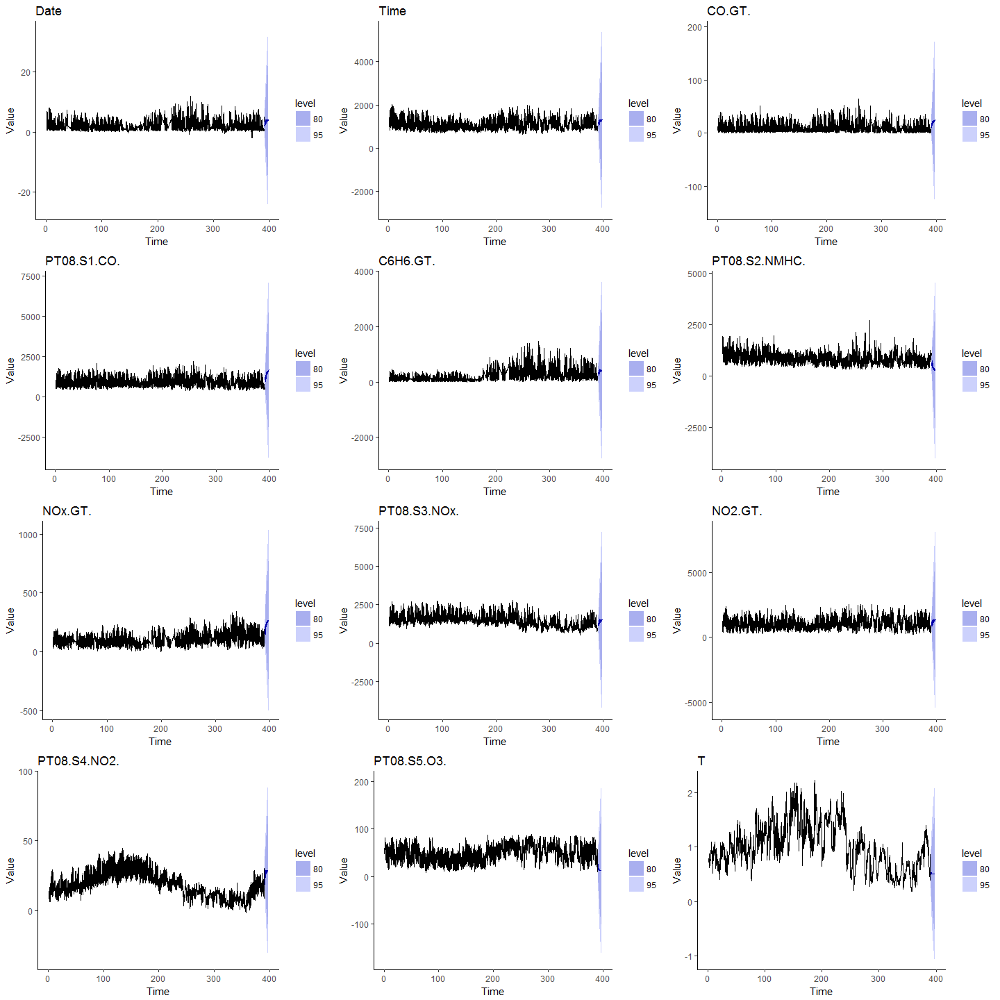<!-- -->

#Process Forecastion data

```r
ForecastTime = seq(Timedate[length(Timedate)], by="hours", length=7*24+1)[-1]
Total_Timedate = c(Timedate,ForecastTime)
ForecastData = matrix(0,7*24,12)
ForecastData = sapply(1:12, function(i){ForecastData[,i] = as.matrix(Forecast[[i]]$Point.Forecast);})
ForecastData = as.data.frame(ForecastData)
colnames(ForecastData) = c(Namelist[3:4],Namelist[6:15])
```
#Reweight the forecast data

```r
ForecastData$PT08.S3.NOx. = sd(ForecastData$PT08.S3.NOx.)/(ForecastData$PT08.S3.NOx.-mean(ForecastData$PT08.S3.NOx.))
ForecastData$RH = 100 - ForecastData$RH
ForecastDataNew = matrix(0,length(ForecastData[,1]),12)
for(col in 1:12) ForecastDataNew[,col] = (ForecastData[,col]-AirData_mean[col])/AirData_sd[col]
ForecastDataNew = data.frame(ForecastDataNew)
colnames(ForecastDataNew) = c(Namelist[3:4],Namelist[6:15])
RASumNew = ForecastDataNew$CO.GT.+ ForecastDataNew$C6H6.GT. + ForecastDataNew$NOx.GT. + ForecastDataNew$NO2.GT.
Forecast_PCV_score = cbind(as.matrix(ForecastDataNew),RASumNew) %*% pcv(kpc)
```
# Train the KPCA series Model

```r
PCV_Model = auto.arima(ts(PCV_score,frequency = 24),trace = TRUE,seasonal = TRUE,
           allowdrift = TRUE, num.cores = CoreNumber, parallel = TRUE,test = "kpss",stepwise = FALSE,
           max.q = 2,max.p = 2,max.Q = 1,max.d = 2,max.order = 3,start.p = 1)
```

```r
paste(PCV_Model)
```

```
## [1] "ARIMA(0,1,1)(2,0,0)[24]"
```

```r
PCV_Model_Forecast = forecast(PCV_Model,7*24)
```

## Combine the final series by choosing the maximum of 2 series

```r
combinedSeries = NULL
combinedSeries = sapply(1:length(Forecast_PCV_score), 
           function(i) {combinedSeries[i] = max(c(Forecast_PCV_score)[i],c(PCV_Model_Forecast$mean)[i])} )
PCVSeries = cbind.data.frame(Score = c(PCV_score,combinedSeries) , Total_Timedate)
Series = c(rep("steelblue",length(PCV_score)),rep("firebrick",length(combinedSeries)))
```
#**Plot the Kernel PCA scores**

```r
Full = ggplot(aes(Total_Timedate,Score), data = PCVSeries) +  
  geom_point(colour = Series,size = 0.7) + geom_line(colour = Series) + xlab("Time") +  ylab("Value") + 
  ggtitle("Kernel PCA Full series ") + theme_stata() +
  theme(panel.grid.minor = element_line(linetype = "dotted"),legend.position = "top")

New_Forecast_plot = ggplot(aes(x =ForecastTime, y = c(Forecast_PCV_score), colour = "steelblue"), 
                    data = data.frame(Forecast_PCV_score)) + geom_point(color = "steelblue") + 
                    geom_line(color = "steelblue") + xlab("Time") +  ylab("Value")+ theme_stata()  + 
                    ggtitle("Kernel PCA prediction series by extraction of new predicted series ") + 
                    theme(panel.grid.minor = element_line(linetype = "dotted"), legend.position = "none")

PCV_Model_Forecast_plot = ggplot(aes(x = ForecastTime, y = c(PCV_Model_Forecast$mean)),
                          data = data.frame(PCV_Model_Forecast$mean)) + geom_point(color = "steelblue") + 
                          geom_line(color = "steelblue") + xlab("Time") +  ylab("Value") + theme_stata() +
                          ggtitle("Kernel PCA prediction series by prediction of former Kernel PCA score series ") + 
                          theme(panel.grid.minor = element_line(linetype = "dotted"),legend.position = "none") 
combined_Forecast_plot =  ggplot(aes(x = ForecastTime, y = c(combinedSeries), colour = 2),
                                 data = data.frame(combinedSeries)) + theme_stata() +
  geom_point() + geom_line() + xlab("Time") +  ylab("Value") +
  ggtitle("Aggregrated Kernel PCA prediction series ") + 
  theme(panel.grid.minor = element_line(linetype = "dotted"),legend.position = "none") 

grid.arrange(Full, New_Forecast_plot, PCV_Model_Forecast_plot,combined_Forecast_plot, nrow = 4)
```

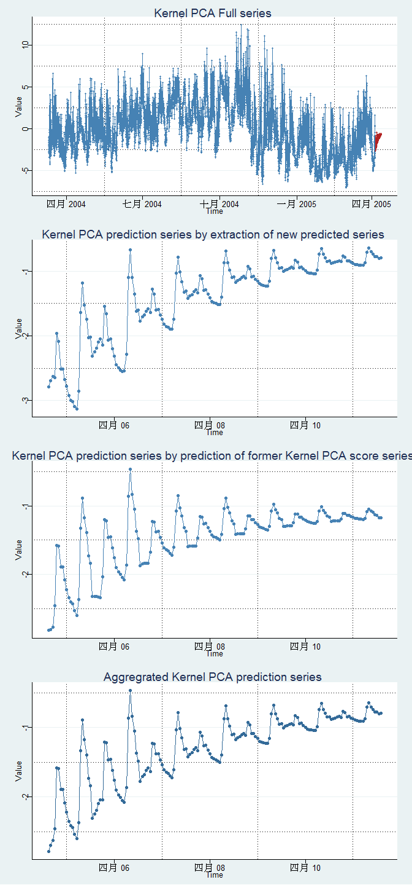<!-- -->


```r
combined_Forecast_ts = xts(combinedSeries,order.by = ForecastTime )
PCV_Model_Forecast_ts = xts( c(PCV_Model_Forecast$mean),order.by = ForecastTime )
New_Forecast_ts = xts( c(Forecast_PCV_score),order.by = ForecastTime )
colnames(New_Forecast_ts) = "KPCA on variables"
colnames(PCV_Model_Forecast_ts) = "KPCA Forecasting"
colnames(combined_Forecast_ts) = "Combined Score"


dygraph(cbind(combined_Forecast_ts,New_Forecast_ts,PCV_Model_Forecast_ts,Scoredata), main = "Kernel PCA score Series plot", ylab = "Kernel PCA score") %>% 
dyOptions(drawPoints = TRUE, colors = RColorBrewer::brewer.pal(3, "Set2"))%>%
dyHighlight(highlightSeriesOpts = list(strokeWidth = 2)) %>%
dyShading(from = ForecastTime[1], to = ForecastTime[length(ForecastTime)], color = "#CCEBD6")%>% 
dyRangeSelector(dateWindow = c(Timedate[floor(length(Timedate)*0.95)], ForecastTime[length(ForecastTime)]))
```

<!--html_preserve--><div id="htmlwidget-5fd45c87f540ed634135" style="width:1152px;height:672px;" class="dygraphs html-widget"></div>
<script type="application/json" data-for="htmlwidget-5fd45c87f540ed634135">{"x":{"attrs":{"title":"Kernel PCA score Series plot","ylabel":"Kernel PCA score","labels":["hour","Combined.Score","KPCA.on.variables","KPCA.Forecasting","Score"],"legend":"auto","retainDateWindow":false,"axes":{"x":{"pixelsPerLabel":60,"drawAxis":true},"y":{"drawAxis":true}},"stackedGraph":false,"fillGraph":false,"fillAlpha":0.15,"stepPlot":false,"drawPoints":true,"pointSize":1,"drawGapEdgePoints":false,"connectSeparatedPoints":false,"strokeWidth":1,"strokeBorderColor":"white","colors":["#66C2A5","#FC8D62","#8DA0CB"],"colorValue":0.5,"colorSaturation":1,"includeZero":false,"drawAxesAtZero":false,"logscale":false,"axisTickSize":3,"axisLineColor":"black","axisLineWidth":0.3,"axisLabelColor":"black","axisLabelFontSize":14,"axisLabelWidth":60,"drawGrid":true,"gridLineWidth":0.3,"rightGap":5,"digitsAfterDecimal":2,"labelsKMB":false,"labelsKMG2":false,"labelsUTC":false,"maxNumberWidth":6,"animatedZooms":false,"mobileDisableYTouch":true,"highlightCircleSize":3,"highlightSeriesBackgroundAlpha":0.5,"highlightSeriesOpts":{"strokeWidth":2},"hideOverlayOnMouseOut":true,"showRangeSelector":true,"dateWindow":["2005-03-15T18:00:00.000Z","2005-04-11T06:00:00.000Z"],"rangeSelectorHeight":40,"rangeSelectorPlotFillColor":" #A7B1C4","rangeSelectorPlotStrokeColor":"#808FAB","interactionModel":"Dygraph.Interaction.defaultModel"},"scale":"hourly","annotations":[],"shadings":[{"from":"2005-04-04T07:00:00.000Z","to":"2005-04-11T06:00:00.000Z","color":"#CCEBD6","axis":"x"}],"events":[],"format":"date","data":[["2004-03-10T10:00:00.000Z","2004-03-10T11:00:00.000Z","2004-03-10T12:00:00.000Z","2004-03-10T13:00:00.000Z","2004-03-10T14:00:00.000Z","2004-03-10T15:00:00.000Z","2004-03-10T16:00:00.000Z","2004-03-10T17:00:00.000Z","2004-03-10T18:00:00.000Z","2004-03-10T19:00:00.000Z","2004-03-10T20:00:00.000Z","2004-03-10T21:00:00.000Z","2004-03-10T22:00:00.000Z","2004-03-10T23:00:00.000Z","2004-03-11T00:00:00.000Z","2004-03-11T01:00:00.000Z","2004-03-11T02:00:00.000Z","2004-03-11T03:00:00.000Z","2004-03-11T04:00:00.000Z","2004-03-11T05:00:00.000Z","2004-03-11T06:00:00.000Z","2004-03-11T07:00:00.000Z","2004-03-11T08:00:00.000Z","2004-03-11T09:00:00.000Z","2004-03-11T10:00:00.000Z","2004-03-11T11:00:00.000Z","2004-03-11T12:00:00.000Z","2004-03-11T13:00:00.000Z","2004-03-11T14:00:00.000Z","2004-03-11T15:00:00.000Z","2004-03-11T16:00:00.000Z","2004-03-11T17:00:00.000Z","2004-03-11T18:00:00.000Z","2004-03-11T19:00:00.000Z","2004-03-11T20:00:00.000Z","2004-03-11T21:00:00.000Z","2004-03-11T22:00:00.000Z","2004-03-11T23:00:00.000Z","2004-03-12T00:00:00.000Z","2004-03-12T01:00:00.000Z","2004-03-12T02:00:00.000Z","2004-03-12T03:00:00.000Z","2004-03-12T04:00:00.000Z","2004-03-12T05:00:00.000Z","2004-03-12T06:00:00.000Z","2004-03-12T07:00:00.000Z","2004-03-12T08:00:00.000Z","2004-03-12T09:00:00.000Z","2004-03-12T10:00:00.000Z","2004-03-12T11:00:00.000Z","2004-03-12T12:00:00.000Z","2004-03-12T13:00:00.000Z","2004-03-12T14:00:00.000Z","2004-03-12T15:00:00.000Z","2004-03-12T16:00:00.000Z","2004-03-12T17:00:00.000Z","2004-03-12T18:00:00.000Z","2004-03-12T19:00:00.000Z","2004-03-12T20:00:00.000Z","2004-03-12T21:00:00.000Z","2004-03-12T22:00:00.000Z","2004-03-12T23:00:00.000Z","2004-03-13T00:00:00.000Z","2004-03-13T01:00:00.000Z","2004-03-13T02:00:00.000Z","2004-03-13T03:00:00.000Z","2004-03-13T04:00:00.000Z","2004-03-13T05:00:00.000Z","2004-03-13T06:00:00.000Z","2004-03-13T07:00:00.000Z","2004-03-13T08:00:00.000Z","2004-03-13T09:00:00.000Z","2004-03-13T10:00:00.000Z","2004-03-13T11:00:00.000Z","2004-03-13T12:00:00.000Z","2004-03-13T13:00:00.000Z","2004-03-13T14:00:00.000Z","2004-03-13T15:00:00.000Z","2004-03-13T16:00:00.000Z","2004-03-13T17:00:00.000Z","2004-03-13T18:00:00.000Z","2004-03-13T19:00:00.000Z","2004-03-13T20:00:00.000Z","2004-03-13T21:00:00.000Z","2004-03-13T22:00:00.000Z","2004-03-13T23:00:00.000Z","2004-03-14T00:00:00.000Z","2004-03-14T01:00:00.000Z","2004-03-14T02:00:00.000Z","2004-03-14T03:00:00.000Z","2004-03-14T04:00:00.000Z","2004-03-14T05:00:00.000Z","2004-03-14T06:00:00.000Z","2004-03-14T07:00:00.000Z","2004-03-14T08:00:00.000Z","2004-03-14T09:00:00.000Z","2004-03-14T10:00:00.000Z","2004-03-14T11:00:00.000Z","2004-03-14T12:00:00.000Z","2004-03-14T13:00:00.000Z","2004-03-14T14:00:00.000Z","2004-03-14T15:00:00.000Z","2004-03-14T16:00:00.000Z","2004-03-14T17:00:00.000Z","2004-03-14T18:00:00.000Z","2004-03-14T19:00:00.000Z","2004-03-14T20:00:00.000Z","2004-03-14T21:00:00.000Z","2004-03-14T22:00:00.000Z","2004-03-14T23:00:00.000Z","2004-03-15T00:00:00.000Z","2004-03-15T01:00:00.000Z","2004-03-15T02:00:00.000Z","2004-03-15T03:00:00.000Z","2004-03-15T04:00:00.000Z","2004-03-15T05:00:00.000Z","2004-03-15T06:00:00.000Z","2004-03-15T07:00:00.000Z","2004-03-15T08:00:00.000Z","2004-03-15T09:00:00.000Z","2004-03-15T10:00:00.000Z","2004-03-15T11:00:00.000Z","2004-03-15T12:00:00.000Z","2004-03-15T13:00:00.000Z","2004-03-15T14:00:00.000Z","2004-03-15T15:00:00.000Z","2004-03-15T16:00:00.000Z","2004-03-15T17:00:00.000Z","2004-03-15T18:00:00.000Z","2004-03-15T19:00:00.000Z","2004-03-15T20:00:00.000Z","2004-03-15T21:00:00.000Z","2004-03-15T22:00:00.000Z","2004-03-15T23:00:00.000Z","2004-03-16T00:00:00.000Z","2004-03-16T01:00:00.000Z","2004-03-16T02:00:00.000Z","2004-03-16T03:00:00.000Z","2004-03-16T04:00:00.000Z","2004-03-16T05:00:00.000Z","2004-03-16T06:00:00.000Z","2004-03-16T07:00:00.000Z","2004-03-16T08:00:00.000Z","2004-03-16T09:00:00.000Z","2004-03-16T10:00:00.000Z","2004-03-16T11:00:00.000Z","2004-03-16T12:00:00.000Z","2004-03-16T13:00:00.000Z","2004-03-16T14:00:00.000Z","2004-03-16T15:00:00.000Z","2004-03-16T16:00:00.000Z","2004-03-16T17:00:00.000Z","2004-03-16T18:00:00.000Z","2004-03-16T19:00:00.000Z","2004-03-16T20:00:00.000Z","2004-03-16T21:00:00.000Z","2004-03-16T22:00:00.000Z","2004-03-16T23:00:00.000Z","2004-03-17T00:00:00.000Z","2004-03-17T01:00:00.000Z","2004-03-17T02:00:00.000Z","2004-03-17T03:00:00.000Z","2004-03-17T04:00:00.000Z","2004-03-17T05:00:00.000Z","2004-03-17T06:00:00.000Z","2004-03-17T07:00:00.000Z","2004-03-17T08:00:00.000Z","2004-03-17T09:00:00.000Z","2004-03-17T10:00:00.000Z","2004-03-17T11:00:00.000Z","2004-03-17T12:00:00.000Z","2004-03-17T13:00:00.000Z","2004-03-17T14:00:00.000Z","2004-03-17T15:00:00.000Z","2004-03-17T16:00:00.000Z","2004-03-17T17:00:00.000Z","2004-03-17T18:00:00.000Z","2004-03-17T19:00:00.000Z","2004-03-17T20:00:00.000Z","2004-03-17T21:00:00.000Z","2004-03-17T22:00:00.000Z","2004-03-17T23:00:00.000Z","2004-03-18T00:00:00.000Z","2004-03-18T01:00:00.000Z","2004-03-18T02:00:00.000Z","2004-03-18T03:00:00.000Z","2004-03-18T04:00:00.000Z","2004-03-18T05:00:00.000Z","2004-03-18T06:00:00.000Z","2004-03-18T07:00:00.000Z","2004-03-18T08:00:00.000Z","2004-03-18T09:00:00.000Z","2004-03-18T10:00:00.000Z","2004-03-18T11:00:00.000Z","2004-03-18T12:00:00.000Z","2004-03-18T13:00:00.000Z","2004-03-18T14:00:00.000Z","2004-03-18T15:00:00.000Z","2004-03-18T16:00:00.000Z","2004-03-18T17:00:00.000Z","2004-03-18T18:00:00.000Z","2004-03-18T19:00:00.000Z","2004-03-18T20:00:00.000Z","2004-03-18T21:00:00.000Z","2004-03-18T22:00:00.000Z","2004-03-18T23:00:00.000Z","2004-03-19T00:00:00.000Z","2004-03-19T01:00:00.000Z","2004-03-19T02:00:00.000Z","2004-03-19T03:00:00.000Z","2004-03-19T04:00:00.000Z","2004-03-19T05:00:00.000Z","2004-03-19T06:00:00.000Z","2004-03-19T07:00:00.000Z","2004-03-19T08:00:00.000Z","2004-03-19T09:00:00.000Z","2004-03-19T10:00:00.000Z","2004-03-19T11:00:00.000Z","2004-03-19T12:00:00.000Z","2004-03-19T13:00:00.000Z","2004-03-19T14:00:00.000Z","2004-03-19T15:00:00.000Z","2004-03-19T16:00:00.000Z","2004-03-19T17:00:00.000Z","2004-03-19T18:00:00.000Z","2004-03-19T19:00:00.000Z","2004-03-19T20:00:00.000Z","2004-03-19T21:00:00.000Z","2004-03-19T22:00:00.000Z","2004-03-19T23:00:00.000Z","2004-03-20T00:00:00.000Z","2004-03-20T01:00:00.000Z","2004-03-20T02:00:00.000Z","2004-03-20T03:00:00.000Z","2004-03-20T04:00:00.000Z","2004-03-20T05:00:00.000Z","2004-03-20T06:00:00.000Z","2004-03-20T07:00:00.000Z","2004-03-20T08:00:00.000Z","2004-03-20T09:00:00.000Z","2004-03-20T10:00:00.000Z","2004-03-20T11:00:00.000Z","2004-03-20T12:00:00.000Z","2004-03-20T13:00:00.000Z","2004-03-20T14:00:00.000Z","2004-03-20T15:00:00.000Z","2004-03-20T16:00:00.000Z","2004-03-20T17:00:00.000Z","2004-03-20T18:00:00.000Z","2004-03-20T19:00:00.000Z","2004-03-20T20:00:00.000Z","2004-03-20T21:00:00.000Z","2004-03-20T22:00:00.000Z","2004-03-20T23:00:00.000Z","2004-03-21T00:00:00.000Z","2004-03-21T01:00:00.000Z","2004-03-21T02:00:00.000Z","2004-03-21T03:00:00.000Z","2004-03-21T04:00:00.000Z","2004-03-21T05:00:00.000Z","2004-03-21T06:00:00.000Z","2004-03-21T07:00:00.000Z","2004-03-21T08:00:00.000Z","2004-03-21T09:00:00.000Z","2004-03-21T10:00:00.000Z","2004-03-21T11:00:00.000Z","2004-03-21T12:00:00.000Z","2004-03-21T13:00:00.000Z","2004-03-21T14:00:00.000Z","2004-03-21T15:00:00.000Z","2004-03-21T16:00:00.000Z","2004-03-21T17:00:00.000Z","2004-03-21T18:00:00.000Z","2004-03-21T19:00:00.000Z","2004-03-21T20:00:00.000Z","2004-03-21T21:00:00.000Z","2004-03-21T22:00:00.000Z","2004-03-21T23:00:00.000Z","2004-03-22T00:00:00.000Z","2004-03-22T01:00:00.000Z","2004-03-22T02:00:00.000Z","2004-03-22T03:00:00.000Z","2004-03-22T04:00:00.000Z","2004-03-22T05:00:00.000Z","2004-03-22T06:00:00.000Z","2004-03-22T07:00:00.000Z","2004-03-22T08:00:00.000Z","2004-03-22T09:00:00.000Z","2004-03-22T10:00:00.000Z","2004-03-22T11:00:00.000Z","2004-03-22T12:00:00.000Z","2004-03-22T13:00:00.000Z","2004-03-22T14:00:00.000Z","2004-03-22T15:00:00.000Z","2004-03-22T16:00:00.000Z","2004-03-22T17:00:00.000Z","2004-03-22T18:00:00.000Z","2004-03-22T19:00:00.000Z","2004-03-22T20:00:00.000Z","2004-03-22T21:00:00.000Z","2004-03-22T22:00:00.000Z","2004-03-22T23:00:00.000Z","2004-03-23T00:00:00.000Z","2004-03-23T01:00:00.000Z","2004-03-23T02:00:00.000Z","2004-03-23T03:00:00.000Z","2004-03-23T04:00:00.000Z","2004-03-23T05:00:00.000Z","2004-03-23T06:00:00.000Z","2004-03-23T07:00:00.000Z","2004-03-23T08:00:00.000Z","2004-03-23T09:00:00.000Z","2004-03-23T10:00:00.000Z","2004-03-23T11:00:00.000Z","2004-03-23T12:00:00.000Z","2004-03-23T13:00:00.000Z","2004-03-23T14:00:00.000Z","2004-03-23T15:00:00.000Z","2004-03-23T16:00:00.000Z","2004-03-23T17:00:00.000Z","2004-03-23T18:00:00.000Z","2004-03-23T19:00:00.000Z","2004-03-23T20:00:00.000Z","2004-03-23T21:00:00.000Z","2004-03-23T22:00:00.000Z","2004-03-23T23:00:00.000Z","2004-03-24T00:00:00.000Z","2004-03-24T01:00:00.000Z","2004-03-24T02:00:00.000Z","2004-03-24T03:00:00.000Z","2004-03-24T04:00:00.000Z","2004-03-24T05:00:00.000Z","2004-03-24T06:00:00.000Z","2004-03-24T07:00:00.000Z","2004-03-24T08:00:00.000Z","2004-03-24T09:00:00.000Z","2004-03-24T10:00:00.000Z","2004-03-24T11:00:00.000Z","2004-03-24T12:00:00.000Z","2004-03-24T13:00:00.000Z","2004-03-24T14:00:00.000Z","2004-03-24T15:00:00.000Z","2004-03-24T16:00:00.000Z","2004-03-24T17:00:00.000Z","2004-03-24T18:00:00.000Z","2004-03-24T19:00:00.000Z","2004-03-24T20:00:00.000Z","2004-03-24T21:00:00.000Z","2004-03-24T22:00:00.000Z","2004-03-24T23:00:00.000Z","2004-03-25T00:00:00.000Z","2004-03-25T01:00:00.000Z","2004-03-25T02:00:00.000Z","2004-03-25T03:00:00.000Z","2004-03-25T04:00:00.000Z","2004-03-25T05:00:00.000Z","2004-03-25T06:00:00.000Z","2004-03-25T07:00:00.000Z","2004-03-25T08:00:00.000Z","2004-03-25T09:00:00.000Z","2004-03-25T10:00:00.000Z","2004-03-25T11:00:00.000Z","2004-03-25T12:00:00.000Z","2004-03-25T13:00:00.000Z","2004-03-25T14:00:00.000Z","2004-03-25T15:00:00.000Z","2004-03-25T16:00:00.000Z","2004-03-25T17:00:00.000Z","2004-03-25T18:00:00.000Z","2004-03-25T19:00:00.000Z","2004-03-25T20:00:00.000Z","2004-03-25T21:00:00.000Z","2004-03-25T22:00:00.000Z","2004-03-25T23:00:00.000Z","2004-03-26T00:00:00.000Z","2004-03-26T01:00:00.000Z","2004-03-26T02:00:00.000Z","2004-03-26T03:00:00.000Z","2004-03-26T04:00:00.000Z","2004-03-26T05:00:00.000Z","2004-03-26T06:00:00.000Z","2004-03-26T07:00:00.000Z","2004-03-26T08:00:00.000Z","2004-03-26T09:00:00.000Z","2004-03-26T10:00:00.000Z","2004-03-26T11:00:00.000Z","2004-03-26T12:00:00.000Z","2004-03-26T13:00:00.000Z","2004-03-26T14:00:00.000Z","2004-03-26T15:00:00.000Z","2004-03-26T16:00:00.000Z","2004-03-26T17:00:00.000Z","2004-03-26T18:00:00.000Z","2004-03-26T19:00:00.000Z","2004-03-26T20:00:00.000Z","2004-03-26T21:00:00.000Z","2004-03-26T22:00:00.000Z","2004-03-26T23:00:00.000Z","2004-03-27T00:00:00.000Z","2004-03-27T01:00:00.000Z","2004-03-27T02:00:00.000Z","2004-03-27T03:00:00.000Z","2004-03-27T04:00:00.000Z","2004-03-27T05:00:00.000Z","2004-03-27T06:00:00.000Z","2004-03-27T07:00:00.000Z","2004-03-27T08:00:00.000Z","2004-03-27T09:00:00.000Z","2004-03-27T10:00:00.000Z","2004-03-27T11:00:00.000Z","2004-03-27T12:00:00.000Z","2004-03-27T13:00:00.000Z","2004-03-27T14:00:00.000Z","2004-03-27T15:00:00.000Z","2004-03-27T16:00:00.000Z","2004-03-27T17:00:00.000Z","2004-03-27T18:00:00.000Z","2004-03-27T19:00:00.000Z","2004-03-27T20:00:00.000Z","2004-03-27T21:00:00.000Z","2004-03-27T22:00:00.000Z","2004-03-27T23:00:00.000Z","2004-03-28T00:00:00.000Z","2004-03-28T01:00:00.000Z","2004-03-28T02:00:00.000Z","2004-03-28T03:00:00.000Z","2004-03-28T04:00:00.000Z","2004-03-28T05:00:00.000Z","2004-03-28T06:00:00.000Z","2004-03-28T07:00:00.000Z","2004-03-28T08:00:00.000Z","2004-03-28T09:00:00.000Z","2004-03-28T10:00:00.000Z","2004-03-28T11:00:00.000Z","2004-03-28T12:00:00.000Z","2004-03-28T13:00:00.000Z","2004-03-28T14:00:00.000Z","2004-03-28T15:00:00.000Z","2004-03-28T16:00:00.000Z","2004-03-28T17:00:00.000Z","2004-03-28T18:00:00.000Z","2004-03-28T19:00:00.000Z","2004-03-28T20:00:00.000Z","2004-03-28T21:00:00.000Z","2004-03-28T22:00:00.000Z","2004-03-28T23:00:00.000Z","2004-03-29T00:00:00.000Z","2004-03-29T01:00:00.000Z","2004-03-29T02:00:00.000Z","2004-03-29T03:00:00.000Z","2004-03-29T04:00:00.000Z","2004-03-29T05:00:00.000Z","2004-03-29T06:00:00.000Z","2004-03-29T07:00:00.000Z","2004-03-29T08:00:00.000Z","2004-03-29T09:00:00.000Z","2004-03-29T10:00:00.000Z","2004-03-29T11:00:00.000Z","2004-03-29T12:00:00.000Z","2004-03-29T13:00:00.000Z","2004-03-29T14:00:00.000Z","2004-03-29T15:00:00.000Z","2004-03-29T16:00:00.000Z","2004-03-29T17:00:00.000Z","2004-03-29T18:00:00.000Z","2004-03-29T19:00:00.000Z","2004-03-29T20:00:00.000Z","2004-03-29T21:00:00.000Z","2004-03-29T22:00:00.000Z","2004-03-29T23:00:00.000Z","2004-03-30T00:00:00.000Z","2004-03-30T01:00:00.000Z","2004-03-30T02:00:00.000Z","2004-03-30T03:00:00.000Z","2004-03-30T04:00:00.000Z","2004-03-30T05:00:00.000Z","2004-03-30T06:00:00.000Z","2004-03-30T07:00:00.000Z","2004-03-30T08:00:00.000Z","2004-03-30T09:00:00.000Z","2004-03-30T10:00:00.000Z","2004-03-30T11:00:00.000Z","2004-03-30T12:00:00.000Z","2004-03-30T13:00:00.000Z","2004-03-30T14:00:00.000Z","2004-03-30T15:00:00.000Z","2004-03-30T16:00:00.000Z","2004-03-30T17:00:00.000Z","2004-03-30T18:00:00.000Z","2004-03-30T19:00:00.000Z","2004-03-30T20:00:00.000Z","2004-03-30T21:00:00.000Z","2004-03-30T22:00:00.000Z","2004-03-30T23:00:00.000Z","2004-03-31T00:00:00.000Z","2004-03-31T01:00:00.000Z","2004-03-31T02:00:00.000Z","2004-03-31T03:00:00.000Z","2004-03-31T04:00:00.000Z","2004-03-31T05:00:00.000Z","2004-03-31T06:00:00.000Z","2004-03-31T07:00:00.000Z","2004-03-31T08:00:00.000Z","2004-03-31T09:00:00.000Z","2004-03-31T10:00:00.000Z","2004-03-31T11:00:00.000Z","2004-03-31T12:00:00.000Z","2004-03-31T13:00:00.000Z","2004-03-31T14:00:00.000Z","2004-03-31T15:00:00.000Z","2004-03-31T16:00:00.000Z","2004-03-31T17:00:00.000Z","2004-03-31T18:00:00.000Z","2004-03-31T19:00:00.000Z","2004-03-31T20:00:00.000Z","2004-03-31T21:00:00.000Z","2004-03-31T22:00:00.000Z","2004-03-31T23:00:00.000Z","2004-04-01T00:00:00.000Z","2004-04-01T01:00:00.000Z","2004-04-01T02:00:00.000Z","2004-04-01T03:00:00.000Z","2004-04-01T04:00:00.000Z","2004-04-01T05:00:00.000Z","2004-04-01T06:00:00.000Z","2004-04-01T07:00:00.000Z","2004-04-01T08:00:00.000Z","2004-04-01T09:00:00.000Z","2004-04-01T10:00:00.000Z","2004-04-01T11:00:00.000Z","2004-04-01T12:00:00.000Z","2004-04-01T13:00:00.000Z","2004-04-01T14:00:00.000Z","2004-04-01T15:00:00.000Z","2004-04-01T16:00:00.000Z","2004-04-01T17:00:00.000Z","2004-04-01T18:00:00.000Z","2004-04-01T19:00:00.000Z","2004-04-01T20:00:00.000Z","2004-04-01T21:00:00.000Z","2004-04-01T22:00:00.000Z","2004-04-01T23:00:00.000Z","2004-04-02T00:00:00.000Z","2004-04-02T01:00:00.000Z","2004-04-02T02:00:00.000Z","2004-04-02T03:00:00.000Z","2004-04-02T04:00:00.000Z","2004-04-02T05:00:00.000Z","2004-04-02T06:00:00.000Z","2004-04-02T07:00:00.000Z","2004-04-02T08:00:00.000Z","2004-04-02T09:00:00.000Z","2004-04-02T10:00:00.000Z","2004-04-02T11:00:00.000Z","2004-04-02T12:00:00.000Z","2004-04-02T13:00:00.000Z","2004-04-02T14:00:00.000Z","2004-04-02T15:00:00.000Z","2004-04-02T16:00:00.000Z","2004-04-02T17:00:00.000Z","2004-04-02T18:00:00.000Z","2004-04-02T19:00:00.000Z","2004-04-02T20:00:00.000Z","2004-04-02T21:00:00.000Z","2004-04-02T22:00:00.000Z","2004-04-02T23:00:00.000Z","2004-04-03T00:00:00.000Z","2004-04-03T01:00:00.000Z","2004-04-03T02:00:00.000Z","2004-04-03T03:00:00.000Z","2004-04-03T04:00:00.000Z","2004-04-03T05:00:00.000Z","2004-04-03T06:00:00.000Z","2004-04-03T07:00:00.000Z","2004-04-03T08:00:00.000Z","2004-04-03T09:00:00.000Z","2004-04-03T10:00:00.000Z","2004-04-03T11:00:00.000Z","2004-04-03T12:00:00.000Z","2004-04-03T13:00:00.000Z","2004-04-03T14:00:00.000Z","2004-04-03T15:00:00.000Z","2004-04-03T16:00:00.000Z","2004-04-03T17:00:00.000Z","2004-04-03T18:00:00.000Z","2004-04-03T19:00:00.000Z","2004-04-03T20:00:00.000Z","2004-04-03T21:00:00.000Z","2004-04-03T22:00:00.000Z","2004-04-03T23:00:00.000Z","2004-04-04T00:00:00.000Z","2004-04-04T01:00:00.000Z","2004-04-04T02:00:00.000Z","2004-04-04T03:00:00.000Z","2004-04-04T04:00:00.000Z","2004-04-04T05:00:00.000Z","2004-04-04T06:00:00.000Z","2004-04-04T07:00:00.000Z","2004-04-04T08:00:00.000Z","2004-04-04T09:00:00.000Z","2004-04-04T10:00:00.000Z","2004-04-04T11:00:00.000Z","2004-04-04T12:00:00.000Z","2004-04-04T13:00:00.000Z","2004-04-04T14:00:00.000Z","2004-04-04T15:00:00.000Z","2004-04-04T16:00:00.000Z","2004-04-04T17:00:00.000Z","2004-04-04T18:00:00.000Z","2004-04-04T19:00:00.000Z","2004-04-04T20:00:00.000Z","2004-04-04T21:00:00.000Z","2004-04-04T22:00:00.000Z","2004-04-04T23:00:00.000Z","2004-04-05T00:00:00.000Z","2004-04-05T01:00:00.000Z","2004-04-05T02:00:00.000Z","2004-04-05T03:00:00.000Z","2004-04-05T04:00:00.000Z","2004-04-05T05:00:00.000Z","2004-04-05T06:00:00.000Z","2004-04-05T07:00:00.000Z","2004-04-05T08:00:00.000Z","2004-04-05T09:00:00.000Z","2004-04-05T10:00:00.000Z","2004-04-05T11:00:00.000Z","2004-04-05T12:00:00.000Z","2004-04-05T13:00:00.000Z","2004-04-05T14:00:00.000Z","2004-04-05T15:00:00.000Z","2004-04-05T16:00:00.000Z","2004-04-05T17:00:00.000Z","2004-04-05T18:00:00.000Z","2004-04-05T19:00:00.000Z","2004-04-05T20:00:00.000Z","2004-04-05T21:00:00.000Z","2004-04-05T22:00:00.000Z","2004-04-05T23:00:00.000Z","2004-04-06T00:00:00.000Z","2004-04-06T01:00:00.000Z","2004-04-06T02:00:00.000Z","2004-04-06T03:00:00.000Z","2004-04-06T04:00:00.000Z","2004-04-06T05:00:00.000Z","2004-04-06T06:00:00.000Z","2004-04-06T07:00:00.000Z","2004-04-06T08:00:00.000Z","2004-04-06T09:00:00.000Z","2004-04-06T10:00:00.000Z","2004-04-06T11:00:00.000Z","2004-04-06T12:00:00.000Z","2004-04-06T13:00:00.000Z","2004-04-06T14:00:00.000Z","2004-04-06T15:00:00.000Z","2004-04-06T16:00:00.000Z","2004-04-06T17:00:00.000Z","2004-04-06T18:00:00.000Z","2004-04-06T19:00:00.000Z","2004-04-06T20:00:00.000Z","2004-04-06T21:00:00.000Z","2004-04-06T22:00:00.000Z","2004-04-06T23:00:00.000Z","2004-04-07T00:00:00.000Z","2004-04-07T01:00:00.000Z","2004-04-07T02:00:00.000Z","2004-04-07T03:00:00.000Z","2004-04-07T04:00:00.000Z","2004-04-07T05:00:00.000Z","2004-04-07T06:00:00.000Z","2004-04-07T07:00:00.000Z","2004-04-07T08:00:00.000Z","2004-04-07T09:00:00.000Z","2004-04-07T10:00:00.000Z","2004-04-07T11:00:00.000Z","2004-04-07T12:00:00.000Z","2004-04-07T13:00:00.000Z","2004-04-07T14:00:00.000Z","2004-04-07T15:00:00.000Z","2004-04-07T16:00:00.000Z","2004-04-07T17:00:00.000Z","2004-04-07T18:00:00.000Z","2004-04-07T19:00:00.000Z","2004-04-07T20:00:00.000Z","2004-04-07T21:00:00.000Z","2004-04-07T22:00:00.000Z","2004-04-07T23:00:00.000Z","2004-04-08T00:00:00.000Z","2004-04-08T01:00:00.000Z","2004-04-08T02:00:00.000Z","2004-04-08T03:00:00.000Z","2004-04-08T04:00:00.000Z","2004-04-08T05:00:00.000Z","2004-04-08T06:00:00.000Z","2004-04-08T07:00:00.000Z","2004-04-08T08:00:00.000Z","2004-04-08T09:00:00.000Z","2004-04-08T10:00:00.000Z","2004-04-08T11:00:00.000Z","2004-04-08T12:00:00.000Z","2004-04-08T13:00:00.000Z","2004-04-08T14:00:00.000Z","2004-04-08T15:00:00.000Z","2004-04-08T16:00:00.000Z","2004-04-08T17:00:00.000Z","2004-04-08T18:00:00.000Z","2004-04-08T19:00:00.000Z","2004-04-08T20:00:00.000Z","2004-04-08T21:00:00.000Z","2004-04-08T22:00:00.000Z","2004-04-08T23:00:00.000Z","2004-04-09T00:00:00.000Z","2004-04-09T01:00:00.000Z","2004-04-09T02:00:00.000Z","2004-04-09T03:00:00.000Z","2004-04-09T04:00:00.000Z","2004-04-09T05:00:00.000Z","2004-04-09T06:00:00.000Z","2004-04-09T07:00:00.000Z","2004-04-09T08:00:00.000Z","2004-04-09T09:00:00.000Z","2004-04-09T10:00:00.000Z","2004-04-09T11:00:00.000Z","2004-04-09T12:00:00.000Z","2004-04-09T13:00:00.000Z","2004-04-09T14:00:00.000Z","2004-04-09T15:00:00.000Z","2004-04-09T16:00:00.000Z","2004-04-09T17:00:00.000Z","2004-04-09T18:00:00.000Z","2004-04-09T19:00:00.000Z","2004-04-09T20:00:00.000Z","2004-04-09T21:00:00.000Z","2004-04-09T22:00:00.000Z","2004-04-09T23:00:00.000Z","2004-04-10T00:00:00.000Z","2004-04-10T01:00:00.000Z","2004-04-10T02:00:00.000Z","2004-04-10T03:00:00.000Z","2004-04-10T04:00:00.000Z","2004-04-10T05:00:00.000Z","2004-04-10T06:00:00.000Z","2004-04-10T07:00:00.000Z","2004-04-10T08:00:00.000Z","2004-04-10T09:00:00.000Z","2004-04-10T10:00:00.000Z","2004-04-10T11:00:00.000Z","2004-04-10T12:00:00.000Z","2004-04-10T13:00:00.000Z","2004-04-10T14:00:00.000Z","2004-04-10T15:00:00.000Z","2004-04-10T16:00:00.000Z","2004-04-10T17:00:00.000Z","2004-04-10T18:00:00.000Z","2004-04-10T19:00:00.000Z","2004-04-10T20:00:00.000Z","2004-04-10T21:00:00.000Z","2004-04-10T22:00:00.000Z","2004-04-10T23:00:00.000Z","2004-04-11T00:00:00.000Z","2004-04-11T01:00:00.000Z","2004-04-11T02:00:00.000Z","2004-04-11T03:00:00.000Z","2004-04-11T04:00:00.000Z","2004-04-11T05:00:00.000Z","2004-04-11T06:00:00.000Z","2004-04-11T07:00:00.000Z","2004-04-11T08:00:00.000Z","2004-04-11T09:00:00.000Z","2004-04-11T10:00:00.000Z","2004-04-11T11:00:00.000Z","2004-04-11T12:00:00.000Z","2004-04-11T13:00:00.000Z","2004-04-11T14:00:00.000Z","2004-04-11T15:00:00.000Z","2004-04-11T16:00:00.000Z","2004-04-11T17:00:00.000Z","2004-04-11T18:00:00.000Z","2004-04-11T19:00:00.000Z","2004-04-11T20:00:00.000Z","2004-04-11T21:00:00.000Z","2004-04-11T22:00:00.000Z","2004-04-11T23:00:00.000Z","2004-04-12T00:00:00.000Z","2004-04-12T01:00:00.000Z","2004-04-12T02:00:00.000Z","2004-04-12T03:00:00.000Z","2004-04-12T04:00:00.000Z","2004-04-12T05:00:00.000Z","2004-04-12T06:00:00.000Z","2004-04-12T07:00:00.000Z","2004-04-12T08:00:00.000Z","2004-04-12T09:00:00.000Z","2004-04-12T10:00:00.000Z","2004-04-12T11:00:00.000Z","2004-04-12T12:00:00.000Z","2004-04-12T13:00:00.000Z","2004-04-12T14:00:00.000Z","2004-04-12T15:00:00.000Z","2004-04-12T16:00:00.000Z","2004-04-12T17:00:00.000Z","2004-04-12T18:00:00.000Z","2004-04-12T19:00:00.000Z","2004-04-12T20:00:00.000Z","2004-04-12T21:00:00.000Z","2004-04-12T22:00:00.000Z","2004-04-12T23:00:00.000Z","2004-04-13T00:00:00.000Z","2004-04-13T01:00:00.000Z","2004-04-13T02:00:00.000Z","2004-04-13T03:00:00.000Z","2004-04-13T04:00:00.000Z","2004-04-13T05:00:00.000Z","2004-04-13T06:00:00.000Z","2004-04-13T07:00:00.000Z","2004-04-13T08:00:00.000Z","2004-04-13T09:00:00.000Z","2004-04-13T10:00:00.000Z","2004-04-13T11:00:00.000Z","2004-04-13T12:00:00.000Z","2004-04-13T13:00:00.000Z","2004-04-13T14:00:00.000Z","2004-04-13T15:00:00.000Z","2004-04-13T16:00:00.000Z","2004-04-13T17:00:00.000Z","2004-04-13T18:00:00.000Z","2004-04-13T19:00:00.000Z","2004-04-13T20:00:00.000Z","2004-04-13T21:00:00.000Z","2004-04-13T22:00:00.000Z","2004-04-13T23:00:00.000Z","2004-04-14T00:00:00.000Z","2004-04-14T01:00:00.000Z","2004-04-14T02:00:00.000Z","2004-04-14T03:00:00.000Z","2004-04-14T04:00:00.000Z","2004-04-14T05:00:00.000Z","2004-04-14T06:00:00.000Z","2004-04-14T07:00:00.000Z","2004-04-14T08:00:00.000Z","2004-04-14T09:00:00.000Z","2004-04-14T10:00:00.000Z","2004-04-14T11:00:00.000Z","2004-04-14T12:00:00.000Z","2004-04-14T13:00:00.000Z","2004-04-14T14:00:00.000Z","2004-04-14T15:00:00.000Z","2004-04-14T16:00:00.000Z","2004-04-14T17:00:00.000Z","2004-04-14T18:00:00.000Z","2004-04-14T19:00:00.000Z","2004-04-14T20:00:00.000Z","2004-04-14T21:00:00.000Z","2004-04-14T22:00:00.000Z","2004-04-14T23:00:00.000Z","2004-04-15T00:00:00.000Z","2004-04-15T01:00:00.000Z","2004-04-15T02:00:00.000Z","2004-04-15T03:00:00.000Z","2004-04-15T04:00:00.000Z","2004-04-15T05:00:00.000Z","2004-04-15T06:00:00.000Z","2004-04-15T07:00:00.000Z","2004-04-15T08:00:00.000Z","2004-04-15T09:00:00.000Z","2004-04-15T10:00:00.000Z","2004-04-15T11:00:00.000Z","2004-04-15T12:00:00.000Z","2004-04-15T13:00:00.000Z","2004-04-15T14:00:00.000Z","2004-04-15T15:00:00.000Z","2004-04-15T16:00:00.000Z","2004-04-15T17:00:00.000Z","2004-04-15T18:00:00.000Z","2004-04-15T19:00:00.000Z","2004-04-15T20:00:00.000Z","2004-04-15T21:00:00.000Z","2004-04-15T22:00:00.000Z","2004-04-15T23:00:00.000Z","2004-04-16T00:00:00.000Z","2004-04-16T01:00:00.000Z","2004-04-16T02:00:00.000Z","2004-04-16T03:00:00.000Z","2004-04-16T04:00:00.000Z","2004-04-16T05:00:00.000Z","2004-04-16T06:00:00.000Z","2004-04-16T07:00:00.000Z","2004-04-16T08:00:00.000Z","2004-04-16T09:00:00.000Z","2004-04-16T10:00:00.000Z","2004-04-16T11:00:00.000Z","2004-04-16T12:00:00.000Z","2004-04-16T13:00:00.000Z","2004-04-16T14:00:00.000Z","2004-04-16T15:00:00.000Z","2004-04-16T16:00:00.000Z","2004-04-16T17:00:00.000Z","2004-04-16T18:00:00.000Z","2004-04-16T19:00:00.000Z","2004-04-16T20:00:00.000Z","2004-04-16T21:00:00.000Z","2004-04-16T22:00:00.000Z","2004-04-16T23:00:00.000Z","2004-04-17T00:00:00.000Z","2004-04-17T01:00:00.000Z","2004-04-17T02:00:00.000Z","2004-04-17T03:00:00.000Z","2004-04-17T04:00:00.000Z","2004-04-17T05:00:00.000Z","2004-04-17T06:00:00.000Z","2004-04-17T07:00:00.000Z","2004-04-17T08:00:00.000Z","2004-04-17T09:00:00.000Z","2004-04-17T10:00:00.000Z","2004-04-17T11:00:00.000Z","2004-04-17T12:00:00.000Z","2004-04-17T13:00:00.000Z","2004-04-17T14:00:00.000Z","2004-04-17T15:00:00.000Z","2004-04-17T16:00:00.000Z","2004-04-17T17:00:00.000Z","2004-04-17T18:00:00.000Z","2004-04-17T19:00:00.000Z","2004-04-17T20:00:00.000Z","2004-04-17T21:00:00.000Z","2004-04-17T22:00:00.000Z","2004-04-17T23:00:00.000Z","2004-04-18T00:00:00.000Z","2004-04-18T01:00:00.000Z","2004-04-18T02:00:00.000Z","2004-04-18T03:00:00.000Z","2004-04-18T04:00:00.000Z","2004-04-18T05:00:00.000Z","2004-04-18T06:00:00.000Z","2004-04-18T07:00:00.000Z","2004-04-18T08:00:00.000Z","2004-04-18T09:00:00.000Z","2004-04-18T10:00:00.000Z","2004-04-18T11:00:00.000Z","2004-04-18T12:00:00.000Z","2004-04-18T13:00:00.000Z","2004-04-18T14:00:00.000Z","2004-04-18T15:00:00.000Z","2004-04-18T16:00:00.000Z","2004-04-18T17:00:00.000Z","2004-04-18T18:00:00.000Z","2004-04-18T19:00:00.000Z","2004-04-18T20:00:00.000Z","2004-04-18T21:00:00.000Z","2004-04-18T22:00:00.000Z","2004-04-18T23:00:00.000Z","2004-04-19T00:00:00.000Z","2004-04-19T01:00:00.000Z","2004-04-19T02:00:00.000Z","2004-04-19T03:00:00.000Z","2004-04-19T04:00:00.000Z","2004-04-19T05:00:00.000Z","2004-04-19T06:00:00.000Z","2004-04-19T07:00:00.000Z","2004-04-19T08:00:00.000Z","2004-04-19T09:00:00.000Z","2004-04-19T10:00:00.000Z","2004-04-19T11:00:00.000Z","2004-04-19T12:00:00.000Z","2004-04-19T13:00:00.000Z","2004-04-19T14:00:00.000Z","2004-04-19T15:00:00.000Z","2004-04-19T16:00:00.000Z","2004-04-19T17:00:00.000Z","2004-04-19T18:00:00.000Z","2004-04-19T19:00:00.000Z","2004-04-19T20:00:00.000Z","2004-04-19T21:00:00.000Z","2004-04-19T22:00:00.000Z","2004-04-19T23:00:00.000Z","2004-04-20T00:00:00.000Z","2004-04-20T01:00:00.000Z","2004-04-20T02:00:00.000Z","2004-04-20T03:00:00.000Z","2004-04-20T04:00:00.000Z","2004-04-20T05:00:00.000Z","2004-04-20T06:00:00.000Z","2004-04-20T07:00:00.000Z","2004-04-20T08:00:00.000Z","2004-04-20T09:00:00.000Z","2004-04-20T10:00:00.000Z","2004-04-20T11:00:00.000Z","2004-04-20T12:00:00.000Z","2004-04-20T13:00:00.000Z","2004-04-20T14:00:00.000Z","2004-04-20T15:00:00.000Z","2004-04-20T16:00:00.000Z","2004-04-20T17:00:00.000Z","2004-04-20T18:00:00.000Z","2004-04-20T19:00:00.000Z","2004-04-20T20:00:00.000Z","2004-04-20T21:00:00.000Z","2004-04-20T22:00:00.000Z","2004-04-20T23:00:00.000Z","2004-04-21T00:00:00.000Z","2004-04-21T01:00:00.000Z","2004-04-21T02:00:00.000Z","2004-04-21T03:00:00.000Z","2004-04-21T04:00:00.000Z","2004-04-21T05:00:00.000Z","2004-04-21T06:00:00.000Z","2004-04-21T07:00:00.000Z","2004-04-21T08:00:00.000Z","2004-04-21T09:00:00.000Z","2004-04-21T10:00:00.000Z","2004-04-21T11:00:00.000Z","2004-04-21T12:00:00.000Z","2004-04-21T13:00:00.000Z","2004-04-21T14:00:00.000Z","2004-04-21T15:00:00.000Z","2004-04-21T16:00:00.000Z","2004-04-21T17:00:00.000Z","2004-04-21T18:00:00.000Z","2004-04-21T19:00:00.000Z","2004-04-21T20:00:00.000Z","2004-04-21T21:00:00.000Z","2004-04-21T22:00:00.000Z","2004-04-21T23:00:00.000Z","2004-04-22T00:00:00.000Z","2004-04-22T01:00:00.000Z","2004-04-22T02:00:00.000Z","2004-04-22T03:00:00.000Z","2004-04-22T04:00:00.000Z","2004-04-22T05:00:00.000Z","2004-04-22T06:00:00.000Z","2004-04-22T07:00:00.000Z","2004-04-22T08:00:00.000Z","2004-04-22T09:00:00.000Z","2004-04-22T10:00:00.000Z","2004-04-22T11:00:00.000Z","2004-04-22T12:00:00.000Z","2004-04-22T13:00:00.000Z","2004-04-22T14:00:00.000Z","2004-04-22T15:00:00.000Z","2004-04-22T16:00:00.000Z","2004-04-22T17:00:00.000Z","2004-04-22T18:00:00.000Z","2004-04-22T19:00:00.000Z","2004-04-22T20:00:00.000Z","2004-04-22T21:00:00.000Z","2004-04-22T22:00:00.000Z","2004-04-22T23:00:00.000Z","2004-04-23T00:00:00.000Z","2004-04-23T01:00:00.000Z","2004-04-23T02:00:00.000Z","2004-04-23T03:00:00.000Z","2004-04-23T04:00:00.000Z","2004-04-23T05:00:00.000Z","2004-04-23T06:00:00.000Z","2004-04-23T07:00:00.000Z","2004-04-23T08:00:00.000Z","2004-04-23T09:00:00.000Z","2004-04-23T10:00:00.000Z","2004-04-23T11:00:00.000Z","2004-04-23T12:00:00.000Z","2004-04-23T13:00:00.000Z","2004-04-23T14:00:00.000Z","2004-04-23T15:00:00.000Z","2004-04-23T16:00:00.000Z","2004-04-23T17:00:00.000Z","2004-04-23T18:00:00.000Z","2004-04-23T19:00:00.000Z","2004-04-23T20:00:00.000Z","2004-04-23T21:00:00.000Z","2004-04-23T22:00:00.000Z","2004-04-23T23:00:00.000Z","2004-04-24T00:00:00.000Z","2004-04-24T01:00:00.000Z","2004-04-24T02:00:00.000Z","2004-04-24T03:00:00.000Z","2004-04-24T04:00:00.000Z","2004-04-24T05:00:00.000Z","2004-04-24T06:00:00.000Z","2004-04-24T07:00:00.000Z","2004-04-24T08:00:00.000Z","2004-04-24T09:00:00.000Z","2004-04-24T10:00:00.000Z","2004-04-24T11:00:00.000Z","2004-04-24T12:00:00.000Z","2004-04-24T13:00:00.000Z","2004-04-24T14:00:00.000Z","2004-04-24T15:00:00.000Z","2004-04-24T16:00:00.000Z","2004-04-24T17:00:00.000Z","2004-04-24T18:00:00.000Z","2004-04-24T19:00:00.000Z","2004-04-24T20:00:00.000Z","2004-04-24T21:00:00.000Z","2004-04-24T22:00:00.000Z","2004-04-24T23:00:00.000Z","2004-04-25T00:00:00.000Z","2004-04-25T01:00:00.000Z","2004-04-25T02:00:00.000Z","2004-04-25T03:00:00.000Z","2004-04-25T04:00:00.000Z","2004-04-25T05:00:00.000Z","2004-04-25T06:00:00.000Z","2004-04-25T07:00:00.000Z","2004-04-25T08:00:00.000Z","2004-04-25T09:00:00.000Z","2004-04-25T10:00:00.000Z","2004-04-25T11:00:00.000Z","2004-04-25T12:00:00.000Z","2004-04-25T13:00:00.000Z","2004-04-25T14:00:00.000Z","2004-04-25T15:00:00.000Z","2004-04-25T16:00:00.000Z","2004-04-25T17:00:00.000Z","2004-04-25T18:00:00.000Z","2004-04-25T19:00:00.000Z","2004-04-25T20:00:00.000Z","2004-04-25T21:00:00.000Z","2004-04-25T22:00:00.000Z","2004-04-25T23:00:00.000Z","2004-04-26T00:00:00.000Z","2004-04-26T01:00:00.000Z","2004-04-26T02:00:00.000Z","2004-04-26T03:00:00.000Z","2004-04-26T04:00:00.000Z","2004-04-26T05:00:00.000Z","2004-04-26T06:00:00.000Z","2004-04-26T07:00:00.000Z","2004-04-26T08:00:00.000Z","2004-04-26T09:00:00.000Z","2004-04-26T10:00:00.000Z","2004-04-26T11:00:00.000Z","2004-04-26T12:00:00.000Z","2004-04-26T13:00:00.000Z","2004-04-26T14:00:00.000Z","2004-04-26T15:00:00.000Z","2004-04-26T16:00:00.000Z","2004-04-26T17:00:00.000Z","2004-04-26T18:00:00.000Z","2004-04-26T19:00:00.000Z","2004-04-26T20:00:00.000Z","2004-04-26T21:00:00.000Z","2004-04-26T22:00:00.000Z","2004-04-26T23:00:00.000Z","2004-04-27T00:00:00.000Z","2004-04-27T01:00:00.000Z","2004-04-27T02:00:00.000Z","2004-04-27T03:00:00.000Z","2004-04-27T04:00:00.000Z","2004-04-27T05:00:00.000Z","2004-04-27T06:00:00.000Z","2004-04-27T07:00:00.000Z","2004-04-27T08:00:00.000Z","2004-04-27T09:00:00.000Z","2004-04-27T10:00:00.000Z","2004-04-27T11:00:00.000Z","2004-04-27T12:00:00.000Z","2004-04-27T13:00:00.000Z","2004-04-27T14:00:00.000Z","2004-04-27T15:00:00.000Z","2004-04-27T16:00:00.000Z","2004-04-27T17:00:00.000Z","2004-04-27T18:00:00.000Z","2004-04-27T19:00:00.000Z","2004-04-27T20:00:00.000Z","2004-04-27T21:00:00.000Z","2004-04-27T22:00:00.000Z","2004-04-27T23:00:00.000Z","2004-04-28T00:00:00.000Z","2004-04-28T01:00:00.000Z","2004-04-28T02:00:00.000Z","2004-04-28T03:00:00.000Z","2004-04-28T04:00:00.000Z","2004-04-28T05:00:00.000Z","2004-04-28T06:00:00.000Z","2004-04-28T07:00:00.000Z","2004-04-28T08:00:00.000Z","2004-04-28T09:00:00.000Z","2004-04-28T10:00:00.000Z","2004-04-28T11:00:00.000Z","2004-04-28T12:00:00.000Z","2004-04-28T13:00:00.000Z","2004-04-28T14:00:00.000Z","2004-04-28T15:00:00.000Z","2004-04-28T16:00:00.000Z","2004-04-28T17:00:00.000Z","2004-04-28T18:00:00.000Z","2004-04-28T19:00:00.000Z","2004-04-28T20:00:00.000Z","2004-04-28T21:00:00.000Z","2004-04-28T22:00:00.000Z","2004-04-28T23:00:00.000Z","2004-04-29T00:00:00.000Z","2004-04-29T01:00:00.000Z","2004-04-29T02:00:00.000Z","2004-04-29T03:00:00.000Z","2004-04-29T04:00:00.000Z","2004-04-29T05:00:00.000Z","2004-04-29T06:00:00.000Z","2004-04-29T07:00:00.000Z","2004-04-29T08:00:00.000Z","2004-04-29T09:00:00.000Z","2004-04-29T10:00:00.000Z","2004-04-29T11:00:00.000Z","2004-04-29T12:00:00.000Z","2004-04-29T13:00:00.000Z","2004-04-29T14:00:00.000Z","2004-04-29T15:00:00.000Z","2004-04-29T16:00:00.000Z","2004-04-29T17:00:00.000Z","2004-04-29T18:00:00.000Z","2004-04-29T19:00:00.000Z","2004-04-29T20:00:00.000Z","2004-04-29T21:00:00.000Z","2004-04-29T22:00:00.000Z","2004-04-29T23:00:00.000Z","2004-04-30T00:00:00.000Z","2004-04-30T01:00:00.000Z","2004-04-30T02:00:00.000Z","2004-04-30T03:00:00.000Z","2004-04-30T04:00:00.000Z","2004-04-30T05:00:00.000Z","2004-04-30T06:00:00.000Z","2004-04-30T07:00:00.000Z","2004-04-30T08:00:00.000Z","2004-04-30T09:00:00.000Z","2004-04-30T10:00:00.000Z","2004-04-30T11:00:00.000Z","2004-04-30T12:00:00.000Z","2004-04-30T13:00:00.000Z","2004-04-30T14:00:00.000Z","2004-04-30T15:00:00.000Z","2004-04-30T16:00:00.000Z","2004-04-30T17:00:00.000Z","2004-04-30T18:00:00.000Z","2004-04-30T19:00:00.000Z","2004-04-30T20:00:00.000Z","2004-04-30T21:00:00.000Z","2004-04-30T22:00:00.000Z","2004-04-30T23:00:00.000Z","2004-05-01T00:00:00.000Z","2004-05-01T01:00:00.000Z","2004-05-01T02:00:00.000Z","2004-05-01T03:00:00.000Z","2004-05-01T04:00:00.000Z","2004-05-01T05:00:00.000Z","2004-05-01T06:00:00.000Z","2004-05-01T07:00:00.000Z","2004-05-01T08:00:00.000Z","2004-05-01T09:00:00.000Z","2004-05-01T10:00:00.000Z","2004-05-01T11:00:00.000Z","2004-05-01T12:00:00.000Z","2004-05-01T13:00:00.000Z","2004-05-01T14:00:00.000Z","2004-05-01T15:00:00.000Z","2004-05-01T16:00:00.000Z","2004-05-01T17:00:00.000Z","2004-05-01T18:00:00.000Z","2004-05-01T19:00:00.000Z","2004-05-01T20:00:00.000Z","2004-05-01T21:00:00.000Z","2004-05-01T22:00:00.000Z","2004-05-01T23:00:00.000Z","2004-05-02T00:00:00.000Z","2004-05-02T01:00:00.000Z","2004-05-02T02:00:00.000Z","2004-05-02T03:00:00.000Z","2004-05-02T04:00:00.000Z","2004-05-02T05:00:00.000Z","2004-05-02T06:00:00.000Z","2004-05-02T07:00:00.000Z","2004-05-02T08:00:00.000Z","2004-05-02T09:00:00.000Z","2004-05-02T10:00:00.000Z","2004-05-02T11:00:00.000Z","2004-05-02T12:00:00.000Z","2004-05-02T13:00:00.000Z","2004-05-02T14:00:00.000Z","2004-05-02T15:00:00.000Z","2004-05-02T16:00:00.000Z","2004-05-02T17:00:00.000Z","2004-05-02T18:00:00.000Z","2004-05-02T19:00:00.000Z","2004-05-02T20:00:00.000Z","2004-05-02T21:00:00.000Z","2004-05-02T22:00:00.000Z","2004-05-02T23:00:00.000Z","2004-05-03T00:00:00.000Z","2004-05-03T01:00:00.000Z","2004-05-03T02:00:00.000Z","2004-05-03T03:00:00.000Z","2004-05-03T04:00:00.000Z","2004-05-03T05:00:00.000Z","2004-05-03T06:00:00.000Z","2004-05-03T07:00:00.000Z","2004-05-03T08:00:00.000Z","2004-05-03T09:00:00.000Z","2004-05-03T10:00:00.000Z","2004-05-03T11:00:00.000Z","2004-05-03T12:00:00.000Z","2004-05-03T13:00:00.000Z","2004-05-03T14:00:00.000Z","2004-05-03T15:00:00.000Z","2004-05-03T16:00:00.000Z","2004-05-03T17:00:00.000Z","2004-05-03T18:00:00.000Z","2004-05-03T19:00:00.000Z","2004-05-03T20:00:00.000Z","2004-05-03T21:00:00.000Z","2004-05-03T22:00:00.000Z","2004-05-03T23:00:00.000Z","2004-05-04T00:00:00.000Z","2004-05-04T01:00:00.000Z","2004-05-04T02:00:00.000Z","2004-05-04T03:00:00.000Z","2004-05-04T04:00:00.000Z","2004-05-04T05:00:00.000Z","2004-05-04T06:00:00.000Z","2004-05-04T07:00:00.000Z","2004-05-04T08:00:00.000Z","2004-05-04T09:00:00.000Z","2004-05-04T10:00:00.000Z","2004-05-04T11:00:00.000Z","2004-05-04T12:00:00.000Z","2004-05-04T13:00:00.000Z","2004-05-04T14:00:00.000Z","2004-05-04T15:00:00.000Z","2004-05-04T16:00:00.000Z","2004-05-04T17:00:00.000Z","2004-05-04T18:00:00.000Z","2004-05-04T19:00:00.000Z","2004-05-04T20:00:00.000Z","2004-05-04T21:00:00.000Z","2004-05-04T22:00:00.000Z","2004-05-04T23:00:00.000Z","2004-05-05T00:00:00.000Z","2004-05-05T01:00:00.000Z","2004-05-05T02:00:00.000Z","2004-05-05T03:00:00.000Z","2004-05-05T04:00:00.000Z","2004-05-05T05:00:00.000Z","2004-05-05T06:00:00.000Z","2004-05-05T07:00:00.000Z","2004-05-05T08:00:00.000Z","2004-05-05T09:00:00.000Z","2004-05-05T10:00:00.000Z","2004-05-05T11:00:00.000Z","2004-05-05T12:00:00.000Z","2004-05-05T13:00:00.000Z","2004-05-05T14:00:00.000Z","2004-05-05T15:00:00.000Z","2004-05-05T16:00:00.000Z","2004-05-05T17:00:00.000Z","2004-05-05T18:00:00.000Z","2004-05-05T19:00:00.000Z","2004-05-05T20:00:00.000Z","2004-05-05T21:00:00.000Z","2004-05-05T22:00:00.000Z","2004-05-05T23:00:00.000Z","2004-05-06T00:00:00.000Z","2004-05-06T01:00:00.000Z","2004-05-06T02:00:00.000Z","2004-05-06T03:00:00.000Z","2004-05-06T04:00:00.000Z","2004-05-06T05:00:00.000Z","2004-05-06T06:00:00.000Z","2004-05-06T07:00:00.000Z","2004-05-06T08:00:00.000Z","2004-05-06T09:00:00.000Z","2004-05-06T10:00:00.000Z","2004-05-06T11:00:00.000Z","2004-05-06T12:00:00.000Z","2004-05-06T13:00:00.000Z","2004-05-06T14:00:00.000Z","2004-05-06T15:00:00.000Z","2004-05-06T16:00:00.000Z","2004-05-06T17:00:00.000Z","2004-05-06T18:00:00.000Z","2004-05-06T19:00:00.000Z","2004-05-06T20:00:00.000Z","2004-05-06T21:00:00.000Z","2004-05-06T22:00:00.000Z","2004-05-06T23:00:00.000Z","2004-05-07T00:00:00.000Z","2004-05-07T01:00:00.000Z","2004-05-07T02:00:00.000Z","2004-05-07T03:00:00.000Z","2004-05-07T04:00:00.000Z","2004-05-07T05:00:00.000Z","2004-05-07T06:00:00.000Z","2004-05-07T07:00:00.000Z","2004-05-07T08:00:00.000Z","2004-05-07T09:00:00.000Z","2004-05-07T10:00:00.000Z","2004-05-07T11:00:00.000Z","2004-05-07T12:00:00.000Z","2004-05-07T13:00:00.000Z","2004-05-07T14:00:00.000Z","2004-05-07T15:00:00.000Z","2004-05-07T16:00:00.000Z","2004-05-07T17:00:00.000Z","2004-05-07T18:00:00.000Z","2004-05-07T19:00:00.000Z","2004-05-07T20:00:00.000Z","2004-05-07T21:00:00.000Z","2004-05-07T22:00:00.000Z","2004-05-07T23:00:00.000Z","2004-05-08T00:00:00.000Z","2004-05-08T01:00:00.000Z","2004-05-08T02:00:00.000Z","2004-05-08T03:00:00.000Z","2004-05-08T04:00:00.000Z","2004-05-08T05:00:00.000Z","2004-05-08T06:00:00.000Z","2004-05-08T07:00:00.000Z","2004-05-08T08:00:00.000Z","2004-05-08T09:00:00.000Z","2004-05-08T10:00:00.000Z","2004-05-08T11:00:00.000Z","2004-05-08T12:00:00.000Z","2004-05-08T13:00:00.000Z","2004-05-08T14:00:00.000Z","2004-05-08T15:00:00.000Z","2004-05-08T16:00:00.000Z","2004-05-08T17:00:00.000Z","2004-05-08T18:00:00.000Z","2004-05-08T19:00:00.000Z","2004-05-08T20:00:00.000Z","2004-05-08T21:00:00.000Z","2004-05-08T22:00:00.000Z","2004-05-08T23:00:00.000Z","2004-05-09T00:00:00.000Z","2004-05-09T01:00:00.000Z","2004-05-09T02:00:00.000Z","2004-05-09T03:00:00.000Z","2004-05-09T04:00:00.000Z","2004-05-09T05:00:00.000Z","2004-05-09T06:00:00.000Z","2004-05-09T07:00:00.000Z","2004-05-09T08:00:00.000Z","2004-05-09T09:00:00.000Z","2004-05-09T10:00:00.000Z","2004-05-09T11:00:00.000Z","2004-05-09T12:00:00.000Z","2004-05-09T13:00:00.000Z","2004-05-09T14:00:00.000Z","2004-05-09T15:00:00.000Z","2004-05-09T16:00:00.000Z","2004-05-09T17:00:00.000Z","2004-05-09T18:00:00.000Z","2004-05-09T19:00:00.000Z","2004-05-09T20:00:00.000Z","2004-05-09T21:00:00.000Z","2004-05-09T22:00:00.000Z","2004-05-09T23:00:00.000Z","2004-05-10T00:00:00.000Z","2004-05-10T01:00:00.000Z","2004-05-10T02:00:00.000Z","2004-05-10T03:00:00.000Z","2004-05-10T04:00:00.000Z","2004-05-10T05:00:00.000Z","2004-05-10T06:00:00.000Z","2004-05-10T07:00:00.000Z","2004-05-10T08:00:00.000Z","2004-05-10T09:00:00.000Z","2004-05-10T10:00:00.000Z","2004-05-10T11:00:00.000Z","2004-05-10T12:00:00.000Z","2004-05-10T13:00:00.000Z","2004-05-10T14:00:00.000Z","2004-05-10T15:00:00.000Z","2004-05-10T16:00:00.000Z","2004-05-10T17:00:00.000Z","2004-05-10T18:00:00.000Z","2004-05-10T19:00:00.000Z","2004-05-10T20:00:00.000Z","2004-05-10T21:00:00.000Z","2004-05-10T22:00:00.000Z","2004-05-10T23:00:00.000Z","2004-05-11T00:00:00.000Z","2004-05-11T01:00:00.000Z","2004-05-11T02:00:00.000Z","2004-05-11T03:00:00.000Z","2004-05-11T04:00:00.000Z","2004-05-11T05:00:00.000Z","2004-05-11T06:00:00.000Z","2004-05-11T07:00:00.000Z","2004-05-11T08:00:00.000Z","2004-05-11T09:00:00.000Z","2004-05-11T10:00:00.000Z","2004-05-11T11:00:00.000Z","2004-05-11T12:00:00.000Z","2004-05-11T13:00:00.000Z","2004-05-11T14:00:00.000Z","2004-05-11T15:00:00.000Z","2004-05-11T16:00:00.000Z","2004-05-11T17:00:00.000Z","2004-05-11T18:00:00.000Z","2004-05-11T19:00:00.000Z","2004-05-11T20:00:00.000Z","2004-05-11T21:00:00.000Z","2004-05-11T22:00:00.000Z","2004-05-11T23:00:00.000Z","2004-05-12T00:00:00.000Z","2004-05-12T01:00:00.000Z","2004-05-12T02:00:00.000Z","2004-05-12T03:00:00.000Z","2004-05-12T04:00:00.000Z","2004-05-12T05:00:00.000Z","2004-05-12T06:00:00.000Z","2004-05-12T07:00:00.000Z","2004-05-12T08:00:00.000Z","2004-05-12T09:00:00.000Z","2004-05-12T10:00:00.000Z","2004-05-12T11:00:00.000Z","2004-05-12T12:00:00.000Z","2004-05-12T13:00:00.000Z","2004-05-12T14:00:00.000Z","2004-05-12T15:00:00.000Z","2004-05-12T16:00:00.000Z","2004-05-12T17:00:00.000Z","2004-05-12T18:00:00.000Z","2004-05-12T19:00:00.000Z","2004-05-12T20:00:00.000Z","2004-05-12T21:00:00.000Z","2004-05-12T22:00:00.000Z","2004-05-12T23:00:00.000Z","2004-05-13T00:00:00.000Z","2004-05-13T01:00:00.000Z","2004-05-13T02:00:00.000Z","2004-05-13T03:00:00.000Z","2004-05-13T04:00:00.000Z","2004-05-13T05:00:00.000Z","2004-05-13T06:00:00.000Z","2004-05-13T07:00:00.000Z","2004-05-13T08:00:00.000Z","2004-05-13T09:00:00.000Z","2004-05-13T10:00:00.000Z","2004-05-13T11:00:00.000Z","2004-05-13T12:00:00.000Z","2004-05-13T13:00:00.000Z","2004-05-13T14:00:00.000Z","2004-05-13T15:00:00.000Z","2004-05-13T16:00:00.000Z","2004-05-13T17:00:00.000Z","2004-05-13T18:00:00.000Z","2004-05-13T19:00:00.000Z","2004-05-13T20:00:00.000Z","2004-05-13T21:00:00.000Z","2004-05-13T22:00:00.000Z","2004-05-13T23:00:00.000Z","2004-05-14T00:00:00.000Z","2004-05-14T01:00:00.000Z","2004-05-14T02:00:00.000Z","2004-05-14T03:00:00.000Z","2004-05-14T04:00:00.000Z","2004-05-14T05:00:00.000Z","2004-05-14T06:00:00.000Z","2004-05-14T07:00:00.000Z","2004-05-14T08:00:00.000Z","2004-05-14T09:00:00.000Z","2004-05-14T10:00:00.000Z","2004-05-14T11:00:00.000Z","2004-05-14T12:00:00.000Z","2004-05-14T13:00:00.000Z","2004-05-14T14:00:00.000Z","2004-05-14T15:00:00.000Z","2004-05-14T16:00:00.000Z","2004-05-14T17:00:00.000Z","2004-05-14T18:00:00.000Z","2004-05-14T19:00:00.000Z","2004-05-14T20:00:00.000Z","2004-05-14T21:00:00.000Z","2004-05-14T22:00:00.000Z","2004-05-14T23:00:00.000Z","2004-05-15T00:00:00.000Z","2004-05-15T01:00:00.000Z","2004-05-15T02:00:00.000Z","2004-05-15T03:00:00.000Z","2004-05-15T04:00:00.000Z","2004-05-15T05:00:00.000Z","2004-05-15T06:00:00.000Z","2004-05-15T07:00:00.000Z","2004-05-15T08:00:00.000Z","2004-05-15T09:00:00.000Z","2004-05-15T10:00:00.000Z","2004-05-15T11:00:00.000Z","2004-05-15T12:00:00.000Z","2004-05-15T13:00:00.000Z","2004-05-15T14:00:00.000Z","2004-05-15T15:00:00.000Z","2004-05-15T16:00:00.000Z","2004-05-15T17:00:00.000Z","2004-05-15T18:00:00.000Z","2004-05-15T19:00:00.000Z","2004-05-15T20:00:00.000Z","2004-05-15T21:00:00.000Z","2004-05-15T22:00:00.000Z","2004-05-15T23:00:00.000Z","2004-05-16T00:00:00.000Z","2004-05-16T01:00:00.000Z","2004-05-16T02:00:00.000Z","2004-05-16T03:00:00.000Z","2004-05-16T04:00:00.000Z","2004-05-16T05:00:00.000Z","2004-05-16T06:00:00.000Z","2004-05-16T07:00:00.000Z","2004-05-16T08:00:00.000Z","2004-05-16T09:00:00.000Z","2004-05-16T10:00:00.000Z","2004-05-16T11:00:00.000Z","2004-05-16T12:00:00.000Z","2004-05-16T13:00:00.000Z","2004-05-16T14:00:00.000Z","2004-05-16T15:00:00.000Z","2004-05-16T16:00:00.000Z","2004-05-16T17:00:00.000Z","2004-05-16T18:00:00.000Z","2004-05-16T19:00:00.000Z","2004-05-16T20:00:00.000Z","2004-05-16T21:00:00.000Z","2004-05-16T22:00:00.000Z","2004-05-16T23:00:00.000Z","2004-05-17T00:00:00.000Z","2004-05-17T01:00:00.000Z","2004-05-17T02:00:00.000Z","2004-05-17T03:00:00.000Z","2004-05-17T04:00:00.000Z","2004-05-17T05:00:00.000Z","2004-05-17T06:00:00.000Z","2004-05-17T07:00:00.000Z","2004-05-17T08:00:00.000Z","2004-05-17T09:00:00.000Z","2004-05-17T10:00:00.000Z","2004-05-17T11:00:00.000Z","2004-05-17T12:00:00.000Z","2004-05-17T13:00:00.000Z","2004-05-17T14:00:00.000Z","2004-05-17T15:00:00.000Z","2004-05-17T16:00:00.000Z","2004-05-17T17:00:00.000Z","2004-05-17T18:00:00.000Z","2004-05-17T19:00:00.000Z","2004-05-17T20:00:00.000Z","2004-05-17T21:00:00.000Z","2004-05-17T22:00:00.000Z","2004-05-17T23:00:00.000Z","2004-05-18T00:00:00.000Z","2004-05-18T01:00:00.000Z","2004-05-18T02:00:00.000Z","2004-05-18T03:00:00.000Z","2004-05-18T04:00:00.000Z","2004-05-18T05:00:00.000Z","2004-05-18T06:00:00.000Z","2004-05-18T07:00:00.000Z","2004-05-18T08:00:00.000Z","2004-05-18T09:00:00.000Z","2004-05-18T10:00:00.000Z","2004-05-18T11:00:00.000Z","2004-05-18T12:00:00.000Z","2004-05-18T13:00:00.000Z","2004-05-18T14:00:00.000Z","2004-05-18T15:00:00.000Z","2004-05-18T16:00:00.000Z","2004-05-18T17:00:00.000Z","2004-05-18T18:00:00.000Z","2004-05-18T19:00:00.000Z","2004-05-18T20:00:00.000Z","2004-05-18T21:00:00.000Z","2004-05-18T22:00:00.000Z","2004-05-18T23:00:00.000Z","2004-05-19T00:00:00.000Z","2004-05-19T01:00:00.000Z","2004-05-19T02:00:00.000Z","2004-05-19T03:00:00.000Z","2004-05-19T04:00:00.000Z","2004-05-19T05:00:00.000Z","2004-05-19T06:00:00.000Z","2004-05-19T07:00:00.000Z","2004-05-19T08:00:00.000Z","2004-05-19T09:00:00.000Z","2004-05-19T10:00:00.000Z","2004-05-19T11:00:00.000Z","2004-05-19T12:00:00.000Z","2004-05-19T13:00:00.000Z","2004-05-19T14:00:00.000Z","2004-05-19T15:00:00.000Z","2004-05-19T16:00:00.000Z","2004-05-19T17:00:00.000Z","2004-05-19T18:00:00.000Z","2004-05-19T19:00:00.000Z","2004-05-19T20:00:00.000Z","2004-05-19T21:00:00.000Z","2004-05-19T22:00:00.000Z","2004-05-19T23:00:00.000Z","2004-05-20T00:00:00.000Z","2004-05-20T01:00:00.000Z","2004-05-20T02:00:00.000Z","2004-05-20T03:00:00.000Z","2004-05-20T04:00:00.000Z","2004-05-20T05:00:00.000Z","2004-05-20T06:00:00.000Z","2004-05-20T07:00:00.000Z","2004-05-20T08:00:00.000Z","2004-05-20T09:00:00.000Z","2004-05-20T10:00:00.000Z","2004-05-20T11:00:00.000Z","2004-05-20T12:00:00.000Z","2004-05-20T13:00:00.000Z","2004-05-20T14:00:00.000Z","2004-05-20T15:00:00.000Z","2004-05-20T16:00:00.000Z","2004-05-20T17:00:00.000Z","2004-05-20T18:00:00.000Z","2004-05-20T19:00:00.000Z","2004-05-20T20:00:00.000Z","2004-05-20T21:00:00.000Z","2004-05-20T22:00:00.000Z","2004-05-20T23:00:00.000Z","2004-05-21T00:00:00.000Z","2004-05-21T01:00:00.000Z","2004-05-21T02:00:00.000Z","2004-05-21T03:00:00.000Z","2004-05-21T04:00:00.000Z","2004-05-21T05:00:00.000Z","2004-05-21T06:00:00.000Z","2004-05-21T07:00:00.000Z","2004-05-21T08:00:00.000Z","2004-05-21T09:00:00.000Z","2004-05-21T10:00:00.000Z","2004-05-21T11:00:00.000Z","2004-05-21T12:00:00.000Z","2004-05-21T13:00:00.000Z","2004-05-21T14:00:00.000Z","2004-05-21T15:00:00.000Z","2004-05-21T16:00:00.000Z","2004-05-21T17:00:00.000Z","2004-05-21T18:00:00.000Z","2004-05-21T19:00:00.000Z","2004-05-21T20:00:00.000Z","2004-05-21T21:00:00.000Z","2004-05-21T22:00:00.000Z","2004-05-21T23:00:00.000Z","2004-05-22T00:00:00.000Z","2004-05-22T01:00:00.000Z","2004-05-22T02:00:00.000Z","2004-05-22T03:00:00.000Z","2004-05-22T04:00:00.000Z","2004-05-22T05:00:00.000Z","2004-05-22T06:00:00.000Z","2004-05-22T07:00:00.000Z","2004-05-22T08:00:00.000Z","2004-05-22T09:00:00.000Z","2004-05-22T10:00:00.000Z","2004-05-22T11:00:00.000Z","2004-05-22T12:00:00.000Z","2004-05-22T13:00:00.000Z","2004-05-22T14:00:00.000Z","2004-05-22T15:00:00.000Z","2004-05-22T16:00:00.000Z","2004-05-22T17:00:00.000Z","2004-05-22T18:00:00.000Z","2004-05-22T19:00:00.000Z","2004-05-22T20:00:00.000Z","2004-05-22T21:00:00.000Z","2004-05-22T22:00:00.000Z","2004-05-22T23:00:00.000Z","2004-05-23T00:00:00.000Z","2004-05-23T01:00:00.000Z","2004-05-23T02:00:00.000Z","2004-05-23T03:00:00.000Z","2004-05-23T04:00:00.000Z","2004-05-23T05:00:00.000Z","2004-05-23T06:00:00.000Z","2004-05-23T07:00:00.000Z","2004-05-23T08:00:00.000Z","2004-05-23T09:00:00.000Z","2004-05-23T10:00:00.000Z","2004-05-23T11:00:00.000Z","2004-05-23T12:00:00.000Z","2004-05-23T13:00:00.000Z","2004-05-23T14:00:00.000Z","2004-05-23T15:00:00.000Z","2004-05-23T16:00:00.000Z","2004-05-23T17:00:00.000Z","2004-05-23T18:00:00.000Z","2004-05-23T19:00:00.000Z","2004-05-23T20:00:00.000Z","2004-05-23T21:00:00.000Z","2004-05-23T22:00:00.000Z","2004-05-23T23:00:00.000Z","2004-05-24T00:00:00.000Z","2004-05-24T01:00:00.000Z","2004-05-24T02:00:00.000Z","2004-05-24T03:00:00.000Z","2004-05-24T04:00:00.000Z","2004-05-24T05:00:00.000Z","2004-05-24T06:00:00.000Z","2004-05-24T07:00:00.000Z","2004-05-24T08:00:00.000Z","2004-05-24T09:00:00.000Z","2004-05-24T10:00:00.000Z","2004-05-24T11:00:00.000Z","2004-05-24T12:00:00.000Z","2004-05-24T13:00:00.000Z","2004-05-24T14:00:00.000Z","2004-05-24T15:00:00.000Z","2004-05-24T16:00:00.000Z","2004-05-24T17:00:00.000Z","2004-05-24T18:00:00.000Z","2004-05-24T19:00:00.000Z","2004-05-24T20:00:00.000Z","2004-05-24T21:00:00.000Z","2004-05-24T22:00:00.000Z","2004-05-24T23:00:00.000Z","2004-05-25T00:00:00.000Z","2004-05-25T01:00:00.000Z","2004-05-25T02:00:00.000Z","2004-05-25T03:00:00.000Z","2004-05-25T04:00:00.000Z","2004-05-25T05:00:00.000Z","2004-05-25T06:00:00.000Z","2004-05-25T07:00:00.000Z","2004-05-25T08:00:00.000Z","2004-05-25T09:00:00.000Z","2004-05-25T10:00:00.000Z","2004-05-25T11:00:00.000Z","2004-05-25T12:00:00.000Z","2004-05-25T13:00:00.000Z","2004-05-25T14:00:00.000Z","2004-05-25T15:00:00.000Z","2004-05-25T16:00:00.000Z","2004-05-25T17:00:00.000Z","2004-05-25T18:00:00.000Z","2004-05-25T19:00:00.000Z","2004-05-25T20:00:00.000Z","2004-05-25T21:00:00.000Z","2004-05-25T22:00:00.000Z","2004-05-25T23:00:00.000Z","2004-05-26T00:00:00.000Z","2004-05-26T01:00:00.000Z","2004-05-26T02:00:00.000Z","2004-05-26T03:00:00.000Z","2004-05-26T04:00:00.000Z","2004-05-26T05:00:00.000Z","2004-05-26T06:00:00.000Z","2004-05-26T07:00:00.000Z","2004-05-26T08:00:00.000Z","2004-05-26T09:00:00.000Z","2004-05-26T10:00:00.000Z","2004-05-26T11:00:00.000Z","2004-05-26T12:00:00.000Z","2004-05-26T13:00:00.000Z","2004-05-26T14:00:00.000Z","2004-05-26T15:00:00.000Z","2004-05-26T16:00:00.000Z","2004-05-26T17:00:00.000Z","2004-05-26T18:00:00.000Z","2004-05-26T19:00:00.000Z","2004-05-26T20:00:00.000Z","2004-05-26T21:00:00.000Z","2004-05-26T22:00:00.000Z","2004-05-26T23:00:00.000Z","2004-05-27T00:00:00.000Z","2004-05-27T01:00:00.000Z","2004-05-27T02:00:00.000Z","2004-05-27T03:00:00.000Z","2004-05-27T04:00:00.000Z","2004-05-27T05:00:00.000Z","2004-05-27T06:00:00.000Z","2004-05-27T07:00:00.000Z","2004-05-27T08:00:00.000Z","2004-05-27T09:00:00.000Z","2004-05-27T10:00:00.000Z","2004-05-27T11:00:00.000Z","2004-05-27T12:00:00.000Z","2004-05-27T13:00:00.000Z","2004-05-27T14:00:00.000Z","2004-05-27T15:00:00.000Z","2004-05-27T16:00:00.000Z","2004-05-27T17:00:00.000Z","2004-05-27T18:00:00.000Z","2004-05-27T19:00:00.000Z","2004-05-27T20:00:00.000Z","2004-05-27T21:00:00.000Z","2004-05-27T22:00:00.000Z","2004-05-27T23:00:00.000Z","2004-05-28T00:00:00.000Z","2004-05-28T01:00:00.000Z","2004-05-28T02:00:00.000Z","2004-05-28T03:00:00.000Z","2004-05-28T04:00:00.000Z","2004-05-28T05:00:00.000Z","2004-05-28T06:00:00.000Z","2004-05-28T07:00:00.000Z","2004-05-28T08:00:00.000Z","2004-05-28T09:00:00.000Z","2004-05-28T10:00:00.000Z","2004-05-28T11:00:00.000Z","2004-05-28T12:00:00.000Z","2004-05-28T13:00:00.000Z","2004-05-28T14:00:00.000Z","2004-05-28T15:00:00.000Z","2004-05-28T16:00:00.000Z","2004-05-28T17:00:00.000Z","2004-05-28T18:00:00.000Z","2004-05-28T19:00:00.000Z","2004-05-28T20:00:00.000Z","2004-05-28T21:00:00.000Z","2004-05-28T22:00:00.000Z","2004-05-28T23:00:00.000Z","2004-05-29T00:00:00.000Z","2004-05-29T01:00:00.000Z","2004-05-29T02:00:00.000Z","2004-05-29T03:00:00.000Z","2004-05-29T04:00:00.000Z","2004-05-29T05:00:00.000Z","2004-05-29T06:00:00.000Z","2004-05-29T07:00:00.000Z","2004-05-29T08:00:00.000Z","2004-05-29T09:00:00.000Z","2004-05-29T10:00:00.000Z","2004-05-29T11:00:00.000Z","2004-05-29T12:00:00.000Z","2004-05-29T13:00:00.000Z","2004-05-29T14:00:00.000Z","2004-05-29T15:00:00.000Z","2004-05-29T16:00:00.000Z","2004-05-29T17:00:00.000Z","2004-05-29T18:00:00.000Z","2004-05-29T19:00:00.000Z","2004-05-29T20:00:00.000Z","2004-05-29T21:00:00.000Z","2004-05-29T22:00:00.000Z","2004-05-29T23:00:00.000Z","2004-05-30T00:00:00.000Z","2004-05-30T01:00:00.000Z","2004-05-30T02:00:00.000Z","2004-05-30T03:00:00.000Z","2004-05-30T04:00:00.000Z","2004-05-30T05:00:00.000Z","2004-05-30T06:00:00.000Z","2004-05-30T07:00:00.000Z","2004-05-30T08:00:00.000Z","2004-05-30T09:00:00.000Z","2004-05-30T10:00:00.000Z","2004-05-30T11:00:00.000Z","2004-05-30T12:00:00.000Z","2004-05-30T13:00:00.000Z","2004-05-30T14:00:00.000Z","2004-05-30T15:00:00.000Z","2004-05-30T16:00:00.000Z","2004-05-30T17:00:00.000Z","2004-05-30T18:00:00.000Z","2004-05-30T19:00:00.000Z","2004-05-30T20:00:00.000Z","2004-05-30T21:00:00.000Z","2004-05-30T22:00:00.000Z","2004-05-30T23:00:00.000Z","2004-05-31T00:00:00.000Z","2004-05-31T01:00:00.000Z","2004-05-31T02:00:00.000Z","2004-05-31T03:00:00.000Z","2004-05-31T04:00:00.000Z","2004-05-31T05:00:00.000Z","2004-05-31T06:00:00.000Z","2004-05-31T07:00:00.000Z","2004-05-31T08:00:00.000Z","2004-05-31T09:00:00.000Z","2004-05-31T10:00:00.000Z","2004-05-31T11:00:00.000Z","2004-05-31T12:00:00.000Z","2004-05-31T13:00:00.000Z","2004-05-31T14:00:00.000Z","2004-05-31T15:00:00.000Z","2004-05-31T16:00:00.000Z","2004-05-31T17:00:00.000Z","2004-05-31T18:00:00.000Z","2004-05-31T19:00:00.000Z","2004-05-31T20:00:00.000Z","2004-05-31T21:00:00.000Z","2004-05-31T22:00:00.000Z","2004-05-31T23:00:00.000Z","2004-06-01T00:00:00.000Z","2004-06-01T01:00:00.000Z","2004-06-01T02:00:00.000Z","2004-06-01T03:00:00.000Z","2004-06-01T04:00:00.000Z","2004-06-01T05:00:00.000Z","2004-06-01T06:00:00.000Z","2004-06-01T07:00:00.000Z","2004-06-01T08:00:00.000Z","2004-06-01T09:00:00.000Z","2004-06-01T10:00:00.000Z","2004-06-01T11:00:00.000Z","2004-06-01T12:00:00.000Z","2004-06-01T13:00:00.000Z","2004-06-01T14:00:00.000Z","2004-06-01T15:00:00.000Z","2004-06-01T16:00:00.000Z","2004-06-01T17:00:00.000Z","2004-06-01T18:00:00.000Z","2004-06-01T19:00:00.000Z","2004-06-01T20:00:00.000Z","2004-06-01T21:00:00.000Z","2004-06-01T22:00:00.000Z","2004-06-01T23:00:00.000Z","2004-06-02T00:00:00.000Z","2004-06-02T01:00:00.000Z","2004-06-02T02:00:00.000Z","2004-06-02T03:00:00.000Z","2004-06-02T04:00:00.000Z","2004-06-02T05:00:00.000Z","2004-06-02T06:00:00.000Z","2004-06-02T07:00:00.000Z","2004-06-02T08:00:00.000Z","2004-06-02T09:00:00.000Z","2004-06-02T10:00:00.000Z","2004-06-02T11:00:00.000Z","2004-06-02T12:00:00.000Z","2004-06-02T13:00:00.000Z","2004-06-02T14:00:00.000Z","2004-06-02T15:00:00.000Z","2004-06-02T16:00:00.000Z","2004-06-02T17:00:00.000Z","2004-06-02T18:00:00.000Z","2004-06-02T19:00:00.000Z","2004-06-02T20:00:00.000Z","2004-06-02T21:00:00.000Z","2004-06-02T22:00:00.000Z","2004-06-02T23:00:00.000Z","2004-06-03T00:00:00.000Z","2004-06-03T01:00:00.000Z","2004-06-03T02:00:00.000Z","2004-06-03T03:00:00.000Z","2004-06-03T04:00:00.000Z","2004-06-03T05:00:00.000Z","2004-06-03T06:00:00.000Z","2004-06-03T07:00:00.000Z","2004-06-03T08:00:00.000Z","2004-06-03T09:00:00.000Z","2004-06-03T10:00:00.000Z","2004-06-03T11:00:00.000Z","2004-06-03T12:00:00.000Z","2004-06-03T13:00:00.000Z","2004-06-03T14:00:00.000Z","2004-06-03T15:00:00.000Z","2004-06-03T16:00:00.000Z","2004-06-03T17:00:00.000Z","2004-06-03T18:00:00.000Z","2004-06-03T19:00:00.000Z","2004-06-03T20:00:00.000Z","2004-06-03T21:00:00.000Z","2004-06-03T22:00:00.000Z","2004-06-03T23:00:00.000Z","2004-06-04T00:00:00.000Z","2004-06-04T01:00:00.000Z","2004-06-04T02:00:00.000Z","2004-06-04T03:00:00.000Z","2004-06-04T04:00:00.000Z","2004-06-04T05:00:00.000Z","2004-06-04T06:00:00.000Z","2004-06-04T07:00:00.000Z","2004-06-04T08:00:00.000Z","2004-06-04T09:00:00.000Z","2004-06-04T10:00:00.000Z","2004-06-04T11:00:00.000Z","2004-06-04T12:00:00.000Z","2004-06-04T13:00:00.000Z","2004-06-04T14:00:00.000Z","2004-06-04T15:00:00.000Z","2004-06-04T16:00:00.000Z","2004-06-04T17:00:00.000Z","2004-06-04T18:00:00.000Z","2004-06-04T19:00:00.000Z","2004-06-04T20:00:00.000Z","2004-06-04T21:00:00.000Z","2004-06-04T22:00:00.000Z","2004-06-04T23:00:00.000Z","2004-06-05T00:00:00.000Z","2004-06-05T01:00:00.000Z","2004-06-05T02:00:00.000Z","2004-06-05T03:00:00.000Z","2004-06-05T04:00:00.000Z","2004-06-05T05:00:00.000Z","2004-06-05T06:00:00.000Z","2004-06-05T07:00:00.000Z","2004-06-05T08:00:00.000Z","2004-06-05T09:00:00.000Z","2004-06-05T10:00:00.000Z","2004-06-05T11:00:00.000Z","2004-06-05T12:00:00.000Z","2004-06-05T13:00:00.000Z","2004-06-05T14:00:00.000Z","2004-06-05T15:00:00.000Z","2004-06-05T16:00:00.000Z","2004-06-05T17:00:00.000Z","2004-06-05T18:00:00.000Z","2004-06-05T19:00:00.000Z","2004-06-05T20:00:00.000Z","2004-06-05T21:00:00.000Z","2004-06-05T22:00:00.000Z","2004-06-05T23:00:00.000Z","2004-06-06T00:00:00.000Z","2004-06-06T01:00:00.000Z","2004-06-06T02:00:00.000Z","2004-06-06T03:00:00.000Z","2004-06-06T04:00:00.000Z","2004-06-06T05:00:00.000Z","2004-06-06T06:00:00.000Z","2004-06-06T07:00:00.000Z","2004-06-06T08:00:00.000Z","2004-06-06T09:00:00.000Z","2004-06-06T10:00:00.000Z","2004-06-06T11:00:00.000Z","2004-06-06T12:00:00.000Z","2004-06-06T13:00:00.000Z","2004-06-06T14:00:00.000Z","2004-06-06T15:00:00.000Z","2004-06-06T16:00:00.000Z","2004-06-06T17:00:00.000Z","2004-06-06T18:00:00.000Z","2004-06-06T19:00:00.000Z","2004-06-06T20:00:00.000Z","2004-06-06T21:00:00.000Z","2004-06-06T22:00:00.000Z","2004-06-06T23:00:00.000Z","2004-06-07T00:00:00.000Z","2004-06-07T01:00:00.000Z","2004-06-07T02:00:00.000Z","2004-06-07T03:00:00.000Z","2004-06-07T04:00:00.000Z","2004-06-07T05:00:00.000Z","2004-06-07T06:00:00.000Z","2004-06-07T07:00:00.000Z","2004-06-07T08:00:00.000Z","2004-06-07T09:00:00.000Z","2004-06-07T10:00:00.000Z","2004-06-07T11:00:00.000Z","2004-06-07T12:00:00.000Z","2004-06-07T13:00:00.000Z","2004-06-07T14:00:00.000Z","2004-06-07T15:00:00.000Z","2004-06-07T16:00:00.000Z","2004-06-07T17:00:00.000Z","2004-06-07T18:00:00.000Z","2004-06-07T19:00:00.000Z","2004-06-07T20:00:00.000Z","2004-06-07T21:00:00.000Z","2004-06-07T22:00:00.000Z","2004-06-07T23:00:00.000Z","2004-06-08T00:00:00.000Z","2004-06-08T01:00:00.000Z","2004-06-08T02:00:00.000Z","2004-06-08T03:00:00.000Z","2004-06-08T04:00:00.000Z","2004-06-08T05:00:00.000Z","2004-06-08T06:00:00.000Z","2004-06-08T07:00:00.000Z","2004-06-08T08:00:00.000Z","2004-06-08T09:00:00.000Z","2004-06-08T10:00:00.000Z","2004-06-08T11:00:00.000Z","2004-06-08T12:00:00.000Z","2004-06-08T13:00:00.000Z","2004-06-08T14:00:00.000Z","2004-06-08T15:00:00.000Z","2004-06-08T16:00:00.000Z","2004-06-08T17:00:00.000Z","2004-06-08T18:00:00.000Z","2004-06-08T19:00:00.000Z","2004-06-08T20:00:00.000Z","2004-06-08T21:00:00.000Z","2004-06-08T22:00:00.000Z","2004-06-08T23:00:00.000Z","2004-06-09T00:00:00.000Z","2004-06-09T01:00:00.000Z","2004-06-09T02:00:00.000Z","2004-06-09T03:00:00.000Z","2004-06-09T04:00:00.000Z","2004-06-09T05:00:00.000Z","2004-06-09T06:00:00.000Z","2004-06-09T07:00:00.000Z","2004-06-09T08:00:00.000Z","2004-06-09T09:00:00.000Z","2004-06-09T10:00:00.000Z","2004-06-09T11:00:00.000Z","2004-06-09T12:00:00.000Z","2004-06-09T13:00:00.000Z","2004-06-09T14:00:00.000Z","2004-06-09T15:00:00.000Z","2004-06-09T16:00:00.000Z","2004-06-09T17:00:00.000Z","2004-06-09T18:00:00.000Z","2004-06-09T19:00:00.000Z","2004-06-09T20:00:00.000Z","2004-06-09T21:00:00.000Z","2004-06-09T22:00:00.000Z","2004-06-09T23:00:00.000Z","2004-06-10T00:00:00.000Z","2004-06-10T01:00:00.000Z","2004-06-10T02:00:00.000Z","2004-06-10T03:00:00.000Z","2004-06-10T04:00:00.000Z","2004-06-10T05:00:00.000Z","2004-06-10T06:00:00.000Z","2004-06-10T07:00:00.000Z","2004-06-10T08:00:00.000Z","2004-06-10T09:00:00.000Z","2004-06-10T10:00:00.000Z","2004-06-10T11:00:00.000Z","2004-06-10T12:00:00.000Z","2004-06-10T13:00:00.000Z","2004-06-10T14:00:00.000Z","2004-06-10T15:00:00.000Z","2004-06-10T16:00:00.000Z","2004-06-10T17:00:00.000Z","2004-06-10T18:00:00.000Z","2004-06-10T19:00:00.000Z","2004-06-10T20:00:00.000Z","2004-06-10T21:00:00.000Z","2004-06-10T22:00:00.000Z","2004-06-10T23:00:00.000Z","2004-06-11T00:00:00.000Z","2004-06-11T01:00:00.000Z","2004-06-11T02:00:00.000Z","2004-06-11T03:00:00.000Z","2004-06-11T04:00:00.000Z","2004-06-11T05:00:00.000Z","2004-06-11T06:00:00.000Z","2004-06-11T07:00:00.000Z","2004-06-11T08:00:00.000Z","2004-06-11T09:00:00.000Z","2004-06-11T10:00:00.000Z","2004-06-11T11:00:00.000Z","2004-06-11T12:00:00.000Z","2004-06-11T13:00:00.000Z","2004-06-11T14:00:00.000Z","2004-06-11T15:00:00.000Z","2004-06-11T16:00:00.000Z","2004-06-11T17:00:00.000Z","2004-06-11T18:00:00.000Z","2004-06-11T19:00:00.000Z","2004-06-11T20:00:00.000Z","2004-06-11T21:00:00.000Z","2004-06-11T22:00:00.000Z","2004-06-11T23:00:00.000Z","2004-06-12T00:00:00.000Z","2004-06-12T01:00:00.000Z","2004-06-12T02:00:00.000Z","2004-06-12T03:00:00.000Z","2004-06-12T04:00:00.000Z","2004-06-12T05:00:00.000Z","2004-06-12T06:00:00.000Z","2004-06-12T07:00:00.000Z","2004-06-12T08:00:00.000Z","2004-06-12T09:00:00.000Z","2004-06-12T10:00:00.000Z","2004-06-12T11:00:00.000Z","2004-06-12T12:00:00.000Z","2004-06-12T13:00:00.000Z","2004-06-12T14:00:00.000Z","2004-06-12T15:00:00.000Z","2004-06-12T16:00:00.000Z","2004-06-12T17:00:00.000Z","2004-06-12T18:00:00.000Z","2004-06-12T19:00:00.000Z","2004-06-12T20:00:00.000Z","2004-06-12T21:00:00.000Z","2004-06-12T22:00:00.000Z","2004-06-12T23:00:00.000Z","2004-06-13T00:00:00.000Z","2004-06-13T01:00:00.000Z","2004-06-13T02:00:00.000Z","2004-06-13T03:00:00.000Z","2004-06-13T04:00:00.000Z","2004-06-13T05:00:00.000Z","2004-06-13T06:00:00.000Z","2004-06-13T07:00:00.000Z","2004-06-13T08:00:00.000Z","2004-06-13T09:00:00.000Z","2004-06-13T10:00:00.000Z","2004-06-13T11:00:00.000Z","2004-06-13T12:00:00.000Z","2004-06-13T13:00:00.000Z","2004-06-13T14:00:00.000Z","2004-06-13T15:00:00.000Z","2004-06-13T16:00:00.000Z","2004-06-13T17:00:00.000Z","2004-06-13T18:00:00.000Z","2004-06-13T19:00:00.000Z","2004-06-13T20:00:00.000Z","2004-06-13T21:00:00.000Z","2004-06-13T22:00:00.000Z","2004-06-13T23:00:00.000Z","2004-06-14T00:00:00.000Z","2004-06-14T01:00:00.000Z","2004-06-14T02:00:00.000Z","2004-06-14T03:00:00.000Z","2004-06-14T04:00:00.000Z","2004-06-14T05:00:00.000Z","2004-06-14T06:00:00.000Z","2004-06-14T07:00:00.000Z","2004-06-14T08:00:00.000Z","2004-06-14T09:00:00.000Z","2004-06-14T10:00:00.000Z","2004-06-14T11:00:00.000Z","2004-06-14T12:00:00.000Z","2004-06-14T13:00:00.000Z","2004-06-14T14:00:00.000Z","2004-06-14T15:00:00.000Z","2004-06-14T16:00:00.000Z","2004-06-14T17:00:00.000Z","2004-06-14T18:00:00.000Z","2004-06-14T19:00:00.000Z","2004-06-14T20:00:00.000Z","2004-06-14T21:00:00.000Z","2004-06-14T22:00:00.000Z","2004-06-14T23:00:00.000Z","2004-06-15T00:00:00.000Z","2004-06-15T01:00:00.000Z","2004-06-15T02:00:00.000Z","2004-06-15T03:00:00.000Z","2004-06-15T04:00:00.000Z","2004-06-15T05:00:00.000Z","2004-06-15T06:00:00.000Z","2004-06-15T07:00:00.000Z","2004-06-15T08:00:00.000Z","2004-06-15T09:00:00.000Z","2004-06-15T10:00:00.000Z","2004-06-15T11:00:00.000Z","2004-06-15T12:00:00.000Z","2004-06-15T13:00:00.000Z","2004-06-15T14:00:00.000Z","2004-06-15T15:00:00.000Z","2004-06-15T16:00:00.000Z","2004-06-15T17:00:00.000Z","2004-06-15T18:00:00.000Z","2004-06-15T19:00:00.000Z","2004-06-15T20:00:00.000Z","2004-06-15T21:00:00.000Z","2004-06-15T22:00:00.000Z","2004-06-15T23:00:00.000Z","2004-06-16T00:00:00.000Z","2004-06-16T01:00:00.000Z","2004-06-16T02:00:00.000Z","2004-06-16T03:00:00.000Z","2004-06-16T04:00:00.000Z","2004-06-16T05:00:00.000Z","2004-06-16T06:00:00.000Z","2004-06-16T07:00:00.000Z","2004-06-16T08:00:00.000Z","2004-06-16T09:00:00.000Z","2004-06-16T10:00:00.000Z","2004-06-16T11:00:00.000Z","2004-06-16T12:00:00.000Z","2004-06-16T13:00:00.000Z","2004-06-16T14:00:00.000Z","2004-06-16T15:00:00.000Z","2004-06-16T16:00:00.000Z","2004-06-16T17:00:00.000Z","2004-06-16T18:00:00.000Z","2004-06-16T19:00:00.000Z","2004-06-16T20:00:00.000Z","2004-06-16T21:00:00.000Z","2004-06-16T22:00:00.000Z","2004-06-16T23:00:00.000Z","2004-06-17T00:00:00.000Z","2004-06-17T01:00:00.000Z","2004-06-17T02:00:00.000Z","2004-06-17T03:00:00.000Z","2004-06-17T04:00:00.000Z","2004-06-17T05:00:00.000Z","2004-06-17T06:00:00.000Z","2004-06-17T07:00:00.000Z","2004-06-17T08:00:00.000Z","2004-06-17T09:00:00.000Z","2004-06-17T10:00:00.000Z","2004-06-17T11:00:00.000Z","2004-06-17T12:00:00.000Z","2004-06-17T13:00:00.000Z","2004-06-17T14:00:00.000Z","2004-06-17T15:00:00.000Z","2004-06-17T16:00:00.000Z","2004-06-17T17:00:00.000Z","2004-06-17T18:00:00.000Z","2004-06-17T19:00:00.000Z","2004-06-17T20:00:00.000Z","2004-06-17T21:00:00.000Z","2004-06-17T22:00:00.000Z","2004-06-17T23:00:00.000Z","2004-06-18T00:00:00.000Z","2004-06-18T01:00:00.000Z","2004-06-18T02:00:00.000Z","2004-06-18T03:00:00.000Z","2004-06-18T04:00:00.000Z","2004-06-18T05:00:00.000Z","2004-06-18T06:00:00.000Z","2004-06-18T07:00:00.000Z","2004-06-18T08:00:00.000Z","2004-06-18T09:00:00.000Z","2004-06-18T10:00:00.000Z","2004-06-18T11:00:00.000Z","2004-06-18T12:00:00.000Z","2004-06-18T13:00:00.000Z","2004-06-18T14:00:00.000Z","2004-06-18T15:00:00.000Z","2004-06-18T16:00:00.000Z","2004-06-18T17:00:00.000Z","2004-06-18T18:00:00.000Z","2004-06-18T19:00:00.000Z","2004-06-18T20:00:00.000Z","2004-06-18T21:00:00.000Z","2004-06-18T22:00:00.000Z","2004-06-18T23:00:00.000Z","2004-06-19T00:00:00.000Z","2004-06-19T01:00:00.000Z","2004-06-19T02:00:00.000Z","2004-06-19T03:00:00.000Z","2004-06-19T04:00:00.000Z","2004-06-19T05:00:00.000Z","2004-06-19T06:00:00.000Z","2004-06-19T07:00:00.000Z","2004-06-19T08:00:00.000Z","2004-06-19T09:00:00.000Z","2004-06-19T10:00:00.000Z","2004-06-19T11:00:00.000Z","2004-06-19T12:00:00.000Z","2004-06-19T13:00:00.000Z","2004-06-19T14:00:00.000Z","2004-06-19T15:00:00.000Z","2004-06-19T16:00:00.000Z","2004-06-19T17:00:00.000Z","2004-06-19T18:00:00.000Z","2004-06-19T19:00:00.000Z","2004-06-19T20:00:00.000Z","2004-06-19T21:00:00.000Z","2004-06-19T22:00:00.000Z","2004-06-19T23:00:00.000Z","2004-06-20T00:00:00.000Z","2004-06-20T01:00:00.000Z","2004-06-20T02:00:00.000Z","2004-06-20T03:00:00.000Z","2004-06-20T04:00:00.000Z","2004-06-20T05:00:00.000Z","2004-06-20T06:00:00.000Z","2004-06-20T07:00:00.000Z","2004-06-20T08:00:00.000Z","2004-06-20T09:00:00.000Z","2004-06-20T10:00:00.000Z","2004-06-20T11:00:00.000Z","2004-06-20T12:00:00.000Z","2004-06-20T13:00:00.000Z","2004-06-20T14:00:00.000Z","2004-06-20T15:00:00.000Z","2004-06-20T16:00:00.000Z","2004-06-20T17:00:00.000Z","2004-06-20T18:00:00.000Z","2004-06-20T19:00:00.000Z","2004-06-20T20:00:00.000Z","2004-06-20T21:00:00.000Z","2004-06-20T22:00:00.000Z","2004-06-20T23:00:00.000Z","2004-06-21T00:00:00.000Z","2004-06-21T01:00:00.000Z","2004-06-21T02:00:00.000Z","2004-06-21T03:00:00.000Z","2004-06-21T04:00:00.000Z","2004-06-21T05:00:00.000Z","2004-06-21T06:00:00.000Z","2004-06-21T07:00:00.000Z","2004-06-21T08:00:00.000Z","2004-06-21T09:00:00.000Z","2004-06-21T10:00:00.000Z","2004-06-21T11:00:00.000Z","2004-06-21T12:00:00.000Z","2004-06-21T13:00:00.000Z","2004-06-21T14:00:00.000Z","2004-06-21T15:00:00.000Z","2004-06-21T16:00:00.000Z","2004-06-21T17:00:00.000Z","2004-06-21T18:00:00.000Z","2004-06-21T19:00:00.000Z","2004-06-21T20:00:00.000Z","2004-06-21T21:00:00.000Z","2004-06-21T22:00:00.000Z","2004-06-21T23:00:00.000Z","2004-06-22T00:00:00.000Z","2004-06-22T01:00:00.000Z","2004-06-22T02:00:00.000Z","2004-06-22T03:00:00.000Z","2004-06-22T04:00:00.000Z","2004-06-22T05:00:00.000Z","2004-06-22T06:00:00.000Z","2004-06-22T07:00:00.000Z","2004-06-22T08:00:00.000Z","2004-06-22T09:00:00.000Z","2004-06-22T10:00:00.000Z","2004-06-22T11:00:00.000Z","2004-06-22T12:00:00.000Z","2004-06-22T13:00:00.000Z","2004-06-22T14:00:00.000Z","2004-06-22T15:00:00.000Z","2004-06-22T16:00:00.000Z","2004-06-22T17:00:00.000Z","2004-06-22T18:00:00.000Z","2004-06-22T19:00:00.000Z","2004-06-22T20:00:00.000Z","2004-06-22T21:00:00.000Z","2004-06-22T22:00:00.000Z","2004-06-22T23:00:00.000Z","2004-06-23T00:00:00.000Z","2004-06-23T01:00:00.000Z","2004-06-23T02:00:00.000Z","2004-06-23T03:00:00.000Z","2004-06-23T04:00:00.000Z","2004-06-23T05:00:00.000Z","2004-06-23T06:00:00.000Z","2004-06-23T07:00:00.000Z","2004-06-23T08:00:00.000Z","2004-06-23T09:00:00.000Z","2004-06-23T10:00:00.000Z","2004-06-23T11:00:00.000Z","2004-06-23T12:00:00.000Z","2004-06-23T13:00:00.000Z","2004-06-23T14:00:00.000Z","2004-06-23T15:00:00.000Z","2004-06-23T16:00:00.000Z","2004-06-23T17:00:00.000Z","2004-06-23T18:00:00.000Z","2004-06-23T19:00:00.000Z","2004-06-23T20:00:00.000Z","2004-06-23T21:00:00.000Z","2004-06-23T22:00:00.000Z","2004-06-23T23:00:00.000Z","2004-06-24T00:00:00.000Z","2004-06-24T01:00:00.000Z","2004-06-24T02:00:00.000Z","2004-06-24T03:00:00.000Z","2004-06-24T04:00:00.000Z","2004-06-24T05:00:00.000Z","2004-06-24T06:00:00.000Z","2004-06-24T07:00:00.000Z","2004-06-24T08:00:00.000Z","2004-06-24T09:00:00.000Z","2004-06-24T10:00:00.000Z","2004-06-24T11:00:00.000Z","2004-06-24T12:00:00.000Z","2004-06-24T13:00:00.000Z","2004-06-24T14:00:00.000Z","2004-06-24T15:00:00.000Z","2004-06-24T16:00:00.000Z","2004-06-24T17:00:00.000Z","2004-06-24T18:00:00.000Z","2004-06-24T19:00:00.000Z","2004-06-24T20:00:00.000Z","2004-06-24T21:00:00.000Z","2004-06-24T22:00:00.000Z","2004-06-24T23:00:00.000Z","2004-06-25T00:00:00.000Z","2004-06-25T01:00:00.000Z","2004-06-25T02:00:00.000Z","2004-06-25T03:00:00.000Z","2004-06-25T04:00:00.000Z","2004-06-25T05:00:00.000Z","2004-06-25T06:00:00.000Z","2004-06-25T07:00:00.000Z","2004-06-25T08:00:00.000Z","2004-06-25T09:00:00.000Z","2004-06-25T10:00:00.000Z","2004-06-25T11:00:00.000Z","2004-06-25T12:00:00.000Z","2004-06-25T13:00:00.000Z","2004-06-25T14:00:00.000Z","2004-06-25T15:00:00.000Z","2004-06-25T16:00:00.000Z","2004-06-25T17:00:00.000Z","2004-06-25T18:00:00.000Z","2004-06-25T19:00:00.000Z","2004-06-25T20:00:00.000Z","2004-06-25T21:00:00.000Z","2004-06-25T22:00:00.000Z","2004-06-25T23:00:00.000Z","2004-06-26T00:00:00.000Z","2004-06-26T01:00:00.000Z","2004-06-26T02:00:00.000Z","2004-06-26T03:00:00.000Z","2004-06-26T04:00:00.000Z","2004-06-26T05:00:00.000Z","2004-06-26T06:00:00.000Z","2004-06-26T07:00:00.000Z","2004-06-26T08:00:00.000Z","2004-06-26T09:00:00.000Z","2004-06-26T10:00:00.000Z","2004-06-26T11:00:00.000Z","2004-06-26T12:00:00.000Z","2004-06-26T13:00:00.000Z","2004-06-26T14:00:00.000Z","2004-06-26T15:00:00.000Z","2004-06-26T16:00:00.000Z","2004-06-26T17:00:00.000Z","2004-06-26T18:00:00.000Z","2004-06-26T19:00:00.000Z","2004-06-26T20:00:00.000Z","2004-06-26T21:00:00.000Z","2004-06-26T22:00:00.000Z","2004-06-26T23:00:00.000Z","2004-06-27T00:00:00.000Z","2004-06-27T01:00:00.000Z","2004-06-27T02:00:00.000Z","2004-06-27T03:00:00.000Z","2004-06-27T04:00:00.000Z","2004-06-27T05:00:00.000Z","2004-06-27T06:00:00.000Z","2004-06-27T07:00:00.000Z","2004-06-27T08:00:00.000Z","2004-06-27T09:00:00.000Z","2004-06-27T10:00:00.000Z","2004-06-27T11:00:00.000Z","2004-06-27T12:00:00.000Z","2004-06-27T13:00:00.000Z","2004-06-27T14:00:00.000Z","2004-06-27T15:00:00.000Z","2004-06-27T16:00:00.000Z","2004-06-27T17:00:00.000Z","2004-06-27T18:00:00.000Z","2004-06-27T19:00:00.000Z","2004-06-27T20:00:00.000Z","2004-06-27T21:00:00.000Z","2004-06-27T22:00:00.000Z","2004-06-27T23:00:00.000Z","2004-06-28T00:00:00.000Z","2004-06-28T01:00:00.000Z","2004-06-28T02:00:00.000Z","2004-06-28T03:00:00.000Z","2004-06-28T04:00:00.000Z","2004-06-28T05:00:00.000Z","2004-06-28T06:00:00.000Z","2004-06-28T07:00:00.000Z","2004-06-28T08:00:00.000Z","2004-06-28T09:00:00.000Z","2004-06-28T10:00:00.000Z","2004-06-28T11:00:00.000Z","2004-06-28T12:00:00.000Z","2004-06-28T13:00:00.000Z","2004-06-28T14:00:00.000Z","2004-06-28T15:00:00.000Z","2004-06-28T16:00:00.000Z","2004-06-28T17:00:00.000Z","2004-06-28T18:00:00.000Z","2004-06-28T19:00:00.000Z","2004-06-28T20:00:00.000Z","2004-06-28T21:00:00.000Z","2004-06-28T22:00:00.000Z","2004-06-28T23:00:00.000Z","2004-06-29T00:00:00.000Z","2004-06-29T01:00:00.000Z","2004-06-29T02:00:00.000Z","2004-06-29T03:00:00.000Z","2004-06-29T04:00:00.000Z","2004-06-29T05:00:00.000Z","2004-06-29T06:00:00.000Z","2004-06-29T07:00:00.000Z","2004-06-29T08:00:00.000Z","2004-06-29T09:00:00.000Z","2004-06-29T10:00:00.000Z","2004-06-29T11:00:00.000Z","2004-06-29T12:00:00.000Z","2004-06-29T13:00:00.000Z","2004-06-29T14:00:00.000Z","2004-06-29T15:00:00.000Z","2004-06-29T16:00:00.000Z","2004-06-29T17:00:00.000Z","2004-06-29T18:00:00.000Z","2004-06-29T19:00:00.000Z","2004-06-29T20:00:00.000Z","2004-06-29T21:00:00.000Z","2004-06-29T22:00:00.000Z","2004-06-29T23:00:00.000Z","2004-06-30T00:00:00.000Z","2004-06-30T01:00:00.000Z","2004-06-30T02:00:00.000Z","2004-06-30T03:00:00.000Z","2004-06-30T04:00:00.000Z","2004-06-30T05:00:00.000Z","2004-06-30T06:00:00.000Z","2004-06-30T07:00:00.000Z","2004-06-30T08:00:00.000Z","2004-06-30T09:00:00.000Z","2004-06-30T10:00:00.000Z","2004-06-30T11:00:00.000Z","2004-06-30T12:00:00.000Z","2004-06-30T13:00:00.000Z","2004-06-30T14:00:00.000Z","2004-06-30T15:00:00.000Z","2004-06-30T16:00:00.000Z","2004-06-30T17:00:00.000Z","2004-06-30T18:00:00.000Z","2004-06-30T19:00:00.000Z","2004-06-30T20:00:00.000Z","2004-06-30T21:00:00.000Z","2004-06-30T22:00:00.000Z","2004-06-30T23:00:00.000Z","2004-07-01T00:00:00.000Z","2004-07-01T01:00:00.000Z","2004-07-01T02:00:00.000Z","2004-07-01T03:00:00.000Z","2004-07-01T04:00:00.000Z","2004-07-01T05:00:00.000Z","2004-07-01T06:00:00.000Z","2004-07-01T07:00:00.000Z","2004-07-01T08:00:00.000Z","2004-07-01T09:00:00.000Z","2004-07-01T10:00:00.000Z","2004-07-01T11:00:00.000Z","2004-07-01T12:00:00.000Z","2004-07-01T13:00:00.000Z","2004-07-01T14:00:00.000Z","2004-07-01T15:00:00.000Z","2004-07-01T16:00:00.000Z","2004-07-01T17:00:00.000Z","2004-07-01T18:00:00.000Z","2004-07-01T19:00:00.000Z","2004-07-01T20:00:00.000Z","2004-07-01T21:00:00.000Z","2004-07-01T22:00:00.000Z","2004-07-01T23:00:00.000Z","2004-07-02T00:00:00.000Z","2004-07-02T01:00:00.000Z","2004-07-02T02:00:00.000Z","2004-07-02T03:00:00.000Z","2004-07-02T04:00:00.000Z","2004-07-02T05:00:00.000Z","2004-07-02T06:00:00.000Z","2004-07-02T07:00:00.000Z","2004-07-02T08:00:00.000Z","2004-07-02T09:00:00.000Z","2004-07-02T10:00:00.000Z","2004-07-02T11:00:00.000Z","2004-07-02T12:00:00.000Z","2004-07-02T13:00:00.000Z","2004-07-02T14:00:00.000Z","2004-07-02T15:00:00.000Z","2004-07-02T16:00:00.000Z","2004-07-02T17:00:00.000Z","2004-07-02T18:00:00.000Z","2004-07-02T19:00:00.000Z","2004-07-02T20:00:00.000Z","2004-07-02T21:00:00.000Z","2004-07-02T22:00:00.000Z","2004-07-02T23:00:00.000Z","2004-07-03T00:00:00.000Z","2004-07-03T01:00:00.000Z","2004-07-03T02:00:00.000Z","2004-07-03T03:00:00.000Z","2004-07-03T04:00:00.000Z","2004-07-03T05:00:00.000Z","2004-07-03T06:00:00.000Z","2004-07-03T07:00:00.000Z","2004-07-03T08:00:00.000Z","2004-07-03T09:00:00.000Z","2004-07-03T10:00:00.000Z","2004-07-03T11:00:00.000Z","2004-07-03T12:00:00.000Z","2004-07-03T13:00:00.000Z","2004-07-03T14:00:00.000Z","2004-07-03T15:00:00.000Z","2004-07-03T16:00:00.000Z","2004-07-03T17:00:00.000Z","2004-07-03T18:00:00.000Z","2004-07-03T19:00:00.000Z","2004-07-03T20:00:00.000Z","2004-07-03T21:00:00.000Z","2004-07-03T22:00:00.000Z","2004-07-03T23:00:00.000Z","2004-07-04T00:00:00.000Z","2004-07-04T01:00:00.000Z","2004-07-04T02:00:00.000Z","2004-07-04T03:00:00.000Z","2004-07-04T04:00:00.000Z","2004-07-04T05:00:00.000Z","2004-07-04T06:00:00.000Z","2004-07-04T07:00:00.000Z","2004-07-04T08:00:00.000Z","2004-07-04T09:00:00.000Z","2004-07-04T10:00:00.000Z","2004-07-04T11:00:00.000Z","2004-07-04T12:00:00.000Z","2004-07-04T13:00:00.000Z","2004-07-04T14:00:00.000Z","2004-07-04T15:00:00.000Z","2004-07-04T16:00:00.000Z","2004-07-04T17:00:00.000Z","2004-07-04T18:00:00.000Z","2004-07-04T19:00:00.000Z","2004-07-04T20:00:00.000Z","2004-07-04T21:00:00.000Z","2004-07-04T22:00:00.000Z","2004-07-04T23:00:00.000Z","2004-07-05T00:00:00.000Z","2004-07-05T01:00:00.000Z","2004-07-05T02:00:00.000Z","2004-07-05T03:00:00.000Z","2004-07-05T04:00:00.000Z","2004-07-05T05:00:00.000Z","2004-07-05T06:00:00.000Z","2004-07-05T07:00:00.000Z","2004-07-05T08:00:00.000Z","2004-07-05T09:00:00.000Z","2004-07-05T10:00:00.000Z","2004-07-05T11:00:00.000Z","2004-07-05T12:00:00.000Z","2004-07-05T13:00:00.000Z","2004-07-05T14:00:00.000Z","2004-07-05T15:00:00.000Z","2004-07-05T16:00:00.000Z","2004-07-05T17:00:00.000Z","2004-07-05T18:00:00.000Z","2004-07-05T19:00:00.000Z","2004-07-05T20:00:00.000Z","2004-07-05T21:00:00.000Z","2004-07-05T22:00:00.000Z","2004-07-05T23:00:00.000Z","2004-07-06T00:00:00.000Z","2004-07-06T01:00:00.000Z","2004-07-06T02:00:00.000Z","2004-07-06T03:00:00.000Z","2004-07-06T04:00:00.000Z","2004-07-06T05:00:00.000Z","2004-07-06T06:00:00.000Z","2004-07-06T07:00:00.000Z","2004-07-06T08:00:00.000Z","2004-07-06T09:00:00.000Z","2004-07-06T10:00:00.000Z","2004-07-06T11:00:00.000Z","2004-07-06T12:00:00.000Z","2004-07-06T13:00:00.000Z","2004-07-06T14:00:00.000Z","2004-07-06T15:00:00.000Z","2004-07-06T16:00:00.000Z","2004-07-06T17:00:00.000Z","2004-07-06T18:00:00.000Z","2004-07-06T19:00:00.000Z","2004-07-06T20:00:00.000Z","2004-07-06T21:00:00.000Z","2004-07-06T22:00:00.000Z","2004-07-06T23:00:00.000Z","2004-07-07T00:00:00.000Z","2004-07-07T01:00:00.000Z","2004-07-07T02:00:00.000Z","2004-07-07T03:00:00.000Z","2004-07-07T04:00:00.000Z","2004-07-07T05:00:00.000Z","2004-07-07T06:00:00.000Z","2004-07-07T07:00:00.000Z","2004-07-07T08:00:00.000Z","2004-07-07T09:00:00.000Z","2004-07-07T10:00:00.000Z","2004-07-07T11:00:00.000Z","2004-07-07T12:00:00.000Z","2004-07-07T13:00:00.000Z","2004-07-07T14:00:00.000Z","2004-07-07T15:00:00.000Z","2004-07-07T16:00:00.000Z","2004-07-07T17:00:00.000Z","2004-07-07T18:00:00.000Z","2004-07-07T19:00:00.000Z","2004-07-07T20:00:00.000Z","2004-07-07T21:00:00.000Z","2004-07-07T22:00:00.000Z","2004-07-07T23:00:00.000Z","2004-07-08T00:00:00.000Z","2004-07-08T01:00:00.000Z","2004-07-08T02:00:00.000Z","2004-07-08T03:00:00.000Z","2004-07-08T04:00:00.000Z","2004-07-08T05:00:00.000Z","2004-07-08T06:00:00.000Z","2004-07-08T07:00:00.000Z","2004-07-08T08:00:00.000Z","2004-07-08T09:00:00.000Z","2004-07-08T10:00:00.000Z","2004-07-08T11:00:00.000Z","2004-07-08T12:00:00.000Z","2004-07-08T13:00:00.000Z","2004-07-08T14:00:00.000Z","2004-07-08T15:00:00.000Z","2004-07-08T16:00:00.000Z","2004-07-08T17:00:00.000Z","2004-07-08T18:00:00.000Z","2004-07-08T19:00:00.000Z","2004-07-08T20:00:00.000Z","2004-07-08T21:00:00.000Z","2004-07-08T22:00:00.000Z","2004-07-08T23:00:00.000Z","2004-07-09T00:00:00.000Z","2004-07-09T01:00:00.000Z","2004-07-09T02:00:00.000Z","2004-07-09T03:00:00.000Z","2004-07-09T04:00:00.000Z","2004-07-09T05:00:00.000Z","2004-07-09T06:00:00.000Z","2004-07-09T07:00:00.000Z","2004-07-09T08:00:00.000Z","2004-07-09T09:00:00.000Z","2004-07-09T10:00:00.000Z","2004-07-09T11:00:00.000Z","2004-07-09T12:00:00.000Z","2004-07-09T13:00:00.000Z","2004-07-09T14:00:00.000Z","2004-07-09T15:00:00.000Z","2004-07-09T16:00:00.000Z","2004-07-09T17:00:00.000Z","2004-07-09T18:00:00.000Z","2004-07-09T19:00:00.000Z","2004-07-09T20:00:00.000Z","2004-07-09T21:00:00.000Z","2004-07-09T22:00:00.000Z","2004-07-09T23:00:00.000Z","2004-07-10T00:00:00.000Z","2004-07-10T01:00:00.000Z","2004-07-10T02:00:00.000Z","2004-07-10T03:00:00.000Z","2004-07-10T04:00:00.000Z","2004-07-10T05:00:00.000Z","2004-07-10T06:00:00.000Z","2004-07-10T07:00:00.000Z","2004-07-10T08:00:00.000Z","2004-07-10T09:00:00.000Z","2004-07-10T10:00:00.000Z","2004-07-10T11:00:00.000Z","2004-07-10T12:00:00.000Z","2004-07-10T13:00:00.000Z","2004-07-10T14:00:00.000Z","2004-07-10T15:00:00.000Z","2004-07-10T16:00:00.000Z","2004-07-10T17:00:00.000Z","2004-07-10T18:00:00.000Z","2004-07-10T19:00:00.000Z","2004-07-10T20:00:00.000Z","2004-07-10T21:00:00.000Z","2004-07-10T22:00:00.000Z","2004-07-10T23:00:00.000Z","2004-07-11T00:00:00.000Z","2004-07-11T01:00:00.000Z","2004-07-11T02:00:00.000Z","2004-07-11T03:00:00.000Z","2004-07-11T04:00:00.000Z","2004-07-11T05:00:00.000Z","2004-07-11T06:00:00.000Z","2004-07-11T07:00:00.000Z","2004-07-11T08:00:00.000Z","2004-07-11T09:00:00.000Z","2004-07-11T10:00:00.000Z","2004-07-11T11:00:00.000Z","2004-07-11T12:00:00.000Z","2004-07-11T13:00:00.000Z","2004-07-11T14:00:00.000Z","2004-07-11T15:00:00.000Z","2004-07-11T16:00:00.000Z","2004-07-11T17:00:00.000Z","2004-07-11T18:00:00.000Z","2004-07-11T19:00:00.000Z","2004-07-11T20:00:00.000Z","2004-07-11T21:00:00.000Z","2004-07-11T22:00:00.000Z","2004-07-11T23:00:00.000Z","2004-07-12T00:00:00.000Z","2004-07-12T01:00:00.000Z","2004-07-12T02:00:00.000Z","2004-07-12T03:00:00.000Z","2004-07-12T04:00:00.000Z","2004-07-12T05:00:00.000Z","2004-07-12T06:00:00.000Z","2004-07-12T07:00:00.000Z","2004-07-12T08:00:00.000Z","2004-07-12T09:00:00.000Z","2004-07-12T10:00:00.000Z","2004-07-12T11:00:00.000Z","2004-07-12T12:00:00.000Z","2004-07-12T13:00:00.000Z","2004-07-12T14:00:00.000Z","2004-07-12T15:00:00.000Z","2004-07-12T16:00:00.000Z","2004-07-12T17:00:00.000Z","2004-07-12T18:00:00.000Z","2004-07-12T19:00:00.000Z","2004-07-12T20:00:00.000Z","2004-07-12T21:00:00.000Z","2004-07-12T22:00:00.000Z","2004-07-12T23:00:00.000Z","2004-07-13T00:00:00.000Z","2004-07-13T01:00:00.000Z","2004-07-13T02:00:00.000Z","2004-07-13T03:00:00.000Z","2004-07-13T04:00:00.000Z","2004-07-13T05:00:00.000Z","2004-07-13T06:00:00.000Z","2004-07-13T07:00:00.000Z","2004-07-13T08:00:00.000Z","2004-07-13T09:00:00.000Z","2004-07-13T10:00:00.000Z","2004-07-13T11:00:00.000Z","2004-07-13T12:00:00.000Z","2004-07-13T13:00:00.000Z","2004-07-13T14:00:00.000Z","2004-07-13T15:00:00.000Z","2004-07-13T16:00:00.000Z","2004-07-13T17:00:00.000Z","2004-07-13T18:00:00.000Z","2004-07-13T19:00:00.000Z","2004-07-13T20:00:00.000Z","2004-07-13T21:00:00.000Z","2004-07-13T22:00:00.000Z","2004-07-13T23:00:00.000Z","2004-07-14T00:00:00.000Z","2004-07-14T01:00:00.000Z","2004-07-14T02:00:00.000Z","2004-07-14T03:00:00.000Z","2004-07-14T04:00:00.000Z","2004-07-14T05:00:00.000Z","2004-07-14T06:00:00.000Z","2004-07-14T07:00:00.000Z","2004-07-14T08:00:00.000Z","2004-07-14T09:00:00.000Z","2004-07-14T10:00:00.000Z","2004-07-14T11:00:00.000Z","2004-07-14T12:00:00.000Z","2004-07-14T13:00:00.000Z","2004-07-14T14:00:00.000Z","2004-07-14T15:00:00.000Z","2004-07-14T16:00:00.000Z","2004-07-14T17:00:00.000Z","2004-07-14T18:00:00.000Z","2004-07-14T19:00:00.000Z","2004-07-14T20:00:00.000Z","2004-07-14T21:00:00.000Z","2004-07-14T22:00:00.000Z","2004-07-14T23:00:00.000Z","2004-07-15T00:00:00.000Z","2004-07-15T01:00:00.000Z","2004-07-15T02:00:00.000Z","2004-07-15T03:00:00.000Z","2004-07-15T04:00:00.000Z","2004-07-15T05:00:00.000Z","2004-07-15T06:00:00.000Z","2004-07-15T07:00:00.000Z","2004-07-15T08:00:00.000Z","2004-07-15T09:00:00.000Z","2004-07-15T10:00:00.000Z","2004-07-15T11:00:00.000Z","2004-07-15T12:00:00.000Z","2004-07-15T13:00:00.000Z","2004-07-15T14:00:00.000Z","2004-07-15T15:00:00.000Z","2004-07-15T16:00:00.000Z","2004-07-15T17:00:00.000Z","2004-07-15T18:00:00.000Z","2004-07-15T19:00:00.000Z","2004-07-15T20:00:00.000Z","2004-07-15T21:00:00.000Z","2004-07-15T22:00:00.000Z","2004-07-15T23:00:00.000Z","2004-07-16T00:00:00.000Z","2004-07-16T01:00:00.000Z","2004-07-16T02:00:00.000Z","2004-07-16T03:00:00.000Z","2004-07-16T04:00:00.000Z","2004-07-16T05:00:00.000Z","2004-07-16T06:00:00.000Z","2004-07-16T07:00:00.000Z","2004-07-16T08:00:00.000Z","2004-07-16T09:00:00.000Z","2004-07-16T10:00:00.000Z","2004-07-16T11:00:00.000Z","2004-07-16T12:00:00.000Z","2004-07-16T13:00:00.000Z","2004-07-16T14:00:00.000Z","2004-07-16T15:00:00.000Z","2004-07-16T16:00:00.000Z","2004-07-16T17:00:00.000Z","2004-07-16T18:00:00.000Z","2004-07-16T19:00:00.000Z","2004-07-16T20:00:00.000Z","2004-07-16T21:00:00.000Z","2004-07-16T22:00:00.000Z","2004-07-16T23:00:00.000Z","2004-07-17T00:00:00.000Z","2004-07-17T01:00:00.000Z","2004-07-17T02:00:00.000Z","2004-07-17T03:00:00.000Z","2004-07-17T04:00:00.000Z","2004-07-17T05:00:00.000Z","2004-07-17T06:00:00.000Z","2004-07-17T07:00:00.000Z","2004-07-17T08:00:00.000Z","2004-07-17T09:00:00.000Z","2004-07-17T10:00:00.000Z","2004-07-17T11:00:00.000Z","2004-07-17T12:00:00.000Z","2004-07-17T13:00:00.000Z","2004-07-17T14:00:00.000Z","2004-07-17T15:00:00.000Z","2004-07-17T16:00:00.000Z","2004-07-17T17:00:00.000Z","2004-07-17T18:00:00.000Z","2004-07-17T19:00:00.000Z","2004-07-17T20:00:00.000Z","2004-07-17T21:00:00.000Z","2004-07-17T22:00:00.000Z","2004-07-17T23:00:00.000Z","2004-07-18T00:00:00.000Z","2004-07-18T01:00:00.000Z","2004-07-18T02:00:00.000Z","2004-07-18T03:00:00.000Z","2004-07-18T04:00:00.000Z","2004-07-18T05:00:00.000Z","2004-07-18T06:00:00.000Z","2004-07-18T07:00:00.000Z","2004-07-18T08:00:00.000Z","2004-07-18T09:00:00.000Z","2004-07-18T10:00:00.000Z","2004-07-18T11:00:00.000Z","2004-07-18T12:00:00.000Z","2004-07-18T13:00:00.000Z","2004-07-18T14:00:00.000Z","2004-07-18T15:00:00.000Z","2004-07-18T16:00:00.000Z","2004-07-18T17:00:00.000Z","2004-07-18T18:00:00.000Z","2004-07-18T19:00:00.000Z","2004-07-18T20:00:00.000Z","2004-07-18T21:00:00.000Z","2004-07-18T22:00:00.000Z","2004-07-18T23:00:00.000Z","2004-07-19T00:00:00.000Z","2004-07-19T01:00:00.000Z","2004-07-19T02:00:00.000Z","2004-07-19T03:00:00.000Z","2004-07-19T04:00:00.000Z","2004-07-19T05:00:00.000Z","2004-07-19T06:00:00.000Z","2004-07-19T07:00:00.000Z","2004-07-19T08:00:00.000Z","2004-07-19T09:00:00.000Z","2004-07-19T10:00:00.000Z","2004-07-19T11:00:00.000Z","2004-07-19T12:00:00.000Z","2004-07-19T13:00:00.000Z","2004-07-19T14:00:00.000Z","2004-07-19T15:00:00.000Z","2004-07-19T16:00:00.000Z","2004-07-19T17:00:00.000Z","2004-07-19T18:00:00.000Z","2004-07-19T19:00:00.000Z","2004-07-19T20:00:00.000Z","2004-07-19T21:00:00.000Z","2004-07-19T22:00:00.000Z","2004-07-19T23:00:00.000Z","2004-07-20T00:00:00.000Z","2004-07-20T01:00:00.000Z","2004-07-20T02:00:00.000Z","2004-07-20T03:00:00.000Z","2004-07-20T04:00:00.000Z","2004-07-20T05:00:00.000Z","2004-07-20T06:00:00.000Z","2004-07-20T07:00:00.000Z","2004-07-20T08:00:00.000Z","2004-07-20T09:00:00.000Z","2004-07-20T10:00:00.000Z","2004-07-20T11:00:00.000Z","2004-07-20T12:00:00.000Z","2004-07-20T13:00:00.000Z","2004-07-20T14:00:00.000Z","2004-07-20T15:00:00.000Z","2004-07-20T16:00:00.000Z","2004-07-20T17:00:00.000Z","2004-07-20T18:00:00.000Z","2004-07-20T19:00:00.000Z","2004-07-20T20:00:00.000Z","2004-07-20T21:00:00.000Z","2004-07-20T22:00:00.000Z","2004-07-20T23:00:00.000Z","2004-07-21T00:00:00.000Z","2004-07-21T01:00:00.000Z","2004-07-21T02:00:00.000Z","2004-07-21T03:00:00.000Z","2004-07-21T04:00:00.000Z","2004-07-21T05:00:00.000Z","2004-07-21T06:00:00.000Z","2004-07-21T07:00:00.000Z","2004-07-21T08:00:00.000Z","2004-07-21T09:00:00.000Z","2004-07-21T10:00:00.000Z","2004-07-21T11:00:00.000Z","2004-07-21T12:00:00.000Z","2004-07-21T13:00:00.000Z","2004-07-21T14:00:00.000Z","2004-07-21T15:00:00.000Z","2004-07-21T16:00:00.000Z","2004-07-21T17:00:00.000Z","2004-07-21T18:00:00.000Z","2004-07-21T19:00:00.000Z","2004-07-21T20:00:00.000Z","2004-07-21T21:00:00.000Z","2004-07-21T22:00:00.000Z","2004-07-21T23:00:00.000Z","2004-07-22T00:00:00.000Z","2004-07-22T01:00:00.000Z","2004-07-22T02:00:00.000Z","2004-07-22T03:00:00.000Z","2004-07-22T04:00:00.000Z","2004-07-22T05:00:00.000Z","2004-07-22T06:00:00.000Z","2004-07-22T07:00:00.000Z","2004-07-22T08:00:00.000Z","2004-07-22T09:00:00.000Z","2004-07-22T10:00:00.000Z","2004-07-22T11:00:00.000Z","2004-07-22T12:00:00.000Z","2004-07-22T13:00:00.000Z","2004-07-22T14:00:00.000Z","2004-07-22T15:00:00.000Z","2004-07-22T16:00:00.000Z","2004-07-22T17:00:00.000Z","2004-07-22T18:00:00.000Z","2004-07-22T19:00:00.000Z","2004-07-22T20:00:00.000Z","2004-07-22T21:00:00.000Z","2004-07-22T22:00:00.000Z","2004-07-22T23:00:00.000Z","2004-07-23T00:00:00.000Z","2004-07-23T01:00:00.000Z","2004-07-23T02:00:00.000Z","2004-07-23T03:00:00.000Z","2004-07-23T04:00:00.000Z","2004-07-23T05:00:00.000Z","2004-07-23T06:00:00.000Z","2004-07-23T07:00:00.000Z","2004-07-23T08:00:00.000Z","2004-07-23T09:00:00.000Z","2004-07-23T10:00:00.000Z","2004-07-23T11:00:00.000Z","2004-07-23T12:00:00.000Z","2004-07-23T13:00:00.000Z","2004-07-23T14:00:00.000Z","2004-07-23T15:00:00.000Z","2004-07-23T16:00:00.000Z","2004-07-23T17:00:00.000Z","2004-07-23T18:00:00.000Z","2004-07-23T19:00:00.000Z","2004-07-23T20:00:00.000Z","2004-07-23T21:00:00.000Z","2004-07-23T22:00:00.000Z","2004-07-23T23:00:00.000Z","2004-07-24T00:00:00.000Z","2004-07-24T01:00:00.000Z","2004-07-24T02:00:00.000Z","2004-07-24T03:00:00.000Z","2004-07-24T04:00:00.000Z","2004-07-24T05:00:00.000Z","2004-07-24T06:00:00.000Z","2004-07-24T07:00:00.000Z","2004-07-24T08:00:00.000Z","2004-07-24T09:00:00.000Z","2004-07-24T10:00:00.000Z","2004-07-24T11:00:00.000Z","2004-07-24T12:00:00.000Z","2004-07-24T13:00:00.000Z","2004-07-24T14:00:00.000Z","2004-07-24T15:00:00.000Z","2004-07-24T16:00:00.000Z","2004-07-24T17:00:00.000Z","2004-07-24T18:00:00.000Z","2004-07-24T19:00:00.000Z","2004-07-24T20:00:00.000Z","2004-07-24T21:00:00.000Z","2004-07-24T22:00:00.000Z","2004-07-24T23:00:00.000Z","2004-07-25T00:00:00.000Z","2004-07-25T01:00:00.000Z","2004-07-25T02:00:00.000Z","2004-07-25T03:00:00.000Z","2004-07-25T04:00:00.000Z","2004-07-25T05:00:00.000Z","2004-07-25T06:00:00.000Z","2004-07-25T07:00:00.000Z","2004-07-25T08:00:00.000Z","2004-07-25T09:00:00.000Z","2004-07-25T10:00:00.000Z","2004-07-25T11:00:00.000Z","2004-07-25T12:00:00.000Z","2004-07-25T13:00:00.000Z","2004-07-25T14:00:00.000Z","2004-07-25T15:00:00.000Z","2004-07-25T16:00:00.000Z","2004-07-25T17:00:00.000Z","2004-07-25T18:00:00.000Z","2004-07-25T19:00:00.000Z","2004-07-25T20:00:00.000Z","2004-07-25T21:00:00.000Z","2004-07-25T22:00:00.000Z","2004-07-25T23:00:00.000Z","2004-07-26T00:00:00.000Z","2004-07-26T01:00:00.000Z","2004-07-26T02:00:00.000Z","2004-07-26T03:00:00.000Z","2004-07-26T04:00:00.000Z","2004-07-26T05:00:00.000Z","2004-07-26T06:00:00.000Z","2004-07-26T07:00:00.000Z","2004-07-26T08:00:00.000Z","2004-07-26T09:00:00.000Z","2004-07-26T10:00:00.000Z","2004-07-26T11:00:00.000Z","2004-07-26T12:00:00.000Z","2004-07-26T13:00:00.000Z","2004-07-26T14:00:00.000Z","2004-07-26T15:00:00.000Z","2004-07-26T16:00:00.000Z","2004-07-26T17:00:00.000Z","2004-07-26T18:00:00.000Z","2004-07-26T19:00:00.000Z","2004-07-26T20:00:00.000Z","2004-07-26T21:00:00.000Z","2004-07-26T22:00:00.000Z","2004-07-26T23:00:00.000Z","2004-07-27T00:00:00.000Z","2004-07-27T01:00:00.000Z","2004-07-27T02:00:00.000Z","2004-07-27T03:00:00.000Z","2004-07-27T04:00:00.000Z","2004-07-27T05:00:00.000Z","2004-07-27T06:00:00.000Z","2004-07-27T07:00:00.000Z","2004-07-27T08:00:00.000Z","2004-07-27T09:00:00.000Z","2004-07-27T10:00:00.000Z","2004-07-27T11:00:00.000Z","2004-07-27T12:00:00.000Z","2004-07-27T13:00:00.000Z","2004-07-27T14:00:00.000Z","2004-07-27T15:00:00.000Z","2004-07-27T16:00:00.000Z","2004-07-27T17:00:00.000Z","2004-07-27T18:00:00.000Z","2004-07-27T19:00:00.000Z","2004-07-27T20:00:00.000Z","2004-07-27T21:00:00.000Z","2004-07-27T22:00:00.000Z","2004-07-27T23:00:00.000Z","2004-07-28T00:00:00.000Z","2004-07-28T01:00:00.000Z","2004-07-28T02:00:00.000Z","2004-07-28T03:00:00.000Z","2004-07-28T04:00:00.000Z","2004-07-28T05:00:00.000Z","2004-07-28T06:00:00.000Z","2004-07-28T07:00:00.000Z","2004-07-28T08:00:00.000Z","2004-07-28T09:00:00.000Z","2004-07-28T10:00:00.000Z","2004-07-28T11:00:00.000Z","2004-07-28T12:00:00.000Z","2004-07-28T13:00:00.000Z","2004-07-28T14:00:00.000Z","2004-07-28T15:00:00.000Z","2004-07-28T16:00:00.000Z","2004-07-28T17:00:00.000Z","2004-07-28T18:00:00.000Z","2004-07-28T19:00:00.000Z","2004-07-28T20:00:00.000Z","2004-07-28T21:00:00.000Z","2004-07-28T22:00:00.000Z","2004-07-28T23:00:00.000Z","2004-07-29T00:00:00.000Z","2004-07-29T01:00:00.000Z","2004-07-29T02:00:00.000Z","2004-07-29T03:00:00.000Z","2004-07-29T04:00:00.000Z","2004-07-29T05:00:00.000Z","2004-07-29T06:00:00.000Z","2004-07-29T07:00:00.000Z","2004-07-29T08:00:00.000Z","2004-07-29T09:00:00.000Z","2004-07-29T10:00:00.000Z","2004-07-29T11:00:00.000Z","2004-07-29T12:00:00.000Z","2004-07-29T13:00:00.000Z","2004-07-29T14:00:00.000Z","2004-07-29T15:00:00.000Z","2004-07-29T16:00:00.000Z","2004-07-29T17:00:00.000Z","2004-07-29T18:00:00.000Z","2004-07-29T19:00:00.000Z","2004-07-29T20:00:00.000Z","2004-07-29T21:00:00.000Z","2004-07-29T22:00:00.000Z","2004-07-29T23:00:00.000Z","2004-07-30T00:00:00.000Z","2004-07-30T01:00:00.000Z","2004-07-30T02:00:00.000Z","2004-07-30T03:00:00.000Z","2004-07-30T04:00:00.000Z","2004-07-30T05:00:00.000Z","2004-07-30T06:00:00.000Z","2004-07-30T07:00:00.000Z","2004-07-30T08:00:00.000Z","2004-07-30T09:00:00.000Z","2004-07-30T10:00:00.000Z","2004-07-30T11:00:00.000Z","2004-07-30T12:00:00.000Z","2004-07-30T13:00:00.000Z","2004-07-30T14:00:00.000Z","2004-07-30T15:00:00.000Z","2004-07-30T16:00:00.000Z","2004-07-30T17:00:00.000Z","2004-07-30T18:00:00.000Z","2004-07-30T19:00:00.000Z","2004-07-30T20:00:00.000Z","2004-07-30T21:00:00.000Z","2004-07-30T22:00:00.000Z","2004-07-30T23:00:00.000Z","2004-07-31T00:00:00.000Z","2004-07-31T01:00:00.000Z","2004-07-31T02:00:00.000Z","2004-07-31T03:00:00.000Z","2004-07-31T04:00:00.000Z","2004-07-31T05:00:00.000Z","2004-07-31T06:00:00.000Z","2004-07-31T07:00:00.000Z","2004-07-31T08:00:00.000Z","2004-07-31T09:00:00.000Z","2004-07-31T10:00:00.000Z","2004-07-31T11:00:00.000Z","2004-07-31T12:00:00.000Z","2004-07-31T13:00:00.000Z","2004-07-31T14:00:00.000Z","2004-07-31T15:00:00.000Z","2004-07-31T16:00:00.000Z","2004-07-31T17:00:00.000Z","2004-07-31T18:00:00.000Z","2004-07-31T19:00:00.000Z","2004-07-31T20:00:00.000Z","2004-07-31T21:00:00.000Z","2004-07-31T22:00:00.000Z","2004-07-31T23:00:00.000Z","2004-08-01T00:00:00.000Z","2004-08-01T01:00:00.000Z","2004-08-01T02:00:00.000Z","2004-08-01T03:00:00.000Z","2004-08-01T04:00:00.000Z","2004-08-01T05:00:00.000Z","2004-08-01T06:00:00.000Z","2004-08-01T07:00:00.000Z","2004-08-01T08:00:00.000Z","2004-08-01T09:00:00.000Z","2004-08-01T10:00:00.000Z","2004-08-01T11:00:00.000Z","2004-08-01T12:00:00.000Z","2004-08-01T13:00:00.000Z","2004-08-01T14:00:00.000Z","2004-08-01T15:00:00.000Z","2004-08-01T16:00:00.000Z","2004-08-01T17:00:00.000Z","2004-08-01T18:00:00.000Z","2004-08-01T19:00:00.000Z","2004-08-01T20:00:00.000Z","2004-08-01T21:00:00.000Z","2004-08-01T22:00:00.000Z","2004-08-01T23:00:00.000Z","2004-08-02T00:00:00.000Z","2004-08-02T01:00:00.000Z","2004-08-02T02:00:00.000Z","2004-08-02T03:00:00.000Z","2004-08-02T04:00:00.000Z","2004-08-02T05:00:00.000Z","2004-08-02T06:00:00.000Z","2004-08-02T07:00:00.000Z","2004-08-02T08:00:00.000Z","2004-08-02T09:00:00.000Z","2004-08-02T10:00:00.000Z","2004-08-02T11:00:00.000Z","2004-08-02T12:00:00.000Z","2004-08-02T13:00:00.000Z","2004-08-02T14:00:00.000Z","2004-08-02T15:00:00.000Z","2004-08-02T16:00:00.000Z","2004-08-02T17:00:00.000Z","2004-08-02T18:00:00.000Z","2004-08-02T19:00:00.000Z","2004-08-02T20:00:00.000Z","2004-08-02T21:00:00.000Z","2004-08-02T22:00:00.000Z","2004-08-02T23:00:00.000Z","2004-08-03T00:00:00.000Z","2004-08-03T01:00:00.000Z","2004-08-03T02:00:00.000Z","2004-08-03T03:00:00.000Z","2004-08-03T04:00:00.000Z","2004-08-03T05:00:00.000Z","2004-08-03T06:00:00.000Z","2004-08-03T07:00:00.000Z","2004-08-03T08:00:00.000Z","2004-08-03T09:00:00.000Z","2004-08-03T10:00:00.000Z","2004-08-03T11:00:00.000Z","2004-08-03T12:00:00.000Z","2004-08-03T13:00:00.000Z","2004-08-03T14:00:00.000Z","2004-08-03T15:00:00.000Z","2004-08-03T16:00:00.000Z","2004-08-03T17:00:00.000Z","2004-08-03T18:00:00.000Z","2004-08-03T19:00:00.000Z","2004-08-03T20:00:00.000Z","2004-08-03T21:00:00.000Z","2004-08-03T22:00:00.000Z","2004-08-03T23:00:00.000Z","2004-08-04T00:00:00.000Z","2004-08-04T01:00:00.000Z","2004-08-04T02:00:00.000Z","2004-08-04T03:00:00.000Z","2004-08-04T04:00:00.000Z","2004-08-04T05:00:00.000Z","2004-08-04T06:00:00.000Z","2004-08-04T07:00:00.000Z","2004-08-04T08:00:00.000Z","2004-08-04T09:00:00.000Z","2004-08-04T10:00:00.000Z","2004-08-04T11:00:00.000Z","2004-08-04T12:00:00.000Z","2004-08-04T13:00:00.000Z","2004-08-04T14:00:00.000Z","2004-08-04T15:00:00.000Z","2004-08-04T16:00:00.000Z","2004-08-04T17:00:00.000Z","2004-08-04T18:00:00.000Z","2004-08-04T19:00:00.000Z","2004-08-04T20:00:00.000Z","2004-08-04T21:00:00.000Z","2004-08-04T22:00:00.000Z","2004-08-04T23:00:00.000Z","2004-08-05T00:00:00.000Z","2004-08-05T01:00:00.000Z","2004-08-05T02:00:00.000Z","2004-08-05T03:00:00.000Z","2004-08-05T04:00:00.000Z","2004-08-05T05:00:00.000Z","2004-08-05T06:00:00.000Z","2004-08-05T07:00:00.000Z","2004-08-05T08:00:00.000Z","2004-08-05T09:00:00.000Z","2004-08-05T10:00:00.000Z","2004-08-05T11:00:00.000Z","2004-08-05T12:00:00.000Z","2004-08-05T13:00:00.000Z","2004-08-05T14:00:00.000Z","2004-08-05T15:00:00.000Z","2004-08-05T16:00:00.000Z","2004-08-05T17:00:00.000Z","2004-08-05T18:00:00.000Z","2004-08-05T19:00:00.000Z","2004-08-05T20:00:00.000Z","2004-08-05T21:00:00.000Z","2004-08-05T22:00:00.000Z","2004-08-05T23:00:00.000Z","2004-08-06T00:00:00.000Z","2004-08-06T01:00:00.000Z","2004-08-06T02:00:00.000Z","2004-08-06T03:00:00.000Z","2004-08-06T04:00:00.000Z","2004-08-06T05:00:00.000Z","2004-08-06T06:00:00.000Z","2004-08-06T07:00:00.000Z","2004-08-06T08:00:00.000Z","2004-08-06T09:00:00.000Z","2004-08-06T10:00:00.000Z","2004-08-06T11:00:00.000Z","2004-08-06T12:00:00.000Z","2004-08-06T13:00:00.000Z","2004-08-06T14:00:00.000Z","2004-08-06T15:00:00.000Z","2004-08-06T16:00:00.000Z","2004-08-06T17:00:00.000Z","2004-08-06T18:00:00.000Z","2004-08-06T19:00:00.000Z","2004-08-06T20:00:00.000Z","2004-08-06T21:00:00.000Z","2004-08-06T22:00:00.000Z","2004-08-06T23:00:00.000Z","2004-08-07T00:00:00.000Z","2004-08-07T01:00:00.000Z","2004-08-07T02:00:00.000Z","2004-08-07T03:00:00.000Z","2004-08-07T04:00:00.000Z","2004-08-07T05:00:00.000Z","2004-08-07T06:00:00.000Z","2004-08-07T07:00:00.000Z","2004-08-07T08:00:00.000Z","2004-08-07T09:00:00.000Z","2004-08-07T10:00:00.000Z","2004-08-07T11:00:00.000Z","2004-08-07T12:00:00.000Z","2004-08-07T13:00:00.000Z","2004-08-07T14:00:00.000Z","2004-08-07T15:00:00.000Z","2004-08-07T16:00:00.000Z","2004-08-07T17:00:00.000Z","2004-08-07T18:00:00.000Z","2004-08-07T19:00:00.000Z","2004-08-07T20:00:00.000Z","2004-08-07T21:00:00.000Z","2004-08-07T22:00:00.000Z","2004-08-07T23:00:00.000Z","2004-08-08T00:00:00.000Z","2004-08-08T01:00:00.000Z","2004-08-08T02:00:00.000Z","2004-08-08T03:00:00.000Z","2004-08-08T04:00:00.000Z","2004-08-08T05:00:00.000Z","2004-08-08T06:00:00.000Z","2004-08-08T07:00:00.000Z","2004-08-08T08:00:00.000Z","2004-08-08T09:00:00.000Z","2004-08-08T10:00:00.000Z","2004-08-08T11:00:00.000Z","2004-08-08T12:00:00.000Z","2004-08-08T13:00:00.000Z","2004-08-08T14:00:00.000Z","2004-08-08T15:00:00.000Z","2004-08-08T16:00:00.000Z","2004-08-08T17:00:00.000Z","2004-08-08T18:00:00.000Z","2004-08-08T19:00:00.000Z","2004-08-08T20:00:00.000Z","2004-08-08T21:00:00.000Z","2004-08-08T22:00:00.000Z","2004-08-08T23:00:00.000Z","2004-08-09T00:00:00.000Z","2004-08-09T01:00:00.000Z","2004-08-09T02:00:00.000Z","2004-08-09T03:00:00.000Z","2004-08-09T04:00:00.000Z","2004-08-09T05:00:00.000Z","2004-08-09T06:00:00.000Z","2004-08-09T07:00:00.000Z","2004-08-09T08:00:00.000Z","2004-08-09T09:00:00.000Z","2004-08-09T10:00:00.000Z","2004-08-09T11:00:00.000Z","2004-08-09T12:00:00.000Z","2004-08-09T13:00:00.000Z","2004-08-09T14:00:00.000Z","2004-08-09T15:00:00.000Z","2004-08-09T16:00:00.000Z","2004-08-09T17:00:00.000Z","2004-08-09T18:00:00.000Z","2004-08-09T19:00:00.000Z","2004-08-09T20:00:00.000Z","2004-08-09T21:00:00.000Z","2004-08-09T22:00:00.000Z","2004-08-09T23:00:00.000Z","2004-08-10T00:00:00.000Z","2004-08-10T01:00:00.000Z","2004-08-10T02:00:00.000Z","2004-08-10T03:00:00.000Z","2004-08-10T04:00:00.000Z","2004-08-10T05:00:00.000Z","2004-08-10T06:00:00.000Z","2004-08-10T07:00:00.000Z","2004-08-10T08:00:00.000Z","2004-08-10T09:00:00.000Z","2004-08-10T10:00:00.000Z","2004-08-10T11:00:00.000Z","2004-08-10T12:00:00.000Z","2004-08-10T13:00:00.000Z","2004-08-10T14:00:00.000Z","2004-08-10T15:00:00.000Z","2004-08-10T16:00:00.000Z","2004-08-10T17:00:00.000Z","2004-08-10T18:00:00.000Z","2004-08-10T19:00:00.000Z","2004-08-10T20:00:00.000Z","2004-08-10T21:00:00.000Z","2004-08-10T22:00:00.000Z","2004-08-10T23:00:00.000Z","2004-08-11T00:00:00.000Z","2004-08-11T01:00:00.000Z","2004-08-11T02:00:00.000Z","2004-08-11T03:00:00.000Z","2004-08-11T04:00:00.000Z","2004-08-11T05:00:00.000Z","2004-08-11T06:00:00.000Z","2004-08-11T07:00:00.000Z","2004-08-11T08:00:00.000Z","2004-08-11T09:00:00.000Z","2004-08-11T10:00:00.000Z","2004-08-11T11:00:00.000Z","2004-08-11T12:00:00.000Z","2004-08-11T13:00:00.000Z","2004-08-11T14:00:00.000Z","2004-08-11T15:00:00.000Z","2004-08-11T16:00:00.000Z","2004-08-11T17:00:00.000Z","2004-08-11T18:00:00.000Z","2004-08-11T19:00:00.000Z","2004-08-11T20:00:00.000Z","2004-08-11T21:00:00.000Z","2004-08-11T22:00:00.000Z","2004-08-11T23:00:00.000Z","2004-08-12T00:00:00.000Z","2004-08-12T01:00:00.000Z","2004-08-12T02:00:00.000Z","2004-08-12T03:00:00.000Z","2004-08-12T04:00:00.000Z","2004-08-12T05:00:00.000Z","2004-08-12T06:00:00.000Z","2004-08-12T07:00:00.000Z","2004-08-12T08:00:00.000Z","2004-08-12T09:00:00.000Z","2004-08-12T10:00:00.000Z","2004-08-12T11:00:00.000Z","2004-08-12T12:00:00.000Z","2004-08-12T13:00:00.000Z","2004-08-12T14:00:00.000Z","2004-08-12T15:00:00.000Z","2004-08-12T16:00:00.000Z","2004-08-12T17:00:00.000Z","2004-08-12T18:00:00.000Z","2004-08-12T19:00:00.000Z","2004-08-12T20:00:00.000Z","2004-08-12T21:00:00.000Z","2004-08-12T22:00:00.000Z","2004-08-12T23:00:00.000Z","2004-08-13T00:00:00.000Z","2004-08-13T01:00:00.000Z","2004-08-13T02:00:00.000Z","2004-08-13T03:00:00.000Z","2004-08-13T04:00:00.000Z","2004-08-13T05:00:00.000Z","2004-08-13T06:00:00.000Z","2004-08-13T07:00:00.000Z","2004-08-13T08:00:00.000Z","2004-08-13T09:00:00.000Z","2004-08-13T10:00:00.000Z","2004-08-13T11:00:00.000Z","2004-08-13T12:00:00.000Z","2004-08-13T13:00:00.000Z","2004-08-13T14:00:00.000Z","2004-08-13T15:00:00.000Z","2004-08-13T16:00:00.000Z","2004-08-13T17:00:00.000Z","2004-08-13T18:00:00.000Z","2004-08-13T19:00:00.000Z","2004-08-13T20:00:00.000Z","2004-08-13T21:00:00.000Z","2004-08-13T22:00:00.000Z","2004-08-13T23:00:00.000Z","2004-08-14T00:00:00.000Z","2004-08-14T01:00:00.000Z","2004-08-14T02:00:00.000Z","2004-08-14T03:00:00.000Z","2004-08-14T04:00:00.000Z","2004-08-14T05:00:00.000Z","2004-08-14T06:00:00.000Z","2004-08-14T07:00:00.000Z","2004-08-14T08:00:00.000Z","2004-08-14T09:00:00.000Z","2004-08-14T10:00:00.000Z","2004-08-14T11:00:00.000Z","2004-08-14T12:00:00.000Z","2004-08-14T13:00:00.000Z","2004-08-14T14:00:00.000Z","2004-08-14T15:00:00.000Z","2004-08-14T16:00:00.000Z","2004-08-14T17:00:00.000Z","2004-08-14T18:00:00.000Z","2004-08-14T19:00:00.000Z","2004-08-14T20:00:00.000Z","2004-08-14T21:00:00.000Z","2004-08-14T22:00:00.000Z","2004-08-14T23:00:00.000Z","2004-08-15T00:00:00.000Z","2004-08-15T01:00:00.000Z","2004-08-15T02:00:00.000Z","2004-08-15T03:00:00.000Z","2004-08-15T04:00:00.000Z","2004-08-15T05:00:00.000Z","2004-08-15T06:00:00.000Z","2004-08-15T07:00:00.000Z","2004-08-15T08:00:00.000Z","2004-08-15T09:00:00.000Z","2004-08-15T10:00:00.000Z","2004-08-15T11:00:00.000Z","2004-08-15T12:00:00.000Z","2004-08-15T13:00:00.000Z","2004-08-15T14:00:00.000Z","2004-08-15T15:00:00.000Z","2004-08-15T16:00:00.000Z","2004-08-15T17:00:00.000Z","2004-08-15T18:00:00.000Z","2004-08-15T19:00:00.000Z","2004-08-15T20:00:00.000Z","2004-08-15T21:00:00.000Z","2004-08-15T22:00:00.000Z","2004-08-15T23:00:00.000Z","2004-08-16T00:00:00.000Z","2004-08-16T01:00:00.000Z","2004-08-16T02:00:00.000Z","2004-08-16T03:00:00.000Z","2004-08-16T04:00:00.000Z","2004-08-16T05:00:00.000Z","2004-08-16T06:00:00.000Z","2004-08-16T07:00:00.000Z","2004-08-16T08:00:00.000Z","2004-08-16T09:00:00.000Z","2004-08-16T10:00:00.000Z","2004-08-16T11:00:00.000Z","2004-08-16T12:00:00.000Z","2004-08-16T13:00:00.000Z","2004-08-16T14:00:00.000Z","2004-08-16T15:00:00.000Z","2004-08-16T16:00:00.000Z","2004-08-16T17:00:00.000Z","2004-08-16T18:00:00.000Z","2004-08-16T19:00:00.000Z","2004-08-16T20:00:00.000Z","2004-08-16T21:00:00.000Z","2004-08-16T22:00:00.000Z","2004-08-16T23:00:00.000Z","2004-08-17T00:00:00.000Z","2004-08-17T01:00:00.000Z","2004-08-17T02:00:00.000Z","2004-08-17T03:00:00.000Z","2004-08-17T04:00:00.000Z","2004-08-17T05:00:00.000Z","2004-08-17T06:00:00.000Z","2004-08-17T07:00:00.000Z","2004-08-17T08:00:00.000Z","2004-08-17T09:00:00.000Z","2004-08-17T10:00:00.000Z","2004-08-17T11:00:00.000Z","2004-08-17T12:00:00.000Z","2004-08-17T13:00:00.000Z","2004-08-17T14:00:00.000Z","2004-08-17T15:00:00.000Z","2004-08-17T16:00:00.000Z","2004-08-17T17:00:00.000Z","2004-08-17T18:00:00.000Z","2004-08-17T19:00:00.000Z","2004-08-17T20:00:00.000Z","2004-08-17T21:00:00.000Z","2004-08-17T22:00:00.000Z","2004-08-17T23:00:00.000Z","2004-08-18T00:00:00.000Z","2004-08-18T01:00:00.000Z","2004-08-18T02:00:00.000Z","2004-08-18T03:00:00.000Z","2004-08-18T04:00:00.000Z","2004-08-18T05:00:00.000Z","2004-08-18T06:00:00.000Z","2004-08-18T07:00:00.000Z","2004-08-18T08:00:00.000Z","2004-08-18T09:00:00.000Z","2004-08-18T10:00:00.000Z","2004-08-18T11:00:00.000Z","2004-08-18T12:00:00.000Z","2004-08-18T13:00:00.000Z","2004-08-18T14:00:00.000Z","2004-08-18T15:00:00.000Z","2004-08-18T16:00:00.000Z","2004-08-18T17:00:00.000Z","2004-08-18T18:00:00.000Z","2004-08-18T19:00:00.000Z","2004-08-18T20:00:00.000Z","2004-08-18T21:00:00.000Z","2004-08-18T22:00:00.000Z","2004-08-18T23:00:00.000Z","2004-08-19T00:00:00.000Z","2004-08-19T01:00:00.000Z","2004-08-19T02:00:00.000Z","2004-08-19T03:00:00.000Z","2004-08-19T04:00:00.000Z","2004-08-19T05:00:00.000Z","2004-08-19T06:00:00.000Z","2004-08-19T07:00:00.000Z","2004-08-19T08:00:00.000Z","2004-08-19T09:00:00.000Z","2004-08-19T10:00:00.000Z","2004-08-19T11:00:00.000Z","2004-08-19T12:00:00.000Z","2004-08-19T13:00:00.000Z","2004-08-19T14:00:00.000Z","2004-08-19T15:00:00.000Z","2004-08-19T16:00:00.000Z","2004-08-19T17:00:00.000Z","2004-08-19T18:00:00.000Z","2004-08-19T19:00:00.000Z","2004-08-19T20:00:00.000Z","2004-08-19T21:00:00.000Z","2004-08-19T22:00:00.000Z","2004-08-19T23:00:00.000Z","2004-08-20T00:00:00.000Z","2004-08-20T01:00:00.000Z","2004-08-20T02:00:00.000Z","2004-08-20T03:00:00.000Z","2004-08-20T04:00:00.000Z","2004-08-20T05:00:00.000Z","2004-08-20T06:00:00.000Z","2004-08-20T07:00:00.000Z","2004-08-20T08:00:00.000Z","2004-08-20T09:00:00.000Z","2004-08-20T10:00:00.000Z","2004-08-20T11:00:00.000Z","2004-08-20T12:00:00.000Z","2004-08-20T13:00:00.000Z","2004-08-20T14:00:00.000Z","2004-08-20T15:00:00.000Z","2004-08-20T16:00:00.000Z","2004-08-20T17:00:00.000Z","2004-08-20T18:00:00.000Z","2004-08-20T19:00:00.000Z","2004-08-20T20:00:00.000Z","2004-08-20T21:00:00.000Z","2004-08-20T22:00:00.000Z","2004-08-20T23:00:00.000Z","2004-08-21T00:00:00.000Z","2004-08-21T01:00:00.000Z","2004-08-21T02:00:00.000Z","2004-08-21T03:00:00.000Z","2004-08-21T04:00:00.000Z","2004-08-21T05:00:00.000Z","2004-08-21T06:00:00.000Z","2004-08-21T07:00:00.000Z","2004-08-21T08:00:00.000Z","2004-08-21T09:00:00.000Z","2004-08-21T10:00:00.000Z","2004-08-21T11:00:00.000Z","2004-08-21T12:00:00.000Z","2004-08-21T13:00:00.000Z","2004-08-21T14:00:00.000Z","2004-08-21T15:00:00.000Z","2004-08-21T16:00:00.000Z","2004-08-21T17:00:00.000Z","2004-08-21T18:00:00.000Z","2004-08-21T19:00:00.000Z","2004-08-21T20:00:00.000Z","2004-08-21T21:00:00.000Z","2004-08-21T22:00:00.000Z","2004-08-21T23:00:00.000Z","2004-08-22T00:00:00.000Z","2004-08-22T01:00:00.000Z","2004-08-22T02:00:00.000Z","2004-08-22T03:00:00.000Z","2004-08-22T04:00:00.000Z","2004-08-22T05:00:00.000Z","2004-08-22T06:00:00.000Z","2004-08-22T07:00:00.000Z","2004-08-22T08:00:00.000Z","2004-08-22T09:00:00.000Z","2004-08-22T10:00:00.000Z","2004-08-22T11:00:00.000Z","2004-08-22T12:00:00.000Z","2004-08-22T13:00:00.000Z","2004-08-22T14:00:00.000Z","2004-08-22T15:00:00.000Z","2004-08-22T16:00:00.000Z","2004-08-22T17:00:00.000Z","2004-08-22T18:00:00.000Z","2004-08-22T19:00:00.000Z","2004-08-22T20:00:00.000Z","2004-08-22T21:00:00.000Z","2004-08-22T22:00:00.000Z","2004-08-22T23:00:00.000Z","2004-08-23T00:00:00.000Z","2004-08-23T01:00:00.000Z","2004-08-23T02:00:00.000Z","2004-08-23T03:00:00.000Z","2004-08-23T04:00:00.000Z","2004-08-23T05:00:00.000Z","2004-08-23T06:00:00.000Z","2004-08-23T07:00:00.000Z","2004-08-23T08:00:00.000Z","2004-08-23T09:00:00.000Z","2004-08-23T10:00:00.000Z","2004-08-23T11:00:00.000Z","2004-08-23T12:00:00.000Z","2004-08-23T13:00:00.000Z","2004-08-23T14:00:00.000Z","2004-08-23T15:00:00.000Z","2004-08-23T16:00:00.000Z","2004-08-23T17:00:00.000Z","2004-08-23T18:00:00.000Z","2004-08-23T19:00:00.000Z","2004-08-23T20:00:00.000Z","2004-08-23T21:00:00.000Z","2004-08-23T22:00:00.000Z","2004-08-23T23:00:00.000Z","2004-08-24T00:00:00.000Z","2004-08-24T01:00:00.000Z","2004-08-24T02:00:00.000Z","2004-08-24T03:00:00.000Z","2004-08-24T04:00:00.000Z","2004-08-24T05:00:00.000Z","2004-08-24T06:00:00.000Z","2004-08-24T07:00:00.000Z","2004-08-24T08:00:00.000Z","2004-08-24T09:00:00.000Z","2004-08-24T10:00:00.000Z","2004-08-24T11:00:00.000Z","2004-08-24T12:00:00.000Z","2004-08-24T13:00:00.000Z","2004-08-24T14:00:00.000Z","2004-08-24T15:00:00.000Z","2004-08-24T16:00:00.000Z","2004-08-24T17:00:00.000Z","2004-08-24T18:00:00.000Z","2004-08-24T19:00:00.000Z","2004-08-24T20:00:00.000Z","2004-08-24T21:00:00.000Z","2004-08-24T22:00:00.000Z","2004-08-24T23:00:00.000Z","2004-08-25T00:00:00.000Z","2004-08-25T01:00:00.000Z","2004-08-25T02:00:00.000Z","2004-08-25T03:00:00.000Z","2004-08-25T04:00:00.000Z","2004-08-25T05:00:00.000Z","2004-08-25T06:00:00.000Z","2004-08-25T07:00:00.000Z","2004-08-25T08:00:00.000Z","2004-08-25T09:00:00.000Z","2004-08-25T10:00:00.000Z","2004-08-25T11:00:00.000Z","2004-08-25T12:00:00.000Z","2004-08-25T13:00:00.000Z","2004-08-25T14:00:00.000Z","2004-08-25T15:00:00.000Z","2004-08-25T16:00:00.000Z","2004-08-25T17:00:00.000Z","2004-08-25T18:00:00.000Z","2004-08-25T19:00:00.000Z","2004-08-25T20:00:00.000Z","2004-08-25T21:00:00.000Z","2004-08-25T22:00:00.000Z","2004-08-25T23:00:00.000Z","2004-08-26T00:00:00.000Z","2004-08-26T01:00:00.000Z","2004-08-26T02:00:00.000Z","2004-08-26T03:00:00.000Z","2004-08-26T04:00:00.000Z","2004-08-26T05:00:00.000Z","2004-08-26T06:00:00.000Z","2004-08-26T07:00:00.000Z","2004-08-26T08:00:00.000Z","2004-08-26T09:00:00.000Z","2004-08-26T10:00:00.000Z","2004-08-26T11:00:00.000Z","2004-08-26T12:00:00.000Z","2004-08-26T13:00:00.000Z","2004-08-26T14:00:00.000Z","2004-08-26T15:00:00.000Z","2004-08-26T16:00:00.000Z","2004-08-26T17:00:00.000Z","2004-08-26T18:00:00.000Z","2004-08-26T19:00:00.000Z","2004-08-26T20:00:00.000Z","2004-08-26T21:00:00.000Z","2004-08-26T22:00:00.000Z","2004-08-26T23:00:00.000Z","2004-08-27T00:00:00.000Z","2004-08-27T01:00:00.000Z","2004-08-27T02:00:00.000Z","2004-08-27T03:00:00.000Z","2004-08-27T04:00:00.000Z","2004-08-27T05:00:00.000Z","2004-08-27T06:00:00.000Z","2004-08-27T07:00:00.000Z","2004-08-27T08:00:00.000Z","2004-08-27T09:00:00.000Z","2004-08-27T10:00:00.000Z","2004-08-27T11:00:00.000Z","2004-08-27T12:00:00.000Z","2004-08-27T13:00:00.000Z","2004-08-27T14:00:00.000Z","2004-08-27T15:00:00.000Z","2004-08-27T16:00:00.000Z","2004-08-27T17:00:00.000Z","2004-08-27T18:00:00.000Z","2004-08-27T19:00:00.000Z","2004-08-27T20:00:00.000Z","2004-08-27T21:00:00.000Z","2004-08-27T22:00:00.000Z","2004-08-27T23:00:00.000Z","2004-08-28T00:00:00.000Z","2004-08-28T01:00:00.000Z","2004-08-28T02:00:00.000Z","2004-08-28T03:00:00.000Z","2004-08-28T04:00:00.000Z","2004-08-28T05:00:00.000Z","2004-08-28T06:00:00.000Z","2004-08-28T07:00:00.000Z","2004-08-28T08:00:00.000Z","2004-08-28T09:00:00.000Z","2004-08-28T10:00:00.000Z","2004-08-28T11:00:00.000Z","2004-08-28T12:00:00.000Z","2004-08-28T13:00:00.000Z","2004-08-28T14:00:00.000Z","2004-08-28T15:00:00.000Z","2004-08-28T16:00:00.000Z","2004-08-28T17:00:00.000Z","2004-08-28T18:00:00.000Z","2004-08-28T19:00:00.000Z","2004-08-28T20:00:00.000Z","2004-08-28T21:00:00.000Z","2004-08-28T22:00:00.000Z","2004-08-28T23:00:00.000Z","2004-08-29T00:00:00.000Z","2004-08-29T01:00:00.000Z","2004-08-29T02:00:00.000Z","2004-08-29T03:00:00.000Z","2004-08-29T04:00:00.000Z","2004-08-29T05:00:00.000Z","2004-08-29T06:00:00.000Z","2004-08-29T07:00:00.000Z","2004-08-29T08:00:00.000Z","2004-08-29T09:00:00.000Z","2004-08-29T10:00:00.000Z","2004-08-29T11:00:00.000Z","2004-08-29T12:00:00.000Z","2004-08-29T13:00:00.000Z","2004-08-29T14:00:00.000Z","2004-08-29T15:00:00.000Z","2004-08-29T16:00:00.000Z","2004-08-29T17:00:00.000Z","2004-08-29T18:00:00.000Z","2004-08-29T19:00:00.000Z","2004-08-29T20:00:00.000Z","2004-08-29T21:00:00.000Z","2004-08-29T22:00:00.000Z","2004-08-29T23:00:00.000Z","2004-08-30T00:00:00.000Z","2004-08-30T01:00:00.000Z","2004-08-30T02:00:00.000Z","2004-08-30T03:00:00.000Z","2004-08-30T04:00:00.000Z","2004-08-30T05:00:00.000Z","2004-08-30T06:00:00.000Z","2004-08-30T07:00:00.000Z","2004-08-30T08:00:00.000Z","2004-08-30T09:00:00.000Z","2004-08-30T10:00:00.000Z","2004-08-30T11:00:00.000Z","2004-08-30T12:00:00.000Z","2004-08-30T13:00:00.000Z","2004-08-30T14:00:00.000Z","2004-08-30T15:00:00.000Z","2004-08-30T16:00:00.000Z","2004-08-30T17:00:00.000Z","2004-08-30T18:00:00.000Z","2004-08-30T19:00:00.000Z","2004-08-30T20:00:00.000Z","2004-08-30T21:00:00.000Z","2004-08-30T22:00:00.000Z","2004-08-30T23:00:00.000Z","2004-08-31T00:00:00.000Z","2004-08-31T01:00:00.000Z","2004-08-31T02:00:00.000Z","2004-08-31T03:00:00.000Z","2004-08-31T04:00:00.000Z","2004-08-31T05:00:00.000Z","2004-08-31T06:00:00.000Z","2004-08-31T07:00:00.000Z","2004-08-31T08:00:00.000Z","2004-08-31T09:00:00.000Z","2004-08-31T10:00:00.000Z","2004-08-31T11:00:00.000Z","2004-08-31T12:00:00.000Z","2004-08-31T13:00:00.000Z","2004-08-31T14:00:00.000Z","2004-08-31T15:00:00.000Z","2004-08-31T16:00:00.000Z","2004-08-31T17:00:00.000Z","2004-08-31T18:00:00.000Z","2004-08-31T19:00:00.000Z","2004-08-31T20:00:00.000Z","2004-08-31T21:00:00.000Z","2004-08-31T22:00:00.000Z","2004-08-31T23:00:00.000Z","2004-09-01T00:00:00.000Z","2004-09-01T01:00:00.000Z","2004-09-01T02:00:00.000Z","2004-09-01T03:00:00.000Z","2004-09-01T04:00:00.000Z","2004-09-01T05:00:00.000Z","2004-09-01T06:00:00.000Z","2004-09-01T07:00:00.000Z","2004-09-01T08:00:00.000Z","2004-09-01T09:00:00.000Z","2004-09-01T10:00:00.000Z","2004-09-01T11:00:00.000Z","2004-09-01T12:00:00.000Z","2004-09-01T13:00:00.000Z","2004-09-01T14:00:00.000Z","2004-09-01T15:00:00.000Z","2004-09-01T16:00:00.000Z","2004-09-01T17:00:00.000Z","2004-09-01T18:00:00.000Z","2004-09-01T19:00:00.000Z","2004-09-01T20:00:00.000Z","2004-09-01T21:00:00.000Z","2004-09-01T22:00:00.000Z","2004-09-01T23:00:00.000Z","2004-09-02T00:00:00.000Z","2004-09-02T01:00:00.000Z","2004-09-02T02:00:00.000Z","2004-09-02T03:00:00.000Z","2004-09-02T04:00:00.000Z","2004-09-02T05:00:00.000Z","2004-09-02T06:00:00.000Z","2004-09-02T07:00:00.000Z","2004-09-02T08:00:00.000Z","2004-09-02T09:00:00.000Z","2004-09-02T10:00:00.000Z","2004-09-02T11:00:00.000Z","2004-09-02T12:00:00.000Z","2004-09-02T13:00:00.000Z","2004-09-02T14:00:00.000Z","2004-09-02T15:00:00.000Z","2004-09-02T16:00:00.000Z","2004-09-02T17:00:00.000Z","2004-09-02T18:00:00.000Z","2004-09-02T19:00:00.000Z","2004-09-02T20:00:00.000Z","2004-09-02T21:00:00.000Z","2004-09-02T22:00:00.000Z","2004-09-02T23:00:00.000Z","2004-09-03T00:00:00.000Z","2004-09-03T01:00:00.000Z","2004-09-03T02:00:00.000Z","2004-09-03T03:00:00.000Z","2004-09-03T04:00:00.000Z","2004-09-03T05:00:00.000Z","2004-09-03T06:00:00.000Z","2004-09-03T07:00:00.000Z","2004-09-03T08:00:00.000Z","2004-09-03T09:00:00.000Z","2004-09-03T10:00:00.000Z","2004-09-03T11:00:00.000Z","2004-09-03T12:00:00.000Z","2004-09-03T13:00:00.000Z","2004-09-03T14:00:00.000Z","2004-09-03T15:00:00.000Z","2004-09-03T16:00:00.000Z","2004-09-03T17:00:00.000Z","2004-09-03T18:00:00.000Z","2004-09-03T19:00:00.000Z","2004-09-03T20:00:00.000Z","2004-09-03T21:00:00.000Z","2004-09-03T22:00:00.000Z","2004-09-03T23:00:00.000Z","2004-09-04T00:00:00.000Z","2004-09-04T01:00:00.000Z","2004-09-04T02:00:00.000Z","2004-09-04T03:00:00.000Z","2004-09-04T04:00:00.000Z","2004-09-04T05:00:00.000Z","2004-09-04T06:00:00.000Z","2004-09-04T07:00:00.000Z","2004-09-04T08:00:00.000Z","2004-09-04T09:00:00.000Z","2004-09-04T10:00:00.000Z","2004-09-04T11:00:00.000Z","2004-09-04T12:00:00.000Z","2004-09-04T13:00:00.000Z","2004-09-04T14:00:00.000Z","2004-09-04T15:00:00.000Z","2004-09-04T16:00:00.000Z","2004-09-04T17:00:00.000Z","2004-09-04T18:00:00.000Z","2004-09-04T19:00:00.000Z","2004-09-04T20:00:00.000Z","2004-09-04T21:00:00.000Z","2004-09-04T22:00:00.000Z","2004-09-04T23:00:00.000Z","2004-09-05T00:00:00.000Z","2004-09-05T01:00:00.000Z","2004-09-05T02:00:00.000Z","2004-09-05T03:00:00.000Z","2004-09-05T04:00:00.000Z","2004-09-05T05:00:00.000Z","2004-09-05T06:00:00.000Z","2004-09-05T07:00:00.000Z","2004-09-05T08:00:00.000Z","2004-09-05T09:00:00.000Z","2004-09-05T10:00:00.000Z","2004-09-05T11:00:00.000Z","2004-09-05T12:00:00.000Z","2004-09-05T13:00:00.000Z","2004-09-05T14:00:00.000Z","2004-09-05T15:00:00.000Z","2004-09-05T16:00:00.000Z","2004-09-05T17:00:00.000Z","2004-09-05T18:00:00.000Z","2004-09-05T19:00:00.000Z","2004-09-05T20:00:00.000Z","2004-09-05T21:00:00.000Z","2004-09-05T22:00:00.000Z","2004-09-05T23:00:00.000Z","2004-09-06T00:00:00.000Z","2004-09-06T01:00:00.000Z","2004-09-06T02:00:00.000Z","2004-09-06T03:00:00.000Z","2004-09-06T04:00:00.000Z","2004-09-06T05:00:00.000Z","2004-09-06T06:00:00.000Z","2004-09-06T07:00:00.000Z","2004-09-06T08:00:00.000Z","2004-09-06T09:00:00.000Z","2004-09-06T10:00:00.000Z","2004-09-06T11:00:00.000Z","2004-09-06T12:00:00.000Z","2004-09-06T13:00:00.000Z","2004-09-06T14:00:00.000Z","2004-09-06T15:00:00.000Z","2004-09-06T16:00:00.000Z","2004-09-06T17:00:00.000Z","2004-09-06T18:00:00.000Z","2004-09-06T19:00:00.000Z","2004-09-06T20:00:00.000Z","2004-09-06T21:00:00.000Z","2004-09-06T22:00:00.000Z","2004-09-06T23:00:00.000Z","2004-09-07T00:00:00.000Z","2004-09-07T01:00:00.000Z","2004-09-07T02:00:00.000Z","2004-09-07T03:00:00.000Z","2004-09-07T04:00:00.000Z","2004-09-07T05:00:00.000Z","2004-09-07T06:00:00.000Z","2004-09-07T07:00:00.000Z","2004-09-07T08:00:00.000Z","2004-09-07T09:00:00.000Z","2004-09-07T10:00:00.000Z","2004-09-07T11:00:00.000Z","2004-09-07T12:00:00.000Z","2004-09-07T13:00:00.000Z","2004-09-07T14:00:00.000Z","2004-09-07T15:00:00.000Z","2004-09-07T16:00:00.000Z","2004-09-07T17:00:00.000Z","2004-09-07T18:00:00.000Z","2004-09-07T19:00:00.000Z","2004-09-07T20:00:00.000Z","2004-09-07T21:00:00.000Z","2004-09-07T22:00:00.000Z","2004-09-07T23:00:00.000Z","2004-09-08T00:00:00.000Z","2004-09-08T01:00:00.000Z","2004-09-08T02:00:00.000Z","2004-09-08T03:00:00.000Z","2004-09-08T04:00:00.000Z","2004-09-08T05:00:00.000Z","2004-09-08T06:00:00.000Z","2004-09-08T07:00:00.000Z","2004-09-08T08:00:00.000Z","2004-09-08T09:00:00.000Z","2004-09-08T10:00:00.000Z","2004-09-08T11:00:00.000Z","2004-09-08T12:00:00.000Z","2004-09-08T13:00:00.000Z","2004-09-08T14:00:00.000Z","2004-09-08T15:00:00.000Z","2004-09-08T16:00:00.000Z","2004-09-08T17:00:00.000Z","2004-09-08T18:00:00.000Z","2004-09-08T19:00:00.000Z","2004-09-08T20:00:00.000Z","2004-09-08T21:00:00.000Z","2004-09-08T22:00:00.000Z","2004-09-08T23:00:00.000Z","2004-09-09T00:00:00.000Z","2004-09-09T01:00:00.000Z","2004-09-09T02:00:00.000Z","2004-09-09T03:00:00.000Z","2004-09-09T04:00:00.000Z","2004-09-09T05:00:00.000Z","2004-09-09T06:00:00.000Z","2004-09-09T07:00:00.000Z","2004-09-09T08:00:00.000Z","2004-09-09T09:00:00.000Z","2004-09-09T10:00:00.000Z","2004-09-09T11:00:00.000Z","2004-09-09T12:00:00.000Z","2004-09-09T13:00:00.000Z","2004-09-09T14:00:00.000Z","2004-09-09T15:00:00.000Z","2004-09-09T16:00:00.000Z","2004-09-09T17:00:00.000Z","2004-09-09T18:00:00.000Z","2004-09-09T19:00:00.000Z","2004-09-09T20:00:00.000Z","2004-09-09T21:00:00.000Z","2004-09-09T22:00:00.000Z","2004-09-09T23:00:00.000Z","2004-09-10T00:00:00.000Z","2004-09-10T01:00:00.000Z","2004-09-10T02:00:00.000Z","2004-09-10T03:00:00.000Z","2004-09-10T04:00:00.000Z","2004-09-10T05:00:00.000Z","2004-09-10T06:00:00.000Z","2004-09-10T07:00:00.000Z","2004-09-10T08:00:00.000Z","2004-09-10T09:00:00.000Z","2004-09-10T10:00:00.000Z","2004-09-10T11:00:00.000Z","2004-09-10T12:00:00.000Z","2004-09-10T13:00:00.000Z","2004-09-10T14:00:00.000Z","2004-09-10T15:00:00.000Z","2004-09-10T16:00:00.000Z","2004-09-10T17:00:00.000Z","2004-09-10T18:00:00.000Z","2004-09-10T19:00:00.000Z","2004-09-10T20:00:00.000Z","2004-09-10T21:00:00.000Z","2004-09-10T22:00:00.000Z","2004-09-10T23:00:00.000Z","2004-09-11T00:00:00.000Z","2004-09-11T01:00:00.000Z","2004-09-11T02:00:00.000Z","2004-09-11T03:00:00.000Z","2004-09-11T04:00:00.000Z","2004-09-11T05:00:00.000Z","2004-09-11T06:00:00.000Z","2004-09-11T07:00:00.000Z","2004-09-11T08:00:00.000Z","2004-09-11T09:00:00.000Z","2004-09-11T10:00:00.000Z","2004-09-11T11:00:00.000Z","2004-09-11T12:00:00.000Z","2004-09-11T13:00:00.000Z","2004-09-11T14:00:00.000Z","2004-09-11T15:00:00.000Z","2004-09-11T16:00:00.000Z","2004-09-11T17:00:00.000Z","2004-09-11T18:00:00.000Z","2004-09-11T19:00:00.000Z","2004-09-11T20:00:00.000Z","2004-09-11T21:00:00.000Z","2004-09-11T22:00:00.000Z","2004-09-11T23:00:00.000Z","2004-09-12T00:00:00.000Z","2004-09-12T01:00:00.000Z","2004-09-12T02:00:00.000Z","2004-09-12T03:00:00.000Z","2004-09-12T04:00:00.000Z","2004-09-12T05:00:00.000Z","2004-09-12T06:00:00.000Z","2004-09-12T07:00:00.000Z","2004-09-12T08:00:00.000Z","2004-09-12T09:00:00.000Z","2004-09-12T10:00:00.000Z","2004-09-12T11:00:00.000Z","2004-09-12T12:00:00.000Z","2004-09-12T13:00:00.000Z","2004-09-12T14:00:00.000Z","2004-09-12T15:00:00.000Z","2004-09-12T16:00:00.000Z","2004-09-12T17:00:00.000Z","2004-09-12T18:00:00.000Z","2004-09-12T19:00:00.000Z","2004-09-12T20:00:00.000Z","2004-09-12T21:00:00.000Z","2004-09-12T22:00:00.000Z","2004-09-12T23:00:00.000Z","2004-09-13T00:00:00.000Z","2004-09-13T01:00:00.000Z","2004-09-13T02:00:00.000Z","2004-09-13T03:00:00.000Z","2004-09-13T04:00:00.000Z","2004-09-13T05:00:00.000Z","2004-09-13T06:00:00.000Z","2004-09-13T07:00:00.000Z","2004-09-13T08:00:00.000Z","2004-09-13T09:00:00.000Z","2004-09-13T10:00:00.000Z","2004-09-13T11:00:00.000Z","2004-09-13T12:00:00.000Z","2004-09-13T13:00:00.000Z","2004-09-13T14:00:00.000Z","2004-09-13T15:00:00.000Z","2004-09-13T16:00:00.000Z","2004-09-13T17:00:00.000Z","2004-09-13T18:00:00.000Z","2004-09-13T19:00:00.000Z","2004-09-13T20:00:00.000Z","2004-09-13T21:00:00.000Z","2004-09-13T22:00:00.000Z","2004-09-13T23:00:00.000Z","2004-09-14T00:00:00.000Z","2004-09-14T01:00:00.000Z","2004-09-14T02:00:00.000Z","2004-09-14T03:00:00.000Z","2004-09-14T04:00:00.000Z","2004-09-14T05:00:00.000Z","2004-09-14T06:00:00.000Z","2004-09-14T07:00:00.000Z","2004-09-14T08:00:00.000Z","2004-09-14T09:00:00.000Z","2004-09-14T10:00:00.000Z","2004-09-14T11:00:00.000Z","2004-09-14T12:00:00.000Z","2004-09-14T13:00:00.000Z","2004-09-14T14:00:00.000Z","2004-09-14T15:00:00.000Z","2004-09-14T16:00:00.000Z","2004-09-14T17:00:00.000Z","2004-09-14T18:00:00.000Z","2004-09-14T19:00:00.000Z","2004-09-14T20:00:00.000Z","2004-09-14T21:00:00.000Z","2004-09-14T22:00:00.000Z","2004-09-14T23:00:00.000Z","2004-09-15T00:00:00.000Z","2004-09-15T01:00:00.000Z","2004-09-15T02:00:00.000Z","2004-09-15T03:00:00.000Z","2004-09-15T04:00:00.000Z","2004-09-15T05:00:00.000Z","2004-09-15T06:00:00.000Z","2004-09-15T07:00:00.000Z","2004-09-15T08:00:00.000Z","2004-09-15T09:00:00.000Z","2004-09-15T10:00:00.000Z","2004-09-15T11:00:00.000Z","2004-09-15T12:00:00.000Z","2004-09-15T13:00:00.000Z","2004-09-15T14:00:00.000Z","2004-09-15T15:00:00.000Z","2004-09-15T16:00:00.000Z","2004-09-15T17:00:00.000Z","2004-09-15T18:00:00.000Z","2004-09-15T19:00:00.000Z","2004-09-15T20:00:00.000Z","2004-09-15T21:00:00.000Z","2004-09-15T22:00:00.000Z","2004-09-15T23:00:00.000Z","2004-09-16T00:00:00.000Z","2004-09-16T01:00:00.000Z","2004-09-16T02:00:00.000Z","2004-09-16T03:00:00.000Z","2004-09-16T04:00:00.000Z","2004-09-16T05:00:00.000Z","2004-09-16T06:00:00.000Z","2004-09-16T07:00:00.000Z","2004-09-16T08:00:00.000Z","2004-09-16T09:00:00.000Z","2004-09-16T10:00:00.000Z","2004-09-16T11:00:00.000Z","2004-09-16T12:00:00.000Z","2004-09-16T13:00:00.000Z","2004-09-16T14:00:00.000Z","2004-09-16T15:00:00.000Z","2004-09-16T16:00:00.000Z","2004-09-16T17:00:00.000Z","2004-09-16T18:00:00.000Z","2004-09-16T19:00:00.000Z","2004-09-16T20:00:00.000Z","2004-09-16T21:00:00.000Z","2004-09-16T22:00:00.000Z","2004-09-16T23:00:00.000Z","2004-09-17T00:00:00.000Z","2004-09-17T01:00:00.000Z","2004-09-17T02:00:00.000Z","2004-09-17T03:00:00.000Z","2004-09-17T04:00:00.000Z","2004-09-17T05:00:00.000Z","2004-09-17T06:00:00.000Z","2004-09-17T07:00:00.000Z","2004-09-17T08:00:00.000Z","2004-09-17T09:00:00.000Z","2004-09-17T10:00:00.000Z","2004-09-17T11:00:00.000Z","2004-09-17T12:00:00.000Z","2004-09-17T13:00:00.000Z","2004-09-17T14:00:00.000Z","2004-09-17T15:00:00.000Z","2004-09-17T16:00:00.000Z","2004-09-17T17:00:00.000Z","2004-09-17T18:00:00.000Z","2004-09-17T19:00:00.000Z","2004-09-17T20:00:00.000Z","2004-09-17T21:00:00.000Z","2004-09-17T22:00:00.000Z","2004-09-17T23:00:00.000Z","2004-09-18T00:00:00.000Z","2004-09-18T01:00:00.000Z","2004-09-18T02:00:00.000Z","2004-09-18T03:00:00.000Z","2004-09-18T04:00:00.000Z","2004-09-18T05:00:00.000Z","2004-09-18T06:00:00.000Z","2004-09-18T07:00:00.000Z","2004-09-18T08:00:00.000Z","2004-09-18T09:00:00.000Z","2004-09-18T10:00:00.000Z","2004-09-18T11:00:00.000Z","2004-09-18T12:00:00.000Z","2004-09-18T13:00:00.000Z","2004-09-18T14:00:00.000Z","2004-09-18T15:00:00.000Z","2004-09-18T16:00:00.000Z","2004-09-18T17:00:00.000Z","2004-09-18T18:00:00.000Z","2004-09-18T19:00:00.000Z","2004-09-18T20:00:00.000Z","2004-09-18T21:00:00.000Z","2004-09-18T22:00:00.000Z","2004-09-18T23:00:00.000Z","2004-09-19T00:00:00.000Z","2004-09-19T01:00:00.000Z","2004-09-19T02:00:00.000Z","2004-09-19T03:00:00.000Z","2004-09-19T04:00:00.000Z","2004-09-19T05:00:00.000Z","2004-09-19T06:00:00.000Z","2004-09-19T07:00:00.000Z","2004-09-19T08:00:00.000Z","2004-09-19T09:00:00.000Z","2004-09-19T10:00:00.000Z","2004-09-19T11:00:00.000Z","2004-09-19T12:00:00.000Z","2004-09-19T13:00:00.000Z","2004-09-19T14:00:00.000Z","2004-09-19T15:00:00.000Z","2004-09-19T16:00:00.000Z","2004-09-19T17:00:00.000Z","2004-09-19T18:00:00.000Z","2004-09-19T19:00:00.000Z","2004-09-19T20:00:00.000Z","2004-09-19T21:00:00.000Z","2004-09-19T22:00:00.000Z","2004-09-19T23:00:00.000Z","2004-09-20T00:00:00.000Z","2004-09-20T01:00:00.000Z","2004-09-20T02:00:00.000Z","2004-09-20T03:00:00.000Z","2004-09-20T04:00:00.000Z","2004-09-20T05:00:00.000Z","2004-09-20T06:00:00.000Z","2004-09-20T07:00:00.000Z","2004-09-20T08:00:00.000Z","2004-09-20T09:00:00.000Z","2004-09-20T10:00:00.000Z","2004-09-20T11:00:00.000Z","2004-09-20T12:00:00.000Z","2004-09-20T13:00:00.000Z","2004-09-20T14:00:00.000Z","2004-09-20T15:00:00.000Z","2004-09-20T16:00:00.000Z","2004-09-20T17:00:00.000Z","2004-09-20T18:00:00.000Z","2004-09-20T19:00:00.000Z","2004-09-20T20:00:00.000Z","2004-09-20T21:00:00.000Z","2004-09-20T22:00:00.000Z","2004-09-20T23:00:00.000Z","2004-09-21T00:00:00.000Z","2004-09-21T01:00:00.000Z","2004-09-21T02:00:00.000Z","2004-09-21T03:00:00.000Z","2004-09-21T04:00:00.000Z","2004-09-21T05:00:00.000Z","2004-09-21T06:00:00.000Z","2004-09-21T07:00:00.000Z","2004-09-21T08:00:00.000Z","2004-09-21T09:00:00.000Z","2004-09-21T10:00:00.000Z","2004-09-21T11:00:00.000Z","2004-09-21T12:00:00.000Z","2004-09-21T13:00:00.000Z","2004-09-21T14:00:00.000Z","2004-09-21T15:00:00.000Z","2004-09-21T16:00:00.000Z","2004-09-21T17:00:00.000Z","2004-09-21T18:00:00.000Z","2004-09-21T19:00:00.000Z","2004-09-21T20:00:00.000Z","2004-09-21T21:00:00.000Z","2004-09-21T22:00:00.000Z","2004-09-21T23:00:00.000Z","2004-09-22T00:00:00.000Z","2004-09-22T01:00:00.000Z","2004-09-22T02:00:00.000Z","2004-09-22T03:00:00.000Z","2004-09-22T04:00:00.000Z","2004-09-22T05:00:00.000Z","2004-09-22T06:00:00.000Z","2004-09-22T07:00:00.000Z","2004-09-22T08:00:00.000Z","2004-09-22T09:00:00.000Z","2004-09-22T10:00:00.000Z","2004-09-22T11:00:00.000Z","2004-09-22T12:00:00.000Z","2004-09-22T13:00:00.000Z","2004-09-22T14:00:00.000Z","2004-09-22T15:00:00.000Z","2004-09-22T16:00:00.000Z","2004-09-22T17:00:00.000Z","2004-09-22T18:00:00.000Z","2004-09-22T19:00:00.000Z","2004-09-22T20:00:00.000Z","2004-09-22T21:00:00.000Z","2004-09-22T22:00:00.000Z","2004-09-22T23:00:00.000Z","2004-09-23T00:00:00.000Z","2004-09-23T01:00:00.000Z","2004-09-23T02:00:00.000Z","2004-09-23T03:00:00.000Z","2004-09-23T04:00:00.000Z","2004-09-23T05:00:00.000Z","2004-09-23T06:00:00.000Z","2004-09-23T07:00:00.000Z","2004-09-23T08:00:00.000Z","2004-09-23T09:00:00.000Z","2004-09-23T10:00:00.000Z","2004-09-23T11:00:00.000Z","2004-09-23T12:00:00.000Z","2004-09-23T13:00:00.000Z","2004-09-23T14:00:00.000Z","2004-09-23T15:00:00.000Z","2004-09-23T16:00:00.000Z","2004-09-23T17:00:00.000Z","2004-09-23T18:00:00.000Z","2004-09-23T19:00:00.000Z","2004-09-23T20:00:00.000Z","2004-09-23T21:00:00.000Z","2004-09-23T22:00:00.000Z","2004-09-23T23:00:00.000Z","2004-09-24T00:00:00.000Z","2004-09-24T01:00:00.000Z","2004-09-24T02:00:00.000Z","2004-09-24T03:00:00.000Z","2004-09-24T04:00:00.000Z","2004-09-24T05:00:00.000Z","2004-09-24T06:00:00.000Z","2004-09-24T07:00:00.000Z","2004-09-24T08:00:00.000Z","2004-09-24T09:00:00.000Z","2004-09-24T10:00:00.000Z","2004-09-24T11:00:00.000Z","2004-09-24T12:00:00.000Z","2004-09-24T13:00:00.000Z","2004-09-24T14:00:00.000Z","2004-09-24T15:00:00.000Z","2004-09-24T16:00:00.000Z","2004-09-24T17:00:00.000Z","2004-09-24T18:00:00.000Z","2004-09-24T19:00:00.000Z","2004-09-24T20:00:00.000Z","2004-09-24T21:00:00.000Z","2004-09-24T22:00:00.000Z","2004-09-24T23:00:00.000Z","2004-09-25T00:00:00.000Z","2004-09-25T01:00:00.000Z","2004-09-25T02:00:00.000Z","2004-09-25T03:00:00.000Z","2004-09-25T04:00:00.000Z","2004-09-25T05:00:00.000Z","2004-09-25T06:00:00.000Z","2004-09-25T07:00:00.000Z","2004-09-25T08:00:00.000Z","2004-09-25T09:00:00.000Z","2004-09-25T10:00:00.000Z","2004-09-25T11:00:00.000Z","2004-09-25T12:00:00.000Z","2004-09-25T13:00:00.000Z","2004-09-25T14:00:00.000Z","2004-09-25T15:00:00.000Z","2004-09-25T16:00:00.000Z","2004-09-25T17:00:00.000Z","2004-09-25T18:00:00.000Z","2004-09-25T19:00:00.000Z","2004-09-25T20:00:00.000Z","2004-09-25T21:00:00.000Z","2004-09-25T22:00:00.000Z","2004-09-25T23:00:00.000Z","2004-09-26T00:00:00.000Z","2004-09-26T01:00:00.000Z","2004-09-26T02:00:00.000Z","2004-09-26T03:00:00.000Z","2004-09-26T04:00:00.000Z","2004-09-26T05:00:00.000Z","2004-09-26T06:00:00.000Z","2004-09-26T07:00:00.000Z","2004-09-26T08:00:00.000Z","2004-09-26T09:00:00.000Z","2004-09-26T10:00:00.000Z","2004-09-26T11:00:00.000Z","2004-09-26T12:00:00.000Z","2004-09-26T13:00:00.000Z","2004-09-26T14:00:00.000Z","2004-09-26T15:00:00.000Z","2004-09-26T16:00:00.000Z","2004-09-26T17:00:00.000Z","2004-09-26T18:00:00.000Z","2004-09-26T19:00:00.000Z","2004-09-26T20:00:00.000Z","2004-09-26T21:00:00.000Z","2004-09-26T22:00:00.000Z","2004-09-26T23:00:00.000Z","2004-09-27T00:00:00.000Z","2004-09-27T01:00:00.000Z","2004-09-27T02:00:00.000Z","2004-09-27T03:00:00.000Z","2004-09-27T04:00:00.000Z","2004-09-27T05:00:00.000Z","2004-09-27T06:00:00.000Z","2004-09-27T07:00:00.000Z","2004-09-27T08:00:00.000Z","2004-09-27T09:00:00.000Z","2004-09-27T10:00:00.000Z","2004-09-27T11:00:00.000Z","2004-09-27T12:00:00.000Z","2004-09-27T13:00:00.000Z","2004-09-27T14:00:00.000Z","2004-09-27T15:00:00.000Z","2004-09-27T16:00:00.000Z","2004-09-27T17:00:00.000Z","2004-09-27T18:00:00.000Z","2004-09-27T19:00:00.000Z","2004-09-27T20:00:00.000Z","2004-09-27T21:00:00.000Z","2004-09-27T22:00:00.000Z","2004-09-27T23:00:00.000Z","2004-09-28T00:00:00.000Z","2004-09-28T01:00:00.000Z","2004-09-28T02:00:00.000Z","2004-09-28T03:00:00.000Z","2004-09-28T04:00:00.000Z","2004-09-28T05:00:00.000Z","2004-09-28T06:00:00.000Z","2004-09-28T07:00:00.000Z","2004-09-28T08:00:00.000Z","2004-09-28T09:00:00.000Z","2004-09-28T10:00:00.000Z","2004-09-28T11:00:00.000Z","2004-09-28T12:00:00.000Z","2004-09-28T13:00:00.000Z","2004-09-28T14:00:00.000Z","2004-09-28T15:00:00.000Z","2004-09-28T16:00:00.000Z","2004-09-28T17:00:00.000Z","2004-09-28T18:00:00.000Z","2004-09-28T19:00:00.000Z","2004-09-28T20:00:00.000Z","2004-09-28T21:00:00.000Z","2004-09-28T22:00:00.000Z","2004-09-28T23:00:00.000Z","2004-09-29T00:00:00.000Z","2004-09-29T01:00:00.000Z","2004-09-29T02:00:00.000Z","2004-09-29T03:00:00.000Z","2004-09-29T04:00:00.000Z","2004-09-29T05:00:00.000Z","2004-09-29T06:00:00.000Z","2004-09-29T07:00:00.000Z","2004-09-29T08:00:00.000Z","2004-09-29T09:00:00.000Z","2004-09-29T10:00:00.000Z","2004-09-29T11:00:00.000Z","2004-09-29T12:00:00.000Z","2004-09-29T13:00:00.000Z","2004-09-29T14:00:00.000Z","2004-09-29T15:00:00.000Z","2004-09-29T16:00:00.000Z","2004-09-29T17:00:00.000Z","2004-09-29T18:00:00.000Z","2004-09-29T19:00:00.000Z","2004-09-29T20:00:00.000Z","2004-09-29T21:00:00.000Z","2004-09-29T22:00:00.000Z","2004-09-29T23:00:00.000Z","2004-09-30T00:00:00.000Z","2004-09-30T01:00:00.000Z","2004-09-30T02:00:00.000Z","2004-09-30T03:00:00.000Z","2004-09-30T04:00:00.000Z","2004-09-30T05:00:00.000Z","2004-09-30T06:00:00.000Z","2004-09-30T07:00:00.000Z","2004-09-30T08:00:00.000Z","2004-09-30T09:00:00.000Z","2004-09-30T10:00:00.000Z","2004-09-30T11:00:00.000Z","2004-09-30T12:00:00.000Z","2004-09-30T13:00:00.000Z","2004-09-30T14:00:00.000Z","2004-09-30T15:00:00.000Z","2004-09-30T16:00:00.000Z","2004-09-30T17:00:00.000Z","2004-09-30T18:00:00.000Z","2004-09-30T19:00:00.000Z","2004-09-30T20:00:00.000Z","2004-09-30T21:00:00.000Z","2004-09-30T22:00:00.000Z","2004-09-30T23:00:00.000Z","2004-10-01T00:00:00.000Z","2004-10-01T01:00:00.000Z","2004-10-01T02:00:00.000Z","2004-10-01T03:00:00.000Z","2004-10-01T04:00:00.000Z","2004-10-01T05:00:00.000Z","2004-10-01T06:00:00.000Z","2004-10-01T07:00:00.000Z","2004-10-01T08:00:00.000Z","2004-10-01T09:00:00.000Z","2004-10-01T10:00:00.000Z","2004-10-01T11:00:00.000Z","2004-10-01T12:00:00.000Z","2004-10-01T13:00:00.000Z","2004-10-01T14:00:00.000Z","2004-10-01T15:00:00.000Z","2004-10-01T16:00:00.000Z","2004-10-01T17:00:00.000Z","2004-10-01T18:00:00.000Z","2004-10-01T19:00:00.000Z","2004-10-01T20:00:00.000Z","2004-10-01T21:00:00.000Z","2004-10-01T22:00:00.000Z","2004-10-01T23:00:00.000Z","2004-10-02T00:00:00.000Z","2004-10-02T01:00:00.000Z","2004-10-02T02:00:00.000Z","2004-10-02T03:00:00.000Z","2004-10-02T04:00:00.000Z","2004-10-02T05:00:00.000Z","2004-10-02T06:00:00.000Z","2004-10-02T07:00:00.000Z","2004-10-02T08:00:00.000Z","2004-10-02T09:00:00.000Z","2004-10-02T10:00:00.000Z","2004-10-02T11:00:00.000Z","2004-10-02T12:00:00.000Z","2004-10-02T13:00:00.000Z","2004-10-02T14:00:00.000Z","2004-10-02T15:00:00.000Z","2004-10-02T16:00:00.000Z","2004-10-02T17:00:00.000Z","2004-10-02T18:00:00.000Z","2004-10-02T19:00:00.000Z","2004-10-02T20:00:00.000Z","2004-10-02T21:00:00.000Z","2004-10-02T22:00:00.000Z","2004-10-02T23:00:00.000Z","2004-10-03T00:00:00.000Z","2004-10-03T01:00:00.000Z","2004-10-03T02:00:00.000Z","2004-10-03T03:00:00.000Z","2004-10-03T04:00:00.000Z","2004-10-03T05:00:00.000Z","2004-10-03T06:00:00.000Z","2004-10-03T07:00:00.000Z","2004-10-03T08:00:00.000Z","2004-10-03T09:00:00.000Z","2004-10-03T10:00:00.000Z","2004-10-03T11:00:00.000Z","2004-10-03T12:00:00.000Z","2004-10-03T13:00:00.000Z","2004-10-03T14:00:00.000Z","2004-10-03T15:00:00.000Z","2004-10-03T16:00:00.000Z","2004-10-03T17:00:00.000Z","2004-10-03T18:00:00.000Z","2004-10-03T19:00:00.000Z","2004-10-03T20:00:00.000Z","2004-10-03T21:00:00.000Z","2004-10-03T22:00:00.000Z","2004-10-03T23:00:00.000Z","2004-10-04T00:00:00.000Z","2004-10-04T01:00:00.000Z","2004-10-04T02:00:00.000Z","2004-10-04T03:00:00.000Z","2004-10-04T04:00:00.000Z","2004-10-04T05:00:00.000Z","2004-10-04T06:00:00.000Z","2004-10-04T07:00:00.000Z","2004-10-04T08:00:00.000Z","2004-10-04T09:00:00.000Z","2004-10-04T10:00:00.000Z","2004-10-04T11:00:00.000Z","2004-10-04T12:00:00.000Z","2004-10-04T13:00:00.000Z","2004-10-04T14:00:00.000Z","2004-10-04T15:00:00.000Z","2004-10-04T16:00:00.000Z","2004-10-04T17:00:00.000Z","2004-10-04T18:00:00.000Z","2004-10-04T19:00:00.000Z","2004-10-04T20:00:00.000Z","2004-10-04T21:00:00.000Z","2004-10-04T22:00:00.000Z","2004-10-04T23:00:00.000Z","2004-10-05T00:00:00.000Z","2004-10-05T01:00:00.000Z","2004-10-05T02:00:00.000Z","2004-10-05T03:00:00.000Z","2004-10-05T04:00:00.000Z","2004-10-05T05:00:00.000Z","2004-10-05T06:00:00.000Z","2004-10-05T07:00:00.000Z","2004-10-05T08:00:00.000Z","2004-10-05T09:00:00.000Z","2004-10-05T10:00:00.000Z","2004-10-05T11:00:00.000Z","2004-10-05T12:00:00.000Z","2004-10-05T13:00:00.000Z","2004-10-05T14:00:00.000Z","2004-10-05T15:00:00.000Z","2004-10-05T16:00:00.000Z","2004-10-05T17:00:00.000Z","2004-10-05T18:00:00.000Z","2004-10-05T19:00:00.000Z","2004-10-05T20:00:00.000Z","2004-10-05T21:00:00.000Z","2004-10-05T22:00:00.000Z","2004-10-05T23:00:00.000Z","2004-10-06T00:00:00.000Z","2004-10-06T01:00:00.000Z","2004-10-06T02:00:00.000Z","2004-10-06T03:00:00.000Z","2004-10-06T04:00:00.000Z","2004-10-06T05:00:00.000Z","2004-10-06T06:00:00.000Z","2004-10-06T07:00:00.000Z","2004-10-06T08:00:00.000Z","2004-10-06T09:00:00.000Z","2004-10-06T10:00:00.000Z","2004-10-06T11:00:00.000Z","2004-10-06T12:00:00.000Z","2004-10-06T13:00:00.000Z","2004-10-06T14:00:00.000Z","2004-10-06T15:00:00.000Z","2004-10-06T16:00:00.000Z","2004-10-06T17:00:00.000Z","2004-10-06T18:00:00.000Z","2004-10-06T19:00:00.000Z","2004-10-06T20:00:00.000Z","2004-10-06T21:00:00.000Z","2004-10-06T22:00:00.000Z","2004-10-06T23:00:00.000Z","2004-10-07T00:00:00.000Z","2004-10-07T01:00:00.000Z","2004-10-07T02:00:00.000Z","2004-10-07T03:00:00.000Z","2004-10-07T04:00:00.000Z","2004-10-07T05:00:00.000Z","2004-10-07T06:00:00.000Z","2004-10-07T07:00:00.000Z","2004-10-07T08:00:00.000Z","2004-10-07T09:00:00.000Z","2004-10-07T10:00:00.000Z","2004-10-07T11:00:00.000Z","2004-10-07T12:00:00.000Z","2004-10-07T13:00:00.000Z","2004-10-07T14:00:00.000Z","2004-10-07T15:00:00.000Z","2004-10-07T16:00:00.000Z","2004-10-07T17:00:00.000Z","2004-10-07T18:00:00.000Z","2004-10-07T19:00:00.000Z","2004-10-07T20:00:00.000Z","2004-10-07T21:00:00.000Z","2004-10-07T22:00:00.000Z","2004-10-07T23:00:00.000Z","2004-10-08T00:00:00.000Z","2004-10-08T01:00:00.000Z","2004-10-08T02:00:00.000Z","2004-10-08T03:00:00.000Z","2004-10-08T04:00:00.000Z","2004-10-08T05:00:00.000Z","2004-10-08T06:00:00.000Z","2004-10-08T07:00:00.000Z","2004-10-08T08:00:00.000Z","2004-10-08T09:00:00.000Z","2004-10-08T10:00:00.000Z","2004-10-08T11:00:00.000Z","2004-10-08T12:00:00.000Z","2004-10-08T13:00:00.000Z","2004-10-08T14:00:00.000Z","2004-10-08T15:00:00.000Z","2004-10-08T16:00:00.000Z","2004-10-08T17:00:00.000Z","2004-10-08T18:00:00.000Z","2004-10-08T19:00:00.000Z","2004-10-08T20:00:00.000Z","2004-10-08T21:00:00.000Z","2004-10-08T22:00:00.000Z","2004-10-08T23:00:00.000Z","2004-10-09T00:00:00.000Z","2004-10-09T01:00:00.000Z","2004-10-09T02:00:00.000Z","2004-10-09T03:00:00.000Z","2004-10-09T04:00:00.000Z","2004-10-09T05:00:00.000Z","2004-10-09T06:00:00.000Z","2004-10-09T07:00:00.000Z","2004-10-09T08:00:00.000Z","2004-10-09T09:00:00.000Z","2004-10-09T10:00:00.000Z","2004-10-09T11:00:00.000Z","2004-10-09T12:00:00.000Z","2004-10-09T13:00:00.000Z","2004-10-09T14:00:00.000Z","2004-10-09T15:00:00.000Z","2004-10-09T16:00:00.000Z","2004-10-09T17:00:00.000Z","2004-10-09T18:00:00.000Z","2004-10-09T19:00:00.000Z","2004-10-09T20:00:00.000Z","2004-10-09T21:00:00.000Z","2004-10-09T22:00:00.000Z","2004-10-09T23:00:00.000Z","2004-10-10T00:00:00.000Z","2004-10-10T01:00:00.000Z","2004-10-10T02:00:00.000Z","2004-10-10T03:00:00.000Z","2004-10-10T04:00:00.000Z","2004-10-10T05:00:00.000Z","2004-10-10T06:00:00.000Z","2004-10-10T07:00:00.000Z","2004-10-10T08:00:00.000Z","2004-10-10T09:00:00.000Z","2004-10-10T10:00:00.000Z","2004-10-10T11:00:00.000Z","2004-10-10T12:00:00.000Z","2004-10-10T13:00:00.000Z","2004-10-10T14:00:00.000Z","2004-10-10T15:00:00.000Z","2004-10-10T16:00:00.000Z","2004-10-10T17:00:00.000Z","2004-10-10T18:00:00.000Z","2004-10-10T19:00:00.000Z","2004-10-10T20:00:00.000Z","2004-10-10T21:00:00.000Z","2004-10-10T22:00:00.000Z","2004-10-10T23:00:00.000Z","2004-10-11T00:00:00.000Z","2004-10-11T01:00:00.000Z","2004-10-11T02:00:00.000Z","2004-10-11T03:00:00.000Z","2004-10-11T04:00:00.000Z","2004-10-11T05:00:00.000Z","2004-10-11T06:00:00.000Z","2004-10-11T07:00:00.000Z","2004-10-11T08:00:00.000Z","2004-10-11T09:00:00.000Z","2004-10-11T10:00:00.000Z","2004-10-11T11:00:00.000Z","2004-10-11T12:00:00.000Z","2004-10-11T13:00:00.000Z","2004-10-11T14:00:00.000Z","2004-10-11T15:00:00.000Z","2004-10-11T16:00:00.000Z","2004-10-11T17:00:00.000Z","2004-10-11T18:00:00.000Z","2004-10-11T19:00:00.000Z","2004-10-11T20:00:00.000Z","2004-10-11T21:00:00.000Z","2004-10-11T22:00:00.000Z","2004-10-11T23:00:00.000Z","2004-10-12T00:00:00.000Z","2004-10-12T01:00:00.000Z","2004-10-12T02:00:00.000Z","2004-10-12T03:00:00.000Z","2004-10-12T04:00:00.000Z","2004-10-12T05:00:00.000Z","2004-10-12T06:00:00.000Z","2004-10-12T07:00:00.000Z","2004-10-12T08:00:00.000Z","2004-10-12T09:00:00.000Z","2004-10-12T10:00:00.000Z","2004-10-12T11:00:00.000Z","2004-10-12T12:00:00.000Z","2004-10-12T13:00:00.000Z","2004-10-12T14:00:00.000Z","2004-10-12T15:00:00.000Z","2004-10-12T16:00:00.000Z","2004-10-12T17:00:00.000Z","2004-10-12T18:00:00.000Z","2004-10-12T19:00:00.000Z","2004-10-12T20:00:00.000Z","2004-10-12T21:00:00.000Z","2004-10-12T22:00:00.000Z","2004-10-12T23:00:00.000Z","2004-10-13T00:00:00.000Z","2004-10-13T01:00:00.000Z","2004-10-13T02:00:00.000Z","2004-10-13T03:00:00.000Z","2004-10-13T04:00:00.000Z","2004-10-13T05:00:00.000Z","2004-10-13T06:00:00.000Z","2004-10-13T07:00:00.000Z","2004-10-13T08:00:00.000Z","2004-10-13T09:00:00.000Z","2004-10-13T10:00:00.000Z","2004-10-13T11:00:00.000Z","2004-10-13T12:00:00.000Z","2004-10-13T13:00:00.000Z","2004-10-13T14:00:00.000Z","2004-10-13T15:00:00.000Z","2004-10-13T16:00:00.000Z","2004-10-13T17:00:00.000Z","2004-10-13T18:00:00.000Z","2004-10-13T19:00:00.000Z","2004-10-13T20:00:00.000Z","2004-10-13T21:00:00.000Z","2004-10-13T22:00:00.000Z","2004-10-13T23:00:00.000Z","2004-10-14T00:00:00.000Z","2004-10-14T01:00:00.000Z","2004-10-14T02:00:00.000Z","2004-10-14T03:00:00.000Z","2004-10-14T04:00:00.000Z","2004-10-14T05:00:00.000Z","2004-10-14T06:00:00.000Z","2004-10-14T07:00:00.000Z","2004-10-14T08:00:00.000Z","2004-10-14T09:00:00.000Z","2004-10-14T10:00:00.000Z","2004-10-14T11:00:00.000Z","2004-10-14T12:00:00.000Z","2004-10-14T13:00:00.000Z","2004-10-14T14:00:00.000Z","2004-10-14T15:00:00.000Z","2004-10-14T16:00:00.000Z","2004-10-14T17:00:00.000Z","2004-10-14T18:00:00.000Z","2004-10-14T19:00:00.000Z","2004-10-14T20:00:00.000Z","2004-10-14T21:00:00.000Z","2004-10-14T22:00:00.000Z","2004-10-14T23:00:00.000Z","2004-10-15T00:00:00.000Z","2004-10-15T01:00:00.000Z","2004-10-15T02:00:00.000Z","2004-10-15T03:00:00.000Z","2004-10-15T04:00:00.000Z","2004-10-15T05:00:00.000Z","2004-10-15T06:00:00.000Z","2004-10-15T07:00:00.000Z","2004-10-15T08:00:00.000Z","2004-10-15T09:00:00.000Z","2004-10-15T10:00:00.000Z","2004-10-15T11:00:00.000Z","2004-10-15T12:00:00.000Z","2004-10-15T13:00:00.000Z","2004-10-15T14:00:00.000Z","2004-10-15T15:00:00.000Z","2004-10-15T16:00:00.000Z","2004-10-15T17:00:00.000Z","2004-10-15T18:00:00.000Z","2004-10-15T19:00:00.000Z","2004-10-15T20:00:00.000Z","2004-10-15T21:00:00.000Z","2004-10-15T22:00:00.000Z","2004-10-15T23:00:00.000Z","2004-10-16T00:00:00.000Z","2004-10-16T01:00:00.000Z","2004-10-16T02:00:00.000Z","2004-10-16T03:00:00.000Z","2004-10-16T04:00:00.000Z","2004-10-16T05:00:00.000Z","2004-10-16T06:00:00.000Z","2004-10-16T07:00:00.000Z","2004-10-16T08:00:00.000Z","2004-10-16T09:00:00.000Z","2004-10-16T10:00:00.000Z","2004-10-16T11:00:00.000Z","2004-10-16T12:00:00.000Z","2004-10-16T13:00:00.000Z","2004-10-16T14:00:00.000Z","2004-10-16T15:00:00.000Z","2004-10-16T16:00:00.000Z","2004-10-16T17:00:00.000Z","2004-10-16T18:00:00.000Z","2004-10-16T19:00:00.000Z","2004-10-16T20:00:00.000Z","2004-10-16T21:00:00.000Z","2004-10-16T22:00:00.000Z","2004-10-16T23:00:00.000Z","2004-10-17T00:00:00.000Z","2004-10-17T01:00:00.000Z","2004-10-17T02:00:00.000Z","2004-10-17T03:00:00.000Z","2004-10-17T04:00:00.000Z","2004-10-17T05:00:00.000Z","2004-10-17T06:00:00.000Z","2004-10-17T07:00:00.000Z","2004-10-17T08:00:00.000Z","2004-10-17T09:00:00.000Z","2004-10-17T10:00:00.000Z","2004-10-17T11:00:00.000Z","2004-10-17T12:00:00.000Z","2004-10-17T13:00:00.000Z","2004-10-17T14:00:00.000Z","2004-10-17T15:00:00.000Z","2004-10-17T16:00:00.000Z","2004-10-17T17:00:00.000Z","2004-10-17T18:00:00.000Z","2004-10-17T19:00:00.000Z","2004-10-17T20:00:00.000Z","2004-10-17T21:00:00.000Z","2004-10-17T22:00:00.000Z","2004-10-17T23:00:00.000Z","2004-10-18T00:00:00.000Z","2004-10-18T01:00:00.000Z","2004-10-18T02:00:00.000Z","2004-10-18T03:00:00.000Z","2004-10-18T04:00:00.000Z","2004-10-18T05:00:00.000Z","2004-10-18T06:00:00.000Z","2004-10-18T07:00:00.000Z","2004-10-18T08:00:00.000Z","2004-10-18T09:00:00.000Z","2004-10-18T10:00:00.000Z","2004-10-18T11:00:00.000Z","2004-10-18T12:00:00.000Z","2004-10-18T13:00:00.000Z","2004-10-18T14:00:00.000Z","2004-10-18T15:00:00.000Z","2004-10-18T16:00:00.000Z","2004-10-18T17:00:00.000Z","2004-10-18T18:00:00.000Z","2004-10-18T19:00:00.000Z","2004-10-18T20:00:00.000Z","2004-10-18T21:00:00.000Z","2004-10-18T22:00:00.000Z","2004-10-18T23:00:00.000Z","2004-10-19T00:00:00.000Z","2004-10-19T01:00:00.000Z","2004-10-19T02:00:00.000Z","2004-10-19T03:00:00.000Z","2004-10-19T04:00:00.000Z","2004-10-19T05:00:00.000Z","2004-10-19T06:00:00.000Z","2004-10-19T07:00:00.000Z","2004-10-19T08:00:00.000Z","2004-10-19T09:00:00.000Z","2004-10-19T10:00:00.000Z","2004-10-19T11:00:00.000Z","2004-10-19T12:00:00.000Z","2004-10-19T13:00:00.000Z","2004-10-19T14:00:00.000Z","2004-10-19T15:00:00.000Z","2004-10-19T16:00:00.000Z","2004-10-19T17:00:00.000Z","2004-10-19T18:00:00.000Z","2004-10-19T19:00:00.000Z","2004-10-19T20:00:00.000Z","2004-10-19T21:00:00.000Z","2004-10-19T22:00:00.000Z","2004-10-19T23:00:00.000Z","2004-10-20T00:00:00.000Z","2004-10-20T01:00:00.000Z","2004-10-20T02:00:00.000Z","2004-10-20T03:00:00.000Z","2004-10-20T04:00:00.000Z","2004-10-20T05:00:00.000Z","2004-10-20T06:00:00.000Z","2004-10-20T07:00:00.000Z","2004-10-20T08:00:00.000Z","2004-10-20T09:00:00.000Z","2004-10-20T10:00:00.000Z","2004-10-20T11:00:00.000Z","2004-10-20T12:00:00.000Z","2004-10-20T13:00:00.000Z","2004-10-20T14:00:00.000Z","2004-10-20T15:00:00.000Z","2004-10-20T16:00:00.000Z","2004-10-20T17:00:00.000Z","2004-10-20T18:00:00.000Z","2004-10-20T19:00:00.000Z","2004-10-20T20:00:00.000Z","2004-10-20T21:00:00.000Z","2004-10-20T22:00:00.000Z","2004-10-20T23:00:00.000Z","2004-10-21T00:00:00.000Z","2004-10-21T01:00:00.000Z","2004-10-21T02:00:00.000Z","2004-10-21T03:00:00.000Z","2004-10-21T04:00:00.000Z","2004-10-21T05:00:00.000Z","2004-10-21T06:00:00.000Z","2004-10-21T07:00:00.000Z","2004-10-21T08:00:00.000Z","2004-10-21T09:00:00.000Z","2004-10-21T10:00:00.000Z","2004-10-21T11:00:00.000Z","2004-10-21T12:00:00.000Z","2004-10-21T13:00:00.000Z","2004-10-21T14:00:00.000Z","2004-10-21T15:00:00.000Z","2004-10-21T16:00:00.000Z","2004-10-21T17:00:00.000Z","2004-10-21T18:00:00.000Z","2004-10-21T19:00:00.000Z","2004-10-21T20:00:00.000Z","2004-10-21T21:00:00.000Z","2004-10-21T22:00:00.000Z","2004-10-21T23:00:00.000Z","2004-10-22T00:00:00.000Z","2004-10-22T01:00:00.000Z","2004-10-22T02:00:00.000Z","2004-10-22T03:00:00.000Z","2004-10-22T04:00:00.000Z","2004-10-22T05:00:00.000Z","2004-10-22T06:00:00.000Z","2004-10-22T07:00:00.000Z","2004-10-22T08:00:00.000Z","2004-10-22T09:00:00.000Z","2004-10-22T10:00:00.000Z","2004-10-22T11:00:00.000Z","2004-10-22T12:00:00.000Z","2004-10-22T13:00:00.000Z","2004-10-22T14:00:00.000Z","2004-10-22T15:00:00.000Z","2004-10-22T16:00:00.000Z","2004-10-22T17:00:00.000Z","2004-10-22T18:00:00.000Z","2004-10-22T19:00:00.000Z","2004-10-22T20:00:00.000Z","2004-10-22T21:00:00.000Z","2004-10-22T22:00:00.000Z","2004-10-22T23:00:00.000Z","2004-10-23T00:00:00.000Z","2004-10-23T01:00:00.000Z","2004-10-23T02:00:00.000Z","2004-10-23T03:00:00.000Z","2004-10-23T04:00:00.000Z","2004-10-23T05:00:00.000Z","2004-10-23T06:00:00.000Z","2004-10-23T07:00:00.000Z","2004-10-23T08:00:00.000Z","2004-10-23T09:00:00.000Z","2004-10-23T10:00:00.000Z","2004-10-23T11:00:00.000Z","2004-10-23T12:00:00.000Z","2004-10-23T13:00:00.000Z","2004-10-23T14:00:00.000Z","2004-10-23T15:00:00.000Z","2004-10-23T16:00:00.000Z","2004-10-23T17:00:00.000Z","2004-10-23T18:00:00.000Z","2004-10-23T19:00:00.000Z","2004-10-23T20:00:00.000Z","2004-10-23T21:00:00.000Z","2004-10-23T22:00:00.000Z","2004-10-23T23:00:00.000Z","2004-10-24T00:00:00.000Z","2004-10-24T01:00:00.000Z","2004-10-24T02:00:00.000Z","2004-10-24T03:00:00.000Z","2004-10-24T04:00:00.000Z","2004-10-24T05:00:00.000Z","2004-10-24T06:00:00.000Z","2004-10-24T07:00:00.000Z","2004-10-24T08:00:00.000Z","2004-10-24T09:00:00.000Z","2004-10-24T10:00:00.000Z","2004-10-24T11:00:00.000Z","2004-10-24T12:00:00.000Z","2004-10-24T13:00:00.000Z","2004-10-24T14:00:00.000Z","2004-10-24T15:00:00.000Z","2004-10-24T16:00:00.000Z","2004-10-24T17:00:00.000Z","2004-10-24T18:00:00.000Z","2004-10-24T19:00:00.000Z","2004-10-24T20:00:00.000Z","2004-10-24T21:00:00.000Z","2004-10-24T22:00:00.000Z","2004-10-24T23:00:00.000Z","2004-10-25T00:00:00.000Z","2004-10-25T01:00:00.000Z","2004-10-25T02:00:00.000Z","2004-10-25T03:00:00.000Z","2004-10-25T04:00:00.000Z","2004-10-25T05:00:00.000Z","2004-10-25T06:00:00.000Z","2004-10-25T07:00:00.000Z","2004-10-25T08:00:00.000Z","2004-10-25T09:00:00.000Z","2004-10-25T10:00:00.000Z","2004-10-25T11:00:00.000Z","2004-10-25T12:00:00.000Z","2004-10-25T13:00:00.000Z","2004-10-25T14:00:00.000Z","2004-10-25T15:00:00.000Z","2004-10-25T16:00:00.000Z","2004-10-25T17:00:00.000Z","2004-10-25T18:00:00.000Z","2004-10-25T19:00:00.000Z","2004-10-25T20:00:00.000Z","2004-10-25T21:00:00.000Z","2004-10-25T22:00:00.000Z","2004-10-25T23:00:00.000Z","2004-10-26T00:00:00.000Z","2004-10-26T01:00:00.000Z","2004-10-26T02:00:00.000Z","2004-10-26T03:00:00.000Z","2004-10-26T04:00:00.000Z","2004-10-26T05:00:00.000Z","2004-10-26T06:00:00.000Z","2004-10-26T07:00:00.000Z","2004-10-26T08:00:00.000Z","2004-10-26T09:00:00.000Z","2004-10-26T10:00:00.000Z","2004-10-26T11:00:00.000Z","2004-10-26T12:00:00.000Z","2004-10-26T13:00:00.000Z","2004-10-26T14:00:00.000Z","2004-10-26T15:00:00.000Z","2004-10-26T16:00:00.000Z","2004-10-26T17:00:00.000Z","2004-10-26T18:00:00.000Z","2004-10-26T19:00:00.000Z","2004-10-26T20:00:00.000Z","2004-10-26T21:00:00.000Z","2004-10-26T22:00:00.000Z","2004-10-26T23:00:00.000Z","2004-10-27T00:00:00.000Z","2004-10-27T01:00:00.000Z","2004-10-27T02:00:00.000Z","2004-10-27T03:00:00.000Z","2004-10-27T04:00:00.000Z","2004-10-27T05:00:00.000Z","2004-10-27T06:00:00.000Z","2004-10-27T07:00:00.000Z","2004-10-27T08:00:00.000Z","2004-10-27T09:00:00.000Z","2004-10-27T10:00:00.000Z","2004-10-27T11:00:00.000Z","2004-10-27T12:00:00.000Z","2004-10-27T13:00:00.000Z","2004-10-27T14:00:00.000Z","2004-10-27T15:00:00.000Z","2004-10-27T16:00:00.000Z","2004-10-27T17:00:00.000Z","2004-10-27T18:00:00.000Z","2004-10-27T19:00:00.000Z","2004-10-27T20:00:00.000Z","2004-10-27T21:00:00.000Z","2004-10-27T22:00:00.000Z","2004-10-27T23:00:00.000Z","2004-10-28T00:00:00.000Z","2004-10-28T01:00:00.000Z","2004-10-28T02:00:00.000Z","2004-10-28T03:00:00.000Z","2004-10-28T04:00:00.000Z","2004-10-28T05:00:00.000Z","2004-10-28T06:00:00.000Z","2004-10-28T07:00:00.000Z","2004-10-28T08:00:00.000Z","2004-10-28T09:00:00.000Z","2004-10-28T10:00:00.000Z","2004-10-28T11:00:00.000Z","2004-10-28T12:00:00.000Z","2004-10-28T13:00:00.000Z","2004-10-28T14:00:00.000Z","2004-10-28T15:00:00.000Z","2004-10-28T16:00:00.000Z","2004-10-28T17:00:00.000Z","2004-10-28T18:00:00.000Z","2004-10-28T19:00:00.000Z","2004-10-28T20:00:00.000Z","2004-10-28T21:00:00.000Z","2004-10-28T22:00:00.000Z","2004-10-28T23:00:00.000Z","2004-10-29T00:00:00.000Z","2004-10-29T01:00:00.000Z","2004-10-29T02:00:00.000Z","2004-10-29T03:00:00.000Z","2004-10-29T04:00:00.000Z","2004-10-29T05:00:00.000Z","2004-10-29T06:00:00.000Z","2004-10-29T07:00:00.000Z","2004-10-29T08:00:00.000Z","2004-10-29T09:00:00.000Z","2004-10-29T10:00:00.000Z","2004-10-29T11:00:00.000Z","2004-10-29T12:00:00.000Z","2004-10-29T13:00:00.000Z","2004-10-29T14:00:00.000Z","2004-10-29T15:00:00.000Z","2004-10-29T16:00:00.000Z","2004-10-29T17:00:00.000Z","2004-10-29T18:00:00.000Z","2004-10-29T19:00:00.000Z","2004-10-29T20:00:00.000Z","2004-10-29T21:00:00.000Z","2004-10-29T22:00:00.000Z","2004-10-29T23:00:00.000Z","2004-10-30T00:00:00.000Z","2004-10-30T01:00:00.000Z","2004-10-30T02:00:00.000Z","2004-10-30T03:00:00.000Z","2004-10-30T04:00:00.000Z","2004-10-30T05:00:00.000Z","2004-10-30T06:00:00.000Z","2004-10-30T07:00:00.000Z","2004-10-30T08:00:00.000Z","2004-10-30T09:00:00.000Z","2004-10-30T10:00:00.000Z","2004-10-30T11:00:00.000Z","2004-10-30T12:00:00.000Z","2004-10-30T13:00:00.000Z","2004-10-30T14:00:00.000Z","2004-10-30T15:00:00.000Z","2004-10-30T16:00:00.000Z","2004-10-30T17:00:00.000Z","2004-10-30T18:00:00.000Z","2004-10-30T19:00:00.000Z","2004-10-30T20:00:00.000Z","2004-10-30T21:00:00.000Z","2004-10-30T22:00:00.000Z","2004-10-30T23:00:00.000Z","2004-10-31T00:00:00.000Z","2004-10-31T01:00:00.000Z","2004-10-31T02:00:00.000Z","2004-10-31T03:00:00.000Z","2004-10-31T04:00:00.000Z","2004-10-31T05:00:00.000Z","2004-10-31T06:00:00.000Z","2004-10-31T07:00:00.000Z","2004-10-31T08:00:00.000Z","2004-10-31T09:00:00.000Z","2004-10-31T10:00:00.000Z","2004-10-31T11:00:00.000Z","2004-10-31T12:00:00.000Z","2004-10-31T13:00:00.000Z","2004-10-31T14:00:00.000Z","2004-10-31T15:00:00.000Z","2004-10-31T16:00:00.000Z","2004-10-31T17:00:00.000Z","2004-10-31T18:00:00.000Z","2004-10-31T19:00:00.000Z","2004-10-31T20:00:00.000Z","2004-10-31T21:00:00.000Z","2004-10-31T22:00:00.000Z","2004-10-31T23:00:00.000Z","2004-11-01T00:00:00.000Z","2004-11-01T01:00:00.000Z","2004-11-01T02:00:00.000Z","2004-11-01T03:00:00.000Z","2004-11-01T04:00:00.000Z","2004-11-01T05:00:00.000Z","2004-11-01T06:00:00.000Z","2004-11-01T07:00:00.000Z","2004-11-01T08:00:00.000Z","2004-11-01T09:00:00.000Z","2004-11-01T10:00:00.000Z","2004-11-01T11:00:00.000Z","2004-11-01T12:00:00.000Z","2004-11-01T13:00:00.000Z","2004-11-01T14:00:00.000Z","2004-11-01T15:00:00.000Z","2004-11-01T16:00:00.000Z","2004-11-01T17:00:00.000Z","2004-11-01T18:00:00.000Z","2004-11-01T19:00:00.000Z","2004-11-01T20:00:00.000Z","2004-11-01T21:00:00.000Z","2004-11-01T22:00:00.000Z","2004-11-01T23:00:00.000Z","2004-11-02T00:00:00.000Z","2004-11-02T01:00:00.000Z","2004-11-02T02:00:00.000Z","2004-11-02T03:00:00.000Z","2004-11-02T04:00:00.000Z","2004-11-02T05:00:00.000Z","2004-11-02T06:00:00.000Z","2004-11-02T07:00:00.000Z","2004-11-02T08:00:00.000Z","2004-11-02T09:00:00.000Z","2004-11-02T10:00:00.000Z","2004-11-02T11:00:00.000Z","2004-11-02T12:00:00.000Z","2004-11-02T13:00:00.000Z","2004-11-02T14:00:00.000Z","2004-11-02T15:00:00.000Z","2004-11-02T16:00:00.000Z","2004-11-02T17:00:00.000Z","2004-11-02T18:00:00.000Z","2004-11-02T19:00:00.000Z","2004-11-02T20:00:00.000Z","2004-11-02T21:00:00.000Z","2004-11-02T22:00:00.000Z","2004-11-02T23:00:00.000Z","2004-11-03T00:00:00.000Z","2004-11-03T01:00:00.000Z","2004-11-03T02:00:00.000Z","2004-11-03T03:00:00.000Z","2004-11-03T04:00:00.000Z","2004-11-03T05:00:00.000Z","2004-11-03T06:00:00.000Z","2004-11-03T07:00:00.000Z","2004-11-03T08:00:00.000Z","2004-11-03T09:00:00.000Z","2004-11-03T10:00:00.000Z","2004-11-03T11:00:00.000Z","2004-11-03T12:00:00.000Z","2004-11-03T13:00:00.000Z","2004-11-03T14:00:00.000Z","2004-11-03T15:00:00.000Z","2004-11-03T16:00:00.000Z","2004-11-03T17:00:00.000Z","2004-11-03T18:00:00.000Z","2004-11-03T19:00:00.000Z","2004-11-03T20:00:00.000Z","2004-11-03T21:00:00.000Z","2004-11-03T22:00:00.000Z","2004-11-03T23:00:00.000Z","2004-11-04T00:00:00.000Z","2004-11-04T01:00:00.000Z","2004-11-04T02:00:00.000Z","2004-11-04T03:00:00.000Z","2004-11-04T04:00:00.000Z","2004-11-04T05:00:00.000Z","2004-11-04T06:00:00.000Z","2004-11-04T07:00:00.000Z","2004-11-04T08:00:00.000Z","2004-11-04T09:00:00.000Z","2004-11-04T10:00:00.000Z","2004-11-04T11:00:00.000Z","2004-11-04T12:00:00.000Z","2004-11-04T13:00:00.000Z","2004-11-04T14:00:00.000Z","2004-11-04T15:00:00.000Z","2004-11-04T16:00:00.000Z","2004-11-04T17:00:00.000Z","2004-11-04T18:00:00.000Z","2004-11-04T19:00:00.000Z","2004-11-04T20:00:00.000Z","2004-11-04T21:00:00.000Z","2004-11-04T22:00:00.000Z","2004-11-04T23:00:00.000Z","2004-11-05T00:00:00.000Z","2004-11-05T01:00:00.000Z","2004-11-05T02:00:00.000Z","2004-11-05T03:00:00.000Z","2004-11-05T04:00:00.000Z","2004-11-05T05:00:00.000Z","2004-11-05T06:00:00.000Z","2004-11-05T07:00:00.000Z","2004-11-05T08:00:00.000Z","2004-11-05T09:00:00.000Z","2004-11-05T10:00:00.000Z","2004-11-05T11:00:00.000Z","2004-11-05T12:00:00.000Z","2004-11-05T13:00:00.000Z","2004-11-05T14:00:00.000Z","2004-11-05T15:00:00.000Z","2004-11-05T16:00:00.000Z","2004-11-05T17:00:00.000Z","2004-11-05T18:00:00.000Z","2004-11-05T19:00:00.000Z","2004-11-05T20:00:00.000Z","2004-11-05T21:00:00.000Z","2004-11-05T22:00:00.000Z","2004-11-05T23:00:00.000Z","2004-11-06T00:00:00.000Z","2004-11-06T01:00:00.000Z","2004-11-06T02:00:00.000Z","2004-11-06T03:00:00.000Z","2004-11-06T04:00:00.000Z","2004-11-06T05:00:00.000Z","2004-11-06T06:00:00.000Z","2004-11-06T07:00:00.000Z","2004-11-06T08:00:00.000Z","2004-11-06T09:00:00.000Z","2004-11-06T10:00:00.000Z","2004-11-06T11:00:00.000Z","2004-11-06T12:00:00.000Z","2004-11-06T13:00:00.000Z","2004-11-06T14:00:00.000Z","2004-11-06T15:00:00.000Z","2004-11-06T16:00:00.000Z","2004-11-06T17:00:00.000Z","2004-11-06T18:00:00.000Z","2004-11-06T19:00:00.000Z","2004-11-06T20:00:00.000Z","2004-11-06T21:00:00.000Z","2004-11-06T22:00:00.000Z","2004-11-06T23:00:00.000Z","2004-11-07T00:00:00.000Z","2004-11-07T01:00:00.000Z","2004-11-07T02:00:00.000Z","2004-11-07T03:00:00.000Z","2004-11-07T04:00:00.000Z","2004-11-07T05:00:00.000Z","2004-11-07T06:00:00.000Z","2004-11-07T07:00:00.000Z","2004-11-07T08:00:00.000Z","2004-11-07T09:00:00.000Z","2004-11-07T10:00:00.000Z","2004-11-07T11:00:00.000Z","2004-11-07T12:00:00.000Z","2004-11-07T13:00:00.000Z","2004-11-07T14:00:00.000Z","2004-11-07T15:00:00.000Z","2004-11-07T16:00:00.000Z","2004-11-07T17:00:00.000Z","2004-11-07T18:00:00.000Z","2004-11-07T19:00:00.000Z","2004-11-07T20:00:00.000Z","2004-11-07T21:00:00.000Z","2004-11-07T22:00:00.000Z","2004-11-07T23:00:00.000Z","2004-11-08T00:00:00.000Z","2004-11-08T01:00:00.000Z","2004-11-08T02:00:00.000Z","2004-11-08T03:00:00.000Z","2004-11-08T04:00:00.000Z","2004-11-08T05:00:00.000Z","2004-11-08T06:00:00.000Z","2004-11-08T07:00:00.000Z","2004-11-08T08:00:00.000Z","2004-11-08T09:00:00.000Z","2004-11-08T10:00:00.000Z","2004-11-08T11:00:00.000Z","2004-11-08T12:00:00.000Z","2004-11-08T13:00:00.000Z","2004-11-08T14:00:00.000Z","2004-11-08T15:00:00.000Z","2004-11-08T16:00:00.000Z","2004-11-08T17:00:00.000Z","2004-11-08T18:00:00.000Z","2004-11-08T19:00:00.000Z","2004-11-08T20:00:00.000Z","2004-11-08T21:00:00.000Z","2004-11-08T22:00:00.000Z","2004-11-08T23:00:00.000Z","2004-11-09T00:00:00.000Z","2004-11-09T01:00:00.000Z","2004-11-09T02:00:00.000Z","2004-11-09T03:00:00.000Z","2004-11-09T04:00:00.000Z","2004-11-09T05:00:00.000Z","2004-11-09T06:00:00.000Z","2004-11-09T07:00:00.000Z","2004-11-09T08:00:00.000Z","2004-11-09T09:00:00.000Z","2004-11-09T10:00:00.000Z","2004-11-09T11:00:00.000Z","2004-11-09T12:00:00.000Z","2004-11-09T13:00:00.000Z","2004-11-09T14:00:00.000Z","2004-11-09T15:00:00.000Z","2004-11-09T16:00:00.000Z","2004-11-09T17:00:00.000Z","2004-11-09T18:00:00.000Z","2004-11-09T19:00:00.000Z","2004-11-09T20:00:00.000Z","2004-11-09T21:00:00.000Z","2004-11-09T22:00:00.000Z","2004-11-09T23:00:00.000Z","2004-11-10T00:00:00.000Z","2004-11-10T01:00:00.000Z","2004-11-10T02:00:00.000Z","2004-11-10T03:00:00.000Z","2004-11-10T04:00:00.000Z","2004-11-10T05:00:00.000Z","2004-11-10T06:00:00.000Z","2004-11-10T07:00:00.000Z","2004-11-10T08:00:00.000Z","2004-11-10T09:00:00.000Z","2004-11-10T10:00:00.000Z","2004-11-10T11:00:00.000Z","2004-11-10T12:00:00.000Z","2004-11-10T13:00:00.000Z","2004-11-10T14:00:00.000Z","2004-11-10T15:00:00.000Z","2004-11-10T16:00:00.000Z","2004-11-10T17:00:00.000Z","2004-11-10T18:00:00.000Z","2004-11-10T19:00:00.000Z","2004-11-10T20:00:00.000Z","2004-11-10T21:00:00.000Z","2004-11-10T22:00:00.000Z","2004-11-10T23:00:00.000Z","2004-11-11T00:00:00.000Z","2004-11-11T01:00:00.000Z","2004-11-11T02:00:00.000Z","2004-11-11T03:00:00.000Z","2004-11-11T04:00:00.000Z","2004-11-11T05:00:00.000Z","2004-11-11T06:00:00.000Z","2004-11-11T07:00:00.000Z","2004-11-11T08:00:00.000Z","2004-11-11T09:00:00.000Z","2004-11-11T10:00:00.000Z","2004-11-11T11:00:00.000Z","2004-11-11T12:00:00.000Z","2004-11-11T13:00:00.000Z","2004-11-11T14:00:00.000Z","2004-11-11T15:00:00.000Z","2004-11-11T16:00:00.000Z","2004-11-11T17:00:00.000Z","2004-11-11T18:00:00.000Z","2004-11-11T19:00:00.000Z","2004-11-11T20:00:00.000Z","2004-11-11T21:00:00.000Z","2004-11-11T22:00:00.000Z","2004-11-11T23:00:00.000Z","2004-11-12T00:00:00.000Z","2004-11-12T01:00:00.000Z","2004-11-12T02:00:00.000Z","2004-11-12T03:00:00.000Z","2004-11-12T04:00:00.000Z","2004-11-12T05:00:00.000Z","2004-11-12T06:00:00.000Z","2004-11-12T07:00:00.000Z","2004-11-12T08:00:00.000Z","2004-11-12T09:00:00.000Z","2004-11-12T10:00:00.000Z","2004-11-12T11:00:00.000Z","2004-11-12T12:00:00.000Z","2004-11-12T13:00:00.000Z","2004-11-12T14:00:00.000Z","2004-11-12T15:00:00.000Z","2004-11-12T16:00:00.000Z","2004-11-12T17:00:00.000Z","2004-11-12T18:00:00.000Z","2004-11-12T19:00:00.000Z","2004-11-12T20:00:00.000Z","2004-11-12T21:00:00.000Z","2004-11-12T22:00:00.000Z","2004-11-12T23:00:00.000Z","2004-11-13T00:00:00.000Z","2004-11-13T01:00:00.000Z","2004-11-13T02:00:00.000Z","2004-11-13T03:00:00.000Z","2004-11-13T04:00:00.000Z","2004-11-13T05:00:00.000Z","2004-11-13T06:00:00.000Z","2004-11-13T07:00:00.000Z","2004-11-13T08:00:00.000Z","2004-11-13T09:00:00.000Z","2004-11-13T10:00:00.000Z","2004-11-13T11:00:00.000Z","2004-11-13T12:00:00.000Z","2004-11-13T13:00:00.000Z","2004-11-13T14:00:00.000Z","2004-11-13T15:00:00.000Z","2004-11-13T16:00:00.000Z","2004-11-13T17:00:00.000Z","2004-11-13T18:00:00.000Z","2004-11-13T19:00:00.000Z","2004-11-13T20:00:00.000Z","2004-11-13T21:00:00.000Z","2004-11-13T22:00:00.000Z","2004-11-13T23:00:00.000Z","2004-11-14T00:00:00.000Z","2004-11-14T01:00:00.000Z","2004-11-14T02:00:00.000Z","2004-11-14T03:00:00.000Z","2004-11-14T04:00:00.000Z","2004-11-14T05:00:00.000Z","2004-11-14T06:00:00.000Z","2004-11-14T07:00:00.000Z","2004-11-14T08:00:00.000Z","2004-11-14T09:00:00.000Z","2004-11-14T10:00:00.000Z","2004-11-14T11:00:00.000Z","2004-11-14T12:00:00.000Z","2004-11-14T13:00:00.000Z","2004-11-14T14:00:00.000Z","2004-11-14T15:00:00.000Z","2004-11-14T16:00:00.000Z","2004-11-14T17:00:00.000Z","2004-11-14T18:00:00.000Z","2004-11-14T19:00:00.000Z","2004-11-14T20:00:00.000Z","2004-11-14T21:00:00.000Z","2004-11-14T22:00:00.000Z","2004-11-14T23:00:00.000Z","2004-11-15T00:00:00.000Z","2004-11-15T01:00:00.000Z","2004-11-15T02:00:00.000Z","2004-11-15T03:00:00.000Z","2004-11-15T04:00:00.000Z","2004-11-15T05:00:00.000Z","2004-11-15T06:00:00.000Z","2004-11-15T07:00:00.000Z","2004-11-15T08:00:00.000Z","2004-11-15T09:00:00.000Z","2004-11-15T10:00:00.000Z","2004-11-15T11:00:00.000Z","2004-11-15T12:00:00.000Z","2004-11-15T13:00:00.000Z","2004-11-15T14:00:00.000Z","2004-11-15T15:00:00.000Z","2004-11-15T16:00:00.000Z","2004-11-15T17:00:00.000Z","2004-11-15T18:00:00.000Z","2004-11-15T19:00:00.000Z","2004-11-15T20:00:00.000Z","2004-11-15T21:00:00.000Z","2004-11-15T22:00:00.000Z","2004-11-15T23:00:00.000Z","2004-11-16T00:00:00.000Z","2004-11-16T01:00:00.000Z","2004-11-16T02:00:00.000Z","2004-11-16T03:00:00.000Z","2004-11-16T04:00:00.000Z","2004-11-16T05:00:00.000Z","2004-11-16T06:00:00.000Z","2004-11-16T07:00:00.000Z","2004-11-16T08:00:00.000Z","2004-11-16T09:00:00.000Z","2004-11-16T10:00:00.000Z","2004-11-16T11:00:00.000Z","2004-11-16T12:00:00.000Z","2004-11-16T13:00:00.000Z","2004-11-16T14:00:00.000Z","2004-11-16T15:00:00.000Z","2004-11-16T16:00:00.000Z","2004-11-16T17:00:00.000Z","2004-11-16T18:00:00.000Z","2004-11-16T19:00:00.000Z","2004-11-16T20:00:00.000Z","2004-11-16T21:00:00.000Z","2004-11-16T22:00:00.000Z","2004-11-16T23:00:00.000Z","2004-11-17T00:00:00.000Z","2004-11-17T01:00:00.000Z","2004-11-17T02:00:00.000Z","2004-11-17T03:00:00.000Z","2004-11-17T04:00:00.000Z","2004-11-17T05:00:00.000Z","2004-11-17T06:00:00.000Z","2004-11-17T07:00:00.000Z","2004-11-17T08:00:00.000Z","2004-11-17T09:00:00.000Z","2004-11-17T10:00:00.000Z","2004-11-17T11:00:00.000Z","2004-11-17T12:00:00.000Z","2004-11-17T13:00:00.000Z","2004-11-17T14:00:00.000Z","2004-11-17T15:00:00.000Z","2004-11-17T16:00:00.000Z","2004-11-17T17:00:00.000Z","2004-11-17T18:00:00.000Z","2004-11-17T19:00:00.000Z","2004-11-17T20:00:00.000Z","2004-11-17T21:00:00.000Z","2004-11-17T22:00:00.000Z","2004-11-17T23:00:00.000Z","2004-11-18T00:00:00.000Z","2004-11-18T01:00:00.000Z","2004-11-18T02:00:00.000Z","2004-11-18T03:00:00.000Z","2004-11-18T04:00:00.000Z","2004-11-18T05:00:00.000Z","2004-11-18T06:00:00.000Z","2004-11-18T07:00:00.000Z","2004-11-18T08:00:00.000Z","2004-11-18T09:00:00.000Z","2004-11-18T10:00:00.000Z","2004-11-18T11:00:00.000Z","2004-11-18T12:00:00.000Z","2004-11-18T13:00:00.000Z","2004-11-18T14:00:00.000Z","2004-11-18T15:00:00.000Z","2004-11-18T16:00:00.000Z","2004-11-18T17:00:00.000Z","2004-11-18T18:00:00.000Z","2004-11-18T19:00:00.000Z","2004-11-18T20:00:00.000Z","2004-11-18T21:00:00.000Z","2004-11-18T22:00:00.000Z","2004-11-18T23:00:00.000Z","2004-11-19T00:00:00.000Z","2004-11-19T01:00:00.000Z","2004-11-19T02:00:00.000Z","2004-11-19T03:00:00.000Z","2004-11-19T04:00:00.000Z","2004-11-19T05:00:00.000Z","2004-11-19T06:00:00.000Z","2004-11-19T07:00:00.000Z","2004-11-19T08:00:00.000Z","2004-11-19T09:00:00.000Z","2004-11-19T10:00:00.000Z","2004-11-19T11:00:00.000Z","2004-11-19T12:00:00.000Z","2004-11-19T13:00:00.000Z","2004-11-19T14:00:00.000Z","2004-11-19T15:00:00.000Z","2004-11-19T16:00:00.000Z","2004-11-19T17:00:00.000Z","2004-11-19T18:00:00.000Z","2004-11-19T19:00:00.000Z","2004-11-19T20:00:00.000Z","2004-11-19T21:00:00.000Z","2004-11-19T22:00:00.000Z","2004-11-19T23:00:00.000Z","2004-11-20T00:00:00.000Z","2004-11-20T01:00:00.000Z","2004-11-20T02:00:00.000Z","2004-11-20T03:00:00.000Z","2004-11-20T04:00:00.000Z","2004-11-20T05:00:00.000Z","2004-11-20T06:00:00.000Z","2004-11-20T07:00:00.000Z","2004-11-20T08:00:00.000Z","2004-11-20T09:00:00.000Z","2004-11-20T10:00:00.000Z","2004-11-20T11:00:00.000Z","2004-11-20T12:00:00.000Z","2004-11-20T13:00:00.000Z","2004-11-20T14:00:00.000Z","2004-11-20T15:00:00.000Z","2004-11-20T16:00:00.000Z","2004-11-20T17:00:00.000Z","2004-11-20T18:00:00.000Z","2004-11-20T19:00:00.000Z","2004-11-20T20:00:00.000Z","2004-11-20T21:00:00.000Z","2004-11-20T22:00:00.000Z","2004-11-20T23:00:00.000Z","2004-11-21T00:00:00.000Z","2004-11-21T01:00:00.000Z","2004-11-21T02:00:00.000Z","2004-11-21T03:00:00.000Z","2004-11-21T04:00:00.000Z","2004-11-21T05:00:00.000Z","2004-11-21T06:00:00.000Z","2004-11-21T07:00:00.000Z","2004-11-21T08:00:00.000Z","2004-11-21T09:00:00.000Z","2004-11-21T10:00:00.000Z","2004-11-21T11:00:00.000Z","2004-11-21T12:00:00.000Z","2004-11-21T13:00:00.000Z","2004-11-21T14:00:00.000Z","2004-11-21T15:00:00.000Z","2004-11-21T16:00:00.000Z","2004-11-21T17:00:00.000Z","2004-11-21T18:00:00.000Z","2004-11-21T19:00:00.000Z","2004-11-21T20:00:00.000Z","2004-11-21T21:00:00.000Z","2004-11-21T22:00:00.000Z","2004-11-21T23:00:00.000Z","2004-11-22T00:00:00.000Z","2004-11-22T01:00:00.000Z","2004-11-22T02:00:00.000Z","2004-11-22T03:00:00.000Z","2004-11-22T04:00:00.000Z","2004-11-22T05:00:00.000Z","2004-11-22T06:00:00.000Z","2004-11-22T07:00:00.000Z","2004-11-22T08:00:00.000Z","2004-11-22T09:00:00.000Z","2004-11-22T10:00:00.000Z","2004-11-22T11:00:00.000Z","2004-11-22T12:00:00.000Z","2004-11-22T13:00:00.000Z","2004-11-22T14:00:00.000Z","2004-11-22T15:00:00.000Z","2004-11-22T16:00:00.000Z","2004-11-22T17:00:00.000Z","2004-11-22T18:00:00.000Z","2004-11-22T19:00:00.000Z","2004-11-22T20:00:00.000Z","2004-11-22T21:00:00.000Z","2004-11-22T22:00:00.000Z","2004-11-22T23:00:00.000Z","2004-11-23T00:00:00.000Z","2004-11-23T01:00:00.000Z","2004-11-23T02:00:00.000Z","2004-11-23T03:00:00.000Z","2004-11-23T04:00:00.000Z","2004-11-23T05:00:00.000Z","2004-11-23T06:00:00.000Z","2004-11-23T07:00:00.000Z","2004-11-23T08:00:00.000Z","2004-11-23T09:00:00.000Z","2004-11-23T10:00:00.000Z","2004-11-23T11:00:00.000Z","2004-11-23T12:00:00.000Z","2004-11-23T13:00:00.000Z","2004-11-23T14:00:00.000Z","2004-11-23T15:00:00.000Z","2004-11-23T16:00:00.000Z","2004-11-23T17:00:00.000Z","2004-11-23T18:00:00.000Z","2004-11-23T19:00:00.000Z","2004-11-23T20:00:00.000Z","2004-11-23T21:00:00.000Z","2004-11-23T22:00:00.000Z","2004-11-23T23:00:00.000Z","2004-11-24T00:00:00.000Z","2004-11-24T01:00:00.000Z","2004-11-24T02:00:00.000Z","2004-11-24T03:00:00.000Z","2004-11-24T04:00:00.000Z","2004-11-24T05:00:00.000Z","2004-11-24T06:00:00.000Z","2004-11-24T07:00:00.000Z","2004-11-24T08:00:00.000Z","2004-11-24T09:00:00.000Z","2004-11-24T10:00:00.000Z","2004-11-24T11:00:00.000Z","2004-11-24T12:00:00.000Z","2004-11-24T13:00:00.000Z","2004-11-24T14:00:00.000Z","2004-11-24T15:00:00.000Z","2004-11-24T16:00:00.000Z","2004-11-24T17:00:00.000Z","2004-11-24T18:00:00.000Z","2004-11-24T19:00:00.000Z","2004-11-24T20:00:00.000Z","2004-11-24T21:00:00.000Z","2004-11-24T22:00:00.000Z","2004-11-24T23:00:00.000Z","2004-11-25T00:00:00.000Z","2004-11-25T01:00:00.000Z","2004-11-25T02:00:00.000Z","2004-11-25T03:00:00.000Z","2004-11-25T04:00:00.000Z","2004-11-25T05:00:00.000Z","2004-11-25T06:00:00.000Z","2004-11-25T07:00:00.000Z","2004-11-25T08:00:00.000Z","2004-11-25T09:00:00.000Z","2004-11-25T10:00:00.000Z","2004-11-25T11:00:00.000Z","2004-11-25T12:00:00.000Z","2004-11-25T13:00:00.000Z","2004-11-25T14:00:00.000Z","2004-11-25T15:00:00.000Z","2004-11-25T16:00:00.000Z","2004-11-25T17:00:00.000Z","2004-11-25T18:00:00.000Z","2004-11-25T19:00:00.000Z","2004-11-25T20:00:00.000Z","2004-11-25T21:00:00.000Z","2004-11-25T22:00:00.000Z","2004-11-25T23:00:00.000Z","2004-11-26T00:00:00.000Z","2004-11-26T01:00:00.000Z","2004-11-26T02:00:00.000Z","2004-11-26T03:00:00.000Z","2004-11-26T04:00:00.000Z","2004-11-26T05:00:00.000Z","2004-11-26T06:00:00.000Z","2004-11-26T07:00:00.000Z","2004-11-26T08:00:00.000Z","2004-11-26T09:00:00.000Z","2004-11-26T10:00:00.000Z","2004-11-26T11:00:00.000Z","2004-11-26T12:00:00.000Z","2004-11-26T13:00:00.000Z","2004-11-26T14:00:00.000Z","2004-11-26T15:00:00.000Z","2004-11-26T16:00:00.000Z","2004-11-26T17:00:00.000Z","2004-11-26T18:00:00.000Z","2004-11-26T19:00:00.000Z","2004-11-26T20:00:00.000Z","2004-11-26T21:00:00.000Z","2004-11-26T22:00:00.000Z","2004-11-26T23:00:00.000Z","2004-11-27T00:00:00.000Z","2004-11-27T01:00:00.000Z","2004-11-27T02:00:00.000Z","2004-11-27T03:00:00.000Z","2004-11-27T04:00:00.000Z","2004-11-27T05:00:00.000Z","2004-11-27T06:00:00.000Z","2004-11-27T07:00:00.000Z","2004-11-27T08:00:00.000Z","2004-11-27T09:00:00.000Z","2004-11-27T10:00:00.000Z","2004-11-27T11:00:00.000Z","2004-11-27T12:00:00.000Z","2004-11-27T13:00:00.000Z","2004-11-27T14:00:00.000Z","2004-11-27T15:00:00.000Z","2004-11-27T16:00:00.000Z","2004-11-27T17:00:00.000Z","2004-11-27T18:00:00.000Z","2004-11-27T19:00:00.000Z","2004-11-27T20:00:00.000Z","2004-11-27T21:00:00.000Z","2004-11-27T22:00:00.000Z","2004-11-27T23:00:00.000Z","2004-11-28T00:00:00.000Z","2004-11-28T01:00:00.000Z","2004-11-28T02:00:00.000Z","2004-11-28T03:00:00.000Z","2004-11-28T04:00:00.000Z","2004-11-28T05:00:00.000Z","2004-11-28T06:00:00.000Z","2004-11-28T07:00:00.000Z","2004-11-28T08:00:00.000Z","2004-11-28T09:00:00.000Z","2004-11-28T10:00:00.000Z","2004-11-28T11:00:00.000Z","2004-11-28T12:00:00.000Z","2004-11-28T13:00:00.000Z","2004-11-28T14:00:00.000Z","2004-11-28T15:00:00.000Z","2004-11-28T16:00:00.000Z","2004-11-28T17:00:00.000Z","2004-11-28T18:00:00.000Z","2004-11-28T19:00:00.000Z","2004-11-28T20:00:00.000Z","2004-11-28T21:00:00.000Z","2004-11-28T22:00:00.000Z","2004-11-28T23:00:00.000Z","2004-11-29T00:00:00.000Z","2004-11-29T01:00:00.000Z","2004-11-29T02:00:00.000Z","2004-11-29T03:00:00.000Z","2004-11-29T04:00:00.000Z","2004-11-29T05:00:00.000Z","2004-11-29T06:00:00.000Z","2004-11-29T07:00:00.000Z","2004-11-29T08:00:00.000Z","2004-11-29T09:00:00.000Z","2004-11-29T10:00:00.000Z","2004-11-29T11:00:00.000Z","2004-11-29T12:00:00.000Z","2004-11-29T13:00:00.000Z","2004-11-29T14:00:00.000Z","2004-11-29T15:00:00.000Z","2004-11-29T16:00:00.000Z","2004-11-29T17:00:00.000Z","2004-11-29T18:00:00.000Z","2004-11-29T19:00:00.000Z","2004-11-29T20:00:00.000Z","2004-11-29T21:00:00.000Z","2004-11-29T22:00:00.000Z","2004-11-29T23:00:00.000Z","2004-11-30T00:00:00.000Z","2004-11-30T01:00:00.000Z","2004-11-30T02:00:00.000Z","2004-11-30T03:00:00.000Z","2004-11-30T04:00:00.000Z","2004-11-30T05:00:00.000Z","2004-11-30T06:00:00.000Z","2004-11-30T07:00:00.000Z","2004-11-30T08:00:00.000Z","2004-11-30T09:00:00.000Z","2004-11-30T10:00:00.000Z","2004-11-30T11:00:00.000Z","2004-11-30T12:00:00.000Z","2004-11-30T13:00:00.000Z","2004-11-30T14:00:00.000Z","2004-11-30T15:00:00.000Z","2004-11-30T16:00:00.000Z","2004-11-30T17:00:00.000Z","2004-11-30T18:00:00.000Z","2004-11-30T19:00:00.000Z","2004-11-30T20:00:00.000Z","2004-11-30T21:00:00.000Z","2004-11-30T22:00:00.000Z","2004-11-30T23:00:00.000Z","2004-12-01T00:00:00.000Z","2004-12-01T01:00:00.000Z","2004-12-01T02:00:00.000Z","2004-12-01T03:00:00.000Z","2004-12-01T04:00:00.000Z","2004-12-01T05:00:00.000Z","2004-12-01T06:00:00.000Z","2004-12-01T07:00:00.000Z","2004-12-01T08:00:00.000Z","2004-12-01T09:00:00.000Z","2004-12-01T10:00:00.000Z","2004-12-01T11:00:00.000Z","2004-12-01T12:00:00.000Z","2004-12-01T13:00:00.000Z","2004-12-01T14:00:00.000Z","2004-12-01T15:00:00.000Z","2004-12-01T16:00:00.000Z","2004-12-01T17:00:00.000Z","2004-12-01T18:00:00.000Z","2004-12-01T19:00:00.000Z","2004-12-01T20:00:00.000Z","2004-12-01T21:00:00.000Z","2004-12-01T22:00:00.000Z","2004-12-01T23:00:00.000Z","2004-12-02T00:00:00.000Z","2004-12-02T01:00:00.000Z","2004-12-02T02:00:00.000Z","2004-12-02T03:00:00.000Z","2004-12-02T04:00:00.000Z","2004-12-02T05:00:00.000Z","2004-12-02T06:00:00.000Z","2004-12-02T07:00:00.000Z","2004-12-02T08:00:00.000Z","2004-12-02T09:00:00.000Z","2004-12-02T10:00:00.000Z","2004-12-02T11:00:00.000Z","2004-12-02T12:00:00.000Z","2004-12-02T13:00:00.000Z","2004-12-02T14:00:00.000Z","2004-12-02T15:00:00.000Z","2004-12-02T16:00:00.000Z","2004-12-02T17:00:00.000Z","2004-12-02T18:00:00.000Z","2004-12-02T19:00:00.000Z","2004-12-02T20:00:00.000Z","2004-12-02T21:00:00.000Z","2004-12-02T22:00:00.000Z","2004-12-02T23:00:00.000Z","2004-12-03T00:00:00.000Z","2004-12-03T01:00:00.000Z","2004-12-03T02:00:00.000Z","2004-12-03T03:00:00.000Z","2004-12-03T04:00:00.000Z","2004-12-03T05:00:00.000Z","2004-12-03T06:00:00.000Z","2004-12-03T07:00:00.000Z","2004-12-03T08:00:00.000Z","2004-12-03T09:00:00.000Z","2004-12-03T10:00:00.000Z","2004-12-03T11:00:00.000Z","2004-12-03T12:00:00.000Z","2004-12-03T13:00:00.000Z","2004-12-03T14:00:00.000Z","2004-12-03T15:00:00.000Z","2004-12-03T16:00:00.000Z","2004-12-03T17:00:00.000Z","2004-12-03T18:00:00.000Z","2004-12-03T19:00:00.000Z","2004-12-03T20:00:00.000Z","2004-12-03T21:00:00.000Z","2004-12-03T22:00:00.000Z","2004-12-03T23:00:00.000Z","2004-12-04T00:00:00.000Z","2004-12-04T01:00:00.000Z","2004-12-04T02:00:00.000Z","2004-12-04T03:00:00.000Z","2004-12-04T04:00:00.000Z","2004-12-04T05:00:00.000Z","2004-12-04T06:00:00.000Z","2004-12-04T07:00:00.000Z","2004-12-04T08:00:00.000Z","2004-12-04T09:00:00.000Z","2004-12-04T10:00:00.000Z","2004-12-04T11:00:00.000Z","2004-12-04T12:00:00.000Z","2004-12-04T13:00:00.000Z","2004-12-04T14:00:00.000Z","2004-12-04T15:00:00.000Z","2004-12-04T16:00:00.000Z","2004-12-04T17:00:00.000Z","2004-12-04T18:00:00.000Z","2004-12-04T19:00:00.000Z","2004-12-04T20:00:00.000Z","2004-12-04T21:00:00.000Z","2004-12-04T22:00:00.000Z","2004-12-04T23:00:00.000Z","2004-12-05T00:00:00.000Z","2004-12-05T01:00:00.000Z","2004-12-05T02:00:00.000Z","2004-12-05T03:00:00.000Z","2004-12-05T04:00:00.000Z","2004-12-05T05:00:00.000Z","2004-12-05T06:00:00.000Z","2004-12-05T07:00:00.000Z","2004-12-05T08:00:00.000Z","2004-12-05T09:00:00.000Z","2004-12-05T10:00:00.000Z","2004-12-05T11:00:00.000Z","2004-12-05T12:00:00.000Z","2004-12-05T13:00:00.000Z","2004-12-05T14:00:00.000Z","2004-12-05T15:00:00.000Z","2004-12-05T16:00:00.000Z","2004-12-05T17:00:00.000Z","2004-12-05T18:00:00.000Z","2004-12-05T19:00:00.000Z","2004-12-05T20:00:00.000Z","2004-12-05T21:00:00.000Z","2004-12-05T22:00:00.000Z","2004-12-05T23:00:00.000Z","2004-12-06T00:00:00.000Z","2004-12-06T01:00:00.000Z","2004-12-06T02:00:00.000Z","2004-12-06T03:00:00.000Z","2004-12-06T04:00:00.000Z","2004-12-06T05:00:00.000Z","2004-12-06T06:00:00.000Z","2004-12-06T07:00:00.000Z","2004-12-06T08:00:00.000Z","2004-12-06T09:00:00.000Z","2004-12-06T10:00:00.000Z","2004-12-06T11:00:00.000Z","2004-12-06T12:00:00.000Z","2004-12-06T13:00:00.000Z","2004-12-06T14:00:00.000Z","2004-12-06T15:00:00.000Z","2004-12-06T16:00:00.000Z","2004-12-06T17:00:00.000Z","2004-12-06T18:00:00.000Z","2004-12-06T19:00:00.000Z","2004-12-06T20:00:00.000Z","2004-12-06T21:00:00.000Z","2004-12-06T22:00:00.000Z","2004-12-06T23:00:00.000Z","2004-12-07T00:00:00.000Z","2004-12-07T01:00:00.000Z","2004-12-07T02:00:00.000Z","2004-12-07T03:00:00.000Z","2004-12-07T04:00:00.000Z","2004-12-07T05:00:00.000Z","2004-12-07T06:00:00.000Z","2004-12-07T07:00:00.000Z","2004-12-07T08:00:00.000Z","2004-12-07T09:00:00.000Z","2004-12-07T10:00:00.000Z","2004-12-07T11:00:00.000Z","2004-12-07T12:00:00.000Z","2004-12-07T13:00:00.000Z","2004-12-07T14:00:00.000Z","2004-12-07T15:00:00.000Z","2004-12-07T16:00:00.000Z","2004-12-07T17:00:00.000Z","2004-12-07T18:00:00.000Z","2004-12-07T19:00:00.000Z","2004-12-07T20:00:00.000Z","2004-12-07T21:00:00.000Z","2004-12-07T22:00:00.000Z","2004-12-07T23:00:00.000Z","2004-12-08T00:00:00.000Z","2004-12-08T01:00:00.000Z","2004-12-08T02:00:00.000Z","2004-12-08T03:00:00.000Z","2004-12-08T04:00:00.000Z","2004-12-08T05:00:00.000Z","2004-12-08T06:00:00.000Z","2004-12-08T07:00:00.000Z","2004-12-08T08:00:00.000Z","2004-12-08T09:00:00.000Z","2004-12-08T10:00:00.000Z","2004-12-08T11:00:00.000Z","2004-12-08T12:00:00.000Z","2004-12-08T13:00:00.000Z","2004-12-08T14:00:00.000Z","2004-12-08T15:00:00.000Z","2004-12-08T16:00:00.000Z","2004-12-08T17:00:00.000Z","2004-12-08T18:00:00.000Z","2004-12-08T19:00:00.000Z","2004-12-08T20:00:00.000Z","2004-12-08T21:00:00.000Z","2004-12-08T22:00:00.000Z","2004-12-08T23:00:00.000Z","2004-12-09T00:00:00.000Z","2004-12-09T01:00:00.000Z","2004-12-09T02:00:00.000Z","2004-12-09T03:00:00.000Z","2004-12-09T04:00:00.000Z","2004-12-09T05:00:00.000Z","2004-12-09T06:00:00.000Z","2004-12-09T07:00:00.000Z","2004-12-09T08:00:00.000Z","2004-12-09T09:00:00.000Z","2004-12-09T10:00:00.000Z","2004-12-09T11:00:00.000Z","2004-12-09T12:00:00.000Z","2004-12-09T13:00:00.000Z","2004-12-09T14:00:00.000Z","2004-12-09T15:00:00.000Z","2004-12-09T16:00:00.000Z","2004-12-09T17:00:00.000Z","2004-12-09T18:00:00.000Z","2004-12-09T19:00:00.000Z","2004-12-09T20:00:00.000Z","2004-12-09T21:00:00.000Z","2004-12-09T22:00:00.000Z","2004-12-09T23:00:00.000Z","2004-12-10T00:00:00.000Z","2004-12-10T01:00:00.000Z","2004-12-10T02:00:00.000Z","2004-12-10T03:00:00.000Z","2004-12-10T04:00:00.000Z","2004-12-10T05:00:00.000Z","2004-12-10T06:00:00.000Z","2004-12-10T07:00:00.000Z","2004-12-10T08:00:00.000Z","2004-12-10T09:00:00.000Z","2004-12-10T10:00:00.000Z","2004-12-10T11:00:00.000Z","2004-12-10T12:00:00.000Z","2004-12-10T13:00:00.000Z","2004-12-10T14:00:00.000Z","2004-12-10T15:00:00.000Z","2004-12-10T16:00:00.000Z","2004-12-10T17:00:00.000Z","2004-12-10T18:00:00.000Z","2004-12-10T19:00:00.000Z","2004-12-10T20:00:00.000Z","2004-12-10T21:00:00.000Z","2004-12-10T22:00:00.000Z","2004-12-10T23:00:00.000Z","2004-12-11T00:00:00.000Z","2004-12-11T01:00:00.000Z","2004-12-11T02:00:00.000Z","2004-12-11T03:00:00.000Z","2004-12-11T04:00:00.000Z","2004-12-11T05:00:00.000Z","2004-12-11T06:00:00.000Z","2004-12-11T07:00:00.000Z","2004-12-11T08:00:00.000Z","2004-12-11T09:00:00.000Z","2004-12-11T10:00:00.000Z","2004-12-11T11:00:00.000Z","2004-12-11T12:00:00.000Z","2004-12-11T13:00:00.000Z","2004-12-11T14:00:00.000Z","2004-12-11T15:00:00.000Z","2004-12-11T16:00:00.000Z","2004-12-11T17:00:00.000Z","2004-12-11T18:00:00.000Z","2004-12-11T19:00:00.000Z","2004-12-11T20:00:00.000Z","2004-12-11T21:00:00.000Z","2004-12-11T22:00:00.000Z","2004-12-11T23:00:00.000Z","2004-12-12T00:00:00.000Z","2004-12-12T01:00:00.000Z","2004-12-12T02:00:00.000Z","2004-12-12T03:00:00.000Z","2004-12-12T04:00:00.000Z","2004-12-12T05:00:00.000Z","2004-12-12T06:00:00.000Z","2004-12-12T07:00:00.000Z","2004-12-12T08:00:00.000Z","2004-12-12T09:00:00.000Z","2004-12-12T10:00:00.000Z","2004-12-12T11:00:00.000Z","2004-12-12T12:00:00.000Z","2004-12-12T13:00:00.000Z","2004-12-12T14:00:00.000Z","2004-12-12T15:00:00.000Z","2004-12-12T16:00:00.000Z","2004-12-12T17:00:00.000Z","2004-12-12T18:00:00.000Z","2004-12-12T19:00:00.000Z","2004-12-12T20:00:00.000Z","2004-12-12T21:00:00.000Z","2004-12-12T22:00:00.000Z","2004-12-12T23:00:00.000Z","2004-12-13T00:00:00.000Z","2004-12-13T01:00:00.000Z","2004-12-13T02:00:00.000Z","2004-12-13T03:00:00.000Z","2004-12-13T04:00:00.000Z","2004-12-13T05:00:00.000Z","2004-12-13T06:00:00.000Z","2004-12-13T07:00:00.000Z","2004-12-13T08:00:00.000Z","2004-12-13T09:00:00.000Z","2004-12-13T10:00:00.000Z","2004-12-13T11:00:00.000Z","2004-12-13T12:00:00.000Z","2004-12-13T13:00:00.000Z","2004-12-13T14:00:00.000Z","2004-12-13T15:00:00.000Z","2004-12-13T16:00:00.000Z","2004-12-13T17:00:00.000Z","2004-12-13T18:00:00.000Z","2004-12-13T19:00:00.000Z","2004-12-13T20:00:00.000Z","2004-12-13T21:00:00.000Z","2004-12-13T22:00:00.000Z","2004-12-13T23:00:00.000Z","2004-12-14T00:00:00.000Z","2004-12-14T01:00:00.000Z","2004-12-14T02:00:00.000Z","2004-12-14T03:00:00.000Z","2004-12-14T04:00:00.000Z","2004-12-14T05:00:00.000Z","2004-12-14T06:00:00.000Z","2004-12-14T07:00:00.000Z","2004-12-14T08:00:00.000Z","2004-12-14T09:00:00.000Z","2004-12-14T10:00:00.000Z","2004-12-14T11:00:00.000Z","2004-12-14T12:00:00.000Z","2004-12-14T13:00:00.000Z","2004-12-14T14:00:00.000Z","2004-12-14T15:00:00.000Z","2004-12-14T16:00:00.000Z","2004-12-14T17:00:00.000Z","2004-12-14T18:00:00.000Z","2004-12-14T19:00:00.000Z","2004-12-14T20:00:00.000Z","2004-12-14T21:00:00.000Z","2004-12-14T22:00:00.000Z","2004-12-14T23:00:00.000Z","2004-12-15T00:00:00.000Z","2004-12-15T01:00:00.000Z","2004-12-15T02:00:00.000Z","2004-12-15T03:00:00.000Z","2004-12-15T04:00:00.000Z","2004-12-15T05:00:00.000Z","2004-12-15T06:00:00.000Z","2004-12-15T07:00:00.000Z","2004-12-15T08:00:00.000Z","2004-12-15T09:00:00.000Z","2004-12-15T10:00:00.000Z","2004-12-15T11:00:00.000Z","2004-12-15T12:00:00.000Z","2004-12-15T13:00:00.000Z","2004-12-15T14:00:00.000Z","2004-12-15T15:00:00.000Z","2004-12-15T16:00:00.000Z","2004-12-15T17:00:00.000Z","2004-12-15T18:00:00.000Z","2004-12-15T19:00:00.000Z","2004-12-15T20:00:00.000Z","2004-12-15T21:00:00.000Z","2004-12-15T22:00:00.000Z","2004-12-15T23:00:00.000Z","2004-12-16T00:00:00.000Z","2004-12-16T01:00:00.000Z","2004-12-16T02:00:00.000Z","2004-12-16T03:00:00.000Z","2004-12-16T04:00:00.000Z","2004-12-16T05:00:00.000Z","2004-12-16T06:00:00.000Z","2004-12-16T07:00:00.000Z","2004-12-16T08:00:00.000Z","2004-12-16T09:00:00.000Z","2004-12-16T10:00:00.000Z","2004-12-16T11:00:00.000Z","2004-12-16T12:00:00.000Z","2004-12-16T13:00:00.000Z","2004-12-16T14:00:00.000Z","2004-12-16T15:00:00.000Z","2004-12-16T16:00:00.000Z","2004-12-16T17:00:00.000Z","2004-12-16T18:00:00.000Z","2004-12-16T19:00:00.000Z","2004-12-16T20:00:00.000Z","2004-12-16T21:00:00.000Z","2004-12-16T22:00:00.000Z","2004-12-16T23:00:00.000Z","2004-12-17T00:00:00.000Z","2004-12-17T01:00:00.000Z","2004-12-17T02:00:00.000Z","2004-12-17T03:00:00.000Z","2004-12-17T04:00:00.000Z","2004-12-17T05:00:00.000Z","2004-12-17T06:00:00.000Z","2004-12-17T07:00:00.000Z","2004-12-17T08:00:00.000Z","2004-12-17T09:00:00.000Z","2004-12-17T10:00:00.000Z","2004-12-17T11:00:00.000Z","2004-12-17T12:00:00.000Z","2004-12-17T13:00:00.000Z","2004-12-17T14:00:00.000Z","2004-12-17T15:00:00.000Z","2004-12-17T16:00:00.000Z","2004-12-17T17:00:00.000Z","2004-12-17T18:00:00.000Z","2004-12-17T19:00:00.000Z","2004-12-17T20:00:00.000Z","2004-12-17T21:00:00.000Z","2004-12-17T22:00:00.000Z","2004-12-17T23:00:00.000Z","2004-12-18T00:00:00.000Z","2004-12-18T01:00:00.000Z","2004-12-18T02:00:00.000Z","2004-12-18T03:00:00.000Z","2004-12-18T04:00:00.000Z","2004-12-18T05:00:00.000Z","2004-12-18T06:00:00.000Z","2004-12-18T07:00:00.000Z","2004-12-18T08:00:00.000Z","2004-12-18T09:00:00.000Z","2004-12-18T10:00:00.000Z","2004-12-18T11:00:00.000Z","2004-12-18T12:00:00.000Z","2004-12-18T13:00:00.000Z","2004-12-18T14:00:00.000Z","2004-12-18T15:00:00.000Z","2004-12-18T16:00:00.000Z","2004-12-18T17:00:00.000Z","2004-12-18T18:00:00.000Z","2004-12-18T19:00:00.000Z","2004-12-18T20:00:00.000Z","2004-12-18T21:00:00.000Z","2004-12-18T22:00:00.000Z","2004-12-18T23:00:00.000Z","2004-12-19T00:00:00.000Z","2004-12-19T01:00:00.000Z","2004-12-19T02:00:00.000Z","2004-12-19T03:00:00.000Z","2004-12-19T04:00:00.000Z","2004-12-19T05:00:00.000Z","2004-12-19T06:00:00.000Z","2004-12-19T07:00:00.000Z","2004-12-19T08:00:00.000Z","2004-12-19T09:00:00.000Z","2004-12-19T10:00:00.000Z","2004-12-19T11:00:00.000Z","2004-12-19T12:00:00.000Z","2004-12-19T13:00:00.000Z","2004-12-19T14:00:00.000Z","2004-12-19T15:00:00.000Z","2004-12-19T16:00:00.000Z","2004-12-19T17:00:00.000Z","2004-12-19T18:00:00.000Z","2004-12-19T19:00:00.000Z","2004-12-19T20:00:00.000Z","2004-12-19T21:00:00.000Z","2004-12-19T22:00:00.000Z","2004-12-19T23:00:00.000Z","2004-12-20T00:00:00.000Z","2004-12-20T01:00:00.000Z","2004-12-20T02:00:00.000Z","2004-12-20T03:00:00.000Z","2004-12-20T04:00:00.000Z","2004-12-20T05:00:00.000Z","2004-12-20T06:00:00.000Z","2004-12-20T07:00:00.000Z","2004-12-20T08:00:00.000Z","2004-12-20T09:00:00.000Z","2004-12-20T10:00:00.000Z","2004-12-20T11:00:00.000Z","2004-12-20T12:00:00.000Z","2004-12-20T13:00:00.000Z","2004-12-20T14:00:00.000Z","2004-12-20T15:00:00.000Z","2004-12-20T16:00:00.000Z","2004-12-20T17:00:00.000Z","2004-12-20T18:00:00.000Z","2004-12-20T19:00:00.000Z","2004-12-20T20:00:00.000Z","2004-12-20T21:00:00.000Z","2004-12-20T22:00:00.000Z","2004-12-20T23:00:00.000Z","2004-12-21T00:00:00.000Z","2004-12-21T01:00:00.000Z","2004-12-21T02:00:00.000Z","2004-12-21T03:00:00.000Z","2004-12-21T04:00:00.000Z","2004-12-21T05:00:00.000Z","2004-12-21T06:00:00.000Z","2004-12-21T07:00:00.000Z","2004-12-21T08:00:00.000Z","2004-12-21T09:00:00.000Z","2004-12-21T10:00:00.000Z","2004-12-21T11:00:00.000Z","2004-12-21T12:00:00.000Z","2004-12-21T13:00:00.000Z","2004-12-21T14:00:00.000Z","2004-12-21T15:00:00.000Z","2004-12-21T16:00:00.000Z","2004-12-21T17:00:00.000Z","2004-12-21T18:00:00.000Z","2004-12-21T19:00:00.000Z","2004-12-21T20:00:00.000Z","2004-12-21T21:00:00.000Z","2004-12-21T22:00:00.000Z","2004-12-21T23:00:00.000Z","2004-12-22T00:00:00.000Z","2004-12-22T01:00:00.000Z","2004-12-22T02:00:00.000Z","2004-12-22T03:00:00.000Z","2004-12-22T04:00:00.000Z","2004-12-22T05:00:00.000Z","2004-12-22T06:00:00.000Z","2004-12-22T07:00:00.000Z","2004-12-22T08:00:00.000Z","2004-12-22T09:00:00.000Z","2004-12-22T10:00:00.000Z","2004-12-22T11:00:00.000Z","2004-12-22T12:00:00.000Z","2004-12-22T13:00:00.000Z","2004-12-22T14:00:00.000Z","2004-12-22T15:00:00.000Z","2004-12-22T16:00:00.000Z","2004-12-22T17:00:00.000Z","2004-12-22T18:00:00.000Z","2004-12-22T19:00:00.000Z","2004-12-22T20:00:00.000Z","2004-12-22T21:00:00.000Z","2004-12-22T22:00:00.000Z","2004-12-22T23:00:00.000Z","2004-12-23T00:00:00.000Z","2004-12-23T01:00:00.000Z","2004-12-23T02:00:00.000Z","2004-12-23T03:00:00.000Z","2004-12-23T04:00:00.000Z","2004-12-23T05:00:00.000Z","2004-12-23T06:00:00.000Z","2004-12-23T07:00:00.000Z","2004-12-23T08:00:00.000Z","2004-12-23T09:00:00.000Z","2004-12-23T10:00:00.000Z","2004-12-23T11:00:00.000Z","2004-12-23T12:00:00.000Z","2004-12-23T13:00:00.000Z","2004-12-23T14:00:00.000Z","2004-12-23T15:00:00.000Z","2004-12-23T16:00:00.000Z","2004-12-23T17:00:00.000Z","2004-12-23T18:00:00.000Z","2004-12-23T19:00:00.000Z","2004-12-23T20:00:00.000Z","2004-12-23T21:00:00.000Z","2004-12-23T22:00:00.000Z","2004-12-23T23:00:00.000Z","2004-12-24T00:00:00.000Z","2004-12-24T01:00:00.000Z","2004-12-24T02:00:00.000Z","2004-12-24T03:00:00.000Z","2004-12-24T04:00:00.000Z","2004-12-24T05:00:00.000Z","2004-12-24T06:00:00.000Z","2004-12-24T07:00:00.000Z","2004-12-24T08:00:00.000Z","2004-12-24T09:00:00.000Z","2004-12-24T10:00:00.000Z","2004-12-24T11:00:00.000Z","2004-12-24T12:00:00.000Z","2004-12-24T13:00:00.000Z","2004-12-24T14:00:00.000Z","2004-12-24T15:00:00.000Z","2004-12-24T16:00:00.000Z","2004-12-24T17:00:00.000Z","2004-12-24T18:00:00.000Z","2004-12-24T19:00:00.000Z","2004-12-24T20:00:00.000Z","2004-12-24T21:00:00.000Z","2004-12-24T22:00:00.000Z","2004-12-24T23:00:00.000Z","2004-12-25T00:00:00.000Z","2004-12-25T01:00:00.000Z","2004-12-25T02:00:00.000Z","2004-12-25T03:00:00.000Z","2004-12-25T04:00:00.000Z","2004-12-25T05:00:00.000Z","2004-12-25T06:00:00.000Z","2004-12-25T07:00:00.000Z","2004-12-25T08:00:00.000Z","2004-12-25T09:00:00.000Z","2004-12-25T10:00:00.000Z","2004-12-25T11:00:00.000Z","2004-12-25T12:00:00.000Z","2004-12-25T13:00:00.000Z","2004-12-25T14:00:00.000Z","2004-12-25T15:00:00.000Z","2004-12-25T16:00:00.000Z","2004-12-25T17:00:00.000Z","2004-12-25T18:00:00.000Z","2004-12-25T19:00:00.000Z","2004-12-25T20:00:00.000Z","2004-12-25T21:00:00.000Z","2004-12-25T22:00:00.000Z","2004-12-25T23:00:00.000Z","2004-12-26T00:00:00.000Z","2004-12-26T01:00:00.000Z","2004-12-26T02:00:00.000Z","2004-12-26T03:00:00.000Z","2004-12-26T04:00:00.000Z","2004-12-26T05:00:00.000Z","2004-12-26T06:00:00.000Z","2004-12-26T07:00:00.000Z","2004-12-26T08:00:00.000Z","2004-12-26T09:00:00.000Z","2004-12-26T10:00:00.000Z","2004-12-26T11:00:00.000Z","2004-12-26T12:00:00.000Z","2004-12-26T13:00:00.000Z","2004-12-26T14:00:00.000Z","2004-12-26T15:00:00.000Z","2004-12-26T16:00:00.000Z","2004-12-26T17:00:00.000Z","2004-12-26T18:00:00.000Z","2004-12-26T19:00:00.000Z","2004-12-26T20:00:00.000Z","2004-12-26T21:00:00.000Z","2004-12-26T22:00:00.000Z","2004-12-26T23:00:00.000Z","2004-12-27T00:00:00.000Z","2004-12-27T01:00:00.000Z","2004-12-27T02:00:00.000Z","2004-12-27T03:00:00.000Z","2004-12-27T04:00:00.000Z","2004-12-27T05:00:00.000Z","2004-12-27T06:00:00.000Z","2004-12-27T07:00:00.000Z","2004-12-27T08:00:00.000Z","2004-12-27T09:00:00.000Z","2004-12-27T10:00:00.000Z","2004-12-27T11:00:00.000Z","2004-12-27T12:00:00.000Z","2004-12-27T13:00:00.000Z","2004-12-27T14:00:00.000Z","2004-12-27T15:00:00.000Z","2004-12-27T16:00:00.000Z","2004-12-27T17:00:00.000Z","2004-12-27T18:00:00.000Z","2004-12-27T19:00:00.000Z","2004-12-27T20:00:00.000Z","2004-12-27T21:00:00.000Z","2004-12-27T22:00:00.000Z","2004-12-27T23:00:00.000Z","2004-12-28T00:00:00.000Z","2004-12-28T01:00:00.000Z","2004-12-28T02:00:00.000Z","2004-12-28T03:00:00.000Z","2004-12-28T04:00:00.000Z","2004-12-28T05:00:00.000Z","2004-12-28T06:00:00.000Z","2004-12-28T07:00:00.000Z","2004-12-28T08:00:00.000Z","2004-12-28T09:00:00.000Z","2004-12-28T10:00:00.000Z","2004-12-28T11:00:00.000Z","2004-12-28T12:00:00.000Z","2004-12-28T13:00:00.000Z","2004-12-28T14:00:00.000Z","2004-12-28T15:00:00.000Z","2004-12-28T16:00:00.000Z","2004-12-28T17:00:00.000Z","2004-12-28T18:00:00.000Z","2004-12-28T19:00:00.000Z","2004-12-28T20:00:00.000Z","2004-12-28T21:00:00.000Z","2004-12-28T22:00:00.000Z","2004-12-28T23:00:00.000Z","2004-12-29T00:00:00.000Z","2004-12-29T01:00:00.000Z","2004-12-29T02:00:00.000Z","2004-12-29T03:00:00.000Z","2004-12-29T04:00:00.000Z","2004-12-29T05:00:00.000Z","2004-12-29T06:00:00.000Z","2004-12-29T07:00:00.000Z","2004-12-29T08:00:00.000Z","2004-12-29T09:00:00.000Z","2004-12-29T10:00:00.000Z","2004-12-29T11:00:00.000Z","2004-12-29T12:00:00.000Z","2004-12-29T13:00:00.000Z","2004-12-29T14:00:00.000Z","2004-12-29T15:00:00.000Z","2004-12-29T16:00:00.000Z","2004-12-29T17:00:00.000Z","2004-12-29T18:00:00.000Z","2004-12-29T19:00:00.000Z","2004-12-29T20:00:00.000Z","2004-12-29T21:00:00.000Z","2004-12-29T22:00:00.000Z","2004-12-29T23:00:00.000Z","2004-12-30T00:00:00.000Z","2004-12-30T01:00:00.000Z","2004-12-30T02:00:00.000Z","2004-12-30T03:00:00.000Z","2004-12-30T04:00:00.000Z","2004-12-30T05:00:00.000Z","2004-12-30T06:00:00.000Z","2004-12-30T07:00:00.000Z","2004-12-30T08:00:00.000Z","2004-12-30T09:00:00.000Z","2004-12-30T10:00:00.000Z","2004-12-30T11:00:00.000Z","2004-12-30T12:00:00.000Z","2004-12-30T13:00:00.000Z","2004-12-30T14:00:00.000Z","2004-12-30T15:00:00.000Z","2004-12-30T16:00:00.000Z","2004-12-30T17:00:00.000Z","2004-12-30T18:00:00.000Z","2004-12-30T19:00:00.000Z","2004-12-30T20:00:00.000Z","2004-12-30T21:00:00.000Z","2004-12-30T22:00:00.000Z","2004-12-30T23:00:00.000Z","2004-12-31T00:00:00.000Z","2004-12-31T01:00:00.000Z","2004-12-31T02:00:00.000Z","2004-12-31T03:00:00.000Z","2004-12-31T04:00:00.000Z","2004-12-31T05:00:00.000Z","2004-12-31T06:00:00.000Z","2004-12-31T07:00:00.000Z","2004-12-31T08:00:00.000Z","2004-12-31T09:00:00.000Z","2004-12-31T10:00:00.000Z","2004-12-31T11:00:00.000Z","2004-12-31T12:00:00.000Z","2004-12-31T13:00:00.000Z","2004-12-31T14:00:00.000Z","2004-12-31T15:00:00.000Z","2004-12-31T16:00:00.000Z","2004-12-31T17:00:00.000Z","2004-12-31T18:00:00.000Z","2004-12-31T19:00:00.000Z","2004-12-31T20:00:00.000Z","2004-12-31T21:00:00.000Z","2004-12-31T22:00:00.000Z","2004-12-31T23:00:00.000Z","2005-01-01T00:00:00.000Z","2005-01-01T01:00:00.000Z","2005-01-01T02:00:00.000Z","2005-01-01T03:00:00.000Z","2005-01-01T04:00:00.000Z","2005-01-01T05:00:00.000Z","2005-01-01T06:00:00.000Z","2005-01-01T07:00:00.000Z","2005-01-01T08:00:00.000Z","2005-01-01T09:00:00.000Z","2005-01-01T10:00:00.000Z","2005-01-01T11:00:00.000Z","2005-01-01T12:00:00.000Z","2005-01-01T13:00:00.000Z","2005-01-01T14:00:00.000Z","2005-01-01T15:00:00.000Z","2005-01-01T16:00:00.000Z","2005-01-01T17:00:00.000Z","2005-01-01T18:00:00.000Z","2005-01-01T19:00:00.000Z","2005-01-01T20:00:00.000Z","2005-01-01T21:00:00.000Z","2005-01-01T22:00:00.000Z","2005-01-01T23:00:00.000Z","2005-01-02T00:00:00.000Z","2005-01-02T01:00:00.000Z","2005-01-02T02:00:00.000Z","2005-01-02T03:00:00.000Z","2005-01-02T04:00:00.000Z","2005-01-02T05:00:00.000Z","2005-01-02T06:00:00.000Z","2005-01-02T07:00:00.000Z","2005-01-02T08:00:00.000Z","2005-01-02T09:00:00.000Z","2005-01-02T10:00:00.000Z","2005-01-02T11:00:00.000Z","2005-01-02T12:00:00.000Z","2005-01-02T13:00:00.000Z","2005-01-02T14:00:00.000Z","2005-01-02T15:00:00.000Z","2005-01-02T16:00:00.000Z","2005-01-02T17:00:00.000Z","2005-01-02T18:00:00.000Z","2005-01-02T19:00:00.000Z","2005-01-02T20:00:00.000Z","2005-01-02T21:00:00.000Z","2005-01-02T22:00:00.000Z","2005-01-02T23:00:00.000Z","2005-01-03T00:00:00.000Z","2005-01-03T01:00:00.000Z","2005-01-03T02:00:00.000Z","2005-01-03T03:00:00.000Z","2005-01-03T04:00:00.000Z","2005-01-03T05:00:00.000Z","2005-01-03T06:00:00.000Z","2005-01-03T07:00:00.000Z","2005-01-03T08:00:00.000Z","2005-01-03T09:00:00.000Z","2005-01-03T10:00:00.000Z","2005-01-03T11:00:00.000Z","2005-01-03T12:00:00.000Z","2005-01-03T13:00:00.000Z","2005-01-03T14:00:00.000Z","2005-01-03T15:00:00.000Z","2005-01-03T16:00:00.000Z","2005-01-03T17:00:00.000Z","2005-01-03T18:00:00.000Z","2005-01-03T19:00:00.000Z","2005-01-03T20:00:00.000Z","2005-01-03T21:00:00.000Z","2005-01-03T22:00:00.000Z","2005-01-03T23:00:00.000Z","2005-01-04T00:00:00.000Z","2005-01-04T01:00:00.000Z","2005-01-04T02:00:00.000Z","2005-01-04T03:00:00.000Z","2005-01-04T04:00:00.000Z","2005-01-04T05:00:00.000Z","2005-01-04T06:00:00.000Z","2005-01-04T07:00:00.000Z","2005-01-04T08:00:00.000Z","2005-01-04T09:00:00.000Z","2005-01-04T10:00:00.000Z","2005-01-04T11:00:00.000Z","2005-01-04T12:00:00.000Z","2005-01-04T13:00:00.000Z","2005-01-04T14:00:00.000Z","2005-01-04T15:00:00.000Z","2005-01-04T16:00:00.000Z","2005-01-04T17:00:00.000Z","2005-01-04T18:00:00.000Z","2005-01-04T19:00:00.000Z","2005-01-04T20:00:00.000Z","2005-01-04T21:00:00.000Z","2005-01-04T22:00:00.000Z","2005-01-04T23:00:00.000Z","2005-01-05T00:00:00.000Z","2005-01-05T01:00:00.000Z","2005-01-05T02:00:00.000Z","2005-01-05T03:00:00.000Z","2005-01-05T04:00:00.000Z","2005-01-05T05:00:00.000Z","2005-01-05T06:00:00.000Z","2005-01-05T07:00:00.000Z","2005-01-05T08:00:00.000Z","2005-01-05T09:00:00.000Z","2005-01-05T10:00:00.000Z","2005-01-05T11:00:00.000Z","2005-01-05T12:00:00.000Z","2005-01-05T13:00:00.000Z","2005-01-05T14:00:00.000Z","2005-01-05T15:00:00.000Z","2005-01-05T16:00:00.000Z","2005-01-05T17:00:00.000Z","2005-01-05T18:00:00.000Z","2005-01-05T19:00:00.000Z","2005-01-05T20:00:00.000Z","2005-01-05T21:00:00.000Z","2005-01-05T22:00:00.000Z","2005-01-05T23:00:00.000Z","2005-01-06T00:00:00.000Z","2005-01-06T01:00:00.000Z","2005-01-06T02:00:00.000Z","2005-01-06T03:00:00.000Z","2005-01-06T04:00:00.000Z","2005-01-06T05:00:00.000Z","2005-01-06T06:00:00.000Z","2005-01-06T07:00:00.000Z","2005-01-06T08:00:00.000Z","2005-01-06T09:00:00.000Z","2005-01-06T10:00:00.000Z","2005-01-06T11:00:00.000Z","2005-01-06T12:00:00.000Z","2005-01-06T13:00:00.000Z","2005-01-06T14:00:00.000Z","2005-01-06T15:00:00.000Z","2005-01-06T16:00:00.000Z","2005-01-06T17:00:00.000Z","2005-01-06T18:00:00.000Z","2005-01-06T19:00:00.000Z","2005-01-06T20:00:00.000Z","2005-01-06T21:00:00.000Z","2005-01-06T22:00:00.000Z","2005-01-06T23:00:00.000Z","2005-01-07T00:00:00.000Z","2005-01-07T01:00:00.000Z","2005-01-07T02:00:00.000Z","2005-01-07T03:00:00.000Z","2005-01-07T04:00:00.000Z","2005-01-07T05:00:00.000Z","2005-01-07T06:00:00.000Z","2005-01-07T07:00:00.000Z","2005-01-07T08:00:00.000Z","2005-01-07T09:00:00.000Z","2005-01-07T10:00:00.000Z","2005-01-07T11:00:00.000Z","2005-01-07T12:00:00.000Z","2005-01-07T13:00:00.000Z","2005-01-07T14:00:00.000Z","2005-01-07T15:00:00.000Z","2005-01-07T16:00:00.000Z","2005-01-07T17:00:00.000Z","2005-01-07T18:00:00.000Z","2005-01-07T19:00:00.000Z","2005-01-07T20:00:00.000Z","2005-01-07T21:00:00.000Z","2005-01-07T22:00:00.000Z","2005-01-07T23:00:00.000Z","2005-01-08T00:00:00.000Z","2005-01-08T01:00:00.000Z","2005-01-08T02:00:00.000Z","2005-01-08T03:00:00.000Z","2005-01-08T04:00:00.000Z","2005-01-08T05:00:00.000Z","2005-01-08T06:00:00.000Z","2005-01-08T07:00:00.000Z","2005-01-08T08:00:00.000Z","2005-01-08T09:00:00.000Z","2005-01-08T10:00:00.000Z","2005-01-08T11:00:00.000Z","2005-01-08T12:00:00.000Z","2005-01-08T13:00:00.000Z","2005-01-08T14:00:00.000Z","2005-01-08T15:00:00.000Z","2005-01-08T16:00:00.000Z","2005-01-08T17:00:00.000Z","2005-01-08T18:00:00.000Z","2005-01-08T19:00:00.000Z","2005-01-08T20:00:00.000Z","2005-01-08T21:00:00.000Z","2005-01-08T22:00:00.000Z","2005-01-08T23:00:00.000Z","2005-01-09T00:00:00.000Z","2005-01-09T01:00:00.000Z","2005-01-09T02:00:00.000Z","2005-01-09T03:00:00.000Z","2005-01-09T04:00:00.000Z","2005-01-09T05:00:00.000Z","2005-01-09T06:00:00.000Z","2005-01-09T07:00:00.000Z","2005-01-09T08:00:00.000Z","2005-01-09T09:00:00.000Z","2005-01-09T10:00:00.000Z","2005-01-09T11:00:00.000Z","2005-01-09T12:00:00.000Z","2005-01-09T13:00:00.000Z","2005-01-09T14:00:00.000Z","2005-01-09T15:00:00.000Z","2005-01-09T16:00:00.000Z","2005-01-09T17:00:00.000Z","2005-01-09T18:00:00.000Z","2005-01-09T19:00:00.000Z","2005-01-09T20:00:00.000Z","2005-01-09T21:00:00.000Z","2005-01-09T22:00:00.000Z","2005-01-09T23:00:00.000Z","2005-01-10T00:00:00.000Z","2005-01-10T01:00:00.000Z","2005-01-10T02:00:00.000Z","2005-01-10T03:00:00.000Z","2005-01-10T04:00:00.000Z","2005-01-10T05:00:00.000Z","2005-01-10T06:00:00.000Z","2005-01-10T07:00:00.000Z","2005-01-10T08:00:00.000Z","2005-01-10T09:00:00.000Z","2005-01-10T10:00:00.000Z","2005-01-10T11:00:00.000Z","2005-01-10T12:00:00.000Z","2005-01-10T13:00:00.000Z","2005-01-10T14:00:00.000Z","2005-01-10T15:00:00.000Z","2005-01-10T16:00:00.000Z","2005-01-10T17:00:00.000Z","2005-01-10T18:00:00.000Z","2005-01-10T19:00:00.000Z","2005-01-10T20:00:00.000Z","2005-01-10T21:00:00.000Z","2005-01-10T22:00:00.000Z","2005-01-10T23:00:00.000Z","2005-01-11T00:00:00.000Z","2005-01-11T01:00:00.000Z","2005-01-11T02:00:00.000Z","2005-01-11T03:00:00.000Z","2005-01-11T04:00:00.000Z","2005-01-11T05:00:00.000Z","2005-01-11T06:00:00.000Z","2005-01-11T07:00:00.000Z","2005-01-11T08:00:00.000Z","2005-01-11T09:00:00.000Z","2005-01-11T10:00:00.000Z","2005-01-11T11:00:00.000Z","2005-01-11T12:00:00.000Z","2005-01-11T13:00:00.000Z","2005-01-11T14:00:00.000Z","2005-01-11T15:00:00.000Z","2005-01-11T16:00:00.000Z","2005-01-11T17:00:00.000Z","2005-01-11T18:00:00.000Z","2005-01-11T19:00:00.000Z","2005-01-11T20:00:00.000Z","2005-01-11T21:00:00.000Z","2005-01-11T22:00:00.000Z","2005-01-11T23:00:00.000Z","2005-01-12T00:00:00.000Z","2005-01-12T01:00:00.000Z","2005-01-12T02:00:00.000Z","2005-01-12T03:00:00.000Z","2005-01-12T04:00:00.000Z","2005-01-12T05:00:00.000Z","2005-01-12T06:00:00.000Z","2005-01-12T07:00:00.000Z","2005-01-12T08:00:00.000Z","2005-01-12T09:00:00.000Z","2005-01-12T10:00:00.000Z","2005-01-12T11:00:00.000Z","2005-01-12T12:00:00.000Z","2005-01-12T13:00:00.000Z","2005-01-12T14:00:00.000Z","2005-01-12T15:00:00.000Z","2005-01-12T16:00:00.000Z","2005-01-12T17:00:00.000Z","2005-01-12T18:00:00.000Z","2005-01-12T19:00:00.000Z","2005-01-12T20:00:00.000Z","2005-01-12T21:00:00.000Z","2005-01-12T22:00:00.000Z","2005-01-12T23:00:00.000Z","2005-01-13T00:00:00.000Z","2005-01-13T01:00:00.000Z","2005-01-13T02:00:00.000Z","2005-01-13T03:00:00.000Z","2005-01-13T04:00:00.000Z","2005-01-13T05:00:00.000Z","2005-01-13T06:00:00.000Z","2005-01-13T07:00:00.000Z","2005-01-13T08:00:00.000Z","2005-01-13T09:00:00.000Z","2005-01-13T10:00:00.000Z","2005-01-13T11:00:00.000Z","2005-01-13T12:00:00.000Z","2005-01-13T13:00:00.000Z","2005-01-13T14:00:00.000Z","2005-01-13T15:00:00.000Z","2005-01-13T16:00:00.000Z","2005-01-13T17:00:00.000Z","2005-01-13T18:00:00.000Z","2005-01-13T19:00:00.000Z","2005-01-13T20:00:00.000Z","2005-01-13T21:00:00.000Z","2005-01-13T22:00:00.000Z","2005-01-13T23:00:00.000Z","2005-01-14T00:00:00.000Z","2005-01-14T01:00:00.000Z","2005-01-14T02:00:00.000Z","2005-01-14T03:00:00.000Z","2005-01-14T04:00:00.000Z","2005-01-14T05:00:00.000Z","2005-01-14T06:00:00.000Z","2005-01-14T07:00:00.000Z","2005-01-14T08:00:00.000Z","2005-01-14T09:00:00.000Z","2005-01-14T10:00:00.000Z","2005-01-14T11:00:00.000Z","2005-01-14T12:00:00.000Z","2005-01-14T13:00:00.000Z","2005-01-14T14:00:00.000Z","2005-01-14T15:00:00.000Z","2005-01-14T16:00:00.000Z","2005-01-14T17:00:00.000Z","2005-01-14T18:00:00.000Z","2005-01-14T19:00:00.000Z","2005-01-14T20:00:00.000Z","2005-01-14T21:00:00.000Z","2005-01-14T22:00:00.000Z","2005-01-14T23:00:00.000Z","2005-01-15T00:00:00.000Z","2005-01-15T01:00:00.000Z","2005-01-15T02:00:00.000Z","2005-01-15T03:00:00.000Z","2005-01-15T04:00:00.000Z","2005-01-15T05:00:00.000Z","2005-01-15T06:00:00.000Z","2005-01-15T07:00:00.000Z","2005-01-15T08:00:00.000Z","2005-01-15T09:00:00.000Z","2005-01-15T10:00:00.000Z","2005-01-15T11:00:00.000Z","2005-01-15T12:00:00.000Z","2005-01-15T13:00:00.000Z","2005-01-15T14:00:00.000Z","2005-01-15T15:00:00.000Z","2005-01-15T16:00:00.000Z","2005-01-15T17:00:00.000Z","2005-01-15T18:00:00.000Z","2005-01-15T19:00:00.000Z","2005-01-15T20:00:00.000Z","2005-01-15T21:00:00.000Z","2005-01-15T22:00:00.000Z","2005-01-15T23:00:00.000Z","2005-01-16T00:00:00.000Z","2005-01-16T01:00:00.000Z","2005-01-16T02:00:00.000Z","2005-01-16T03:00:00.000Z","2005-01-16T04:00:00.000Z","2005-01-16T05:00:00.000Z","2005-01-16T06:00:00.000Z","2005-01-16T07:00:00.000Z","2005-01-16T08:00:00.000Z","2005-01-16T09:00:00.000Z","2005-01-16T10:00:00.000Z","2005-01-16T11:00:00.000Z","2005-01-16T12:00:00.000Z","2005-01-16T13:00:00.000Z","2005-01-16T14:00:00.000Z","2005-01-16T15:00:00.000Z","2005-01-16T16:00:00.000Z","2005-01-16T17:00:00.000Z","2005-01-16T18:00:00.000Z","2005-01-16T19:00:00.000Z","2005-01-16T20:00:00.000Z","2005-01-16T21:00:00.000Z","2005-01-16T22:00:00.000Z","2005-01-16T23:00:00.000Z","2005-01-17T00:00:00.000Z","2005-01-17T01:00:00.000Z","2005-01-17T02:00:00.000Z","2005-01-17T03:00:00.000Z","2005-01-17T04:00:00.000Z","2005-01-17T05:00:00.000Z","2005-01-17T06:00:00.000Z","2005-01-17T07:00:00.000Z","2005-01-17T08:00:00.000Z","2005-01-17T09:00:00.000Z","2005-01-17T10:00:00.000Z","2005-01-17T11:00:00.000Z","2005-01-17T12:00:00.000Z","2005-01-17T13:00:00.000Z","2005-01-17T14:00:00.000Z","2005-01-17T15:00:00.000Z","2005-01-17T16:00:00.000Z","2005-01-17T17:00:00.000Z","2005-01-17T18:00:00.000Z","2005-01-17T19:00:00.000Z","2005-01-17T20:00:00.000Z","2005-01-17T21:00:00.000Z","2005-01-17T22:00:00.000Z","2005-01-17T23:00:00.000Z","2005-01-18T00:00:00.000Z","2005-01-18T01:00:00.000Z","2005-01-18T02:00:00.000Z","2005-01-18T03:00:00.000Z","2005-01-18T04:00:00.000Z","2005-01-18T05:00:00.000Z","2005-01-18T06:00:00.000Z","2005-01-18T07:00:00.000Z","2005-01-18T08:00:00.000Z","2005-01-18T09:00:00.000Z","2005-01-18T10:00:00.000Z","2005-01-18T11:00:00.000Z","2005-01-18T12:00:00.000Z","2005-01-18T13:00:00.000Z","2005-01-18T14:00:00.000Z","2005-01-18T15:00:00.000Z","2005-01-18T16:00:00.000Z","2005-01-18T17:00:00.000Z","2005-01-18T18:00:00.000Z","2005-01-18T19:00:00.000Z","2005-01-18T20:00:00.000Z","2005-01-18T21:00:00.000Z","2005-01-18T22:00:00.000Z","2005-01-18T23:00:00.000Z","2005-01-19T00:00:00.000Z","2005-01-19T01:00:00.000Z","2005-01-19T02:00:00.000Z","2005-01-19T03:00:00.000Z","2005-01-19T04:00:00.000Z","2005-01-19T05:00:00.000Z","2005-01-19T06:00:00.000Z","2005-01-19T07:00:00.000Z","2005-01-19T08:00:00.000Z","2005-01-19T09:00:00.000Z","2005-01-19T10:00:00.000Z","2005-01-19T11:00:00.000Z","2005-01-19T12:00:00.000Z","2005-01-19T13:00:00.000Z","2005-01-19T14:00:00.000Z","2005-01-19T15:00:00.000Z","2005-01-19T16:00:00.000Z","2005-01-19T17:00:00.000Z","2005-01-19T18:00:00.000Z","2005-01-19T19:00:00.000Z","2005-01-19T20:00:00.000Z","2005-01-19T21:00:00.000Z","2005-01-19T22:00:00.000Z","2005-01-19T23:00:00.000Z","2005-01-20T00:00:00.000Z","2005-01-20T01:00:00.000Z","2005-01-20T02:00:00.000Z","2005-01-20T03:00:00.000Z","2005-01-20T04:00:00.000Z","2005-01-20T05:00:00.000Z","2005-01-20T06:00:00.000Z","2005-01-20T07:00:00.000Z","2005-01-20T08:00:00.000Z","2005-01-20T09:00:00.000Z","2005-01-20T10:00:00.000Z","2005-01-20T11:00:00.000Z","2005-01-20T12:00:00.000Z","2005-01-20T13:00:00.000Z","2005-01-20T14:00:00.000Z","2005-01-20T15:00:00.000Z","2005-01-20T16:00:00.000Z","2005-01-20T17:00:00.000Z","2005-01-20T18:00:00.000Z","2005-01-20T19:00:00.000Z","2005-01-20T20:00:00.000Z","2005-01-20T21:00:00.000Z","2005-01-20T22:00:00.000Z","2005-01-20T23:00:00.000Z","2005-01-21T00:00:00.000Z","2005-01-21T01:00:00.000Z","2005-01-21T02:00:00.000Z","2005-01-21T03:00:00.000Z","2005-01-21T04:00:00.000Z","2005-01-21T05:00:00.000Z","2005-01-21T06:00:00.000Z","2005-01-21T07:00:00.000Z","2005-01-21T08:00:00.000Z","2005-01-21T09:00:00.000Z","2005-01-21T10:00:00.000Z","2005-01-21T11:00:00.000Z","2005-01-21T12:00:00.000Z","2005-01-21T13:00:00.000Z","2005-01-21T14:00:00.000Z","2005-01-21T15:00:00.000Z","2005-01-21T16:00:00.000Z","2005-01-21T17:00:00.000Z","2005-01-21T18:00:00.000Z","2005-01-21T19:00:00.000Z","2005-01-21T20:00:00.000Z","2005-01-21T21:00:00.000Z","2005-01-21T22:00:00.000Z","2005-01-21T23:00:00.000Z","2005-01-22T00:00:00.000Z","2005-01-22T01:00:00.000Z","2005-01-22T02:00:00.000Z","2005-01-22T03:00:00.000Z","2005-01-22T04:00:00.000Z","2005-01-22T05:00:00.000Z","2005-01-22T06:00:00.000Z","2005-01-22T07:00:00.000Z","2005-01-22T08:00:00.000Z","2005-01-22T09:00:00.000Z","2005-01-22T10:00:00.000Z","2005-01-22T11:00:00.000Z","2005-01-22T12:00:00.000Z","2005-01-22T13:00:00.000Z","2005-01-22T14:00:00.000Z","2005-01-22T15:00:00.000Z","2005-01-22T16:00:00.000Z","2005-01-22T17:00:00.000Z","2005-01-22T18:00:00.000Z","2005-01-22T19:00:00.000Z","2005-01-22T20:00:00.000Z","2005-01-22T21:00:00.000Z","2005-01-22T22:00:00.000Z","2005-01-22T23:00:00.000Z","2005-01-23T00:00:00.000Z","2005-01-23T01:00:00.000Z","2005-01-23T02:00:00.000Z","2005-01-23T03:00:00.000Z","2005-01-23T04:00:00.000Z","2005-01-23T05:00:00.000Z","2005-01-23T06:00:00.000Z","2005-01-23T07:00:00.000Z","2005-01-23T08:00:00.000Z","2005-01-23T09:00:00.000Z","2005-01-23T10:00:00.000Z","2005-01-23T11:00:00.000Z","2005-01-23T12:00:00.000Z","2005-01-23T13:00:00.000Z","2005-01-23T14:00:00.000Z","2005-01-23T15:00:00.000Z","2005-01-23T16:00:00.000Z","2005-01-23T17:00:00.000Z","2005-01-23T18:00:00.000Z","2005-01-23T19:00:00.000Z","2005-01-23T20:00:00.000Z","2005-01-23T21:00:00.000Z","2005-01-23T22:00:00.000Z","2005-01-23T23:00:00.000Z","2005-01-24T00:00:00.000Z","2005-01-24T01:00:00.000Z","2005-01-24T02:00:00.000Z","2005-01-24T03:00:00.000Z","2005-01-24T04:00:00.000Z","2005-01-24T05:00:00.000Z","2005-01-24T06:00:00.000Z","2005-01-24T07:00:00.000Z","2005-01-24T08:00:00.000Z","2005-01-24T09:00:00.000Z","2005-01-24T10:00:00.000Z","2005-01-24T11:00:00.000Z","2005-01-24T12:00:00.000Z","2005-01-24T13:00:00.000Z","2005-01-24T14:00:00.000Z","2005-01-24T15:00:00.000Z","2005-01-24T16:00:00.000Z","2005-01-24T17:00:00.000Z","2005-01-24T18:00:00.000Z","2005-01-24T19:00:00.000Z","2005-01-24T20:00:00.000Z","2005-01-24T21:00:00.000Z","2005-01-24T22:00:00.000Z","2005-01-24T23:00:00.000Z","2005-01-25T00:00:00.000Z","2005-01-25T01:00:00.000Z","2005-01-25T02:00:00.000Z","2005-01-25T03:00:00.000Z","2005-01-25T04:00:00.000Z","2005-01-25T05:00:00.000Z","2005-01-25T06:00:00.000Z","2005-01-25T07:00:00.000Z","2005-01-25T08:00:00.000Z","2005-01-25T09:00:00.000Z","2005-01-25T10:00:00.000Z","2005-01-25T11:00:00.000Z","2005-01-25T12:00:00.000Z","2005-01-25T13:00:00.000Z","2005-01-25T14:00:00.000Z","2005-01-25T15:00:00.000Z","2005-01-25T16:00:00.000Z","2005-01-25T17:00:00.000Z","2005-01-25T18:00:00.000Z","2005-01-25T19:00:00.000Z","2005-01-25T20:00:00.000Z","2005-01-25T21:00:00.000Z","2005-01-25T22:00:00.000Z","2005-01-25T23:00:00.000Z","2005-01-26T00:00:00.000Z","2005-01-26T01:00:00.000Z","2005-01-26T02:00:00.000Z","2005-01-26T03:00:00.000Z","2005-01-26T04:00:00.000Z","2005-01-26T05:00:00.000Z","2005-01-26T06:00:00.000Z","2005-01-26T07:00:00.000Z","2005-01-26T08:00:00.000Z","2005-01-26T09:00:00.000Z","2005-01-26T10:00:00.000Z","2005-01-26T11:00:00.000Z","2005-01-26T12:00:00.000Z","2005-01-26T13:00:00.000Z","2005-01-26T14:00:00.000Z","2005-01-26T15:00:00.000Z","2005-01-26T16:00:00.000Z","2005-01-26T17:00:00.000Z","2005-01-26T18:00:00.000Z","2005-01-26T19:00:00.000Z","2005-01-26T20:00:00.000Z","2005-01-26T21:00:00.000Z","2005-01-26T22:00:00.000Z","2005-01-26T23:00:00.000Z","2005-01-27T00:00:00.000Z","2005-01-27T01:00:00.000Z","2005-01-27T02:00:00.000Z","2005-01-27T03:00:00.000Z","2005-01-27T04:00:00.000Z","2005-01-27T05:00:00.000Z","2005-01-27T06:00:00.000Z","2005-01-27T07:00:00.000Z","2005-01-27T08:00:00.000Z","2005-01-27T09:00:00.000Z","2005-01-27T10:00:00.000Z","2005-01-27T11:00:00.000Z","2005-01-27T12:00:00.000Z","2005-01-27T13:00:00.000Z","2005-01-27T14:00:00.000Z","2005-01-27T15:00:00.000Z","2005-01-27T16:00:00.000Z","2005-01-27T17:00:00.000Z","2005-01-27T18:00:00.000Z","2005-01-27T19:00:00.000Z","2005-01-27T20:00:00.000Z","2005-01-27T21:00:00.000Z","2005-01-27T22:00:00.000Z","2005-01-27T23:00:00.000Z","2005-01-28T00:00:00.000Z","2005-01-28T01:00:00.000Z","2005-01-28T02:00:00.000Z","2005-01-28T03:00:00.000Z","2005-01-28T04:00:00.000Z","2005-01-28T05:00:00.000Z","2005-01-28T06:00:00.000Z","2005-01-28T07:00:00.000Z","2005-01-28T08:00:00.000Z","2005-01-28T09:00:00.000Z","2005-01-28T10:00:00.000Z","2005-01-28T11:00:00.000Z","2005-01-28T12:00:00.000Z","2005-01-28T13:00:00.000Z","2005-01-28T14:00:00.000Z","2005-01-28T15:00:00.000Z","2005-01-28T16:00:00.000Z","2005-01-28T17:00:00.000Z","2005-01-28T18:00:00.000Z","2005-01-28T19:00:00.000Z","2005-01-28T20:00:00.000Z","2005-01-28T21:00:00.000Z","2005-01-28T22:00:00.000Z","2005-01-28T23:00:00.000Z","2005-01-29T00:00:00.000Z","2005-01-29T01:00:00.000Z","2005-01-29T02:00:00.000Z","2005-01-29T03:00:00.000Z","2005-01-29T04:00:00.000Z","2005-01-29T05:00:00.000Z","2005-01-29T06:00:00.000Z","2005-01-29T07:00:00.000Z","2005-01-29T08:00:00.000Z","2005-01-29T09:00:00.000Z","2005-01-29T10:00:00.000Z","2005-01-29T11:00:00.000Z","2005-01-29T12:00:00.000Z","2005-01-29T13:00:00.000Z","2005-01-29T14:00:00.000Z","2005-01-29T15:00:00.000Z","2005-01-29T16:00:00.000Z","2005-01-29T17:00:00.000Z","2005-01-29T18:00:00.000Z","2005-01-29T19:00:00.000Z","2005-01-29T20:00:00.000Z","2005-01-29T21:00:00.000Z","2005-01-29T22:00:00.000Z","2005-01-29T23:00:00.000Z","2005-01-30T00:00:00.000Z","2005-01-30T01:00:00.000Z","2005-01-30T02:00:00.000Z","2005-01-30T03:00:00.000Z","2005-01-30T04:00:00.000Z","2005-01-30T05:00:00.000Z","2005-01-30T06:00:00.000Z","2005-01-30T07:00:00.000Z","2005-01-30T08:00:00.000Z","2005-01-30T09:00:00.000Z","2005-01-30T10:00:00.000Z","2005-01-30T11:00:00.000Z","2005-01-30T12:00:00.000Z","2005-01-30T13:00:00.000Z","2005-01-30T14:00:00.000Z","2005-01-30T15:00:00.000Z","2005-01-30T16:00:00.000Z","2005-01-30T17:00:00.000Z","2005-01-30T18:00:00.000Z","2005-01-30T19:00:00.000Z","2005-01-30T20:00:00.000Z","2005-01-30T21:00:00.000Z","2005-01-30T22:00:00.000Z","2005-01-30T23:00:00.000Z","2005-01-31T00:00:00.000Z","2005-01-31T01:00:00.000Z","2005-01-31T02:00:00.000Z","2005-01-31T03:00:00.000Z","2005-01-31T04:00:00.000Z","2005-01-31T05:00:00.000Z","2005-01-31T06:00:00.000Z","2005-01-31T07:00:00.000Z","2005-01-31T08:00:00.000Z","2005-01-31T09:00:00.000Z","2005-01-31T10:00:00.000Z","2005-01-31T11:00:00.000Z","2005-01-31T12:00:00.000Z","2005-01-31T13:00:00.000Z","2005-01-31T14:00:00.000Z","2005-01-31T15:00:00.000Z","2005-01-31T16:00:00.000Z","2005-01-31T17:00:00.000Z","2005-01-31T18:00:00.000Z","2005-01-31T19:00:00.000Z","2005-01-31T20:00:00.000Z","2005-01-31T21:00:00.000Z","2005-01-31T22:00:00.000Z","2005-01-31T23:00:00.000Z","2005-02-01T00:00:00.000Z","2005-02-01T01:00:00.000Z","2005-02-01T02:00:00.000Z","2005-02-01T03:00:00.000Z","2005-02-01T04:00:00.000Z","2005-02-01T05:00:00.000Z","2005-02-01T06:00:00.000Z","2005-02-01T07:00:00.000Z","2005-02-01T08:00:00.000Z","2005-02-01T09:00:00.000Z","2005-02-01T10:00:00.000Z","2005-02-01T11:00:00.000Z","2005-02-01T12:00:00.000Z","2005-02-01T13:00:00.000Z","2005-02-01T14:00:00.000Z","2005-02-01T15:00:00.000Z","2005-02-01T16:00:00.000Z","2005-02-01T17:00:00.000Z","2005-02-01T18:00:00.000Z","2005-02-01T19:00:00.000Z","2005-02-01T20:00:00.000Z","2005-02-01T21:00:00.000Z","2005-02-01T22:00:00.000Z","2005-02-01T23:00:00.000Z","2005-02-02T00:00:00.000Z","2005-02-02T01:00:00.000Z","2005-02-02T02:00:00.000Z","2005-02-02T03:00:00.000Z","2005-02-02T04:00:00.000Z","2005-02-02T05:00:00.000Z","2005-02-02T06:00:00.000Z","2005-02-02T07:00:00.000Z","2005-02-02T08:00:00.000Z","2005-02-02T09:00:00.000Z","2005-02-02T10:00:00.000Z","2005-02-02T11:00:00.000Z","2005-02-02T12:00:00.000Z","2005-02-02T13:00:00.000Z","2005-02-02T14:00:00.000Z","2005-02-02T15:00:00.000Z","2005-02-02T16:00:00.000Z","2005-02-02T17:00:00.000Z","2005-02-02T18:00:00.000Z","2005-02-02T19:00:00.000Z","2005-02-02T20:00:00.000Z","2005-02-02T21:00:00.000Z","2005-02-02T22:00:00.000Z","2005-02-02T23:00:00.000Z","2005-02-03T00:00:00.000Z","2005-02-03T01:00:00.000Z","2005-02-03T02:00:00.000Z","2005-02-03T03:00:00.000Z","2005-02-03T04:00:00.000Z","2005-02-03T05:00:00.000Z","2005-02-03T06:00:00.000Z","2005-02-03T07:00:00.000Z","2005-02-03T08:00:00.000Z","2005-02-03T09:00:00.000Z","2005-02-03T10:00:00.000Z","2005-02-03T11:00:00.000Z","2005-02-03T12:00:00.000Z","2005-02-03T13:00:00.000Z","2005-02-03T14:00:00.000Z","2005-02-03T15:00:00.000Z","2005-02-03T16:00:00.000Z","2005-02-03T17:00:00.000Z","2005-02-03T18:00:00.000Z","2005-02-03T19:00:00.000Z","2005-02-03T20:00:00.000Z","2005-02-03T21:00:00.000Z","2005-02-03T22:00:00.000Z","2005-02-03T23:00:00.000Z","2005-02-04T00:00:00.000Z","2005-02-04T01:00:00.000Z","2005-02-04T02:00:00.000Z","2005-02-04T03:00:00.000Z","2005-02-04T04:00:00.000Z","2005-02-04T05:00:00.000Z","2005-02-04T06:00:00.000Z","2005-02-04T07:00:00.000Z","2005-02-04T08:00:00.000Z","2005-02-04T09:00:00.000Z","2005-02-04T10:00:00.000Z","2005-02-04T11:00:00.000Z","2005-02-04T12:00:00.000Z","2005-02-04T13:00:00.000Z","2005-02-04T14:00:00.000Z","2005-02-04T15:00:00.000Z","2005-02-04T16:00:00.000Z","2005-02-04T17:00:00.000Z","2005-02-04T18:00:00.000Z","2005-02-04T19:00:00.000Z","2005-02-04T20:00:00.000Z","2005-02-04T21:00:00.000Z","2005-02-04T22:00:00.000Z","2005-02-04T23:00:00.000Z","2005-02-05T00:00:00.000Z","2005-02-05T01:00:00.000Z","2005-02-05T02:00:00.000Z","2005-02-05T03:00:00.000Z","2005-02-05T04:00:00.000Z","2005-02-05T05:00:00.000Z","2005-02-05T06:00:00.000Z","2005-02-05T07:00:00.000Z","2005-02-05T08:00:00.000Z","2005-02-05T09:00:00.000Z","2005-02-05T10:00:00.000Z","2005-02-05T11:00:00.000Z","2005-02-05T12:00:00.000Z","2005-02-05T13:00:00.000Z","2005-02-05T14:00:00.000Z","2005-02-05T15:00:00.000Z","2005-02-05T16:00:00.000Z","2005-02-05T17:00:00.000Z","2005-02-05T18:00:00.000Z","2005-02-05T19:00:00.000Z","2005-02-05T20:00:00.000Z","2005-02-05T21:00:00.000Z","2005-02-05T22:00:00.000Z","2005-02-05T23:00:00.000Z","2005-02-06T00:00:00.000Z","2005-02-06T01:00:00.000Z","2005-02-06T02:00:00.000Z","2005-02-06T03:00:00.000Z","2005-02-06T04:00:00.000Z","2005-02-06T05:00:00.000Z","2005-02-06T06:00:00.000Z","2005-02-06T07:00:00.000Z","2005-02-06T08:00:00.000Z","2005-02-06T09:00:00.000Z","2005-02-06T10:00:00.000Z","2005-02-06T11:00:00.000Z","2005-02-06T12:00:00.000Z","2005-02-06T13:00:00.000Z","2005-02-06T14:00:00.000Z","2005-02-06T15:00:00.000Z","2005-02-06T16:00:00.000Z","2005-02-06T17:00:00.000Z","2005-02-06T18:00:00.000Z","2005-02-06T19:00:00.000Z","2005-02-06T20:00:00.000Z","2005-02-06T21:00:00.000Z","2005-02-06T22:00:00.000Z","2005-02-06T23:00:00.000Z","2005-02-07T00:00:00.000Z","2005-02-07T01:00:00.000Z","2005-02-07T02:00:00.000Z","2005-02-07T03:00:00.000Z","2005-02-07T04:00:00.000Z","2005-02-07T05:00:00.000Z","2005-02-07T06:00:00.000Z","2005-02-07T07:00:00.000Z","2005-02-07T08:00:00.000Z","2005-02-07T09:00:00.000Z","2005-02-07T10:00:00.000Z","2005-02-07T11:00:00.000Z","2005-02-07T12:00:00.000Z","2005-02-07T13:00:00.000Z","2005-02-07T14:00:00.000Z","2005-02-07T15:00:00.000Z","2005-02-07T16:00:00.000Z","2005-02-07T17:00:00.000Z","2005-02-07T18:00:00.000Z","2005-02-07T19:00:00.000Z","2005-02-07T20:00:00.000Z","2005-02-07T21:00:00.000Z","2005-02-07T22:00:00.000Z","2005-02-07T23:00:00.000Z","2005-02-08T00:00:00.000Z","2005-02-08T01:00:00.000Z","2005-02-08T02:00:00.000Z","2005-02-08T03:00:00.000Z","2005-02-08T04:00:00.000Z","2005-02-08T05:00:00.000Z","2005-02-08T06:00:00.000Z","2005-02-08T07:00:00.000Z","2005-02-08T08:00:00.000Z","2005-02-08T09:00:00.000Z","2005-02-08T10:00:00.000Z","2005-02-08T11:00:00.000Z","2005-02-08T12:00:00.000Z","2005-02-08T13:00:00.000Z","2005-02-08T14:00:00.000Z","2005-02-08T15:00:00.000Z","2005-02-08T16:00:00.000Z","2005-02-08T17:00:00.000Z","2005-02-08T18:00:00.000Z","2005-02-08T19:00:00.000Z","2005-02-08T20:00:00.000Z","2005-02-08T21:00:00.000Z","2005-02-08T22:00:00.000Z","2005-02-08T23:00:00.000Z","2005-02-09T00:00:00.000Z","2005-02-09T01:00:00.000Z","2005-02-09T02:00:00.000Z","2005-02-09T03:00:00.000Z","2005-02-09T04:00:00.000Z","2005-02-09T05:00:00.000Z","2005-02-09T06:00:00.000Z","2005-02-09T07:00:00.000Z","2005-02-09T08:00:00.000Z","2005-02-09T09:00:00.000Z","2005-02-09T10:00:00.000Z","2005-02-09T11:00:00.000Z","2005-02-09T12:00:00.000Z","2005-02-09T13:00:00.000Z","2005-02-09T14:00:00.000Z","2005-02-09T15:00:00.000Z","2005-02-09T16:00:00.000Z","2005-02-09T17:00:00.000Z","2005-02-09T18:00:00.000Z","2005-02-09T19:00:00.000Z","2005-02-09T20:00:00.000Z","2005-02-09T21:00:00.000Z","2005-02-09T22:00:00.000Z","2005-02-09T23:00:00.000Z","2005-02-10T00:00:00.000Z","2005-02-10T01:00:00.000Z","2005-02-10T02:00:00.000Z","2005-02-10T03:00:00.000Z","2005-02-10T04:00:00.000Z","2005-02-10T05:00:00.000Z","2005-02-10T06:00:00.000Z","2005-02-10T07:00:00.000Z","2005-02-10T08:00:00.000Z","2005-02-10T09:00:00.000Z","2005-02-10T10:00:00.000Z","2005-02-10T11:00:00.000Z","2005-02-10T12:00:00.000Z","2005-02-10T13:00:00.000Z","2005-02-10T14:00:00.000Z","2005-02-10T15:00:00.000Z","2005-02-10T16:00:00.000Z","2005-02-10T17:00:00.000Z","2005-02-10T18:00:00.000Z","2005-02-10T19:00:00.000Z","2005-02-10T20:00:00.000Z","2005-02-10T21:00:00.000Z","2005-02-10T22:00:00.000Z","2005-02-10T23:00:00.000Z","2005-02-11T00:00:00.000Z","2005-02-11T01:00:00.000Z","2005-02-11T02:00:00.000Z","2005-02-11T03:00:00.000Z","2005-02-11T04:00:00.000Z","2005-02-11T05:00:00.000Z","2005-02-11T06:00:00.000Z","2005-02-11T07:00:00.000Z","2005-02-11T08:00:00.000Z","2005-02-11T09:00:00.000Z","2005-02-11T10:00:00.000Z","2005-02-11T11:00:00.000Z","2005-02-11T12:00:00.000Z","2005-02-11T13:00:00.000Z","2005-02-11T14:00:00.000Z","2005-02-11T15:00:00.000Z","2005-02-11T16:00:00.000Z","2005-02-11T17:00:00.000Z","2005-02-11T18:00:00.000Z","2005-02-11T19:00:00.000Z","2005-02-11T20:00:00.000Z","2005-02-11T21:00:00.000Z","2005-02-11T22:00:00.000Z","2005-02-11T23:00:00.000Z","2005-02-12T00:00:00.000Z","2005-02-12T01:00:00.000Z","2005-02-12T02:00:00.000Z","2005-02-12T03:00:00.000Z","2005-02-12T04:00:00.000Z","2005-02-12T05:00:00.000Z","2005-02-12T06:00:00.000Z","2005-02-12T07:00:00.000Z","2005-02-12T08:00:00.000Z","2005-02-12T09:00:00.000Z","2005-02-12T10:00:00.000Z","2005-02-12T11:00:00.000Z","2005-02-12T12:00:00.000Z","2005-02-12T13:00:00.000Z","2005-02-12T14:00:00.000Z","2005-02-12T15:00:00.000Z","2005-02-12T16:00:00.000Z","2005-02-12T17:00:00.000Z","2005-02-12T18:00:00.000Z","2005-02-12T19:00:00.000Z","2005-02-12T20:00:00.000Z","2005-02-12T21:00:00.000Z","2005-02-12T22:00:00.000Z","2005-02-12T23:00:00.000Z","2005-02-13T00:00:00.000Z","2005-02-13T01:00:00.000Z","2005-02-13T02:00:00.000Z","2005-02-13T03:00:00.000Z","2005-02-13T04:00:00.000Z","2005-02-13T05:00:00.000Z","2005-02-13T06:00:00.000Z","2005-02-13T07:00:00.000Z","2005-02-13T08:00:00.000Z","2005-02-13T09:00:00.000Z","2005-02-13T10:00:00.000Z","2005-02-13T11:00:00.000Z","2005-02-13T12:00:00.000Z","2005-02-13T13:00:00.000Z","2005-02-13T14:00:00.000Z","2005-02-13T15:00:00.000Z","2005-02-13T16:00:00.000Z","2005-02-13T17:00:00.000Z","2005-02-13T18:00:00.000Z","2005-02-13T19:00:00.000Z","2005-02-13T20:00:00.000Z","2005-02-13T21:00:00.000Z","2005-02-13T22:00:00.000Z","2005-02-13T23:00:00.000Z","2005-02-14T00:00:00.000Z","2005-02-14T01:00:00.000Z","2005-02-14T02:00:00.000Z","2005-02-14T03:00:00.000Z","2005-02-14T04:00:00.000Z","2005-02-14T05:00:00.000Z","2005-02-14T06:00:00.000Z","2005-02-14T07:00:00.000Z","2005-02-14T08:00:00.000Z","2005-02-14T09:00:00.000Z","2005-02-14T10:00:00.000Z","2005-02-14T11:00:00.000Z","2005-02-14T12:00:00.000Z","2005-02-14T13:00:00.000Z","2005-02-14T14:00:00.000Z","2005-02-14T15:00:00.000Z","2005-02-14T16:00:00.000Z","2005-02-14T17:00:00.000Z","2005-02-14T18:00:00.000Z","2005-02-14T19:00:00.000Z","2005-02-14T20:00:00.000Z","2005-02-14T21:00:00.000Z","2005-02-14T22:00:00.000Z","2005-02-14T23:00:00.000Z","2005-02-15T00:00:00.000Z","2005-02-15T01:00:00.000Z","2005-02-15T02:00:00.000Z","2005-02-15T03:00:00.000Z","2005-02-15T04:00:00.000Z","2005-02-15T05:00:00.000Z","2005-02-15T06:00:00.000Z","2005-02-15T07:00:00.000Z","2005-02-15T08:00:00.000Z","2005-02-15T09:00:00.000Z","2005-02-15T10:00:00.000Z","2005-02-15T11:00:00.000Z","2005-02-15T12:00:00.000Z","2005-02-15T13:00:00.000Z","2005-02-15T14:00:00.000Z","2005-02-15T15:00:00.000Z","2005-02-15T16:00:00.000Z","2005-02-15T17:00:00.000Z","2005-02-15T18:00:00.000Z","2005-02-15T19:00:00.000Z","2005-02-15T20:00:00.000Z","2005-02-15T21:00:00.000Z","2005-02-15T22:00:00.000Z","2005-02-15T23:00:00.000Z","2005-02-16T00:00:00.000Z","2005-02-16T01:00:00.000Z","2005-02-16T02:00:00.000Z","2005-02-16T03:00:00.000Z","2005-02-16T04:00:00.000Z","2005-02-16T05:00:00.000Z","2005-02-16T06:00:00.000Z","2005-02-16T07:00:00.000Z","2005-02-16T08:00:00.000Z","2005-02-16T09:00:00.000Z","2005-02-16T10:00:00.000Z","2005-02-16T11:00:00.000Z","2005-02-16T12:00:00.000Z","2005-02-16T13:00:00.000Z","2005-02-16T14:00:00.000Z","2005-02-16T15:00:00.000Z","2005-02-16T16:00:00.000Z","2005-02-16T17:00:00.000Z","2005-02-16T18:00:00.000Z","2005-02-16T19:00:00.000Z","2005-02-16T20:00:00.000Z","2005-02-16T21:00:00.000Z","2005-02-16T22:00:00.000Z","2005-02-16T23:00:00.000Z","2005-02-17T00:00:00.000Z","2005-02-17T01:00:00.000Z","2005-02-17T02:00:00.000Z","2005-02-17T03:00:00.000Z","2005-02-17T04:00:00.000Z","2005-02-17T05:00:00.000Z","2005-02-17T06:00:00.000Z","2005-02-17T07:00:00.000Z","2005-02-17T08:00:00.000Z","2005-02-17T09:00:00.000Z","2005-02-17T10:00:00.000Z","2005-02-17T11:00:00.000Z","2005-02-17T12:00:00.000Z","2005-02-17T13:00:00.000Z","2005-02-17T14:00:00.000Z","2005-02-17T15:00:00.000Z","2005-02-17T16:00:00.000Z","2005-02-17T17:00:00.000Z","2005-02-17T18:00:00.000Z","2005-02-17T19:00:00.000Z","2005-02-17T20:00:00.000Z","2005-02-17T21:00:00.000Z","2005-02-17T22:00:00.000Z","2005-02-17T23:00:00.000Z","2005-02-18T00:00:00.000Z","2005-02-18T01:00:00.000Z","2005-02-18T02:00:00.000Z","2005-02-18T03:00:00.000Z","2005-02-18T04:00:00.000Z","2005-02-18T05:00:00.000Z","2005-02-18T06:00:00.000Z","2005-02-18T07:00:00.000Z","2005-02-18T08:00:00.000Z","2005-02-18T09:00:00.000Z","2005-02-18T10:00:00.000Z","2005-02-18T11:00:00.000Z","2005-02-18T12:00:00.000Z","2005-02-18T13:00:00.000Z","2005-02-18T14:00:00.000Z","2005-02-18T15:00:00.000Z","2005-02-18T16:00:00.000Z","2005-02-18T17:00:00.000Z","2005-02-18T18:00:00.000Z","2005-02-18T19:00:00.000Z","2005-02-18T20:00:00.000Z","2005-02-18T21:00:00.000Z","2005-02-18T22:00:00.000Z","2005-02-18T23:00:00.000Z","2005-02-19T00:00:00.000Z","2005-02-19T01:00:00.000Z","2005-02-19T02:00:00.000Z","2005-02-19T03:00:00.000Z","2005-02-19T04:00:00.000Z","2005-02-19T05:00:00.000Z","2005-02-19T06:00:00.000Z","2005-02-19T07:00:00.000Z","2005-02-19T08:00:00.000Z","2005-02-19T09:00:00.000Z","2005-02-19T10:00:00.000Z","2005-02-19T11:00:00.000Z","2005-02-19T12:00:00.000Z","2005-02-19T13:00:00.000Z","2005-02-19T14:00:00.000Z","2005-02-19T15:00:00.000Z","2005-02-19T16:00:00.000Z","2005-02-19T17:00:00.000Z","2005-02-19T18:00:00.000Z","2005-02-19T19:00:00.000Z","2005-02-19T20:00:00.000Z","2005-02-19T21:00:00.000Z","2005-02-19T22:00:00.000Z","2005-02-19T23:00:00.000Z","2005-02-20T00:00:00.000Z","2005-02-20T01:00:00.000Z","2005-02-20T02:00:00.000Z","2005-02-20T03:00:00.000Z","2005-02-20T04:00:00.000Z","2005-02-20T05:00:00.000Z","2005-02-20T06:00:00.000Z","2005-02-20T07:00:00.000Z","2005-02-20T08:00:00.000Z","2005-02-20T09:00:00.000Z","2005-02-20T10:00:00.000Z","2005-02-20T11:00:00.000Z","2005-02-20T12:00:00.000Z","2005-02-20T13:00:00.000Z","2005-02-20T14:00:00.000Z","2005-02-20T15:00:00.000Z","2005-02-20T16:00:00.000Z","2005-02-20T17:00:00.000Z","2005-02-20T18:00:00.000Z","2005-02-20T19:00:00.000Z","2005-02-20T20:00:00.000Z","2005-02-20T21:00:00.000Z","2005-02-20T22:00:00.000Z","2005-02-20T23:00:00.000Z","2005-02-21T00:00:00.000Z","2005-02-21T01:00:00.000Z","2005-02-21T02:00:00.000Z","2005-02-21T03:00:00.000Z","2005-02-21T04:00:00.000Z","2005-02-21T05:00:00.000Z","2005-02-21T06:00:00.000Z","2005-02-21T07:00:00.000Z","2005-02-21T08:00:00.000Z","2005-02-21T09:00:00.000Z","2005-02-21T10:00:00.000Z","2005-02-21T11:00:00.000Z","2005-02-21T12:00:00.000Z","2005-02-21T13:00:00.000Z","2005-02-21T14:00:00.000Z","2005-02-21T15:00:00.000Z","2005-02-21T16:00:00.000Z","2005-02-21T17:00:00.000Z","2005-02-21T18:00:00.000Z","2005-02-21T19:00:00.000Z","2005-02-21T20:00:00.000Z","2005-02-21T21:00:00.000Z","2005-02-21T22:00:00.000Z","2005-02-21T23:00:00.000Z","2005-02-22T00:00:00.000Z","2005-02-22T01:00:00.000Z","2005-02-22T02:00:00.000Z","2005-02-22T03:00:00.000Z","2005-02-22T04:00:00.000Z","2005-02-22T05:00:00.000Z","2005-02-22T06:00:00.000Z","2005-02-22T07:00:00.000Z","2005-02-22T08:00:00.000Z","2005-02-22T09:00:00.000Z","2005-02-22T10:00:00.000Z","2005-02-22T11:00:00.000Z","2005-02-22T12:00:00.000Z","2005-02-22T13:00:00.000Z","2005-02-22T14:00:00.000Z","2005-02-22T15:00:00.000Z","2005-02-22T16:00:00.000Z","2005-02-22T17:00:00.000Z","2005-02-22T18:00:00.000Z","2005-02-22T19:00:00.000Z","2005-02-22T20:00:00.000Z","2005-02-22T21:00:00.000Z","2005-02-22T22:00:00.000Z","2005-02-22T23:00:00.000Z","2005-02-23T00:00:00.000Z","2005-02-23T01:00:00.000Z","2005-02-23T02:00:00.000Z","2005-02-23T03:00:00.000Z","2005-02-23T04:00:00.000Z","2005-02-23T05:00:00.000Z","2005-02-23T06:00:00.000Z","2005-02-23T07:00:00.000Z","2005-02-23T08:00:00.000Z","2005-02-23T09:00:00.000Z","2005-02-23T10:00:00.000Z","2005-02-23T11:00:00.000Z","2005-02-23T12:00:00.000Z","2005-02-23T13:00:00.000Z","2005-02-23T14:00:00.000Z","2005-02-23T15:00:00.000Z","2005-02-23T16:00:00.000Z","2005-02-23T17:00:00.000Z","2005-02-23T18:00:00.000Z","2005-02-23T19:00:00.000Z","2005-02-23T20:00:00.000Z","2005-02-23T21:00:00.000Z","2005-02-23T22:00:00.000Z","2005-02-23T23:00:00.000Z","2005-02-24T00:00:00.000Z","2005-02-24T01:00:00.000Z","2005-02-24T02:00:00.000Z","2005-02-24T03:00:00.000Z","2005-02-24T04:00:00.000Z","2005-02-24T05:00:00.000Z","2005-02-24T06:00:00.000Z","2005-02-24T07:00:00.000Z","2005-02-24T08:00:00.000Z","2005-02-24T09:00:00.000Z","2005-02-24T10:00:00.000Z","2005-02-24T11:00:00.000Z","2005-02-24T12:00:00.000Z","2005-02-24T13:00:00.000Z","2005-02-24T14:00:00.000Z","2005-02-24T15:00:00.000Z","2005-02-24T16:00:00.000Z","2005-02-24T17:00:00.000Z","2005-02-24T18:00:00.000Z","2005-02-24T19:00:00.000Z","2005-02-24T20:00:00.000Z","2005-02-24T21:00:00.000Z","2005-02-24T22:00:00.000Z","2005-02-24T23:00:00.000Z","2005-02-25T00:00:00.000Z","2005-02-25T01:00:00.000Z","2005-02-25T02:00:00.000Z","2005-02-25T03:00:00.000Z","2005-02-25T04:00:00.000Z","2005-02-25T05:00:00.000Z","2005-02-25T06:00:00.000Z","2005-02-25T07:00:00.000Z","2005-02-25T08:00:00.000Z","2005-02-25T09:00:00.000Z","2005-02-25T10:00:00.000Z","2005-02-25T11:00:00.000Z","2005-02-25T12:00:00.000Z","2005-02-25T13:00:00.000Z","2005-02-25T14:00:00.000Z","2005-02-25T15:00:00.000Z","2005-02-25T16:00:00.000Z","2005-02-25T17:00:00.000Z","2005-02-25T18:00:00.000Z","2005-02-25T19:00:00.000Z","2005-02-25T20:00:00.000Z","2005-02-25T21:00:00.000Z","2005-02-25T22:00:00.000Z","2005-02-25T23:00:00.000Z","2005-02-26T00:00:00.000Z","2005-02-26T01:00:00.000Z","2005-02-26T02:00:00.000Z","2005-02-26T03:00:00.000Z","2005-02-26T04:00:00.000Z","2005-02-26T05:00:00.000Z","2005-02-26T06:00:00.000Z","2005-02-26T07:00:00.000Z","2005-02-26T08:00:00.000Z","2005-02-26T09:00:00.000Z","2005-02-26T10:00:00.000Z","2005-02-26T11:00:00.000Z","2005-02-26T12:00:00.000Z","2005-02-26T13:00:00.000Z","2005-02-26T14:00:00.000Z","2005-02-26T15:00:00.000Z","2005-02-26T16:00:00.000Z","2005-02-26T17:00:00.000Z","2005-02-26T18:00:00.000Z","2005-02-26T19:00:00.000Z","2005-02-26T20:00:00.000Z","2005-02-26T21:00:00.000Z","2005-02-26T22:00:00.000Z","2005-02-26T23:00:00.000Z","2005-02-27T00:00:00.000Z","2005-02-27T01:00:00.000Z","2005-02-27T02:00:00.000Z","2005-02-27T03:00:00.000Z","2005-02-27T04:00:00.000Z","2005-02-27T05:00:00.000Z","2005-02-27T06:00:00.000Z","2005-02-27T07:00:00.000Z","2005-02-27T08:00:00.000Z","2005-02-27T09:00:00.000Z","2005-02-27T10:00:00.000Z","2005-02-27T11:00:00.000Z","2005-02-27T12:00:00.000Z","2005-02-27T13:00:00.000Z","2005-02-27T14:00:00.000Z","2005-02-27T15:00:00.000Z","2005-02-27T16:00:00.000Z","2005-02-27T17:00:00.000Z","2005-02-27T18:00:00.000Z","2005-02-27T19:00:00.000Z","2005-02-27T20:00:00.000Z","2005-02-27T21:00:00.000Z","2005-02-27T22:00:00.000Z","2005-02-27T23:00:00.000Z","2005-02-28T00:00:00.000Z","2005-02-28T01:00:00.000Z","2005-02-28T02:00:00.000Z","2005-02-28T03:00:00.000Z","2005-02-28T04:00:00.000Z","2005-02-28T05:00:00.000Z","2005-02-28T06:00:00.000Z","2005-02-28T07:00:00.000Z","2005-02-28T08:00:00.000Z","2005-02-28T09:00:00.000Z","2005-02-28T10:00:00.000Z","2005-02-28T11:00:00.000Z","2005-02-28T12:00:00.000Z","2005-02-28T13:00:00.000Z","2005-02-28T14:00:00.000Z","2005-02-28T15:00:00.000Z","2005-02-28T16:00:00.000Z","2005-02-28T17:00:00.000Z","2005-02-28T18:00:00.000Z","2005-02-28T19:00:00.000Z","2005-02-28T20:00:00.000Z","2005-02-28T21:00:00.000Z","2005-02-28T22:00:00.000Z","2005-02-28T23:00:00.000Z","2005-03-01T00:00:00.000Z","2005-03-01T01:00:00.000Z","2005-03-01T02:00:00.000Z","2005-03-01T03:00:00.000Z","2005-03-01T04:00:00.000Z","2005-03-01T05:00:00.000Z","2005-03-01T06:00:00.000Z","2005-03-01T07:00:00.000Z","2005-03-01T08:00:00.000Z","2005-03-01T09:00:00.000Z","2005-03-01T10:00:00.000Z","2005-03-01T11:00:00.000Z","2005-03-01T12:00:00.000Z","2005-03-01T13:00:00.000Z","2005-03-01T14:00:00.000Z","2005-03-01T15:00:00.000Z","2005-03-01T16:00:00.000Z","2005-03-01T17:00:00.000Z","2005-03-01T18:00:00.000Z","2005-03-01T19:00:00.000Z","2005-03-01T20:00:00.000Z","2005-03-01T21:00:00.000Z","2005-03-01T22:00:00.000Z","2005-03-01T23:00:00.000Z","2005-03-02T00:00:00.000Z","2005-03-02T01:00:00.000Z","2005-03-02T02:00:00.000Z","2005-03-02T03:00:00.000Z","2005-03-02T04:00:00.000Z","2005-03-02T05:00:00.000Z","2005-03-02T06:00:00.000Z","2005-03-02T07:00:00.000Z","2005-03-02T08:00:00.000Z","2005-03-02T09:00:00.000Z","2005-03-02T10:00:00.000Z","2005-03-02T11:00:00.000Z","2005-03-02T12:00:00.000Z","2005-03-02T13:00:00.000Z","2005-03-02T14:00:00.000Z","2005-03-02T15:00:00.000Z","2005-03-02T16:00:00.000Z","2005-03-02T17:00:00.000Z","2005-03-02T18:00:00.000Z","2005-03-02T19:00:00.000Z","2005-03-02T20:00:00.000Z","2005-03-02T21:00:00.000Z","2005-03-02T22:00:00.000Z","2005-03-02T23:00:00.000Z","2005-03-03T00:00:00.000Z","2005-03-03T01:00:00.000Z","2005-03-03T02:00:00.000Z","2005-03-03T03:00:00.000Z","2005-03-03T04:00:00.000Z","2005-03-03T05:00:00.000Z","2005-03-03T06:00:00.000Z","2005-03-03T07:00:00.000Z","2005-03-03T08:00:00.000Z","2005-03-03T09:00:00.000Z","2005-03-03T10:00:00.000Z","2005-03-03T11:00:00.000Z","2005-03-03T12:00:00.000Z","2005-03-03T13:00:00.000Z","2005-03-03T14:00:00.000Z","2005-03-03T15:00:00.000Z","2005-03-03T16:00:00.000Z","2005-03-03T17:00:00.000Z","2005-03-03T18:00:00.000Z","2005-03-03T19:00:00.000Z","2005-03-03T20:00:00.000Z","2005-03-03T21:00:00.000Z","2005-03-03T22:00:00.000Z","2005-03-03T23:00:00.000Z","2005-03-04T00:00:00.000Z","2005-03-04T01:00:00.000Z","2005-03-04T02:00:00.000Z","2005-03-04T03:00:00.000Z","2005-03-04T04:00:00.000Z","2005-03-04T05:00:00.000Z","2005-03-04T06:00:00.000Z","2005-03-04T07:00:00.000Z","2005-03-04T08:00:00.000Z","2005-03-04T09:00:00.000Z","2005-03-04T10:00:00.000Z","2005-03-04T11:00:00.000Z","2005-03-04T12:00:00.000Z","2005-03-04T13:00:00.000Z","2005-03-04T14:00:00.000Z","2005-03-04T15:00:00.000Z","2005-03-04T16:00:00.000Z","2005-03-04T17:00:00.000Z","2005-03-04T18:00:00.000Z","2005-03-04T19:00:00.000Z","2005-03-04T20:00:00.000Z","2005-03-04T21:00:00.000Z","2005-03-04T22:00:00.000Z","2005-03-04T23:00:00.000Z","2005-03-05T00:00:00.000Z","2005-03-05T01:00:00.000Z","2005-03-05T02:00:00.000Z","2005-03-05T03:00:00.000Z","2005-03-05T04:00:00.000Z","2005-03-05T05:00:00.000Z","2005-03-05T06:00:00.000Z","2005-03-05T07:00:00.000Z","2005-03-05T08:00:00.000Z","2005-03-05T09:00:00.000Z","2005-03-05T10:00:00.000Z","2005-03-05T11:00:00.000Z","2005-03-05T12:00:00.000Z","2005-03-05T13:00:00.000Z","2005-03-05T14:00:00.000Z","2005-03-05T15:00:00.000Z","2005-03-05T16:00:00.000Z","2005-03-05T17:00:00.000Z","2005-03-05T18:00:00.000Z","2005-03-05T19:00:00.000Z","2005-03-05T20:00:00.000Z","2005-03-05T21:00:00.000Z","2005-03-05T22:00:00.000Z","2005-03-05T23:00:00.000Z","2005-03-06T00:00:00.000Z","2005-03-06T01:00:00.000Z","2005-03-06T02:00:00.000Z","2005-03-06T03:00:00.000Z","2005-03-06T04:00:00.000Z","2005-03-06T05:00:00.000Z","2005-03-06T06:00:00.000Z","2005-03-06T07:00:00.000Z","2005-03-06T08:00:00.000Z","2005-03-06T09:00:00.000Z","2005-03-06T10:00:00.000Z","2005-03-06T11:00:00.000Z","2005-03-06T12:00:00.000Z","2005-03-06T13:00:00.000Z","2005-03-06T14:00:00.000Z","2005-03-06T15:00:00.000Z","2005-03-06T16:00:00.000Z","2005-03-06T17:00:00.000Z","2005-03-06T18:00:00.000Z","2005-03-06T19:00:00.000Z","2005-03-06T20:00:00.000Z","2005-03-06T21:00:00.000Z","2005-03-06T22:00:00.000Z","2005-03-06T23:00:00.000Z","2005-03-07T00:00:00.000Z","2005-03-07T01:00:00.000Z","2005-03-07T02:00:00.000Z","2005-03-07T03:00:00.000Z","2005-03-07T04:00:00.000Z","2005-03-07T05:00:00.000Z","2005-03-07T06:00:00.000Z","2005-03-07T07:00:00.000Z","2005-03-07T08:00:00.000Z","2005-03-07T09:00:00.000Z","2005-03-07T10:00:00.000Z","2005-03-07T11:00:00.000Z","2005-03-07T12:00:00.000Z","2005-03-07T13:00:00.000Z","2005-03-07T14:00:00.000Z","2005-03-07T15:00:00.000Z","2005-03-07T16:00:00.000Z","2005-03-07T17:00:00.000Z","2005-03-07T18:00:00.000Z","2005-03-07T19:00:00.000Z","2005-03-07T20:00:00.000Z","2005-03-07T21:00:00.000Z","2005-03-07T22:00:00.000Z","2005-03-07T23:00:00.000Z","2005-03-08T00:00:00.000Z","2005-03-08T01:00:00.000Z","2005-03-08T02:00:00.000Z","2005-03-08T03:00:00.000Z","2005-03-08T04:00:00.000Z","2005-03-08T05:00:00.000Z","2005-03-08T06:00:00.000Z","2005-03-08T07:00:00.000Z","2005-03-08T08:00:00.000Z","2005-03-08T09:00:00.000Z","2005-03-08T10:00:00.000Z","2005-03-08T11:00:00.000Z","2005-03-08T12:00:00.000Z","2005-03-08T13:00:00.000Z","2005-03-08T14:00:00.000Z","2005-03-08T15:00:00.000Z","2005-03-08T16:00:00.000Z","2005-03-08T17:00:00.000Z","2005-03-08T18:00:00.000Z","2005-03-08T19:00:00.000Z","2005-03-08T20:00:00.000Z","2005-03-08T21:00:00.000Z","2005-03-08T22:00:00.000Z","2005-03-08T23:00:00.000Z","2005-03-09T00:00:00.000Z","2005-03-09T01:00:00.000Z","2005-03-09T02:00:00.000Z","2005-03-09T03:00:00.000Z","2005-03-09T04:00:00.000Z","2005-03-09T05:00:00.000Z","2005-03-09T06:00:00.000Z","2005-03-09T07:00:00.000Z","2005-03-09T08:00:00.000Z","2005-03-09T09:00:00.000Z","2005-03-09T10:00:00.000Z","2005-03-09T11:00:00.000Z","2005-03-09T12:00:00.000Z","2005-03-09T13:00:00.000Z","2005-03-09T14:00:00.000Z","2005-03-09T15:00:00.000Z","2005-03-09T16:00:00.000Z","2005-03-09T17:00:00.000Z","2005-03-09T18:00:00.000Z","2005-03-09T19:00:00.000Z","2005-03-09T20:00:00.000Z","2005-03-09T21:00:00.000Z","2005-03-09T22:00:00.000Z","2005-03-09T23:00:00.000Z","2005-03-10T00:00:00.000Z","2005-03-10T01:00:00.000Z","2005-03-10T02:00:00.000Z","2005-03-10T03:00:00.000Z","2005-03-10T04:00:00.000Z","2005-03-10T05:00:00.000Z","2005-03-10T06:00:00.000Z","2005-03-10T07:00:00.000Z","2005-03-10T08:00:00.000Z","2005-03-10T09:00:00.000Z","2005-03-10T10:00:00.000Z","2005-03-10T11:00:00.000Z","2005-03-10T12:00:00.000Z","2005-03-10T13:00:00.000Z","2005-03-10T14:00:00.000Z","2005-03-10T15:00:00.000Z","2005-03-10T16:00:00.000Z","2005-03-10T17:00:00.000Z","2005-03-10T18:00:00.000Z","2005-03-10T19:00:00.000Z","2005-03-10T20:00:00.000Z","2005-03-10T21:00:00.000Z","2005-03-10T22:00:00.000Z","2005-03-10T23:00:00.000Z","2005-03-11T00:00:00.000Z","2005-03-11T01:00:00.000Z","2005-03-11T02:00:00.000Z","2005-03-11T03:00:00.000Z","2005-03-11T04:00:00.000Z","2005-03-11T05:00:00.000Z","2005-03-11T06:00:00.000Z","2005-03-11T07:00:00.000Z","2005-03-11T08:00:00.000Z","2005-03-11T09:00:00.000Z","2005-03-11T10:00:00.000Z","2005-03-11T11:00:00.000Z","2005-03-11T12:00:00.000Z","2005-03-11T13:00:00.000Z","2005-03-11T14:00:00.000Z","2005-03-11T15:00:00.000Z","2005-03-11T16:00:00.000Z","2005-03-11T17:00:00.000Z","2005-03-11T18:00:00.000Z","2005-03-11T19:00:00.000Z","2005-03-11T20:00:00.000Z","2005-03-11T21:00:00.000Z","2005-03-11T22:00:00.000Z","2005-03-11T23:00:00.000Z","2005-03-12T00:00:00.000Z","2005-03-12T01:00:00.000Z","2005-03-12T02:00:00.000Z","2005-03-12T03:00:00.000Z","2005-03-12T04:00:00.000Z","2005-03-12T05:00:00.000Z","2005-03-12T06:00:00.000Z","2005-03-12T07:00:00.000Z","2005-03-12T08:00:00.000Z","2005-03-12T09:00:00.000Z","2005-03-12T10:00:00.000Z","2005-03-12T11:00:00.000Z","2005-03-12T12:00:00.000Z","2005-03-12T13:00:00.000Z","2005-03-12T14:00:00.000Z","2005-03-12T15:00:00.000Z","2005-03-12T16:00:00.000Z","2005-03-12T17:00:00.000Z","2005-03-12T18:00:00.000Z","2005-03-12T19:00:00.000Z","2005-03-12T20:00:00.000Z","2005-03-12T21:00:00.000Z","2005-03-12T22:00:00.000Z","2005-03-12T23:00:00.000Z","2005-03-13T00:00:00.000Z","2005-03-13T01:00:00.000Z","2005-03-13T02:00:00.000Z","2005-03-13T03:00:00.000Z","2005-03-13T04:00:00.000Z","2005-03-13T05:00:00.000Z","2005-03-13T06:00:00.000Z","2005-03-13T07:00:00.000Z","2005-03-13T08:00:00.000Z","2005-03-13T09:00:00.000Z","2005-03-13T10:00:00.000Z","2005-03-13T11:00:00.000Z","2005-03-13T12:00:00.000Z","2005-03-13T13:00:00.000Z","2005-03-13T14:00:00.000Z","2005-03-13T15:00:00.000Z","2005-03-13T16:00:00.000Z","2005-03-13T17:00:00.000Z","2005-03-13T18:00:00.000Z","2005-03-13T19:00:00.000Z","2005-03-13T20:00:00.000Z","2005-03-13T21:00:00.000Z","2005-03-13T22:00:00.000Z","2005-03-13T23:00:00.000Z","2005-03-14T00:00:00.000Z","2005-03-14T01:00:00.000Z","2005-03-14T02:00:00.000Z","2005-03-14T03:00:00.000Z","2005-03-14T04:00:00.000Z","2005-03-14T05:00:00.000Z","2005-03-14T06:00:00.000Z","2005-03-14T07:00:00.000Z","2005-03-14T08:00:00.000Z","2005-03-14T09:00:00.000Z","2005-03-14T10:00:00.000Z","2005-03-14T11:00:00.000Z","2005-03-14T12:00:00.000Z","2005-03-14T13:00:00.000Z","2005-03-14T14:00:00.000Z","2005-03-14T15:00:00.000Z","2005-03-14T16:00:00.000Z","2005-03-14T17:00:00.000Z","2005-03-14T18:00:00.000Z","2005-03-14T19:00:00.000Z","2005-03-14T20:00:00.000Z","2005-03-14T21:00:00.000Z","2005-03-14T22:00:00.000Z","2005-03-14T23:00:00.000Z","2005-03-15T00:00:00.000Z","2005-03-15T01:00:00.000Z","2005-03-15T02:00:00.000Z","2005-03-15T03:00:00.000Z","2005-03-15T04:00:00.000Z","2005-03-15T05:00:00.000Z","2005-03-15T06:00:00.000Z","2005-03-15T07:00:00.000Z","2005-03-15T08:00:00.000Z","2005-03-15T09:00:00.000Z","2005-03-15T10:00:00.000Z","2005-03-15T11:00:00.000Z","2005-03-15T12:00:00.000Z","2005-03-15T13:00:00.000Z","2005-03-15T14:00:00.000Z","2005-03-15T15:00:00.000Z","2005-03-15T16:00:00.000Z","2005-03-15T17:00:00.000Z","2005-03-15T18:00:00.000Z","2005-03-15T19:00:00.000Z","2005-03-15T20:00:00.000Z","2005-03-15T21:00:00.000Z","2005-03-15T22:00:00.000Z","2005-03-15T23:00:00.000Z","2005-03-16T00:00:00.000Z","2005-03-16T01:00:00.000Z","2005-03-16T02:00:00.000Z","2005-03-16T03:00:00.000Z","2005-03-16T04:00:00.000Z","2005-03-16T05:00:00.000Z","2005-03-16T06:00:00.000Z","2005-03-16T07:00:00.000Z","2005-03-16T08:00:00.000Z","2005-03-16T09:00:00.000Z","2005-03-16T10:00:00.000Z","2005-03-16T11:00:00.000Z","2005-03-16T12:00:00.000Z","2005-03-16T13:00:00.000Z","2005-03-16T14:00:00.000Z","2005-03-16T15:00:00.000Z","2005-03-16T16:00:00.000Z","2005-03-16T17:00:00.000Z","2005-03-16T18:00:00.000Z","2005-03-16T19:00:00.000Z","2005-03-16T20:00:00.000Z","2005-03-16T21:00:00.000Z","2005-03-16T22:00:00.000Z","2005-03-16T23:00:00.000Z","2005-03-17T00:00:00.000Z","2005-03-17T01:00:00.000Z","2005-03-17T02:00:00.000Z","2005-03-17T03:00:00.000Z","2005-03-17T04:00:00.000Z","2005-03-17T05:00:00.000Z","2005-03-17T06:00:00.000Z","2005-03-17T07:00:00.000Z","2005-03-17T08:00:00.000Z","2005-03-17T09:00:00.000Z","2005-03-17T10:00:00.000Z","2005-03-17T11:00:00.000Z","2005-03-17T12:00:00.000Z","2005-03-17T13:00:00.000Z","2005-03-17T14:00:00.000Z","2005-03-17T15:00:00.000Z","2005-03-17T16:00:00.000Z","2005-03-17T17:00:00.000Z","2005-03-17T18:00:00.000Z","2005-03-17T19:00:00.000Z","2005-03-17T20:00:00.000Z","2005-03-17T21:00:00.000Z","2005-03-17T22:00:00.000Z","2005-03-17T23:00:00.000Z","2005-03-18T00:00:00.000Z","2005-03-18T01:00:00.000Z","2005-03-18T02:00:00.000Z","2005-03-18T03:00:00.000Z","2005-03-18T04:00:00.000Z","2005-03-18T05:00:00.000Z","2005-03-18T06:00:00.000Z","2005-03-18T07:00:00.000Z","2005-03-18T08:00:00.000Z","2005-03-18T09:00:00.000Z","2005-03-18T10:00:00.000Z","2005-03-18T11:00:00.000Z","2005-03-18T12:00:00.000Z","2005-03-18T13:00:00.000Z","2005-03-18T14:00:00.000Z","2005-03-18T15:00:00.000Z","2005-03-18T16:00:00.000Z","2005-03-18T17:00:00.000Z","2005-03-18T18:00:00.000Z","2005-03-18T19:00:00.000Z","2005-03-18T20:00:00.000Z","2005-03-18T21:00:00.000Z","2005-03-18T22:00:00.000Z","2005-03-18T23:00:00.000Z","2005-03-19T00:00:00.000Z","2005-03-19T01:00:00.000Z","2005-03-19T02:00:00.000Z","2005-03-19T03:00:00.000Z","2005-03-19T04:00:00.000Z","2005-03-19T05:00:00.000Z","2005-03-19T06:00:00.000Z","2005-03-19T07:00:00.000Z","2005-03-19T08:00:00.000Z","2005-03-19T09:00:00.000Z","2005-03-19T10:00:00.000Z","2005-03-19T11:00:00.000Z","2005-03-19T12:00:00.000Z","2005-03-19T13:00:00.000Z","2005-03-19T14:00:00.000Z","2005-03-19T15:00:00.000Z","2005-03-19T16:00:00.000Z","2005-03-19T17:00:00.000Z","2005-03-19T18:00:00.000Z","2005-03-19T19:00:00.000Z","2005-03-19T20:00:00.000Z","2005-03-19T21:00:00.000Z","2005-03-19T22:00:00.000Z","2005-03-19T23:00:00.000Z","2005-03-20T00:00:00.000Z","2005-03-20T01:00:00.000Z","2005-03-20T02:00:00.000Z","2005-03-20T03:00:00.000Z","2005-03-20T04:00:00.000Z","2005-03-20T05:00:00.000Z","2005-03-20T06:00:00.000Z","2005-03-20T07:00:00.000Z","2005-03-20T08:00:00.000Z","2005-03-20T09:00:00.000Z","2005-03-20T10:00:00.000Z","2005-03-20T11:00:00.000Z","2005-03-20T12:00:00.000Z","2005-03-20T13:00:00.000Z","2005-03-20T14:00:00.000Z","2005-03-20T15:00:00.000Z","2005-03-20T16:00:00.000Z","2005-03-20T17:00:00.000Z","2005-03-20T18:00:00.000Z","2005-03-20T19:00:00.000Z","2005-03-20T20:00:00.000Z","2005-03-20T21:00:00.000Z","2005-03-20T22:00:00.000Z","2005-03-20T23:00:00.000Z","2005-03-21T00:00:00.000Z","2005-03-21T01:00:00.000Z","2005-03-21T02:00:00.000Z","2005-03-21T03:00:00.000Z","2005-03-21T04:00:00.000Z","2005-03-21T05:00:00.000Z","2005-03-21T06:00:00.000Z","2005-03-21T07:00:00.000Z","2005-03-21T08:00:00.000Z","2005-03-21T09:00:00.000Z","2005-03-21T10:00:00.000Z","2005-03-21T11:00:00.000Z","2005-03-21T12:00:00.000Z","2005-03-21T13:00:00.000Z","2005-03-21T14:00:00.000Z","2005-03-21T15:00:00.000Z","2005-03-21T16:00:00.000Z","2005-03-21T17:00:00.000Z","2005-03-21T18:00:00.000Z","2005-03-21T19:00:00.000Z","2005-03-21T20:00:00.000Z","2005-03-21T21:00:00.000Z","2005-03-21T22:00:00.000Z","2005-03-21T23:00:00.000Z","2005-03-22T00:00:00.000Z","2005-03-22T01:00:00.000Z","2005-03-22T02:00:00.000Z","2005-03-22T03:00:00.000Z","2005-03-22T04:00:00.000Z","2005-03-22T05:00:00.000Z","2005-03-22T06:00:00.000Z","2005-03-22T07:00:00.000Z","2005-03-22T08:00:00.000Z","2005-03-22T09:00:00.000Z","2005-03-22T10:00:00.000Z","2005-03-22T11:00:00.000Z","2005-03-22T12:00:00.000Z","2005-03-22T13:00:00.000Z","2005-03-22T14:00:00.000Z","2005-03-22T15:00:00.000Z","2005-03-22T16:00:00.000Z","2005-03-22T17:00:00.000Z","2005-03-22T18:00:00.000Z","2005-03-22T19:00:00.000Z","2005-03-22T20:00:00.000Z","2005-03-22T21:00:00.000Z","2005-03-22T22:00:00.000Z","2005-03-22T23:00:00.000Z","2005-03-23T00:00:00.000Z","2005-03-23T01:00:00.000Z","2005-03-23T02:00:00.000Z","2005-03-23T03:00:00.000Z","2005-03-23T04:00:00.000Z","2005-03-23T05:00:00.000Z","2005-03-23T06:00:00.000Z","2005-03-23T07:00:00.000Z","2005-03-23T08:00:00.000Z","2005-03-23T09:00:00.000Z","2005-03-23T10:00:00.000Z","2005-03-23T11:00:00.000Z","2005-03-23T12:00:00.000Z","2005-03-23T13:00:00.000Z","2005-03-23T14:00:00.000Z","2005-03-23T15:00:00.000Z","2005-03-23T16:00:00.000Z","2005-03-23T17:00:00.000Z","2005-03-23T18:00:00.000Z","2005-03-23T19:00:00.000Z","2005-03-23T20:00:00.000Z","2005-03-23T21:00:00.000Z","2005-03-23T22:00:00.000Z","2005-03-23T23:00:00.000Z","2005-03-24T00:00:00.000Z","2005-03-24T01:00:00.000Z","2005-03-24T02:00:00.000Z","2005-03-24T03:00:00.000Z","2005-03-24T04:00:00.000Z","2005-03-24T05:00:00.000Z","2005-03-24T06:00:00.000Z","2005-03-24T07:00:00.000Z","2005-03-24T08:00:00.000Z","2005-03-24T09:00:00.000Z","2005-03-24T10:00:00.000Z","2005-03-24T11:00:00.000Z","2005-03-24T12:00:00.000Z","2005-03-24T13:00:00.000Z","2005-03-24T14:00:00.000Z","2005-03-24T15:00:00.000Z","2005-03-24T16:00:00.000Z","2005-03-24T17:00:00.000Z","2005-03-24T18:00:00.000Z","2005-03-24T19:00:00.000Z","2005-03-24T20:00:00.000Z","2005-03-24T21:00:00.000Z","2005-03-24T22:00:00.000Z","2005-03-24T23:00:00.000Z","2005-03-25T00:00:00.000Z","2005-03-25T01:00:00.000Z","2005-03-25T02:00:00.000Z","2005-03-25T03:00:00.000Z","2005-03-25T04:00:00.000Z","2005-03-25T05:00:00.000Z","2005-03-25T06:00:00.000Z","2005-03-25T07:00:00.000Z","2005-03-25T08:00:00.000Z","2005-03-25T09:00:00.000Z","2005-03-25T10:00:00.000Z","2005-03-25T11:00:00.000Z","2005-03-25T12:00:00.000Z","2005-03-25T13:00:00.000Z","2005-03-25T14:00:00.000Z","2005-03-25T15:00:00.000Z","2005-03-25T16:00:00.000Z","2005-03-25T17:00:00.000Z","2005-03-25T18:00:00.000Z","2005-03-25T19:00:00.000Z","2005-03-25T20:00:00.000Z","2005-03-25T21:00:00.000Z","2005-03-25T22:00:00.000Z","2005-03-25T23:00:00.000Z","2005-03-26T00:00:00.000Z","2005-03-26T01:00:00.000Z","2005-03-26T02:00:00.000Z","2005-03-26T03:00:00.000Z","2005-03-26T04:00:00.000Z","2005-03-26T05:00:00.000Z","2005-03-26T06:00:00.000Z","2005-03-26T07:00:00.000Z","2005-03-26T08:00:00.000Z","2005-03-26T09:00:00.000Z","2005-03-26T10:00:00.000Z","2005-03-26T11:00:00.000Z","2005-03-26T12:00:00.000Z","2005-03-26T13:00:00.000Z","2005-03-26T14:00:00.000Z","2005-03-26T15:00:00.000Z","2005-03-26T16:00:00.000Z","2005-03-26T17:00:00.000Z","2005-03-26T18:00:00.000Z","2005-03-26T19:00:00.000Z","2005-03-26T20:00:00.000Z","2005-03-26T21:00:00.000Z","2005-03-26T22:00:00.000Z","2005-03-26T23:00:00.000Z","2005-03-27T00:00:00.000Z","2005-03-27T01:00:00.000Z","2005-03-27T02:00:00.000Z","2005-03-27T03:00:00.000Z","2005-03-27T04:00:00.000Z","2005-03-27T05:00:00.000Z","2005-03-27T06:00:00.000Z","2005-03-27T07:00:00.000Z","2005-03-27T08:00:00.000Z","2005-03-27T09:00:00.000Z","2005-03-27T10:00:00.000Z","2005-03-27T11:00:00.000Z","2005-03-27T12:00:00.000Z","2005-03-27T13:00:00.000Z","2005-03-27T14:00:00.000Z","2005-03-27T15:00:00.000Z","2005-03-27T16:00:00.000Z","2005-03-27T17:00:00.000Z","2005-03-27T18:00:00.000Z","2005-03-27T19:00:00.000Z","2005-03-27T20:00:00.000Z","2005-03-27T21:00:00.000Z","2005-03-27T22:00:00.000Z","2005-03-27T23:00:00.000Z","2005-03-28T00:00:00.000Z","2005-03-28T01:00:00.000Z","2005-03-28T02:00:00.000Z","2005-03-28T03:00:00.000Z","2005-03-28T04:00:00.000Z","2005-03-28T05:00:00.000Z","2005-03-28T06:00:00.000Z","2005-03-28T07:00:00.000Z","2005-03-28T08:00:00.000Z","2005-03-28T09:00:00.000Z","2005-03-28T10:00:00.000Z","2005-03-28T11:00:00.000Z","2005-03-28T12:00:00.000Z","2005-03-28T13:00:00.000Z","2005-03-28T14:00:00.000Z","2005-03-28T15:00:00.000Z","2005-03-28T16:00:00.000Z","2005-03-28T17:00:00.000Z","2005-03-28T18:00:00.000Z","2005-03-28T19:00:00.000Z","2005-03-28T20:00:00.000Z","2005-03-28T21:00:00.000Z","2005-03-28T22:00:00.000Z","2005-03-28T23:00:00.000Z","2005-03-29T00:00:00.000Z","2005-03-29T01:00:00.000Z","2005-03-29T02:00:00.000Z","2005-03-29T03:00:00.000Z","2005-03-29T04:00:00.000Z","2005-03-29T05:00:00.000Z","2005-03-29T06:00:00.000Z","2005-03-29T07:00:00.000Z","2005-03-29T08:00:00.000Z","2005-03-29T09:00:00.000Z","2005-03-29T10:00:00.000Z","2005-03-29T11:00:00.000Z","2005-03-29T12:00:00.000Z","2005-03-29T13:00:00.000Z","2005-03-29T14:00:00.000Z","2005-03-29T15:00:00.000Z","2005-03-29T16:00:00.000Z","2005-03-29T17:00:00.000Z","2005-03-29T18:00:00.000Z","2005-03-29T19:00:00.000Z","2005-03-29T20:00:00.000Z","2005-03-29T21:00:00.000Z","2005-03-29T22:00:00.000Z","2005-03-29T23:00:00.000Z","2005-03-30T00:00:00.000Z","2005-03-30T01:00:00.000Z","2005-03-30T02:00:00.000Z","2005-03-30T03:00:00.000Z","2005-03-30T04:00:00.000Z","2005-03-30T05:00:00.000Z","2005-03-30T06:00:00.000Z","2005-03-30T07:00:00.000Z","2005-03-30T08:00:00.000Z","2005-03-30T09:00:00.000Z","2005-03-30T10:00:00.000Z","2005-03-30T11:00:00.000Z","2005-03-30T12:00:00.000Z","2005-03-30T13:00:00.000Z","2005-03-30T14:00:00.000Z","2005-03-30T15:00:00.000Z","2005-03-30T16:00:00.000Z","2005-03-30T17:00:00.000Z","2005-03-30T18:00:00.000Z","2005-03-30T19:00:00.000Z","2005-03-30T20:00:00.000Z","2005-03-30T21:00:00.000Z","2005-03-30T22:00:00.000Z","2005-03-30T23:00:00.000Z","2005-03-31T00:00:00.000Z","2005-03-31T01:00:00.000Z","2005-03-31T02:00:00.000Z","2005-03-31T03:00:00.000Z","2005-03-31T04:00:00.000Z","2005-03-31T05:00:00.000Z","2005-03-31T06:00:00.000Z","2005-03-31T07:00:00.000Z","2005-03-31T08:00:00.000Z","2005-03-31T09:00:00.000Z","2005-03-31T10:00:00.000Z","2005-03-31T11:00:00.000Z","2005-03-31T12:00:00.000Z","2005-03-31T13:00:00.000Z","2005-03-31T14:00:00.000Z","2005-03-31T15:00:00.000Z","2005-03-31T16:00:00.000Z","2005-03-31T17:00:00.000Z","2005-03-31T18:00:00.000Z","2005-03-31T19:00:00.000Z","2005-03-31T20:00:00.000Z","2005-03-31T21:00:00.000Z","2005-03-31T22:00:00.000Z","2005-03-31T23:00:00.000Z","2005-04-01T00:00:00.000Z","2005-04-01T01:00:00.000Z","2005-04-01T02:00:00.000Z","2005-04-01T03:00:00.000Z","2005-04-01T04:00:00.000Z","2005-04-01T05:00:00.000Z","2005-04-01T06:00:00.000Z","2005-04-01T07:00:00.000Z","2005-04-01T08:00:00.000Z","2005-04-01T09:00:00.000Z","2005-04-01T10:00:00.000Z","2005-04-01T11:00:00.000Z","2005-04-01T12:00:00.000Z","2005-04-01T13:00:00.000Z","2005-04-01T14:00:00.000Z","2005-04-01T15:00:00.000Z","2005-04-01T16:00:00.000Z","2005-04-01T17:00:00.000Z","2005-04-01T18:00:00.000Z","2005-04-01T19:00:00.000Z","2005-04-01T20:00:00.000Z","2005-04-01T21:00:00.000Z","2005-04-01T22:00:00.000Z","2005-04-01T23:00:00.000Z","2005-04-02T00:00:00.000Z","2005-04-02T01:00:00.000Z","2005-04-02T02:00:00.000Z","2005-04-02T03:00:00.000Z","2005-04-02T04:00:00.000Z","2005-04-02T05:00:00.000Z","2005-04-02T06:00:00.000Z","2005-04-02T07:00:00.000Z","2005-04-02T08:00:00.000Z","2005-04-02T09:00:00.000Z","2005-04-02T10:00:00.000Z","2005-04-02T11:00:00.000Z","2005-04-02T12:00:00.000Z","2005-04-02T13:00:00.000Z","2005-04-02T14:00:00.000Z","2005-04-02T15:00:00.000Z","2005-04-02T16:00:00.000Z","2005-04-02T17:00:00.000Z","2005-04-02T18:00:00.000Z","2005-04-02T19:00:00.000Z","2005-04-02T20:00:00.000Z","2005-04-02T21:00:00.000Z","2005-04-02T22:00:00.000Z","2005-04-02T23:00:00.000Z","2005-04-03T00:00:00.000Z","2005-04-03T01:00:00.000Z","2005-04-03T02:00:00.000Z","2005-04-03T03:00:00.000Z","2005-04-03T04:00:00.000Z","2005-04-03T05:00:00.000Z","2005-04-03T06:00:00.000Z","2005-04-03T07:00:00.000Z","2005-04-03T08:00:00.000Z","2005-04-03T09:00:00.000Z","2005-04-03T10:00:00.000Z","2005-04-03T11:00:00.000Z","2005-04-03T12:00:00.000Z","2005-04-03T13:00:00.000Z","2005-04-03T14:00:00.000Z","2005-04-03T15:00:00.000Z","2005-04-03T16:00:00.000Z","2005-04-03T17:00:00.000Z","2005-04-03T18:00:00.000Z","2005-04-03T19:00:00.000Z","2005-04-03T20:00:00.000Z","2005-04-03T21:00:00.000Z","2005-04-03T22:00:00.000Z","2005-04-03T23:00:00.000Z","2005-04-04T00:00:00.000Z","2005-04-04T01:00:00.000Z","2005-04-04T02:00:00.000Z","2005-04-04T03:00:00.000Z","2005-04-04T04:00:00.000Z","2005-04-04T05:00:00.000Z","2005-04-04T06:00:00.000Z","2005-04-04T07:00:00.000Z","2005-04-04T08:00:00.000Z","2005-04-04T09:00:00.000Z","2005-04-04T10:00:00.000Z","2005-04-04T11:00:00.000Z","2005-04-04T12:00:00.000Z","2005-04-04T13:00:00.000Z","2005-04-04T14:00:00.000Z","2005-04-04T15:00:00.000Z","2005-04-04T16:00:00.000Z","2005-04-04T17:00:00.000Z","2005-04-04T18:00:00.000Z","2005-04-04T19:00:00.000Z","2005-04-04T20:00:00.000Z","2005-04-04T21:00:00.000Z","2005-04-04T22:00:00.000Z","2005-04-04T23:00:00.000Z","2005-04-05T00:00:00.000Z","2005-04-05T01:00:00.000Z","2005-04-05T02:00:00.000Z","2005-04-05T03:00:00.000Z","2005-04-05T04:00:00.000Z","2005-04-05T05:00:00.000Z","2005-04-05T06:00:00.000Z","2005-04-05T07:00:00.000Z","2005-04-05T08:00:00.000Z","2005-04-05T09:00:00.000Z","2005-04-05T10:00:00.000Z","2005-04-05T11:00:00.000Z","2005-04-05T12:00:00.000Z","2005-04-05T13:00:00.000Z","2005-04-05T14:00:00.000Z","2005-04-05T15:00:00.000Z","2005-04-05T16:00:00.000Z","2005-04-05T17:00:00.000Z","2005-04-05T18:00:00.000Z","2005-04-05T19:00:00.000Z","2005-04-05T20:00:00.000Z","2005-04-05T21:00:00.000Z","2005-04-05T22:00:00.000Z","2005-04-05T23:00:00.000Z","2005-04-06T00:00:00.000Z","2005-04-06T01:00:00.000Z","2005-04-06T02:00:00.000Z","2005-04-06T03:00:00.000Z","2005-04-06T04:00:00.000Z","2005-04-06T05:00:00.000Z","2005-04-06T06:00:00.000Z","2005-04-06T07:00:00.000Z","2005-04-06T08:00:00.000Z","2005-04-06T09:00:00.000Z","2005-04-06T10:00:00.000Z","2005-04-06T11:00:00.000Z","2005-04-06T12:00:00.000Z","2005-04-06T13:00:00.000Z","2005-04-06T14:00:00.000Z","2005-04-06T15:00:00.000Z","2005-04-06T16:00:00.000Z","2005-04-06T17:00:00.000Z","2005-04-06T18:00:00.000Z","2005-04-06T19:00:00.000Z","2005-04-06T20:00:00.000Z","2005-04-06T21:00:00.000Z","2005-04-06T22:00:00.000Z","2005-04-06T23:00:00.000Z","2005-04-07T00:00:00.000Z","2005-04-07T01:00:00.000Z","2005-04-07T02:00:00.000Z","2005-04-07T03:00:00.000Z","2005-04-07T04:00:00.000Z","2005-04-07T05:00:00.000Z","2005-04-07T06:00:00.000Z","2005-04-07T07:00:00.000Z","2005-04-07T08:00:00.000Z","2005-04-07T09:00:00.000Z","2005-04-07T10:00:00.000Z","2005-04-07T11:00:00.000Z","2005-04-07T12:00:00.000Z","2005-04-07T13:00:00.000Z","2005-04-07T14:00:00.000Z","2005-04-07T15:00:00.000Z","2005-04-07T16:00:00.000Z","2005-04-07T17:00:00.000Z","2005-04-07T18:00:00.000Z","2005-04-07T19:00:00.000Z","2005-04-07T20:00:00.000Z","2005-04-07T21:00:00.000Z","2005-04-07T22:00:00.000Z","2005-04-07T23:00:00.000Z","2005-04-08T00:00:00.000Z","2005-04-08T01:00:00.000Z","2005-04-08T02:00:00.000Z","2005-04-08T03:00:00.000Z","2005-04-08T04:00:00.000Z","2005-04-08T05:00:00.000Z","2005-04-08T06:00:00.000Z","2005-04-08T07:00:00.000Z","2005-04-08T08:00:00.000Z","2005-04-08T09:00:00.000Z","2005-04-08T10:00:00.000Z","2005-04-08T11:00:00.000Z","2005-04-08T12:00:00.000Z","2005-04-08T13:00:00.000Z","2005-04-08T14:00:00.000Z","2005-04-08T15:00:00.000Z","2005-04-08T16:00:00.000Z","2005-04-08T17:00:00.000Z","2005-04-08T18:00:00.000Z","2005-04-08T19:00:00.000Z","2005-04-08T20:00:00.000Z","2005-04-08T21:00:00.000Z","2005-04-08T22:00:00.000Z","2005-04-08T23:00:00.000Z","2005-04-09T00:00:00.000Z","2005-04-09T01:00:00.000Z","2005-04-09T02:00:00.000Z","2005-04-09T03:00:00.000Z","2005-04-09T04:00:00.000Z","2005-04-09T05:00:00.000Z","2005-04-09T06:00:00.000Z","2005-04-09T07:00:00.000Z","2005-04-09T08:00:00.000Z","2005-04-09T09:00:00.000Z","2005-04-09T10:00:00.000Z","2005-04-09T11:00:00.000Z","2005-04-09T12:00:00.000Z","2005-04-09T13:00:00.000Z","2005-04-09T14:00:00.000Z","2005-04-09T15:00:00.000Z","2005-04-09T16:00:00.000Z","2005-04-09T17:00:00.000Z","2005-04-09T18:00:00.000Z","2005-04-09T19:00:00.000Z","2005-04-09T20:00:00.000Z","2005-04-09T21:00:00.000Z","2005-04-09T22:00:00.000Z","2005-04-09T23:00:00.000Z","2005-04-10T00:00:00.000Z","2005-04-10T01:00:00.000Z","2005-04-10T02:00:00.000Z","2005-04-10T03:00:00.000Z","2005-04-10T04:00:00.000Z","2005-04-10T05:00:00.000Z","2005-04-10T06:00:00.000Z","2005-04-10T07:00:00.000Z","2005-04-10T08:00:00.000Z","2005-04-10T09:00:00.000Z","2005-04-10T10:00:00.000Z","2005-04-10T11:00:00.000Z","2005-04-10T12:00:00.000Z","2005-04-10T13:00:00.000Z","2005-04-10T14:00:00.000Z","2005-04-10T15:00:00.000Z","2005-04-10T16:00:00.000Z","2005-04-10T17:00:00.000Z","2005-04-10T18:00:00.000Z","2005-04-10T19:00:00.000Z","2005-04-10T20:00:00.000Z","2005-04-10T21:00:00.000Z","2005-04-10T22:00:00.000Z","2005-04-10T23:00:00.000Z","2005-04-11T00:00:00.000Z","2005-04-11T01:00:00.000Z","2005-04-11T02:00:00.000Z","2005-04-11T03:00:00.000Z","2005-04-11T04:00:00.000Z","2005-04-11T05:00:00.000Z","2005-04-11T06:00:00.000Z"],[null,null,null,null,null,null,null,null,null,null,null,null,null,null,null,null,null,null,null,null,null,null,null,null,null,null,null,null,null,null,null,null,null,null,null,null,null,null,null,null,null,null,null,null,null,null,null,null,null,null,null,null,null,null,null,null,null,null,null,null,null,null,null,null,null,null,null,null,null,null,null,null,null,null,null,null,null,null,null,null,null,null,null,null,null,null,null,null,null,null,null,null,null,null,null,null,null,null,null,null,null,null,null,null,null,null,null,null,null,null,null,null,null,null,null,null,null,null,null,null,null,null,null,null,null,null,null,null,null,null,null,null,null,null,null,null,null,null,null,null,null,null,null,null,null,null,null,null,null,null,null,null,null,null,null,null,null,null,null,null,null,null,null,null,null,null,null,null,null,null,null,null,null,null,null,null,null,null,null,null,null,null,null,null,null,null,null,null,null,null,null,null,null,null,null,null,null,null,null,null,null,null,null,null,null,null,null,null,null,null,null,null,null,null,null,null,null,null,null,null,null,null,null,null,null,null,null,null,null,null,null,null,null,null,null,null,null,null,null,null,null,null,null,null,null,null,null,null,null,null,null,null,null,null,null,null,null,null,null,null,null,null,null,null,null,null,null,null,null,null,null,null,null,null,null,null,null,null,null,null,null,null,null,null,null,null,null,null,null,null,null,null,null,null,null,null,null,null,null,null,null,null,null,null,null,null,null,null,null,null,null,null,null,null,null,null,null,null,null,null,null,null,null,null,null,null,null,null,null,null,null,null,null,null,null,null,null,null,null,null,null,null,null,null,null,null,null,null,null,null,null,null,null,null,null,null,null,null,null,null,null,null,null,null,null,null,null,null,null,null,null,null,null,null,null,null,null,null,null,null,null,null,null,null,null,null,null,null,null,null,null,null,null,null,null,null,null,null,null,null,null,null,null,null,null,null,null,null,null,null,null,null,null,null,null,null,null,null,null,null,null,null,null,null,null,null,null,null,null,null,null,null,null,null,null,null,null,null,null,null,null,null,null,null,null,null,null,null,null,null,null,null,null,null,null,null,null,null,null,null,null,null,null,null,null,null,null,null,null,null,null,null,null,null,null,null,null,null,null,null,null,null,null,null,null,null,null,null,null,null,null,null,null,null,null,null,null,null,null,null,null,null,null,null,null,null,null,null,null,null,null,null,null,null,null,null,null,null,null,null,null,null,null,null,null,null,null,null,null,null,null,null,null,null,null,null,null,null,null,null,null,null,null,null,null,null,null,null,null,null,null,null,null,null,null,null,null,null,null,null,null,null,null,null,null,null,null,null,null,null,null,null,null,null,null,null,null,null,null,null,null,null,null,null,null,null,null,null,null,null,null,null,null,null,null,null,null,null,null,null,null,null,null,null,null,null,null,null,null,null,null,null,null,null,null,null,null,null,null,null,null,null,null,null,null,null,null,null,null,null,null,null,null,null,null,null,null,null,null,null,null,null,null,null,null,null,null,null,null,null,null,null,null,null,null,null,null,null,null,null,null,null,null,null,null,null,null,null,null,null,null,null,null,null,null,null,null,null,null,null,null,null,null,null,null,null,null,null,null,null,null,null,null,null,null,null,null,null,null,null,null,null,null,null,null,null,null,null,null,null,null,null,null,null,null,null,null,null,null,null,null,null,null,null,null,null,null,null,null,null,null,null,null,null,null,null,null,null,null,null,null,null,null,null,null,null,null,null,null,null,null,null,null,null,null,null,null,null,null,null,null,null,null,null,null,null,null,null,null,null,null,null,null,null,null,null,null,null,null,null,null,null,null,null,null,null,null,null,null,null,null,null,null,null,null,null,null,null,null,null,null,null,null,null,null,null,null,null,null,null,null,null,null,null,null,null,null,null,null,null,null,null,null,null,null,null,null,null,null,null,null,null,null,null,null,null,null,null,null,null,null,null,null,null,null,null,null,null,null,null,null,null,null,null,null,null,null,null,null,null,null,null,null,null,null,null,null,null,null,null,null,null,null,null,null,null,null,null,null,null,null,null,null,null,null,null,null,null,null,null,null,null,null,null,null,null,null,null,null,null,null,null,null,null,null,null,null,null,null,null,null,null,null,null,null,null,null,null,null,null,null,null,null,null,null,null,null,null,null,null,null,null,null,null,null,null,null,null,null,null,null,null,null,null,null,null,null,null,null,null,null,null,null,null,null,null,null,null,null,null,null,null,null,null,null,null,null,null,null,null,null,null,null,null,null,null,null,null,null,null,null,null,null,null,null,null,null,null,null,null,null,null,null,null,null,null,null,null,null,null,null,null,null,null,null,null,null,null,null,null,null,null,null,null,null,null,null,null,null,null,null,null,null,null,null,null,null,null,null,null,null,null,null,null,null,null,null,null,null,null,null,null,null,null,null,null,null,null,null,null,null,null,null,null,null,null,null,null,null,null,null,null,null,null,null,null,null,null,null,null,null,null,null,null,null,null,null,null,null,null,null,null,null,null,null,null,null,null,null,null,null,null,null,null,null,null,null,null,null,null,null,null,null,null,null,null,null,null,null,null,null,null,null,null,null,null,null,null,null,null,null,null,null,null,null,null,null,null,null,null,null,null,null,null,null,null,null,null,null,null,null,null,null,null,null,null,null,null,null,null,null,null,null,null,null,null,null,null,null,null,null,null,null,null,null,null,null,null,null,null,null,null,null,null,null,null,null,null,null,null,null,null,null,null,null,null,null,null,null,null,null,null,null,null,null,null,null,null,null,null,null,null,null,null,null,null,null,null,null,null,null,null,null,null,null,null,null,null,null,null,null,null,null,null,null,null,null,null,null,null,null,null,null,null,null,null,null,null,null,null,null,null,null,null,null,null,null,null,null,null,null,null,null,null,null,null,null,null,null,null,null,null,null,null,null,null,null,null,null,null,null,null,null,null,null,null,null,null,null,null,null,null,null,null,null,null,null,null,null,null,null,null,null,null,null,null,null,null,null,null,null,null,null,null,null,null,null,null,null,null,null,null,null,null,null,null,null,null,null,null,null,null,null,null,null,null,null,null,null,null,null,null,null,null,null,null,null,null,null,null,null,null,null,null,null,null,null,null,null,null,null,null,null,null,null,null,null,null,null,null,null,null,null,null,null,null,null,null,null,null,null,null,null,null,null,null,null,null,null,null,null,null,null,null,null,null,null,null,null,null,null,null,null,null,null,null,null,null,null,null,null,null,null,null,null,null,null,null,null,null,null,null,null,null,null,null,null,null,null,null,null,null,null,null,null,null,null,null,null,null,null,null,null,null,null,null,null,null,null,null,null,null,null,null,null,null,null,null,null,null,null,null,null,null,null,null,null,null,null,null,null,null,null,null,null,null,null,null,null,null,null,null,null,null,null,null,null,null,null,null,null,null,null,null,null,null,null,null,null,null,null,null,null,null,null,null,null,null,null,null,null,null,null,null,null,null,null,null,null,null,null,null,null,null,null,null,null,null,null,null,null,null,null,null,null,null,null,null,null,null,null,null,null,null,null,null,null,null,null,null,null,null,null,null,null,null,null,null,null,null,null,null,null,null,null,null,null,null,null,null,null,null,null,null,null,null,null,null,null,null,null,null,null,null,null,null,null,null,null,null,null,null,null,null,null,null,null,null,null,null,null,null,null,null,null,null,null,null,null,null,null,null,null,null,null,null,null,null,null,null,null,null,null,null,null,null,null,null,null,null,null,null,null,null,null,null,null,null,null,null,null,null,null,null,null,null,null,null,null,null,null,null,null,null,null,null,null,null,null,null,null,null,null,null,null,null,null,null,null,null,null,null,null,null,null,null,null,null,null,null,null,null,null,null,null,null,null,null,null,null,null,null,null,null,null,null,null,null,null,null,null,null,null,null,null,null,null,null,null,null,null,null,null,null,null,null,null,null,null,null,null,null,null,null,null,null,null,null,null,null,null,null,null,null,null,null,null,null,null,null,null,null,null,null,null,null,null,null,null,null,null,null,null,null,null,null,null,null,null,null,null,null,null,null,null,null,null,null,null,null,null,null,null,null,null,null,null,null,null,null,null,null,null,null,null,null,null,null,null,null,null,null,null,null,null,null,null,null,null,null,null,null,null,null,null,null,null,null,null,null,null,null,null,null,null,null,null,null,null,null,null,null,null,null,null,null,null,null,null,null,null,null,null,null,null,null,null,null,null,null,null,null,null,null,null,null,null,null,null,null,null,null,null,null,null,null,null,null,null,null,null,null,null,null,null,null,null,null,null,null,null,null,null,null,null,null,null,null,null,null,null,null,null,null,null,null,null,null,null,null,null,null,null,null,null,null,null,null,null,null,null,null,null,null,null,null,null,null,null,null,null,null,null,null,null,null,null,null,null,null,null,null,null,null,null,null,null,null,null,null,null,null,null,null,null,null,null,null,null,null,null,null,null,null,null,null,null,null,null,null,null,null,null,null,null,null,null,null,null,null,null,null,null,null,null,null,null,null,null,null,null,null,null,null,null,null,null,null,null,null,null,null,null,null,null,null,null,null,null,null,null,null,null,null,null,null,null,null,null,null,null,null,null,null,null,null,null,null,null,null,null,null,null,null,null,null,null,null,null,null,null,null,null,null,null,null,null,null,null,null,null,null,null,null,null,null,null,null,null,null,null,null,null,null,null,null,null,null,null,null,null,null,null,null,null,null,null,null,null,null,null,null,null,null,null,null,null,null,null,null,null,null,null,null,null,null,null,null,null,null,null,null,null,null,null,null,null,null,null,null,null,null,null,null,null,null,null,null,null,null,null,null,null,null,null,null,null,null,null,null,null,null,null,null,null,null,null,null,null,null,null,null,null,null,null,null,null,null,null,null,null,null,null,null,null,null,null,null,null,null,null,null,null,null,null,null,null,null,null,null,null,null,null,null,null,null,null,null,null,null,null,null,null,null,null,null,null,null,null,null,null,null,null,null,null,null,null,null,null,null,null,null,null,null,null,null,null,null,null,null,null,null,null,null,null,null,null,null,null,null,null,null,null,null,null,null,null,null,null,null,null,null,null,null,null,null,null,null,null,null,null,null,null,null,null,null,null,null,null,null,null,null,null,null,null,null,null,null,null,null,null,null,null,null,null,null,null,null,null,null,null,null,null,null,null,null,null,null,null,null,null,null,null,null,null,null,null,null,null,null,null,null,null,null,null,null,null,null,null,null,null,null,null,null,null,null,null,null,null,null,null,null,null,null,null,null,null,null,null,null,null,null,null,null,null,null,null,null,null,null,null,null,null,null,null,null,null,null,null,null,null,null,null,null,null,null,null,null,null,null,null,null,null,null,null,null,null,null,null,null,null,null,null,null,null,null,null,null,null,null,null,null,null,null,null,null,null,null,null,null,null,null,null,null,null,null,null,null,null,null,null,null,null,null,null,null,null,null,null,null,null,null,null,null,null,null,null,null,null,null,null,null,null,null,null,null,null,null,null,null,null,null,null,null,null,null,null,null,null,null,null,null,null,null,null,null,null,null,null,null,null,null,null,null,null,null,null,null,null,null,null,null,null,null,null,null,null,null,null,null,null,null,null,null,null,null,null,null,null,null,null,null,null,null,null,null,null,null,null,null,null,null,null,null,null,null,null,null,null,null,null,null,null,null,null,null,null,null,null,null,null,null,null,null,null,null,null,null,null,null,null,null,null,null,null,null,null,null,null,null,null,null,null,null,null,null,null,null,null,null,null,null,null,null,null,null,null,null,null,null,null,null,null,null,null,null,null,null,null,null,null,null,null,null,null,null,null,null,null,null,null,null,null,null,null,null,null,null,null,null,null,null,null,null,null,null,null,null,null,null,null,null,null,null,null,null,null,null,null,null,null,null,null,null,null,null,null,null,null,null,null,null,null,null,null,null,null,null,null,null,null,null,null,null,null,null,null,null,null,null,null,null,null,null,null,null,null,null,null,null,null,null,null,null,null,null,null,null,null,null,null,null,null,null,null,null,null,null,null,null,null,null,null,null,null,null,null,null,null,null,null,null,null,null,null,null,null,null,null,null,null,null,null,null,null,null,null,null,null,null,null,null,null,null,null,null,null,null,null,null,null,null,null,null,null,null,null,null,null,null,null,null,null,null,null,null,null,null,null,null,null,null,null,null,null,null,null,null,null,null,null,null,null,null,null,null,null,null,null,null,null,null,null,null,null,null,null,null,null,null,null,null,null,null,null,null,null,null,null,null,null,null,null,null,null,null,null,null,null,null,null,null,null,null,null,null,null,null,null,null,null,null,null,null,null,null,null,null,null,null,null,null,null,null,null,null,null,null,null,null,null,null,null,null,null,null,null,null,null,null,null,null,null,null,null,null,null,null,null,null,null,null,null,null,null,null,null,null,null,null,null,null,null,null,null,null,null,null,null,null,null,null,null,null,null,null,null,null,null,null,null,null,null,null,null,null,null,null,null,null,null,null,null,null,null,null,null,null,null,null,null,null,null,null,null,null,null,null,null,null,null,null,null,null,null,null,null,null,null,null,null,null,null,null,null,null,null,null,null,null,null,null,null,null,null,null,null,null,null,null,null,null,null,null,null,null,null,null,null,null,null,null,null,null,null,null,null,null,null,null,null,null,null,null,null,null,null,null,null,null,null,null,null,null,null,null,null,null,null,null,null,null,null,null,null,null,null,null,null,null,null,null,null,null,null,null,null,null,null,null,null,null,null,null,null,null,null,null,null,null,null,null,null,null,null,null,null,null,null,null,null,null,null,null,null,null,null,null,null,null,null,null,null,null,null,null,null,null,null,null,null,null,null,null,null,null,null,null,null,null,null,null,null,null,null,null,null,null,null,null,null,null,null,null,null,null,null,null,null,null,null,null,null,null,null,null,null,null,null,null,null,null,null,null,null,null,null,null,null,null,null,null,null,null,null,null,null,null,null,null,null,null,null,null,null,null,null,null,null,null,null,null,null,null,null,null,null,null,null,null,null,null,null,null,null,null,null,null,null,null,null,null,null,null,null,null,null,null,null,null,null,null,null,null,null,null,null,null,null,null,null,null,null,null,null,null,null,null,null,null,null,null,null,null,null,null,null,null,null,null,null,null,null,null,null,null,null,null,null,null,null,null,null,null,null,null,null,null,null,null,null,null,null,null,null,null,null,null,null,null,null,null,null,null,null,null,null,null,null,null,null,null,null,null,null,null,null,null,null,null,null,null,null,null,null,null,null,null,null,null,null,null,null,null,null,null,null,null,null,null,null,null,null,null,null,null,null,null,null,null,null,null,null,null,null,null,null,null,null,null,null,null,null,null,null,null,null,null,null,null,null,null,null,null,null,null,null,null,null,null,null,null,null,null,null,null,null,null,null,null,null,null,null,null,null,null,null,null,null,null,null,null,null,null,null,null,null,null,null,null,null,null,null,null,null,null,null,null,null,null,null,null,null,null,null,null,null,null,null,null,null,null,null,null,null,null,null,null,null,null,null,null,null,null,null,null,null,null,null,null,null,null,null,null,null,null,null,null,null,null,null,null,null,null,null,null,null,null,null,null,null,null,null,null,null,null,null,null,null,null,null,null,null,null,null,null,null,null,null,null,null,null,null,null,null,null,null,null,null,null,null,null,null,null,null,null,null,null,null,null,null,null,null,null,null,null,null,null,null,null,null,null,null,null,null,null,null,null,null,null,null,null,null,null,null,null,null,null,null,null,null,null,null,null,null,null,null,null,null,null,null,null,null,null,null,null,null,null,null,null,null,null,null,null,null,null,null,null,null,null,null,null,null,null,null,null,null,null,null,null,null,null,null,null,null,null,null,null,null,null,null,null,null,null,null,null,null,null,null,null,null,null,null,null,null,null,null,null,null,null,null,null,null,null,null,null,null,null,null,null,null,null,null,null,null,null,null,null,null,null,null,null,null,null,null,null,null,null,null,null,null,null,null,null,null,null,null,null,null,null,null,null,null,null,null,null,null,null,null,null,null,null,null,null,null,null,null,null,null,null,null,null,null,null,null,null,null,null,null,null,null,null,null,null,null,null,null,null,null,null,null,null,null,null,null,null,null,null,null,null,null,null,null,null,null,null,null,null,null,null,null,null,null,null,null,null,null,null,null,null,null,null,null,null,null,null,null,null,null,null,null,null,null,null,null,null,null,null,null,null,null,null,null,null,null,null,null,null,null,null,null,null,null,null,null,null,null,null,null,null,null,null,null,null,null,null,null,null,null,null,null,null,null,null,null,null,null,null,null,null,null,null,null,null,null,null,null,null,null,null,null,null,null,null,null,null,null,null,null,null,null,null,null,null,null,null,null,null,null,null,null,null,null,null,null,null,null,null,null,null,null,null,null,null,null,null,null,null,null,null,null,null,null,null,null,null,null,null,null,null,null,null,null,null,null,null,null,null,null,null,null,null,null,null,null,null,null,null,null,null,null,null,null,null,null,null,null,null,null,null,null,null,null,null,null,null,null,null,null,null,null,null,null,null,null,null,null,null,null,null,null,null,null,null,null,null,null,null,null,null,null,null,null,null,null,null,null,null,null,null,null,null,null,null,null,null,null,null,null,null,null,null,null,null,null,null,null,null,null,null,null,null,null,null,null,null,null,null,null,null,null,null,null,null,null,null,null,null,null,null,null,null,null,null,null,null,null,null,null,null,null,null,null,null,null,null,null,null,null,null,null,null,null,null,null,null,null,null,null,null,null,null,null,null,null,null,null,null,null,null,null,null,null,null,null,null,null,null,null,null,null,null,null,null,null,null,null,null,null,null,null,null,null,null,null,null,null,null,null,null,null,null,null,null,null,null,null,null,null,null,null,null,null,null,null,null,null,null,null,null,null,null,null,null,null,null,null,null,null,null,null,null,null,null,null,null,null,null,null,null,null,null,null,null,null,null,null,null,null,null,null,null,null,null,null,null,null,null,null,null,null,null,null,null,null,null,null,null,null,null,null,null,null,null,null,null,null,null,null,null,null,null,null,null,null,null,null,null,null,null,null,null,null,null,null,null,null,null,null,null,null,null,null,null,null,null,null,null,null,null,null,null,null,null,null,null,null,null,null,null,null,null,null,null,null,null,null,null,null,null,null,null,null,null,null,null,null,null,null,null,null,null,null,null,null,null,null,null,null,null,null,null,null,null,null,null,null,null,null,null,null,null,null,null,null,null,null,null,null,null,null,null,null,null,null,null,null,null,null,null,null,null,null,null,null,null,null,null,null,null,null,null,null,null,null,null,null,null,null,null,null,null,null,null,null,null,null,null,null,null,null,null,null,null,null,null,null,null,null,null,null,null,null,null,null,null,null,null,null,null,null,null,null,null,null,null,null,null,null,null,null,null,null,null,null,null,null,null,null,null,null,null,null,null,null,null,null,null,null,null,null,null,null,null,null,null,null,null,null,null,null,null,null,null,null,null,null,null,null,null,null,null,null,null,null,null,null,null,null,null,null,null,null,null,null,null,null,null,null,null,null,null,null,null,null,null,null,null,null,null,null,null,null,null,null,null,null,null,null,null,null,null,null,null,null,null,null,null,null,null,null,null,null,null,null,null,null,null,null,null,null,null,null,null,null,null,null,null,null,null,null,null,null,null,null,null,null,null,null,null,null,null,null,null,null,null,null,null,null,null,null,null,null,null,null,null,null,null,null,null,null,null,null,null,null,null,null,null,null,null,null,null,null,null,null,null,null,null,null,null,null,null,null,null,null,null,null,null,null,null,null,null,null,null,null,null,null,null,null,null,null,null,null,null,null,null,null,null,null,null,null,null,null,null,null,null,null,null,null,null,null,null,null,null,null,null,null,null,null,null,null,null,null,null,null,null,null,null,null,null,null,null,null,null,null,null,null,null,null,null,null,null,null,null,null,null,null,null,null,null,null,null,null,null,null,null,null,null,null,null,null,null,null,null,null,null,null,null,null,null,null,null,null,null,null,null,null,null,null,null,null,null,null,null,null,null,null,null,null,null,null,null,null,null,null,null,null,null,null,null,null,null,null,null,null,null,null,null,null,null,null,null,null,null,null,null,null,null,null,null,null,null,null,null,null,null,null,null,null,null,null,null,null,null,null,null,null,null,null,null,null,null,null,null,null,null,null,null,null,null,null,null,null,null,null,null,null,null,null,null,null,null,null,null,null,null,null,null,null,null,null,null,null,null,null,null,null,null,null,null,null,null,null,null,null,null,null,null,null,null,null,null,null,null,null,null,null,null,null,null,null,null,null,null,null,null,null,null,null,null,null,null,null,null,null,null,null,null,null,null,null,null,null,null,null,null,null,null,null,null,null,null,null,null,null,null,null,null,null,null,null,null,null,null,null,null,null,null,null,null,null,null,null,null,null,null,null,null,null,null,null,null,null,null,null,null,null,null,null,null,null,null,null,null,null,null,null,null,null,null,null,null,null,null,null,null,null,null,null,null,null,null,null,null,null,null,null,null,null,null,null,null,null,null,null,null,null,null,null,null,null,null,null,null,null,null,null,null,null,null,null,null,null,null,null,null,null,null,null,null,null,null,null,null,null,null,null,null,null,null,null,null,null,null,null,null,null,null,null,null,null,null,null,null,null,null,null,null,null,null,null,null,null,null,null,null,null,null,null,null,null,null,null,null,null,null,null,null,null,null,null,null,null,null,null,null,null,null,null,null,null,null,null,null,null,null,null,null,null,null,null,null,null,null,null,null,null,null,null,null,null,null,null,null,null,null,null,null,null,null,null,null,null,null,null,null,null,null,null,null,null,null,null,null,null,null,null,null,null,null,null,null,null,null,null,null,null,null,null,null,null,null,null,null,null,null,null,null,null,null,null,null,null,null,null,null,null,null,null,null,null,null,null,null,null,null,null,null,null,null,null,null,null,null,null,null,null,null,null,null,null,null,null,null,null,null,null,null,null,null,null,null,null,null,null,null,null,null,null,null,null,null,null,null,null,null,null,null,null,null,null,null,null,null,null,null,null,null,null,null,null,null,null,null,null,null,null,null,null,null,null,null,null,null,null,null,null,null,null,null,null,null,null,null,null,null,null,null,null,null,null,null,null,null,null,null,null,null,null,null,null,null,null,null,null,null,null,null,null,null,null,null,null,null,null,null,null,null,null,null,null,null,null,null,null,null,null,null,null,null,null,null,null,null,null,null,null,null,null,null,null,null,null,null,null,null,null,null,null,null,null,null,null,null,null,null,null,null,null,null,null,null,null,null,null,null,null,null,null,null,null,null,null,null,null,null,null,null,null,null,null,null,null,null,null,null,null,null,null,null,null,null,null,null,null,null,null,null,null,null,null,null,null,null,null,null,null,null,null,null,null,null,null,null,null,null,null,null,null,null,null,null,null,null,null,null,null,null,null,null,null,null,null,null,null,null,null,null,null,null,null,null,null,null,null,null,null,null,null,null,null,null,null,null,null,null,null,null,null,null,null,null,null,null,null,null,null,null,null,null,null,null,null,null,null,null,null,null,null,null,null,null,null,null,null,null,null,null,null,null,null,null,null,null,null,null,null,null,null,null,null,null,null,null,null,null,null,null,null,null,null,null,null,null,null,null,null,null,null,null,null,null,null,null,null,null,null,null,null,null,null,null,null,null,null,null,null,null,null,null,null,null,null,null,null,null,null,null,null,null,null,null,null,null,null,null,null,null,null,null,null,null,null,null,null,null,null,null,null,null,null,null,null,null,null,null,null,null,null,null,null,null,null,null,null,null,null,null,null,null,null,null,null,null,null,null,null,null,null,null,null,null,null,null,null,null,null,null,null,null,null,null,null,null,null,null,null,null,null,null,null,null,null,null,null,null,null,null,null,null,null,null,null,null,null,null,null,null,null,null,null,null,null,null,null,null,null,null,null,null,null,null,null,null,null,null,null,null,null,null,null,null,null,null,null,null,null,null,null,null,null,null,null,null,null,null,null,null,null,null,null,null,null,null,null,null,null,null,null,null,null,null,null,null,null,null,null,null,null,null,null,null,null,null,null,null,null,null,null,null,null,null,null,null,null,null,null,null,null,null,null,null,null,null,null,null,null,null,null,null,null,null,null,null,null,null,null,null,null,null,null,null,null,null,null,null,null,null,null,null,null,null,null,null,null,null,null,null,null,null,null,null,null,null,null,null,null,null,null,null,null,null,null,null,null,null,null,null,null,null,null,null,null,null,null,null,null,null,null,null,null,null,null,null,null,null,null,null,null,null,null,null,null,null,null,null,null,null,null,null,null,null,null,null,null,null,null,null,null,null,null,null,null,null,null,null,null,null,null,null,null,null,null,null,null,null,null,null,null,null,null,null,null,null,null,null,null,null,null,null,null,null,null,null,null,null,null,null,null,null,null,null,null,null,null,null,null,null,null,null,null,null,null,null,null,null,null,null,null,null,null,null,null,null,null,null,null,null,null,null,null,null,null,null,null,null,null,null,null,null,null,null,null,null,null,null,null,null,null,null,null,null,null,null,null,null,null,null,null,null,null,null,null,null,null,null,null,null,null,null,null,null,null,null,null,null,null,null,null,null,null,null,null,null,null,null,null,null,null,null,null,null,null,null,null,null,null,null,null,null,null,null,null,null,null,null,null,null,null,null,null,null,null,null,null,null,null,null,null,null,null,null,null,null,null,null,null,null,null,null,null,null,null,null,null,null,null,null,null,null,null,null,null,null,null,null,null,null,null,null,null,null,null,null,null,null,null,null,null,null,null,null,null,null,null,null,null,null,null,null,null,null,null,null,null,null,null,null,null,null,null,null,null,null,null,null,null,null,null,null,null,null,null,null,null,null,null,null,null,null,null,null,null,null,null,null,null,null,null,null,null,null,null,null,null,null,null,null,null,null,null,null,null,null,null,null,null,null,null,null,null,null,null,null,null,null,null,null,null,null,null,null,null,null,null,null,null,null,null,null,null,null,null,null,null,null,null,null,null,null,null,null,null,null,null,null,null,null,null,null,null,null,null,null,null,null,null,null,null,null,null,null,null,null,null,null,null,null,null,null,null,null,null,null,null,null,null,null,null,null,null,null,null,null,null,null,null,null,null,null,null,null,null,null,null,null,null,null,null,null,null,null,null,null,null,null,null,null,null,null,null,null,null,null,null,null,null,null,null,null,null,null,null,null,null,null,null,null,null,null,null,null,null,null,null,null,null,null,null,null,null,null,null,null,null,null,null,null,null,null,null,null,null,null,null,null,null,null,null,null,null,null,null,null,null,null,null,null,null,null,null,null,null,null,null,null,null,null,null,null,null,null,null,null,null,null,null,null,null,null,null,null,null,null,null,null,null,null,null,null,null,null,null,null,null,null,null,null,null,null,null,null,null,null,null,null,null,null,null,null,null,null,null,null,null,null,null,null,null,null,null,null,null,null,null,null,null,null,null,null,null,null,null,null,null,null,null,null,null,null,null,null,null,null,null,null,null,null,null,null,null,null,null,null,null,null,null,null,null,null,null,null,null,null,null,null,null,null,null,null,null,null,null,null,null,null,null,null,null,null,null,null,null,null,null,null,null,null,null,null,null,null,null,null,null,null,null,null,null,null,null,null,null,null,null,null,null,null,null,null,null,null,null,null,null,null,null,null,null,null,null,null,null,null,null,null,null,null,null,null,null,null,null,null,null,null,null,null,null,null,null,null,null,null,null,null,null,null,null,null,null,null,null,null,null,null,null,null,null,null,null,null,null,null,null,null,null,null,null,null,null,null,null,null,null,null,null,null,null,null,null,null,null,null,null,null,null,null,null,null,null,null,null,null,null,null,null,null,null,null,null,null,null,null,null,null,null,null,null,null,null,null,null,null,null,null,null,null,null,null,null,null,null,null,null,null,null,null,null,null,null,null,null,null,null,null,null,null,null,null,null,null,null,null,null,null,null,null,null,null,null,null,null,null,null,null,null,null,null,null,null,null,null,null,null,null,null,null,null,null,null,null,null,null,null,null,null,null,null,null,null,null,null,null,null,null,null,null,null,null,null,null,null,null,null,null,null,null,null,null,null,null,null,null,null,null,null,null,null,null,null,null,null,null,null,null,null,null,null,null,null,null,null,null,null,null,null,null,null,null,null,null,null,null,null,null,null,null,null,null,null,null,null,null,null,null,null,null,null,null,null,null,null,null,null,null,null,null,null,null,null,null,null,null,null,null,null,null,null,null,null,null,null,null,null,null,null,null,null,null,null,null,null,null,null,null,null,null,null,null,null,null,null,null,null,null,null,null,null,null,null,null,null,null,null,null,null,null,null,null,null,null,null,null,null,null,null,null,null,null,null,null,null,null,null,null,null,null,null,null,null,null,null,null,null,null,null,null,null,null,null,null,null,null,null,null,null,null,null,null,null,null,null,null,null,null,null,null,null,null,null,null,null,null,null,null,null,null,null,null,null,null,null,null,null,null,null,null,null,null,null,null,null,null,null,null,null,null,null,null,null,null,null,null,null,null,null,null,null,null,null,null,null,null,null,null,null,null,null,null,null,null,null,null,null,null,null,null,null,null,null,null,null,null,null,null,null,null,null,null,null,null,null,null,null,null,null,null,null,null,null,null,null,null,null,null,null,null,null,null,null,null,null,null,null,null,null,null,null,null,null,null,null,null,null,null,null,null,null,null,null,null,null,null,null,null,null,null,null,null,null,null,null,null,null,null,null,null,null,null,null,null,null,null,null,null,null,null,null,null,null,null,null,null,null,null,null,null,null,null,null,null,null,null,null,null,null,null,null,null,null,null,null,null,null,null,null,null,null,null,null,null,null,null,null,null,null,null,null,null,null,null,null,null,null,null,null,null,null,null,null,null,null,null,null,null,null,null,null,null,null,null,null,null,null,null,null,null,null,null,null,null,null,null,null,null,null,null,null,null,null,null,null,null,null,null,null,null,null,null,null,null,null,null,null,null,null,null,null,null,null,null,null,null,null,null,null,null,null,null,null,null,null,null,null,null,null,null,null,null,null,null,null,null,null,null,null,null,null,null,null,null,null,null,null,null,null,null,null,null,null,null,null,null,null,null,null,null,null,null,null,null,null,null,null,null,null,null,null,null,null,null,null,null,null,null,null,null,null,null,null,null,null,null,null,null,null,null,null,null,null,null,null,null,null,null,null,null,null,null,null,null,null,null,null,null,null,null,null,null,null,null,null,null,null,null,null,null,null,null,null,null,null,null,null,null,null,null,null,null,null,null,null,null,null,null,null,null,null,null,null,null,null,null,null,null,null,null,null,null,null,null,null,null,null,null,null,null,null,null,null,null,null,null,null,null,null,null,null,null,null,null,null,null,null,null,null,null,null,null,null,null,null,null,null,null,null,null,null,null,null,null,null,null,null,null,null,null,null,null,null,null,null,null,null,null,null,null,null,null,null,null,null,null,null,null,null,null,null,null,null,null,null,null,null,null,null,null,null,null,null,null,null,null,null,null,null,null,null,null,null,null,null,null,null,null,null,null,null,null,null,null,null,null,null,null,null,null,null,null,null,null,null,null,null,null,null,null,null,null,null,null,null,null,null,null,null,null,null,null,null,null,null,null,null,null,null,null,null,null,null,null,null,null,null,null,null,null,null,null,null,null,null,null,null,null,null,null,null,null,null,null,null,null,null,null,null,null,null,null,null,null,null,null,null,null,null,null,null,null,null,null,null,null,null,null,null,null,null,null,null,null,null,null,null,null,null,null,null,null,null,null,null,null,null,null,null,null,null,null,null,null,null,null,null,null,null,null,null,null,null,null,null,null,null,null,null,null,null,null,null,null,null,null,null,null,null,null,null,null,null,null,null,null,null,null,null,null,null,null,null,null,null,null,null,null,null,null,null,null,null,null,null,null,null,null,null,null,null,null,null,null,null,null,null,null,null,null,null,null,null,null,null,null,null,null,null,null,null,null,null,null,null,null,null,null,null,null,null,null,null,null,null,null,null,null,null,null,null,null,null,null,null,null,null,null,null,null,null,null,null,null,null,null,null,null,null,null,null,null,null,null,null,null,null,null,null,null,null,null,null,null,null,null,null,null,null,null,null,null,null,null,null,null,null,null,null,null,null,null,null,null,null,null,null,null,null,null,null,null,null,null,null,null,null,null,null,null,null,null,null,null,null,null,null,null,null,null,null,null,null,null,null,null,null,null,null,null,null,null,null,null,null,null,null,null,null,null,null,null,null,null,null,null,null,null,null,null,null,null,null,null,null,null,null,null,null,null,null,null,null,null,null,null,null,null,null,null,null,null,null,null,null,null,null,null,null,null,null,null,null,null,null,null,null,null,null,null,null,null,null,null,null,null,null,null,null,null,null,null,null,null,null,null,null,null,null,null,null,null,null,null,null,null,null,null,null,null,null,null,null,null,null,null,null,null,null,null,null,null,null,null,null,null,null,null,null,null,null,null,null,null,null,null,null,null,null,null,null,null,null,null,null,null,null,null,null,null,null,null,null,null,null,null,null,null,null,null,null,null,null,null,null,null,null,null,null,null,null,null,null,null,null,null,null,null,null,null,null,null,null,null,null,null,null,null,null,null,null,null,null,null,null,null,null,null,null,null,null,null,null,null,null,null,null,null,null,null,null,null,null,null,null,null,null,null,null,null,null,null,null,null,null,null,null,null,null,null,null,null,null,null,null,null,null,null,null,null,null,null,null,null,null,null,null,null,null,null,null,null,null,null,null,null,null,null,null,null,null,null,null,null,null,null,null,null,null,null,null,null,null,null,null,null,null,null,null,null,null,null,null,null,null,null,null,null,null,null,null,null,null,null,null,null,null,null,null,null,null,null,null,null,null,null,null,null,null,null,null,null,null,null,null,null,null,null,null,null,null,null,null,null,null,null,null,null,null,null,null,null,null,null,null,null,null,null,null,null,null,null,null,null,null,null,null,null,null,null,null,null,null,null,null,null,null,null,null,null,null,null,null,null,null,null,null,null,null,null,null,null,null,null,null,null,null,null,null,null,null,null,null,null,null,null,null,null,null,null,null,null,null,null,null,null,null,null,null,null,null,null,null,null,null,null,null,null,null,null,null,null,null,null,null,null,null,null,null,null,null,null,null,null,null,null,null,null,null,null,null,null,null,null,null,null,null,null,null,null,null,null,null,null,null,null,null,null,null,null,null,null,null,null,null,null,null,null,null,null,null,null,null,null,null,null,null,null,null,null,null,null,null,null,null,null,null,null,null,null,null,null,null,null,null,null,null,null,null,null,null,null,null,null,null,null,null,null,null,null,null,null,null,null,null,null,null,null,null,null,null,null,null,null,null,null,null,null,null,null,null,null,null,null,null,null,null,null,null,null,null,null,null,null,null,null,null,null,null,null,null,null,null,null,null,null,null,null,null,null,null,null,null,null,null,null,null,null,null,null,null,null,null,null,null,null,null,null,null,null,null,null,null,null,null,null,null,null,null,null,null,null,null,null,null,null,null,null,null,null,null,null,null,null,null,null,null,null,null,null,null,null,null,null,null,null,null,null,null,null,null,null,null,null,null,null,null,null,null,null,null,null,null,null,null,null,null,null,null,null,null,null,null,null,null,null,null,null,null,null,null,null,null,null,null,null,null,null,null,null,null,null,null,null,null,null,null,null,null,null,null,null,null,null,null,null,null,null,null,null,null,null,null,null,null,null,null,null,null,null,null,null,null,null,null,null,null,null,null,null,null,null,null,null,null,null,null,null,null,null,null,null,null,null,null,null,null,null,null,null,null,null,null,null,null,null,null,null,null,null,null,null,null,null,null,null,null,null,null,null,null,null,null,null,null,null,null,null,null,null,null,null,null,null,null,null,null,null,null,null,null,null,null,null,null,null,null,null,null,null,null,null,null,null,null,null,null,null,null,null,null,null,null,null,null,null,null,null,null,null,null,null,null,null,null,null,null,null,null,null,null,null,null,null,null,null,null,null,null,null,null,null,null,null,null,null,null,null,null,null,null,null,null,null,null,null,null,null,null,null,null,null,null,null,null,null,null,null,null,null,null,null,null,null,null,null,null,null,null,null,null,null,null,null,null,null,null,null,null,null,null,null,null,null,null,null,null,null,null,null,null,null,null,null,null,null,null,null,null,null,null,null,null,null,null,null,null,null,null,null,null,null,null,null,null,null,null,null,null,null,null,null,null,null,null,null,null,null,null,null,null,null,null,null,null,null,null,null,null,null,null,null,null,null,null,null,null,null,null,null,null,null,null,null,null,null,null,null,null,null,null,null,null,null,null,null,null,null,null,null,null,null,null,null,null,null,null,null,null,null,null,null,null,null,null,null,null,null,null,null,null,null,null,null,null,null,null,null,null,null,null,null,null,null,null,null,null,null,null,null,null,null,null,null,null,null,null,null,null,null,null,null,null,null,null,null,null,null,null,null,null,null,null,null,null,null,null,null,null,null,null,null,null,null,null,null,null,null,null,null,null,null,null,null,null,null,null,null,null,null,null,null,null,null,null,null,null,null,null,null,null,null,null,null,null,null,null,null,null,null,null,null,null,null,null,null,null,null,null,null,null,null,null,null,null,null,null,null,null,null,null,null,null,null,null,null,null,null,null,null,null,null,null,null,null,null,null,null,null,null,null,null,null,null,null,null,null,null,null,null,null,null,null,null,null,null,null,null,null,null,null,null,null,null,null,null,null,null,null,null,null,null,null,null,null,null,null,null,null,null,null,null,null,null,null,null,null,null,null,null,null,null,null,null,null,null,null,null,null,null,null,null,null,null,null,null,null,null,null,null,null,null,null,null,null,null,null,null,null,null,null,null,null,null,null,null,null,null,null,null,null,null,null,null,null,null,null,null,null,null,null,null,null,null,null,null,null,null,null,null,null,null,null,null,null,null,null,null,null,null,null,null,null,null,null,null,null,null,null,null,null,null,null,null,null,null,null,null,null,null,null,null,null,null,null,null,null,null,null,null,null,null,null,null,null,null,null,null,null,null,null,null,null,null,null,null,null,null,null,null,null,null,null,null,null,null,null,null,null,null,null,null,null,null,null,null,null,null,null,null,null,null,null,null,null,null,null,null,null,null,null,null,null,null,null,null,null,null,null,null,null,null,null,null,null,null,null,null,null,null,null,null,null,null,null,null,null,null,null,null,null,null,null,null,null,null,null,null,null,null,null,null,null,null,null,null,null,null,null,null,null,null,null,null,null,null,null,null,null,null,null,null,null,null,null,null,null,null,null,null,null,null,null,null,null,null,null,null,null,null,null,null,null,null,null,null,null,null,null,null,null,null,null,null,null,null,null,null,null,null,null,null,null,null,null,null,null,null,null,null,null,null,null,null,null,null,null,null,null,null,null,null,null,null,null,null,null,null,null,null,null,null,null,null,null,null,null,null,null,null,null,null,null,null,null,null,null,null,null,null,null,null,null,null,null,null,null,null,null,null,null,null,null,null,null,null,null,null,null,null,null,null,null,null,null,null,null,null,null,null,null,null,null,null,null,null,null,null,null,null,null,null,null,null,null,null,null,null,null,null,null,null,null,null,null,null,null,null,null,null,null,null,null,null,null,null,null,null,null,null,null,null,null,null,null,null,null,null,null,null,null,null,null,null,null,null,null,null,null,null,null,null,null,null,null,null,null,null,null,null,null,null,null,null,null,null,null,null,null,null,null,null,null,null,null,null,null,null,null,null,null,null,null,null,null,null,null,null,null,null,null,null,null,null,null,null,null,null,null,null,null,null,null,null,null,null,null,null,null,null,null,null,null,null,null,null,null,null,null,null,null,null,null,null,null,null,null,null,null,null,null,null,null,null,null,null,null,null,null,null,null,null,null,null,null,null,null,null,null,null,null,null,null,null,null,null,null,null,null,null,null,null,null,null,null,null,null,null,null,null,null,null,null,null,null,null,null,null,null,null,null,null,null,null,null,null,null,null,null,null,null,null,null,null,null,null,null,null,null,null,null,null,null,null,null,null,null,null,null,null,null,null,null,null,null,null,null,null,null,null,null,null,null,null,null,null,null,null,null,null,null,null,null,null,null,null,null,null,null,null,null,null,null,null,null,null,null,null,null,null,null,null,null,null,null,null,null,null,null,null,null,null,null,null,null,null,null,null,null,null,null,null,null,null,null,null,null,null,null,null,null,null,null,null,null,null,null,null,null,null,null,null,null,null,null,null,null,null,null,null,null,null,null,null,null,null,null,null,null,null,null,null,null,null,null,null,null,null,null,null,null,null,null,null,null,null,null,null,null,null,null,null,null,null,null,null,null,null,null,null,null,null,null,null,null,null,null,null,null,null,null,null,null,null,null,null,null,null,null,null,null,null,null,null,null,null,null,null,null,null,null,null,null,null,null,null,null,null,null,null,null,null,null,null,null,null,null,null,null,null,null,null,null,null,null,null,null,null,null,null,null,null,null,null,null,null,null,null,null,null,null,null,null,null,null,null,null,null,null,null,null,null,null,null,null,null,null,null,null,null,null,null,null,null,null,null,null,null,null,null,null,null,null,null,null,null,null,null,null,null,null,null,null,null,null,null,null,null,null,null,null,null,null,null,null,null,null,null,null,null,null,null,null,null,null,null,null,null,null,null,null,null,null,null,null,null,null,null,null,null,null,null,null,null,null,null,null,null,null,null,null,null,null,null,null,null,null,null,null,null,null,null,null,null,null,null,null,null,null,null,null,null,null,null,null,null,null,null,null,null,null,null,null,null,null,null,null,null,null,null,null,null,null,null,null,null,null,null,null,null,null,null,null,null,null,null,null,null,null,null,null,null,null,null,null,null,null,null,null,null,null,null,null,null,null,null,null,null,null,null,null,null,null,null,null,null,null,null,null,null,null,null,null,null,null,null,null,null,null,null,null,null,null,null,null,null,null,null,null,null,null,null,null,null,null,null,null,null,null,null,null,null,null,null,null,null,null,null,null,null,null,null,null,null,null,null,null,null,null,null,null,null,null,null,null,null,null,null,null,null,null,null,null,null,null,null,null,null,null,null,null,null,null,null,null,null,null,null,null,null,null,null,null,null,null,null,null,null,null,null,null,null,null,null,null,null,null,null,null,null,null,null,null,null,null,null,null,null,null,null,null,null,null,null,null,null,null,null,null,null,null,null,null,null,null,null,null,null,null,null,null,null,null,null,null,null,null,null,null,null,null,null,null,null,null,null,null,null,null,null,null,null,null,null,null,null,null,null,null,null,null,null,null,null,null,null,null,null,null,null,null,null,null,null,null,null,null,null,null,null,null,null,null,null,null,null,null,null,null,null,null,null,null,null,null,null,null,null,null,null,null,null,null,null,null,null,null,null,null,null,null,null,null,null,null,null,null,null,null,null,null,null,null,null,null,null,null,null,null,-2.78278396120748,-2.6914785051328,-2.62276372862255,-2.45700115023511,-1.576221134822,-1.58654062638186,-1.89343864702908,-1.89024026496873,-2.08455969618575,-2.22171325112804,-2.34625654014874,-2.40903074785378,-2.43598366291884,-2.53286821045994,-2.5993195023559,-2.36836586773594,-1.32864516130142,-0.8907680334591,-1.17416176135908,-1.39364940711387,-1.73508821833834,-1.83750394679867,-2.3089388487025,-2.24592942049373,-2.18986885678467,-2.096473604449,-2.04308577150084,-2.03957260005147,-1.20552153924989,-1.21507246041815,-1.4624990086753,-1.45233090241216,-1.61546186755099,-1.7611719149918,-1.90305222651722,-1.96619504710815,-2.00467720667565,-2.04970115166243,-2.07817835085395,-1.86422197352176,-0.864325109616952,-0.466510147424464,-0.834135747796816,-1.05196574889835,-1.36940247173083,-1.48135733326215,-1.77110784122879,-1.70742338903291,-1.67580748825578,-1.61681716785011,-1.57839829850606,-1.63627259930082,-1.23047915887593,-1.23563776117229,-1.37762554471567,-1.37377714276598,-1.46569832265836,-1.54011836285612,-1.61068191938117,-1.64363624169488,-1.66133443857453,-1.69583249697266,-1.71874382680051,-1.60322905760445,-1.03569554667411,-0.781906479634027,-1.01520614100195,-1.14402555702856,-1.31515262519388,-1.3036464095386,-1.42150151245784,-1.38203916600838,-1.35918294835655,-1.3165101831617,-1.29048791017834,-1.33250209648412,-1.06502530596713,-1.11818877819905,-1.2601924633179,-1.25684554135137,-1.31996050937832,-1.37393697791863,-1.42590163612637,-1.44951204576925,-1.46315675805313,-1.4834251988388,-1.49658548613035,-1.39698229769734,-0.872398445545129,-0.684956760878905,-0.867869472786761,-0.981264784168062,-1.1003496069574,-1.08922796868925,-1.17134658673981,-1.14280851305106,-1.12743583851846,-1.09855486459121,-1.08041131022595,-1.10784195671865,-0.92914782073623,-0.965055282475586,-1.08717085303668,-1.08174955051367,-1.12574889463875,-1.15882614918712,-1.19602018227766,-1.21184895669043,-1.21988002067605,-1.23036684921,-1.22927570559236,-1.15272738467018,-0.80254263385941,-0.677500208859861,-0.797922387015406,-0.872712829742405,-0.952293891436677,-0.944576055916549,-1.00130528911404,-0.982101215001122,-0.971355695343539,-0.951187112821219,-0.938718004319897,-0.957741580859298,-0.831946097819639,-0.856990841732201,-0.942361078925344,-0.938355788226672,-0.969261868233958,-0.992695388483526,-1.01884105392467,-1.02974178084964,-1.03551464763399,-1.04246830392467,-1.04131080083032,-0.987517084692007,-0.741330285376982,-0.65364065564058,-0.739527701337979,-0.79258056541033,-0.848600495244127,-0.843428685848333,-0.882815680442049,-0.869283779061061,-0.861937384233635,-0.848070688757789,-0.839454524847396,-0.852353866017204,-0.76605635861786,-0.783296696171653,-0.841837950742973,-0.839131065633825,-0.860232084961526,-0.876228239976861,-0.894122000013592,-0.901594873172004,-0.905484917224376,-0.910410656854151,-0.909689459265799,-0.872761462117262,-0.703956303010327,-0.643869498103875,-0.702749130597404,-0.739022282734799,-0.777447424513828,-0.773883543972431,-0.801146444237402,-0.791814596897963],[null,null,null,null,null,null,null,null,null,null,null,null,null,null,null,null,null,null,null,null,null,null,null,null,null,null,null,null,null,null,null,null,null,null,null,null,null,null,null,null,null,null,null,null,null,null,null,null,null,null,null,null,null,null,null,null,null,null,null,null,null,null,null,null,null,null,null,null,null,null,null,null,null,null,null,null,null,null,null,null,null,null,null,null,null,null,null,null,null,null,null,null,null,null,null,null,null,null,null,null,null,null,null,null,null,null,null,null,null,null,null,null,null,null,null,null,null,null,null,null,null,null,null,null,null,null,null,null,null,null,null,null,null,null,null,null,null,null,null,null,null,null,null,null,null,null,null,null,null,null,null,null,null,null,null,null,null,null,null,null,null,null,null,null,null,null,null,null,null,null,null,null,null,null,null,null,null,null,null,null,null,null,null,null,null,null,null,null,null,null,null,null,null,null,null,null,null,null,null,null,null,null,null,null,null,null,null,null,null,null,null,null,null,null,null,null,null,null,null,null,null,null,null,null,null,null,null,null,null,null,null,null,null,null,null,null,null,null,null,null,null,null,null,null,null,null,null,null,null,null,null,null,null,null,null,null,null,null,null,null,null,null,null,null,null,null,null,null,null,null,null,null,null,null,null,null,null,null,null,null,null,null,null,null,null,null,null,null,null,null,null,null,null,null,null,null,null,null,null,null,null,null,null,null,null,null,null,null,null,null,null,null,null,null,null,null,null,null,null,null,null,null,null,null,null,null,null,null,null,null,null,null,null,null,null,null,null,null,null,null,null,null,null,null,null,null,null,null,null,null,null,null,null,null,null,null,null,null,null,null,null,null,null,null,null,null,null,null,null,null,null,null,null,null,null,null,null,null,null,null,null,null,null,null,null,null,null,null,null,null,null,null,null,null,null,null,null,null,null,null,null,null,null,null,null,null,null,null,null,null,null,null,null,null,null,null,null,null,null,null,null,null,null,null,null,null,null,null,null,null,null,null,null,null,null,null,null,null,null,null,null,null,null,null,null,null,null,null,null,null,null,null,null,null,null,null,null,null,null,null,null,null,null,null,null,null,null,null,null,null,null,null,null,null,null,null,null,null,null,null,null,null,null,null,null,null,null,null,null,null,null,null,null,null,null,null,null,null,null,null,null,null,null,null,null,null,null,null,null,null,null,null,null,null,null,null,null,null,null,null,null,null,null,null,null,null,null,null,null,null,null,null,null,null,null,null,null,null,null,null,null,null,null,null,null,null,null,null,null,null,null,null,null,null,null,null,null,null,null,null,null,null,null,null,null,null,null,null,null,null,null,null,null,null,null,null,null,null,null,null,null,null,null,null,null,null,null,null,null,null,null,null,null,null,null,null,null,null,null,null,null,null,null,null,null,null,null,null,null,null,null,null,null,null,null,null,null,null,null,null,null,null,null,null,null,null,null,null,null,null,null,null,null,null,null,null,null,null,null,null,null,null,null,null,null,null,null,null,null,null,null,null,null,null,null,null,null,null,null,null,null,null,null,null,null,null,null,null,null,null,null,null,null,null,null,null,null,null,null,null,null,null,null,null,null,null,null,null,null,null,null,null,null,null,null,null,null,null,null,null,null,null,null,null,null,null,null,null,null,null,null,null,null,null,null,null,null,null,null,null,null,null,null,null,null,null,null,null,null,null,null,null,null,null,null,null,null,null,null,null,null,null,null,null,null,null,null,null,null,null,null,null,null,null,null,null,null,null,null,null,null,null,null,null,null,null,null,null,null,null,null,null,null,null,null,null,null,null,null,null,null,null,null,null,null,null,null,null,null,null,null,null,null,null,null,null,null,null,null,null,null,null,null,null,null,null,null,null,null,null,null,null,null,null,null,null,null,null,null,null,null,null,null,null,null,null,null,null,null,null,null,null,null,null,null,null,null,null,null,null,null,null,null,null,null,null,null,null,null,null,null,null,null,null,null,null,null,null,null,null,null,null,null,null,null,null,null,null,null,null,null,null,null,null,null,null,null,null,null,null,null,null,null,null,null,null,null,null,null,null,null,null,null,null,null,null,null,null,null,null,null,null,null,null,null,null,null,null,null,null,null,null,null,null,null,null,null,null,null,null,null,null,null,null,null,null,null,null,null,null,null,null,null,null,null,null,null,null,null,null,null,null,null,null,null,null,null,null,null,null,null,null,null,null,null,null,null,null,null,null,null,null,null,null,null,null,null,null,null,null,null,null,null,null,null,null,null,null,null,null,null,null,null,null,null,null,null,null,null,null,null,null,null,null,null,null,null,null,null,null,null,null,null,null,null,null,null,null,null,null,null,null,null,null,null,null,null,null,null,null,null,null,null,null,null,null,null,null,null,null,null,null,null,null,null,null,null,null,null,null,null,null,null,null,null,null,null,null,null,null,null,null,null,null,null,null,null,null,null,null,null,null,null,null,null,null,null,null,null,null,null,null,null,null,null,null,null,null,null,null,null,null,null,null,null,null,null,null,null,null,null,null,null,null,null,null,null,null,null,null,null,null,null,null,null,null,null,null,null,null,null,null,null,null,null,null,null,null,null,null,null,null,null,null,null,null,null,null,null,null,null,null,null,null,null,null,null,null,null,null,null,null,null,null,null,null,null,null,null,null,null,null,null,null,null,null,null,null,null,null,null,null,null,null,null,null,null,null,null,null,null,null,null,null,null,null,null,null,null,null,null,null,null,null,null,null,null,null,null,null,null,null,null,null,null,null,null,null,null,null,null,null,null,null,null,null,null,null,null,null,null,null,null,null,null,null,null,null,null,null,null,null,null,null,null,null,null,null,null,null,null,null,null,null,null,null,null,null,null,null,null,null,null,null,null,null,null,null,null,null,null,null,null,null,null,null,null,null,null,null,null,null,null,null,null,null,null,null,null,null,null,null,null,null,null,null,null,null,null,null,null,null,null,null,null,null,null,null,null,null,null,null,null,null,null,null,null,null,null,null,null,null,null,null,null,null,null,null,null,null,null,null,null,null,null,null,null,null,null,null,null,null,null,null,null,null,null,null,null,null,null,null,null,null,null,null,null,null,null,null,null,null,null,null,null,null,null,null,null,null,null,null,null,null,null,null,null,null,null,null,null,null,null,null,null,null,null,null,null,null,null,null,null,null,null,null,null,null,null,null,null,null,null,null,null,null,null,null,null,null,null,null,null,null,null,null,null,null,null,null,null,null,null,null,null,null,null,null,null,null,null,null,null,null,null,null,null,null,null,null,null,null,null,null,null,null,null,null,null,null,null,null,null,null,null,null,null,null,null,null,null,null,null,null,null,null,null,null,null,null,null,null,null,null,null,null,null,null,null,null,null,null,null,null,null,null,null,null,null,null,null,null,null,null,null,null,null,null,null,null,null,null,null,null,null,null,null,null,null,null,null,null,null,null,null,null,null,null,null,null,null,null,null,null,null,null,null,null,null,null,null,null,null,null,null,null,null,null,null,null,null,null,null,null,null,null,null,null,null,null,null,null,null,null,null,null,null,null,null,null,null,null,null,null,null,null,null,null,null,null,null,null,null,null,null,null,null,null,null,null,null,null,null,null,null,null,null,null,null,null,null,null,null,null,null,null,null,null,null,null,null,null,null,null,null,null,null,null,null,null,null,null,null,null,null,null,null,null,null,null,null,null,null,null,null,null,null,null,null,null,null,null,null,null,null,null,null,null,null,null,null,null,null,null,null,null,null,null,null,null,null,null,null,null,null,null,null,null,null,null,null,null,null,null,null,null,null,null,null,null,null,null,null,null,null,null,null,null,null,null,null,null,null,null,null,null,null,null,null,null,null,null,null,null,null,null,null,null,null,null,null,null,null,null,null,null,null,null,null,null,null,null,null,null,null,null,null,null,null,null,null,null,null,null,null,null,null,null,null,null,null,null,null,null,null,null,null,null,null,null,null,null,null,null,null,null,null,null,null,null,null,null,null,null,null,null,null,null,null,null,null,null,null,null,null,null,null,null,null,null,null,null,null,null,null,null,null,null,null,null,null,null,null,null,null,null,null,null,null,null,null,null,null,null,null,null,null,null,null,null,null,null,null,null,null,null,null,null,null,null,null,null,null,null,null,null,null,null,null,null,null,null,null,null,null,null,null,null,null,null,null,null,null,null,null,null,null,null,null,null,null,null,null,null,null,null,null,null,null,null,null,null,null,null,null,null,null,null,null,null,null,null,null,null,null,null,null,null,null,null,null,null,null,null,null,null,null,null,null,null,null,null,null,null,null,null,null,null,null,null,null,null,null,null,null,null,null,null,null,null,null,null,null,null,null,null,null,null,null,null,null,null,null,null,null,null,null,null,null,null,null,null,null,null,null,null,null,null,null,null,null,null,null,null,null,null,null,null,null,null,null,null,null,null,null,null,null,null,null,null,null,null,null,null,null,null,null,null,null,null,null,null,null,null,null,null,null,null,null,null,null,null,null,null,null,null,null,null,null,null,null,null,null,null,null,null,null,null,null,null,null,null,null,null,null,null,null,null,null,null,null,null,null,null,null,null,null,null,null,null,null,null,null,null,null,null,null,null,null,null,null,null,null,null,null,null,null,null,null,null,null,null,null,null,null,null,null,null,null,null,null,null,null,null,null,null,null,null,null,null,null,null,null,null,null,null,null,null,null,null,null,null,null,null,null,null,null,null,null,null,null,null,null,null,null,null,null,null,null,null,null,null,null,null,null,null,null,null,null,null,null,null,null,null,null,null,null,null,null,null,null,null,null,null,null,null,null,null,null,null,null,null,null,null,null,null,null,null,null,null,null,null,null,null,null,null,null,null,null,null,null,null,null,null,null,null,null,null,null,null,null,null,null,null,null,null,null,null,null,null,null,null,null,null,null,null,null,null,null,null,null,null,null,null,null,null,null,null,null,null,null,null,null,null,null,null,null,null,null,null,null,null,null,null,null,null,null,null,null,null,null,null,null,null,null,null,null,null,null,null,null,null,null,null,null,null,null,null,null,null,null,null,null,null,null,null,null,null,null,null,null,null,null,null,null,null,null,null,null,null,null,null,null,null,null,null,null,null,null,null,null,null,null,null,null,null,null,null,null,null,null,null,null,null,null,null,null,null,null,null,null,null,null,null,null,null,null,null,null,null,null,null,null,null,null,null,null,null,null,null,null,null,null,null,null,null,null,null,null,null,null,null,null,null,null,null,null,null,null,null,null,null,null,null,null,null,null,null,null,null,null,null,null,null,null,null,null,null,null,null,null,null,null,null,null,null,null,null,null,null,null,null,null,null,null,null,null,null,null,null,null,null,null,null,null,null,null,null,null,null,null,null,null,null,null,null,null,null,null,null,null,null,null,null,null,null,null,null,null,null,null,null,null,null,null,null,null,null,null,null,null,null,null,null,null,null,null,null,null,null,null,null,null,null,null,null,null,null,null,null,null,null,null,null,null,null,null,null,null,null,null,null,null,null,null,null,null,null,null,null,null,null,null,null,null,null,null,null,null,null,null,null,null,null,null,null,null,null,null,null,null,null,null,null,null,null,null,null,null,null,null,null,null,null,null,null,null,null,null,null,null,null,null,null,null,null,null,null,null,null,null,null,null,null,null,null,null,null,null,null,null,null,null,null,null,null,null,null,null,null,null,null,null,null,null,null,null,null,null,null,null,null,null,null,null,null,null,null,null,null,null,null,null,null,null,null,null,null,null,null,null,null,null,null,null,null,null,null,null,null,null,null,null,null,null,null,null,null,null,null,null,null,null,null,null,null,null,null,null,null,null,null,null,null,null,null,null,null,null,null,null,null,null,null,null,null,null,null,null,null,null,null,null,null,null,null,null,null,null,null,null,null,null,null,null,null,null,null,null,null,null,null,null,null,null,null,null,null,null,null,null,null,null,null,null,null,null,null,null,null,null,null,null,null,null,null,null,null,null,null,null,null,null,null,null,null,null,null,null,null,null,null,null,null,null,null,null,null,null,null,null,null,null,null,null,null,null,null,null,null,null,null,null,null,null,null,null,null,null,null,null,null,null,null,null,null,null,null,null,null,null,null,null,null,null,null,null,null,null,null,null,null,null,null,null,null,null,null,null,null,null,null,null,null,null,null,null,null,null,null,null,null,null,null,null,null,null,null,null,null,null,null,null,null,null,null,null,null,null,null,null,null,null,null,null,null,null,null,null,null,null,null,null,null,null,null,null,null,null,null,null,null,null,null,null,null,null,null,null,null,null,null,null,null,null,null,null,null,null,null,null,null,null,null,null,null,null,null,null,null,null,null,null,null,null,null,null,null,null,null,null,null,null,null,null,null,null,null,null,null,null,null,null,null,null,null,null,null,null,null,null,null,null,null,null,null,null,null,null,null,null,null,null,null,null,null,null,null,null,null,null,null,null,null,null,null,null,null,null,null,null,null,null,null,null,null,null,null,null,null,null,null,null,null,null,null,null,null,null,null,null,null,null,null,null,null,null,null,null,null,null,null,null,null,null,null,null,null,null,null,null,null,null,null,null,null,null,null,null,null,null,null,null,null,null,null,null,null,null,null,null,null,null,null,null,null,null,null,null,null,null,null,null,null,null,null,null,null,null,null,null,null,null,null,null,null,null,null,null,null,null,null,null,null,null,null,null,null,null,null,null,null,null,null,null,null,null,null,null,null,null,null,null,null,null,null,null,null,null,null,null,null,null,null,null,null,null,null,null,null,null,null,null,null,null,null,null,null,null,null,null,null,null,null,null,null,null,null,null,null,null,null,null,null,null,null,null,null,null,null,null,null,null,null,null,null,null,null,null,null,null,null,null,null,null,null,null,null,null,null,null,null,null,null,null,null,null,null,null,null,null,null,null,null,null,null,null,null,null,null,null,null,null,null,null,null,null,null,null,null,null,null,null,null,null,null,null,null,null,null,null,null,null,null,null,null,null,null,null,null,null,null,null,null,null,null,null,null,null,null,null,null,null,null,null,null,null,null,null,null,null,null,null,null,null,null,null,null,null,null,null,null,null,null,null,null,null,null,null,null,null,null,null,null,null,null,null,null,null,null,null,null,null,null,null,null,null,null,null,null,null,null,null,null,null,null,null,null,null,null,null,null,null,null,null,null,null,null,null,null,null,null,null,null,null,null,null,null,null,null,null,null,null,null,null,null,null,null,null,null,null,null,null,null,null,null,null,null,null,null,null,null,null,null,null,null,null,null,null,null,null,null,null,null,null,null,null,null,null,null,null,null,null,null,null,null,null,null,null,null,null,null,null,null,null,null,null,null,null,null,null,null,null,null,null,null,null,null,null,null,null,null,null,null,null,null,null,null,null,null,null,null,null,null,null,null,null,null,null,null,null,null,null,null,null,null,null,null,null,null,null,null,null,null,null,null,null,null,null,null,null,null,null,null,null,null,null,null,null,null,null,null,null,null,null,null,null,null,null,null,null,null,null,null,null,null,null,null,null,null,null,null,null,null,null,null,null,null,null,null,null,null,null,null,null,null,null,null,null,null,null,null,null,null,null,null,null,null,null,null,null,null,null,null,null,null,null,null,null,null,null,null,null,null,null,null,null,null,null,null,null,null,null,null,null,null,null,null,null,null,null,null,null,null,null,null,null,null,null,null,null,null,null,null,null,null,null,null,null,null,null,null,null,null,null,null,null,null,null,null,null,null,null,null,null,null,null,null,null,null,null,null,null,null,null,null,null,null,null,null,null,null,null,null,null,null,null,null,null,null,null,null,null,null,null,null,null,null,null,null,null,null,null,null,null,null,null,null,null,null,null,null,null,null,null,null,null,null,null,null,null,null,null,null,null,null,null,null,null,null,null,null,null,null,null,null,null,null,null,null,null,null,null,null,null,null,null,null,null,null,null,null,null,null,null,null,null,null,null,null,null,null,null,null,null,null,null,null,null,null,null,null,null,null,null,null,null,null,null,null,null,null,null,null,null,null,null,null,null,null,null,null,null,null,null,null,null,null,null,null,null,null,null,null,null,null,null,null,null,null,null,null,null,null,null,null,null,null,null,null,null,null,null,null,null,null,null,null,null,null,null,null,null,null,null,null,null,null,null,null,null,null,null,null,null,null,null,null,null,null,null,null,null,null,null,null,null,null,null,null,null,null,null,null,null,null,null,null,null,null,null,null,null,null,null,null,null,null,null,null,null,null,null,null,null,null,null,null,null,null,null,null,null,null,null,null,null,null,null,null,null,null,null,null,null,null,null,null,null,null,null,null,null,null,null,null,null,null,null,null,null,null,null,null,null,null,null,null,null,null,null,null,null,null,null,null,null,null,null,null,null,null,null,null,null,null,null,null,null,null,null,null,null,null,null,null,null,null,null,null,null,null,null,null,null,null,null,null,null,null,null,null,null,null,null,null,null,null,null,null,null,null,null,null,null,null,null,null,null,null,null,null,null,null,null,null,null,null,null,null,null,null,null,null,null,null,null,null,null,null,null,null,null,null,null,null,null,null,null,null,null,null,null,null,null,null,null,null,null,null,null,null,null,null,null,null,null,null,null,null,null,null,null,null,null,null,null,null,null,null,null,null,null,null,null,null,null,null,null,null,null,null,null,null,null,null,null,null,null,null,null,null,null,null,null,null,null,null,null,null,null,null,null,null,null,null,null,null,null,null,null,null,null,null,null,null,null,null,null,null,null,null,null,null,null,null,null,null,null,null,null,null,null,null,null,null,null,null,null,null,null,null,null,null,null,null,null,null,null,null,null,null,null,null,null,null,null,null,null,null,null,null,null,null,null,null,null,null,null,null,null,null,null,null,null,null,null,null,null,null,null,null,null,null,null,null,null,null,null,null,null,null,null,null,null,null,null,null,null,null,null,null,null,null,null,null,null,null,null,null,null,null,null,null,null,null,null,null,null,null,null,null,null,null,null,null,null,null,null,null,null,null,null,null,null,null,null,null,null,null,null,null,null,null,null,null,null,null,null,null,null,null,null,null,null,null,null,null,null,null,null,null,null,null,null,null,null,null,null,null,null,null,null,null,null,null,null,null,null,null,null,null,null,null,null,null,null,null,null,null,null,null,null,null,null,null,null,null,null,null,null,null,null,null,null,null,null,null,null,null,null,null,null,null,null,null,null,null,null,null,null,null,null,null,null,null,null,null,null,null,null,null,null,null,null,null,null,null,null,null,null,null,null,null,null,null,null,null,null,null,null,null,null,null,null,null,null,null,null,null,null,null,null,null,null,null,null,null,null,null,null,null,null,null,null,null,null,null,null,null,null,null,null,null,null,null,null,null,null,null,null,null,null,null,null,null,null,null,null,null,null,null,null,null,null,null,null,null,null,null,null,null,null,null,null,null,null,null,null,null,null,null,null,null,null,null,null,null,null,null,null,null,null,null,null,null,null,null,null,null,null,null,null,null,null,null,null,null,null,null,null,null,null,null,null,null,null,null,null,null,null,null,null,null,null,null,null,null,null,null,null,null,null,null,null,null,null,null,null,null,null,null,null,null,null,null,null,null,null,null,null,null,null,null,null,null,null,null,null,null,null,null,null,null,null,null,null,null,null,null,null,null,null,null,null,null,null,null,null,null,null,null,null,null,null,null,null,null,null,null,null,null,null,null,null,null,null,null,null,null,null,null,null,null,null,null,null,null,null,null,null,null,null,null,null,null,null,null,null,null,null,null,null,null,null,null,null,null,null,null,null,null,null,null,null,null,null,null,null,null,null,null,null,null,null,null,null,null,null,null,null,null,null,null,null,null,null,null,null,null,null,null,null,null,null,null,null,null,null,null,null,null,null,null,null,null,null,null,null,null,null,null,null,null,null,null,null,null,null,null,null,null,null,null,null,null,null,null,null,null,null,null,null,null,null,null,null,null,null,null,null,null,null,null,null,null,null,null,null,null,null,null,null,null,null,null,null,null,null,null,null,null,null,null,null,null,null,null,null,null,null,null,null,null,null,null,null,null,null,null,null,null,null,null,null,null,null,null,null,null,null,null,null,null,null,null,null,null,null,null,null,null,null,null,null,null,null,null,null,null,null,null,null,null,null,null,null,null,null,null,null,null,null,null,null,null,null,null,null,null,null,null,null,null,null,null,null,null,null,null,null,null,null,null,null,null,null,null,null,null,null,null,null,null,null,null,null,null,null,null,null,null,null,null,null,null,null,null,null,null,null,null,null,null,null,null,null,null,null,null,null,null,null,null,null,null,null,null,null,null,null,null,null,null,null,null,null,null,null,null,null,null,null,null,null,null,null,null,null,null,null,null,null,null,null,null,null,null,null,null,null,null,null,null,null,null,null,null,null,null,null,null,null,null,null,null,null,null,null,null,null,null,null,null,null,null,null,null,null,null,null,null,null,null,null,null,null,null,null,null,null,null,null,null,null,null,null,null,null,null,null,null,null,null,null,null,null,null,null,null,null,null,null,null,null,null,null,null,null,null,null,null,null,null,null,null,null,null,null,null,null,null,null,null,null,null,null,null,null,null,null,null,null,null,null,null,null,null,null,null,null,null,null,null,null,null,null,null,null,null,null,null,null,null,null,null,null,null,null,null,null,null,null,null,null,null,null,null,null,null,null,null,null,null,null,null,null,null,null,null,null,null,null,null,null,null,null,null,null,null,null,null,null,null,null,null,null,null,null,null,null,null,null,null,null,null,null,null,null,null,null,null,null,null,null,null,null,null,null,null,null,null,null,null,null,null,null,null,null,null,null,null,null,null,null,null,null,null,null,null,null,null,null,null,null,null,null,null,null,null,null,null,null,null,null,null,null,null,null,null,null,null,null,null,null,null,null,null,null,null,null,null,null,null,null,null,null,null,null,null,null,null,null,null,null,null,null,null,null,null,null,null,null,null,null,null,null,null,null,null,null,null,null,null,null,null,null,null,null,null,null,null,null,null,null,null,null,null,null,null,null,null,null,null,null,null,null,null,null,null,null,null,null,null,null,null,null,null,null,null,null,null,null,null,null,null,null,null,null,null,null,null,null,null,null,null,null,null,null,null,null,null,null,null,null,null,null,null,null,null,null,null,null,null,null,null,null,null,null,null,null,null,null,null,null,null,null,null,null,null,null,null,null,null,null,null,null,null,null,null,null,null,null,null,null,null,null,null,null,null,null,null,null,null,null,null,null,null,null,null,null,null,null,null,null,null,null,null,null,null,null,null,null,null,null,null,null,null,null,null,null,null,null,null,null,null,null,null,null,null,null,null,null,null,null,null,null,null,null,null,null,null,null,null,null,null,null,null,null,null,null,null,null,null,null,null,null,null,null,null,null,null,null,null,null,null,null,null,null,null,null,null,null,null,null,null,null,null,null,null,null,null,null,null,null,null,null,null,null,null,null,null,null,null,null,null,null,null,null,null,null,null,null,null,null,null,null,null,null,null,null,null,null,null,null,null,null,null,null,null,null,null,null,null,null,null,null,null,null,null,null,null,null,null,null,null,null,null,null,null,null,null,null,null,null,null,null,null,null,null,null,null,null,null,null,null,null,null,null,null,null,null,null,null,null,null,null,null,null,null,null,null,null,null,null,null,null,null,null,null,null,null,null,null,null,null,null,null,null,null,null,null,null,null,null,null,null,null,null,null,null,null,null,null,null,null,null,null,null,null,null,null,null,null,null,null,null,null,null,null,null,null,null,null,null,null,null,null,null,null,null,null,null,null,null,null,null,null,null,null,null,null,null,null,null,null,null,null,null,null,null,null,null,null,null,null,null,null,null,null,null,null,null,null,null,null,null,null,null,null,null,null,null,null,null,null,null,null,null,null,null,null,null,null,null,null,null,null,null,null,null,null,null,null,null,null,null,null,null,null,null,null,null,null,null,null,null,null,null,null,null,null,null,null,null,null,null,null,null,null,null,null,null,null,null,null,null,null,null,null,null,null,null,null,null,null,null,null,null,null,null,null,null,null,null,null,null,null,null,null,null,null,null,null,null,null,null,null,null,null,null,null,null,null,null,null,null,null,null,null,null,null,null,null,null,null,null,null,null,null,null,null,null,null,null,null,null,null,null,null,null,null,null,null,null,null,null,null,null,null,null,null,null,null,null,null,null,null,null,null,null,null,null,null,null,null,null,null,null,null,null,null,null,null,null,null,null,null,null,null,null,null,null,null,null,null,null,null,null,null,null,null,null,null,null,null,null,null,null,null,null,null,null,null,null,null,null,null,null,null,null,null,null,null,null,null,null,null,null,null,null,null,null,null,null,null,null,null,null,null,null,null,null,null,null,null,null,null,null,null,null,null,null,null,null,null,null,null,null,null,null,null,null,null,null,null,null,null,null,null,null,null,null,null,null,null,null,null,null,null,null,null,null,null,null,null,null,null,null,null,null,null,null,null,null,null,null,null,null,null,null,null,null,null,null,null,null,null,null,null,null,null,null,null,null,null,null,null,null,null,null,null,null,null,null,null,null,null,null,null,null,null,null,null,null,null,null,null,null,null,null,null,null,null,null,null,null,null,null,null,null,null,null,null,null,null,null,null,null,null,null,null,null,null,null,null,null,null,null,null,null,null,null,null,null,null,null,null,null,null,null,null,null,null,null,null,null,null,null,null,null,null,null,null,null,null,null,null,null,null,null,null,null,null,null,null,null,null,null,null,null,null,null,null,null,null,null,null,null,null,null,null,null,null,null,null,null,null,null,null,null,null,null,null,null,null,null,null,null,null,null,null,null,null,null,null,null,null,null,null,null,null,null,null,null,null,null,null,null,null,null,null,null,null,null,null,null,null,null,null,null,null,null,null,null,null,null,null,null,null,null,null,null,null,null,null,null,null,null,null,null,null,null,null,null,null,null,null,null,null,null,null,null,null,null,null,null,null,null,null,null,null,null,null,null,null,null,null,null,null,null,null,null,null,null,null,null,null,null,null,null,null,null,null,null,null,null,null,null,null,null,null,null,null,null,null,null,null,null,null,null,null,null,null,null,null,null,null,null,null,null,null,null,null,null,null,null,null,null,null,null,null,null,null,null,null,null,null,null,null,null,null,null,null,null,null,null,null,null,null,null,null,null,null,null,null,null,null,null,null,null,null,null,null,null,null,null,null,null,null,null,null,null,null,null,null,null,null,null,null,null,null,null,null,null,null,null,null,null,null,null,null,null,null,null,null,null,null,null,null,null,null,null,null,null,null,null,null,null,null,null,null,null,null,null,null,null,null,null,null,null,null,null,null,null,null,null,null,null,null,null,null,null,null,null,null,null,null,null,null,null,null,null,null,null,null,null,null,null,null,null,null,null,null,null,null,null,null,null,null,null,null,null,null,null,null,null,null,null,null,null,null,null,null,null,null,null,null,null,null,null,null,null,null,null,null,null,null,null,null,null,null,null,null,null,null,null,null,null,null,null,null,null,null,null,null,null,null,null,null,null,null,null,null,null,null,null,null,null,null,null,null,null,null,null,null,null,null,null,null,null,null,null,null,null,null,null,null,null,null,null,null,null,null,null,null,null,null,null,null,null,null,null,null,null,null,null,null,null,null,null,null,null,null,null,null,null,null,null,null,null,null,null,null,null,null,null,null,null,null,null,null,null,null,null,null,null,null,null,null,null,null,null,null,null,null,null,null,null,null,null,null,null,null,null,null,null,null,null,null,null,null,null,null,null,null,null,null,null,null,null,null,null,null,null,null,null,null,null,null,null,null,null,null,null,null,null,null,null,null,null,null,null,null,null,null,null,null,null,null,null,null,null,null,null,null,null,null,null,null,null,null,null,null,null,null,null,null,null,null,null,null,null,null,null,null,null,null,null,null,null,null,null,null,null,null,null,null,null,null,null,null,null,null,null,null,null,null,null,null,null,null,null,null,null,null,null,null,null,null,null,null,null,null,null,null,null,null,null,null,null,null,null,null,null,null,null,null,null,null,null,null,null,null,null,null,null,null,null,null,null,null,null,null,null,null,null,null,null,null,null,null,null,null,null,null,null,null,null,null,null,null,null,null,null,null,null,null,null,null,null,null,null,null,null,null,null,null,null,null,null,null,null,null,null,null,null,null,null,null,null,null,null,null,null,null,null,null,null,null,null,null,null,null,null,null,null,null,null,null,null,null,null,null,null,null,null,null,null,null,null,null,null,null,null,null,null,null,null,null,null,null,null,null,null,null,null,null,null,null,null,null,null,null,null,null,null,null,null,null,null,null,null,null,null,null,null,null,null,null,null,null,null,null,null,null,null,null,null,null,null,null,null,null,null,null,null,null,null,null,null,null,null,null,null,null,null,null,null,null,null,null,null,null,null,null,null,null,null,null,null,null,null,null,null,null,null,null,null,null,null,null,null,null,null,null,null,null,null,null,null,null,null,null,null,null,null,null,null,null,null,null,null,null,null,null,null,null,null,null,null,null,null,null,null,null,null,null,null,null,null,null,null,null,null,null,null,null,null,null,null,null,null,null,null,null,null,null,null,null,null,null,null,null,null,null,null,null,null,null,null,null,null,null,null,null,null,null,null,null,null,null,null,null,null,null,null,null,null,null,null,null,null,null,null,null,null,null,null,null,null,null,null,null,null,null,null,null,null,null,null,null,null,null,null,null,null,null,null,null,null,null,null,null,null,null,null,null,null,null,null,null,null,null,null,null,null,null,null,null,null,null,null,null,null,null,null,null,null,null,null,null,null,null,null,null,null,null,null,null,null,null,null,null,null,null,null,null,null,null,null,null,null,null,null,null,null,null,null,null,null,null,null,null,null,null,null,null,null,null,null,null,null,null,null,null,null,null,null,null,null,null,null,null,null,null,null,null,null,null,null,null,null,null,null,null,null,null,null,null,null,null,null,null,null,null,null,null,null,null,null,null,null,null,null,null,null,null,null,null,null,null,null,null,null,null,null,null,null,null,null,null,null,null,null,null,null,null,null,null,null,null,null,null,null,null,null,null,null,null,null,null,null,null,null,null,null,null,null,null,null,null,null,null,null,null,null,null,null,null,null,null,null,null,null,null,null,null,null,null,null,null,null,null,null,null,null,null,null,null,null,null,null,null,null,null,null,null,null,null,null,null,null,null,null,null,null,null,null,null,null,null,null,null,null,null,null,null,null,null,null,null,null,null,null,null,null,null,null,null,null,null,null,null,null,null,null,null,null,null,null,null,null,null,null,null,null,null,null,null,null,null,null,null,null,null,null,null,null,null,null,null,null,null,null,null,null,null,null,null,null,null,null,null,null,null,null,null,null,null,null,null,null,null,null,null,null,null,null,null,null,null,null,null,null,null,null,null,null,null,null,null,null,null,null,null,null,null,null,null,null,null,null,null,null,null,null,null,null,null,null,null,null,null,null,null,null,null,null,null,null,null,null,null,null,null,null,null,null,null,null,null,null,null,null,null,null,null,null,null,null,null,null,null,null,null,null,null,null,null,null,null,null,null,null,null,null,null,null,null,null,null,null,null,null,null,null,null,null,null,null,null,null,null,null,null,null,null,null,null,null,null,null,null,null,null,null,null,null,null,null,null,null,null,null,null,null,null,null,null,null,null,null,null,null,null,null,null,null,null,null,null,null,null,null,null,null,null,null,null,null,null,null,null,null,null,null,null,null,null,null,null,null,null,null,null,null,null,null,null,null,null,null,null,null,null,null,null,null,null,null,null,null,null,null,null,null,null,null,null,null,null,null,null,null,null,null,null,null,null,null,null,null,null,null,null,null,null,null,null,null,null,null,null,null,null,null,null,null,null,null,null,null,null,null,null,null,null,null,null,null,null,null,null,null,null,null,null,null,null,null,null,null,null,null,null,null,null,null,null,null,null,null,null,null,null,null,null,null,null,null,null,null,null,null,null,null,null,null,null,null,null,null,null,null,null,null,null,null,null,null,null,null,null,null,null,null,null,null,null,null,null,null,null,null,null,null,null,null,null,null,null,null,null,null,null,null,null,null,null,null,null,null,null,null,null,null,null,null,null,null,null,null,null,null,null,null,null,null,null,null,null,null,null,null,null,null,null,null,null,null,null,null,null,null,null,null,null,null,null,null,null,null,null,null,null,null,null,null,null,null,null,null,null,null,null,null,null,null,null,null,null,null,null,null,null,null,null,null,null,null,null,null,null,null,null,null,null,null,null,null,null,null,null,null,null,null,null,null,null,null,null,null,null,null,null,null,null,null,null,null,null,null,null,null,null,null,null,null,null,null,null,null,null,null,null,null,null,null,null,null,null,null,null,null,null,null,null,null,null,null,null,null,null,null,null,null,null,null,null,null,null,null,null,null,null,null,null,null,null,null,null,null,null,null,null,null,null,null,null,null,null,null,null,null,null,null,null,null,null,null,null,null,null,null,null,null,null,null,null,null,null,null,null,null,null,null,null,null,null,null,null,null,null,null,null,null,null,null,null,null,null,null,null,null,null,null,null,null,null,null,null,null,null,null,null,null,null,null,null,null,null,null,null,null,null,null,null,null,null,null,null,null,null,null,null,null,null,null,null,null,null,null,null,null,null,null,null,null,null,null,null,null,null,null,null,null,null,null,null,null,null,null,null,null,null,null,null,null,null,null,null,null,null,null,null,null,null,null,null,null,null,null,null,null,null,null,null,null,null,null,null,null,null,null,null,null,null,null,null,null,null,null,null,null,null,null,null,null,null,null,null,null,null,null,null,null,null,null,null,null,null,null,null,null,null,null,null,null,null,null,null,null,null,null,null,null,null,null,null,null,null,null,null,null,null,null,null,null,null,null,null,null,null,null,null,null,null,null,null,null,null,null,null,null,null,null,null,null,null,null,null,null,null,null,null,null,null,null,null,null,null,null,null,null,null,null,null,null,null,null,null,null,null,null,null,null,null,null,null,null,null,null,null,null,null,null,null,null,null,null,null,null,null,null,null,null,null,null,null,null,null,null,null,null,null,null,null,null,null,null,null,null,null,null,null,null,null,null,null,null,null,null,null,null,null,null,null,null,null,null,null,null,null,null,null,null,null,null,null,null,null,null,null,null,null,null,null,null,null,null,null,null,null,null,null,null,null,null,null,null,null,null,null,null,null,null,null,null,null,null,null,null,null,null,null,null,null,null,null,null,null,null,null,null,null,null,null,null,null,null,null,null,null,null,null,null,null,null,null,null,null,null,null,null,null,null,null,null,null,null,null,null,null,null,null,null,null,null,null,null,null,null,null,null,null,null,null,null,null,null,null,null,null,null,null,null,null,null,null,null,null,null,null,null,null,null,null,null,null,null,null,null,null,null,null,null,null,null,null,null,null,null,null,null,null,null,null,null,null,null,null,null,null,null,null,null,null,null,null,null,null,null,null,null,null,null,null,null,null,null,null,null,null,null,null,null,null,null,null,null,null,null,null,null,null,null,null,null,null,null,null,null,null,null,null,null,null,null,null,null,null,null,null,null,null,null,null,null,null,null,null,null,null,null,null,null,null,null,null,null,null,null,null,null,null,null,null,null,null,null,null,null,null,null,null,null,null,null,null,null,null,null,null,null,null,null,null,null,null,null,null,null,null,null,null,null,null,null,null,null,null,null,null,null,null,null,null,null,null,null,null,null,null,null,null,null,null,null,null,null,null,null,null,null,null,null,null,null,null,null,null,null,null,null,null,null,null,null,null,null,null,null,null,null,null,null,null,null,null,null,null,null,null,null,null,null,null,null,null,null,null,null,null,null,null,null,null,null,null,null,null,null,null,null,null,null,null,null,null,null,null,null,null,null,null,null,null,null,null,null,null,null,null,null,null,null,null,null,null,null,null,null,null,null,null,null,null,null,null,null,null,null,null,null,null,null,null,null,null,null,null,null,null,null,null,null,null,null,null,null,null,null,null,null,null,null,null,null,null,null,null,null,null,null,null,null,null,null,null,null,null,null,null,null,null,null,null,null,null,null,null,null,null,null,null,null,null,null,null,null,null,null,null,null,null,null,null,null,null,null,null,null,null,null,null,null,null,null,null,null,null,null,null,null,null,null,null,null,null,null,null,null,null,null,null,null,null,null,null,null,null,null,null,null,null,null,null,null,null,null,null,null,null,null,null,null,null,null,null,null,null,null,null,null,null,null,null,null,null,null,null,null,null,null,null,null,null,null,null,null,null,null,null,null,null,null,null,null,null,null,null,null,null,null,null,null,null,null,null,null,null,null,null,null,null,null,null,null,null,null,null,null,null,null,null,null,null,null,null,null,null,null,null,null,null,null,null,null,null,null,null,null,null,null,null,null,null,null,null,null,null,null,null,null,null,null,null,null,null,null,null,null,null,null,null,null,null,null,null,null,null,null,null,null,null,null,null,null,null,null,null,null,null,null,null,null,null,null,null,null,null,null,null,null,null,null,null,null,null,null,null,null,null,null,null,null,null,null,null,null,null,null,null,null,null,null,null,null,null,null,null,null,null,null,null,null,null,null,null,null,null,null,null,null,null,null,null,null,null,null,null,null,null,null,null,null,null,null,null,null,null,null,null,null,null,null,null,null,null,null,null,null,null,null,null,null,null,null,null,null,null,null,null,null,null,null,null,null,null,null,null,null,null,null,null,null,null,null,null,null,null,null,null,null,null,null,null,null,null,null,null,null,null,null,null,null,null,null,null,null,null,null,null,null,null,null,null,null,null,null,null,null,null,null,null,null,null,null,null,null,null,null,null,null,null,null,null,null,null,null,null,null,null,null,null,null,null,null,null,null,null,null,null,null,null,null,null,null,null,null,null,null,null,null,null,null,null,null,null,null,null,null,null,null,null,null,null,null,null,null,null,null,null,null,null,null,null,null,null,null,null,null,null,null,null,null,null,null,null,null,null,null,null,null,null,null,null,null,null,null,null,null,null,null,null,null,null,null,null,null,null,null,null,null,null,null,null,null,null,null,null,null,null,null,null,null,null,null,null,null,null,null,null,null,null,null,null,null,null,null,null,null,null,null,null,null,null,null,null,null,null,null,null,null,null,null,null,null,null,null,null,null,null,null,null,null,null,null,null,null,null,null,null,null,null,null,null,null,null,null,null,null,null,null,null,null,null,null,null,null,null,null,null,null,null,null,null,null,null,null,null,null,null,null,null,null,null,null,null,null,null,null,null,null,null,null,null,null,null,null,null,null,null,null,null,null,null,null,null,null,null,null,null,null,null,null,null,null,null,null,null,null,null,null,null,null,null,null,null,null,null,null,null,null,null,null,null,null,null,null,null,null,null,null,null,null,null,null,null,null,null,null,null,null,null,null,null,null,null,null,null,null,null,null,null,null,null,null,null,null,null,null,null,null,null,null,null,null,null,null,null,null,null,null,null,null,null,null,null,null,null,null,null,null,null,null,null,null,null,null,null,null,null,null,null,null,null,null,null,null,null,null,null,null,null,null,null,null,null,null,null,null,null,null,null,null,null,null,null,null,null,null,null,null,null,null,null,null,null,null,null,null,null,null,null,null,null,null,null,null,null,null,null,null,null,null,null,null,null,null,null,null,null,null,null,null,null,null,null,null,null,null,null,null,null,null,null,null,null,null,null,null,null,null,null,null,null,null,null,null,null,null,null,null,null,null,null,null,null,null,null,null,null,null,null,null,null,null,null,null,null,null,null,null,null,null,null,null,null,null,null,null,null,null,null,null,null,null,null,null,null,null,null,null,null,null,null,null,null,null,null,null,null,null,null,null,null,null,null,null,null,null,null,null,null,null,null,null,null,null,null,null,null,null,null,null,null,null,null,null,null,null,null,null,null,null,null,null,null,null,null,null,null,null,null,null,null,null,null,null,null,null,null,null,null,null,null,null,null,null,null,null,null,null,null,null,null,null,null,null,null,null,null,null,null,null,null,null,null,null,null,null,null,null,null,null,null,null,null,null,null,null,null,null,null,null,null,null,null,null,null,null,null,null,null,null,null,null,null,null,null,null,null,null,null,null,null,null,null,null,null,null,null,null,null,null,null,null,null,null,null,null,null,null,null,null,null,null,null,null,null,null,null,null,null,null,null,null,null,null,null,null,null,null,null,null,null,null,null,null,null,null,null,null,null,null,null,null,null,null,null,null,null,null,null,null,null,null,null,null,null,null,null,null,null,null,null,null,null,null,null,null,null,null,null,null,null,null,null,null,null,null,null,null,null,null,null,null,null,null,null,null,null,null,null,null,null,null,null,null,null,null,null,null,null,null,null,null,null,null,null,null,null,null,null,null,null,null,null,null,null,null,null,null,null,null,null,null,null,null,null,null,null,null,null,null,null,null,null,null,null,null,null,null,null,null,null,null,null,null,null,null,null,null,null,null,null,null,null,null,null,null,null,null,null,null,null,null,null,null,null,null,null,null,null,null,null,null,null,null,null,null,null,null,null,null,null,null,null,null,null,null,null,null,null,null,null,null,null,null,null,null,null,null,null,null,null,null,null,null,null,null,null,null,null,null,null,null,null,null,null,null,null,null,null,null,null,null,null,null,null,null,null,null,null,null,null,null,null,null,null,null,null,null,null,null,null,null,null,null,null,null,null,null,null,null,null,null,null,null,null,null,null,null,null,null,null,null,null,null,null,null,null,null,null,null,null,null,null,null,null,null,null,null,null,null,null,null,null,null,null,null,null,null,null,null,null,null,null,null,null,null,null,null,null,null,null,null,null,null,null,null,null,null,null,null,null,null,null,null,null,null,null,null,null,null,null,null,null,null,null,null,null,null,null,null,null,null,null,null,null,null,null,null,null,null,null,null,null,null,null,null,null,null,null,null,null,null,null,null,null,null,null,null,null,null,null,null,null,null,null,null,null,null,null,null,null,null,null,null,null,null,null,null,null,null,null,null,null,null,null,null,null,null,null,null,null,null,null,null,null,null,null,null,null,null,null,null,null,null,null,null,null,null,null,null,null,null,null,null,null,null,null,null,null,null,null,null,null,null,null,null,null,null,null,null,null,null,null,null,null,null,null,null,null,null,null,null,null,null,null,null,null,null,null,null,null,null,null,null,null,null,null,null,null,null,null,null,null,null,null,null,null,null,null,null,null,null,null,null,null,null,null,null,null,null,null,null,null,null,null,null,null,null,null,null,null,null,null,null,null,null,null,null,null,null,null,null,null,null,null,null,null,null,null,null,null,null,null,null,null,null,null,null,null,null,null,null,null,null,null,null,null,null,null,null,null,null,null,null,null,null,null,null,null,null,null,null,null,null,null,null,null,null,null,null,null,null,null,null,null,null,null,null,null,null,null,null,null,null,null,null,null,null,null,null,null,null,null,null,null,null,null,null,null,null,null,null,null,null,null,null,null,null,null,null,null,null,null,null,null,null,null,null,null,null,null,null,null,null,null,null,null,null,null,null,-2.78278396120748,-2.6914785051328,-2.62276372862255,-2.64235790078325,-1.95970861202843,-2.08219756941151,-2.51488601580678,-2.5134826201468,-2.66932342321818,-2.78024645778815,-2.91929727315167,-2.99715068161651,-3.01789120328309,-3.09282338695887,-3.12686452881936,-2.85736933403013,-1.64063558732684,-1.18329552142693,-1.52154862828898,-1.74174202921976,-2.03080610573892,-2.01686240425307,-2.3089388487025,-2.24592942049373,-2.18986885678467,-2.096473604449,-2.04308577150084,-2.14373880636779,-1.54231135759968,-1.66062886679764,-2.0661090862277,-2.04416725307915,-2.19710384084902,-2.31465838251706,-2.44205941603702,-2.49378299132043,-2.52652455239393,-2.54816572951542,-2.53664442718231,-2.28125508018583,-1.09693623235645,-0.67298369534209,-1.09532962081255,-1.35630806381162,-1.62332464191011,-1.59917825132152,-1.77110784122879,-1.70742338903291,-1.67580748825578,-1.61681716785011,-1.57839829850606,-1.63627259930082,-1.27795475194892,-1.35177265210344,-1.60162292944043,-1.59212824441217,-1.68104236735212,-1.74637504628184,-1.82129950270142,-1.85496942949307,-1.87047111844148,-1.89444183161232,-1.89515379253831,-1.74082889127684,-1.03569554667411,-0.781906479634027,-1.01520614100195,-1.16203393726424,-1.32126579815627,-1.3036464095386,-1.42150151245784,-1.38203916600838,-1.35918294835655,-1.3165101831617,-1.29048791017834,-1.33250209648412,-1.06502530596713,-1.11818877819905,-1.30006573714331,-1.29134459556905,-1.35785653680029,-1.40824586175852,-1.46394487582807,-1.48658925646206,-1.50082690612928,-1.51438748492179,-1.51152625422063,-1.39698229769734,-0.872398445545129,-0.684956760878905,-0.867869472786761,-0.981264784168062,-1.1003496069574,-1.08922796868925,-1.17134658673981,-1.14280851305106,-1.12743583851846,-1.09855486459121,-1.08041131022595,-1.10784195671865,-0.92914782073623,-0.965055282475586,-1.08717085303668,-1.08174955051367,-1.12574889463875,-1.15882614918712,-1.19602018227766,-1.21184895669043,-1.21988002067605,-1.23036684921,-1.22927570559236,-1.15272738467018,-0.80254263385941,-0.677500208859861,-0.797922387015406,-0.872712829742405,-0.952293891436677,-0.944576055916549,-1.00130528911404,-0.982101215001122,-0.971355695343539,-0.951187112821219,-0.938718004319897,-0.957741580859298,-0.831946097819639,-0.856990841732201,-0.942361078925344,-0.938355788226672,-0.969261868233958,-0.992695388483526,-1.01884105392467,-1.02974178084964,-1.03551464763399,-1.04246830392467,-1.04131080083032,-0.987517084692007,-0.741330285376982,-0.65364065564058,-0.739527701337979,-0.79258056541033,-0.848600495244127,-0.843428685848333,-0.882815680442049,-0.869283779061061,-0.861937384233635,-0.848070688757789,-0.839454524847396,-0.852353866017204,-0.76605635861786,-0.783296696171653,-0.841837950742973,-0.839131065633825,-0.860232084961526,-0.876228239976861,-0.894122000013592,-0.901594873172004,-0.905484917224376,-0.910410656854151,-0.909689459265799,-0.872761462117262,-0.703956303010327,-0.643869498103875,-0.702749130597404,-0.739022282734799,-0.777447424513828,-0.773883543972431,-0.801146444237402,-0.791814596897963],[null,null,null,null,null,null,null,null,null,null,null,null,null,null,null,null,null,null,null,null,null,null,null,null,null,null,null,null,null,null,null,null,null,null,null,null,null,null,null,null,null,null,null,null,null,null,null,null,null,null,null,null,null,null,null,null,null,null,null,null,null,null,null,null,null,null,null,null,null,null,null,null,null,null,null,null,null,null,null,null,null,null,null,null,null,null,null,null,null,null,null,null,null,null,null,null,null,null,null,null,null,null,null,null,null,null,null,null,null,null,null,null,null,null,null,null,null,null,null,null,null,null,null,null,null,null,null,null,null,null,null,null,null,null,null,null,null,null,null,null,null,null,null,null,null,null,null,null,null,null,null,null,null,null,null,null,null,null,null,null,null,null,null,null,null,null,null,null,null,null,null,null,null,null,null,null,null,null,null,null,null,null,null,null,null,null,null,null,null,null,null,null,null,null,null,null,null,null,null,null,null,null,null,null,null,null,null,null,null,null,null,null,null,null,null,null,null,null,null,null,null,null,null,null,null,null,null,null,null,null,null,null,null,null,null,null,null,null,null,null,null,null,null,null,null,null,null,null,null,null,null,null,null,null,null,null,null,null,null,null,null,null,null,null,null,null,null,null,null,null,null,null,null,null,null,null,null,null,null,null,null,null,null,null,null,null,null,null,null,null,null,null,null,null,null,null,null,null,null,null,null,null,null,null,null,null,null,null,null,null,null,null,null,null,null,null,null,null,null,null,null,null,null,null,null,null,null,null,null,null,null,null,null,null,null,null,null,null,null,null,null,null,null,null,null,null,null,null,null,null,null,null,null,null,null,null,null,null,null,null,null,null,null,null,null,null,null,null,null,null,null,null,null,null,null,null,null,null,null,null,null,null,null,null,null,null,null,null,null,null,null,null,null,null,null,null,null,null,null,null,null,null,null,null,null,null,null,null,null,null,null,null,null,null,null,null,null,null,null,null,null,null,null,null,null,null,null,null,null,null,null,null,null,null,null,null,null,null,null,null,null,null,null,null,null,null,null,null,null,null,null,null,null,null,null,null,null,null,null,null,null,null,null,null,null,null,null,null,null,null,null,null,null,null,null,null,null,null,null,null,null,null,null,null,null,null,null,null,null,null,null,null,null,null,null,null,null,null,null,null,null,null,null,null,null,null,null,null,null,null,null,null,null,null,null,null,null,null,null,null,null,null,null,null,null,null,null,null,null,null,null,null,null,null,null,null,null,null,null,null,null,null,null,null,null,null,null,null,null,null,null,null,null,null,null,null,null,null,null,null,null,null,null,null,null,null,null,null,null,null,null,null,null,null,null,null,null,null,null,null,null,null,null,null,null,null,null,null,null,null,null,null,null,null,null,null,null,null,null,null,null,null,null,null,null,null,null,null,null,null,null,null,null,null,null,null,null,null,null,null,null,null,null,null,null,null,null,null,null,null,null,null,null,null,null,null,null,null,null,null,null,null,null,null,null,null,null,null,null,null,null,null,null,null,null,null,null,null,null,null,null,null,null,null,null,null,null,null,null,null,null,null,null,null,null,null,null,null,null,null,null,null,null,null,null,null,null,null,null,null,null,null,null,null,null,null,null,null,null,null,null,null,null,null,null,null,null,null,null,null,null,null,null,null,null,null,null,null,null,null,null,null,null,null,null,null,null,null,null,null,null,null,null,null,null,null,null,null,null,null,null,null,null,null,null,null,null,null,null,null,null,null,null,null,null,null,null,null,null,null,null,null,null,null,null,null,null,null,null,null,null,null,null,null,null,null,null,null,null,null,null,null,null,null,null,null,null,null,null,null,null,null,null,null,null,null,null,null,null,null,null,null,null,null,null,null,null,null,null,null,null,null,null,null,null,null,null,null,null,null,null,null,null,null,null,null,null,null,null,null,null,null,null,null,null,null,null,null,null,null,null,null,null,null,null,null,null,null,null,null,null,null,null,null,null,null,null,null,null,null,null,null,null,null,null,null,null,null,null,null,null,null,null,null,null,null,null,null,null,null,null,null,null,null,null,null,null,null,null,null,null,null,null,null,null,null,null,null,null,null,null,null,null,null,null,null,null,null,null,null,null,null,null,null,null,null,null,null,null,null,null,null,null,null,null,null,null,null,null,null,null,null,null,null,null,null,null,null,null,null,null,null,null,null,null,null,null,null,null,null,null,null,null,null,null,null,null,null,null,null,null,null,null,null,null,null,null,null,null,null,null,null,null,null,null,null,null,null,null,null,null,null,null,null,null,null,null,null,null,null,null,null,null,null,null,null,null,null,null,null,null,null,null,null,null,null,null,null,null,null,null,null,null,null,null,null,null,null,null,null,null,null,null,null,null,null,null,null,null,null,null,null,null,null,null,null,null,null,null,null,null,null,null,null,null,null,null,null,null,null,null,null,null,null,null,null,null,null,null,null,null,null,null,null,null,null,null,null,null,null,null,null,null,null,null,null,null,null,null,null,null,null,null,null,null,null,null,null,null,null,null,null,null,null,null,null,null,null,null,null,null,null,null,null,null,null,null,null,null,null,null,null,null,null,null,null,null,null,null,null,null,null,null,null,null,null,null,null,null,null,null,null,null,null,null,null,null,null,null,null,null,null,null,null,null,null,null,null,null,null,null,null,null,null,null,null,null,null,null,null,null,null,null,null,null,null,null,null,null,null,null,null,null,null,null,null,null,null,null,null,null,null,null,null,null,null,null,null,null,null,null,null,null,null,null,null,null,null,null,null,null,null,null,null,null,null,null,null,null,null,null,null,null,null,null,null,null,null,null,null,null,null,null,null,null,null,null,null,null,null,null,null,null,null,null,null,null,null,null,null,null,null,null,null,null,null,null,null,null,null,null,null,null,null,null,null,null,null,null,null,null,null,null,null,null,null,null,null,null,null,null,null,null,null,null,null,null,null,null,null,null,null,null,null,null,null,null,null,null,null,null,null,null,null,null,null,null,null,null,null,null,null,null,null,null,null,null,null,null,null,null,null,null,null,null,null,null,null,null,null,null,null,null,null,null,null,null,null,null,null,null,null,null,null,null,null,null,null,null,null,null,null,null,null,null,null,null,null,null,null,null,null,null,null,null,null,null,null,null,null,null,null,null,null,null,null,null,null,null,null,null,null,null,null,null,null,null,null,null,null,null,null,null,null,null,null,null,null,null,null,null,null,null,null,null,null,null,null,null,null,null,null,null,null,null,null,null,null,null,null,null,null,null,null,null,null,null,null,null,null,null,null,null,null,null,null,null,null,null,null,null,null,null,null,null,null,null,null,null,null,null,null,null,null,null,null,null,null,null,null,null,null,null,null,null,null,null,null,null,null,null,null,null,null,null,null,null,null,null,null,null,null,null,null,null,null,null,null,null,null,null,null,null,null,null,null,null,null,null,null,null,null,null,null,null,null,null,null,null,null,null,null,null,null,null,null,null,null,null,null,null,null,null,null,null,null,null,null,null,null,null,null,null,null,null,null,null,null,null,null,null,null,null,null,null,null,null,null,null,null,null,null,null,null,null,null,null,null,null,null,null,null,null,null,null,null,null,null,null,null,null,null,null,null,null,null,null,null,null,null,null,null,null,null,null,null,null,null,null,null,null,null,null,null,null,null,null,null,null,null,null,null,null,null,null,null,null,null,null,null,null,null,null,null,null,null,null,null,null,null,null,null,null,null,null,null,null,null,null,null,null,null,null,null,null,null,null,null,null,null,null,null,null,null,null,null,null,null,null,null,null,null,null,null,null,null,null,null,null,null,null,null,null,null,null,null,null,null,null,null,null,null,null,null,null,null,null,null,null,null,null,null,null,null,null,null,null,null,null,null,null,null,null,null,null,null,null,null,null,null,null,null,null,null,null,null,null,null,null,null,null,null,null,null,null,null,null,null,null,null,null,null,null,null,null,null,null,null,null,null,null,null,null,null,null,null,null,null,null,null,null,null,null,null,null,null,null,null,null,null,null,null,null,null,null,null,null,null,null,null,null,null,null,null,null,null,null,null,null,null,null,null,null,null,null,null,null,null,null,null,null,null,null,null,null,null,null,null,null,null,null,null,null,null,null,null,null,null,null,null,null,null,null,null,null,null,null,null,null,null,null,null,null,null,null,null,null,null,null,null,null,null,null,null,null,null,null,null,null,null,null,null,null,null,null,null,null,null,null,null,null,null,null,null,null,null,null,null,null,null,null,null,null,null,null,null,null,null,null,null,null,null,null,null,null,null,null,null,null,null,null,null,null,null,null,null,null,null,null,null,null,null,null,null,null,null,null,null,null,null,null,null,null,null,null,null,null,null,null,null,null,null,null,null,null,null,null,null,null,null,null,null,null,null,null,null,null,null,null,null,null,null,null,null,null,null,null,null,null,null,null,null,null,null,null,null,null,null,null,null,null,null,null,null,null,null,null,null,null,null,null,null,null,null,null,null,null,null,null,null,null,null,null,null,null,null,null,null,null,null,null,null,null,null,null,null,null,null,null,null,null,null,null,null,null,null,null,null,null,null,null,null,null,null,null,null,null,null,null,null,null,null,null,null,null,null,null,null,null,null,null,null,null,null,null,null,null,null,null,null,null,null,null,null,null,null,null,null,null,null,null,null,null,null,null,null,null,null,null,null,null,null,null,null,null,null,null,null,null,null,null,null,null,null,null,null,null,null,null,null,null,null,null,null,null,null,null,null,null,null,null,null,null,null,null,null,null,null,null,null,null,null,null,null,null,null,null,null,null,null,null,null,null,null,null,null,null,null,null,null,null,null,null,null,null,null,null,null,null,null,null,null,null,null,null,null,null,null,null,null,null,null,null,null,null,null,null,null,null,null,null,null,null,null,null,null,null,null,null,null,null,null,null,null,null,null,null,null,null,null,null,null,null,null,null,null,null,null,null,null,null,null,null,null,null,null,null,null,null,null,null,null,null,null,null,null,null,null,null,null,null,null,null,null,null,null,null,null,null,null,null,null,null,null,null,null,null,null,null,null,null,null,null,null,null,null,null,null,null,null,null,null,null,null,null,null,null,null,null,null,null,null,null,null,null,null,null,null,null,null,null,null,null,null,null,null,null,null,null,null,null,null,null,null,null,null,null,null,null,null,null,null,null,null,null,null,null,null,null,null,null,null,null,null,null,null,null,null,null,null,null,null,null,null,null,null,null,null,null,null,null,null,null,null,null,null,null,null,null,null,null,null,null,null,null,null,null,null,null,null,null,null,null,null,null,null,null,null,null,null,null,null,null,null,null,null,null,null,null,null,null,null,null,null,null,null,null,null,null,null,null,null,null,null,null,null,null,null,null,null,null,null,null,null,null,null,null,null,null,null,null,null,null,null,null,null,null,null,null,null,null,null,null,null,null,null,null,null,null,null,null,null,null,null,null,null,null,null,null,null,null,null,null,null,null,null,null,null,null,null,null,null,null,null,null,null,null,null,null,null,null,null,null,null,null,null,null,null,null,null,null,null,null,null,null,null,null,null,null,null,null,null,null,null,null,null,null,null,null,null,null,null,null,null,null,null,null,null,null,null,null,null,null,null,null,null,null,null,null,null,null,null,null,null,null,null,null,null,null,null,null,null,null,null,null,null,null,null,null,null,null,null,null,null,null,null,null,null,null,null,null,null,null,null,null,null,null,null,null,null,null,null,null,null,null,null,null,null,null,null,null,null,null,null,null,null,null,null,null,null,null,null,null,null,null,null,null,null,null,null,null,null,null,null,null,null,null,null,null,null,null,null,null,null,null,null,null,null,null,null,null,null,null,null,null,null,null,null,null,null,null,null,null,null,null,null,null,null,null,null,null,null,null,null,null,null,null,null,null,null,null,null,null,null,null,null,null,null,null,null,null,null,null,null,null,null,null,null,null,null,null,null,null,null,null,null,null,null,null,null,null,null,null,null,null,null,null,null,null,null,null,null,null,null,null,null,null,null,null,null,null,null,null,null,null,null,null,null,null,null,null,null,null,null,null,null,null,null,null,null,null,null,null,null,null,null,null,null,null,null,null,null,null,null,null,null,null,null,null,null,null,null,null,null,null,null,null,null,null,null,null,null,null,null,null,null,null,null,null,null,null,null,null,null,null,null,null,null,null,null,null,null,null,null,null,null,null,null,null,null,null,null,null,null,null,null,null,null,null,null,null,null,null,null,null,null,null,null,null,null,null,null,null,null,null,null,null,null,null,null,null,null,null,null,null,null,null,null,null,null,null,null,null,null,null,null,null,null,null,null,null,null,null,null,null,null,null,null,null,null,null,null,null,null,null,null,null,null,null,null,null,null,null,null,null,null,null,null,null,null,null,null,null,null,null,null,null,null,null,null,null,null,null,null,null,null,null,null,null,null,null,null,null,null,null,null,null,null,null,null,null,null,null,null,null,null,null,null,null,null,null,null,null,null,null,null,null,null,null,null,null,null,null,null,null,null,null,null,null,null,null,null,null,null,null,null,null,null,null,null,null,null,null,null,null,null,null,null,null,null,null,null,null,null,null,null,null,null,null,null,null,null,null,null,null,null,null,null,null,null,null,null,null,null,null,null,null,null,null,null,null,null,null,null,null,null,null,null,null,null,null,null,null,null,null,null,null,null,null,null,null,null,null,null,null,null,null,null,null,null,null,null,null,null,null,null,null,null,null,null,null,null,null,null,null,null,null,null,null,null,null,null,null,null,null,null,null,null,null,null,null,null,null,null,null,null,null,null,null,null,null,null,null,null,null,null,null,null,null,null,null,null,null,null,null,null,null,null,null,null,null,null,null,null,null,null,null,null,null,null,null,null,null,null,null,null,null,null,null,null,null,null,null,null,null,null,null,null,null,null,null,null,null,null,null,null,null,null,null,null,null,null,null,null,null,null,null,null,null,null,null,null,null,null,null,null,null,null,null,null,null,null,null,null,null,null,null,null,null,null,null,null,null,null,null,null,null,null,null,null,null,null,null,null,null,null,null,null,null,null,null,null,null,null,null,null,null,null,null,null,null,null,null,null,null,null,null,null,null,null,null,null,null,null,null,null,null,null,null,null,null,null,null,null,null,null,null,null,null,null,null,null,null,null,null,null,null,null,null,null,null,null,null,null,null,null,null,null,null,null,null,null,null,null,null,null,null,null,null,null,null,null,null,null,null,null,null,null,null,null,null,null,null,null,null,null,null,null,null,null,null,null,null,null,null,null,null,null,null,null,null,null,null,null,null,null,null,null,null,null,null,null,null,null,null,null,null,null,null,null,null,null,null,null,null,null,null,null,null,null,null,null,null,null,null,null,null,null,null,null,null,null,null,null,null,null,null,null,null,null,null,null,null,null,null,null,null,null,null,null,null,null,null,null,null,null,null,null,null,null,null,null,null,null,null,null,null,null,null,null,null,null,null,null,null,null,null,null,null,null,null,null,null,null,null,null,null,null,null,null,null,null,null,null,null,null,null,null,null,null,null,null,null,null,null,null,null,null,null,null,null,null,null,null,null,null,null,null,null,null,null,null,null,null,null,null,null,null,null,null,null,null,null,null,null,null,null,null,null,null,null,null,null,null,null,null,null,null,null,null,null,null,null,null,null,null,null,null,null,null,null,null,null,null,null,null,null,null,null,null,null,null,null,null,null,null,null,null,null,null,null,null,null,null,null,null,null,null,null,null,null,null,null,null,null,null,null,null,null,null,null,null,null,null,null,null,null,null,null,null,null,null,null,null,null,null,null,null,null,null,null,null,null,null,null,null,null,null,null,null,null,null,null,null,null,null,null,null,null,null,null,null,null,null,null,null,null,null,null,null,null,null,null,null,null,null,null,null,null,null,null,null,null,null,null,null,null,null,null,null,null,null,null,null,null,null,null,null,null,null,null,null,null,null,null,null,null,null,null,null,null,null,null,null,null,null,null,null,null,null,null,null,null,null,null,null,null,null,null,null,null,null,null,null,null,null,null,null,null,null,null,null,null,null,null,null,null,null,null,null,null,null,null,null,null,null,null,null,null,null,null,null,null,null,null,null,null,null,null,null,null,null,null,null,null,null,null,null,null,null,null,null,null,null,null,null,null,null,null,null,null,null,null,null,null,null,null,null,null,null,null,null,null,null,null,null,null,null,null,null,null,null,null,null,null,null,null,null,null,null,null,null,null,null,null,null,null,null,null,null,null,null,null,null,null,null,null,null,null,null,null,null,null,null,null,null,null,null,null,null,null,null,null,null,null,null,null,null,null,null,null,null,null,null,null,null,null,null,null,null,null,null,null,null,null,null,null,null,null,null,null,null,null,null,null,null,null,null,null,null,null,null,null,null,null,null,null,null,null,null,null,null,null,null,null,null,null,null,null,null,null,null,null,null,null,null,null,null,null,null,null,null,null,null,null,null,null,null,null,null,null,null,null,null,null,null,null,null,null,null,null,null,null,null,null,null,null,null,null,null,null,null,null,null,null,null,null,null,null,null,null,null,null,null,null,null,null,null,null,null,null,null,null,null,null,null,null,null,null,null,null,null,null,null,null,null,null,null,null,null,null,null,null,null,null,null,null,null,null,null,null,null,null,null,null,null,null,null,null,null,null,null,null,null,null,null,null,null,null,null,null,null,null,null,null,null,null,null,null,null,null,null,null,null,null,null,null,null,null,null,null,null,null,null,null,null,null,null,null,null,null,null,null,null,null,null,null,null,null,null,null,null,null,null,null,null,null,null,null,null,null,null,null,null,null,null,null,null,null,null,null,null,null,null,null,null,null,null,null,null,null,null,null,null,null,null,null,null,null,null,null,null,null,null,null,null,null,null,null,null,null,null,null,null,null,null,null,null,null,null,null,null,null,null,null,null,null,null,null,null,null,null,null,null,null,null,null,null,null,null,null,null,null,null,null,null,null,null,null,null,null,null,null,null,null,null,null,null,null,null,null,null,null,null,null,null,null,null,null,null,null,null,null,null,null,null,null,null,null,null,null,null,null,null,null,null,null,null,null,null,null,null,null,null,null,null,null,null,null,null,null,null,null,null,null,null,null,null,null,null,null,null,null,null,null,null,null,null,null,null,null,null,null,null,null,null,null,null,null,null,null,null,null,null,null,null,null,null,null,null,null,null,null,null,null,null,null,null,null,null,null,null,null,null,null,null,null,null,null,null,null,null,null,null,null,null,null,null,null,null,null,null,null,null,null,null,null,null,null,null,null,null,null,null,null,null,null,null,null,null,null,null,null,null,null,null,null,null,null,null,null,null,null,null,null,null,null,null,null,null,null,null,null,null,null,null,null,null,null,null,null,null,null,null,null,null,null,null,null,null,null,null,null,null,null,null,null,null,null,null,null,null,null,null,null,null,null,null,null,null,null,null,null,null,null,null,null,null,null,null,null,null,null,null,null,null,null,null,null,null,null,null,null,null,null,null,null,null,null,null,null,null,null,null,null,null,null,null,null,null,null,null,null,null,null,null,null,null,null,null,null,null,null,null,null,null,null,null,null,null,null,null,null,null,null,null,null,null,null,null,null,null,null,null,null,null,null,null,null,null,null,null,null,null,null,null,null,null,null,null,null,null,null,null,null,null,null,null,null,null,null,null,null,null,null,null,null,null,null,null,null,null,null,null,null,null,null,null,null,null,null,null,null,null,null,null,null,null,null,null,null,null,null,null,null,null,null,null,null,null,null,null,null,null,null,null,null,null,null,null,null,null,null,null,null,null,null,null,null,null,null,null,null,null,null,null,null,null,null,null,null,null,null,null,null,null,null,null,null,null,null,null,null,null,null,null,null,null,null,null,null,null,null,null,null,null,null,null,null,null,null,null,null,null,null,null,null,null,null,null,null,null,null,null,null,null,null,null,null,null,null,null,null,null,null,null,null,null,null,null,null,null,null,null,null,null,null,null,null,null,null,null,null,null,null,null,null,null,null,null,null,null,null,null,null,null,null,null,null,null,null,null,null,null,null,null,null,null,null,null,null,null,null,null,null,null,null,null,null,null,null,null,null,null,null,null,null,null,null,null,null,null,null,null,null,null,null,null,null,null,null,null,null,null,null,null,null,null,null,null,null,null,null,null,null,null,null,null,null,null,null,null,null,null,null,null,null,null,null,null,null,null,null,null,null,null,null,null,null,null,null,null,null,null,null,null,null,null,null,null,null,null,null,null,null,null,null,null,null,null,null,null,null,null,null,null,null,null,null,null,null,null,null,null,null,null,null,null,null,null,null,null,null,null,null,null,null,null,null,null,null,null,null,null,null,null,null,null,null,null,null,null,null,null,null,null,null,null,null,null,null,null,null,null,null,null,null,null,null,null,null,null,null,null,null,null,null,null,null,null,null,null,null,null,null,null,null,null,null,null,null,null,null,null,null,null,null,null,null,null,null,null,null,null,null,null,null,null,null,null,null,null,null,null,null,null,null,null,null,null,null,null,null,null,null,null,null,null,null,null,null,null,null,null,null,null,null,null,null,null,null,null,null,null,null,null,null,null,null,null,null,null,null,null,null,null,null,null,null,null,null,null,null,null,null,null,null,null,null,null,null,null,null,null,null,null,null,null,null,null,null,null,null,null,null,null,null,null,null,null,null,null,null,null,null,null,null,null,null,null,null,null,null,null,null,null,null,null,null,null,null,null,null,null,null,null,null,null,null,null,null,null,null,null,null,null,null,null,null,null,null,null,null,null,null,null,null,null,null,null,null,null,null,null,null,null,null,null,null,null,null,null,null,null,null,null,null,null,null,null,null,null,null,null,null,null,null,null,null,null,null,null,null,null,null,null,null,null,null,null,null,null,null,null,null,null,null,null,null,null,null,null,null,null,null,null,null,null,null,null,null,null,null,null,null,null,null,null,null,null,null,null,null,null,null,null,null,null,null,null,null,null,null,null,null,null,null,null,null,null,null,null,null,null,null,null,null,null,null,null,null,null,null,null,null,null,null,null,null,null,null,null,null,null,null,null,null,null,null,null,null,null,null,null,null,null,null,null,null,null,null,null,null,null,null,null,null,null,null,null,null,null,null,null,null,null,null,null,null,null,null,null,null,null,null,null,null,null,null,null,null,null,null,null,null,null,null,null,null,null,null,null,null,null,null,null,null,null,null,null,null,null,null,null,null,null,null,null,null,null,null,null,null,null,null,null,null,null,null,null,null,null,null,null,null,null,null,null,null,null,null,null,null,null,null,null,null,null,null,null,null,null,null,null,null,null,null,null,null,null,null,null,null,null,null,null,null,null,null,null,null,null,null,null,null,null,null,null,null,null,null,null,null,null,null,null,null,null,null,null,null,null,null,null,null,null,null,null,null,null,null,null,null,null,null,null,null,null,null,null,null,null,null,null,null,null,null,null,null,null,null,null,null,null,null,null,null,null,null,null,null,null,null,null,null,null,null,null,null,null,null,null,null,null,null,null,null,null,null,null,null,null,null,null,null,null,null,null,null,null,null,null,null,null,null,null,null,null,null,null,null,null,null,null,null,null,null,null,null,null,null,null,null,null,null,null,null,null,null,null,null,null,null,null,null,null,null,null,null,null,null,null,null,null,null,null,null,null,null,null,null,null,null,null,null,null,null,null,null,null,null,null,null,null,null,null,null,null,null,null,null,null,null,null,null,null,null,null,null,null,null,null,null,null,null,null,null,null,null,null,null,null,null,null,null,null,null,null,null,null,null,null,null,null,null,null,null,null,null,null,null,null,null,null,null,null,null,null,null,null,null,null,null,null,null,null,null,null,null,null,null,null,null,null,null,null,null,null,null,null,null,null,null,null,null,null,null,null,null,null,null,null,null,null,null,null,null,null,null,null,null,null,null,null,null,null,null,null,null,null,null,null,null,null,null,null,null,null,null,null,null,null,null,null,null,null,null,null,null,null,null,null,null,null,null,null,null,null,null,null,null,null,null,null,null,null,null,null,null,null,null,null,null,null,null,null,null,null,null,null,null,null,null,null,null,null,null,null,null,null,null,null,null,null,null,null,null,null,null,null,null,null,null,null,null,null,null,null,null,null,null,null,null,null,null,null,null,null,null,null,null,null,null,null,null,null,null,null,null,null,null,null,null,null,null,null,null,null,null,null,null,null,null,null,null,null,null,null,null,null,null,null,null,null,null,null,null,null,null,null,null,null,null,null,null,null,null,null,null,null,null,null,null,null,null,null,null,null,null,null,null,null,null,null,null,null,null,null,null,null,null,null,null,null,null,null,null,null,null,null,null,null,null,null,null,null,null,null,null,null,null,null,null,null,null,null,null,null,null,null,null,null,null,null,null,null,null,null,null,null,null,null,null,null,null,null,null,null,null,null,null,null,null,null,null,null,null,null,null,null,null,null,null,null,null,null,null,null,null,null,null,null,null,null,null,null,null,null,null,null,null,null,null,null,null,null,null,null,null,null,null,null,null,null,null,null,null,null,null,null,null,null,null,null,null,null,null,null,null,null,null,null,null,null,null,null,null,null,null,null,null,null,null,null,null,null,null,null,null,null,null,null,null,null,null,null,null,null,null,null,null,null,null,null,null,null,null,null,null,null,null,null,null,null,null,null,null,null,null,null,null,null,null,null,null,null,null,null,null,null,null,null,null,null,null,null,null,null,null,null,null,null,null,null,null,null,null,null,null,null,null,null,null,null,null,null,null,null,null,null,null,null,null,null,null,null,null,null,null,null,null,null,null,null,null,null,null,null,null,null,null,null,null,null,null,null,null,null,null,null,null,null,null,null,null,null,null,null,null,null,null,null,null,null,null,null,null,null,null,null,null,null,null,null,null,null,null,null,null,null,null,null,null,null,null,null,null,null,null,null,null,null,null,null,null,null,null,null,null,null,null,null,null,null,null,null,null,null,null,null,null,null,null,null,null,null,null,null,null,null,null,null,null,null,null,null,null,null,null,null,null,null,null,null,null,null,null,null,null,null,null,null,null,null,null,null,null,null,null,null,null,null,null,null,null,null,null,null,null,null,null,null,null,null,null,null,null,null,null,null,null,null,null,null,null,null,null,null,null,null,null,null,null,null,null,null,null,null,null,null,null,null,null,null,null,null,null,null,null,null,null,null,null,null,null,null,null,null,null,null,null,null,null,null,null,null,null,null,null,null,null,null,null,null,null,null,null,null,null,null,null,null,null,null,null,null,null,null,null,null,null,null,null,null,null,null,null,null,null,null,null,null,null,null,null,null,null,null,null,null,null,null,null,null,null,null,null,null,null,null,null,null,null,null,null,null,null,null,null,null,null,null,null,null,null,null,null,null,null,null,null,null,null,null,null,null,null,null,null,null,null,null,null,null,null,null,null,null,null,null,null,null,null,null,null,null,null,null,null,null,null,null,null,null,null,null,null,null,null,null,null,null,null,null,null,null,null,null,null,null,null,null,null,null,null,null,null,null,null,null,null,null,null,null,null,null,null,null,null,null,null,null,null,null,null,null,null,null,null,null,null,null,null,null,null,null,null,null,null,null,null,null,null,null,null,null,null,null,null,null,null,null,null,null,null,null,null,null,null,null,null,null,null,null,null,null,null,null,null,null,null,null,null,null,null,null,null,null,null,null,null,null,null,null,null,null,null,null,null,null,null,null,null,null,null,null,null,null,null,null,null,null,null,null,null,null,null,null,null,null,null,null,null,null,null,null,null,null,null,null,null,null,null,null,null,null,null,null,null,null,null,null,null,null,null,null,null,null,null,null,null,null,null,null,null,null,null,null,null,null,null,null,null,null,null,null,null,null,null,null,null,null,null,null,null,null,null,null,null,null,null,null,null,null,null,null,null,null,null,null,null,null,null,null,null,null,null,null,null,null,null,null,null,null,null,null,null,null,null,null,null,null,null,null,null,null,null,null,null,null,null,null,null,null,null,null,null,null,null,null,null,null,null,null,null,null,null,null,null,null,null,null,null,null,null,null,null,null,null,null,null,null,null,null,null,null,null,null,null,null,null,null,null,null,null,null,null,null,null,null,null,null,null,null,null,null,null,null,null,null,null,null,null,null,null,null,null,null,null,null,null,null,null,null,null,null,null,null,null,null,null,null,null,null,null,null,null,null,null,null,null,null,null,null,null,null,null,null,null,null,null,null,null,null,null,null,null,null,null,null,null,null,null,null,null,null,null,null,null,null,null,null,null,null,null,null,null,null,null,null,null,null,null,null,null,null,null,null,null,null,null,null,null,null,null,null,null,null,null,null,null,null,null,null,null,null,null,null,null,null,null,null,null,null,null,null,null,null,null,null,null,null,null,null,null,null,null,null,null,null,null,null,null,null,null,null,null,null,null,null,null,null,null,null,null,null,null,null,null,null,null,null,null,null,null,null,null,null,null,null,null,null,null,null,null,null,null,null,null,null,null,null,null,null,null,null,null,null,null,null,null,null,null,null,null,null,null,null,null,null,null,null,null,null,null,null,null,null,null,null,null,null,null,null,null,null,null,null,null,null,null,null,null,null,null,null,null,null,null,null,null,null,null,null,null,null,null,null,null,null,null,null,null,null,null,null,null,null,null,null,null,null,null,null,null,null,null,null,null,null,null,null,null,null,null,null,null,null,null,null,null,null,null,null,null,null,null,null,null,null,null,null,null,null,null,null,null,null,null,null,null,null,null,null,null,null,null,null,null,null,null,null,null,null,null,null,null,null,null,null,null,null,null,null,null,null,null,null,null,null,null,null,null,null,null,null,null,null,null,null,null,null,null,null,null,null,null,null,null,null,null,null,null,null,null,null,null,null,null,null,null,null,null,null,null,null,null,null,null,null,null,null,null,null,null,null,null,null,null,null,null,null,null,null,null,null,null,null,null,null,null,null,null,null,null,null,null,null,null,null,null,null,null,null,null,null,null,null,null,null,null,null,null,null,null,null,null,null,null,null,null,null,null,null,null,null,null,null,null,null,null,null,null,null,null,null,null,null,null,null,null,null,null,null,null,null,null,null,null,null,null,null,null,null,null,null,null,null,null,null,null,null,null,null,null,null,null,null,null,null,null,null,null,null,null,null,null,null,null,null,null,null,null,null,null,null,null,null,null,null,null,null,null,null,null,null,null,null,null,null,null,null,null,null,null,null,null,null,null,null,null,null,null,null,null,null,null,null,null,null,null,null,null,null,null,null,null,null,null,null,null,null,null,null,null,null,null,null,null,null,null,null,null,null,null,null,null,null,null,null,null,null,null,null,null,null,null,null,null,null,null,null,null,null,null,null,null,null,null,null,null,null,null,null,null,null,null,null,null,null,null,null,null,null,null,null,null,null,null,null,null,null,null,null,null,null,null,null,null,null,null,null,null,null,null,null,null,null,null,null,null,null,null,null,null,null,null,null,null,null,null,null,null,null,null,null,null,null,null,null,null,null,null,null,null,null,null,null,null,null,null,null,null,null,null,null,null,null,null,null,null,null,null,null,null,null,null,null,null,null,null,null,null,null,null,null,null,null,null,null,null,null,null,null,null,null,null,null,null,null,null,null,null,null,null,null,null,null,null,null,null,null,null,null,null,null,null,null,null,null,null,null,null,null,null,null,null,null,null,null,null,null,null,null,null,null,null,null,null,null,null,null,null,null,null,null,null,null,null,null,null,null,null,null,null,null,null,null,null,null,null,null,null,null,null,null,null,null,null,null,null,null,null,null,null,null,null,null,null,null,null,null,null,null,null,null,null,null,null,null,null,null,null,null,null,null,null,null,null,null,null,null,null,null,null,null,null,null,null,null,null,null,null,null,null,null,null,null,null,null,null,null,null,null,null,null,null,null,null,null,null,null,null,null,null,null,null,null,null,null,null,null,null,null,null,null,null,null,null,null,null,null,null,null,null,null,null,null,null,null,null,null,null,null,null,null,null,null,null,null,null,null,null,null,null,null,null,null,null,null,null,null,null,null,null,null,null,null,null,null,null,null,null,null,null,null,null,null,null,null,null,null,null,null,null,null,null,null,null,null,null,null,null,null,null,null,null,null,null,null,null,null,null,null,null,null,null,null,null,null,null,null,null,null,null,null,null,null,null,null,null,null,null,null,null,null,null,null,null,null,null,null,null,null,null,null,null,null,null,null,null,null,null,null,null,null,null,null,null,null,null,null,null,null,null,null,null,null,null,null,null,null,null,null,null,null,null,null,null,null,null,null,null,null,null,null,null,null,null,null,null,null,null,null,null,null,null,null,null,null,null,null,null,null,null,null,null,null,null,null,null,null,null,null,null,null,null,null,null,null,null,null,null,null,null,null,null,null,null,null,null,null,null,null,null,null,null,null,null,null,null,null,null,null,null,null,null,null,null,null,null,null,null,null,null,null,null,null,null,null,null,null,null,null,null,null,null,null,null,null,null,null,null,null,null,null,null,null,null,null,null,null,null,null,null,null,null,null,null,null,null,null,null,null,null,null,null,null,null,null,null,null,null,null,null,null,null,null,null,null,null,null,null,null,null,null,null,null,null,null,null,null,null,null,null,null,null,null,null,null,null,null,null,null,null,null,null,null,null,null,null,null,null,null,null,null,null,null,null,null,null,null,null,null,null,null,null,null,null,null,null,null,null,null,null,null,null,null,null,null,null,null,null,null,null,null,null,null,null,null,null,null,null,null,null,null,null,null,null,null,null,null,null,null,null,null,null,null,null,null,null,null,null,null,null,null,null,null,null,null,null,null,null,null,null,null,null,null,null,null,null,null,null,null,null,null,null,null,null,null,null,null,null,null,null,null,null,null,null,null,null,null,null,null,null,null,null,null,null,null,null,null,null,null,null,null,null,null,null,null,null,null,null,null,null,null,null,null,null,null,null,null,null,null,null,null,null,null,null,null,null,null,null,null,null,null,null,null,null,null,null,null,null,null,null,null,null,null,null,null,null,null,null,null,null,null,null,null,null,null,null,null,null,null,null,null,null,null,null,null,null,null,null,null,null,null,null,null,null,null,null,null,null,null,null,null,null,null,null,null,null,null,null,null,null,null,null,null,null,null,null,null,null,null,null,null,null,null,null,null,null,null,null,null,null,null,null,null,null,null,null,null,null,null,null,null,null,null,null,null,null,null,null,null,null,null,null,null,null,null,null,null,null,null,null,null,null,null,null,null,null,null,null,null,null,null,null,null,null,null,null,null,null,null,null,null,null,null,null,null,null,null,null,null,null,null,null,null,null,null,null,null,null,null,null,null,null,null,null,null,null,null,null,null,null,null,null,null,null,null,null,null,null,null,null,null,null,null,null,null,null,null,null,null,null,null,null,null,null,null,null,null,null,null,null,null,null,null,null,null,null,null,null,null,null,null,null,null,null,null,null,null,null,null,null,null,null,null,null,null,null,null,null,null,null,null,null,null,null,null,null,null,null,null,null,null,null,null,null,null,null,null,null,null,null,null,null,null,null,null,null,null,null,null,null,null,null,null,null,null,null,null,null,null,null,null,null,null,null,null,null,null,null,null,null,null,null,null,null,null,null,null,null,null,null,null,null,null,null,null,null,null,null,null,null,null,null,null,null,null,null,null,null,null,null,null,null,null,null,null,null,null,null,null,null,null,null,null,null,null,null,null,null,null,null,null,null,null,null,null,null,null,null,null,null,null,null,null,null,null,null,null,null,null,null,null,null,null,null,null,null,null,null,null,null,null,null,null,null,null,null,null,null,null,null,null,null,null,null,null,null,null,null,null,null,null,null,null,null,null,null,null,null,null,null,null,null,null,null,null,null,null,null,null,null,null,null,null,null,null,null,null,null,null,null,null,null,null,null,null,null,null,null,null,null,null,null,null,null,null,null,null,null,null,null,null,null,null,null,null,null,null,null,null,null,null,null,null,null,null,null,null,null,null,null,null,null,null,null,null,null,null,null,null,null,null,null,null,null,null,null,null,null,null,null,null,null,null,null,null,null,null,null,null,null,null,null,null,null,null,null,null,null,null,null,null,null,null,null,null,null,null,null,null,null,null,null,null,null,null,null,null,null,null,null,null,null,null,null,null,null,null,null,null,null,null,null,null,null,null,null,null,null,null,null,null,null,null,null,null,null,null,null,null,null,null,null,null,null,null,null,null,null,null,null,null,null,null,null,null,null,null,null,null,null,null,null,null,null,null,null,null,null,null,null,null,null,null,null,null,null,null,null,null,null,null,null,null,null,null,null,null,null,null,null,null,null,null,null,null,null,null,null,null,null,null,null,null,null,null,null,null,null,null,null,null,null,null,null,null,null,null,null,null,null,null,null,null,null,null,null,null,null,null,null,null,null,null,null,null,null,null,null,null,null,null,null,null,null,null,null,null,null,null,null,null,null,null,null,null,null,null,null,null,null,null,null,null,null,null,null,null,null,null,null,null,null,null,null,null,null,null,null,null,null,null,null,null,null,null,null,null,null,null,null,null,null,null,null,null,null,null,null,null,null,null,null,null,null,null,null,null,null,null,null,null,null,null,null,null,null,null,null,null,null,null,null,null,null,null,null,null,null,null,null,null,null,null,null,null,null,null,null,null,null,null,null,null,null,null,null,null,null,null,null,null,null,null,null,null,null,null,null,null,null,null,null,null,null,null,null,null,null,null,null,null,null,null,null,null,null,null,null,null,null,null,null,null,null,null,null,null,null,null,null,null,null,null,null,null,null,null,null,null,null,null,null,null,null,null,null,null,null,null,null,null,null,null,null,null,null,null,null,null,null,null,null,null,null,null,null,null,null,null,null,null,null,null,null,null,null,null,null,null,null,null,null,null,null,null,null,null,null,null,null,null,null,null,null,null,null,null,null,null,null,null,null,null,null,null,null,null,null,null,null,null,null,null,null,null,null,null,null,null,null,null,null,null,null,null,null,null,null,null,null,null,null,null,null,null,null,null,null,null,null,null,null,null,null,null,null,null,null,null,null,null,null,null,null,null,null,null,null,null,null,null,null,null,null,null,null,null,null,null,null,null,null,null,null,null,null,null,null,null,null,null,null,null,null,null,null,null,null,null,null,null,null,null,null,null,null,null,null,null,null,null,null,null,null,null,null,null,null,null,null,null,null,null,null,null,null,null,null,null,null,null,null,null,null,null,null,null,null,null,null,null,null,null,null,null,null,null,null,null,null,null,null,null,null,null,null,null,null,null,null,null,null,null,null,null,null,null,null,null,null,null,null,null,null,null,null,null,null,null,null,null,null,null,null,null,null,null,null,null,null,null,null,null,null,null,null,null,null,null,null,null,null,null,null,null,null,null,null,null,null,null,null,null,null,null,null,null,null,null,null,null,null,null,null,null,null,null,null,null,null,null,null,null,null,null,null,null,null,null,null,null,null,null,null,null,null,null,null,null,null,null,null,null,null,null,null,null,null,null,null,null,null,null,null,null,null,null,null,null,null,null,null,null,null,null,null,null,null,null,null,null,null,null,null,null,null,null,null,null,null,null,null,null,null,null,null,null,null,null,null,null,null,null,null,null,null,null,null,null,null,null,null,null,null,null,null,null,null,null,null,null,null,null,null,null,null,null,null,null,null,null,null,null,null,null,null,null,null,null,null,null,null,null,null,null,null,null,null,null,null,null,null,null,null,null,null,null,null,null,null,null,null,null,null,null,null,null,null,null,null,null,null,null,null,null,null,null,null,null,null,null,null,null,null,null,null,null,null,null,null,null,null,null,null,null,null,null,null,null,null,null,null,null,null,null,null,null,null,null,null,null,null,null,null,null,null,null,null,null,null,null,null,null,null,null,null,null,null,null,null,null,null,null,null,null,null,null,null,null,null,null,null,null,null,null,null,null,null,null,null,null,null,null,null,null,null,null,null,null,null,null,null,null,null,null,null,null,null,null,null,null,null,null,null,null,null,null,null,null,null,null,null,null,null,null,null,null,null,null,null,null,null,null,null,null,null,null,null,null,null,null,null,null,null,null,null,null,null,null,null,null,null,null,null,null,null,null,null,null,null,null,null,null,null,null,null,null,null,null,null,null,null,null,null,null,null,null,null,null,null,null,null,null,null,null,null,null,null,null,null,null,null,null,null,null,null,null,null,null,null,null,null,null,null,null,null,null,null,null,null,null,null,null,null,null,null,null,null,null,null,null,null,null,null,null,null,null,null,null,null,null,null,null,null,null,null,null,null,null,null,null,null,null,null,null,null,null,null,null,null,null,null,null,null,null,null,null,null,null,null,null,null,null,null,null,null,null,null,null,null,null,null,null,null,null,null,null,null,null,null,null,null,null,null,null,null,null,null,null,null,null,null,null,null,null,null,null,null,null,null,null,null,null,null,null,null,null,null,null,null,null,null,null,null,null,null,null,null,null,null,null,null,null,null,null,null,null,null,null,null,null,null,null,null,null,null,null,null,null,null,null,null,null,null,null,null,null,null,null,null,null,null,null,null,null,null,null,null,null,null,null,null,null,null,null,null,null,null,null,null,null,null,null,null,null,null,null,null,null,null,null,null,null,null,null,null,null,null,null,null,null,null,null,null,null,null,null,null,null,null,null,null,null,null,null,null,null,null,null,null,null,null,null,null,null,null,null,null,null,null,null,null,null,null,null,null,null,null,null,null,null,null,null,null,null,null,null,null,null,null,null,null,null,null,null,null,null,null,null,null,null,null,null,null,null,null,null,null,null,null,null,null,null,null,null,null,null,null,null,null,null,null,null,null,null,null,null,null,null,null,null,null,null,null,null,null,null,null,null,null,null,null,null,null,null,null,null,null,null,null,null,null,null,null,null,null,null,null,null,null,null,null,null,null,null,null,null,null,null,null,null,null,null,null,null,null,null,null,null,null,null,null,null,null,null,null,null,null,null,null,null,null,null,null,null,null,null,null,null,null,null,null,null,null,null,null,null,null,null,null,null,null,null,null,null,null,null,null,null,null,null,null,null,null,null,null,null,null,null,null,null,null,null,null,null,null,null,null,null,null,null,null,null,null,null,null,null,null,null,null,null,null,null,null,null,null,null,null,null,null,null,null,null,null,null,null,null,null,null,null,null,null,null,null,null,null,null,null,null,null,null,null,null,null,null,null,null,null,null,null,null,null,null,null,null,null,null,null,null,null,null,null,null,null,null,null,null,null,null,null,null,null,null,null,null,null,null,null,null,null,null,null,null,null,null,null,null,null,null,null,null,null,null,null,null,null,null,null,null,null,null,null,null,null,null,null,null,null,null,null,null,null,null,null,null,null,null,null,null,null,null,null,null,null,null,null,null,null,null,null,null,null,null,null,null,null,null,null,null,null,null,null,null,null,null,null,null,null,null,null,null,null,null,null,null,null,null,null,null,null,null,null,null,null,null,null,null,null,null,null,null,null,null,null,null,null,null,null,null,null,null,null,-2.81706846788273,-2.81005794242068,-2.77350079224303,-2.45700115023511,-1.576221134822,-1.58654062638186,-1.89343864702908,-1.89024026496873,-2.08455969618575,-2.22171325112804,-2.34625654014874,-2.40903074785378,-2.43598366291884,-2.53286821045994,-2.5993195023559,-2.36836586773594,-1.32864516130142,-0.8907680334591,-1.17416176135908,-1.39364940711387,-1.73508821833834,-1.83750394679867,-2.32015480243457,-2.32274715119343,-2.32636933096116,-2.33008109879589,-2.33911133063549,-2.03957260005147,-1.20552153924989,-1.21507246041815,-1.4624990086753,-1.45233090241216,-1.61546186755099,-1.7611719149918,-1.90305222651722,-1.96619504710815,-2.00467720667565,-2.04970115166243,-2.07817835085395,-1.86422197352176,-0.864325109616952,-0.466510147424464,-0.834135747796816,-1.05196574889835,-1.36940247173083,-1.48135733326215,-1.87136743245559,-1.84966319119856,-1.84215639156641,-1.84183533490607,-1.83693870241994,-1.67666062285253,-1.23047915887593,-1.23563776117229,-1.37762554471567,-1.37377714276598,-1.46569832265836,-1.54011836285612,-1.61068191938117,-1.64363624169488,-1.66133443857453,-1.69583249697266,-1.71874382680051,-1.60322905760445,-1.07174536547715,-0.85518048324439,-1.0297215998435,-1.14402555702856,-1.31515262519388,-1.37170682885026,-1.59528478214377,-1.58905806222347,-1.58747963731792,-1.58816275912702,-1.58854025830254,-1.47530423293139,-1.16003680718075,-1.16366238797887,-1.2601924633179,-1.25684554135137,-1.31996050937832,-1.37393697791863,-1.42590163612637,-1.44951204576925,-1.46315675805313,-1.4834251988388,-1.49658548613035,-1.41538098922745,-1.0384914099054,-0.886948537905535,-1.01900488094284,-1.10064896841182,-1.22104806541203,-1.2623250707907,-1.41440957401683,-1.40788583175458,-1.40580899564094,-1.40595444009647,-1.40503888287223,-1.33587370675634,-1.14331903832452,-1.14553922549176,-1.20563060604413,-1.20377388855146,-1.24287062267796,-1.27542187243522,-1.30653138189969,-1.32085468999511,-1.3288481309545,-1.34245421079488,-1.35139663134906,-1.30167509868225,-1.07188644436535,-0.978887235158468,-1.05693618940054,-1.10653938968723,-1.18022967400113,-1.20504711283223,-1.29969538394068,-1.29634527983884,-1.29536400112577,-1.29555355805762,-1.29534748297092,-1.24986427230119,-1.12323551410145,-1.12469355876312,-1.16381929373452,-1.16253349390168,-1.18805504659772,-1.2096052148574,-1.23028085456644,-1.23973378110482,-1.24510804666126,-1.25363184847506,-1.2592000547417,-1.22654497778094,-1.07529106265404,-1.0142851685355,-1.06651276214169,-1.09922367816164,-1.147630832951,-1.16408724812232,-1.22572211205667,-1.22329980427064,-1.22255526097059,-1.22264511513071,-1.22238758304131,-1.19359601691683,-1.11343945400601,-1.11436304641052,-1.13925555977197,-1.13846242999246,-1.15467847713098,-1.16827372909418,-1.18129178307738,-1.18726475713897,-1.19062895878923,-1.19616059485129,-1.19978559487681,-1.17910097366076,-1.08340123472845,-1.04473522910738,-1.07750649931555,-1.09818357509695,-1.12884265950317,-1.13921604825814,-1.17842636664342,-1.17696337690003],[-1.09802736616801,-1.96325732359824,-1.63709967250517,-1.41925583636213,-2.07357918281423,-2.5493626154508,-2.73317868505299,-2.8855572549885,-3.05062173841407,-3.44959658028782,-3.39560651270247,-3.45873200155198,-3.44911800458362,-2.96276515080394,-1.929866503287,-1.52921604358999,-2.19177027213389,-2.54916497226596,-2.09808185464077,-1.48695200233438,-0.177028702633099,-0.9143234440371,-1.03456563364606,-0.490575248136087,1.5923449166623,3.99826207569363,3.00047226912026,0.0751479687228995,-2.84985134712222,-3.56120998443002,-2.89182248494877,-2.75857848407579,-3.3490384619543,-4.023129510513,-4.11973091852928,-4.27557708439731,-4.040199006283,-3.32034788276706,0.144894357300585,1.72145840410686,-1.29744500844728,-1.78473319205445,-2.44894171152275,-1.98195881910211,-1.5508125128855,-1.28816611339532,-1.40268219834307,-1.87986277565285,-0.063572856526857,-0.110098509998441,3.383998357017,0.880590491368763,-0.0652198728363603,2.01964564751537,-1.09610383257646,-2.05926670437022,-2.52095159666794,-2.4832398122806,-2.76953368789942,-3.36360831746093,-3.23106906014733,-2.84919360823832,-1.46190901673757,-0.230820609866447,-0.63222966696426,0.458881881721831,-0.281203186262119,-1.20529937615542,-2.01195223830809,-2.03706840997028,-1.53975037227831,-1.67023272023584,-0.43574509054093,0.732556920528001,0.847657286517617,0.998888187552375,-0.263366780418501,-0.742340675320424,-0.271807295633183,-0.317833826204603,-0.733754177182636,-0.733286354597632,-1.43965972726966,-2.17527842305607,-2.44397467619924,-2.52151114417047,-1.96018647992761,-1.63570328042113,-0.895580730478952,-0.174082912138603,-0.342964943005546,-1.60520728597621,-1.91688414002669,-1.84724207205182,-0.655559522452953,-0.651550408582725,-0.690629187742994,1.8695751350599,3.50401232048258,0.853268601191536,-0.587975368920483,-0.528699137916774,-1.05794922959286,-1.12476199909371,-0.970672691550106,-1.82230794934285,-1.76688315459317,-1.85755625192379,-1.33704774661466,-0.498828164919542,3.09142536918476,5.94155708033048,3.37027720127056,1.51873683713342,0.345047017276032,0.289446741143574,0.0985690018672113,-0.398468829375268,-0.547072696089961,0.21027223200703,4.20517243130776,6.59184658163991,5.36594931897225,2.66748040097659,1.45608561869271,-0.610424319691621,0.132490715773218,-1.11810787897004,-1.75676766653981,-2.02735592405688,-2.15446007112438,-2.35721047171562,-2.15361674156911,-1.94084526486147,0.465947731171264,0.895062137193764,2.6448077569749,1.20527441339867,0.282399552941788,1.11522478177197,0.464768511933095,-0.985178920866858,-0.868873665996366,-0.841474293146444,-0.071170894784533,1.15976115307163,0.355064407125668,2.66444152434472,0.057113499891757,-1.04266434526209,-1.04626486144778,-1.7620501239903,-2.20093946772321,-2.60019685625879,-2.82860956571215,-3.23194135350009,-3.24605712066677,-2.02995427377717,0.848379294559263,3.81243717278815,1.1723266015218,-0.210962452753727,-0.532552730634764,-0.27812714872697,-0.374538767088221,-2.26058472488028,-1.32356030485988,-2.17273756145492,0.420914971220652,4.59342175558609,4.62180973328909,3.49536256341254,-0.182068962970793,0.0134949686635753,-0.483198879517876,-1.54448685112424,-2.18707291083662,-2.65706236158979,-2.76970397599623,-2.97661146045424,-2.94136052264879,-2.04841155627672,1.59804580689145,3.90549549189178,1.47303418607205,-0.271132715045588,-0.984185652115284,-0.814016015818272,-1.09574767227459,-2.07330003738685,-0.252813849429597,-0.645543274594883,0.28563869247864,1.83285794290924,1.89780111621975,0.300747336060672,-0.499236777630581,-0.88340981081227,-0.503356885228709,-0.857801590541027,-1.56859325533837,-1.9585374091155,-2.13966119421235,-2.28504008701336,-2.12813777682973,-1.29474118479972,2.36341273107517,3.94121707877304,1.37705451000752,0.539980751640996,-0.115755042435699,0.0685648410132143,0.401163435978826,0.756713157823458,1.44102748308622,2.10614176322769,1.49694601322043,1.83975932871585,1.26066623461905,1.36650122728074,-0.362806674231426,-0.608049739652223,-1.25946252030994,-1.52247837787189,-1.89466870929404,-1.98049633529383,-2.29440260729878,-2.55122052737714,-2.22248824188324,-1.9703933780867,-0.772799645807383,-0.622932650980692,-0.290629798749575,0.0046888668379047,-0.135832892243043,-0.0548973949786747,-0.547090177041068,-0.921993159196768,-1.03976967386138,-0.422148443199556,-0.0355840122925628,1.5120072724798,1.7511389702211,1.10155470137973,0.104047292997743,0.00414711477193973,0.763258858059209,-0.0248714769857877,-0.814437507363992,-0.815654154383182,-1.02535982938154,-1.23506347914006,-1.62618140111849,-1.29169836277207,-0.817326505972967,-0.569620389083227,-0.132091302851942,-0.10691790984954,-0.362671149642066,-0.368741516646669,-1.00702590756941,-0.801841408364586,-1.05476984100407,-0.445845276168875,1.22408017992461,1.11477118102795,1.88031360040847,0.346903149853995,-0.467056482062007,-0.31130661376754,-0.132741301976941,-0.432712729206529,-1.61186663577241,-1.93987772780614,-2.09294688345874,-2.2007973869665,-1.90391554905159,-1.09337757878207,1.26736180149774,0.630406809013052,-1.86562184866835,-2.060792187384,-1.97704231869909,-1.97158591420112,-2.06360274996415,-2.0910141303383,-2.23943430161912,-1.55822091574101,0.717342079173247,1.42696865970621,1.42293147688638,0.0391686230890205,-1.39158834681642,-2.47456197759829,-2.71642976783172,-2.79217728644719,-2.73589791829373,-2.53693152943514,-2.5158372300139,-2.82730289269111,-2.66337330040726,-1.92295841167539,0.249543977427695,1.31443707083313,0.53752498357571,-0.221472461164522,-0.560494352507501,0.404962332632008,-0.803580475838384,-1.59903541543526,-1.22406897151143,-0.111591764750717,-1.79112248781072,-0.839690269524789,-0.181306700935846,-1.93637076208099,-2.53221239615393,-2.31020249776456,-2.33764408938535,-2.51924757039087,-2.80567619787611,-3.23835139739123,-3.26228528949537,-3.38663870308494,-3.32305721343817,-2.79592040227685,-0.512040160583891,0.976178033364407,-0.165911987411929,-2.11269350502991,-2.574982147554,-2.63292580947175,-2.02024535411706,-1.07595212825465,0.230465877931282,0.277290748840631,-0.297586690608808,1.62341909556062,0.384758378639664,-0.742322230124823,-1.7883068324495,-2.54244325627223,-2.66305787774153,-2.91867065514813,-3.13362455687587,-3.02647355911509,-3.0022463809572,-3.21254910682515,-2.78240843416796,-2.29553357993547,-0.551402468115512,0.406865710417484,-1.04078998076458,-1.73645318609808,-2.17572186596268,-1.64976380436122,-1.97789080657003,-1.93043809394107,-1.79185756230573,-1.94294529234783,-1.15980721271274,1.66442447317633,1.1852536209278,-1.2647180138285,-2.64748662971418,-2.90784044758672,-2.36182965510784,-2.61721781352401,-2.87022099411974,-3.4964397846675,-3.39009261464247,-3.15082501840616,-2.98613086489157,-2.41106915626248,-0.429685796292463,0.250887243870621,-0.609175344527748,-1.42634071689603,-2.62263337375318,-2.42535545432082,-3.00042508215646,-3.55853446469818,-2.65175146652799,-1.76467487450273,-2.02027577169018,-1.93458126499355,-1.95108413298331,-3.22962528723006,-3.63266118482247,-3.72455903794895,-3.18267082814319,-3.6297276099597,-3.25032004123984,-3.35604237268711,-3.53726473020136,-3.90743830756133,-3.8316796839745,-3.60607696065238,-3.05320752415691,-2.56906273435534,-2.39656343127151,-2.61548219520961,-2.7714982407137,-2.62273088804383,-2.23637180105366,-2.97162203864535,-2.65555285568181,-2.29484035260008,-1.63618754844301,-1.20488438015119,-1.23985099630084,-1.96798734974468,-2.56930358411647,-1.86426803493192,-1.69024784621554,-1.71519994066944,-2.3693942277097,-1.84620741253236,-2.91153879907584,-3.53951050449304,-3.24001174292051,-2.9137733866022,-2.95844974791449,-2.13436752370608,-1.78639955530435,-1.8276019377826,-2.52265833459117,-3.48121868925682,-4.22715712119746,-3.64156319030735,-3.59805282970596,-3.49236816462472,-3.31236863725797,-2.62979496767484,-2.64046673269364,-3.37169029453709,-3.52060008312551,-3.61145999990423,-3.95389833947498,-4.42676533813832,-4.52744798301422,-4.31834464191689,-4.18354044585517,-4.04299266017314,-3.91707773629674,-1.64575883719624,-0.507412406963062,-3.81037686262156,-3.76571681366069,-3.70692699262941,-3.7413272680746,-3.43936816810714,-3.60088929472764,-3.74501342030596,-3.54723068506842,-3.07938882003083,-2.35251016056246,-2.72546388484102,-3.36567261195203,-4.15316983596918,-4.70241032113044,-4.74138365137273,-5.07451238663099,-5.06783010543236,-4.57409936536543,-4.56171160980234,-4.62960419338489,-4.77791925354143,-4.10211416389897,-2.40731487274562,-0.668932670517146,-0.56908813452493,0.187104999585578,-0.801923869079626,-1.00549896947943,-1.40901975801243,-2.83897008332677,-2.92254889699079,-2.9786552237706,-2.09397803587634,-1.74783139264382,-1.00059550864693,-1.24017241007249,-2.42373203417282,-2.7028726074181,-2.5434371090065,-3.0395822047361,-3.39416885521263,-3.4756251384856,-4.53701965285873,-4.4860142136954,-4.34318274601933,-3.67682708690111,0.424427995840768,1.60540658474979,-0.534330981114622,-0.957623132740648,-0.519355316878106,0.881775188355477,0.0986676234274323,0.778282877113781,0.889465555126292,-0.573164781187782,-0.394590063885966,-0.108092927252623,-0.403933302635912,-0.953511323140083,-1.9371723942743,-2.10971487492359,-2.35353918004139,-1.66032664071489,-2.06343836470874,-2.21891215730775,-2.57924411780321,-2.86398247139475,-2.63001584238269,-1.77342551090428,1.06632888225919,3.52430562007445,1.9527119285929,-0.18349121494845,-1.47687629966679,-1.32736799424035,-1.29728403054181,-1.26989566368838,-1.17774444586123,-0.900748643436332,0.0162127618961876,1.57738485171309,2.99829957091049,2.01476401961563,-0.731176531298641,-1.12836326555247,-1.06905771734086,-1.12362602734235,-1.76124979097446,-1.95273086299042,-2.28235078648798,-2.52883261382172,-1.98047751414389,-1.57233345493545,0.513567604204361,1.9913957350518,3.05389438293337,1.2023510583679,0.690531689723984,0.652376169543358,0.372524695653645,0.267624245325222,0.0959752416294299,-0.489022133963114,0.469811246084484,2.08088366551752,2.84524699162194,3.36019883465583,0.316961540560465,-0.660655103095234,0.158583516392415,-0.685831778502973,-1.10912217621913,-1.27799700409735,-1.67046450946291,-1.98282721594585,-1.90146715895071,-1.92707045809917,-0.679361668829671,0.538868090416622,0.752794892774875,0.869385088735082,0.723162940852236,1.04277976674925,0.188227970007581,-0.276404005466147,-0.199288377741278,-0.130136700883209,0.366754452703559,0.304734530293713,1.52557065414407,1.65558208640612,0.952546237607779,0.582660800635856,0.57073546844761,0.220616271696433,-0.418775825588789,-0.640695319972893,-0.783387433956043,-1.02362115824341,-1.08787097131822,-0.394975980971991,0.515197396555827,1.05255481390313,0.965517928522028,1.10768551528115,0.868071647838463,1.20135016321658,1.05577659775412,0.652098650595273,0.728181884994499,1.01064359174509,1.14584518207762,1.40673993809279,1.52230139859508,1.30149985644837,0.564335840040847,0.226757334656523,0.373261298687508,0.121497229858978,-0.517753673268311,-0.922005799313798,-1.37626410694539,-1.55561571431118,-1.4080119928046,-0.693675586336642,0.508919462706912,1.23872063356851,0.912794712673779,0.980677806352154,1.05860288552336,1.34379650524588,1.3181990364279,0.720540536047596,0.232734989260088,-0.0491249714814371,1.16542405310996,2.3086985017507,1.97897310904071,0.975321182348221,-0.241087831581784,-0.485401571411264,-0.517284446146343,-1.18258651018261,-1.54459760002309,-1.98623175059253,-1.99238342120189,-2.09397458276824,-1.83997915560342,-0.872336053732603,2.31806684881232,4.29465225249504,2.3048561171469,0.412347387190325,-1.07930741666008,-0.146756551748342,-0.295519296730937,-1.00109856891738,-1.65978608158141,-1.6015023266564,-0.603051041828401,-0.0690585549089309,0.415936898165255,0.422017387251884,-1.25386550732737,-1.89081894342646,-2.31914003483289,-2.66274034738619,-3.03691811257084,-3.41891979228033,-3.5990192458998,-3.39859045252245,-3.06312025489631,-1.9992069576443,0.24490017127192,0.256499514133834,-0.321321657279788,-0.932109706212286,-1.8742908522041,-1.951145702623,-1.26127158963571,-1.93256829582183,-0.522233154922148,-1.88869589877483,-1.31864490203743,-0.0397266560976095,0.610898358269099,0.431891469808352,-2.10329627890363,-1.91895333585084,-1.06603600643429,-1.79988790602198,-1.66796225871923,-2.21391543023245,-2.68086022778489,-2.84972781557858,-3.07003221954017,-2.83091818591055,-1.08383364692408,1.92946936398677,0.990035644117302,-0.872716205391762,-1.22208914797327,-1.91791369904261,-1.71068489450573,-2.05431449483122,-2.08152409041583,-2.54149313007713,-0.627844138236093,0.557812231958448,2.59678244213538,0.429973060930996,-2.43831038961078,-2.56360371034379,-1.88246415891427,-1.54454736568467,-2.0583216962596,-2.83213634149289,-2.8305044115349,-2.8254621624493,-2.86686739872958,-2.10765196145737,-0.782057062980617,-0.487021247015743,-0.586748342822252,-0.892228405207895,-0.777275868681474,0.563234551538487,0.839214432936921,-1.14691878732044,-0.638222917179838,0.295065129296443,-0.813703840292512,-0.330045644776301,0.532149538803591,0.189521429558206,-0.731554181116525,-0.329169814098416,-0.352635628724296,-1.53891417847812,-1.00964784820576,-1.09333143891118,-2.02411140339499,-2.25889412956114,-2.02661219326088,-1.55848070614353,-1.11363433780191,-0.798598874113393,-0.924866386840074,-1.42295362280011,-1.50833987745282,-2.16045345258141,-3.14486755965641,-3.89359296058954,-3.46417112914757,-3.43218417884997,-2.96144655759075,-2.33819902322494,-1.90236569355371,-1.6985690414171,-1.79389160365129,-0.614962527991784,-1.12188556985834,-2.56976665730652,-2.83847363749433,-2.99206908203544,-3.00946681271801,-3.32883174813326,-3.37488154923406,-3.34998186692977,-3.27616177214456,-3.0613100215806,-3.20240843217836,-2.57053016824501,-2.40799400949825,-1.89752453481373,-3.70296121247938,-4.83419518238194,-4.52840377086014,-3.93955124792462,-3.52718925239014,-3.26072361781183,-2.46726822715975,-3.40403140176005,-3.48481759739526,-3.51801933895276,-3.67066085272162,-4.24307337950885,-4.65849952361632,-4.43580172227779,-4.69432840521948,-5.32334365787016,-4.74420133668343,-4.01869667240656,-3.41841231407337,-3.0275144240472,-2.56094964310805,-2.17772626567981,-1.6650706814146,-2.30624634059233,-2.83271321772598,-2.63076927864742,-2.35061387983962,-1.97704340243138,-2.4163231857286,-2.55426456558604,-2.10040453283025,-2.87526556221821,-3.42663714088492,-3.38166309707963,-3.3200435398444,-3.36555111090871,-3.49392002475108,-3.64872728493834,-3.33006135613844,-3.51904454752745,-2.75050349225924,-1.73993884538332,0.857230318472943,1.38879252682208,-0.965038032672884,-2.34006613040829,-2.27839963107684,-2.37740843718738,-2.62083905073821,-2.3499302285526,-1.82949807053396,-2.00218460325537,-0.455367610419516,1.46727949543181,1.70909686523265,0.0892884205723091,-1.20265847116455,-1.14849791439182,-1.79550609805284,-2.37459448374561,-2.55007580151414,-2.82189528556278,-3.17147974422306,-3.15340476099853,-2.69736648111604,-1.87226161429886,0.760382089188171,2.2302997180669,1.23092754086729,-0.837745586381596,-1.68585271800372,-1.82588080714802,-1.72003271769408,-1.6586594827339,-1.78285541208332,-1.59818534045398,-1.32456690277894,-1.16282312235931,-0.853941229633896,-0.580381534452766,-0.388174134872229,-0.522234658356884,-0.628935124996343,-0.773512949095595,-0.97770121026736,-1.05934490134819,-0.969387597114306,-1.13252992213146,-0.970433436977495,-0.363649104975824,0.218329592910495,0.499125123903962,0.755693908662143,0.727553632811243,0.610520198767133,0.490537012461165,0.139470355535136,0.706558433347232,-0.485870324616379,-0.342960719214218,2.15247501794814,3.63090703509923,5.28831229463179,3.85751823825903,2.4115099181173,0.148295462126427,-0.0946879492257554,-0.131238267931353,-0.0842112620105468,-0.442895859455273,-1.41148372416134,-1.2671082701375,-0.998410040743233,-0.130034458373336,2.78686186180609,1.78315008552266,-0.354277511927148,-0.472399203877607,-0.0386375202939541,-0.176576445917179,2.91309012054069,3.99262599027894,3.49019041804644,4.03485143870599,5.27981592431387,4.46278999314382,5.90981919792536,5.26979956291533,2.486732382928,1.58077516876923,1.91916882983455,1.31603689680232,0.898251149586582,0.590286775785259,0.64529593432031,0.349505901098687,0.480043697783546,0.565400941466234,0.686321465660171,0.910330722035,1.02363687941646,1.28185287359517,0.76393206210929,0.219134599250243,0.0229283048085245,-0.121079746688642,-0.306073342319432,-0.241493432659433,-0.302344186122612,-0.281716752194301,-0.246154881931177,-0.409880265221061,-0.520067037441184,-0.43053601971264,-0.0219202266325046,-0.110061086701993,-0.380076437960198,-0.210490888696012,0.244906196972652,0.109097048275695,0.0791051367455888,0.213926192887244,0.402681813093048,0.609560098477707,0.843710917519991,1.17595266171662,1.11866889182561,0.589701452502242,-0.242446187049054,-0.113868480427307,0.324069168278269,0.437928125931093,-0.00782500701807709,-0.0398204236094016,0.0305696493741986,-0.0752164972806213,-0.030817869020387,0.119483444653411,0.106728536794371,0.0738628037617304,0.028892559776083,0.120189588645383,0.214643371646906,0.158102038643038,-0.0422588288276747,0.116197497430117,0.318354867701003,0.224838309195217,-0.319776921310485,-0.75249465186929,-0.791990457358626,-0.743416798419348,0.0186048884597526,-0.269701949668372,-0.706355756145442,-0.60870857565339,-0.711981554598313,-1.08013188039954,-1.21960185973157,-1.38259308518573,-1.55089241305863,-1.3050047159053,-1.09360133277934,-1.17633703067321,-1.21477692828397,-1.32102385869991,-1.35091395098835,-1.24472359509763,-1.12993396549219,-0.900863785239226,-0.3912448846002,-0.234721850916791,-0.477644101790525,-0.405822356880682,-0.0996242668322235,-0.17911313640117,-0.403457658550744,-0.878360882359468,-1.27209424046273,-1.26416556252706,-0.525233901048484,0.17114250977263,-0.0623807942926462,-0.626193178305211,-0.991566962466194,-1.23920693403779,-1.16029642783747,-1.5233449067104,-1.21488483841406,-1.52565253751712,-1.64672169789008,-1.83310090273421,-1.9304252832019,-1.76199975398181,-1.04998638231643,-0.42256881460974,-0.797947022546274,-0.689984431041742,-1.15721115900157,-1.48613065135023,-1.69556389274356,-1.80917796862355,-2.18936065458514,-2.35439883374012,-1.80552426799986,-0.638887819336944,-0.189793703258124,-0.911497766582607,-1.32951871129737,-1.38416684782477,-1.15310138638953,-1.19792063690535,-1.28879099401789,-1.48833925433777,-1.65728538457637,-1.80415857916722,-2.09066990637536,-1.94679134021855,-1.6683508109391,-1.18009037436344,-1.07533515655812,-1.32875246501009,-1.42768772534555,-1.30430235804192,-1.53174339152751,-2.25456713739991,-2.50279616020411,-2.32658563351196,-1.50873658328366,-1.49195709819759,-0.744945512822676,-0.919688199742609,-1.71170005199291,-2.07777011081732,-1.92830290400552,-1.62791080678776,-1.86559304425738,-2.34112114838267,-2.46120167886232,-2.63759041324671,-2.83230966216825,-2.22220397660603,1.55349252366312,3.44892254592837,2.61074973851942,0.615934659463916,1.33622953466514,0.525258293855975,0.246594570982031,0.264006615544329,1.55456154885749,1.77835151683649,3.24067268302442,2.806065932338,4.15122496949328,2.8649702940352,-0.480615677475527,-0.0296959089135218,-0.058345989823278,0.807405166914675,0.684589840537329,-0.391667720380193,-1.59939064533118,-1.81585104622315,-1.96764668372337,-1.81071342719666,-1.15655609268686,0.236426721291176,1.14512563225774,0.363702034447813,0.675716807956141,1.45268284993294,0.415613416043588,1.37086013515272,0.470431984119905,0.457588228689501,0.485629489566671,1.87426099870375,2.32125443479413,2.93756998989125,1.3922203447664,-0.345566258442464,-0.95193288211637,-1.63156361015455,-1.65282258384355,-2.31331376016147,-2.04871544676817,-3.31448772664149,-3.85807864742278,-3.6768371757073,-3.43750676997401,-3.43170055071808,-3.20093699923821,-3.1314035234739,-3.48508922466592,-3.45091134850772,-3.92581645745979,-4.36435282103118,-4.07514054044345,-3.70293256766692,-3.60601115765946,-3.34817431358076,-1.83496690993608,-2.00731114157985,-3.13401514004468,-1.45035895494335,-2.13705884333418,-3.03508184349182,-3.40515832400638,-3.78495089038277,-4.02445962437744,-4.04909906547453,-3.97560169457107,-3.48705077662401,-2.1866490813203,-1.95622784029359,-2.76092574471996,-2.91464371726754,-2.97929476771464,-2.6476473585869,-2.4130222036943,-2.62157662895529,-2.37429630198153,-2.30339362270846,-1.50441722294763,-0.444958431875947,-0.64936318429725,-1.13007396089705,-2.18351188041451,-2.36690735805546,-2.74071435007821,-3.202909433557,-3.28294055308471,-3.41975806700628,-3.29531368171979,-2.90460402174591,-2.78500491345117,-1.71149339745799,1.40776530463399,1.69014927688694,-1.53433684984598,-1.57818354656115,-1.84787664013476,-0.974037598337085,-0.337482548728103,-1.48656893758849,-0.708124164154388,-1.21238825065071,-0.404159134439925,0.477767816036939,1.24640497948353,0.874243801443858,-0.453741806325038,-1.20844147261425,-0.916784181818698,-1.54043522776038,-1.89017061175831,-2.2612207950996,-2.40604352582098,-2.33385004547983,-2.14548990384752,-1.50254133108237,3.66925613721291,2.21017904885425,2.90324915649083,1.50275106299591,0.762258916550116,0.514344748894762,0.457564863086056,1.18532814648466,1.00749685587518,0.868959811691916,2.15852682589803,3.8465345834274,4.73286150038871,4.21585900084297,0.975952429829187,-0.135510523229597,0.186619357428745,-0.240384505497414,-0.639214894933724,-1.38878333597283,-1.61752320945437,-1.6066295254209,-1.53435971738298,-0.916097878529246,3.27218850096355,5.76598024394988,1.5571337099009,-0.80242509702932,-1.9257013074074,-1.11657785016968,1.54227460822962,1.58327942655702,3.27806764632766,2.68920420431849,3.67680893006606,4.47449001643168,6.01282851227068,3.62372404872612,2.12103208980777,1.9492079719269,2.75292294394078,2.47506609921962,1.71495461209847,1.15599451997664,0.790071885381854,0.660284618392632,0.287669633694431,1.28632792282322,2.59775332921606,2.80877251300522,2.9827130374238,2.57101930783245,2.92494849932747,3.53888584291882,3.4813733413386,2.2173231361026,2.84927894123148,4.88639767950322,4.51268605717634,4.1771863823271,5.93495452280716,4.40908465777374,3.09563602615067,3.00820433787807,2.98458899282525,3.4438514885274,2.11304614227278,1.08488837159444,0.651662217508981,0.180710982313908,-0.307538863627641,-0.186510857666152,0.449385309116918,0.617131521988948,0.835524106099915,0.878966417075934,0.407016714630934,0.135845729518167,-0.880269181304938,-0.555000171663911,-0.339134166698955,0.230062666633577,0.00656132595593209,0.41015445573714,2.06787793106118,1.30490309087883,0.435046422685382,2.2626016917618,2.50731321649449,0.918519586315619,0.450454085079641,-0.59141465119891,0.0127495840131467,-0.724185234003384,-1.41002333185187,-1.45161981320496,-1.20217220646635,-0.538538295896001,-0.136549427971181,0.0312804206019524,-0.748348840954746,-0.909890674510377,-1.31836970112623,-1.28792235670356,-0.76513108309627,-1.6481561331395,-0.410210036357407,0.507998612670098,2.27139307935585,1.95850681232757,0.934631359387732,-0.236783676171594,-0.481809068938375,-0.676023713865771,-1.1012041048736,-0.993817174553567,-1.21990829237948,-1.29712940850644,-0.899810681263726,0.0849128171109196,2.54896023878357,4.43213962656649,3.46408758490871,1.13560933334828,-0.766333347244179,-1.0071299544202,-1.04095858075345,-1.61753843032509,-1.41285140165089,-0.34832995037827,3.13136279875452,3.73247636498611,3.24115602204603,3.45001140674866,2.04978902400359,0.416371686845588,1.27564379623208,1.20792715212863,1.3619463376115,0.843820017404987,0.462595175324534,0.544559180617614,0.662771672417745,2.37715690737686,5.30576215822746,4.98136961436204,3.60425394474493,0.730100989349258,1.40396975527227,1.7842541873296,1.37314250675155,1.88338690269293,2.33478194168588,0.479573971161116,0.877663417784552,3.80235220232015,4.72360240473509,5.58191119072458,2.72311123181622,-0.420803027018452,-0.299738330311355,-1.09062250301697,-1.48977037195782,-1.17858478617419,-0.995907830957533,-0.458634143271485,-0.0357982573770212,0.635575328459393,3.28836241430621,4.18486110770296,3.88905958546437,2.30524513225448,1.76173034643501,2.09659906613595,3.30498904007801,3.24366037353008,2.6296877237521,1.20342336862042,0.178137701157217,1.97834862106595,0.89477264059184,1.39503219729352,1.10723157787944,-0.468566836770325,-0.2535198725633,-0.49827919307287,-1.29884719878204,-1.75629670369042,-1.87053564166231,-2.00257383582513,-2.04771991705554,-1.21227961602618,0.609568618782939,1.32444654193934,0.955893883931239,-0.357344673058438,-0.734267319448646,-1.58664338963814,-0.929064168897719,0.925045021332649,1.55070911879722,1.93113194146967,1.3636511030102,-0.3303490192412,0.0770734363322527,0.0227624859461796,-1.13547483206547,-1.41542821487573,-0.328610248966961,0.0521153430904985,-0.120320589304366,-1.10836096633312,-1.47805042499795,-1.39335122899424,-1.74138981885279,-0.952036388787946,1.42432618718272,1.81991799344228,0.789580810807654,-0.406872746704435,-2.43401588259903,-2.64113329209206,-2.13477527464271,-2.37534386872919,-1.66128024823493,-0.142834762207332,1.65598336362171,2.35862785620138,-0.137825251017232,-0.890723810341709,-0.357504251039752,-0.444963276336214,-0.468849064731513,-1.23683461335221,-0.666899510879176,-2.738948224929,-3.04618368592278,-2.7488881663759,-2.62639387948315,-1.67118342708777,0.769048754379312,1.38336879735376,1.37983884310033,0.118181402234326,0.372840542537293,0.522117951654125,0.27850957105071,-0.417509435935805,-0.687835436712078,-1.33150958387907,-1.42336551490774,-0.844301083646938,-0.439465408149993,-0.369062823877275,-0.526095506125176,-0.744292902363564,-0.534635822421813,-0.602249712944368,-0.380475823928909,-1.66450043169853,-1.67509889317062,-1.51439341483942,-1.2806288079634,-0.701680047376424,1.37619583907472,1.17109644620272,1.05272839850178,0.240272650978296,-0.0785450670257742,-0.110501044670062,0.939785583943666,0.961451551465326,0.729164969825434,-0.0144213958494653,-0.0355803506554593,0.426003136218543,0.295987871994232,0.197645217589449,0.131306473723367,0.0678604875046449,0.344378379248711,0.0524211552668089,0.163315503049417,-1.19257065941592,-1.21657554036999,-0.973380206018786,-0.794862686462009,0.185735033154494,3.35346109829243,3.41281360558855,2.62230495869578,0.589044111535687,0.153005356870263,0.413392026717875,-0.0073419405863536,0.104915965202899,-0.141682142134959,-0.340679637623034,-0.0199791886476324,1.2865518900034,2.20757983757512,1.06045903164867,0.0103901733313091,-0.559948211035994,-1.16277823127345,-1.28581147026572,-1.99091870575031,-2.29892180950447,-2.51772203797573,-2.45813581859551,-2.16232293123157,-1.30379007477535,2.52272001354222,3.64187918669702,2.90339465445333,2.10848141425695,0.0915725589577283,-0.233659278464621,-0.248817519055664,-0.595731874014751,-0.64016579225849,-0.541843302793557,1.21361615220349,2.67984032542284,4.65296198739995,3.19561004503394,2.19023978227499,1.80439821171419,0.900982884022209,0.149965501244374,-0.69517291597165,-0.852031291436638,-1.23073347585639,-1.20756173978364,-1.11091575592094,-0.320005967619245,2.6986355451786,4.90627818162846,4.05833210924913,3.05678101685763,1.91271833512599,2.19332347949758,5.30666090041845,2.91718519353833,1.75783148770708,1.39472509331331,1.40467110055445,0.465749657019566,0.489633185171925,-0.724771935675036,-1.55851717472969,-1.41927066476532,-1.11344429364143,-1.26677614951117,-1.58291003746241,-2.10129417122566,-2.27694478438813,-2.31933812764583,-2.21576297916514,-1.4696733004236,-0.191597016073826,1.96905222693442,0.407001982638496,0.30725866872571,-0.76326359493442,-0.252449620972229,0.337470452541607,-0.52340078830457,-0.0283988810261995,1.10341500496813,2.77685718616979,2.81521262857886,2.5350888260778,3.54392120302287,2.01064495404139,1.15817968446334,1.94755820217425,1.15688136961302,0.415253930676668,-0.757439441278153,-1.23749147580435,-0.972740198954938,-0.866988739604667,-0.695157071684735,2.04759902242862,2.19656171379034,0.764820215207401,-0.353286667372876,-1.34639700963858,-1.50010207059715,-1.01984132846501,-1.42169469330143,-1.39776331106228,-0.855690907249706,-0.159720854723415,0.762420923354806,1.2141264467941,0.0120113948901346,-1.57000774974256,-0.835977095037997,-1.29678019988228,-1.31712501335462,-2.20241341249429,-2.24860080202711,-2.21108871107822,-2.53770970581585,-2.97417064627722,-2.71386939331352,-1.75916688188859,-0.369023867692203,0.0151488626763137,-0.468931265817262,-2.07960593750899,-1.92716919567023,-2.13057031943665,-2.76209538322048,-2.42143337372983,-2.38675437493726,-1.99588461163994,-1.15044626426147,-0.857353605879617,0.14106193551746,-1.15073811348169,-1.81556356035445,-0.587690170750318,-0.876354602350061,-1.83263815815086,-2.59849068706344,-2.82797020639418,-3.17836302364421,-3.48308431558656,-3.29076613684365,-2.81562067905532,-2.52426255168624,-1.99872801402712,-2.1233989974816,-2.31664697812825,-2.00172927150058,-2.37553436764006,-1.86467815120748,-1.03030612015896,-0.156453980053506,0.579639109643525,0.596523729439542,1.86144670842898,1.04337597103137,-0.565756984102372,-1.66514799974373,-2.9316683242344,-3.37357828615948,-4.10471207033782,-4.49436243393937,-4.52479878550765,-4.29223532346087,-4.01548758387392,-2.91115074914985,-1.35106287900756,-2.28789277460644,-2.55801201228154,-2.71150218261024,-2.86431597597268,-2.37163540379239,-2.66848813085203,-2.90789475103253,-2.89132759149164,-2.72250260580347,-2.13418036214567,-1.38220568479703,-1.02668696157739,-1.38395280450046,-3.22675576360011,-2.89237938209936,-2.6156143018728,-3.00550624565975,-3.33956498977805,-3.37542340225895,-3.35633095858666,-3.12689020501465,-2.79893282276039,-2.19392974651388,0.0975018683031562,4.15392124403685,0.454852168780512,-0.578267517645652,-1.30307775982928,-0.288810438886236,-0.00354746780683157,-0.832173699055805,-0.33054077353838,-0.83324810784647,0.523796391185341,1.92292931932859,2.23801125180897,0.539688870331665,-0.45821429915828,-1.64285943625342,-1.16401835836548,-1.37577677485483,-1.93975004211743,-2.17413115047504,-2.49099673464521,-2.50074953209747,-2.49779628645559,-1.91791266831135,1.04044027495893,4.61151042278238,2.76652912756835,0.398775810362665,-0.219051561683859,-0.469468361609606,0.306322942709286,0.0668773385918899,0.0464045572025213,0.84317452785616,1.67483744871834,2.578747990458,1.72449648347025,1.87830020075459,-0.14220621414241,-0.157315498482701,0.542475490115135,-0.464762824481581,-1.06223639890308,-1.44278995014344,-1.82632579890351,-1.74526082546036,-1.82459236992693,-1.16853106454897,1.08349968356162,4.53807906463674,2.69889920833704,0.0802976884243929,0.115124825267738,-0.156872887011718,-0.00700782999365045,-0.222768048069971,0.598556335151517,-0.19196586422155,1.13535334090352,1.78770856396459,2.00442946058223,1.92907345185825,0.232324272549516,-0.050575062513786,-0.0696018578828813,-1.10483086853818,-1.93887614242085,-2.38852139191605,-2.48769399039206,-2.58766215201949,-2.58155514693079,-2.13764971445113,2.04952293020235,2.78070425580217,1.24161489653546,0.366079818090524,-0.820142958847189,-0.366715811703694,-0.0581022767320328,-0.209410206047108,-0.321277200914177,-0.352709389611866,0.277751126811386,1.35142805264734,0.788409999408161,0.666168433219938,-0.488220207807155,-0.49111672252259,0.00337417638799176,1.16462326916376,0.812370052492082,-1.07860921879621,-2.01057551535603,-2.12183697741071,-2.17590974092254,-1.95101287723257,-0.911403469007761,0.519689228937299,0.790541086373777,0.844992844868166,-0.01586175002009,0.108530986199762,0.144112500069647,-0.480892264937979,0.150330099497633,0.898782969199162,2.43913493661189,2.30374742550746,1.84110169051535,0.867891352517131,0.0981942501628434,1.68235344471747,2.40489938499993,3.6273379042897,3.08011521327905,1.2093431138229,1.31698445694082,-0.239199020058159,-1.4450787353871,-1.67081370242909,-1.19928633411775,-0.868274564736674,-1.6904713940134,-1.70838206334887,-1.61347914316446,-1.23031422082502,-1.64604512961877,-2.23005616401939,-1.53907957325811,-1.13678488622782,-1.32022096603789,-1.425514744425,-0.29210965044024,-0.349335490532379,-0.266523413607015,-0.19914677034652,-1.79151135337051,-2.68385702039588,-2.93168023730751,-3.49298832341173,-4.0032112384773,-3.94885057510568,-4.43809804314959,-3.89965788653653,-3.03411772607797,-3.22953566039775,-3.88759508725571,-4.53285622546397,-4.71432038394102,-4.44464075314404,-4.43515478015197,-4.68600569562267,-4.51297940926157,-4.14308076751793,-3.33061512817045,-2.91465849542598,-3.22909677760802,-4.10997947650268,-4.57427226567668,-4.6673446930691,-4.79837528039375,-4.70961497571543,-4.87784696700519,-4.90847183773395,-5.25117504269878,-5.23921653331375,-5.1483778293009,-5.12419523683734,-3.99913800350438,-1.88757018488134,-3.35262414685607,-3.04864256348427,-2.4617213669974,-3.60130314168353,-3.2469282851654,-2.77512595947789,-2.76271197571844,-2.43543393504867,-1.87468031508002,-1.41806007767638,-1.35231589113733,-1.39880162107748,-1.42905330421097,-1.12074845307973,-0.873690698271912,-0.592429510186949,-0.453858065857023,-0.347207018211298,-0.310526263059952,-0.059285594548918,0.103172760557474,0.571789501249718,1.43532186508404,2.71504200056792,1.69300275947252,-1.05913960938605,-1.30941614537362,-1.7284305328494,-1.71290423734493,-2.67995546154436,-2.71175091928754,-2.9836955743245,-2.17971087243072,-1.82263467939883,-2.14573940094075,-1.90221759411969,-2.2814579651816,-2.47131989765797,-2.34184738002202,-2.21027945214796,-2.37272859961489,-2.62445577835564,-2.61013907979345,-2.6895504991314,-2.63091102666131,-2.36766334651425,-1.35267321334423,-0.59706813168132,-1.06029893853746,-1.25788588250513,-2.13705181580836,-1.52219052277733,-2.08060410270113,-1.92493435180669,-1.79865924479473,-2.27366511556438,-1.11722516399495,-0.98196411905312,-0.816411173101673,-1.33210025524516,-1.66779287609004,-1.61234768912219,-1.63879085347449,-1.53168496340323,-1.64464350813423,-1.55518164155457,-1.8848306180607,-1.84753247814023,-1.95456051535811,-1.63734482328061,-0.886740037185064,-0.522840019613197,-0.0327083822356969,-0.14572443229343,-0.573735604724078,-0.601304694270966,-0.78796315596928,-0.428219477389003,-1.75232357618683,-1.21398071928729,1.04828508747147,1.38689730462453,0.579113737829684,0.221367044888315,-0.776799648559611,-0.882815357200254,0.171183297742523,-0.27946384934614,-1.04575676805255,-1.4677955181604,-1.90652465022049,-1.95759267797368,-2.38130876518364,-2.73480033485506,-2.38054911415641,-2.34532339932606,-2.6561852461945,-2.35007164102102,-2.27711711602625,-2.01423516516811,-2.47326998615364,-2.7943787403985,-2.77911534341407,-2.61953529855231,-2.64342414851263,-2.49302424433132,-2.3332450318001,-2.22449569385744,-2.41827692708394,-2.01120748286719,-0.441771020894001,-0.441883551066239,-1.60005731984786,-2.1724068798707,-2.61396378564598,-2.66858156616055,-2.83754801204934,-2.76895143131054,-2.57796083584409,-2.81532942805789,-3.09455607560687,-2.94200964906836,-3.07441081309284,-3.19040530659864,-3.58831631749524,-3.68074871804678,-3.86643313604311,-3.29517307402105,-3.27710712582785,-2.60958705418905,-1.93566153168322,-1.81894819018708,-1.48319219706556,-1.68419960285215,-2.37097119358788,-2.42529371068171,-2.18560720450185,-2.32793181812267,-2.33542875813547,-2.30918260326676,-2.24834541602038,-1.98163407813837,-0.524334597439908,1.82424413595095,0.5818583080359,0.0188883042344312,-0.540470542344823,-0.811104672395529,-0.0580460195753205,0.0644572632580372,-0.763100065331739,0.506015786056138,1.93226693037629,2.6505569617772,1.27614932855614,0.148020774556264,1.61194989594872,1.79598549735949,1.97884289462088,1.55422511101161,1.09738176172173,1.15786447767207,0.735417402659091,0.810870696118163,0.897701092798772,1.1902548183596,2.49617863498185,3.94853978492752,3.09395173476212,2.63630259079343,2.42440482484303,3.31598692308412,3.16382565382145,2.07911292106947,2.07564053425967,3.28659630142969,4.50892146694596,4.53593869762629,7.06325986040413,5.58440328007113,3.82418507423605,2.97648819663326,3.19991227319438,1.7053509153817,1.55239900185343,1.4377640569743,1.34912169399627,1.09677702026121,1.12150188491003,1.27734553870246,1.73116718938805,1.83431576450631,1.91327388526192,2.00314986361297,1.84530402828716,1.38452364419081,1.24137512718958,1.20320536798646,1.78664461113508,1.98010664442387,1.78757633132057,2.74247599879825,3.52733114563585,2.92700172813529,2.54774618539736,2.76568857520305,2.78032980987454,2.49797262977554,2.94812854192282,3.15752523268676,0.7623667242069,0.93862444804308,0.872716202971385,1.26891887678512,1.85818786514517,1.74876615696323,1.30801330472812,1.24862265646657,0.450014878120981,0.557965567485374,0.576273221262094,0.156255316338783,-0.36554587087032,-0.625426427227431,0.0690107000628231,0.412763702231617,0.722509100859828,0.499954386848241,0.990505535189003,0.688737109179802,1.0895609520031,0.76863816302957,0.473424860666566,0.831866659306137,0.780676145514174,0.293522977426004,-0.0758961776598748,0.537295055388072,1.41266208087135,0.539170176877955,0.188494418514282,-0.0308550714336589,0.0192025139352769,0.104440311783325,0.495097303656131,0.46971726183459,0.785167940266742,1.14829948059373,1.86156170631369,1.38302834778301,1.81204121572579,1.17304838315355,-0.00281430785861725,0.396170132999985,1.62937689764481,1.66743425250611,0.433154639731696,0.597399929078914,0.307661092115158,-0.267415429951159,-0.0819175350206492,0.869408977888613,1.33325623695059,1.26218949607659,1.01508878580559,0.100586122898996,0.0713205006309431,-0.0183114341857199,-0.390306672233459,-0.86403171939538,0.727507950650488,3.52837063625098,1.53900984310394,1.94820966337379,2.20304260136588,1.14520172974068,0.725233169056813,0.915765732434446,1.62483761794724,0.952632586122985,0.424396826461344,2.1677801077782,2.1907699443732,2.09172150943763,1.01613487196244,1.08246871365748,0.903199942754075,0.777351162333307,-0.79382119797809,-0.893251582085034,-1.54086444650483,-1.59860878275715,-2.2030103330289,-1.98248224893317,-1.119913939773,-1.11858384843215,-0.924986126322626,-0.641183535100112,-0.617465156697339,-0.573598744888653,-0.820966271840298,-0.346967389861279,-0.236279521632203,-0.557876372624355,-1.33124521147468,-1.49584860132101,-1.44243665603581,-1.43101596945668,-1.26823951672295,0.0050516395652902,1.32374854737347,3.28011833520428,1.87248853751786,1.7633021033501,1.20988829492039,0.331590963628455,1.05482240896744,1.15578959923012,1.49654074502116,0.514808286816208,1.50228423744771,1.14714248992122,3.87606952467783,2.17869899432152,1.50002135111078,1.11570874389103,0.983983136818438,0.813493311923628,-0.00352843690159876,-0.17953705875701,-0.342620154882763,-0.343555318071801,-0.226083865926915,0.857223761283811,3.09257566124039,6.16125720622816,5.09812944591941,3.48216542399352,2.76845182345179,2.41907458033461,1.59708416487402,1.43606552767507,1.50408084003378,0.967643221053903,3.22393598547442,3.67069159163905,3.88770325357079,3.02835580239039,2.13259872176458,1.29184567912996,0.649336778790756,1.23071944018352,0.612566595195601,0.665896167084214,0.0408765166244455,0.0309448711237635,0.0337345584937676,0.56946844783321,3.40546034003776,6.77651705859409,3.03191400453136,3.81282204654756,3.37701720980947,3.67951612852984,2.73872484514686,1.26742376761319,0.922544651449808,0.284618002993782,2.91023253232972,6.13985102909391,5.47499358897369,3.91082657762006,2.83102225937584,1.67960837223097,0.981609133700575,0.447723970173245,0.368509374203773,0.928098874240951,0.353668674733964,0.25962981905203,0.540037556138847,0.795031041524067,3.26674186502138,5.6533692944193,5.26260393466424,3.8167470956724,2.72240574100864,3.75591936989924,3.56756542520497,2.73969291013434,2.03361924871204,2.64133385151271,3.50824469950081,4.84272378288767,5.18196360045963,4.38310696811864,1.35557064628367,1.41211251675289,1.21798169852004,0.571935889071015,-0.0926530966702502,-0.775086322987092,-0.735061476815297,-1.07981429587212,-0.975141886922348,-0.397472380405057,3.65283065752347,4.10684429704113,3.06819717024321,2.32278618997491,0.721588157755532,0.859158035790166,0.855061239484487,0.159758016089577,-0.439141131560886,-0.709110229659984,-0.227251927216348,-0.146142389059447,0.527021932778518,0.721203828695224,-0.31103354382271,-0.660953429054174,-1.89349659632187,-1.38831950327793,-1.77888780301818,-2.06875541887226,-2.22609385202091,-2.04612236780173,-1.42926691527232,-1.33620298220235,-1.38048055791615,-0.675408497204703,0.257787427952978,0.58290069293072,0.480205376276406,0.895879664837641,0.753834255922184,0.231112952882778,0.539533058829721,0.801198925086281,0.752597350305371,0.814384594709311,1.19886870251722,1.16865482877392,2.08563720557322,2.66094493781448,2.98479313518091,2.35111628263472,1.4439571478135,1.00161281988226,0.929452930600527,0.818303056522732,0.589921105219891,-0.696855059262621,-0.857331923024886,-1.37768851680746,-2.02039309466386,-2.18929873595888,-1.80824672679808,-2.33477404694972,-1.87592389524277,-1.91593656081601,-1.57843953261732,-1.0981500316274,-1.03774911107603,-1.13702158896268,-1.37696070266647,-1.16368893993968,-1.17918893920008,-1.49084681898232,-1.49263518213119,-1.61581792671543,-1.88001157976405,-1.9835510698019,-1.83323417835801,-1.60876272465,-1.27123315947448,-0.746975077177636,0.0350520788732198,0.324694653884763,0.0766997356670129,0.456949757414712,0.285167759270435,0.289441849977379,0.51429968109431,-0.145822313498243,0.0826584771464721,0.298674548402838,1.55838241369212,1.16245686289323,0.385299689601952,0.215820394391343,-0.353748203684172,-0.260630174622397,-0.0875116627499307,-0.102326190807523,-0.689389397110394,-0.958968983145669,-1.14494091730754,-0.965893958604829,-0.718345264153931,-0.150854233520358,3.79629792054785,3.11033804800953,1.09272454657006,0.817542867986162,1.57095122960993,1.67256184683418,0.969505364326114,0.597143873880595,1.20940952738696,1.14305913513915,2.23930076323352,2.67074207648633,3.02047702477367,2.204864852986,1.58085705269599,0.992315779514043,1.32902914888801,2.22124811291461,1.88900754302663,1.15611882829648,0.694808272526392,0.48947279608269,0.275856799368953,0.937666485104549,3.25954665790219,6.01110389104871,3.52257464171004,2.52464499550452,1.38542636576344,1.31097864966404,1.91987859761936,1.56496035842227,1.63593131961474,1.98086300834061,1.68540896404932,1.09587168139232,2.55533300887912,2.71865402422306,1.64267176004739,1.75419200111157,1.62084079356787,1.77366224525561,1.34103173435107,0.166823061024503,0.00163652361858702,-0.252088707881017,-0.37080937260478,0.616759795661959,3.39508304056612,4.83440836242253,3.99023063353434,1.92107189341399,1.64961616032982,1.73146364363924,1.59459997430071,1.31010722938966,1.50653417905269,1.54970979009402,3.04332085234911,3.94004995392879,3.23378025826341,2.91170107687183,1.51384443272949,1.63511055236607,3.1224143189429,1.98205701059883,0.967281093079594,0.197414932385465,0.0255718273719641,-0.221478436149678,-0.217471065736068,0.159196904724203,1.75499141221716,4.59980434264262,3.96943505474392,2.8914502474783,2.97174395872005,2.51700404391127,1.99064604351663,2.12648569161521,2.37033155390474,2.58772572326389,3.32292093085447,2.24846336855992,3.26884703102082,3.23499671832237,1.95069422824815,2.37318351634642,2.91508639656102,2.00850512892507,1.19418324419547,0.524939563414269,0.503960773860936,0.428025429267041,0.197022489479915,0.170425766127385,0.754052165098917,1.39142190053588,1.84847994476807,2.07136033975946,2.28304261488401,2.13621581678228,1.22241274471097,0.89585576613956,0.945379589984037,0.836394161764459,0.762647790956813,0.966157619197735,1.34825747525675,1.40474387459386,0.955089937605551,1.27239320512588,2.03830139647461,1.84738050265317,0.615064871056698,0.268471333661049,0.605561766312068,0.273455258282716,0.0949014370955406,0.0762552013925967,0.303135544012611,0.707438322504195,0.772804049784217,0.789347120052907,0.520581125010695,0.465339134323554,-0.189906802678927,-0.0652465684992353,0.0860544326034764,0.310779138742801,0.682385426166832,2.17175841530806,1.80570316401936,0.845997116620475,0.470963787403339,1.39008152957563,3.3140757801812,2.04347168149121,1.12290938683013,-0.600097681964839,-0.958459994172643,-1.04589268956308,-0.771566011396119,0.124184591464449,1.49738166456237,2.41027851939853,0.526315460155087,-0.659597596672353,-1.56265701435596,-2.09452994933011,-2.367913505388,-2.06645567441678,-1.68768756316991,-1.69639570342066,-1.01785184841788,0.156990552150442,0.646187998508652,1.11529516383689,0.894594064085897,0.526382340868263,0.177107919220042,-0.0775750496027513,-0.618679036380741,-1.03782902549128,-1.25754014990249,-1.40730546210768,-1.26327219283799,-0.623772095245837,1.99812491001623,4.18978239208768,1.61160893003204,1.44941354491695,0.828947868963343,2.19119630951861,1.95163435042659,1.07469266293365,0.739946904993202,1.19130500810267,2.68895635648493,2.89010228355342,3.52457066049844,3.3766225196794,0.518032945674387,0.524507389420819,1.24058406288713,0.132243870599982,-0.337045179970885,-0.584189568456907,-0.840081256937583,-0.823100433321718,-0.812037952155086,0.0963736982504854,3.3980480404393,2.83250093355476,3.19417055388423,2.52179528581477,1.4049165036701,0.959631389141094,0.792038258899093,1.11456758675327,1.91878518766041,1.67746984476626,3.08938518919701,3.43771316001313,3.99467703360592,4.63291497942811,1.9888832505093,2.31601552209026,3.83250676532056,4.7903654484941,3.494257901618,2.71644151576233,1.95428724463581,1.47638398330334,1.24256915537534,1.19553234305467,1.74636700319313,1.71188499819618,1.62859708558582,2.26533950179157,1.90873624069259,1.41254445586502,1.33750547141726,1.45133004559334,1.09620857218844,1.00596780162376,0.445910186727016,1.27444547482267,2.85763047828399,2.60128693795271,4.20673422500173,3.48918040217227,4.45194980391119,2.52314439110273,1.81694667568336,0.555053084040626,0.240818477851836,-0.068231009385384,0.0759895934912156,1.27140157785532,2.39180806672719,2.921179512659,2.77547143105105,1.99085423200431,2.04317066676329,2.02047350854924,1.17706028142558,0.415444159095379,-0.0119187026929941,0.633369613313882,-0.433448897926943,-0.603259342429771,0.400365699805697,0.442513788388088,-0.40887453248569,-0.105315280032992,-0.275639487694969,-1.58075315928085,-1.72405700300459,-1.85783643821866,-1.60371781879513,-1.83821245675449,-2.33236828843594,-1.63038173520228,-0.392238425818678,0.202953575192661,0.576207659389786,0.655770949595378,-0.421103708085192,-0.476298404836574,-0.583518333085726,-0.903604774203241,-0.224761825537188,0.721280826909116,1.35863273750938,1.9625786443865,2.48876991617913,2.67043556242397,2.09851561974436,2.42952624531145,3.72323171379946,3.14796693296761,2.3955864193883,1.76265518675107,1.73099158135391,1.236545482105,0.989496666707223,0.982615712419125,0.92509441565568,1.46770567004156,2.15481720581794,2.37181639621379,1.90373286963644,0.114869735384375,-1.19150358554898,-1.55658860739614,-1.82045092805856,0.0499596124768988,0.761897918112018,2.25743908164079,1.9378408775622,1.97534852927131,2.07425475500424,2.28585054216263,1.80724976855383,1.27762757951266,0.947610144996046,0.400036061793419,0.312585083376685,0.225256987898426,0.337606068667857,0.529518444488635,3.47966960401244,6.36584925342179,5.32650074133712,3.52999334193056,2.47055347949722,2.10964751784785,1.97976891069392,1.99738551297956,2.96997732580234,2.51090208533182,3.2003965883338,3.70100292626295,3.61517860571724,3.04733448866145,2.018992029608,2.20119054171476,2.40535265041335,2.15271022984869,1.51336171342462,1.01739604424515,0.72345186096671,0.867757285554723,1.07031189024065,1.4629776547743,4.70073457657467,7.30335167735893,4.22894290636165,4.03262829463238,3.543451572699,4.25336370137013,4.03868232436458,3.65770740574002,4.20158395882446,4.66256131152689,5.95619721361424,6.27468049663174,7.35438436315778,5.34872539352819,5.40357673928162,5.25697196680347,5.04179909956353,5.39774853163999,3.5113623600889,3.39523834520472,3.19579568320768,2.96384625872554,3.1765808033523,3.45757720379333,4.11656255160376,4.11040860863323,4.6854443557236,4.80065109120438,4.93841541466856,4.59711031491108,4.24358705111708,3.47969284982899,2.8849729798445,3.10838187605692,6.43662952084034,8.94462786436412,7.53081370511079,5.00012727375805,4.0230200066409,4.13815122719685,4.52611407698226,4.24210503625243,3.26328231497585,2.91822608005221,2.46756880904156,2.37218593986558,2.47114684482514,2.57728560165001,4.64700490701089,6.60443260920694,5.53504795177478,5.47075900078485,4.03583973327781,4.26620853686089,4.29762324932658,4.08105933010906,4.33574601374389,2.56843683192394,4.12689863992718,4.63108895629482,5.57692598951711,3.48492249835449,1.84044546574969,2.61755201385797,3.84732534690431,3.29106578571196,2.63464063904481,2.33589187978087,1.32125173003747,1.19159291581436,1.19865768048694,1.89120701755583,4.32245437934699,7.09697010416894,4.61545371278272,3.6858039877395,2.71452049680135,3.10732175930625,2.48191919652179,2.1046308140296,2.60665064628898,2.40330317669353,0.410443007784932,0.776197651312334,0.11562840454614,0.559932716460389,-0.387990510278503,0.214540477403209,0.197471988640185,1.07635305687196,-0.484100271745729,-0.695031343862025,-0.463288119118128,-1.02780301522193,-0.568548643644962,-0.575737260758462,0.87041089989091,1.63620648874863,1.51694543861277,1.30131051473589,-0.186994233716592,-0.905416981239489,-1.34711584331986,-1.38187131428507,-1.54239322412505,-0.486176070614913,-0.453028802624496,-1.22657467076383,-1.0767542549158,-0.0391220077674361,0.531306503768596,1.2736750269346,1.81260672972101,3.22315012892897,0.900344601026726,1.1024611379143,0.818781477594417,0.678784773677428,0.592862255613016,0.719691308592029,1.34169343408371,2.23548327159821,2.15245386137412,2.01543571307406,0.966749492610104,0.330074147425495,-0.21078617624593,-1.89435485264985,-1.63699667263287,-1.26179826210128,-2.59157107634127,-2.66689995698881,-0.93114156275135,-0.637032711000094,0.0414837232803792,0.164104651125575,1.19283217581876,0.399113063961874,-0.851479283267789,-1.04441640075414,-1.06043793852617,-1.18324333986756,-1.02624859430354,-0.647096984879879,0.662396851878377,2.78805279861639,1.65534080158655,1.25244286990736,0.206505888769711,0.571696333419291,0.634732041402275,0.377933005419154,0.661252943786353,0.815042947964585,3.16630624528404,4.09696303640927,2.71026517287315,1.97638853788429,1.34240828647723,1.70504802399608,1.67183820110493,1.94120892461197,0.666938681912911,0.547204510080849,0.380871842419273,0.00156586821955607,0.466004070688768,1.51648345404521,4.08312640129212,5.53985643383524,3.58844056402939,3.08321648559912,2.86132548210619,3.83208200635933,2.83550586474661,0.645709546377168,0.164782491387887,0.112522092450021,1.44124932840447,2.15781835385466,1.76765977797631,2.23122809830747,0.438761764864909,-0.0928547640334025,0.972363977437259,0.883338847389134,0.237215334223059,-0.869428451605292,-1.21017689643276,-1.32615585362028,-1.21072697257868,0.0235521522727094,3.47553877583406,3.650753342376,3.30165660461102,1.08379159376087,0.73749515787652,0.497702392559421,-0.875321618513221,-0.629232193716926,-0.880339416013077,-0.122159513152638,1.63840426551823,3.15022596958687,4.76009312530464,3.54189505062799,3.41525315765624,2.3142170564057,1.94205238852534,0.576204060676307,0.0948525504292348,-0.286693954928459,-0.476533639459226,-0.49208665417087,-0.169685455081576,-0.149558336764324,1.59826673807595,2.87894425347101,3.02981062959014,3.008691832014,3.5573293220125,0.344719637386422,0.467985310770631,0.631256711809815,1.43058809101982,1.25450867701451,2.38598986679548,5.4859090514203,7.24224268987115,4.92039408896745,2.80667352255848,2.27993598811316,3.3744569870656,3.60208527030406,3.5526816746098,2.00148426868219,1.77333253899899,1.13495622273531,1.0987165537299,1.19261391459153,2.81499346224521,2.11737084762776,0.568429667101453,0.0231984672347916,-0.461780553173364,-0.853507481296165,-0.200252022143036,-0.555116991833744,-0.459706940390671,-1.09841304686238,-0.80347207925949,-1.27862301853647,0.494492682939489,0.848953929435912,0.347450233544706,0.800124593929734,1.84597615764666,1.97600699059707,1.13733584106188,0.650214063385957,0.125975252393655,-0.113464187057449,0.0099002433373645,0.036294872887123,0.559311132773391,0.643658919372713,0.766896606357609,-0.072389843038708,-1.02568574670097,-1.5397112318446,-1.6329167950431,-2.61416740356002,-2.21972755695409,-2.6112798651004,-2.36885464511757,-2.01088270270347,-1.38678407794157,-0.189050161664762,0.2033760759269,0.529710113789753,1.10893182843881,1.5245348694054,-0.0384521566058527,-0.692474184628004,-0.055378899560105,-0.802869791531208,-0.858796843833714,-0.917134764731372,-0.533238432178629,-0.52949117625318,-0.339324593885812,-0.241880587769483,-1.0444885085907,-1.52156974856919,-1.70675446725315,-2.44382998427278,-2.386609004795,-2.40269536560594,-1.78798009709838,-1.69199557423141,-1.32815896168696,-0.684617389096345,0.0639090704016666,1.52412146516995,0.44971092089601,-0.62807957388989,-0.818534615520663,-1.35606610076006,-1.44895649247761,-1.09938203416551,-0.737177968454087,0.38748386344256,2.73295178890487,3.03941889511737,0.573268168605812,-0.0719420554905185,-0.183462900658582,0.297441617379833,-0.193597523598833,-0.0847049383589109,-0.0687334107966101,-0.489439739488345,1.4387622334761,1.35597090327798,1.51767729596836,0.481481411094859,-0.840719992435511,-1.23446319396713,-0.936782614865278,-0.236412510312819,-0.538887761089193,-1.26460214927498,-1.47376168193355,-1.24995526074498,-1.37678435823582,-0.737923585437233,2.49095690155167,3.68153047880362,2.08287808186497,0.839871423857822,-0.250056488252839,-0.528058061320112,-1.46720477673721,-1.7820042357969,-2.04697351654216,-1.65548103658289,-0.0893828967494449,1.55779477649271,2.92222293870002,2.20559373653145,0.222005543328712,-0.313892055050869,-0.663824580382457,-1.01335949648095,-1.54816076838819,-1.33146343495168,-1.63591455930975,-1.86219202303978,-1.27093725559549,-0.561348247336371,3.3715153177052,3.53999144898559,2.2077585421963,0.602555793376501,-1.08523293036023,-1.09017002647413,-1.00192063972173,-1.25471482073845,-1.26529297076828,-1.19118358618602,0.0147241353258095,0.994764198926902,2.15688746086823,1.1732160032471,0.791787446191901,-0.682029309987384,-1.09279697551529,0.136647635980985,-0.441565641062676,-1.18738423279313,-1.31329504151843,-1.34933971273995,-1.10999568046227,-0.648098797661293,1.5138511892647,4.14866180585718,3.01000188405266,1.70341808740465,1.34106691616959,1.47712592427193,0.51789999759236,0.0857203328677997,0.575771285396015,0.79192904825005,1.95908945798552,1.96855153037015,1.87128665864924,3.12573937983991,0.759334766631567,0.743398016997287,0.222900336854778,0.0331389893855089,-0.839729661381619,-1.20593477835311,-1.46852437713753,-1.57494557124115,-1.20491798792587,-1.0138325295353,1.18802549306204,4.13494381749338,3.72679243009589,1.54612249488103,1.45659476325586,0.423225564103211,0.104458162473357,-0.309153778599284,-0.424225163490527,0.936632521410116,1.97751718640313,2.50579563883671,2.49832509537926,2.91673060743007,1.3400791064628,0.608655319552005,0.68269940809909,0.777819080685808,0.175899346535074,-0.23401664609476,-0.296377944348371,-0.57899803838986,-0.882589604404411,-0.686876787947618,-0.0174307683044999,0.86039671052669,0.92270407220997,1.26712453528746,0.240565736259514,-0.278597649858222,-0.879674143036446,-1.61183766459999,-1.42109439464886,-0.650024828190762,0.0310390073333886,-0.0760275490619416,0.0615580759823684,-0.152171951782733,-0.316213346678871,0.338706268031409,0.525996900166815,0.53570847986916,-0.37877984965901,-0.378453825723385,-0.863177721377027,-1.10101728160326,-1.055769158815,-0.898714321981665,-1.13471527288107,-2.71720061555968,-0.565693279504083,-0.771169517942086,-1.51199468485041,-1.9914951112823,-2.1364619715533,-2.73751325639666,-2.10973030566103,-2.19053902396052,-1.92432793541288,-1.52729033111908,-1.29760203101515,-1.10907788831697,-0.860728047871077,-0.114362587073935,-0.165932811428936,-0.916676056532168,-1.27743639774431,-1.45769272021377,-1.55397859440854,-1.50854606383476,-1.16754861662161,-0.417638882182549,1.38112879279148,2.98906278695618,1.95284741504175,1.61175794289909,0.753744377584774,0.791548160228037,0.894448893273156,0.590644284520305,0.515183501053881,0.90734605297876,1.89841682661887,2.61673579033787,2.63911953742713,2.21358200475323,2.35423489545149,2.67073348563604,2.37358880857574,2.31421412556391,1.8580600505716,1.66617343559108,1.48940856610751,1.52217959691297,1.84907727993351,2.09632753289664,2.97267144175679,4.17427628463682,3.53520965999016,3.03047356211489,2.24380143793644,2.26404365455287,1.76493931179147,0.748064878163177,1.1252795352667,1.64762798695954,2.69330639412875,3.04749744139979,2.93050710206698,2.87744685058103,2.73103975451232,2.91505997031999,3.23405210406476,3.54944270190307,3.15153688308078,3.10806288262514,2.84529574954412,2.4796689995501,2.87256164936989,2.93442473594591,3.78254234309607,4.45245958234094,4.21655978691363,4.56162654402312,2.47382278055864,2.16429229938503,2.29628575916757,1.95178241375654,2.49439931247401,2.99171882107718,2.86449170367313,4.27494811583042,5.01394218626589,4.58499614613726,3.82008215780262,4.1773348283203,4.68159345634835,3.89810529008384,3.06926333227741,2.59729914757143,2.30521318281417,2.32512843795492,1.90388624531318,2.06366448096009,6.0264554347148,6.17729488044063,5.20070829525988,4.86941205624831,2.73641139198276,2.48472038048646,1.69329328668829,0.71673659087149,1.31782080686955,1.45721854405653,2.76724295036522,4.11649869243059,4.23233269279809,4.1258232191876,3.18473672053706,3.35393271302734,3.83429781429793,3.67623508435078,2.01191755958141,1.418909872012,1.56291779926285,1.03910147854735,1.40557216832478,1.53749949290086,3.7411803365423,4.8618429821433,4.59737257188091,3.51034580790695,2.39683243021361,1.84779739164852,1.36128234042839,0.855867422096612,0.6374527537367,0.884876925763997,1.8237536065366,3.47621281910623,3.33067391598008,3.00158560887293,1.78308021034423,2.24302552993679,2.54549795620308,3.19693106825142,2.8108663475611,2.3009810408461,1.68362431636158,1.5821463414275,2.02169898217355,1.54721809896365,2.09782537708119,3.98497656417249,4.23370873917319,4.36232795767007,3.19883268060967,3.31539567436528,3.8232007387675,3.55045118989222,3.50771174160851,3.07105464723027,2.87104499037215,2.62067500915831,2.59531615823975,2.36066595488832,2.35415712444465,2.58484719284347,3.20027775411223,5.47319878694062,3.62826279302078,2.7742668509633,1.92566514259374,2.49006348550075,2.99330183437654,2.98014405040883,2.46052736200335,2.41504028562702,2.32228787655691,2.33170119448449,2.09666859348203,2.09365745089635,2.18233073615581,1.9012336343089,1.88772813514832,2.08982969242662,2.82922995078106,3.24226748769156,3.05388912460191,2.94437521171023,2.76638526977771,2.71298262946619,2.79512746901234,2.92244685111547,2.41354795785042,1.62523269175547,1.39994942289069,1.27626864500912,1.35803004077462,1.7261088281952,2.13873754077766,2.22758754939105,1.98380398135876,1.56678710617854,1.20934139615126,1.45467994866979,1.2293774600131,0.708083759721444,0.887235975530062,0.86293422815237,0.593407985871544,1.55456049313939,1.22901592624434,0.799962135706674,0.731282075985512,1.03505175370669,1.24260220060737,1.01298328226808,0.851263204740243,0.556378392561699,0.4632586338849,0.318877776098071,0.341357797209045,0.710595933087064,1.26371939995518,0.979309412547187,0.524489274010495,0.318932795033976,-0.0112612564799269,-0.279006280476135,0.0438007754477338,-0.236462849282824,-0.757495811988169,-0.741409255398387,-0.690718409820808,-0.833691870471018,-1.34525070376018,-1.75205642790473,-1.5375499161125,-1.75140907993134,-1.94532547893315,-1.95633873676283,-1.73874375605101,-1.74803359930011,-1.81543498224945,-1.6854645471979,-1.5585706343166,-1.46965602327262,-1.26946972472519,-0.590394471996763,-0.902968319945726,-1.87336890127855,-2.06755068335949,-1.88351044990695,-2.05306384965836,-2.11731576417163,-2.03757384677355,-2.07744782830017,-1.62019668460812,-1.13331108703726,-0.912032852701249,-0.500827365990753,-0.776512406169945,-1.120396049129,-1.25035008609002,-1.33992457896287,-1.27714363595106,-1.41925305636073,-1.37887123336532,-1.47032768878856,-1.40255741027568,-1.18848275168854,-0.774687249967466,-0.180545165580932,-0.793689786717532,-1.48586590069496,-1.62545439968588,-1.4470571422094,-1.04918878796834,-0.737170371279118,-0.505351888937158,-0.375668148853099,-0.101300003694091,-0.042052942176397,0.164063377060106,0.0335915724174966,0.527066437689655,1.9633186926154,2.18711404255854,2.01378713738697,1.51277053233531,1.41097952362052,1.28895015253804,1.3749322677792,1.19010520974302,0.893485210661858,1.53133975608744,2.30631038693882,2.95665779009778,2.47169547403957,1.58087243863627,1.71502308950366,1.37527504799315,1.04323251255538,0.696806437127548,0.897247347370103,1.65879722763921,1.6396756353986,1.99509972388747,2.32517711059822,2.44573428738658,2.22146461543394,1.70854850616838,1.86090459928486,1.93129316017979,2.22209150550905,2.28218010885934,2.11041709645724,1.95115555259269,2.46401298667889,2.16350857838558,2.9817185693747,4.796544374239,5.2567451323076,5.18344080528911,4.54678518234814,3.02250910633285,2.11923144026127,1.45801887478921,1.80993376779536,1.40359215240946,2.32163459619572,3.21538708947378,3.26241532801456,3.63398527282923,3.44445159749266,4.01677260628116,3.62329025595778,3.50867479726682,2.74326730643724,2.99028444685937,3.16397874398864,2.70391355841423,2.52194621187037,3.17860010578582,3.80412863947501,3.73769316183469,3.47465777849492,3.1030475167752,3.05838872503921,0.722276352153252,-0.366333214583076,0.289046227538768,0.902799105398184,0.674194662791181,1.96147508542983,2.9708858031408,3.42178266800594,3.93031118293143,5.16460078096463,5.53443984480662,5.96769125676857,5.31843515563939,4.70759140568068,4.05079839959143,3.68338875278341,3.78133301979237,3.99469971814453,5.31674575919006,5.59692023682474,5.41124434181287,4.60946898723017,4.13429668105429,3.6599090799347,2.82116215206602,2.40196095433082,2.56975957627389,2.03122952300857,2.2688752668993,3.02615320030376,3.34446420663846,3.46497845025756,3.26086055870588,2.52749934304576,2.39524490201419,2.5295704827168,2.29061750463995,1.59459361108651,1.50440132037314,1.41236600496678,1.53999363693623,1.80529936909189,2.43909923953187,2.90168752891581,3.17890377267241,3.2111558042436,2.70452839897081,3.0647214677636,3.00572249787731,2.66751542534416,2.53900999831515,1.93968231694209,1.61235447895666,2.37134798879586,3.03277324714545,3.84894538926637,3.86882844026975,3.71778596480332,3.24595134275782,3.43813557678623,3.17212211877588,2.90466578045083,2.63693069240846,2.67348747074491,2.37921983076508,2.70622182060119,3.17744294012458,3.63711006924123,3.00390935775347,3.02074358023366,3.0858491619349,2.89128558011147,2.49272084357299,1.23760581845521,1.52843652798822,1.73904125873261,1.95135428793045,3.09352033811875,4.02194280011407,2.52636760518285,2.45206193223366,2.58438168485469,2.36115328835067,2.46622717191206,2.4697393960675,2.53505616974386,2.479468632549,2.41620537750968,2.47387788911836,2.69945874691036,3.15008462240404,3.16784298141726,3.03655192086298,3.02112472625935,2.9403147169542,2.85910474157743,2.51460664383969,2.42612613426411,4.58815270714592,4.75324150909906,4.62172377262424,4.84940424023497,4.91769332221518,4.73490441156428,4.59587988242615,4.53094650313631,4.0099980132741,4.18119621088824,4.09048693438993,3.76398916123739,3.59921993470925,3.72911764566788,3.77125971376015,4.55719678034832,6.06766409508047,7.14861345019765,6.8901618887834,6.42854897078978,6.24470586098723,5.66640611122762,4.26572574886227,3.93012025238972,4.34216002013734,6.31077218516951,4.62948650362165,5.20054463137155,5.49192079170428,5.60202502051034,4.69365706201007,4.56881060479692,4.91610380622562,4.50191804322107,3.95888141015933,2.95853547190861,2.93500888601204,2.73904622157128,2.64671379891685,2.49066739864035,2.90846987753992,3.4362989757544,4.61157488014505,4.66734158246718,3.93905303215621,3.21051869054074,2.30508065018047,1.17265498460247,1.12074399411289,1.61904471581598,3.85795473613316,4.50992829968888,4.0399499859792,3.67741897034879,3.45409637239,4.31719959695561,4.11262961148998,3.78080787045426,3.38281496372816,3.15580243687062,3.5569830552552,2.91621090567477,2.91933757479737,2.78995002802514,2.7153884815468,3.34190866392261,3.91855642839331,3.89776080904226,4.43244482060093,6.16289005410715,3.91102709972124,2.97663792735876,3.48777097991453,3.23682507681808,2.95024136463987,2.71965158465145,3.65973098695876,4.17192798003409,4.88789159107071,5.32661451496093,5.12293917669698,4.7852412120429,4.70292308027538,4.24817746789718,3.79700017225948,3.60540431416148,3.75292577877702,4.32035143368801,5.59965770345562,5.95746344321974,5.82031106295269,4.07091770900098,2.98229437746825,3.50312077438532,3.24411837174754,3.09806328694206,3.54045710087755,3.04565637312273,3.61147025846714,3.41046963261633,4.11657308959627,4.02856417998988,4.17767116510107,4.8613909556514,5.04334573728858,4.65560574923618,3.96555184986923,3.55763064342699,3.90282128056728,3.65037857307527,3.93879404984476,4.1598814827179,5.23956291343084,6.0728019534571,5.74117626303437,5.55625485169464,4.61656736675353,3.23748405753118,2.36010462263042,2.22249900510725,3.44070014034935,4.00255568860191,3.6821860209832,3.83914135539595,5.34940024153292,6.00102268563305,5.92684372637015,5.86154023172703,5.84419138076274,5.73393736631112,5.54173432269423,5.08973502285471,4.78810740536921,4.70017610390222,4.95634530184032,5.5497377262166,5.82028948287385,6.10775063626972,6.28346337457191,6.28214778410031,6.25396955063902,5.46041702979702,5.13303759027049,3.95905172353357,3.15876596383778,3.70277429232969,4.78686739648242,4.27908469376364,4.27513157751169,4.24215103705102,5.16863082782535,5.30470266386708,5.45360050642929,5.76191523860513,5.5036045000714,5.3114906731927,4.55698110307242,4.85390661848565,5.08297086762106,4.76088810963272,6.11447362756625,7.18311742711622,6.56396303473811,5.41781971937188,5.20257879384088,4.39389465887394,4.27523879966766,4.00331595053868,3.33580145128634,3.27590324653937,3.2526689606518,3.8570005169351,4.37201707305623,4.79606788269049,5.17366312989036,5.36337110539314,6.07059955385966,5.99841353345693,5.45231146230428,4.93271553023775,4.43447592472311,4.19491507878509,4.18175969313741,5.15754409845594,5.70167800149011,5.56026233950423,4.68944042755439,4.03624225642951,3.05051862765477,2.5244656789221,2.3293616266423,1.23180046291818,-0.702029749926786,-0.124680669371463,0.63681457222208,0.674616719318115,1.28992566653269,2.04738692331345,2.6538267300571,3.24747321649738,3.61289492913859,3.49441343258605,3.15317279868164,2.61026702191077,2.44644658416373,2.43425582859366,2.3729869131321,2.38046522961404,2.90806893771355,2.91034127117157,2.29934972053194,2.39450243150114,2.35331767233222,1.86166148828244,1.08755369738798,0.446119551990857,0.201950947748891,0.753619504835219,2.46088540878288,3.42023571387054,3.72573350902184,3.55914636449991,3.30949426275225,2.9513488824202,2.82040260074365,2.49607650644349,2.37632087186431,2.34470383543956,2.02232341123814,1.93724285857559,1.97195908577383,1.65375456928294,1.81993982604017,2.21659014382634,2.95354746963455,2.37765102975235,1.93157736475202,0.717339158137377,0.0403674511703381,-1.31615592796789,-1.69237673453232,-1.59444987335521,-1.43891493507037,-0.705884578308023,-0.126837093699652,0.168892475660042,0.213306246048641,1.28709616918536,0.378613365233879,0.154579682563412,-0.0645294969977308,-0.334918906857783,-0.680839091350389,-1.02573982020599,-1.09000752780338,-0.365099352802006,0.166964266502344,0.472314482172499,0.868292835172066,-0.002712477550223,-1.02801469663892,-1.17759909203472,-1.42641859890026,-1.28806763826658,-0.865841198385978,-0.620548891689469,-0.43006913027939,0.60702605291836,0.868711988395616,1.35975806347096,1.01300043731078,0.823489689058099,0.946242703904987,0.932750977240337,0.579724776758146,0.664516875409781,0.901503879528283,0.660528192773266,0.482926958809474,1.18030247106563,2.52200654505031,3.06225048322701,2.94511950229378,2.41663443804241,1.58215282855001,1.19080357678812,0.765857954026842,0.846267932244533,1.23162373535915,1.57300617331444,1.35466837845477,0.844974140517227,0.758088789445452,1.34307117063039,1.63916735115774,1.90597943155533,1.51343135112984,1.04087084496042,0.648092347719839,0.685911986425753,0.521234623383422,0.371977296055621,0.392787869333688,0.353415630581036,1.25827714612129,1.50229394138157,2.14429713025917,2.68228722889486,3.14882327659208,3.35877431904625,3.00306831923723,2.91864224704242,2.9606922211711,2.98719248835555,3.19074574348051,3.01545232404783,3.48864409460606,4.11541006823248,4.3110763071183,4.65777702597053,4.92717973375879,4.57529712345507,4.10730757930568,3.50394045963034,3.49425347550399,3.65236987609391,3.58198555628769,3.99046505982118,4.54068247664606,4.47722288255291,4.11547671520936,4.37881874085183,4.27767013935008,3.87774094191158,3.57567471630874,2.92852052870481,3.14430406230797,3.33363078899604,3.97833997919954,4.49448253803216,5.13963674033982,5.47372429818126,5.43035183022592,5.58831276197501,5.55659741180833,5.29531017765958,4.98574469809673,4.65448237851497,4.22263661686429,4.37277573145467,4.6031467931831,4.96810034560742,5.51628314484718,5.82799831065851,5.93837344519434,5.26174829242991,4.50800718487204,4.25708542839724,5.19277326016082,5.00419374992774,4.80622460435523,4.4957347871666,4.72008774016562,4.76707918033271,4.74334119372952,4.70710858435222,4.72197710578765,4.41597220948389,3.92012580712187,3.02091271536083,2.21829715134154,1.99161115945906,1.43396107626595,1.32542322040248,1.07671756917383,0.59333321740131,0.621527115958814,0.745400403262856,1.1802832850834,1.51608787957096,1.26155814871058,0.867871344417749,0.921962062693495,1.08728454834685,0.623792796149837,0.976793883238617,0.238348668758731,0.135171202983279,0.502226611633713,0.48179571560285,0.887836313463638,1.02195169486946,1.25434554705662,1.64034807486181,1.4953668616509,1.61388741630081,1.7762387660731,1.69397124284951,1.73070696815462,1.77829529555884,2.12303433747134,2.25056189973955,2.5290382450217,2.39604800448229,1.14327015101909,-0.28316760890378,-1.43213928116427,-1.6527869928935,-2.375272725167,-2.59986630174516,-2.29301446359449,0.0992852821240289,0.865738342106082,1.32227648264949,1.0020030655246,1.01956569984105,1.12095512056884,1.29590034217013,1.21497905428391,1.04501604199197,0.94327801674654,0.897665756865065,0.845763260662886,0.943823524888425,1.26145178734291,1.61482940973806,1.82029309766996,1.61626631768301,0.801095386480754,0.608275960543324,-0.068358543309337,-0.820092678809001,-0.735513140859062,-1.30299078926707,-0.703983943322643,0.204229387539588,0.366443479805922,0.162605695585735,-0.387444771107628,-0.785394273201091,-0.628659685618577,-0.49173101843389,-0.300719699306366,-0.929549882207086,-1.41749180272034,-1.50801255673782,-1.11683806239365,-0.590398782588267,-0.0619402456120295,0.814692446474761,0.28320407831667,0.440491452724637,-0.11685217238552,-0.557025124031312,-0.96818536115935,-0.136518611966098,0.428901352330864,1.04274446813512,1.30660825075286,2.93602677859346,3.9683895719116,3.97264427705167,3.99282011150994,4.12619446622987,3.95418208886283,2.78193411669824,2.46381890902087,2.00955356084128,1.34598343759103,1.51343877382314,1.72841280331463,2.16111439704321,3.62986958525982,5.92804596258231,5.55303468712084,5.06634323716111,5.08876570530282,4.78333756164687,4.09765194844838,2.94205341397846,2.73299352424056,3.22070487939117,3.40106612509094,2.94010909372883,3.16598788354049,1.00059667745911,-0.640071542230778,0.678061029484726,0.96982437144224,1.01398215745342,0.23867248189212,0.0258524039333049,-0.0797938321030585,-0.0267193447670964,0.207767514800672,0.74770521921567,1.67056202391824,2.33132096756501,1.68735463217053,1.6388351478138,1.12100520401387,1.14430194394088,0.982185987124457,0.600985537446981,1.12854988148586,0.89543345732225,0.927841685457914,1.55123213571441,1.92794326899058,1.45291818322285,0.664918057988686,0.705284352230878,0.443209459600359,1.08661488547838,1.10605499578148,0.744658975765979,0.38627469225113,0.308336245431051,0.406709215067889,0.839731390996028,2.16831159135728,2.17668345916495,2.25817396156499,2.11740522250906,1.48778882025621,1.48312956363604,1.1240408258773,1.01777041834587,1.13808724642993,1.34979754555881,0.628021860204892,1.57202659162633,2.22490803890361,2.1700084243915,1.50589145394753,1.35072225436665,0.993912629951468,0.623228998616671,0.553412760842876,0.355071314726438,0.299826713217789,0.372895790641005,-0.192267644824961,-0.277004386533674,-0.10473872484949,0.615819924399653,1.1696752537437,1.21221706810611,1.08549409398364,0.82469409952588,-0.287463300712916,-0.634115603489955,-0.54541796483881,-0.00431237363838544,1.23000325173188,2.10644396716627,3.09731888428111,2.74306607462981,2.59991182137631,2.5562760972012,3.08044573841157,3.16892107390704,3.14810462640813,3.03590383669361,2.8007183202685,2.62420641899292,2.61420704695385,2.65377267086089,2.87341707684212,2.96396352627516,3.30048415842676,3.207804480194,2.65425705538304,2.44338876416704,1.29340665590225,0.82321168671302,0.778796453986986,1.0867163075087,1.56207521471925,1.69233291377705,2.78959213873483,2.75126338816733,2.73049140998994,3.05880656410465,3.38339941313147,3.3704709448137,3.43916785971145,3.18533210481487,3.05482626714545,3.21952103647475,3.22978235245682,3.35535786519624,4.12716585679147,4.54765074456178,4.41565788442876,4.43955316289096,4.09733462450882,3.80426390781371,3.58258956719108,3.50670810058707,3.56980153472602,3.3548336825341,3.15947584031692,3.15753280551854,3.30294663968587,3.41217634851966,2.92639851109372,3.12924077964611,3.39781188433912,3.8727079128614,3.95381969047972,4.01002411824289,3.9821623616668,3.98848934428805,4.29052528694025,4.24017030902546,4.86281323610643,5.23761135703217,5.05966437001261,4.61081923459741,3.85687111838172,3.43258962930381,3.51564824337997,3.02030330692782,1.83436725407289,2.47564929667181,3.48310137893433,4.27446136903857,4.30777127054056,3.42556809158481,3.46548494476111,3.33387221674665,3.25302406762391,3.31549995969704,2.61487818697589,1.90797112369583,1.62637886783918,1.50581312820898,1.32484437910089,1.84223998445424,4.6132862446891,6.47398770434284,4.69627647145657,2.55069996871973,1.71928612834793,1.73874809814477,1.74030011630154,1.22194708979191,1.35709653384253,1.29854765313543,2.51044291039856,3.3264833851219,3.83650806080142,2.32792513225464,2.05686285987005,1.73054340167897,1.73044780857592,1.92488831478687,1.51907021425507,0.813017024792263,0.600609360616924,0.631913613060617,0.746576632074105,1.06786448933595,3.69084298461493,6.4367529969784,4.41792962831512,4.4944600595521,4.46275198017423,4.11826689505423,3.08265684833229,2.91155387137309,2.60884455879884,2.59814018655796,2.86730647337488,3.1666667571425,4.97828073384325,4.74582003829254,4.33920260387638,4.43042381135585,4.21079423000696,4.16456656713192,3.99739937075588,4.20822591851546,4.24032974815342,4.248761701377,4.43565789333832,4.43950919916875,5.11743068345289,5.77080625770358,5.57771701047264,5.57598544183685,5.4210839211972,4.64923732010754,3.78120983385945,3.60043236348039,3.58006323593605,3.52540714623348,3.51458878181714,5.34665163998432,6.21413223984434,4.78822524931275,2.67265882714772,1.81601872935622,2.30021485721293,3.06117978726077,1.86594006405816,1.44015696703728,1.26482863340985,1.20563409554145,1.05550754796448,1.32656816408684,2.12564456483352,2.51137882946476,2.72381976060507,2.96615789213471,3.18394937874224,2.87718968586416,1.58332756515378,0.936834556086944,1.13189436535275,1.97432957316653,2.24409988608725,2.2136256453941,1.9681081897452,1.51258542357136,1.00116717352957,-0.331709254893236,0.469273984809525,4.66237385002767,2.12976561294224,-0.0425438359193021,-0.35783547737429,-0.0480537608751311,-0.144740839675177,-0.272161731613303,-0.382631322333308,-0.406506602975261,-0.149482596202665,0.0808259770181523,-0.357555638175352,-1.16557196974339,-1.89257087269682,-1.90400672919749,-2.65050392253759,-2.29824866538055,-2.21882735453949,-2.23554771613216,-1.63768399805225,-1.38501940714046,-0.93838039193693,-0.476326183700203,-0.515682791143961,0.0138375312464383,0.0591542222656383,-0.0632711463535949,0.115065794311306,0.403005866700231,0.388191540907789,0.839656975933017,2.08269117067895,1.85030187608295,1.22801365775378,0.500460044695804,0.11300191648634,-0.121427589992513,0.00445691152117955,-0.129829518793008,-0.214988253660962,0.112441313633408,0.930226774869344,1.30571536098512,1.5549188919863,0.618633829582183,-0.043506303386969,-0.247974745139024,-0.160940947197956,0.295078930949316,0.256753250723456,-0.0588168569917241,-0.267045309800862,-0.197659310411309,0.0551428576865758,0.906640819331385,2.42350459524447,3.74910972838517,2.13237148060998,1.80203574977403,0.505633513092455,0.0858773767216437,-0.251745505927983,-0.910462095398762,-1.05663712180183,-0.965815645017847,-0.187406821632989,0.929681299869596,2.16823353860185,1.94546172635074,0.937151102664271,0.763487207028824,0.553597103553959,0.651680775304242,0.536922156437252,0.505536843984612,0.330706921021551,0.282933090511412,0.166788440557647,0.273697844417582,0.886862918828649,1.39537884501629,0.938117925949414,0.654973644055325,0.596894265786101,0.323612539642836,0.294269278119929,0.22623897031849,0.29411398411888,0.697495855690747,1.07098675786113,1.83074760477769,2.49389667105873,1.49122959703568,0.821636973911909,0.638021277697932,-0.314656053061647,-1.57120574950391,-1.92495517431719,-2.38751983192947,-2.5877717092529,-2.82642837738311,-2.87900052871291,-2.74816833898806,0.106738228375643,0.544629140061965,1.05655150716871,1.09257014617152,0.370175930278672,-0.714846391523137,-0.272481375997738,0.443368221819553,0.096414981621136,0.557319138625467,2.06560419002609,3.48293864419896,3.34617280789692,3.0212100003121,0.726830042999109,0.195432641916988,0.481886374195219,0.185653220602038,-0.23738582079475,-1.09573726535764,-0.992945501920411,-0.971117162799246,-0.905423432510924,-0.643870807936565,1.25024885731195,3.24181062292779,1.28993091891924,-0.179118864304484,0.0998827882144266,0.117668176957602,0.390353007529494,-0.144862306196016,0.0907432634049442,0.579834939600505,0.886264917849203,1.61481865235838,1.70844858523065,1.13762695715751,-0.199446843495525,0.0665959691467218,0.251784991704785,0.349039442876952,0.277556145906602,0.369031286684374,0.446971603211536,0.474359847597588,0.441587853369361,0.597977971264313,0.959536487517247,1.15334599606155,1.38029553826478,1.31050457519692,1.03182255379115,0.921458216727528,0.789983305652682,0.254915842231515,0.586919341592932,1.41707795409561,1.6955263914116,2.31020234185245,3.67898599507623,2.59650783678186,2.24613017937281,2.5729474100899,2.5790683536378,2.57876257866757,2.4892854835146,2.65997175120975,2.48228616293033,2.40794509541179,2.3860665652527,2.48763121392653,2.79993979508421,2.99315451462686,3.38134075729104,4.02251191327204,4.09913338762321,5.3941479077627,7.59451409610012,5.17862833931071,5.77450574601994,7.97876501432055,6.8403446706066,5.83153715229286,7.00656932005358,6.06082590854522,5.6106611572318,5.96308553577763,5.18351758660849,4.77990678292601,4.51970861906171,4.25706928376283,4.20169732072875,4.0523946405012,3.98069272193365,4.06420234186483,4.71120342609647,4.996741823749,5.09803228995657,5.34351583683279,5.34770277070719,5.2520596636544,4.80314028336389,3.58337453214546,3.19488164858388,2.82811009410765,3.14184592791074,4.46159380868036,7.4345929070777,5.98166596369731,4.40259396597142,3.34608224158896,1.95829008586253,1.57039835396632,1.40388376202933,1.36190712470576,1.3992058851748,1.46944801622177,1.57218533358457,1.78823489351784,2.81576769791066,3.2336051452116,3.89394575480495,4.26997139620699,4.06979869799763,3.88350371215375,3.91159762377788,4.00347323357841,4.91589802144289,5.7676393396192,6.47475338755835,5.45988427937458,6.75754393358509,4.66775440520917,4.54914106737728,4.68238048070181,4.6573731689852,4.75392636434257,4.12095779528166,4.08926955427559,4.17009800462198,4.12759022437139,4.00620654090251,4.18789402219691,4.83134378654813,5.32166598167521,5.26733764637889,5.58097484624401,5.83878609815081,6.28048839280153,6.1510749514687,5.8495458007213,6.0297976329789,6.06395873008319,6.47088903574219,8.83445908556218,9.6099951750669,6.84329035413675,4.21845642694525,4.19714955951114,3.7140397662869,3.77458116264752,2.88198563235351,2.44097698658896,2.64699254335542,2.20474453618395,2.64597407543917,3.25855323353413,6.56255930320488,6.58155175345867,6.04603083097464,4.17666945643768,2.33468922817816,2.15446784645587,1.93397983316095,1.42473328044438,1.5239679291289,2.05721170145639,3.34448425624797,3.75012485869606,3.85729183778133,3.03311736790629,1.98475617592334,1.96252672329653,1.60284935045475,1.31177712620183,0.361224622740794,0.236493482087265,0.160910546563948,0.227111920752017,-0.172988192931812,-0.184998935722679,2.12685157958146,1.82176909123141,0.549278736466471,0.6860301789798,0.511629901446971,0.224737108837027,0.938940880613254,0.0176687644900166,0.851064592587209,1.4454224246147,2.22758410420327,1.9343132255029,2.02988898984623,0.722835537716874,-0.0206826114763022,-0.381761395159268,-0.242802724198717,-0.0255670602491815,-0.567847897926394,-1.11664356128704,-1.12821091562168,-1.31188284094594,-1.40229973332468,-0.912548415975118,-0.0884204938665085,-0.0725547074343097,0.462408087074459,-0.197305187849485,-0.795124013747868,-0.688487915776581,-0.383087058090653,-0.836100766708219,-0.752713009917493,-0.587832957279322,-0.261941636944441,0.551727061306196,1.03340030334695,0.641337937563239,0.200041587660299,0.629605353672238,1.92718761189838,1.58799093832345,0.742295978854257,0.536229385407188,0.60109921794843,0.138002199006065,-0.392863862715506,-0.307154047147627,0.224303787956607,0.644959052966454,1.065859112754,1.34146005053139,1.10525153498957,1.13890022228959,0.895711626143243,0.966860550216131,-0.0854132068205376,0.934587063531694,4.11682298293624,3.70952792011846,4.79439772516748,4.33003834416553,2.2188829545827,2.09999731268363,2.34459318499796,1.58247564802258,1.17901762202633,0.967425329317154,0.769206501136027,0.611770570291971,0.616282610405688,1.00026923391481,3.98764527452939,7.08340776512622,6.46686179882293,4.11529897262345,4.27404325914665,3.61859425889976,2.694399281066,2.09086081603544,1.9431036545033,2.05647067363139,4.67558027631124,5.6110826203126,6.34793722492218,2.67306249199268,0.199145143522015,0.487155046919601,0.279537288740077,0.104732604362324,0.0198213655624924,0.0567584276270993,0.0398680551120209,0.105587721305904,0.322761279841588,1.31353215236649,6.12963136373929,8.12619417481008,5.91721491527022,5.34304251922035,4.11931068582161,4.26296295967478,4.76930017232417,3.32370758990583,3.62744512538772,3.90113228355817,5.74208701803076,6.5916311894778,6.53710477325191,5.5531475707221,3.49069744262336,2.54215401915438,2.26674491126361,1.92592098958321,1.66732619546851,1.19557061447785,0.993695659735263,1.05323334829378,1.34156215113259,2.12915546124796,5.01994805434048,6.68601308513468,6.72238125876813,4.7471810557956,4.13662585660134,2.88546298479817,2.7947746911296,2.69415634894766,2.94857804818777,3.14760912707498,5.55780522960362,6.54166726373159,6.43353956220484,5.73281519386891,4.26131776549091,4.06926895375228,3.86881533087743,3.65467972168085,3.45390202978669,2.41970861984071,1.72739439650085,1.49184914106524,1.62522687840722,2.06100901660053,4.86786187079047,4.30931709888845,4.28583281730705,4.09415035540039,4.31024361149767,4.35047426425812,4.31431779016633,4.02341724169972,4.14650431189304,4.87992089615466,6.47006781249817,6.78172674536495,6.75976748940677,5.08548999587023,3.70439686429067,2.89990263949237,2.16067665892597,1.449657048775,1.34978271563194,1.24537930682771,0.787382285913933,0.850798356447741,1.04626774958701,2.11104431677395,4.85543152391897,7.2981947665285,7.29418347921331,4.85589952402742,4.41075276246355,5.13003806052646,6.24707725203797,5.76026609839593,4.71234508964144,3.78750203326909,3.39350642059826,2.69917067872525,2.63526421301226,1.60669397683408,-0.61460749567502,-1.76895987508641,-1.93746839583962,-2.00669370123817,-1.77933040083328,-2.32140355587148,-2.82107553447667,-2.71941313775746,-2.65883079365169,-2.54561508181404,-2.40307405404418,-2.36154264786585,-1.92708634478462,-2.09980571078528,-1.97696635231196,-2.34621401073001,-2.69348895741668,-3.14155681885657,-3.4840972830954,-3.37040321770445,-2.91005064926333,-2.24106750582172,-1.42585118828619,-1.23106487920264,-2.42846494805453,-1.62199910586931,-0.531692895934141,-0.891138983209355,-0.247365276541978,-1.44429068400222,-1.44998952022832,-1.84327633442789,-2.07042106791712,-2.51367972639397,-2.05766835458392,-1.13910881808661,-2.22799001785474,-2.40205458078515,-2.34735772035672,-2.45373235136318,-2.63635324190389,-2.68386286492997,-2.83987894548153,-2.8721910537814,-0.97923981779074,-1.31275827328014,0.0848309993664226,-1.2929651157401,-1.40609586524077,-1.12763618505394,-0.428717851742302,-0.619085829594748,-1.15516914699387,-1.47979270409686,-1.99675403048659,-1.89757787664746,-1.59867266661719,-0.920667879517164,3.53283365693655,1.72644987824959,-1.01387199205021,-0.996466607512934,-1.3771368586449,-1.87430480629224,-1.62949201894176,-1.90104316243131,-1.59101600562021,-1.25420047827223,-0.036728402728084,0.571612581063544,1.10500859907939,0.240363849835088,-0.861353072723363,-1.70873166876134,-1.76532815320894,-1.95560756752541,-2.25805114570221,-2.60660706774468,-2.75834977596208,-2.72846939934588,-2.53451415536581,-1.8793095955397,-0.363002945974767,1.93986998226333,1.69996399425276,1.26275332560556,0.896940707845816,1.35212010406579,1.31782296949181,0.461517210196281,-0.87847641369053,0.332516047571454,2.31951796912016,4.39198506875792,5.68133602888258,3.34260142055008,0.604415225817013,-0.234095873035015,-0.993866276290698,-0.963855367395995,-1.24380511274163,-1.64089656806097,-1.90596601147733,-2.00865955879944,-2.00020354643955,-1.7517134137268,-0.191591934886139,2.46693707222854,3.73483910174577,2.16486284682276,2.20189712289196,2.01004223413371,1.78211037767538,0.132164067163789,0.313277627074034,1.09370516593397,1.76556657663296,4.29398707878749,4.97514479400081,3.44932716859337,0.417224362899863,0.39533340911238,-0.324427792456232,-0.726195402863646,-0.885179022120023,-0.996313062508239,-1.0220449470028,-0.925411891290313,-0.653902346328196,-0.200992834128479,0.854255842602456,1.9860799536765,0.963347460702322,1.20271889292166,1.35034519858948,1.37671298388297,1.64255328011351,2.60425077758611,3.34151555851267,4.88643767050376,8.23891406354366,7.91436792222589,7.46282445836771,6.15412821209934,3.08674154867477,2.89882173415545,3.076313040689,3.03715720468223,2.60145704944021,2.22054931229759,1.67170141429934,1.36742952413702,1.48777754179088,2.56939653446191,4.18991987386311,5.73481279091564,5.1964016300436,5.26896499610478,5.00811192610568,5.4397696918227,5.81932815548117,4.52417072004405,3.40468407426242,4.70591616753184,7.09511897618114,7.53076137420279,7.81116075932629,7.19856251253889,6.89304182416718,6.56734050700105,6.11206322081755,5.97023763672923,5.74688327731991,5.70924226030837,5.67838061016835,5.62347718632517,5.72579398277872,5.78445973471107,6.08555523299362,6.38874262141131,6.13777771691675,6.00078110399761,6.03282912144986,6.16689707600288,6.34427541965034,6.53714834646574,6.48548562401696,6.10623896708277,6.30789722818553,6.39418752092314,6.64972054348815,6.53830423278119,6.31576107548024,6.16502944314272,5.81860226747888,5.65992509076279,5.41087179793757,5.40311855650672,5.35087665442664,5.22746907561434,5.26817856903835,5.24718969414629,5.27097469138096,5.39602596820683,5.53880129305115,5.64391203558412,5.30632391464936,5.34188405739553,5.27884877239271,5.47136155773783,5.45623907485338,5.48695247786793,5.62544386287677,5.87681654854715,6.2486448615914,6.33844980687181,5.78217302488904,5.45034403023837,5.24048708611563,5.01358630530326,4.80163402949214,4.6651601569248,4.46129791568706,4.25733628088607,4.16995015065176,4.11179911248288,4.34347031791943,4.69765482891738,4.77195874496844,4.89340100730653,4.95143929683193,5.00239129040325,4.93381060036762,4.5616951011124,4.65513586944772,4.77394713082881,5.04570069526415,5.48979346299484,5.72949273228504,5.06591857109293,4.67923192971703,4.46713420168931,4.30350051788201,4.213282612292,4.0028916624676,3.94871818716834,3.73460358146774,3.66916771904997,3.59757529186246,3.59252410019182,4.32901311920187,4.20380609730788,4.21412974184967,4.38982772152621,4.43884905226459,4.79879490649247,4.26862644350004,4.24187257736653,4.20122850316004,4.16496088670097,4.22822997488719,4.78646052550313,5.58018293737548,5.84651079430475,5.53308434334857,4.49049266764852,4.44879335580654,4.25502393686205,4.10617578931887,3.98244562288281,3.72580432339873,3.3993926674402,3.26914341799127,3.25219697063713,3.91495335538694,4.09804889882594,4.12461438748757,4.17632669763455,4.35741693371954,4.73567524830528,4.55019428631838,4.43693726786395,4.80159597430631,4.28227179975125,4.2101484447985,4.05153768319763,5.02941102548614,4.81057432992756,4.29778856012266,3.76675313319147,3.49841448917726,3.59847782923051,3.59898955271597,3.77698771562275,3.34749867588226,3.24128902906015,3.34455164808104,3.3245226702509,3.98507673520101,4.49705583678282,4.08583363246816,3.94962828402703,3.69784372928868,3.78760084017343,3.57754243665472,3.47952310823433,3.51535065058464,3.56583251009948,6.35661268551463,6.2141580245677,8.15694998294872,8.64236317767927,3.89498369187789,2.53308549254475,2.44457722954823,2.34933124362413,1.69970060151445,1.1566041282951,1.01671907821444,1.08687762965508,1.25193834112708,2.17035893888685,6.88395000252477,5.44077268016505,5.08632887954273,6.63414011444966,5.28911239521175,4.70675161926172,4.35381233049244,4.10030738693517,4.5456192674629,3.49601542850368,4.1131039050933,3.75333561255586,4.62175796118573,4.46472952759826,2.95265434642107,2.94556981292083,3.26909025742795,3.03142659712588,2.62603534231221,2.66060194671458,2.04528587226813,2.11110685803356,2.72772661979132,2.74381189992226,4.56512434949584,4.9541155566378,5.17047362067684,5.26162592612446,3.9990783634731,5.33623659539697,5.69922723126159,4.21615517273952,4.97104644660615,5.05555139290806,6.29827885618882,6.70742384645698,7.82914209373798,5.92189743927099,4.51360346173121,3.70343762257786,5.79687092881326,6.16051272453409,4.25225014160232,3.65648119060742,3.27862374998473,2.97054566597994,2.72538257103347,3.24035480913184,3.28888032025431,3.1375466963094,3.1548322194842,3.95493207139969,4.69145587812294,4.78835054157808,4.58928429291974,3.63561331933768,4.1896561411129,4.09354029843244,4.12512012190326,3.93823907912213,4.07460635454112,3.43402290891491,2.9965211673774,3.12972852689175,3.07843534245306,2.7840777736224,2.58977316384741,1.41625183008926,1.45258101463584,1.39292536807386,1.73127460594462,2.32244282091077,4.3861452230439,4.99232389156911,6.14878397030623,5.05376101021369,3.76771760554071,4.09464226897876,4.58817389113166,4.80096951282677,3.36580082219197,4.20442659135431,6.04546278171361,5.52523695411755,4.88163153771433,3.97733952792275,2.46980691250779,2.26224525658295,0.77251467399239,0.583320148338032,0.652258398902553,0.149316341585822,0.507266589548571,0.257975098428552,0.0266670956231257,0.205365627826402,1.83780336990556,1.92645114970099,1.5768991363113,1.451220177262,1.42564998449415,1.60330607652136,1.24868140573236,0.855685675849686,0.995348816451256,0.762319013174309,0.631504038811634,0.565824101047807,0.481272178449642,0.00803395225753222,-0.276751471000006,-0.449178576006199,-0.633027923371411,-0.818825491805423,-0.90125548478215,-1.1397912855403,-1.31376116726112,-1.39428214604199,-1.46619067702456,-1.33686983434158,-1.0587799118252,-1.24486718936652,-1.33984334127488,-1.6172608795716,-1.29349811372594,-1.13335303075704,-1.15439939303588,-1.29026397041926,-1.20485206521725,-0.821315412902205,-1.08323005191766,-1.14834457236861,-0.994897497252978,-1.09362379893938,-1.26838829135378,-1.31885066525982,-1.31037093511959,-1.24028685895497,-1.29133397280653,-1.40446768797352,-1.49522482040003,-1.46168065626832,-1.42455786044303,-1.26844715010419,-0.778795496903505,-0.667825126788013,-0.711430868970944,-0.616831330702863,-0.341453170977863,-0.121568564016755,0.139504281046797,0.490333099706842,0.661891090837146,0.720119923899924,1.35411043727054,1.55410573700927,1.85785175828087,2.15590075328174,2.06885931707013,2.16634346276967,1.8779026681137,1.9491248243564,1.88673288752778,1.74353933402941,1.73492541243597,1.64217148201497,1.73235457181241,1.91078477346905,2.16126830349551,2.2926134458591,2.58784891266354,2.23375057281445,2.00098327043923,1.92198452507969,2.99738110260848,0.934935071015036,0.968367625151138,1.17030409390521,1.58705280533691,1.68003631518722,1.67571722738103,1.72517059307728,1.63573915251496,1.68499419602186,1.6832921715909,2.06983580961465,2.00899597918288,1.97044338867979,2.04846959874175,1.97862648785863,1.93710317824563,1.93390352591193,1.77951496484757,1.93477711942414,1.66868616375135,0.768632972705991,0.433219704637074,0.167494248521066,0.752812467087905,-0.266052948157059,-0.158413680786019,0.050301494987779,0.234675165237122,0.681112102319821,1.39177903384539,1.93629054748454,2.43184273295945,2.14204794823875,2.02569266499132,2.01131276955359,2.18546157761162,2.53078312170205,2.48468749520299,1.94231570163858,1.62774429828357,1.55465206112031,1.13100421805234,1.12354326943714,1.43205593440975,1.53071187984254,1.1950076630101,0.86512335034913,1.09070752253929,0.818147279693136,0.335850360904891,0.596050083534819,0.935658639700852,0.687240108182771,0.737347419827135,0.842254452177578,1.0993411732154,1.07794975624063,1.28222222471525,1.3108779619857,1.22809281704871,1.17047973897704,1.05380419517646,1.1647646066528,1.23583861386458,1.41404548327909,1.85079963778316,2.15767797971746,2.08184199300483,2.09682999425759,2.45695955357023,2.4086849955601,2.77804294558925,3.17377140623255,3.38412919252741,3.63895555093553,4.08012934456206,4.07977931528721,3.65253587817506,3.99864667066783,3.52670398914293,2.87023693268863,2.87199738165931,2.97795446265924,2.81264196630121,2.5032901894757,2.47573484618226,2.67894971409671,2.84826840111985,3.04011390824414,3.61451912719218,4.19339013886376,4.09630148835169,3.87559213511562,4.10846442422208,4.5305674962733,4.5969707395984,4.34281866968385,4.7839459284873,4.97343521766256,5.41645027256086,5.61990758886145,5.80830660301492,5.96759969800807,5.92938861744293,5.51318344549489,5.46156436614832,5.37372315255213,5.05409094908758,4.9029167805166,4.88231156003677,4.97435216663029,4.99546006713658,5.16671142779328,6.01585016271724,6.75354713423937,6.86120894025657,6.92873070693001,7.04931683274055,7.41918891337769,7.37362010502463,7.25283662583476,7.45383632823568,7.76426599360298,11.5322658678777,11.1634836334074,10.2724986088582,9.21640164840522,7.64200252857717,6.12675827953102,6.55458947645085,7.22719692922709,5.75843524019579,4.19937439372618,3.62089472842569,3.36363819362228,2.92168646516309,3.30153350003949,4.76001778182247,5.77175633698623,5.66679488091764,4.65920028673569,3.92243782917698,5.42593651317909,4.69515512249823,4.39524132419477,5.42365985662122,5.70397391669161,6.09757608869167,7.74484090351394,9.65790212214009,8.07556536642741,7.21723967917792,7.22483403845571,6.87508780300049,4.36090288764301,3.24850799013758,2.65256837822017,2.12656398847257,2.09596831765298,2.0521887751039,2.15327279842993,4.33423191822097,5.81989206225151,4.56531909674006,4.46470618837019,3.93891220603724,4.41552086928769,6.26554737084528,6.13002478143822,6.01314770279262,8.0165466347982,7.56929713909281,10.7610515087621,9.13411245062014,6.67516372262254,4.31171906263348,3.1619421567999,3.066825771991,2.9690013433027,2.0800320350513,1.8428851195525,1.49130854842767,1.42467430604259,1.19566951071212,1.83231271743793,3.07499849723301,3.92367884537984,4.52777099956642,4.15258586744592,4.66837044779586,5.28920722012288,4.77676800657197,3.63418568686681,4.39073879172317,4.15182668802314,4.67968934440189,5.91892578945087,6.79076798684887,6.41693962865146,4.37234946424739,4.44949614259421,4.10681200984493,4.34195117215334,3.41242814345844,3.44983751556265,2.65695305158813,2.53551811886586,2.36210610721278,2.05350026988381,2.28090040384091,1.75949812717085,2.31107605061486,3.19722466019778,2.58580812950222,2.42600085908636,1.72822393051231,2.03547456021619,2.97305576109656,2.98906138248133,3.74236910356534,5.90023092671789,7.02392895791086,5.03748073190605,2.45471475200736,2.09708930948017,2.43625669481832,2.26077444051365,1.68449771069097,0.902529116709503,0.491733211842968,0.574623131593435,0.927828093901141,1.34388153663205,3.40513898713696,4.70406326249464,3.9740193118001,3.8427854126745,3.81043584813952,4.42167420139144,5.14529422067502,5.17872572895423,5.73475129578054,6.85182088382996,10.2120021980999,10.6807405570087,10.1073408210376,8.22535863363294,4.76247662933533,4.62545916700193,2.58647127099241,2.73516258803611,1.82624709258984,0.860283798897822,0.750257188373222,0.421978320678659,0.480261091563163,1.23191531456942,3.27936878850347,5.01303082789385,4.31253289775552,3.91228871152102,4.19750983053162,5.49988009170781,4.82625579872952,5.73963399635241,7.01175615214058,7.95935246792398,11.0750577340615,12.3665079411065,8.34568246583265,6.65875428002504,2.33138589860069,1.82486360061926,2.78458053785853,3.34978238020214,2.45879534612088,1.99345646562996,1.68443110034257,1.51338423231241,1.560641202142,2.88404383173196,4.74616889854429,6.30978081437387,3.72744699014576,4.05047489283682,3.18552156202267,3.65275079684494,5.21392896626062,5.21081208823412,4.09481025190776,3.0079295324503,3.10570830258219,4.40643478101238,3.53047123173136,3.55423096125667,1.72891560859822,1.11017470194593,1.17127943832365,0.733444529993684,0.696621627606296,0.353596551875663,0.220011000753833,0.186535737948029,0.411241138279528,1.41605242916061,3.52043977045618,4.79584030577815,3.83106021849997,3.87525435080445,2.49653142969169,2.43891257813572,2.70902453222075,3.30162368638876,5.72787513970568,6.50665931205549,8.26690300701739,7.54191651668292,3.33536864580869,2.90062568530274,1.67139508184957,1.18739289435968,1.56859131209152,1.55431845424601,1.6146947048693,1.4193053220737,1.53730116830001,1.95050764673823,2.41389265999874,2.51318283086692,4.21757424426529,5.24449572964255,4.58617464291848,3.07362601371234,5.59465804954303,8.50630308153078,8.70467809192561,8.9012938613772,7.58438786538488,5.0863009808453,5.25000374499271,6.41809015416433,4.28118672581095,2.53105761731826,2.41939225271163,2.41550777531841,3.15975105212325,3.52242500119852,2.67399485112696,2.44567834028354,2.27161160804868,1.96305705713751,1.63007325655385,2.06446007507613,3.30082859446298,4.12775749033491,4.21192372911524,3.98960184970838,5.67879313355558,5.50066127636267,5.35677697850461,5.2736644790691,5.17015121394681,6.15449907565815,5.96235982234406,6.7963359026168,7.13515918251933,5.57235127984372,3.8980858183667,3.49719563170546,3.04726200986049,3.04558019434481,2.47416194288833,2.25277930382395,2.01820307204062,1.65370612970629,1.30467855685004,1.63397130041286,2.03065231234939,2.71577704720371,2.77291275461541,4.10209000091554,4.92591470779322,4.11025179541233,4.01404113888353,4.11306514123539,4.21659698324888,4.34319802645379,4.23940833736783,9.14393896259801,7.27960358899997,6.46568069909098,6.22351665891989,4.58239066524231,4.45873935927939,5.04127345257831,5.54937934126239,5.34242949453648,4.83761716514088,4.59707301814686,4.38359601534906,3.36873665647409,3.0515670238257,3.12213492185287,3.7353324915089,4.33448783456977,5.05842306098006,5.63276426069791,6.16845729751185,5.07920896279636,5.40082134715315,6.37864693913335,6.72620866843139,7.30961420953311,6.37112415396233,4.94984947714916,5.28722416190459,5.27865655729579,4.58328789890614,3.65744112299126,2.74489273233131,1.82679698087863,1.11598854784503,0.798865846853903,0.868513027462044,0.509753643840351,1.52523258290297,3.85209987766314,5.02655320831086,5.18879994180434,7.12209727015921,5.94173875282939,6.42930114172638,9.66754058616046,7.8245069446378,8.00255009758316,9.49065106462335,10.9821772344244,10.8385335813675,11.8939756698088,7.7776093847537,5.12513673110052,3.50946325644452,1.47955866802717,3.18479704632315,2.65334117719305,0.835224078873015,0.47296362464633,0.205369549230586,0.380902930873253,1.0876178030268,2.14430961106713,4.09191078377947,4.33275803745169,4.30716574228289,4.25430041381613,3.30811785569827,3.14636334913034,3.23439367187393,3.60177431691813,4.176917377594,4.76000129048234,5.75919117333223,4.16432847105487,3.11591039161318,3.7437691410639,3.65912767762144,2.38106237700001,1.45682293338219,1.27308664548751,0.681153650560511,0.379125276164756,0.0176290414895198,0.167137300218583,0.263730937100383,3.39471360193803,3.62688277098889,2.78461781269403,4.0335138308349,5.5820532243129,5.94719525023414,6.12258025344882,7.06207292632374,8.32739212728986,10.6170625611128,11.7527877913037,8.32232665085162,6.32566419821777,5.25432651095627,5.39276464850914,3.36180338680254,2.10759537027689,2.15334492187064,1.50964918311245,0.427442317324393,-0.0254408949482662,-0.310683825071029,-0.399842154846421,-0.0347564786340099,1.60533198398346,6.41467449670876,4.5674433789333,4.81431552372182,3.57236773967488,3.90504251839685,4.77487760425512,4.40828640465414,5.39306334798198,9.8824907043674,9.84581481804103,4.35526869542316,3.57260991903348,3.0002422653373,1.97620199203007,1.0570280753046,0.800843668312955,1.26423204178282,1.29295651673505,0.710798908718885,-0.060529492580655,-0.536848215236226,-0.54827147282083,0.0106888237451458,1.97927759048114,2.31600812431995,1.19092253979961,2.02270761749569,3.36607717511204,4.1003827032223,4.29848825225677,3.86304414546602,4.46254005357299,4.18618043613449,3.7592292069767,2.77003591569193,2.22875217391482,2.66320895572129,1.26947061540411,0.916653602177091,0.972373795008975,0.900767745136488,0.121091949990638,-0.324046657620793,-1.52815788349622,-2.37721049958876,-2.6961327296513,-2.79548612306501,-3.2749812920287,-3.3517714084023,-3.46682751765891,-3.49026892459482,-3.11883573421393,-3.40108173501919,-3.51882674172734,-3.583369255856,-3.89857454034726,-3.64149377299345,-1.21985387338647,-1.31717262897405,-0.987571199941654,-1.50116332369933,-2.05750393065335,-2.50022472427217,-2.29617964999106,-3.01216618906299,-3.44181286990363,-4.08769808581126,-4.41720002964258,-4.44444554296452,-4.36689699353522,-3.96690033231681,-2.78674001459804,-2.68926977711688,-3.0112499773251,-3.33619540819252,-3.61753524137023,-3.74940882644911,-3.01300917603071,-2.869482567186,-2.40458959451122,-1.35415218719358,2.24353902121524,2.89033009021542,3.1249111256074,1.68983926531142,0.0517689976755358,-0.622132460349447,-0.929116253940725,-1.11041495474038,-1.75954188584972,-2.36598844679831,-2.74503914379827,-2.95329262585191,-3.1623390011661,-2.84963459121193,-1.27812573947105,-1.16224895044662,-2.03730919002089,-2.121988007096,-2.02400330325271,-2.14062740291811,-1.89980390765566,-2.38461237528147,-2.97284831688991,-2.12047362733176,0.395123826342945,1.60176904320268,1.72896289520123,-0.12809142199971,-1.69406942535938,-2.63024161505232,-2.89807901253835,-2.91284974816721,-3.14777165582124,-3.94129639629696,-4.24019142663272,-3.96741094581493,-3.43425945941865,-3.36335037998737,-2.30616838829417,-1.6105255518296,-1.64277112831913,-1.99901072487815,-1.75005026087966,-1.48158178991047,-0.833102140937522,-1.43803067064023,-1.23444037331079,-1.07093488715045,-1.36191540591981,0.142257051923375,1.85274472716428,1.0630688332381,-0.74977748137637,-0.195053296940772,-0.409195530287029,-1.04926544073019,-1.85495106687977,-2.19748205878684,-2.29277389931242,-2.29143617800775,-2.268150096895,-1.67728688515819,0.694942172642945,5.19486563420244,3.61231142928829,2.91140592591117,1.10771553707395,0.800727772347311,2.0441412099087,1.57095870353142,1.43152386853564,0.873491355805807,1.99115850168021,1.52754791392776,2.79819706167239,2.78030719327422,-0.940774856053745,-1.13212700753139,-1.02385367664488,-0.554420725887901,-1.68417906704505,-2.06020061286774,-1.97944613374171,-1.90165706685784,-1.97092021783283,-1.72319506587638,-0.702290837430196,0.0757580613842128,-0.449074117878203,-0.297616565009552,-0.158790532419226,0.305921151663175,0.846846204039851,0.870889934355085,0.666683451236414,1.07592386845902,2.52008647816921,3.77950848946674,2.43686900498584,2.11740579622621,-0.319231798824259,-0.462276605665372,-0.446821803875912,-0.568855602514692,-1.15053222432283,-1.27993798333462,-0.600356821315887,-1.02809657610989,-1.0849110654895,-1.49006504503574,0.284906462451742,0.400434668560355,1.65472001560849,2.39137407857025,2.28381400398276,2.00783241765044,1.690118532554,0.449165320639539,0.739381506253488,0.382566960804821,0.0327908116232893,-0.18196088210162,0.0428303332423661,-0.794614226213397,-2.42934859560008,-2.88748647455646,-3.10670559337531,-3.31901277590017,-3.92058067408367,-4.21422581373148,-4.5495757842879,-4.5796440936063,-5.03724305393024,-5.26533729664384,-5.50586957464147,-5.49886300732872,-5.41989227261288,-5.49847812152618,-5.18660524179601,-5.22991684645814,-5.21781113447654,-5.16300714772564,-4.78439759668607,-4.08739092454465,-3.18584826324088,-3.62614569631955,-3.94614584305794,-4.43997555029711,-5.19865495105108,-5.10999913823411,-5.31357521580542,-5.38215089318593,-5.48747832157053,-5.44638261759867,-5.30481044863981,-5.36686257399863,-5.33602193463435,-4.98994218821197,-3.39102293319648,-2.90812972513676,-3.37003950999108,-3.35480522304045,-3.26262760368677,-3.33305996622719,-3.65722965057575,-3.67513349453307,-3.70265801498705,-3.04403082508626,-1.54496924246113,-1.66416652458959,-1.37538480536971,-3.04740928681834,-3.95663389717372,-3.92002063256228,-3.80244078952403,-4.1524586369778,-4.36158263905141,-4.65850403057044,-4.93229923028298,-4.85544201255845,-4.81015143287042,-4.3174985190598,-1.22568000830091,0.885975543346999,-0.453222160054117,-1.42428894491911,-2.98511684805493,-3.29403400971037,-2.78427274203213,-3.27476489049611,-2.95062983353914,-1.62577817108115,-0.835673735303561,-1.89059026268758,-1.20245549443629,-1.71985305413101,-2.4957125648664,-2.92828704611659,-3.13212568301263,-3.1966056303411,-3.814957025568,-4.20113529722419,-4.40378896385811,-4.2944565305832,-4.19847387857975,-3.83459765849101,-1.32393374997161,-0.60240193240679,-1.27658719298048,-1.14793246352345,-1.07267719019446,0.0717554088612964,0.0260088546713084,-0.112753215381514,0.138491066508609,4.75070779534625,7.84370877616761,3.8333222054443,1.25608628147516,1.6464678411184,-1.05776961282491,-1.59196401185048,-1.21087611134314,-1.9267233680442,-2.12469069311948,-2.90229473351344,-3.05168746800226,-3.13165536999653,-2.68019295479929,-1.78655030190552,1.0944261231737,2.41020156905505,2.40257419790618,1.58847084361853,1.59103580014682,1.74276041838534,1.45782664577022,1.27514332266075,2.1361339179976,2.22364769993284,2.93474635863264,3.2910407336921,3.89336977076549,2.62986971701035,1.2398702147224,0.588642394003923,0.534905827326855,0.000846068111519521,-0.495956518862626,-0.694095970214452,-0.993894968129916,-1.65528988453712,-1.68391036256426,-0.620227208921967,3.11925078190562,4.34432303421592,3.94486057748166,1.82676783773935,0.867888971469801,2.00602666811736,3.26487367542925,3.44838386560916,4.19418127459197,6.40670640248254,6.18494543482006,7.40587139369904,6.66227146964588,-1.42057670468003,-4.54489512773747,-4.54608096048263,-4.57334010594836,-4.53689320642446,-4.56604694161898,-4.66690219403995,-5.25744830646148,-6.35336743242186,-6.12816302974133,-4.8545438240459,-3.6943977491586,-2.69872765723658,-2.81050216032735,-4.231808502732,-5.23793039949314,-5.17378581319884,-4.66629750253046,-5.15137009755642,-4.92461093786033,-2.73573257215335,-0.817154523704892,-4.17100339345411,-4.44593281377581,-4.58952610037203,-4.88910378253856,-5.11675691441546,-2.99413327430853,-4.04417647914164,-5.35051887373501,-5.50370080526383,-5.35876244965978,-5.84953626298743,-5.70736791944235,-6.62376345279217,-5.6334574782086,-5.30453289459424,-5.38964885456848,-4.98495601489992,-4.12036504902908,-3.7682685300472,-4.95859275166084,-6.14541016678784,-5.20095022906924,-3.78813050051148,-3.16189848824266,-4.209363795992,-4.66854095383611,-4.45301699119876,-4.91873675505109,-4.67334470275208,-5.51630532784973,-4.64851567042522,-5.35545686632888,-5.70442741210435,-5.62814959196696,-5.78800764055895,-5.61561180911063,-5.21526182039025,-2.80662902940323,-1.0665241673817,-0.685651309893561,-2.17485513974018,-2.59124778020116,-1.79136023220876,-1.09496772529314,-1.60214246710836,-1.11841737918045,-0.366633292340957,2.44422658168768,3.07643392266887,2.55081467659485,-1.02944847131889,-1.86114448858411,-2.02169556738326,-2.32598308778968,-2.3593319508338,-2.6302015057871,-2.9604329088842,-2.31539419947069,-1.81781583706966,-1.6111069876515,-0.786591851636013,2.10738765811651,3.53094110379052,4.73270893740581,3.0489101733591,3.56274813065176,3.89325582570689,6.0442750371845,3.68718934864026,4.01081327929096,6.30731822998316,9.51809559399345,11.092807482124,10.3939513681205,6.52021760168962,2.77014623973357,2.0273151474043,1.97359661992863,0.700594348345286,0.0864095170797761,-0.42103840076968,-1.00682513868798,-1.60924739984842,-1.76063624096761,-0.857561162440039,1.52519525507138,2.16837293591269,1.58335810804789,1.43705247514267,-0.296301385797013,-0.352623828923069,0.973491289188242,0.863713265967757,1.58048542446151,2.73157341566931,4.33327773665258,5.09047126192141,6.62260706135534,2.93062588995692,1.9072791277689,1.24416451719473,0.965693372475964,0.736323943493145,-0.671002070095814,-1.85563928978391,-1.91922762944702,-1.98635879065837,-2.24941916670281,-2.0766247204171,0.0563584786544551,1.09170199564737,1.23624784331612,-0.888193751709055,-1.53746807540464,-1.73551671723626,-1.42716065248455,-1.37318705516247,-1.15777015758402,0.365366126154919,1.15114373065566,-0.391702189390834,-0.910046599573404,-1.07171185983579,-1.83874321576821,-2.05157388427382,-1.31699035032419,-1.47639183586169,-1.38868468407538,-1.89380809898328,-1.84430244913162,-1.96215319121442,-2.12123351374133,-1.27586103296011,1.83124913072305,3.47512106522244,3.32697596808153,1.49670130465649,1.71609431821728,2.87245367948007,3.82597977042086,3.4019803714015,4.71496310780158,6.53735524712471,9.35847743503254,5.51401506632684,6.9855941335043,7.07769472460054,3.04053474047561,2.57993579695631,2.55087860112922,2.90515155844338,2.37026974619923,1.02830899855024,0.771021065542775,0.495351924804911,0.328610864423107,0.912010942834918,1.3904423947828,2.92214269210681,3.12639576536676,3.55312473080306,3.47381122791667,3.99419290141804,4.25022031705335,4.14587555259151,4.42036787788912,3.87945923204511,5.00205958312349,4.01663807011659,4.24714467778454,3.22826082665384,0.596858935170562,0.613734752536693,0.24651381499831,-0.0881402687630953,-0.51713726248108,-1.3490853223148,-1.90928073758099,-2.16453927747694,-2.59658573987427,-2.54530201416497,-2.37868001001306,-2.28978668080322,-2.56687103142458,-1.667966671651,-0.829110431518902,-0.144391867321268,-0.524281906229805,-0.772845643054404,0.117358297206405,0.47922775087907,0.36313839644083,0.801656817804806,1.96483274366066,1.4754957708613,0.701655889248629,0.54381899566262,0.520524312600102,-0.193821937477967,-0.188472518724191,-0.974970507482969,-1.32447328615832,-1.47652299616608,-1.35250333696289,-0.683817922331481,1.95224048613677,4.12305280836021,4.92509298710758,5.44629396467548,3.61537227594091,0.545357619473679,0.708463205409,-0.0402013281702815,0.388120824979017,-0.023851789098542,0.527739898833259,0.14981864566673,0.227620833900176,-0.40034273331829,-0.66774738092181,-0.762844811693634,-0.199306274109125,0.539040924040408,0.410349459741584,-0.0151782118220358,-0.285788263139513,-0.909371534220663,-1.22593359078619,-0.679486366067083,0.992142196441628,2.28498972503907,2.11148968388268,1.84901283835918,0.212328798136514,-0.354418366154277,-0.18278892776241,-0.455281798372235,1.42367353992532,0.729743635754414,2.43678664315499,3.74240968992331,4.54391427366339,1.53798240669929,-0.152714308024249,-0.780745038513914,-0.427109253992214,-1.60235640772992,-1.73426980766887,-2.06088257172994,-2.37008146714832,-2.63676903134982,-2.18548632102883,-1.56368009069332,0.798945343777564,2.65726243613179,2.36996197526458,0.806871307953629,1.400339785362,2.06882005851667,4.13826799766421,3.56334603413549,4.46830516534449,5.1405964513687,6.45614926295983,1.03749725487402,0.611494372474015,0.122232629884448,0.083132726501736,0.264750225450814,0.475880031777255,-0.129330257113643,-0.349122561156123,-0.870095052580558,-1.11279214453593,-1.25948858340038,-1.08215724183449,-0.368200733256929,2.77088548772945,3.63481424903768,2.78505562975622,1.94479448749139,1.43225139617358,2.19964302683536,1.98453203232506,3.55938908242514,3.7083741758171,4.66023604852116,7.71810511308376,9.62007204319527,7.8068349997431,6.48099937327389,4.30437382089179,4.30668721760752,2.81766871379625,2.37830233156117,1.85849051720436,0.986407177678177,0.668940634909719,0.27123708305814,0.524906530222017,1.17200014196498,3.72240897082007,6.17289095205932,5.22645336582925,3.40652699736435,2.89080093883408,3.00300167180825,3.37483350961906,3.41000310023203,4.77865480781689,7.47378546288941,5.21316990082509,4.70170832764237,5.91362082150795,5.61428565319981,2.00232778518672,2.28053179310709,2.12397297365066,1.81901723971627,1.3190060704862,0.262197873755214,-0.0450100071867079,-0.160474475552454,-0.0817168141930108,-0.473468704310289,1.35519405608951,1.30388550514963,1.63737654781954,-0.0249280509429109,1.30029255106469,2.01865375836772,1.27885591919454,1.68017695938467,1.55353262557225,1.35987985202673,2.18466932443622,0.737715320078243,1.56902711277402,2.01759484119172,0.862725311155354,0.736955799893133,1.07900722245284,0.264529699356041,-1.17681487310828,-1.57733454146882,-1.72607381236113,-1.98033082228198,-2.21669726167864,-2.18485573914367,-2.06003273710618,-1.98689516002508,-1.75384578890749,-1.10454470042948,-0.485295084496446,0.681628874833191,0.0187274684260286,0.176876042065441,-0.389525201081949,-0.908317700375919,0.618669523980504,-0.0608387446751998,-0.749499670832747,-0.617164426245565,-1.50116015118547,-1.7044481296192,-1.80143878845956,-1.77964453363199,-1.41918251921772,-1.0882340265381,-1.31953681859021,-1.08717515581021,-0.843423365122359,-0.406470994156349,1.72730932875132,3.8827635644473,3.4658305769979,1.74929458465949,0.952689110815662,2.4967121523378,1.97779331051334,1.09221529709839,1.40835217299462,1.49746336508139,1.6673355501514,2.46838579646377,1.2964851556956,1.02076102514523,-0.0605849364877007,-0.496963054209647,-0.729543610982334,-0.809217833416934,-1.31870554023426,-1.38376320327646,-1.73216197846548,-2.03455039754108,-1.85515555067458,-1.75247188356472,0.21183510269007,0.998260503757564,1.22191884585783,2.33379441403198,1.89012914324457,1.3289214620637,1.83276555792334,1.08761462459905,0.654102277898677,0.542721463191832,0.978883992011359,1.01025840257354,0.0665250826514683,0.296886150158513,0.269579248698178,-0.528437285023815,-0.638889112877161,-0.455580900631055,-0.919485502597686,-0.947527547620095,-0.730570486453839,-1.48419305027726,-1.65518969269736,-1.56083717183233,-1.60815956237531,-1.46065982307234,-0.709476909239997,0.160607640525815,0.101000549082825,0.81021308298992,0.194728226247091,-1.02185798746175,-0.874304012035924,-0.514177857175189,0.315672570857829,0.265486234301735,2.4833955633007,2.42651810562312,1.2487273902694,1.2256674384255,0.431495213867464,-0.842177725799455,-0.99704902558151,-1.52918664566596,-1.56677321509229,-1.45638713310788,-1.93953178502881,-2.30306083230573,-0.83429819846406,-0.764557146707185,-1.61807734855675,-1.76759124432035,-1.47083479922472,-1.38379032089077,-1.29680683263176,-1.84780229025426,-1.73564991930645,-1.8490880104368,-1.24720570205371,-0.357778144203893,-1.19253808983458,-2.4124333153275,-3.55932145164336,-3.52207169948638,-3.3732187789174,-3.59158731654157,-4.04226098017961,-4.54140235273118,-4.93063401384257,-5.12182232304922,-5.02300644464545,-4.93801059934451,-3.95085064102545,-2.80161980653442,-3.59212266081823,-3.97706528812399,-4.12490070202717,-3.84606872214914,-3.5912627034304,-4.00986716970545,-3.60710846915056,-3.04373477960425,-1.73923250785815,-1.6843886869374,-2.74514332758048,-3.85669542562641,-5.13403745525772,-5.41056199653261,-4.7544829352309,-4.75180627496215,-4.66160606664592,-4.59385323069522,-4.92095911660122,-4.83600764514784,-4.45078538978818,-4.20489741001052,-3.60769355196509,-3.14463137594076,-2.62254278086109,-2.48189382884502,-2.70785636571545,-3.54132557253567,-3.50399235319147,-4.1692642909989,-3.9564700398023,-3.1595319347967,-3.33189987372112,-3.84189236965746,-3.33586854354205,-1.82026383100441,-2.72657665614917,-2.20388121162464,-1.65252718242855,-2.44971343193347,-2.28026206008656,-2.91911088263447,-2.80994763914249,-3.38671615856294,-3.52215684387686,-3.85413563238262,-3.16485934620414,-2.95661013277871,-2.17593131491514,-2.44174542899928,-2.08046997473067,-1.13704948065543,-0.906264342633541,-1.25359162663907,0.283687843859947,1.51630855479654,2.97585438421236,0.641263463694554,-1.11338854393939,-1.80156547208597,-2.60762560473445,-2.57548383699631,-2.00663832168442,-2.66027462970377,-2.84477778387384,-3.52970083868903,-3.92874288168118,-4.21005334209524,-3.92140300316176,-3.14797106246934,-0.971594993659157,-0.979518336626729,-1.06205587237311,0.711446694960245,-0.650895905365351,0.231210852349323,1.1158751188279,0.849014896785826,0.987005857114839,2.59468037969129,7.60592613300354,4.29879591224661,1.26653168328805,-0.348260420146113,-1.3805347513198,-1.84316931075387,-1.76168174260002,-1.6840887323422,-1.95559460389672,-2.94437536115802,-3.25891816382418,-3.42555464033273,-3.02855565574405,-2.36156159754214,-0.698138498581033,0.942896358371252,2.36943405760834,1.08164965100152,1.24776082672373,1.92829183415401,1.39684250900198,0.689989992975138,2.82498469568311,5.20233513262837,7.19656194334967,5.27939686403912,3.17403612953505,1.9048653745918,0.258687331239231,-0.150584537288001,0.623566066965517,-0.0380685468378069,-0.685182525295685,-1.53542943985435,-1.75366300799615,-1.69821494157335,-1.50420572593536,-1.30882634029377,1.05261893067253,2.06047465032992,2.48569201786485,1.10325073905527,1.03046348588907,1.74890649547947,2.05064184724763,1.73949974924594,2.50817539546151,4.45860638061164,5.23565801957764,1.55533407773043,0.350187675792165,0.0052923046217444,-0.0168369426603557,-0.437597248239416,0.00449908690062106,-0.220572639932677,-0.653610699065776,-0.597816374815447,-1.03427565697904,-1.34485736840299,-1.38997789962229,-0.787839259363367,1.19650272308108,2.97410412938001,2.31521595490092,2.25193276187517,1.94896905675483,1.93777945760302,3.32154129562883,2.64869379043432,3.40643820319979,3.13499545841522,5.50254490438326,6.59198528790419,7.06979933590882,6.52165121030705,3.36247683318608,2.24831576095802,2.07003837065046,2.16245806456206,2.01479386464175,0.603503556354621,-0.0203749873480801,-0.430766110818997,-0.279389841279316,0.221644501036091,1.93510560362204,4.09696295925321,2.84208050005598,2.99677310765593,1.51091046497404,1.46229519813242,1.63215091466631,1.04846906813294,1.19478632363988,1.82405179750636,1.29206047583179,1.31076725097834,1.40263050148211,1.48501205232415,0.709420011422183,-0.509093708914281,0.115023963655998,-0.6574346773966,-0.692532026730109,-0.845361830404356,-1.14105294975819,-0.908507170149386,-1.62714123877384,-1.7493974520656,-1.38264546709669,0.0349049726603481,-0.127891822163054,-2.87993845536448,-5.173422990838,-5.66750050864813,-5.85629238115562,-6.21903814839881,-5.80918457591625,-5.94677916633303,-5.54406327528752,-4.4038077936382,-2.18297654666601,-1.50534159436652,-4.55404055357304,-4.01231626591025,-2.07654079028504,-1.78864011861336,-4.29407874640287,-4.92026404701591,-5.13948032720946,-5.06013147518732,-5.1797067365807,-5.25362454638026,-4.90051972167973,-4.94925430872405,-4.38570936801085,-3.09349680534886,-3.06546959607217,-2.29767864967865,-1.38317364234949,-0.636639550661826,-0.77592894870756,-0.41004818931892,1.60526429773867,0.687641564411946,1.08135366214399,0.711619993851829,-0.350001155668398,-0.586306120589394,-0.349853535712182,-0.503388671925088,-2.20711259194193,-2.67505779532492,-3.11869833682962,-3.70588921056257,-4.03805010849502,-3.62207192098501,-1.46117425619671,-0.810219583151094,-1.63904790919909,-2.22068310812036,-2.13114487308216,-2.11141213898905,-2.60268618308305,-3.12673909304621,-3.10609691064983,-2.44320822589433,-1.16698058339959,-1.57036056008016,-1.91289448941096,-2.54664420874682,-4.8108721163667,-5.25011511685699,-5.34758954421401,-4.89864123047,-6.03814171114371,-6.238216365423,-6.33033096598049,-6.1705189484147,-5.75551194803261,-5.71087704711345,-3.47420247132778,-0.241609076871445,-3.46650128045924,-4.5802026176759,-4.35729692565167,-3.8410008918582,-3.98362796381273,-3.80092849760442,-3.62347017689666,-3.19707850953414,-2.51270158505341,-2.16420266127265,-1.77616440609455,-1.76898306589892,-3.54140680120368,-4.52181165121734,-4.56166643993627,-3.88978163642365,-4.88905759194454,-5.32842120080366,-5.62659996722285,-5.62562284452079,-5.55863543662106,-4.96291769963867,-3.68045997789005,-2.31599017550125,-3.36846362042646,-3.9418525246719,-3.72913015713212,-3.97285458853663,-3.64169471560847,-4.10062591056189,-3.40553649593708,-2.88448220964034,-3.2871156944624,-2.22437823693879,-1.97758383050178,-2.83530257229419,-2.66220764074723,-4.33214163822247,-4.11287491230174,-4.24862487516503,-3.99330723537626,-4.37905878252029,-4.74761399994788,-5.01019302569552,-4.88585270511869,-4.22842213434563,-2.17235529750421,-2.01133772394536,-2.39614429313931,-1.67732421334391,-1.87047896341794,-1.52385707844243,-0.605767524383863,-2.31477184616491,-1.07840027514771,1.72665188115437,3.74559243915671,4.11383569758191,4.6992040937803,2.62593019027655,0.191378610890863,-0.833614977707517,-0.411932481706758,-1.18857779387055,-1.80619705313702,-2.21986096974418,-2.85572997250856,-2.69234657510754,-1.71305532540009,-1.19947578973563,-0.0654743146436321,1.42725933573338,1.98329796958321,1.94603965781377,1.47401452571388,2.76853545370387,3.80424593531315,2.01622606573523,2.92546706424894,3.06637792905704,3.01165335290672,2.86798645974043,3.36394710860219,2.16328651092012,1.90950106126859,1.61543511239527,2.3758090635903,2.07231934320402,1.95692194230408,1.57378166642157,0.0567873188665236,-1.35360737703409,-1.54747530242166,-1.32336353830179,-1.54508141456163,-0.954738408510257,-0.313624687950049,-0.487158466576835,0.189334287099772,2.46052956200166,0.972605526946272,-0.667723990871046,0.276012227377318,1.30621944582559,2.12297740018771,2.60497488892147,4.43477032189186,2.58718661005815,2.54533418832696,2.37157878617876,0.793095180033265,-0.264617811623585,-0.746547015791439,-1.8394998225273,-1.94639096862426,-1.8843350341318,-2.01469030710596,-1.94458794289526,-1.69263055633974,-1.36685505261274,-1.13186600546339,-1.57161422749008,-1.01879655298958,-0.808057863614292,-1.63882033151223,-1.34578533452612,-0.586458792620151,0.12300517909923,0.20298669081626,1.75925001976595,2.11995005918117,0.836603294810239,-1.02715864940364,-1.07242691833524,0.266690802811065,-0.93796307248724,-1.76206041397556,-2.47886623441427,-2.52092949717064,-3.04906515598534,-3.07072820334591,-2.54676025308965,-0.843309291277285,-0.523907139526663,-0.825018551550803,-1.22326427116105,-1.35883766292013,-1.30740341391987,-1.1928705783326,-0.10411869361487,0.726193810096901,0.0317725232062566,-0.242208375823757,-0.449363637755884,-0.692821077449885,-0.708074136651478,-1.27484504111447,-1.80260505921505,-1.8723045736026,-2.3706842804606,-2.6659973160868,-2.85518260579183,-2.81461185751885,-3.18057102725075,-3.06982882941866,-2.45782482037892,-1.71664564618167,-1.50723257425235,-1.85852499027009,-2.2783559342809,-2.28690637526886,-2.32661680489292,-2.27906636325321,-2.38614486835941,-1.88921371642464,-1.79633494297931,-1.73923403801466,-1.76766910047189,-1.82261818946357,-0.917960238694311,-1.32036919471332,-1.80027069412739,-1.60136480001496,-1.86410504541583,-2.04444869536463,-2.3192664347068,-2.37662947768711,-2.56644765517902,-2.64570387875435,-2.69883417362965,-2.54859761110723,-2.7791739021018,-2.7802595599717,-2.64477868082396,-2.71853019372869,-2.90756990555075,-3.3267616497858,-3.43225864617242,-3.27438330897006,-3.19204562786207,-3.29653740295188,-3.29905536414057,-3.19726463863182,-3.19949599541447,-3.55220210549833,-3.84743954084645,-3.80893709190838,-3.90101974185573,-4.045557925018,-4.25565509608675,-4.22927454225445,-4.35081854309041,-4.4214000620778,-4.41274906836394,-4.21778782079285,-4.24080469984377,-4.34723487431215,-4.18199716909122,-4.14085534088544,-4.24444738411649,-4.27038006456777,-4.31277836535364,-4.21886363484129,-4.02534127368186,-3.81938438401653,-3.75920636199339,-3.59617712575157,-3.63973849819421,-3.87259296231877,-4.04016104045498,-3.84257933160191,-4.00595327192178,-4.10498170928222,-4.29035765472173,-4.32507819695404,-4.41818213134182,-4.24682530885836,-4.13888291720533,-4.03947547027474,-4.05132627287254,-3.88176824496504,-3.97371934007142,-4.14282048029713,-4.06564279453998,-4.061964568404,-4.24095288567955,-3.99537036915054,-3.76393958246431,-4.07091550001339,-4.16093125515294,-4.06505950310003,-4.13866046133837,-4.06040365199904,-4.37912610102663,-4.20499588564046,-4.05137135520252,-3.11073735219511,-2.91994523676587,-3.79122156320725,-4.25374847320447,-4.22444645663457,-4.3330816918382,-4.64371746868828,-4.68075227572415,-4.34853362953169,-3.87437585936892,-3.16613541167045,-3.20453789672866,-3.11343598951229,-3.3326540514953,-3.35138645598702,-2.13773019733915,0.129627763912703,-1.16620380907252,-2.4177705849468,-2.68400996359562,-3.04146079183761,-3.51183103727674,-3.44761927040764,-3.68274109806639,-3.99910635420001,-4.00709064769137,-4.08719655918415,-4.29087895355638,-4.43133102202082,-4.39999355366985,-4.20664638966581,-4.03887462620204,-3.64437438687584,-2.89333760055649,-2.8939842666746,-2.14331055512995,-2.69781083700116,-2.98873276015107,-1.50038215917279,-1.83604951467073,-1.8181096040282,-1.66090626405513,-1.01338248978488,-1.5149671398077,-1.24269575140402,-1.39914190512306,-1.4865302008011,-1.06275470511712,-1.45945234543732,-1.80600222184751,-2.37402306534602,-3.43979203324921,-3.13498030923045,-2.70534246382076,-0.889578489763973,-1.31612708337712,-2.45017038242941,-2.61296056443095,-2.55146236062072,-2.55010197316643,-2.50596073436043,-2.3391379484321,-1.75352400239443,-0.628483515626127,-0.0252323800089317,1.11220885661241,0.352555857965411,-0.657421537455585,-2.18994777719778,-2.45750587178298,-2.67652877269014,-2.77289113020132,-2.68904700730083,-3.24043600103106,-3.48970758397808,-3.3054144384427,-3.18882729057196,-2.95629555364533,-0.620849066253544,-0.32384068138464,-0.765927702494367,-0.508492945915135,-0.323112478142024,-0.800544730563442,-0.928842532914948,-0.449389183030618,-0.460037039488984,0.465316065993447,0.45363613877846,0.305060387771647,1.22784839112792,0.401989011266691,-0.944951575978739,-1.72516759411289,-1.77522597830173,-1.79064750851014,-1.57845347862325,-1.70808465504099,-1.80601809877767,-2.17905973007233,-2.13916288894607,-1.57491685385607,0.171031811972286,1.47276575441618,1.50013674929646,2.17822485538353,3.31683433785337,3.72885266168515,0.874999696536158,0.333895401435289,0.439299183309784,0.53690864306634,0.549303598953758,0.868218064098957,1.12567949521638,0.445465424185344,-0.167427949355872,-1.15709310422389,-1.29770061746414,-1.1873622369229,-1.27587749160209,-1.60846523666282,-1.81983024558525,-2.25500083457313,-2.33160811016865,-2.43816409590903,-1.99707355755689,-1.34639804434419,-1.29090966266014,-1.13200286512473,-1.0609087816962,-0.613950565832588,-0.988555240362166,-1.1333799925397,-0.504806176087613,-0.625457921310001,-0.529650947067927,0.335691974385839,0.268172497825374,-0.216369712971258,-1.12191532430627,-1.26208027673157,-1.95764132725099,-1.96645353257811,-2.48244931560181,-2.72595884109573,-2.8969160069221,-3.44722026986499,-3.43701107663286,-3.12412348604756,-2.30697733706867,-0.7483745487532,-1.30593642654191,-1.50367235853475,-1.03831556192735,-0.98451306988762,-0.304776024841908,0.176296381622647,0.824584189360593,0.655705471814206,2.03135755779583,2.48069601885546,1.58455127461613,1.28541343366725,0.238572358806472,-0.493487623160346,-0.401304562405896,-1.63741051694895,-2.65373787486136,-2.69078826884131,-2.8793552916012,-2.86983072038646,-2.77583873592909,-2.75563809650747,-1.50372513110999,-0.186027029716285,-0.722510589499828,-1.35517623166561,-0.991668145076572,-0.616982421005475,0.587018225646218,0.137340350601223,1.62721834691807,2.0570469044893,1.69621755304708,1.76962676837999,3.21812117811256,1.02035176160321,-0.118374842586651,-1.04698577997804,-0.81373407113711,-0.950907889035894,-1.2796606928877,-1.87958979865147,-2.10653325230344,-2.0456981302716,-2.09633347318727,-2.23408337772983,-2.19618029014268,-2.09892926609144,-1.93669074101502,-1.20182696591257,-0.696851207638825,-0.572381227940968,-0.0877499002365353,1.65143877875794,-0.53733649626461,-0.315006025028421,0.91400883696893,0.0379969830924644,0.0130589169775736,-0.0849862929349628,-1.11951914395602,-0.674180313781441,-0.404036581103073,-0.464549264442905,-0.946076575182053,-1.34735275667275,-1.67668893877576,-1.89143282785919,-1.84452068327114,-1.70585911045372,0.948066905130961,1.86070743962201,0.315075303653954,0.340930940753921,-0.169236827934586,0.866070782159786,0.847133673809706,0.710888945370372,0.665795061281621,0.250647061073773,0.248423116367003,1.25355451321261,1.46908588476277,1.39654087641582,0.604777092421588,-0.536740906583638,-0.525682527798098,-0.880909385846019,-1.37770791646664,-1.69854978864989,-1.96758799422658,-1.96475848777808,-1.77613375905308,-1.37141970714368,0.843851659969214,2.87757312880432,1.0681912353955,0.553907782273751,0.328893769703532,0.14034355169494,0.858361898215304,0.576536456749428,1.37473495088103,0.807740444431874,1.45552220784618,1.16161739286079,2.28126676527049,1.61045090179518,0.924995740188792,1.1024608346078,-1.52004054401847,-0.249895067058437,-0.642260780119882,-1.79665838392007,-2.00054596245517,-1.9759561306728,-1.52129060892222,-1.13619826891184,1.03152576973529,1.28874691589803,1.69595626293487,0.796459671523015,0.865042400303043,0.960918717055661,0.036733272958695,0.568571509708449,0.46947793346692,0.71373589980189,2.3175576820049,3.47335285421828,3.43136794303489,3.62064720915895,0.891201902756363,-0.401133310521298,-0.0752460217127833,-0.70544708769552,-1.70847097913918,-2.03016788997536,-2.74387427118866,-2.98814471539094,-2.88461234174721,-1.93395838016017,-0.162495187762376,1.11951359295689,0.785337114719753,0.633007361596688,0.260052943762258,-0.811642466214336,-0.540272249698521,-0.102855141868313,-0.0620221427671749,1.28140031996817,2.8359537536622,1.34196647902901,-0.0679122462910408,0.116111155336693,-1.55626649494899,-1.86960903183534,-1.11674690382223,-2.14893461828388,-2.74317762526386,-3.10309222459129,-3.12482958862195,-2.68827206042869,-2.86154501450097,-2.63837530446824,1.48619344229827,0.62251130172639,0.585865726441225,0.384260662591431,-0.322138507614723,-0.019462674540993,-0.252902552301833,-0.628965389114091,0.211902712070961,2.04879196850669,2.70774550723933,2.82814554744637,2.82990733069591,1.78731121751607,-2.15693963082861,-2.43734641432204,-1.78543109967973,-1.83903651549275,-2.35607498192434,-3.04812316254756,-3.37047669834991,-3.6229196053179,-3.72220350805273,-3.40722802071269,-2.66708024485349,-1.88177307438841,-1.73054571649699,-1.97613298265527,-1.54897600780177,-0.905714376818195,0.557497309720437,-1.05952677329981,-1.33434228328965,-0.956201976833184,0.0744354639831279,1.6410672447894,-0.856614591690814,-0.657335342091148,-2.36137182041895,-1.59652828857476,-0.853697275117676,-1.65249959624489,-2.84149794395583,-3.35764877695485,-3.45943793801382,-3.91356379160424,-4.09134140102729,-3.80691914042975,-4.05088072490595,-3.87810880161773,-4.77714827743813,-4.85667805851079,-5.06647450239163,-4.90561715416813,-5.1279755986649,-5.21241110397121,-4.78761697312881,-4.74888145912568,-4.56246905039468,-3.84800762263157,-3.71633192590313,-4.49776156869626,-4.77076891763365,-4.4452403417121,-4.53038145419725,-4.70821644339093,-4.86313026061127,-5.32432057382999,-5.22193519415714,-5.49391128947336,-5.28256818880422,-4.90419984817289,-2.53569658904739,-1.39554522854665,-2.42963019963982,-1.71803840469666,-2.8533488543672,-2.42895707087981,-2.47768250897194,-2.4275694534891,-2.64002821191185,-1.65046804974905,3.93853045436972,4.15849715946158,-1.44136048713573,-2.23965618685048,-3.52293370462789,-3.62946029516592,-3.96602190480635,-4.32149404519958,-4.80473288802051,-5.16786171321045,-5.07770483076788,-5.01992100933279,-4.79146671690094,-4.1781473239042,-2.27351641081713,-0.133323592453363,0.772997569340577,-1.3516016091215,-0.215737012019064,0.582145755814781,1.15404283617035,0.705351203992902,0.931849004105623,1.12641857077828,1.24380833594163,1.98165686695828,0.979598693515397,-1.37038061710289,-2.62924469380088,-2.29646162085413,-1.52648532550788,-1.47034824156306,-2.22882799795953,-3.86555912421064,-4.65437160349481,-4.61865856921648,-4.70603022807594,-4.63624603591417,-3.78079772090025,-3.20614901136475,-4.37286118508263,-3.64573218404742,-4.24447946532033,-3.9140372359902,-3.72711146383673,-4.45072829727541,-4.41360291041193,-4.03581906336983,-2.86240867383387,-2.6109351060999,-2.54087573242637,-2.29540732415016,-3.88125748545192,-3.82243544527865,-3.23696370898074,-3.97713983455932,-4.21697982237238,-4.43875869071541,-4.55165641324739,-4.5900957033371,-4.16393303529543,-4.0915627865675,-1.42191514782482,-0.578357591918398,-0.387094964058492,-2.13614966334166,-2.54155393242658,-2.75319502472302,-2.58271165652569,-3.82066831227167,-2.67553748076537,-0.804497479047951,1.25220889306066,-0.492794112725965,-1.5130902641947,-2.16228875569457,-3.06152446151425,-3.48395322870783,-3.27429999070793,-3.50108005559991,-3.71043651487299,-3.72247029830272,-3.69047163855769,-3.51455996777251,-3.0656766868889,-2.17130089042532,0.311414090401799,1.71816312786652,0.0658059280617513,0.0207455737865139,0.49937832546569,1.15563768756524,-1.13112358837477,-0.792480512559101,0.0331693612744354,-1.99917848308582,-1.06262061258094,-1.60968182008147,2.27168495824931,3.68362561026233,0.399523099038293,-1.58167648253135,-0.680234261712653,-1.85580893344525,-1.96557049358652,-2.65989646088485,-3.07289882604111,-2.88047571544416,-3.50369425552798,-3.30786356544059,-2.81943532960246,-2.09790282414246,-1.69627326312332,-1.66023866999656,-2.11019112954647,-1.98150318014917,-1.69541736546079,-4.58229808991251,-4.87862427365509,-6.28293287458027,-5.6728284605504,-5.32556680657672,-5.41375497327091,-2.94174365753354,-3.55772693967759,-4.4189755858353,-5.14253280565442,-5.21784036888928,-5.29503419661677,-5.52267088580136,-5.51043343222182,-5.77566624999779,-5.71960943803465,-5.64123131164359,-5.42543928003389,-4.94668066881203,-4.83836690648854,-5.05854834847498,-5.02655207545991,-4.90132219660244,-4.70723907257305,-4.793674607358,-3.93530135959683,-4.06205937761397,-3.36271934407854,-3.32153006826691,-3.09685021489035,-3.6402639308824,-4.12136115806792,-4.01869884367025,-4.18984252441525,-4.22693180698635,-4.33176661454965,-5.15222658552993,-5.15169762672587,-5.29498820121539,-5.233714739808,-5.11178137938532,-3.44282201775943,-3.13555069475179,-3.85527437866037,-4.81756118133767,-4.96919568364449,-4.81834196535319,-4.95196548103119,-4.67267248438161,-4.42113326029882,-4.74193495089542,-4.25401228594414,-4.22570295529625,-4.6272157981777,-5.64508946529815,-6.13492520173771,-6.10478176466473,-6.26150357481041,-6.33490693811884,-6.37993885977791,-6.09887582342607,-6.21351944253378,-6.04830849381044,-6.02039452905914,-6.33296615742245,-6.02209878308387,-5.25076317580539,-5.00976063920424,-5.35157508479396,-5.74608207318838,-5.82134501609427,-5.57326613672689,-5.71697240427836,-5.44588597375576,-5.44133308698689,-4.9466979992953,-4.59913365282182,-4.49034505306376,-5.38326124093641,-5.84775969530718,-6.01446573453961,-6.20654002281087,-6.20205018006494,-6.18602003809702,-6.06559116664903,-6.28030057539212,-6.31812432646745,-6.25561209642474,-6.26439738073845,-5.8595093725916,-5.61256975881705,-5.74091399816035,-5.93085098150179,-5.9085304969785,-5.81074125676172,-5.59504423592122,-5.86504696102,-5.78206274303765,-5.60420001800526,-5.05568569059664,-4.54917331614908,-4.4812706656336,-4.69679558896538,-5.31364323020611,-5.5476440118668,-6.01072420125188,-6.21540729846513,-6.26505619820474,-6.30866461269281,-6.17392900836325,-5.96154062839223,-5.98257214980211,-5.92207671538951,-4.49662739738657,-3.78539604157326,-4.18455932364717,-4.88364566392581,-5.15562683511533,-4.86260352600814,-4.69823753333232,-5.01690364592681,-4.93984969451202,-5.05791750634221,-4.403536356549,-3.80638838131607,-3.30294526772908,-4.41027860164806,-5.05061336473419,-5.0783570092868,-5.11800626694811,-5.24533049060209,-5.43069789935196,-5.51767257402614,-5.7171391104742,-5.77035163388893,-5.60598197802481,-5.52793181142099,-4.39492820098773,-3.70736542798942,-4.20219251792496,-4.37841464420196,-4.11888921071307,-4.61577007468832,-3.86289056039032,-4.39939018805375,-4.82418084645757,-4.2210498855154,-3.77713939835584,-3.17420930218876,-4.2632389302127,-4.40141519762571,-5.18429816330966,-5.21471935346558,-5.26588851087719,-5.46627393237458,-5.82402792050115,-5.83985384051362,-5.95125597433084,-5.97420761248874,-6.10201142100888,-6.00226417709214,-5.61660266405122,-5.20409272274832,-5.20367904884897,-5.23857747616,-5.26472929957958,-5.24114659922227,-5.15536658766106,-5.35993910218058,-5.15092170178152,-5.02162708137122,-4.95114385070235,-5.02036086530092,-4.92506558701109,-4.85447413051736,-5.36802019054123,-5.37541058794743,-5.21545306070388,-5.01727831057779,-5.40482003606185,-5.385374829036,-5.66560943125223,-5.98432198758499,-6.13495614462657,-6.2559246212985,-6.17357096856655,-5.92430405897929,-5.79069216203942,-5.70940786227546,-5.45464143573919,-5.52197892186666,-5.67652675356505,-5.89461879848334,-5.87659906479668,-5.70087963679903,-5.77585958798888,-5.68334596083922,-5.25091141421829,-5.05057766917866,-5.61173570863416,-5.30102175016966,-4.8376526347544,-5.20041771961862,-6.02206772264803,-6.3320585096928,-6.4202142720867,-6.39533675588876,-6.41634915567307,-6.18005639882555,-4.95909892123765,-2.83405265509341,-2.62620277331642,-3.72917684630516,-3.50940522932205,-4.21642924936596,-3.93706034741188,-3.48496320098029,-3.13904657295137,-2.02524266813382,0.169916706698887,1.08280436732713,1.27680246013694,-2.19673350582444,-3.94196246484373,-4.62212121309134,-4.71499223334919,-4.93337139187176,-4.9793833620782,-4.87439628547252,-4.86508912289848,-4.72744701879948,-4.64108598475929,-3.99549610545345,-1.42784571181524,-0.257955742193943,-1.07404805076347,-0.510221979991883,-0.413935513039076,-1.0129598109906,-0.18387399376723,-0.816603983691284,-0.818699827256719,-0.340701327737171,-1.556249822602,-1.42094365502824,-1.59840222170498,-2.3980897828863,-2.74410848258921,-3.06070398617894,-2.89369937234584,-2.84966197500236,-2.45121508349157,-2.4008380819363,-2.90683683547974,-3.52336300512525,-3.32287603138979,-3.19490823556804,-1.37308535883097,1.69772886114616,0.478926460966681,-0.975534906137614,-1.50960438434881,-3.73293181241568,-4.19267374949567,-4.6758364308805,-4.7092629858316,-3.23138617782748,-1.33080891843752,0.127211939989431,0.535082784444184,-1.72550393182612,-4.25219447033008,-4.29172231594541,-4.31503696618783,-4.4204796449,-4.83193777429612,-5.03475332922545,-5.36091411895694,-5.67758484840424,-5.53674942413765,-5.33546947517254,-2.50583454372089,0.479945673188296,-0.407996576721425,-1.93961967637525,-3.35170681859427,-2.52050099977283,-2.23378200214463,-2.58234622533551,-2.5704241966246,-2.02280548927439,2.81856451737432,2.56333155781591,-0.286905415720367,-1.74601702896067,-1.42839802837807,-2.56265798257953,-3.69159700228295,-3.79944985379257,-4.49760551765662,-4.29101433560809,-4.39526105420873,-4.96444632461709,-4.6849319705649,-3.92608922534765,-0.953655035934402,-1.02309979600513,-1.84316306603227,-1.80319331610891,-3.92420894977146,-4.34932664533015,-3.58035286390227,-4.12479226967396,-4.29132985394308,-3.77240264230358,-3.47701986009374,-2.57720613691025,-3.01660344742279,-2.85656204716722,-4.1848108230477,-4.53925372789515,-4.17226311691239,-4.23780572788851,-4.46276369245605,-4.08765788936364,-3.71756373940881,-4.51901139324725,-4.84074225255617,-4.26609874121133,-2.41828336890819,-1.56964003335819,-4.67036590615244,-5.16923256944666,-5.06152518038025,-5.06743231225038,-5.04327543084175,-5.44785520837155,-5.24138499207654,-5.38886360784336,-5.41957332824206,-4.67295660786529,-4.78198252035899,-4.70320701053319,-5.11871535144293,-5.1066718684251,-4.74235157548704,-5.13034596332106,-4.89479075497619,-5.45281055353587,-5.615277305497,-5.70279014124832,-5.83362051445707,-5.84357839562311,-5.94231088851771,-5.74797699749813,-5.06975549715089,-4.22001291752251,-4.77410013259784,-5.39042974074004,-5.51743321687454,-5.63565897564404,-5.38729210169474,-4.9756568334962,-5.22518495771349,-4.71804384993816,-4.6131702591136,-5.12274100437295,-5.45133558755654,-5.52896277461473,-5.47202958061108,-5.6222326244334,-5.86563005477,-6.05244047000443,-6.02142567576557,-5.91620078728379,-5.85555988147569,-5.52810534784706,-3.79462076105363,-3.25114614987651,-4.13054689381836,-4.71083088754264,-5.14495506190955,-4.94004281224942,-5.14854013110659,-5.06344666581015,-4.96377482363699,-4.5357073940031,-4.15288241052091,-3.6421002202555,-3.95332117852039,-4.45497609559191,-5.12133531657981,-5.23617879720364,-5.27040961048023,-5.27180220258924,-5.64132956456721,-5.74517475461831,-5.67452671545169,-5.50730317576196,-5.49037700191455,-4.9884582827365,-3.58107923965285,-2.68589308540297,-3.66944474191165,-4.20875904848298,-4.27396766113453,-4.43578669721813,-3.96689473064837,-4.81053709282595,-5.04659686153344,-4.70158997210198,-4.62729227823115,-4.06903471999002,-4.45500836356469,-4.45408797660402,-5.27381531749787,-5.45812610596818,-5.54756846742977,-5.44485891001664,-5.63077797490402,-5.51199922027843,-5.5841145679197,-5.56255528288702,-5.62605828701082,-5.16078479141439,-4.31132444334492,-3.30905625992346,-2.74150627463988,-3.91051008185665,-4.05867453744889,-4.00919743076018,-3.72743468819441,-4.01070131243862,-3.911967803651,-3.66783237038441,-2.7873594018352,-1.94221977111732,-2.03272827239235,-2.92966528846128,-3.63010694474634,-3.91456066964663,-3.78340883683671,-4.00442072878954,-4.20988826740092,-4.30095607092252,-4.37831486490129,-4.261769191693,-4.0188322956022,-3.77424354860573,-2.2583286958927,-1.7255708489078,-1.23614334785135,-1.79652675175466,-2.8209943261305,-3.25685344113864,-3.08918075569727,-3.26344307397327,-3.17442833422507,-2.84627516364941,-1.15154002884328,0.874336480021021,3.06731805297897,-0.787936392710294,-2.58196301376441,-2.8496682569011,-2.91089761444543,-3.04490285372403,-3.26824616321951,-3.65493409789618,-3.62997699591395,-3.71980803676143,-3.48287704745534,-3.36755553032028,-1.27826658970254,0.852020700207478,0.371499191905886,-0.309854053672413,-0.715433850141626,0.456741983972173,0.83239044797323,1.18159605143924,2.16076791898099,1.68693908285152,1.70379400029055,2.33885306802707,0.150931105222448,-0.734214804794391,-0.734776122449717,-1.13767597788618,-0.459632897900806,-0.386882808232142,-1.23869045416357,-2.47796892571749,-3.10102269161181,-3.61483262070181,-3.55529270319401,-3.26589072904606,-2.40343996711339,-2.25341008128203,-1.87081385138588,-0.962231770107138,-1.08256653509557,-0.438678190277255,-0.235085672854219,-0.78707286994149,-0.618274001798361,-0.264833547212396,0.895729230492314,1.44834151912474,2.35887682925177,1.7796057399021,1.50260651012885,0.908986350539087,0.638338864604619,1.21433817595915,0.38781247524376,0.0671991851646196,0.0912045188909572,0.141970955367373,-0.178827195537247,-0.196494083946476,0.164171391791947,0.911600239327262,1.09394147445082,1.57152882171239,-0.612426064874647,-1.01762851412039,-1.93053315404913,-1.87556498443596,-3.03618338942207,-3.23231334774546,-1.35922804900584,-1.45586251607264,-2.05219416038787,-3.42832183754945,-2.97652229779421,-2.48703306673967,-2.6379827915876,-2.43619698946855,-2.93176120769414,-3.38609151756168,-3.63802156545354,-3.81745916166892,-3.64803260284345,-5.2408458264643,-2.77879107237665,-2.39880118119623,-3.29772770082761,-2.06883064520424,-3.26140491516981,-4.01621658421995,-4.21060129695015,-4.61926286104119,-4.84542708660764,-4.83365967008171,-4.0027107694486,-2.34607569916926,-3.28502379295684,-3.79098580981154,-4.92323888491233,-4.67396817472721,-5.38602548431969,-5.69768119762137,-5.84990166621663,-5.90791736203844,-5.96532253897776,-5.93008857241884,-5.86394832985699,-5.70091995312342,-4.62215126464298,-3.93050718793486,-4.38158349180669,-5.46373353138669,-5.4526984767952,-5.44143186462164,-5.3804646855341,-5.84478130687009,-5.26895560482048,-5.0636024140371,-4.06610120519884,-3.57411314413039,-3.23706078212086,-3.19482506191835,-4.38017339173887,-4.03404798273109,-4.15371303225363,-3.441013007213,-3.98238894871605,-4.64484145934862,-4.9582324079149,-5.27787728334403,-5.10699877169098,-4.18452921100179,-1.94730280023563,-2.48991178226193,-3.89432185626225,-4.85410099809607,-4.95356949307545,-4.63593014223636,-4.49893805686546,-4.37989341370715,-4.32551073997583,-4.05168937115141,-3.38537540078812,-2.14727716901534,0.214227689193955,-0.464095689817982,-3.04510222396445,-3.71851069200371,-3.23300095030786,-3.46992235354944,-3.75518229360982,-5.11882087960553,-5.40314870133957,-5.39649173190765,-5.55513739242131,-4.95737281258913,-3.0753389667792,-2.92227466699493,-3.88994843555937,-4.40225385178031,-4.27911077466732,-3.91007364853896,-3.47208345962961,-3.99110324847655,-3.93806370628258,-4.04508853672146,-2.91950499124814,-2.4719996805078,-2.01465988384821,-2.96020143282839,-3.4240408067401,-4.41114293200685,-4.39578882342602,-4.34191948674486,-4.69312454556858,-4.87402822410025,-5.19511419130974,-5.32790167311466,-5.17834520049589,-4.93435967613612,-3.32078533043183,-2.84936019416324,-3.48155070324117,-4.10844031987757,-4.25739182801699,-4.30629979732806,-4.2176314744048,-4.12443495855224,-3.97838491940928,-3.33653808770833,-2.81073880145309,-2.22863976416283,-0.64708112938853,-2.83054596339829,-3.24929574659039,-2.55618239345694,-2.93728587981877,-3.64814436652193,-4.38314123770648,-4.74255050615241,-5.09297435356204,-5.22939237413244,-5.21557389763019,-4.84926826862664,-3.97022283402913,-3.27074995467612,-3.62519947368406,-3.62299300279575,-3.37775277330794,-4.51217815424091,-4.18855232686844,-4.37236427020268,-4.54338864960254,-4.29707536558639,-3.9190284402913,-3.03101710724608,-2.68635513030693,-2.2553291601752,-2.56525370048561,-3.49847551306814,-3.29710910076793,-3.64493195028369,-2.98233696299377,-3.70805360035339,-3.89995925177988,-4.52973837241348,-4.56473267255528,-4.53876398002125,-4.38848895573968,-4.40389370324386,-4.10162504656459,-4.00916352200914,-3.52136396540388,-3.15653178808046,-3.34771798659843,-3.37972396541369,-3.35439215574017,-3.58560515036101,-3.47279725702473,-3.62567417040075,-3.29808328981596,-3.49671047225524,-3.96893967233544,-3.85859633493539,-3.41761411262886,-3.83894449089387,-3.91498474212716,-3.9940330115336,-4.13747422757908,-4.14935536723405,-4.04303194352769,-3.24647422055183,-2.13914356126264,-1.3620676017168,-1.36639461211219,-1.97635935168275,-2.41482298859257,-1.90026482964588,-2.40453823992568,-2.54483662820085,-2.00774702077029,-1.80012186720645,-1.8359050195934,1.20605693716677,2.56401457279941,-1.6349603082399,-3.1384177368913,-3.23150428474673,-3.7317329614062,-3.70094696861177,-3.86329421012742,-4.41739034903225,-4.21898448242296,-4.17905803751944,-3.6971863568845,-2.94282758903878,-0.251923546800024,1.55605041649284,-0.466295875375478,-2.59948285470498,-2.33879166477119,-1.95291258226414,-1.09346657789814,-2.06283454638537,-1.48492033305258,-2.07073322661543,-1.89235390899626,-0.7056717461919,-1.91457522325581,-1.70037118438208,-3.27303637219672,-3.75564710919618,-3.11801546402802,-3.54740606834021,-3.94772319736544,-4.17856806543842,-4.179913481693,-4.25476730892097,-4.24226836140681,-3.98519804447661,-2.69079767417122,-2.52481931899158,-3.28265288750896,-3.44007740810173,-3.43505553472231,-2.50171921377046,-1.80611682910641,-1.9303543780761,-1.92287187398292,-1.72378163828669,-1.38235912586408,-1.4952769136638,-1.15290730361256,-1.41213346920058,-1.77981061035755,-3.1142270178407,-3.03420834770455,-3.48631127992805,-3.6726846188324,-3.84445221193252,-4.06659021130076,-4.06375399033772,-3.72568998992106,-2.91990505627888,-1.06125127670222,-0.31217346307396,-1.48684828615077,-2.42513833638955,-2.71129652842841,-2.17914652975691,-2.03703728656765,-1.64436344022902,-0.763142243251724,-0.789315816228578,0.188998217677359,0.197584168251389,0.0996262349148815,-0.301765207798596,-1.50765469739636,-1.86326498348421,-1.38092291621015,-1.83472657771275,-2.53540629466944,-3.06134897803956,-3.1953009016686,-3.42181688509735,-3.17809913418002,-2.73850022548665,-0.10872802814921,2.33707728608405,0.511024668737334,-0.906892584876393,-3.04105410969329,-2.71732310385763,-2.73397518389063,-3.22488329527946,-2.97797845299342,-2.73012272841537,-2.21528837071686,-1.61046985022098,-0.998175735760838,-2.82669269988273,-2.02413151493404,-2.03086550003514,-2.03563365526721,-2.9014429175864,-3.19740289961162,-3.02262103392752,-3.51417465697988,-4.03023499029547,-4.55462860332475,-4.55345973305164,-4.56970322185263,-4.05608796431025,-3.91847166341816,-3.96279739207129,-2.9440076996336,-2.49991530506381,-2.38266745171402,-2.67737522428007,-2.77945784294439,-2.34428098432536,-2.15029334336222,-2.03088125051445,-1.16157187781916,-1.42671862449405,-1.08840232646507,-0.568460457117151,-0.0375566169163919,-0.90485638544733,-1.89566064770284,-2.23339649863935,-3.28714513013652,-4.40125716688032,-4.59193716390934,-4.32486751939004,-4.35002208722372,-4.21245997717123,-3.5334875084218,-3.85976062978408,-4.36756944986719,-4.18065279645231,-4.79510489821284,-4.91112716457721,-4.77240225896894,-4.94118575055092,-4.87148393552291,-4.48540084879829,-3.44173520215367,-4.62469123595056,-5.11731540389385,-4.77771931286171,-4.44833442479193,-4.98566842346435,-5.4989127395539,-5.87243487568199,-6.01412882737894,-5.93533352904882,-5.97366659902791,-5.88772034379676,-5.28497698513625,-5.12282282235972,-5.44149915435049,-5.65618741971848,-5.88731132176493,-5.61957865646052,-5.84680664690525,-6.22191444671535,-6.09502477803589,-6.07784594370958,-4.87073721457963,-4.43453391054676,-4.37560675709957,-5.47394711024163,-6.26714375034387,-6.53629327601349,-6.52984156723724,-6.42339180997119,-6.71760161615876,-6.96694043585609,-7.0732576039913,-7.05902475225512,-7.02713875413228,-6.64773404394241,-5.51513625708061,-5.14397790005189,-5.74996693385717,-6.31301888126373,-6.49642365467436,-6.32296371191563,-6.10025682179953,-6.16844075017633,-6.11179837246968,-6.20432644288695,-5.60377469450876,-4.83017445327524,-4.08213706288338,-4.86386284267723,-6.25041829942244,-6.26022414854082,-6.54043137347532,-6.70107193408791,-6.83989852964002,-6.7204013770677,-6.70741215454706,-6.6707557285627,-6.50988213504139,-6.24795813859689,-4.29382741049451,-3.85945283585387,-4.69733493917493,-4.60594623400387,-5.65023712007192,-5.91469924984718,-5.05859097135983,-5.83845316125128,-5.16104296248365,-5.04889427972588,-3.33720929218025,-1.27161528214073,-0.840356215613262,-3.55602304899359,-4.76727960161698,-4.9799975303177,-4.99976498669936,-4.79222514526143,-5.19756871734928,-5.27278722188932,-4.85288644797923,-4.43583204355527,-3.94591723822116,-3.62302811826687,-1.69230586262741,-1.11738887726759,-3.81605676275962,-2.81264126613542,-3.1272122646536,-3.35785568162021,-3.11657142125189,-3.02059336333202,-2.62156405389371,-2.15777499573237,0.0576028346039675,1.57272261194272,0.203558241470132,-0.338617492610511,-1.86245595545,-2.17983459942631,-2.06570655021998,-2.13004973644541,-2.85353151161603,-3.77075879230348,-4.6737589015871,-3.99228314570797,-3.75836376543072,-2.95699506119204,-0.897580229172309,1.89116464363186,-0.0320171733787729,-1.12376003022255,-0.997893924562503,-0.621347102742177,-0.405752279064601,-0.435314245788761,0.232300941534249,-0.706632627633416,-0.868653951518947,-0.982498602875141,0.151339823349378,-2.41236664619658,-3.27892607483387,-3.0320366033282,-2.7875462482115,-2.77380117669445,-3.48895936423773,-3.71615996122903,-4.03735552203401,-4.32754158563861,-4.24338810276677,-4.95080943685512,-4.26756781743553,-3.14057743723526,-4.59871780299422,-4.58741547427325,-4.19810453573181,-4.1145079705328,-3.44450101314666,-4.2496993673858,-3.87977188164373,-3.15879039655566,-2.68829120064996,-1.97709179571144,-1.65315569045843,-0.875741597305416,-1.85306135939888,-2.19133625068462,-1.67404949030144,-3.04259230099176,-4.72426090755052,-4.87222869196889,-4.74287489003875,-4.4037853498957,-4.82747608617723,-4.82746791723388,-4.92159427460199,-4.86443729408853,-5.02148524649554,-4.92168650470022,-4.93995781087347,-5.09546812959982,-4.56371823999763,-2.82813191762854,-4.60310841556229,-4.25778644508202,-3.560145219057,-3.33247177062468,-3.67482807226741,-4.24154254380124,-4.30570000490296,-4.44758945596967,-4.60682762820214,-4.69415264512061,-4.96361548943452,-5.27754220381903,-5.17601501482099,-5.0060619305571,-5.19774524001592,-5.04318842785885,-4.40458177132348,-4.0190791615871,-4.5141657411113,-5.04743381884874,-5.18978704944031,-5.23020400078653,-5.39093081488692,-5.2748853997529,-5.08200347417221,-4.74905517420252,-4.00018418529361,-2.53526066701033,-2.08036321143588,-3.57748014599203,-4.9155413090156,-4.50653245121803,-4.80991875274561,-4.67383302486258,-5.05309853441134,-5.51722830489053,-5.59029049877788,-5.5561707648318,-5.54094438358141,-4.87538881004578,-2.40301925415147,-0.028870569587959,-1.8430461215355,-3.19637503751682,-4.77731433019308,-4.89173802231662,-4.48366829633006,-4.3385943866865,-4.26549231522234,-4.45627069229331,-2.81050278193102,-0.148501590491292,0.77233132050018,-2.1768923156872,-3.2077852574399,-4.33769355453669,-4.35137061374198,-4.45278259558564,-4.78751198610866,-5.0151754466882,-5.00554527635561,-4.89666262261482,-4.84922038524589,-3.94101807781224,-0.872166423812753,1.02357208569793,-1.40425541925906,-1.90533076858833,-2.63480279023982,-2.12699636161203,-2.09410054723407,-2.34596176300271,-2.54466502112944,-2.26681484793199,-0.181898289410041,1.50891153852388,2.36590586232328,1.95301958612434,-2.0436588224576,-2.38014851342536,-2.6793424155521,-3.07222258549338,-3.31236241681345,-3.42119948657148,-3.56517795493211,-3.79253287052917,-3.69310146332282,-3.338171415033,-0.119385052101255,-0.110279132795223,-0.619720527629182,-1.3978393254788,-1.99274480216685,-2.5445514773865,-3.76752567851486,-3.97468749869116,-4.49992537270079,-4.16988832028395,-3.05487693919832,-1.48360201194389,-0.46369507109179,-1.03370160458126,-3.78540742890875,-4.52094146096877,-4.41679423993997,-4.38525839491457,-4.79813865840792,-4.97969331344897,-4.94059713704204,-4.98915686670827,-5.07873868007497,-5.40028047929938,-3.78950185195766,-1.42773534178908,-1.96803046484503,-1.82008269575246,-3.65996680028541,-2.60345424143215,-1.77484779525233,-2.46588550213834,-3.04202852332434,-3.39892491169184,-2.79426057888155,-0.383468625663734,0.249616613481339,-0.991986697598034,-3.222679603798,-3.60326074410815,-3.18814062309432,-3.89293267284408,-3.81488572750511,-3.8230575704068,-3.88269572836727,-3.56252957136346,-3.4303828068544,-3.52458809894494,-3.3189877500121,-3.07638468259969,-2.79524955992295,-2.65224186013697,-2.797248004892,-3.68355596465762,-3.4830267282816,-3.98263572238227,-3.70462481856196,-3.51014620746718,-3.16221875573359,-2.9637954462921,-1.08291531549884,-0.206882595548591,-3.01166927311882,-3.85544169206452,-3.56953156934405,-3.58583925597045,-3.65020962325537,-4.32889767678626,-4.77910476975504,-4.97095160212962,-5.58992605100386,-6.03250006817715,-5.85980866777997,-3.91286065825712,-3.59204041118803,-2.55671324087305,-1.56107420855981,-1.3208119597827,-2.73276949985571,-3.25169340432058,-3.0044369068042,-2.95634703818089,-2.67680598617507,0.21823811555787,-0.270268867596333,-2.22592144726755,-2.51876516229607,-2.3831156373972,-2.94986753725646,-2.89056575654859,-3.09407460916312,-3.43884867064745,-3.14382726395201,-2.79009449784756,-2.50042583491798,-1.83986523484615,0.34171698476322,1.1383093931193,0.102457466183024,-1.95651496011841,-2.08449525622427,-2.07241536875848,-1.96174455489152,-2.09986900486975,-1.26970926488782,-0.240930428635607,2.16487882978666,3.67080128521884,3.8787564049523,1.28638145701129,-0.72752944710785,-1.22783977710767,-1.4028333311581,-2.34319026918243,-2.59299674808294,-2.77876217425698,-3.0762673020141,-3.38516485821151,-3.15145655181456,-2.81967112909704,-0.851780024992324,0.081775149765403,0.848897759774573,-0.202311039507913,-1.48248370932971,-1.74842892681942,-1.94179433738816,-2.24949134492156,-1.66720331018553,-1.12522521228079,0.200552511725484,3.05028328499869,4.44057135554919,2.50257423486962,-1.33178017526507,-2.21769634155738,-2.30531344400136,-2.66729539116818,-2.94594444060846,-3.22361570669956,-3.43058961328813,-3.52686276035046,-3.30524553854636,-3.17310089003514,-1.86813940200253,0.792154653105022,0.742046931613402,-0.309652143681375,-0.751887305094709,-1.55044807475853,-1.86997639405992,-1.36736368609774,-1.52691092202446,-0.858329441070274,-0.817200440111383,1.19609517854814,1.43478912689883,1.96787915638364,-0.516392332149793,-1.31307565941931,-1.97284310330663,-2.54229089078427,-2.89423209757577,-3.19669217887122,-3.3522737282763,-3.54532487384428,-3.48782894894288,-2.7492100685947,0.188157558983019,2.36819954314455,0.959173382632312,-0.604035947529015,-1.48103087903742,-1.4621551970918,-1.30784517198327,-1.92055605332809,-1.48508232679561,-2.39750379925406,-1.34841655722397,0.132345378503586,1.91098276749502,1.10196033029798,-1.66893627743226,-1.87765927172558,-2.47902694914308,-2.67113278420155,-2.92871376147717,-3.24264300196583,-3.32869322989093,-3.60982408136212,-3.53526794586568,-3.09590607089563,-1.13126866755095,1.82528787251735,0.674112604523549,-0.669074855380217,-1.32259169019314,-1.13864161225433,-1.47015707920514,-1.44002811568522,-0.381277809402703,-0.18521997828959,0.236836475346166,2.07925592091301,2.23902659851115,1.94029838928816,-0.850291183353863,-0.755933158984747,-0.521738410430994,-0.904651827061838,-1.77984857515404,-1.86966366918284,-1.92161073972066,-1.9224805330415,-2.26315479343249,-1.99965852260695,-0.708569623532435,0.10238303585994,-0.0845860712738106,-0.273196610151052,-0.591361483335015,-0.709542694001522,-1.10387597898399,-1.56418717051831,-0.733533396304254,-1.12526065038017,-0.696725745735339,0.3575902859834,0.935898192365475,0.876146608256248,-0.124901944081606,-0.536180590796924,-0.586378629534376,-0.573948863288311,-1.00853968126142,-1.48854033111799,-1.74882931660585,-1.96253790924859,-2.17568950895443,-2.1000841302018,-2.1170040426246,-1.75162620319341,-1.23356809398928,-0.382504802871563,-1.35940679961438,-1.85230129441544,-2.17114941982381,-2.08720757728436,-1.84389809938483,-1.49294573372103,-1.07681184115873,0.34790186441494,1.8285171020287,1.91127981718941,-0.32396851061088,-0.96512102051805,-0.977684152922448,-0.76336189988891,-1.25050517476091,-1.5227327711921,-1.6938273615808,-1.91160038600137,-1.78964629125655,-1.08275112704043,1.03495762878214,4.33966451239586,2.26735515024871,0.555435262662185,-0.203261427727362,-0.427453104458426,-0.0352507127103263,-0.312121834782976,-0.396846931659374,0.223807674905274,2.42900279220586,4.62558182140645,4.35053778196711,1.97515332397652,0.0747084543239244,-1.05103350161883,-1.1178696941658,-0.978119138553576,-1.89416459318943,-2.21114797519689,-2.58333416659698,-2.53314483801273,-2.39659285754425,-2.24277921868699,-0.503514590317048,2.56748470834416,2.23673335468674,0.948577782411873,0.745806925660587,0.26721019200436,0.224806900858798,-0.717164454545183,-1.74763992922385,-1.70346181826679,0.322853992193026,2.54141582794628,3.73748934023802,2.04560277087047,0.971156231470077,0.951412814232897,0.823216156001931,0.454297043128026,0.199828096020254,0.0237873716794476,-0.749254635185087,-1.39941311109249,-1.16943575508235,-0.637382040625602,2.58859397618984,3.55324919345351,2.98730823393581,1.19604923765741,-1.32839458848792,-1.52520153041491,-1.54226420044027,-1.92813572787786,-1.88149122212281,-1.68032404302523,0.242963717840416,2.92990408687721,4.35431071784721,0.738501998643265,-0.97292017819308,-0.753053890903188,-1.29109691371976,-1.4867685683886,-2.43259673003069,-2.7233409023173,-3.03486643322022,-3.08956110489918,-3.12504900417621,-2.76688119424445,0.138206993279651,0.321214647994185,0.605291064976029,0.463581916908033,2.47735594239223,2.37838464169945,1.27489681609461,-0.245217911688726,-0.0453945308706799,-0.249416363888114,0.301918152614385,4.27529920495877,6.27775589007488,3.62810517451055,2.73687517337269,1.0477687023996,0.971225935059246,0.726545564775473,0.101827075406753,0.168860019324222,0.138468538041692,-0.0125576121855856,-0.589530420715806,-0.167819627395289,2.52431999454537,3.74943753760868,1.92707509456961,0.545728643493367,0.289247035086606,1.35759473986847,1.15991365217712,0.572497786180876,2.71103858198312,3.12469044953108,4.42236940779523,5.43536735648473,5.13747618539304,3.41419395636821,2.59387260211625,1.37469187058202,2.05693246240388,1.8367474498596,1.01133633670778,0.606752226834088,0.4175379306857,0.121242723139788,-0.648984924839726,0.286062161202156,0.997645646939489,1.53278309073488,1.64430649323215,1.38945738282904,0.856905276085584,0.419298452792308,-0.20810026041942,-0.0367533422423042,0.340007091652786,0.934635866265753,1.12062660494763,1.06591395630971,0.70655450776039,1.09942584120506,1.08922030244914,0.389290385959762,0.424997883581068,0.018010359809324,-0.377180837172604,-0.399522271147524,-0.463997543629282,-0.708178429810395,-0.711457469190727,-0.189871001898347,-0.0207219435394327,0.589920900453757,1.32582227594136,1.17709921264595,1.11263718541241,0.631641127604312,0.282779270482773,0.329843435702668,0.762985141225794,1.28791074030092,1.05144673528611,1.3171226010256,1.64121643645127,1.32693881073943,1.0570053284545,1.19704861791228,0.862212900888002,0.370075968500349,0.115355449902276,0.0211955492800854,-0.147734952196456,-0.46215495456383,-0.508516900269273,-0.0113947811629928,-0.00987866377090929,0.370396904967255,0.587450065953001,0.589664475581894,0.205416936551273,-0.0807327768737892,-0.344808815870054,-0.632065050016996,-0.424349009347629,0.127562882488765,1.52033763008024,2.00896520454605,1.14393958783852,0.120185305678599,-0.00215589883527689,0.0892335454461471,-0.249454980117498,-0.875543500178145,-1.23421395309289,-1.74020655844248,-1.69037442986347,-1.67047565814554,-1.04807526206491,1.19128129249576,3.68274455625271,2.80861712587164,1.84569807405611,0.886501209717508,1.42798879264931,1.4024190358208,1.14476849441577,1.75855848483909,1.37260778064503,1.99837175236438,2.7192058073863,1.59589131212491,1.95763124255969,0.600479974695034,-0.349056900995955,-0.763625225864574,-0.814635733750468,-1.30149739646515,-1.68876471025484,-2.21359931440814,-2.34037586435449,-2.22669707306977,-1.95345969916008,-0.288670572942892,0.417605499816669,0.969557029564394,0.843875737337408,-0.237847300948521,-0.299647934613272,-0.891758507837691,-1.13128744315418,-1.28464445747778,-1.12492005907178,0.901126083451783,1.35012986699458,2.38978316835804,1.94976901041145,0.336808711132119,-0.282687711128763,-0.105588910903812,-0.517158516295942,-0.70401062769271,-1.26289238538763,-1.38255549035926,-1.57905044463006,-1.56134481440531,-1.27865374295472,2.19041234407414,1.75290428851292,-0.733942721179339,-1.55689707104676,-1.70694978403822,-1.72141914894903,-1.7990597833951,-2.07916960851953,-2.0629573507582,-2.12786985664982,-1.29614662958633,-0.814052015845603,-0.709417102989643,-1.69308538552596,-2.51913201375214,-2.72832927858579,-2.80601304333033,-3.26539093994813,-3.66257354918477,-3.73309112244877,-3.70072336109814,-3.50775785117437,-3.35057909734417,-3.44580714622731,-2.55693219222613,-1.98314965011457,-2.56477401162923,-2.87579014457161,-3.00301511653095,-3.39299428248303,-3.43145326988124,-3.83957428178433,-3.91288721730733,-3.56971856168001,-3.55146039245057,-3.81770180964925,-3.35060123940467,-4.15754598707011,-4.73642655552487,-4.80797783084001,-4.47274074487586,-3.97353836750702,-4.44948658690523,-4.89515988304855,-5.05919573264815,-5.09492172677783,-4.95605006879391,-4.61603595116996,-4.1339203350737,-3.99887313051433,-4.13279434305654,-4.13775095337261,-4.61704176306596,-4.65819321075991,-4.29229131581376,-4.45031302030068,-4.39101916905156,-4.31645699835043,-3.99999908578122,-3.90711460903023,-3.65193037680537,-3.65646942847815,-4.04803831364855,-4.09714172209177,-4.29975264504987,-4.22853802251974,-4.09682779937276,-4.08909372621078,-4.00608987705588,-4.36155773028811,-4.62221185367319,-4.52205313708043,-4.32829909220747,-4.08349024240378,-3.46997380939464,-3.46357967546867,-3.60375942401826,-3.52850929908698,-4.13809336172445,-4.30814116186354,-4.38583125492684,-4.41378705961345,-4.51063981850554,-3.55933728951317,-0.909745260302157,-0.939741117648819,-1.65830987263773,-1.61485833383755,-2.10048140676505,-2.58809612918017,-3.07621254079089,-3.28257989733239,-3.42506768296,-3.49513429600184,-3.53180090268649,-2.85951892483157,0.340880771416697,1.57836383017975,0.255472922115679,-0.452120838904315,-1.45135125502247,-1.83038975490852,-2.96467525572355,-2.8579961053168,null,null,null,null,null,null,null,null,null,null,null,null,null,null,null,null,null,null,null,null,null,null,null,null,null,null,null,null,null,null,null,null,null,null,null,null,null,null,null,null,null,null,null,null,null,null,null,null,null,null,null,null,null,null,null,null,null,null,null,null,null,null,null,null,null,null,null,null,null,null,null,null,null,null,null,null,null,null,null,null,null,null,null,null,null,null,null,null,null,null,null,null,null,null,null,null,null,null,null,null,null,null,null,null,null,null,null,null,null,null,null,null,null,null,null,null,null,null,null,null,null,null,null,null,null,null,null,null,null,null,null,null,null,null,null,null,null,null,null,null,null,null,null,null,null,null,null,null,null,null,null,null,null,null,null,null,null,null,null,null,null,null,null,null,null,null,null,null]],"fixedtz":false,"tzone":""},"evals":["attrs.interactionModel"],"jsHooks":[]}</script><!--/html_preserve-->

##Correlation of 3 Score series

```r
ggcorr(cbind.data.frame(CombinedScore = combinedSeries,
                        ScoreByPredictedFeature = Forecast_PCV_score,
                        ScoreByForecast = PCV_Model_Forecast$mean)) + 
       ggtitle("Correlation Plot") +theme_dark()
```

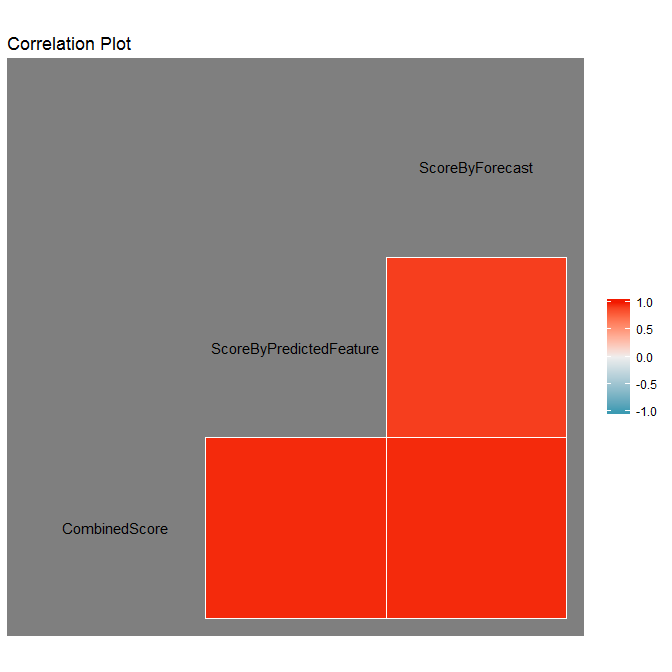<!-- -->

##Stop Cluster

```r
gc()
```

```
##            used  (Mb) gc trigger  (Mb) max used  (Mb)
## Ncells  3062208 163.6    4703850 251.3  4703850 251.3
## Vcells 22791652 173.9   39803362 303.7 39802536 303.7
```

```r
stopCluster(Cluster)
```
#--------------------------- Conclusion -----------------------------
 
From the data plot, we can see that the trend series of the prediction is an upward trend in the future, 
but compared to the past data, it is considered as an air quality in the future. From the correlation plot, the prediction from 2 ways actually converges to the same prediction, which means that the prediction and the Kernel Score for the data is considered as a plausible solution to be a score in the future, under the assumption that value is correlated to air pollution. 


